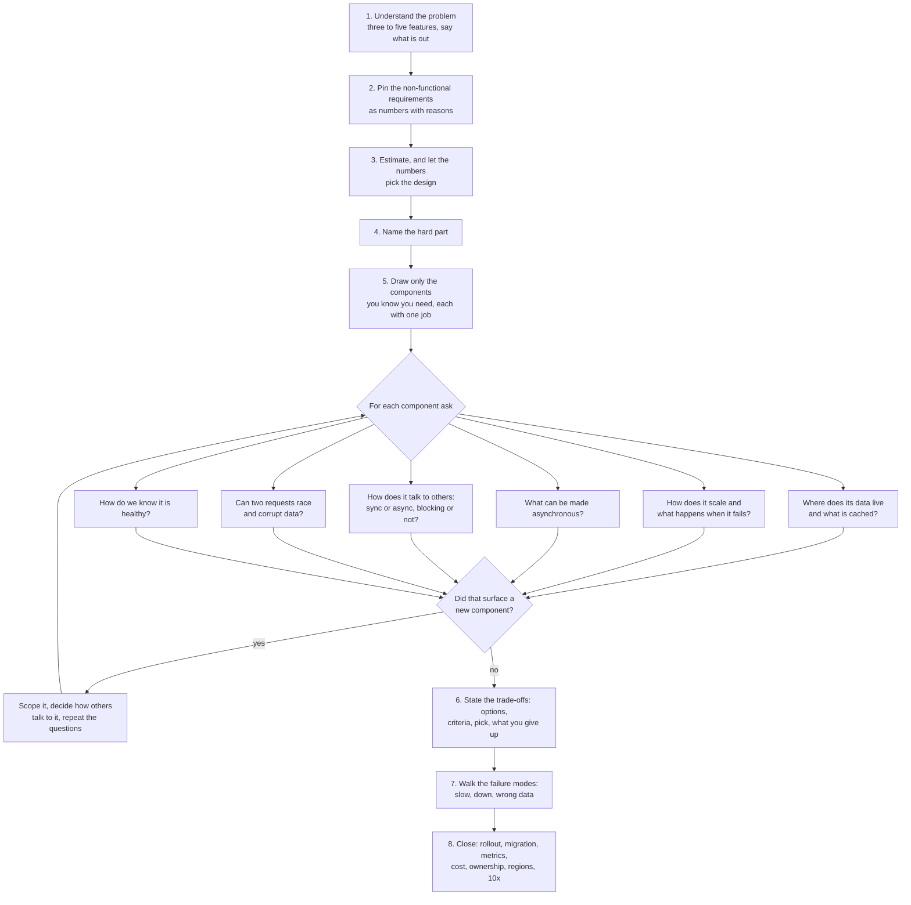
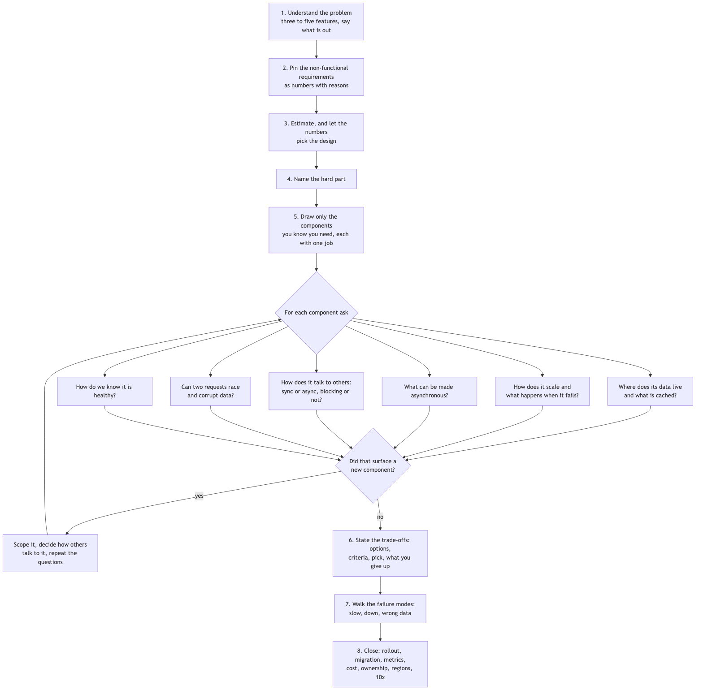

# 00 — How I approach a system design problem

*This is the method behind every design in this folder, written the way I would explain it to someone
preparing for a staff-level round. It combines the book's four-step framework, the principal engineer's
advice to break a problem into components and work each one through a fixed set of questions, and the
expectations laid out in the notes and cheat sheet in this folder.*

## What the interviewer is actually checking

At a senior or staff level nobody is checking whether I can draw a load balancer. They are checking how I
think. Specifically: do I drive the ambiguity by asking questions and stating my assumptions, rather than
waiting to be told what to build? Do I turn vague requirements into numbers, like "p99 under 200
milliseconds" and "99.9% available", and do I know what those numbers cost? Do I estimate, and do the
estimates actually change my design? Do I find the one or two genuinely hard parts and spend my time there
instead of on the standard pieces? When I make a choice, do I name the alternatives, say why I picked one,
and say what I gave up? Do I think about what happens when a component is slow, down, or returns wrong data,
and what happens when two requests race? And do I think past day one: how this gets rolled out, watched,
paid for, and changed later?

Everything below is a habit for producing those signals on purpose.

## The loop I follow

*Vector version: [00-approach-and-framework-1-architecture.svg](diagrams/00-approach-and-framework-1-architecture.svg)*

## Step 1: understand the problem and agree on scope

I never start drawing until I can restate the problem in my own words and the interviewer nods. I ask who
the users are and what clients they use, which three to five features matter, and what I can leave out. I
say out loud what I am excluding so nobody thinks I forgot it. If the problem is huge, I break it into the
features that are obviously required and start there; I do not invent components to look thorough.

## Step 2: pin the non-functional requirements as numbers

For each of these I either ask or pick a number and say it:

How available does it need to be? 99.9% is about 43 minutes of downtime a month; 99.99% is about 4
minutes. Each extra nine costs a lot more, so I want to know which one we are buying.

How fast, at the 99th percentile, not the average? The average hides the slow tail that unhappy users
actually feel.

How consistent, and for which data specifically? Money, inventory and uniqueness constraints need strong
consistency. Feeds, counters and analytics can be eventually consistent. Most systems have both kinds of data
and the design is better when I say which is which.

How durable? Can we ever lose a committed write? For payments, never. For a "last seen" timestamp, a little
loss is fine.

What is the read-to-write ratio? A feed is a hundred reads per write; a logging pipeline is nearly all
writes. This single number decides whether I am caching reads or sharding writes.

What is the scale now and in two or three years?

I then phrase these as service-level objectives with an error budget: "99.9% of feed loads under 300
milliseconds over 30 days" means I am allowed to miss on 0.1% of them, and when I have budget left I ship,
and when I have spent it I stop and fix reliability.

## Step 3: estimate, with a one-line reason for each number

Daily users times actions per day divided by roughly 100,000 seconds gives average requests per second;
peak is two to five times that. Events per day times bytes per event gives storage per day; times 365 and
times the replication factor gives yearly storage. Then I compare against what one machine does: a
relational primary handles a few thousand writes a second and a few terabytes comfortably; a web server
handles a few thousand simple requests a second; one Redis node does about 100,000 operations a second; a
cross-region round trip costs 100 milliseconds or more; S3 has high latency per request but enormous
throughput when you read big objects in parallel.

The point of estimating is not the arithmetic, it is the sentence that follows: "two thousand requests a
second on 400 gigabytes fits one primary with replicas, so I will not shard yet" or "two hundred thousand a
second on 100 terabytes does not, so sharding is a day-one decision." I say which side of the line I am on.

Useful constants I keep in my head: about 100,000 seconds in a day; SHA-256 is 32 bytes and there is no
such thing as SHA-128; a Bloom filter needs roughly 10 bits per key for a 1% false positive rate; Redis
Cluster has 16,384 hash slots; a TCP connection costs one round trip to set up and two with TLS.

## Step 4: name the hard part

Most of any system is standard. I say which one or two things make this particular problem non-trivial, for
example "fan-out to ten million followers" or "two users swiping on each other at the same instant", and I
make sure most of my time goes there. Interviewers notice when someone spends twenty minutes on the load
balancer and two on the hard part.

## Step 5: draw the components and work each one through six questions

I draw only the boxes I know I need, and for each I say what it alone is responsible for and who would own
it. Then for every component I ask the same six questions.

Where does its data live, and what do we cache? I write down the top queries before I name a store, and I
shape the data so each hot query is one cheap lookup. I choose a shard key with high cardinality, even
spread, and presence in the hot queries. For caches I say the pattern (usually cache-aside, sometimes
write-through), the expected hit ratio, how we invalidate (usually delete on write plus a short TTL), how we
avoid a stampede (per-key locks, jitter on TTLs), and what the database does if the cache dies.

How does it scale and what happens when it fails? Stateless or stateful. Read replicas fix read load; only
sharding fixes write load. I pick semi-synchronous replication as the usual middle ground. On failover the
old primary must be fenced or we get two primaries. Does it fail open or fail closed, and did we decide that
before the outage?

What can be asynchronous? Anything that is long-running, fan-out, third-party, or retryable leaves the
critical path and goes through a queue. Queues deliver at least once, so every consumer must be idempotent,
and I write the idempotency key in the same transaction as the work. Failed messages go to a dead-letter
queue after a few retries with exponential backoff and jitter. I alarm on the age of the oldest message, not
on queue depth. And writing to a database and then publishing to a queue is not atomic; I use a
transactional outbox or change-data-capture.

How does it talk to the others? REST at the edge and gRPC between services. WebSockets when both sides talk
constantly, server-sent events when only the server pushes, long polling as a fallback. Every remote call has
a timeout set from the dependency's p99 plus headroom, a client-side circuit breaker, and a retry budget.

Can two requests race and leave the data wrong? Read-then-write in application code loses updates; I let
the database do the arithmetic, or use a version column with compare-and-set, or lock the rows I read. Under
replication lag I route a writer's reads to the primary briefly so they see their own writes.

How do I know it is healthy? Three to five metrics tied to the SLOs, each with an alarm and an owner; a
request ID in every log so one failure can be traced across components; and for each component the one
metric that matters most, like hit ratio for a cache, lag for a queue consumer, replication lag for a replica.

## Step 6: state trade-offs in four beats

For every choice that is not obvious I use the same shape: here are the options, here are the criteria that
matter for this system, here is the one I pick and why, and here is what I give up by picking it. For
example: "Feed storage: build on read or precompute on write. Reads are a hundred times writes and must be
fast, so I precompute for normal users. I give up write efficiency for celebrities, so accounts over a
million followers fall back to build-on-read and merge at read time."

## Step 7: walk the failure modes

For each component I ask what happens if it is slow, if it is down, and if it returns wrong data; what the
user sees in each case; and what we do about it. One sentence each. The decision I most want to have made in
advance is fail-open versus fail-closed.

## Step 8: close with how it lives in production

Rollout behind a flag to one percent of traffic with a rollback. Data migration by dual-writing, backfilling,
verifying, then cutting over. The handful of metrics and alarms that map to the SLOs. The two or three biggest
cost line items and what I would trim first. Which team owns each component. Which components are regional
and which are global, and what happens when a region is lost. And what breaks at ten times the scale and what
replaces it, which is the strongest way to end because it proves I understand the limits of what I just
drew.

## Timing in a 45-minute round

Roughly five minutes on requirements, five on estimates, ten on the high-level picture, twenty on the hard
part with trade-offs and failure modes, five on rollout and operations. If I run out of time I cut breadth,
not the hard part. If the interviewer pulls me into a deep dive early, I follow them.

## Mistakes that get probed

A 301 redirect is cached by browsers, so if you need analytics or control, use a 302. Kafka does not fix
the "write to the database then publish" problem; an outbox or CDC does. A circuit breaker is a state machine
inside the caller, not a flag table that services poll. Repeatable Read does not protect you from lost
updates or write skew. HTTP/1.1 keeps connections open by default; its real limit is head-of-line blocking.
TCP teardown is four packets. S3 is high-latency but high-throughput, and it has been strongly consistent
since 2020. Elasticsearch is a search index, not a primary store. Bloom filters use several hash functions
and cannot delete. Consistent hashing without virtual nodes gives uneven load and doubles a neighbour's load
on failure. Read replicas do not scale writes. A backup that has never been restored is a hope.

---

# Writing guide: how every design document in this folder is written

*This part exists so that a future session, or a different author, can produce a new design document that
matches the twelve here in voice, depth and structure without having read them. Follow it literally.*

## The voice

Write the way a senior or staff engineer talks when explaining a design to a colleague across a table. That
means complete sentences with a subject and a verb, in the first person where a decision is being made ("I'd
pick", "I'd give up", "I want to say this out loud"), and in plain words. Every sentence should be one a
person could say aloud in an interview without sounding like they are reading a slide.

Concretely, this means the following rules.

Never write a label followed by a list of nouns. "In: layer-7 limiting, flexible rules, distributed
enforcement, 429 contract" is a slide fragment. Write instead: "I'm going to build the thing that sits in
front of HTTP APIs and makes an allow-or-deny decision per request. That includes the rules, how counters are
kept across many servers, what a rejected client sees, and what happens when the limiter itself is unhealthy."

Never state a conclusion without its reason. "Hybrid, not either/or" says nothing. Write: "I'll precompute the
feed for the normal case and compute it on the fly only where precomputing would be too expensive. When most
users post, we push the post ID into their followers' feeds immediately; when a celebrity posts, we don't, and
readers pull celebrity posts in at read time."

Never chain clauses with semicolons or slashes as a substitute for sentences. "Redis (atomicity); Memcached
fine too" becomes "Redis or Memcached both work here because the access is plain get and set; I'd use Redis
simply to run one fewer technology."

Never use an arrow chain to describe a flow. Narrate it: "The user hits publish. The web server calls the post
service, which in a single database transaction inserts the post and an outbox row. We return 201 right there."

Avoid tables except in three places: API listings, schemas, and a side-by-side comparison of algorithms or
approaches where seeing them in parallel genuinely helps. Even then, write table cells as short sentences,
not keywords. Everything else is prose.

Prefer spelled-out numbers in prose ("about four hundred a second") and digits in schemas and estimates where
precision matters ("62^7 = 3.5 trillion"). Avoid abbreviations the reader might have to decode; write "point-
in-time recovery" rather than "PITR" on first use.

Keep the depth. The problem with the earlier drafts was delivery, not content. Every technical fact that would
appear in a dense version must still appear here, just inside sentences that carry its reasoning.

## The four-beat rule for every decision

Any time the document picks one thing over another, the paragraph must contain four beats, in this order:
the options considered, the criteria that matter for this particular system, the pick with the reason tied
to a requirement or a number, and what is given up by picking it.

A sample that meets the bar:

> For the fan-out bus I'd pick Kafka over SQS or RabbitMQ. The deciding reasons are that partitioning by
> author gives me ordering per author for free, that retention lets me replay events to rebuild feeds after an
> incident, and that more than one consumer needs the same events: the fan-out workers, the notification
> platform, and later a search indexer. SQS is simpler to run and I'd pick it if only one consumer existed and
> ordering did not matter.

A sample that does not meet the bar, and why: "Kafka (ordering, replay, multi-consumer)." It has the options
implicitly and the criteria as keywords, but no sentence a person could say, no link to this system's
requirement, and nothing about what is given up.

This rule applies to every database choice, every tool choice, every algorithm choice, and every architectural
choice such as push versus pull or library versus service.

## The failure-mode rule

For each component, and in a dedicated subsection of the deep dives, say what happens when it is slow, when
it is down, and when it returns wrong data. Each case is one or two sentences in the shape: what breaks, what
the user sees, what we do about it. State explicitly whether the component fails open or fails closed and why
that was decided in advance.

A sample:

> If the graph service is slow, fan-out lags. For reads, I'd fail closed on blocks, because if I cannot
> confirm the block list I'd rather show a slightly degraded feed than show someone a post from a person who
> blocked them, and fail open on mutes, which are a convenience.

## The concurrency rule

Every design must say where two requests can race and what makes the data stay correct anyway. The usual
answers, which should be explained rather than named: an atomic operation inside the store instead of
read-then-write in application code; an idempotency key written in the same transaction as the work; a
conditional write or a version column with compare-and-set; a transactional outbox instead of writing to a
database and then publishing to a queue; routing a writer's reads to the primary briefly so they see their own
writes.

## The numbers rule

Every non-functional requirement is a number with a one-sentence reason. "99.9% available" is not enough;
write "99.9%, which is about forty-three minutes of downtime a month, because the feed is the first screen in
the app." Every estimate ends with the sentence it implies: "a single relational primary handles thousands of
writes a second, so the post store is not where the scale problem is." Convert the availability target into
an error budget and say what spends it.

## What each of the seventeen sections must contain

1. **Problem statement.** Two to four sentences restating the problem in the author's own words, including the
   scale numbers given and any constraints the interviewer stated.
2. **Scope.** What we are building, and what we are explicitly not building and why. Name the follow-ups so
   nobody thinks they were forgotten.
3. **Functional requirements.** The three to five behaviours that must work, in sentences. Include the unsaid
   requirements a real system needs, such as consent audit for notifications or abuse handling for a shortener.
4. **Non-functional requirements.** Availability, latency at p99, consistency per piece of data, durability,
   read-to-write ratio, and scale, each as a number with a reason, closing with the error budget.
5. **Design tenets.** The handful of principles that will decide later choices, each stated with its reason, so
   the reader can predict the picks before seeing them.
6. **Back-of-the-envelope estimation.** Requests per second average and peak, storage per day and year, memory
   for caches, bandwidth where relevant, compared against per-node capacity, each line ending in what it
   decides. This section ends with a paragraph titled "The hard part" naming the one to three things that make
   this system non-trivial.
7. **System components and services.** One paragraph or sentence per component saying what it alone is
   responsible for and which team owns it. Then dissect the most complex component into its internal steps.
8. **Architecture and flows.** One Mermaid flowchart of the components and one Mermaid sequence diagram of the
   main flow, each followed by a narrated walk-through of the same flow in prose.
9. **Communication between services.** For each edge: synchronous or asynchronous, blocking or not, the
   timeout and retry posture, and why. Call out the dual-write problem wherever a database write and a queue
   publish sit next to each other.
10. **Deep dives.** Two to seven subsections spending time on the hard part: the central algorithm or
    structure, the key trade-off in four beats, correctness under concurrency, and a failure-modes subsection.
11. **API design.** A code block listing endpoints with request and response shapes, followed by a sentence or
    two on anything non-obvious such as cursors or idempotency headers.
12. **Data model.** A code block with tables, keys and indexes, then prose on relationships and on the query
    patterns each table exists to serve, including the shard or partition key and why it was chosen.
13. **Database choices.** For each piece of data, the four beats: stores considered, criteria from the queries
    and scale, the pick, what is given up. Default to managed relational unless a measured need says otherwise,
    and say so.
14. **Tools and technologies.** The four beats for each tool class: queue versus stream, cache product, RPC
    style, transport, resilience approach, batch or stream engine, and anything specific to the domain.
15. **Metrics and monitoring.** The two or three indicators tied to the SLOs, then the per-component health
    metrics, then the alarms with their thresholds, each with a sentence on what a bad value means.
16. **Notification and logging.** What is logged and at what sampling, how a request is traced across
    components, what pages a human versus opens a ticket, and what the system tells its own users.
17. **CI/CD, cost, operations, and what comes next.** Rollout with its rollback, data migration pattern,
    backups with recovery point and recovery time and restore drills, the two or three biggest cost line items
    with the levers, ownership boundaries, which components are regional and which are global and what happens
    when a region is lost, and what changes at ten times the scale.

## Length and format

A finished document runs roughly two and a half to four and a half thousand words, which is ten to twenty
minutes of reading. That is longer than a candidate would say in an interview, and that is fine: each section
is something they *could* say, and they choose what to say based on where the interviewer pushes. If a
section is under three sentences it is probably a list in disguise; expand it or ask whether it belongs.

Start each document with a one-line italic note: "Written as I would talk through it in a design discussion,
with the reasoning behind each choice." Use the seventeen numbered section headings exactly. Use `###`
subsections numbered 10.1, 10.2 and so on inside the deep dives.

## Mermaid rules learned the hard way

Mermaid sequence diagrams treat a semicolon as the end of a statement, so never put a semicolon inside a
message or note; use a comma or a full stop. Flowchart node labels cannot contain a pipe character or curly
braces; write "feed:user" rather than "feed:{user}" and spell out "shl" or "OR" instead of using operators.
Keep labels short and use ` ` for line breaks. Render every diagram with mermaid-cli before calling the
document done.

Every Mermaid block is followed by a pre-rendered image so the document reads on viewers that do not render
Mermaid, which includes most iOS apps. The convention: render the block with
`npx -p @mermaid-js/mermaid-cli mmdc -i block.mmd -o diagrams/<doc>-<n>-<kind>.png -b white -s 2` and
again with a `.svg` output, where `<kind>` is `architecture` for the component flowchart and `flow` for the
sequence diagram. Directly under the closing fence put `` and
on the next line `*Vector version: [<file>.svg](diagrams/<file>.svg)*`. The PNG is the inline image because
mermaid-cli's SVGs draw their text with HTML foreignObject elements, which many mobile and sandboxed markdown
viewers strip, leaving boxes with no labels; the SVG is kept as a link for anyone who wants a scalable copy.

## The procedure for producing a new design document

First, read the source chapter or problem statement in full and write down every number it gives and every
constraint the interviewer states. Second, read the cheat sheet card for the system if one exists, and the
relevant building-block sections, and list the specific points they expect to see; those become a checklist.
Third, write the seventeen sections in order, in the voice above, pausing at every decision to write all four
beats. Fourth, run the audit below. Fifth, render the diagrams and count the sections.

## The audit to run before calling a document done

Read the cheat sheet's closing checklist and confirm each item is present in prose: components with exclusive
responsibilities and owners; the six questions answered per component; failure modes as slow, down and wrong
data with what the user sees and what we do; SLOs with an error budget and alarms tied to them; a rollout and
migration plan with a rollback; the two or three biggest cost items; regional versus global components and the
loss-of-a-region behaviour; and what breaks at ten times the scale. Then check the building blocks that apply:
if there is a cache, the hit ratio, stampede handling, hot-key handling, invalidation and the cache-down plan
are all stated; if there is a queue, at-least-once with idempotent consumers, dead-letter handling, backoff
with jitter, the age-of-oldest-message alarm, and the outbox are stated; if there are replicas, the
replication mode and read-your-own-writes are stated; if there is sharding, the shard key and the reason; if
there is durable data, backups with recovery point and time and a restore drill; for every remote call, a
timeout and a breaker. Finally, scan for the misconceptions the cheat sheet lists and make sure none appear.
Fix anything missing before finishing; do not report a gap as a note for later.
