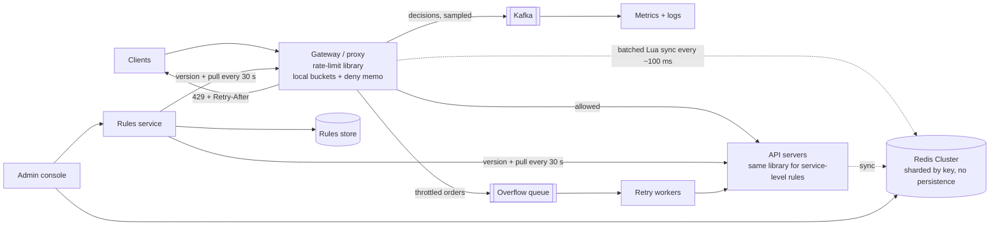
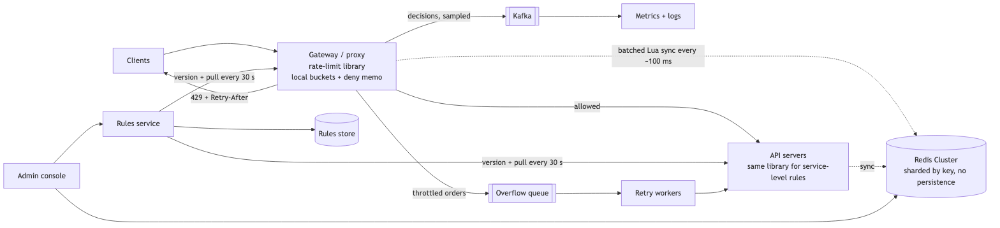
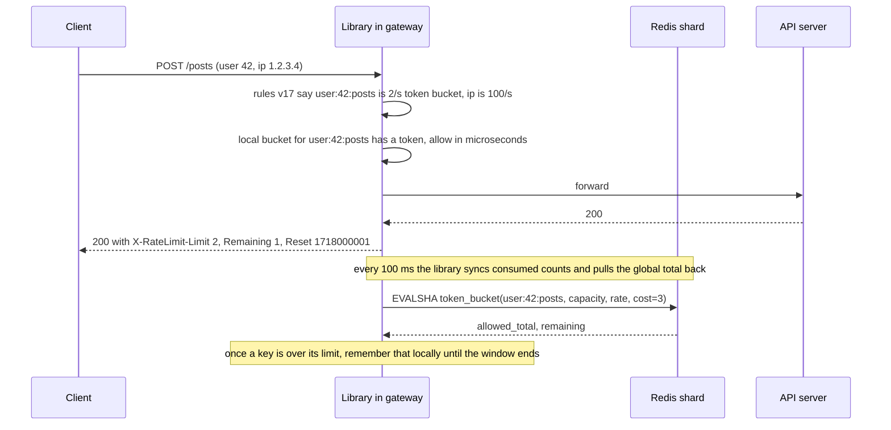

# 01 — Design a Rate Limiter (book ch. 4)

*Written as I would talk through it in a 45–60 minute design discussion: what I'd say, why I'd make each
call, and what I give up by making it.*

## 1. Problem statement

We need a server-side rate limiter for our APIs. It caps how many requests a client can make in a window,
where a client might be a user, an IP address, an API key, or a device. When a client goes over, we reject
the excess with a clear error and tell them when to try again. Teams should be able to set limits at a
granular level, the whole thing has to work across a horizontally scaled fleet, and it must not add
noticeable latency or become the one dependency that takes the platform down.

## 2. Scope

I'm going to build the thing that sits in front of HTTP APIs and makes an allow-or-deny decision per
request. That includes the rules, how they are stored and changed, how counters are kept across many
servers, what a rejected client sees, what happens when the limiter itself is unhealthy, and how we run it in
several regions. I'm leaving out client-side limiting, because clients can be forged and we may not control
them; network-level defences against volumetric attacks, which belong at the edge in iptables or a DDoS
scrubbing service; and billing or quota accounting, which is a different system that happens to count
things.

## 3. Functional requirements

A rule looks like "in the auth domain, for login attempts, allow 5 per minute, and if the limiter cannot
decide, deny." Rules can key on different things: user, IP, API key, endpoint, or a global bucket. One
request may be checked against several rules at once, and if any says no, the answer is no. Every response,
allowed or not, carries headers that tell the client the limit, how many requests are left, and when the
window resets; a rejection is a 429 with a Retry-After header. Rules can be changed without redeploying
services, and a new rule can run in shadow mode, where we log what it would have blocked without actually
blocking anything. For a few domains, like orders during a sale, we may want to queue rejected requests for
later instead of dropping them.

## 4. Non-functional requirements

Latency first, because this runs in front of every request. I'd budget a p99 of one millisecond added, with
a hard cap of five, because the services behind it have their own budget of maybe a hundred milliseconds and
I should not eat a meaningful slice of it.

Availability has to be higher than the services it protects, otherwise it becomes their worst dependency. I'd
aim at 99.99% for "the check returns an answer", and the answer when it cannot decide is a design decision
I'll make explicitly.

Consistency can be approximate, and I want to say that out loud because it unlocks the cheap designs.
Admitting 105 requests when the limit is 100 is fine; admitting a thousand is not; rejecting a client who was
under their limit is worse than either.

Durability: none. Counters live for one window. If we lose the counter store, everyone gets a fresh window,
which is annoying rather than dangerous. That means I can turn off persistence on the counter store.

Read-to-write ratio is unusual here: every check is a write, because it increments something. So read
replicas do not help; only sharding does.

Scale is "every request on the platform", so if the platform does a million requests a second, so do we.
Memory is not the constraint; a hundred million keys at twenty bytes is about two gigabytes. Compute and
network are.

Putting the availability number into an error budget: 99.99% for "the check returns an answer" is about four minutes a month of no answer. Every fail-open event spends that budget, so I alarm when fail-opens exceed a small fraction of it, and if we have spent the month's budget we stop shipping rule changes and library releases until reliability is back.

## 5. Design tenets

I'd build this as a library embedded in the gateway and the services rather than as a separate service,
because a separate service adds two network hops to every request and a fleet to run. I'd keep the counters
in memory in Redis and do the read-modify-write inside Redis with a Lua script, never in application code,
because application-side increments race. I'd use Redis's clock, not the application servers' clocks, because
hundreds of servers have hundreds of slightly different clocks. I'd make decisions locally on each server and
reconcile with Redis in the background, accepting a few percent of over-admission for a hundredfold less load
on Redis. I'd fail open by default with an alarm, and fail closed only where over-admission is dangerous.
And I'd treat rules as data with validation and staged rollout, because a bad rule can block everyone.

## 6. Back-of-the-envelope estimation

Say the platform peaks at a million requests a second and each request is checked against about three rules.
If every check hit Redis, that is three million operations a second. One Redis node handles around a hundred
thousand, so we would need thirty-plus shards just for the limiter. If instead each server keeps local
counters and syncs them to Redis every hundred milliseconds, Redis sees one batched call per server per key
per hundred milliseconds, which cuts its load by roughly a hundred times, down to a handful of shards.

Memory: a hundred million keys at twenty bytes is two gigabytes for simple counters, or around six gigabytes
if each is a small token-bucket hash. Trivial. A sliding-window log, which stores a timestamp per request,
would need a thousand entries for a thousand-per-minute limit, so memory grows with the limit; at this scale
I rule it out for general use.

How much do we over-admit with the local tier? At most one sync interval's worth of traffic across all
servers. For a thousand-per-minute limit and a hundred-millisecond sync, that is a few percent, which fits
the "approximate is fine" requirement.

**The hard part**, which I'd name here: there are two. One is being correct enough while staying off the
critical path. Every exactly-correct design, a single global counter updated synchronously, adds a network
round trip to every request and makes Redis a single point of failure for the platform. Every fast design
with local counters over-admits. The interview is about choosing a point on that line and defending it. The
other is behaving well when the limiter itself is sick. The limiter exists for bad days; if it falls over on a
bad day, it has made the outage worse.

## 7. System components and services

The rate-limit library lives inside the gateway and inside each service. It extracts the descriptors from a
request, matches them against the rules it has cached locally, decides using a local token bucket, sets the
response headers, and in the background syncs its consumed counts to Redis. It also remembers keys that are
already over their limit so repeat offenders are rejected in microseconds without touching Redis. The
platform team owns it.

The rules service and its store let teams create, edit and version rules. It validates them (no duplicate
descriptors, a floor below which a limit cannot go, so nobody sets a limit of zero by accident), supports
shadow mode and staged rollout, and publishes a rule-set version that the libraries pull. The platform team
owns the service; each service team owns the values of its own rules.

The counter store is a Redis cluster, sharded by key, with persistence off and replicas used only for
failover.

A small admin console lets engineers inspect and reset counters, see who is being blocked, and look at the
health of the Redis fleet. It is low-throughput and not on any hot path.

A telemetry pipeline collects allow, deny and fail-open decisions so we can tune rules.

Optionally, an overflow queue per domain holds rejected-but-retryable requests, owned by the domain team
that asked for it.

## 8. Architecture and flows





*Vector version: [01-rate-limiter-1-architecture.svg](diagrams/01-rate-limiter-1-architecture.svg)*





*Vector version: [01-rate-limiter-2-flow.svg](diagrams/01-rate-limiter-2-flow.svg)*


The way I'd narrate it: a request arrives at the gateway. The library pulls the user ID and IP out of it,
finds the matching rules in its local copy of the rule set, and checks its local token bucket for each. In
the common case that is an in-memory operation taking microseconds, and the request is forwarded with the
rate-limit headers attached. Every hundred milliseconds or so, in the background, the library tells Redis how
many tokens it consumed for each key and learns the global picture, adjusting its local allowance. When a key
goes over its limit, the library notes that locally so the next thousand requests from that client are
rejected without a single Redis call.

## 9. Communication between services

The client-to-gateway call is a normal synchronous HTTP request, and the decision inside it is a local
function call.

The library's talk with Redis is asynchronous and batched, off the request path. The one time it needs to
ask Redis synchronously is the first time it sees a key; that call has a two-to-five-millisecond timeout, and
a timeout counts as "fail open and emit a metric". I want to be emphatic about the timeout: a rate limiter
without one is a latency amplifier, because when Redis slows down, every request on the platform slows down
with it.

Rules reach the libraries by a pull every thirty seconds with a version tag, plus an optional pub/sub nudge
that says "version 18 is out". The push makes changes fast; the poll makes them certain, because pub/sub can
drop a message. Neither is on the request path.

Telemetry is fire-and-forget. The overflow queue, where used, is at-least-once with an idempotency key on
each message so a retried order is not placed twice.

## 10. Deep dives

### 10.1 Choosing the algorithm

There are five candidates and I'd compare them on memory per key, accuracy, and how they treat bursts.

A fixed window keeps one counter per window and is ten lines of code, but it lets twice the limit through
at a window boundary: a hundred requests at 10:00:59 and a hundred more at 10:01:00 are both allowed.

A sliding-window log stores a timestamp per request in a sorted set and is exact, but memory grows with the
limit, so a thousand-per-minute rule costs a thousand entries per key.

A sliding-window counter blends the previous and current fixed windows weighted by how far into the current
window we are. It uses two integers, smooths the edge problem, and is approximate; Cloudflare measured about
0.003% of requests wrongly decided, which is fine.

A token bucket holds up to B tokens refilled at rate r; each request takes one. It allows a burst of B then
settles to r, uses two numbers per key, and is what Amazon and Stripe use because that burst behaviour is
what human-driven clients actually look like.

A leaky bucket queues requests and drains them at a fixed rate. Its output is perfectly smooth, but requests
wait in the queue, which adds latency. It is better for shaping outbound traffic to a fixed-rate downstream
than for API limits.

My pick: token bucket for user and API-key limits, sliding-window counter where a rule must say "no more than
N in any rolling minute" cheaply, and the log only for low-volume, high-stakes rules like login attempts.
What I give up with the token bucket is the exact rolling-window guarantee; I accept bursts up to the bucket
size.

### 10.2 Counting correctly

The naive library code is "get the count, if it's under the limit, set count plus one." Across many servers
that races: two servers both read 99, both decide they are under 100, both write 100, and 101 requests got
through. Under heavy load the over-admission is far more than one. The fix is to move the whole
read-check-write into Redis, which is single-threaded per shard, as one Lua script. For a fixed window that
is an INCR plus an EXPIRE set only when the returned count is one; MULTI/EXEC cannot branch on a result,
which is why Lua is the usual tool. For the token bucket the whole refill-check-consume lives in one script.

I'd also use Redis's own clock inside the script. If each application server computed "which window are we
in" from its own clock, the same user would land in different windows on different servers and the limit
would go fuzzy.

A sketch of the token bucket script:

```lua
-- KEYS[1] is the bucket; ARGV: capacity, refill_per_ms, cost
local now = redis.call('TIME'); now = now[1]*1000 + math.floor(now[2]/1000)
local b = redis.call('HMGET', KEYS[1], 'tokens', 'ts')
local tokens = tonumber(b[1]) or tonumber(ARGV[1]); local ts = tonumber(b[2]) or now
tokens = math.min(tonumber(ARGV[1]), tokens + (now - ts) * tonumber(ARGV[2]))
local ok = tokens >= tonumber(ARGV[3]); if ok then tokens = tokens - tonumber(ARGV[3]) end
redis.call('HSET', KEYS[1], 'tokens', tokens, 'ts', now)
redis.call('PEXPIRE', KEYS[1], math.ceil(tonumber(ARGV[1]) / tonumber(ARGV[2])))
return {ok and 1 or 0, math.floor(tokens)}
```

### 10.3 The local tier

To get the Redis round trip out of the hot path, each server keeps a local token bucket per key sized to its
share of the global limit, roughly the limit divided by the number of servers with a little extra for uneven
routing. Requests are decided locally in microseconds. Every hundred milliseconds the server syncs its
consumed counts to Redis in one batched call and pulls the global total back, adjusting its local allowance.
The effect is that added latency drops to nearly nothing, Redis load drops by about a hundred times, and a
brief Redis blip is absorbed without anyone noticing. The cost is over-admission of up to one sync interval
of traffic, a few percent, which we already said is acceptable. This is how Envoy's rate-limit service with
local caching and the cloud API gateways actually work; the "every request hits Redis" version is the
teaching scaffold.

### 10.4 Hot keys

A hot key is usually exactly the client we want to reject. Once a key is over its limit, remember that
locally for the rest of the window and stop asking Redis about it. For a legitimately huge tenant, split the
limit across sub-keys, tenant:0 through tenant:9 each with a tenth of the limit, so the load spreads across
shards; the cost is slight under-admission when the tenant's traffic is uneven. I'd alarm on any shard whose
command rate is far above the average, because that is a hot key.

### 10.5 Failure modes

If Redis is unreachable, the default is to fail open: let requests through, keep using the local bucket with
its last known allowance, and alarm loudly. For login, password reset and payment initiation, where letting
extra requests through is dangerous, the rule says fail closed and we return 429 to everyone on that rule.
This is configured per rule, in advance, not improvised during an incident.

If Redis is slow rather than down, that is the cascade that takes the site down. The tight timeout treats
slow as unavailable and we fall into the fail-open path.

If one shard dies, only the keys on it are affected and Redis Cluster promotes its replica in seconds. A
bulkhead per shard means one bad shard does not stall calls to the healthy ones, and a client-side circuit
breaker per shard, closed, open, half-open, means that after a few timeouts we stop calling that shard at all
and fail open in microseconds instead of waiting for each timeout to expire.

If someone pushes a bad rule, the validation floor stops a zero limit, shadow mode shows who would be blocked
before enforcing, rollout goes to one percent of gateways first, and revert is flipping back to the previous
version.

If a client ignores the 429 and retries in a loop, the Retry-After header tells well-behaved clients what to
do and the local deny memo rejects the badly behaved ones in microseconds.

If a library has a stale rule cache, it enforces old limits for up to thirty seconds. Rule sets are versioned
and I alarm if instances disagree for more than two minutes.

## 11. API design

The enforcement is invisible except for headers, which appear on allowed responses too so clients can slow
down before hitting the wall: X-RateLimit-Limit, X-RateLimit-Remaining, X-RateLimit-Reset, and on a
rejection a 429 with Retry-After and a body like `{"error":"rate_limited","retry_after_ms":1200,
"rule":"auth/login"}`.

The management API:

```
POST   /v1/ratelimit/rules      {domain, descriptors:[{key, value}], limit, unit, algorithm,
                                  capacity?, fail_mode: open|closed, mode: shadow|enforce}
GET    /v1/ratelimit/rules?domain=auth     PUT / DELETE /v1/ratelimit/rules/{id}
POST   /v1/ratelimit/rules/{id}/rollout {percent}    POST /v1/ratelimit/rules/{id}/revert
GET    /v1/ratelimit/usage?key=user:42:posts  -> {limit, remaining, reset_at}
POST   /v1/ratelimit/reset?key=...  (admin, audited)
```

If a polyglot fleet forces a sidecar instead of a library, the gRPC contract is one call:
`ShouldRateLimit(domain, descriptors, hits) -> {OK or OVER_LIMIT, limit, remaining, retry_after_ms}`.

## 12. Data model

Rules are a small relational table:

```
rules(rule_id PK, domain, descriptor_key, descriptor_value NULL, limit INT, unit, algorithm,
      capacity INT NULL, fail_mode, mode, rollout_pct, version INT, updated_by, updated_at)
      UNIQUE (domain, descriptor_key, descriptor_value)
rule_audit(rule_id, version) PK, diff JSON, actor, ts
```

Counters are Redis keys with TTLs: a hash of tokens and timestamp per token bucket, a plain counter per
window for sliding-window counters, a sorted set for the rare sliding-window log. Every operation on the hot
path is a single-key, single-shard operation; there are no scans and no joins, and TTLs bound the key count.

## 13. Database choices

For the counters I considered Redis, Memcached, a relational database, and purely in-process memory. The
criteria are an atomic multi-step operation, TTL expiry, around a hundred thousand operations a second per
node, sharding, and no need for durability. Redis Cluster meets all of them; Memcached is multi-threaded and
simpler but has no Lua and no sorted sets, so the increment races; a relational database puts a disk round
trip on every request; and in-process memory alone gives no cross-server view. I pick Redis with persistence
off and replicas for failover only. What I give up is Memcached's raw per-node throughput, which I do not
need once the local tier exists.

For the rules, which are thousands of rows that change rarely and need an audit trail and a uniqueness
constraint, a managed relational database is the right default. DynamoDB would also work but its advantages
are irrelevant at this size.

For decision telemetry, which is high-volume and append-only and which we want to replay when tuning, Kafka
feeding a columnar store is the right shape; an OLTP table would not keep up and would not be useful for the
queries we ask.

## 14. Tools and technologies

Placement: library versus standalone service versus sidecar. The library wins on hops and on not having a
fleet to run; its cost is that every language needs its own implementation and there is no single deploy for
a logic change. A sidecar like Envoy's rate-limit filter gets language independence back at the price of a
hop and a proxy to run. I'd pick the library where the gateway and services share a language, and the
sidecar in a polyglot mesh.

Rule distribution: a thirty-second poll with a version tag, plus a pub/sub nudge. I give up a guarantee of
instant propagation, which I do not need.

Telemetry bus: Kafka over RabbitMQ or SQS, because the volume is millions of events a second sampled, I want
replay, and more than one consumer reads it. I give up SQS's zero operations.

Overflow queue: SQS, because per-message visibility timeouts and a dead-letter queue are exactly what a
retry queue needs and ordering does not matter. I give up replay, which I do not need there.

Edge: use whatever API gateway already exists rather than adding one; if the company runs a mesh, Envoy's
filter.

## 15. Metrics and monitoring

The two indicators that map to SLOs are the added latency at p99, which should stay under a millisecond,
and the rate at which the check returns an answer, which should be 99.99%.

Below those I'd watch decisions per rule split into allow, deny, shadow-deny and fail-open. The deny ratio
per rule is the tuning signal: a sudden jump is either an attack or a bad config. Fail-open should be
essentially zero and pages the platform on-call if it exceeds 0.1% for five minutes. On Redis I'd watch p99
latency, timeouts, operations per shard (skew means a hot key), memory, evictions (which should be zero
because TTLs expire keys), and replication lag. I'd sample the drift between local and global counts to see
how much we over-admit. And I'd track the rule-set version per instance and alarm when they diverge.

## 16. Notification and logging

Decisions are logged as structured records, sampled at one percent for allows and in full for denies and
fail-opens, with the key hashed because IPs and user IDs are personal data. Fail-open rate, Redis health and
latency breaches page the platform team. A weekly digest lists rules with zero denies in thirty days, which
are candidates for removal, and rules with very high deny rates, which may be too strict. Every rule change
posts a diff and author to the owning team's channel.

## 17. CI/CD, cost, operations, and what comes next

Rules go through a pull request, schema validation, a day in shadow mode where we see who would have been
blocked, then one percent, then everyone, then enforce; revert is flipping the version. The library is
versioned and rolled to one service at a time with the gateway canaried first.

Redis Cluster migrates hash slots live when we add a shard. Counters in flight may reset, which is fine
because the data is one window old at most.

For multiple regions I'd enforce regional limits rather than a global counter. A global counter costs a
cross-region round trip, a hundred milliseconds or more, on every request, which blows the latency budget.
With regional limits a client spreading traffic across three regions could get up to three times the limit,
which is still bounded, and most clients are routed to one region anyway. The few endpoints that truly need
one global count route to a single region and pay the latency.

Cost is compute-bound Redis. A dozen mid-sized nodes serve a million checks a second without the local tier;
with it, a fraction of that, which is the main cost lever. Persistence stays off.

Ownership: the platform team owns the library, the Redis fleet and the console; each service team owns the
values of its own limits through the console; nobody edits Redis by hand.

At ten times the scale, Redis Cluster adds shards, the sync interval can lengthen or we add a hierarchy of
aggregation, volumetric attacks move to the network edge, and the next features are adaptive limits that
shed load when downstream latency rises, per-tenant tiers, and a client SDK that honours Retry-After with
backoff and jitter.
