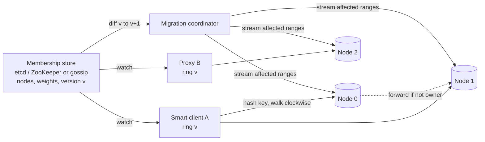
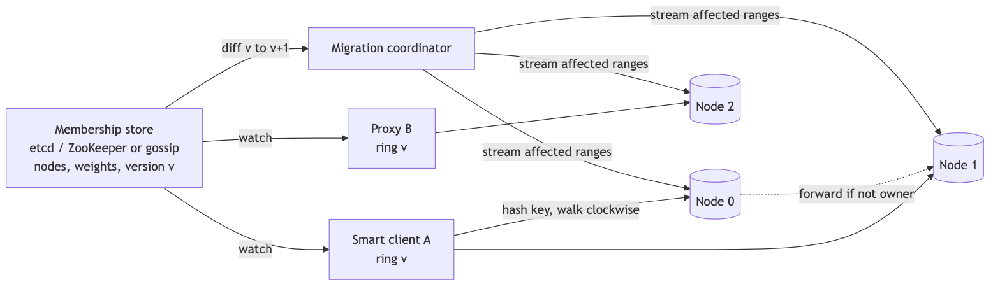
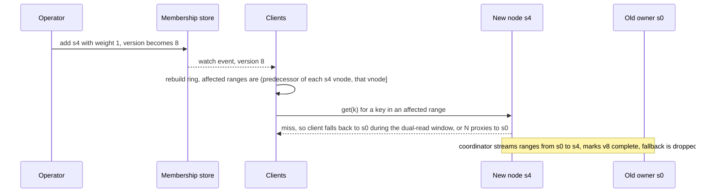

# 02 — Design Consistent Hashing (book ch. 5)

*Written as I would talk through it in a design discussion, with the reasoning behind each choice.*

## 1. Problem statement

We have a set of keys, which could be cache entries, database partitions, hosts a crawler is responsible
for, or users attached to WebSocket servers, and we have a set of nodes. We need to decide which node owns
each key so that the load is spread evenly, and when a node joins or leaves, only a small fraction of keys
change owner. The naive approach, hash the key and take it modulo the number of nodes, remaps almost every key
when the node count changes by one, which in a cache causes a storm of misses and in a storage system causes
a mass migration.

The framing I'd give the interviewer up front: consistent hashing solves data ownership, meaning "who should
own this key." It does not move the data, and it is not a service. It is a function plus a small data
structure that lives inside a proxy or inside each client.

## 2. Scope

I'll cover the ring itself, virtual nodes, how to compute which key ranges are affected by a membership
change, how replication rides on the ring, where the ring lives and how membership changes reach it, the
alternatives to a ring, and hot keys. I'll leave out the mechanics of actually copying data between nodes,
which belong to the storage layer, and the quorum and anti-entropy details, which I cover in the key-value
store design.

## 3. Functional requirements

Given a key, return its owning node, and every client at the same ring version must get the same answer.
Add or remove a node and move only about one-Nth of the keys, and tell the caller which ranges moved so the
storage layer can migrate them. Return the N distinct physical nodes that should hold replicas of a key.
Support nodes of different sizes by giving bigger ones a larger share.

## 4. Non-functional requirements

A lookup runs on every request, so it must be sub-microsecond, which means binary search over an in-memory
array. Load should be balanced to within five or ten percent of the mean across nodes, which the literature
says needs one to two hundred virtual nodes per physical node. The ring should be small enough to hold in
every client and ship on every change: a hundred nodes with a hundred and fifty virtual nodes each is about
fifteen thousand entries, under two hundred kilobytes. And clients should converge on a new ring within a
few seconds; during that window a request may land on the old owner, and the system has to handle it, which
is why the rule is "the ring is a hint, the node is the truth."

As an error budget: if the lookup must answer correctly 99.99% of the time, the only way to spend that budget is a stale ring routing to the wrong owner, which the forward-or-reject rule turns into latency rather than wrong data. I treat the forwarded-request rate as the budget consumption and alarm on it.

## 5. Design tenets

Hash the keys and the nodes into the same space and let a key be owned by the first node clockwise from it.
Get balance from many virtual nodes rather than from a clever hash function. Treat membership as versioned
data that every client computes from locally, with no lookup service on the hot path. For replication, take
the next N distinct physical nodes, because two virtual nodes of the same machine do not count as two copies.
And never trade correctness of ownership for less data movement: a node that receives a key it does not own
forwards it or rejects it.

## 6. Back-of-the-envelope estimation

For the hash I'd use a fast 64-bit non-cryptographic function like MurmurHash3 or xxHash. SHA-1 or MD5 are
uniform too but slower, and there is no adversary here, so cryptographic strength buys nothing. I'd also
mention, because it gets probed, that "SHA-128" does not exist; MD5 is the 128-bit one.

A hundred nodes times a hundred and fifty virtual nodes is fifteen thousand ring points. Each is an 8-byte
position plus a 4-byte index into the node list, about 180 kilobytes total. Binary search over fifteen
thousand entries is fourteen comparisons.

With a hundred virtual nodes per physical node the standard deviation of load is about ten percent of the
mean; with two hundred it is about five percent. Adding one node to a hundred moves about one percent of
keys, versus about ninety-nine percent with modulo.

If membership spreads by gossip, it converges in O(log N) rounds; at one round a second that is a few seconds
for a hundred nodes.

**The hard part** is not the ring, which is two arrays and a binary search. It is that a plain ring gives
uneven arcs and dumps a failed node's whole load on one neighbour, which virtual nodes fix; that membership
has to reach every client and they will briefly disagree; and that hashing spreads keys, not load, so a hot
key still lands on one node.

## 7. System components and services

The hash function has to be uniform, fast, and stable across languages and versions, because changing it
later means remapping every key. I'd fix MurmurHash3 with a fixed seed and treat it as a contract.

The ring is a sorted array of positions and a parallel array of owner indexes. It is immutable; a membership
change builds a new ring and swaps a pointer.

The membership source is the authoritative list of nodes with their weights and a version number. For a
shared library used by many services that is etcd or ZooKeeper; inside a decentralized store like Dynamo or
Cassandra it is gossip.

The ring builder turns membership into a ring and, given two versions, computes which ranges changed owner.

The client library or proxy embeds the ring, watches membership, and routes.

In a storage system there is also a migration coordinator that streams the affected ranges from old owner to
new before flipping the version.

## 8. Architecture and flows





*Vector version: [02-consistent-hashing-1-architecture.svg](diagrams/02-consistent-hashing-1-architecture.svg)*





*Vector version: [02-consistent-hashing-2-flow.svg](diagrams/02-consistent-hashing-2-flow.svg)*


Narrated: an operator adds node s4. The membership store bumps the version and every client's watch fires.
Each client rebuilds its ring and, for each of s4's virtual nodes, knows the range between that virtual node
and its predecessor now belongs to s4. Until the coordinator has copied those ranges, a read that lands on s4
and misses falls back to the previous owner, or s4 forwards it. Once the copy is done the version is marked
complete and the fallback is dropped.

## 9. Communication between services

The ring lookup itself is a local in-memory call. The client talks to the owning node over whatever the data
plane is, Redis protocol or gRPC. Membership changes reach clients asynchronously by watch or by gossip and
are eventually consistent within seconds. Nodes forward misrouted requests to the right owner or answer from
the copy they still hold. The coordinator copies ranges in the background, throttled so it does not starve
foreground traffic, and idempotent by range and version so a restart is safe.

## 10. Deep dives

### 10.1 The two problems with a plain ring, and virtual nodes

With one point per node, two things go wrong. The arcs between nodes are uneven, so one node can own twice
the key space of another, and that is just bad luck you cannot fix. And when a node leaves, its entire arc
goes to the next node clockwise, doubling that one neighbour's load.

The fix is to give each physical node many points on the ring, typically one to two hundred, by hashing
"node-id#0", "node-id#1" and so on. A key is still owned by the first point clockwise, and that point maps
back to its physical node. Averaging over many random positions flattens the arcs. When a node leaves, each
of its arcs is followed by a point belonging to some other node, so its load spreads across the whole cluster
instead of landing on one neighbour. And a machine with twice the memory simply gets twice the points, which
is how weights work. The cost is that the ring grows by the virtual-node factor, which is still tiny, and
rebuilds take a little longer. Cassandra and Dynamo both do this.

### 10.2 Which keys move

When a node is added, for each of its virtual nodes the keys between the previous point on the ring and that
virtual node move from the old successor to the new node. When a node is removed, for each of its virtual
nodes the keys between the previous point and that virtual node move to the next point clockwise, which,
thanks to virtual nodes, belongs to a variety of other physical nodes. Operationally the storage layer
snapshots or streams the range, flips the ring version, then deletes from the old owner. The ring only tells
you what to move.

### 10.3 Replication on the ring

To find the replicas for a key, walk clockwise collecting points until you have N distinct physical nodes,
skipping extra points that belong to a machine you already picked. That list is what the Dynamo paper calls
the preference list. Reads and writes then use a quorum where W plus R is greater than N, for example three
copies, write to two, read from two. If a node is down, its write goes to the next node on the ring as a
hinted handoff and is replayed when it returns. The details live in the key-value store design.

### 10.4 Where the ring lives and how membership propagates

The ring can live in a proxy, which keeps clients dumb and gives one place to update at the cost of an extra
hop and a proxy that must itself be redundant; Twemproxy and Envoy's ring-hash load balancing work this way.
Or it can live in every client, which saves the hop and the box but means every client must learn about
membership changes; Cassandra drivers and Memcached's ketama clients do this. I'd pick the proxy when many
languages need access and the smart client when latency matters and the languages are few.

Membership can come from a small strongly consistent store like etcd or ZooKeeper, which gives watches and
ephemeral nodes for liveness at the cost of running an ensemble, or from gossip, where nodes tell a few random
peers about joins and leaves and the news spreads in O(log N) rounds with no central dependency but a short
window of disagreement. I'd use the config store for a shared library and gossip inside a decentralized
store.

During the disagreement window a request can land on the old owner. Nodes handle it by forwarding to the
right owner or answering from the copy they still have, and I'd version the ring so a node can reject a key
it does not own at a newer version, which prevents writes from silently landing in the wrong place.

### 10.5 Alternatives and when they win

Modulo hashing moves almost everything on a membership change and is only fine for stateless backends like
an API fleet behind a load balancer. Rendezvous hashing computes hash(key, node) for every node and picks the
highest; it needs no ring and removing a node moves only that node's keys, but each lookup is O(nodes), so it
suits small or stable clusters like a CDN tier. Jump consistent hash is a tiny function with no state at all
but can only add or remove the last-numbered bucket. Fixed pre-split slots, which is what Redis Cluster does
with 16,384 hash slots and what people mean by "1,024 logical shards on a few nodes", move whole slots and
give operators explicit control. Maglev builds a lookup table so load balancers get an O(1) hot path. And
bounded-load consistent hashing adds a per-node load cap and spills over to the next node when a key is too
hot.

I'd pick the ring with virtual nodes when nodes join and leave freely and I want replication along it, which
covers most storage and cache uses. I'd pick rendezvous or jump when the cluster is small or stable and I
want zero state, fixed slots when I want operator control over placement, Maglev for a load balancer, and the
bounded-load variant when a few keys are extremely hot.

### 10.6 Hot keys

Hashing spreads keys evenly, but a celebrity's key still gets a celebrity's traffic and it all lands on one
node. Mitigations are salting the key into several copies, key#0 through key#9, spread across nodes and
fanned in on read; using the bounded-load variant; or putting an in-process cache with a one-second TTL in
front. I'd alarm on per-node request and CPU skew, not just totals, because totals hide this.

### 10.7 Failure modes

A client with a stale ring sends requests to the old owner; nodes forward or answer from their copy, and I
alarm if versions disagree for more than thirty seconds. If the membership store is down, no changes are
possible but lookups keep working from the last ring, and the store runs as three or five nodes across
availability zones. A node that flaps in and out churns one-Nth of the keys each time, so I'd add hysteresis
before marking a node down. A misconfigured weight makes one node own most of the ring, so weights are
validated and I alarm when a change moves more than a few percent of the space. And changing the hash
function between versions remaps every key, which is a full migration, so the hash and virtual-node scheme
are frozen and covered by golden tests.

## 11. API design

This is a library, so the API is a few calls:

```
Ring.create(hashFn, vnodesPerUnitWeight = 150)
ring.add(nodeId, weight = 1)   -> Diff{version, moved: [(rangeStart, rangeEnd, fromNode, toNode)]}
ring.remove(nodeId)            -> Diff
ring.get(key)                  -> nodeId
ring.getN(key, n)              -> [nodeId]   distinct physical nodes
ring.version(); ring.serialize(); Ring.deserialize()
```

If a polyglot fleet needs a service form, it is `GET /ring?version=` with an ETag, and clients still
compute lookups locally.

## 12. Data model

Membership lives at `/cluster/<name>/members/<nodeId>` as a leased or ephemeral record holding host, port,
weight, state (joining, active, leaving, dead) and a timestamp, with `/cluster/<name>/version` as a
monotonically increasing integer. The in-memory ring is a sorted array of 64-bit positions, a parallel array
of owner indexes, and a map from node ID to index. The only queries are successor-of-position by binary
search, the diff between two versions, and listing members.

## 13. Database choice for membership

The options are etcd, ZooKeeper or Consul; gossip; a static config file; or a relational or DynamoDB table
with polling. The criteria are consistency of the view, a way to watch for changes, and liveness detection.
The config stores meet all three and I'd pick one for a shared library, giving up the convenience of not
running an ensemble. Gossip is right inside a decentralized store because there is no central dependency,
giving up an instant consistent view. A static file is fine for a small fixed fleet and breaks the moment the
fleet autoscales. A polled table has no watch semantics and leases must be hand-built, so I'd avoid it.

## 14. Tools and technologies

Hash: MurmurHash3 64-bit over SHA or MD5, because it is fast, uniform and available everywhere, and we do not
need cryptographic strength. Ring structure: a sorted array with binary search over a tree map, because it is
cache-friendly and we rebuild on change anyway rather than inserting. Off the shelf: Envoy's ring-hash or
Maglev policy for HTTP and gRPC routing, ketama for Memcached clients, and Cassandra's partitioner inside
Cassandra; I'd only write my own for a system that is itself a storage product.

## 15. Metrics and monitoring

Load per physical node, measured as keys, requests and CPU, with the ratio of max to mean and the standard
deviation, alarming above twenty percent imbalance. Ring version skew across clients and time to converge
after a change. Keys moved per change, which should be about one-Nth, and how long the miss-rate spike lasts
afterwards. The rate of forwarded or misrouted requests, which should drop to zero within seconds of a
change. Rebuild time and ring memory.

## 16. Notification and logging

Every membership change is logged with its version, who made it, what percentage of the space moved and how
long the move took. A change that moves more than a few percent notifies the owning channel because it
probably means a wrong weight. A split view lasting more than thirty seconds, or a forwarded-request rate
that stays high, raises an alarm.

## 17. CI/CD, cost, operations, and what comes next

The library is versioned, and the hash function and virtual-node scheme are frozen; changing either is a
major version and a full data migration. Golden tests pin a fixed set of keys to fixed nodes across every
language implementation, and property tests check that movement stays near one-Nth and balance stays within
bounds. Membership changes are canaried in one region while watching miss rate and forwarded requests, and rollback is publishing the previous membership version, which clients pick up on the next watch event.

Cost is essentially zero for the ring itself; the real cost is data movement, which virtual nodes spread
across the cluster so it happens as many small parallel copies.

For regions, I'd keep one ring per region for data locality and only use a global ring where a key must have
exactly one owner worldwide, accepting cross-region hops there.

At ten times the scale I'd raise virtual nodes per node for finer balance, adopt the bounded-load variant if
hot keys appear, and make replica placement rack-aware so the N copies never share an availability zone.
