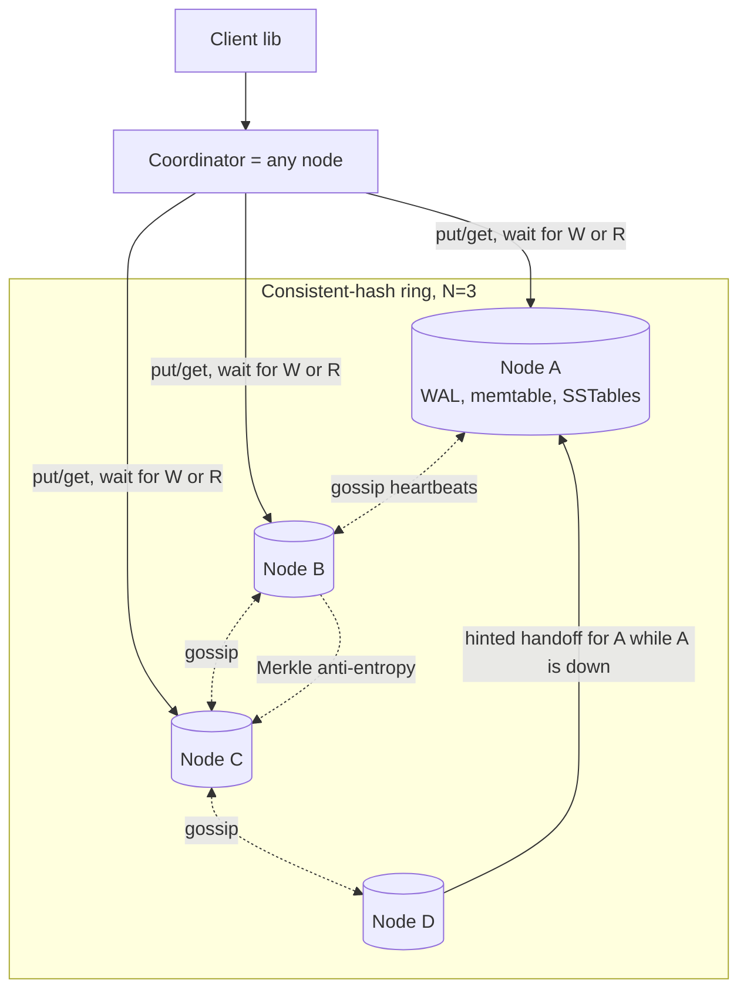
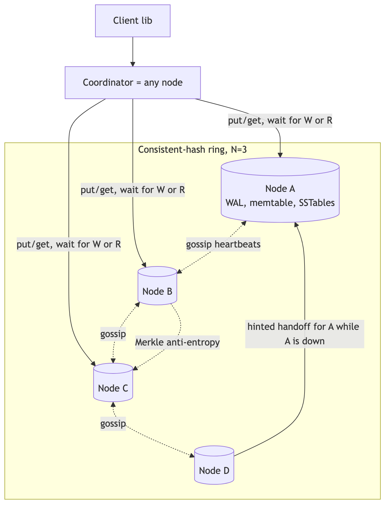
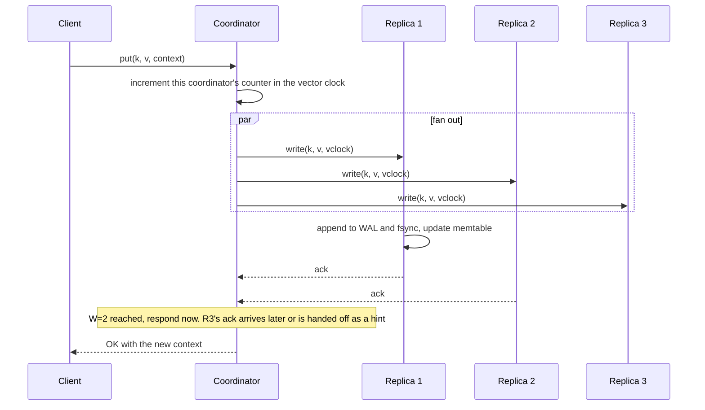
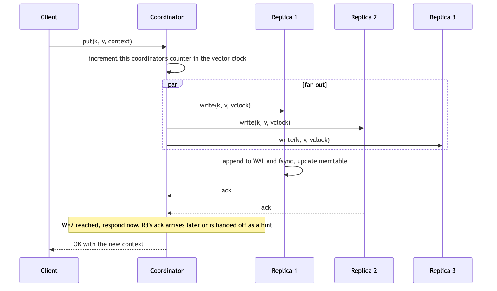

# 03 — Design a Distributed Key-Value Store (book ch. 6)

*Written as I would talk through it in a design discussion, with the reasoning behind each choice.*

## 1. Problem statement

We are building a distributed key-value store in the style of Amazon's Dynamo. It exposes put, get and
delete. It has to hold far more data than one machine can, keep working when nodes fail or the network
partitions, grow by adding commodity machines, and let the application choose, per request, how much
consistency it wants in exchange for latency and availability.

## 2. Scope

I'll cover how data is partitioned, how it is replicated, how the client tunes consistency, how we resolve
conflicting writes, how nodes detect each other's failure, how we handle a node that is down briefly versus
one that is gone for good, what the storage engine on each node looks like, and the read and write paths end
to end. I'll leave out secondary indexes, transactions, range scans and SQL, which are different products,
and I'll only touch multi-region far enough to say what the conflict rule would be.

## 3. Functional requirements

Put a key with an opaque value up to ten kilobytes and a context that carries causality; get a key and
receive one or more versions; delete a key. Let the application set N, W and R per table or per request,
where N is how many copies we keep, W how many must acknowledge a write, and R how many we read. Add and
remove nodes while the system is serving traffic, with rebalancing handled automatically.

## 4. Non-functional requirements

Availability comes first. In the CAP sense this is an AP system: during a partition we keep accepting writes
and we never reject a write just because one replica is down. The use cases, sessions, carts, profiles,
prefer a stale answer to no answer. I'd target 99.99% for put and get within a region.

Latency: a get at p99 under ten milliseconds and a put under twenty with R and W both two. Within a data
centre a round trip is half a millisecond, so two replica hops plus a local SSD write fit comfortably.

Consistency is tunable and defaults to eventual, with the option of W plus R greater than N per table for
read-your-writes behaviour. I'd also mention PACELC: even when there is no partition, which is most of the
time, we are still trading latency against consistency on every request, and that is what the W and R knobs
express.

Durability: a write is acknowledged only after W replicas have written it to their write-ahead log and
flushed, so an acknowledged write survives the loss of any single node when W is at least two. That is the
same middle ground as semi-synchronous replication in a relational database: we do not wait for every
replica, but we do wait for more than one.

Scale: petabytes and over a hundred thousand operations a second per cluster, and linear by adding nodes,
which rules out any design with a single primary.

As an error budget: 99.99% for put and get is about four minutes a month of failed requests. Quorum failures and timeouts are what spend it, so those are the metrics I alarm on, and a month that has spent its budget means no risky rollouts until we understand why.

## 5. Design tenets

Every node is the same; the coordinator for a request is whichever node the client happens to hit, or a
smart client that knows the ring. Ownership comes from consistent hashing with virtual nodes, and replicas
are the next N distinct physical nodes clockwise. The quorum settings are the consistency dial, and when a
team picks a setting they say what they give up. We never reject a write because a replica is down; we use a
sloppy quorum and hand the write back later. We detect and repair divergence continuously rather than
pretending it does not happen. And each node stores data in a log-structured engine, because this workload is
write-heavy with small values.

## 6. Back-of-the-envelope estimation

A billion keys at roughly 1.1 kilobytes each including metadata is about 1.1 terabytes raw, and with three
copies about 3.3 terabytes. On two-terabyte SSD nodes filled to seventy percent that is three nodes minimum,
but I'd run twenty or more for throughput and so that losing one node is a small fraction of capacity.

At a hundred thousand operations a second, seventy percent reads at R of two and thirty percent writes at W
of two, the replicas see about two hundred thousand operations a second. A well-tuned log-structured node
handles twenty to forty thousand, so six to ten nodes for throughput alone.

A vector clock with up to ten node-counter pairs is about a hundred bytes per key, and we truncate beyond a
threshold. Gossip, where each node sends its view to three random peers a second, is three hundred messages a
second for a hundred nodes, which is nothing. A Merkle tree with a million buckets over a billion keys is
about a thousand keys per bucket and roughly thirty-two megabytes of hashes per node, and comparing two trees
costs time proportional to how much they differ, not how big they are.

**The hard part** is staying available and correct at the same time. If any node can accept a write, the
same key can be written concurrently in two places, so I need a way to detect that and reconcile it. I need
to notice dead nodes without a central monitor. And I need to repair replicas that silently diverged while
something was broken. On top of that, the storage engine trades write speed for read and space
amplification, and that trade has to be managed.

## 7. System components and services

The client library knows the ring if we want to skip a hop, retries with backoff and jitter on retryable
errors, carries the N, W, R configuration, and passes the context back on the next write so causality is
preserved.

The coordinator role runs on every node: it fans the request out to the preference list, waits for W or R
acknowledgements, reconciles versions on read, issues read repairs, and records hints when a replica is down.

The partitioner is the ring from the consistent hashing design.

The replication manager computes the preference list, implements the sloppy quorum, and stores and replays
hinted handoffs.

The membership and failure detector runs gossip with heartbeat counters.

Anti-entropy keeps a Merkle tree per key range and runs background comparisons with the other replicas.

The storage engine on each node is write-ahead log, in-memory table, sorted files on disk with Bloom filters,
and background compaction.

Versioning uses vector clocks and returns siblings to the client when it cannot decide.

## 8. Architecture and flows





*Vector version: [03-key-value-store-1-architecture.svg](diagrams/03-key-value-store-1-architecture.svg)*






*Vector version: [03-key-value-store-2-flow.svg](diagrams/03-key-value-store-2-flow.svg)*


Narrated write: the client sends a put with the context it got from its last read. The coordinator bumps its
own entry in the vector clock, sends the write to the three replicas in parallel, and as soon as two have
appended to their logs and acknowledged, it responds. The third acknowledgement is handled off the critical
path, and if that replica is down the write goes to the next healthy node with a hint saying who it really
belongs to.

Narrated read: the coordinator asks R replicas. If they agree, it returns the value. If they return different
versions and one descends from the others, it returns that one and writes it back to the stale replicas, which
is read repair. If the versions are concurrent, it returns all of them and lets the client reconcile.

## 9. Communication between services

Client to coordinator is a synchronous RPC over gRPC or a compact binary protocol, with timeouts set from the
p99 plus headroom, retries only on retryable errors with backoff, jitter and a retry budget, and a client-side
circuit breaker per coordinator so a sick node is skipped for a cool-down rather than timed out on every call. Coordinator to
replicas is parallel asynchronous RPC; the coordinator returns at W or R and finishes the rest in the
background. Gossip is small periodic messages, fire-and-forget. Anti-entropy streams in the background, rate
limited so it never starves foreground traffic. Hint replay happens asynchronously when the target node is
back.

## 10. Deep dives

### 10.1 The quorum dial and what each setting gives up

With three copies: W one and R one is the fastest and may read stale data. W two and R two guarantees that
every read overlaps the latest acknowledged write, at the cost of latency, and I'd call it "strong-ish"
rather than linearizable because of the sloppy quorum below. W three and R one gives fast consistent reads
but a write fails whenever any replica is down. W one and R three is the reverse. The application team picks
per table and says which of those costs they are accepting.

Under a partition the coordinator uses a sloppy quorum: it writes to the first W healthy nodes it can reach on
the ring, not strictly the preference list, and the misplaced writes carry a hint and are handed back when the
proper owner recovers. This is what keeps writes available, and it is also why W plus R greater than N is not
a full linearizability guarantee.

### 10.2 Resolving conflicts

There are three ways to handle two concurrent writes to the same key. Vector clocks record, per node, how
many times it has written the key; one version is an ancestor of another if every counter is less than or
equal, and otherwise they are concurrent siblings that get returned to the client to merge. This never loses
an update but pushes complexity to the client, and clocks grow, so we truncate the oldest pairs past a
threshold, which the Dynamo paper reports has never caused a problem in practice. Last-writer-wins keeps the
newest timestamp and silently drops the other write; it is simple, needs synchronized clocks, and is only
acceptable when the application can prove it tolerates losing concurrent updates, which is Cassandra's
default. CRDTs give deterministic merges for specific types like counters and sets at the cost of designing
one per type.

I'd default to vector clocks and allow last-writer-wins only per table with that proof.

### 10.3 Detecting failure with gossip

Every node heartbeating every other node is quadratic and does not scale. Instead each node keeps a
membership list with each peer's heartbeat counter and when it last changed, increments its own counter, and
once a second sends its list to a few random peers, which merge by taking the higher counter. If a peer's
counter has not moved for some seconds the node marks it suspect, and when several nodes agree it is marked
down and that fact spreads the same way. Randomized timeouts keep the cluster from flapping.

### 10.4 Repairing permanent divergence with Merkle trees

For each key range a replica keeps a hash tree: leaves are hashes of buckets of keys and each parent is the
hash of its children. Two replicas compare roots; if they match, done. If not, they descend only into the
subtrees that differ and sync only those buckets. The work is proportional to how much diverged, not to the
size of the data, so it can run continuously at low priority.

### 10.5 The storage engine

A write appends to the write-ahead log and fsyncs, then goes into a sorted in-memory table. When the table
fills it is flushed as an immutable sorted file. A read checks the in-memory table, then each sorted file,
skipping files whose Bloom filter says the key is certainly absent, then the file's index, then disk.
Background compaction merges files and drops tombstones. This log-structured design gives very fast
sequential writes, and the costs are that a read may touch several files, old versions occupy space until
compaction, and compaction itself can cause latency spikes, so I watch pending compactions and keep disk
headroom. A deleted key is a tombstone with a time-to-live that must be longer than the repair window,
otherwise a replica that missed the delete will resurrect the key during anti-entropy.

### 10.6 Correctness under concurrency

Two writers to the same key both get acknowledged, and the next read returns both as siblings for the
client to merge with the context it was given, so causality is preserved and nothing is lost. A client that
wants to read its own write either passes the returned context on the next read or reads at a quorum where W
plus R exceeds N. A client that wants monotonic reads, never going back in time, routes its reads through the
same coordinator for a session.

### 10.7 Failure modes

One replica down: the user sees nothing, the sloppy quorum takes the write, a hint is stored on the
substitute node and replayed later, and I alarm if pending hints grow. A slow coordinator: its clients see
higher latency, time out, and retry against another coordinator within their retry budget. A network
partition: both sides accept writes, vector clocks surface the siblings when it heals, and anti-entropy
repairs the rest. A compaction storm: p99 spikes, so compaction is rate limited and disk is alarmed at
eighty percent. Clock skew, which only matters if a table uses last-writer-wins: updates get lost, so I prefer
vector clocks and alarm on NTP offset. A node returning corrupted bytes: block checksums catch it, read
repair fixes it from the quorum, and a background scrubber reads samples and verifies. A gossip false
positive marking a healthy node down: require several confirmations and add hysteresis.

## 11. API design

```
put(key, value, context, {W, timeoutMs, ttl})  -> {context}
get(key, {R, timeoutMs})                       -> {values: [{value, context}], context}   (more than one on conflict)
delete(key, context, {W})                       -> {context}
admin: joinNode, decommissionNode, describeRing, repairRange, setTableConfig(N, W, R)
```

The context is opaque to the client and carries the vector clock so the next write is causally after the
last read.

## 12. Data model

Each replica stores, per key, the value, the vector clock, a timestamp, a tombstone flag and a TTL. The
partition is the hash of the key mapped to a ring position and then to the preference list. Hints are stored
locally on the node that temporarily holds them as target node, key, value and clock. Merkle trees are kept
per key range and updated incrementally on each write. Membership is the gossip list. Access is point get and
put only; range queries would need an order-preserving partitioner and bring hot ranges, which is a different
design.

## 13. Storage and database choices

For the storage engine inside each node the options are a log-structured merge tree like RocksDB or LevelDB,
a B-tree like InnoDB or LMDB, or a hash index in memory with a log on disk like Bitcask. The workload is
write-heavy with small values and point lookups, and I want compression, so I pick RocksDB. I give up the
B-tree's fast in-place updates and freedom from compaction, and Bitcask's constant-time reads, which require
all keys to fit in memory.

For membership the choice is gossip versus a config store like etcd. The tenet of no central dependency
points to gossip, and I give up an instantly consistent view of the cluster.

Then the honest question: build or buy. DynamoDB is the managed descendant of this design and is right if
the team wants zero operations and can live with single-table modelling and conditional writes instead of
vector clocks. Cassandra or ScyllaDB are the open-source descendants, right for self-hosting if
last-writer-wins is acceptable. I'd build only if none of those fit a real requirement, which is the premise
of this exercise.

## 14. Tools and technologies

gRPC for RPC because I want streaming for anti-entropy and typed contracts, giving up the marginal CPU a
hand-rolled protocol would save. Protobuf for serialization for compactness and schema evolution, giving up
human readability. MurmurHash3 for the ring. A SWIM-style gossip implementation with randomized probes
rather than naive heartbeat-everyone. Vector clocks by default, last-writer-wins only with proof. And Jepsen
in the CI pipeline, because the quorum claims above are exactly the kind of thing that is wrong in subtle
ways until a tool tries to break them.

## 15. Metrics and monitoring

The indicators tied to the SLOs are get and put latency at p99 broken down by R and W, and success rate.
Underneath: quorum failures, sloppy-quorum writes, hints pending and replayed per node with an alarm if
pending grows; sibling rate per keyspace and vector-clock length; gossip convergence time and false
positives; memtable flushes, sorted-file counts, pending compactions, read amplification and disk fill with an
alarm at eighty percent; and ring balance as keys, bytes and requests per node with an alarm when the busiest
node is twenty percent above the mean. A node down for five minutes pages the on-call.

## 16. Notification and logging

Node lifecycle events, join, suspect, down, decommission, go to the operations channel and an audit log.
Request logs are sampled, except that any failed quorum operation is logged in full with the key hash and
the replica set it tried. Each repair run reports bytes synced per range, and the scrubber reports any
corruption it finds.

## 17. CI/CD, cost, operations, and what comes next

Upgrades roll one node at a time with gossip-based readiness, and the on-disk format is versioned and
readable across one major version. A canary cluster receives mirrored production traffic before a fleet
rollout. Jepsen-style fault injection, partitions, clock skew and kills, runs in CI and asserts the quorum
guarantees.

Backups are snapshots plus the write-ahead log shipped to object storage for point-in-time recovery, kept
immutable in another account and region, and restored on a schedule so we know the real recovery time.

For regions I'd start with per-region clusters and asynchronous replication, active-passive, and only go
active-active with a named conflict rule per table, which vector clocks give us.

Cost is SSD storage times the replication factor, then compaction CPU and cross-zone network; tiering cold
sorted files to object storage is the lever.

Ownership: the storage team owns the cluster; tenant teams own the N, W, R settings for their tables.

At ten times the scale the ring simply takes more nodes. The next features are range queries through an
order-preserving partitioner, secondary indexes as a derived store, CRDT value types, encryption at rest and
in transit, and tiered storage.
