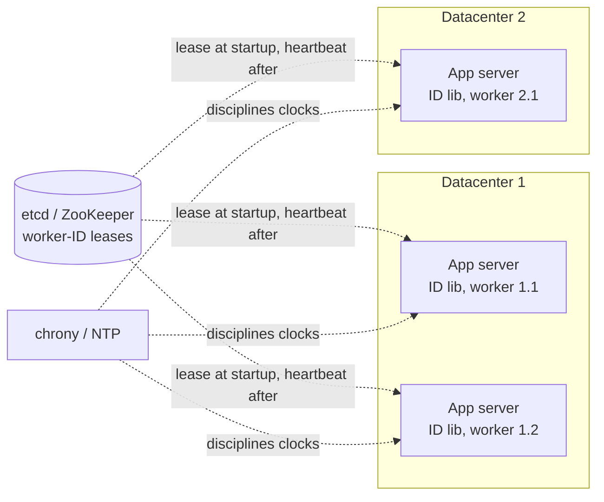
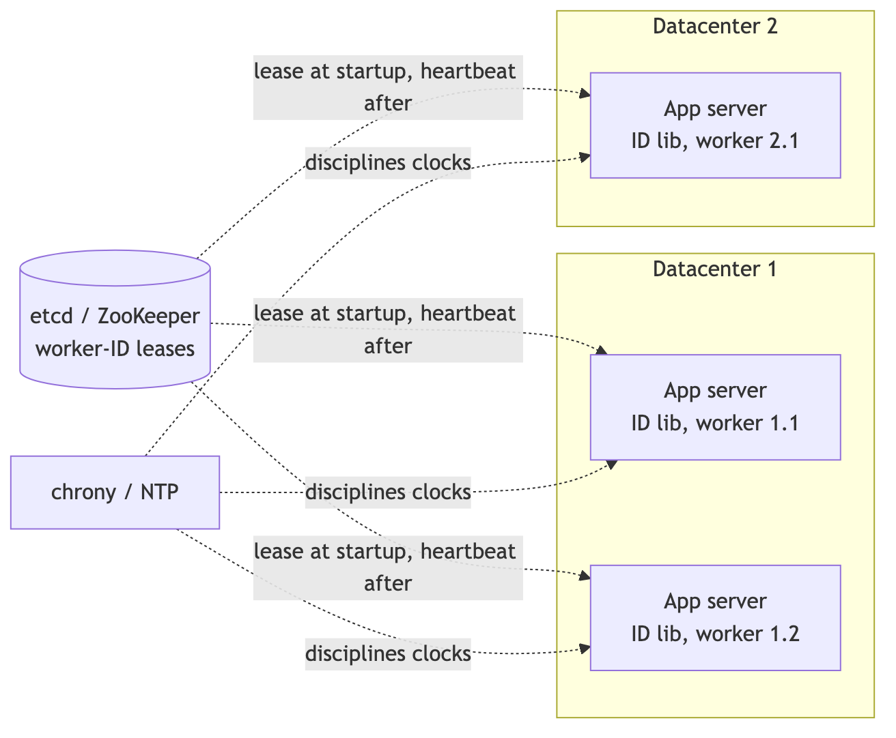
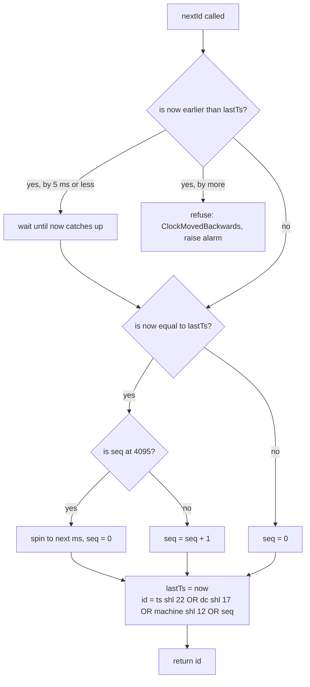
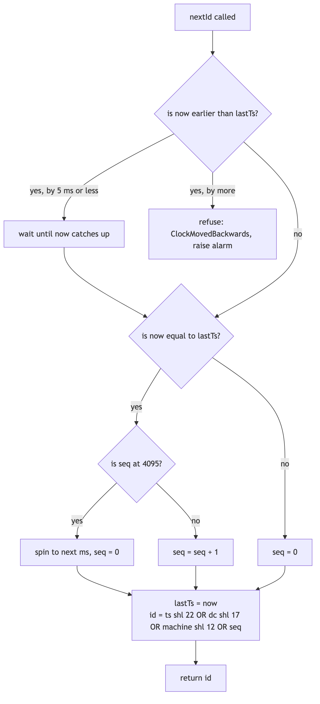

# 04 — Design a Unique ID Generator in Distributed Systems (book ch. 7)

*Written as I would talk through it in a design discussion, with the reasoning behind each choice.*

## 1. Problem statement

We need to generate IDs for records across a distributed system. Each ID must be globally unique, numeric,
fit in 64 bits, and be roughly ordered by the time it was created. We need at least ten thousand per second
across the system, generated on many servers in several data centres, with no single point of failure and no
coordination on the path that generates each ID.

## 2. Scope

I'll design the ID layout, how many servers generate IDs without talking to each other, what ordering we
actually guarantee, how we survive clock problems, how each server gets a unique identity, and how the whole
thing stays available. I'll leave out human-friendly short codes, which the URL shortener design covers,
cryptographic unpredictability, which was not asked for, and any lookup from an ID back to metadata.

## 3. Functional requirements

IDs are unique everywhere, numeric, and fit in a signed 64-bit integer. A later ID is numerically greater
than an earlier one at millisecond resolution; it does not have to increase by exactly one. The system
produces at least ten thousand a second, and a single generator should manage at least a few thousand a
second on its own.

## 4. Non-functional requirements

Generation has to be microseconds and in-process, because it sits on every write path. Availability has to
be effectively total, because a write path that cannot get an ID is down; I'd say 99.999%, which any node
achieves by generating locally. Correctness is absolute: a single duplicate is silent data corruption
downstream, so I would rather refuse to generate for a moment than emit a duplicate. And the only
coordination allowed is at startup, when a server claims its identity; nothing per ID.

As an error budget: 99.999% is about twenty-six seconds a month during which some worker refuses to generate. Clock rollbacks and lease losses are what spend it, so those two events are alarmed directly, and spending the budget triggers a review of clock discipline and lease settings rather than more features.

## 5. Design tenets

Uniqueness comes from partitioning the ID space across time, node and sequence number, not from a central
counter. We coordinate once at startup to lease a worker ID and never again. When the clock misbehaves we
refuse rather than risk a duplicate. And the bit layout and epoch are a frozen contract; changing them is a
new major version, because IDs from two layouts are not comparable.

## 6. Back-of-the-envelope estimation

The Snowflake layout is one sign bit always zero, 41 bits of milliseconds since a custom epoch, 5 bits of
data centre, 5 bits of machine, and 12 bits of sequence. Forty-one bits of milliseconds is about 69 years.
Five plus five bits is 32 data centres times 32 machines, so 1,024 generators. Twelve bits of sequence is
4,096 IDs per millisecond per machine, which is about four million a second per machine. The requirement is
ten thousand a second, so one machine covers it four hundred times over; I'd still run at least three per
data centre so no single generator is a point of failure.

The conclusion the numbers force: there is no reason to involve a database or a ticket server on the write
path.

**The hard part** is clocks. The layout is trivial; correctness depends on time never going backwards on a
worker and on never reusing a worker ID while an old holder might still be alive. The secondary problem is
handing out worker IDs safely when the fleet autoscales.

## 7. System components and services

The ID library runs inside each application process. It reads the clock, composes the bits, handles the
case where many IDs are requested in the same millisecond, and guards against the clock moving backwards.

The worker-ID assigner leases a unique data-centre-and-machine slot to each process at startup and keeps the
lease alive with heartbeats; etcd or ZooKeeper does this job.

The clock source is the system clock disciplined by chrony or NTP, plus the monotonic clock for detecting
rollbacks.

Monitoring watches sequence saturation, clock drift, lease health, and runs an offline scan for duplicates.

Inside the library the logic is: read the current millisecond. If it is before the last millisecond we used,
handle a rollback. If it equals the last one, increment the sequence, and if the sequence has hit 4,095, spin
until the next millisecond. Otherwise reset the sequence to zero. Record the millisecond and compose the ID.

## 8. Architecture and flows





*Vector version: [04-unique-id-generator-1-architecture.svg](diagrams/04-unique-id-generator-1-architecture.svg)*






*Vector version: [04-unique-id-generator-2-diagram-2.svg](diagrams/04-unique-id-generator-2-diagram-2.svg)*


## 9. Communication between services

Callers get an ID by calling a function in their own process. No network. If a runtime cannot host the
library, say a legacy platform, then a small gRPC service with a batch call that returns a hundred IDs at a
time amortizes the hop. The library talks to the lease store synchronously once at startup and then sends an
asynchronous heartbeat; I'd set the lease to ten to fifteen seconds and heartbeat every one to three seconds,
because the lease has to outlast a garbage-collection pause or we elect a new holder on every collection.
Generators never talk to each other.

## 10. Deep dives

### 10.1 Comparing the approaches

Multi-master database auto-increment, where each of k databases steps by k, gives unique numeric IDs but
they do not increase with time across servers, and adding or removing a server reshuffles the steps, so it
scales poorly. UUID version 4 needs no coordination and scales perfectly, but it is 128 bits and not
time-ordered, which violates two requirements, and it fragments B-tree indexes. A ticket server, a single
MySQL doing REPLACE INTO, gives numeric time-ordered IDs and is simple, but it is a single point of failure
and a bottleneck; Flickr ran two with odd and even ranges. Snowflake meets every requirement with no per-ID
coordination, and what it costs is that I must engineer around clocks and worker-ID collisions. I pick
Snowflake and I give up strict global ordering, since two IDs in the same millisecond from different machines
are ordered by machine, not by true time.

### 10.2 Clock synchronization

I'd run chrony configured to slew rather than step, and alarm when NTP offset exceeds five milliseconds. The
library keeps the last millisecond it used; if the clock moves back by five milliseconds or less, it waits
it out; if by more, it refuses to generate and pages someone, because a refused request is recoverable and a
duplicate is not.

There is an alternative worth naming: a logical clock that never goes below the last timestamp and only
advances with wall time once wall time has caught up, which is what Sonyflake and Baidu's UidGenerator do.
That trades exact correlation with wall-clock time for availability. I'd use the refuse-and-alarm guard where
people read time out of IDs, and the logical clock where availability matters more than that fidelity.

And the subtle one: a worker ID must never be reused within the maximum skew window after its holder dies,
or the new holder could generate the same timestamp-and-sequence as the old one did. The lease TTL has to
exceed that window.

### 10.3 Assigning worker IDs

Static assignment from deployment metadata needs nothing to run but breaks the moment the fleet autoscales
and is one typo away from a collision. An etcd lease or a ZooKeeper ephemeral sequential node releases itself
when the holder dies and is safe under autoscaling, at the cost of an ensemble to run. Redis SETNX with a TTL
is tempting because Redis is already there, but on a failover it can hand the same slot to two processes,
which is exactly the failure we cannot tolerate. I'd use etcd or ZooKeeper for any elastic fleet and static
config only for a small fixed one. When a process loses its lease it stops generating until it reacquires
one. I'd log the lease epoch alongside each batch so an old holder's IDs can be audited if we ever suspect a
split.

### 10.4 Tuning the layout and being honest about ordering

If we have fewer machines, shrink the machine bits and give the sequence or the timestamp more. A
low-concurrency system can drop sequence bits in favour of more machine bits. The epoch has to be documented
because IDs only compare within one layout. And the ordering we promise is by millisecond then by machine,
which is not causal order; it is fine for feed cursors and pagination and is not a substitute for a
transaction log.

### 10.5 Failure modes

If the clock steps back by more than five milliseconds, that worker refuses to generate, the page fires, the
load balancer's health check pulls it, and the other workers carry the load. If a worker saturates its
sequence, it stalls for microseconds until the next millisecond; I alarm and scale out. If the lease store is
down, running workers keep generating but new ones cannot start, so the store runs as three or five nodes
across zones and startup retries. If a lease is lost during a long pause the worker stops until it
reacquires; the fix is leases longer than any realistic pause. If a bug ever produces duplicates, a daily
offline scan over persisted IDs catches it and pages. And if someone deploys a changed layout or epoch, the
ID spaces overlap, which is why that is a major version and never done in place.

## 11. API design

```
IdGenerator.create(datacenterId, workerIdProvider, epochMs)
long nextId()
long[] nextIds(int n)
Instant timestampOf(id); int datacenterOf(id); int workerOf(id); int seqOf(id)   // decode for debugging
Service form if needed: POST /v1/ids?count=100 -> {ids: [...], epoch}
```

## 12. Data model

There is no per-ID storage. The registry holds `/idgen/<dc>/workers/<slot 0-31>` with the host, process ID,
lease ID, epoch and acquisition time as a leased record. The queries are: find the lowest free slot at
startup, heartbeat the lease, and list workers for monitoring.

## 13. Database choice for the registry

etcd or ZooKeeper, because leases and ephemeral nodes are precisely this problem and they are strongly
consistent; the cost is running an ensemble, and I'd reuse whichever one the company already runs for
configuration or for Kafka. Redis SETNX I'd avoid for the double-assignment risk. Static config for fixed
fleets only.

## 14. Tools and technologies

For the implementation I'd use the Snowflake layout with the logical-clock guard; Sonyflake and Baidu's
UidGenerator are the references, and Instagram's sharded-Postgres scheme is a good alternative when you want
a shard hint in the ID but it reintroduces a database dependency. chrony over ntpd for faster convergence and
slew-first behaviour. etcd over ZooKeeper for the simpler API, unless ZooKeeper is already run. A per-language
library rather than a sidecar, because zero network is the point; a sidecar only for runtimes that cannot
host the library.

## 15. Metrics and monitoring

IDs per second per worker and sequence-saturation events, which indicate a hot worker. Clock rollback events
with their magnitude, and NTP offset per host with an alarm at five milliseconds. Lease losses and
reacquisitions, and slot utilization per data centre with an alarm at 28 of 32. The offline duplicate
detector, which should always report zero and pages if not. And the rate of refuse-to-generate, which is the
indicator tied to the availability target.

## 16. Notification and logging

Lease acquire and release are logged with slot, host, lease ID and epoch. A refusal lasting more than a
second, any duplicate found, and slot exhaustion all page. Sustained sequence saturation opens a ticket to
scale out.

## 17. CI/CD, cost, operations, and what comes next

Unit tests cover monotonicity within a worker, uniqueness under a multi-threaded burst, rollback handling,
and encode-decode round trips, plus a property test across simulated workers. The library is published to the
package registry, consumers pin the major version, and a new version is canaried on one service while we
inspect decoded IDs in logs.

Cost is effectively zero beyond an etcd ensemble that is shared with other uses.

For regions, the data-centre bits make IDs globally unique with no cross-region traffic; the registry is
regional and the ID space is global by construction.

At ten times the scale nothing changes, because one machine already covers the throughput. The only growth
is in worker slots, which means more machine bits, or a move to 128-bit identifiers like UUIDv7 or ULID if
64 bits stops being a requirement, or embedding a shard hint in the ID so lookups can be routed by ID alone.
