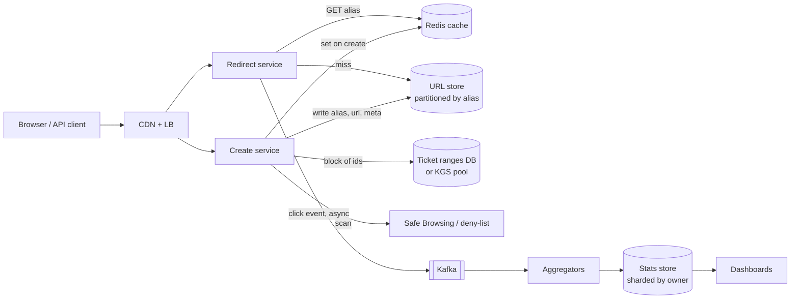
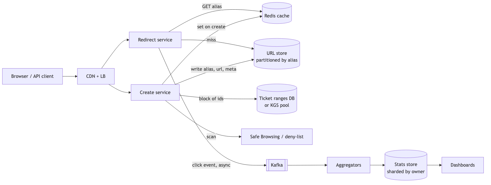
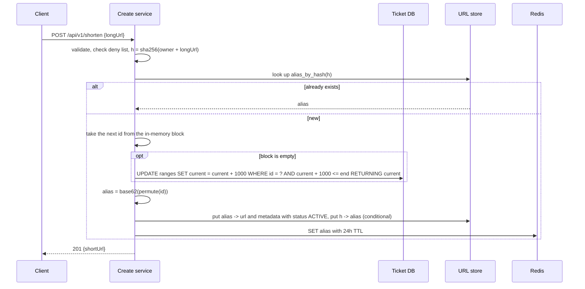
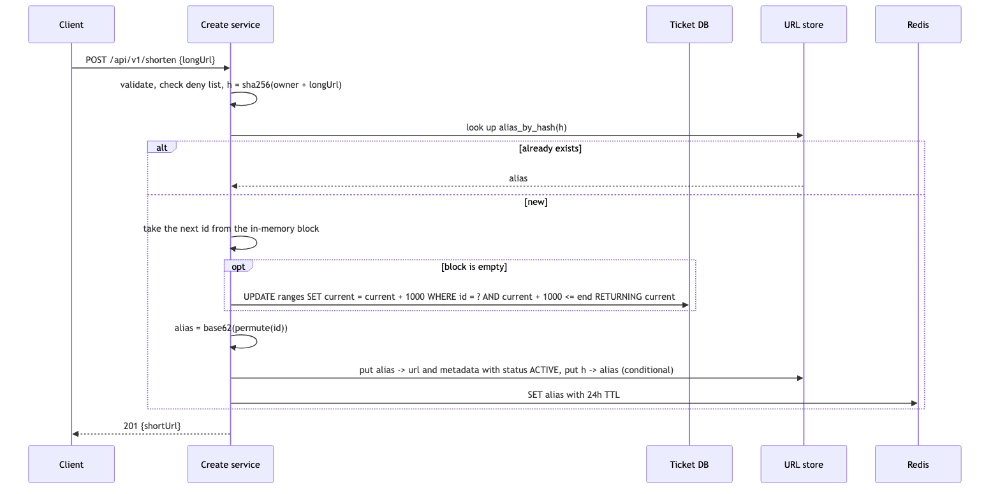

# 05 — Design a URL Shortener (book ch. 8)

*Written as I would talk through it in a design discussion, with the reasoning behind each choice.*

## 1. Problem statement

We are building a service like TinyURL. Someone gives us a long URL and we return a short alias; anyone who
visits the alias is redirected to the original. We expect a hundred million new URLs a day, the alias should
be as short as possible using digits and upper and lower case letters, the codes should not be guessable or
enumerable, and the service should run for ten years. The interviewer said we do not need to update or
delete links in version one, though I'll cover expiry and abuse because any real shortener needs them.

## 2. Scope

I'll build the create path, the redirect path, the way we generate short codes without a single point of
contention, how we store and cache the mappings, the 301-versus-302 decision, a click analytics pipeline,
and basic expiry and abuse handling. Custom aliases are a follow-up, as are deeper analytics and link
previews.

## 3. Functional requirements

Given a long URL, return a short one; if the same user shortens the same URL twice they should get the same
alias back. Visiting an alias redirects to the long URL. An unknown alias returns a 404; an alias that existed
but has expired or been disabled returns a 410, because telling clients and crawlers "this is gone for good"
stops them retrying. We validate the URL, check it against a deny list, and rate-limit creation per user and
per IP, because shorteners are a favourite tool of phishers.

## 4. Non-functional requirements

The redirect is the product and it sits in front of every page a link points to, so I'd give it a p99 under
fifty milliseconds on our side and 99.99% availability; a down shortener breaks other people's websites.
Creating a link can be slower, p99 under two hundred milliseconds, at 99.9%.

Consistency: a link must resolve immediately after it is created, which is read-your-own-write on the URL
store, and setting the cache at create time takes care of the first click. Analytics can be minutes behind.

Durability: we must never lose a mapping, because a lost mapping is a dead link forever, somewhere out on the
web. So replicated storage, backups, and point-in-time recovery.

Read to write: the book says ten to one; real shorteners are more like twenty to a hundred to one. Either way,
we cache the redirect path heavily and shard the write path.

As an error budget: 99.99% for redirects is about four minutes a month of failed or slow redirects, measured at the load balancer. Redirect 5xx and p99 breaches spend it; when it is spent we freeze changes to the redirect path and spend the time on reliability.

## 5. Design tenets

The redirect path is one cache hit in the common case, stateless, and depends synchronously on nothing except
the cache and the URL store. Short codes come from a unique integer encoded in base 62, never from hashing the
URL, and we make them unguessable. There is no single counter that every create has to touch. We return a 302
by default so we keep analytics and control, and offer 301 only to customers who want to offload us. And we
never block a redirect on analytics; those events are published asynchronously.

## 6. Back-of-the-envelope estimation

Writes: a hundred million a day is about 1,160 a second, maybe three thousand at peak. Reads at ten to one
are about 11,600 a second, maybe 25,000 at peak. That is a small redirect fleet per region behind a cache,
and the store needs to survive the miss traffic.

Over ten years we store 365 billion mappings. Six base-62 characters give 56.8 billion, which is not enough;
seven give 3.5 trillion, so seven characters it is.

Storage: 365 billion records at about 128 bytes each, code plus URL plus metadata, is roughly 47 terabytes.
The book arrives at 365 terabytes by multiplying the year count in twice; the correct figure for its own
assumptions is about a tenth of that. Either way storage is cheap; we shard for load, not for capacity.

Cache: if twenty percent of a day's redirects are the hot set, that is 11,600 times 86,400 times 0.2 times
about 150 bytes, around 30 gigabytes, which is a small Redis cluster. Because clicks skew heavily toward
recently created links, a cache that holds recent and popular codes gets an eighty to ninety percent hit ratio.

Analytics is the real volume: a billion click events a day at a few hundred bytes is around 300 gigabytes a
day.

**The hard part** is three things. Generating unique, unguessable, short codes at a high write rate with no
contention point. Keeping the redirect path fast and up even when the cache is not. And the 301-versus-302
decision, because it trades load against analytics and control.

## 7. System components and services

A CDN and load balancer at the edge terminate TLS, route by geography, and can briefly cache the 302 response
for a viral link.

The redirect service looks up the alias in the cache, falls back to the store on a miss, checks status and
expiry, returns the redirect, and publishes a click event asynchronously.

The create service validates the URL, checks the deny list, dedupes against the user's existing links, gets
an ID and encodes it, writes the mapping, and warms the cache.

The code generator is either a ticket-range scheme with blocks prefetched into each server's memory, or a
pre-generated pool of random keys; I'll compare them below.

The URL store holds alias-to-URL plus a dedupe index from a hash of owner-and-URL to alias.

A Redis cache holds hot aliases, set on create and deleted when a link is disabled or expires.

The analytics pipeline takes click events through Kafka into a stream or batch aggregation and a statistics
store that powers dashboards.

Safety scans destinations on create, re-scans popular links periodically because destinations change,
accepts abuse reports, and flips a link to disabled so the redirect shows a warning page instead.

## 8. Architecture and flows





*Vector version: [05-url-shortener-1-architecture.svg](diagrams/05-url-shortener-1-architecture.svg)*






*Vector version: [05-url-shortener-2-flow.svg](diagrams/05-url-shortener-2-flow.svg)*


Narrated create: the client posts a long URL. We validate it and check the deny list. We hash the owner and
URL together and look that up; if we have seen it, we return the existing alias. Otherwise we take the next
integer from a block of a thousand that this server fetched earlier, run it through a secret permutation so
neighbouring integers do not produce neighbouring codes, encode it in base 62, write the mapping and the
dedupe entry, set the cache because a new link is about to be clicked, and return.

Narrated redirect: a request for an alias hits the redirect service, which checks Redis. On a hit, it checks
the status and expiry, publishes a click event without waiting, and returns a 302 with the long URL. On a
miss it reads the store, fills the cache, and does the same. Unknown aliases get a 404; expired or disabled
ones get a 410 or a warning page.

## 9. Communication between services

Client to our services is synchronous HTTPS, and in the common case a redirect is one cache read. The
service's calls to Redis and the store are synchronous with tight timeouts; if Redis takes more than five
milliseconds we fall through to the store rather than wait. The create service talks to the ticket database
synchronously but only once per thousand IDs, so a brief ticket-database outage does not stop creates. The
redirect service publishes to Kafka with fire-and-forget or a local buffer flushed in batches; losing a few
analytics events is acceptable, delaying a redirect is not. Safety is a synchronous cheap deny-list check at
create plus an asynchronous deeper scan and periodic re-scans.

## 10. Deep dives

### 10.1 Generating the code

I'd lay out four options and judge them on unguessability, length, and contention.

Hashing the URL with MD5 or SHA and taking seven characters gives a fixed length and unguessable codes, but
collisions have to be detected and retried with a salt, which is extra reads on every create, and it gets the
dedupe semantics wrong when two users shorten the same URL.

Taking a Snowflake ID and encoding it in base 62 needs no coordination, but a 64-bit integer is eleven
characters, and the codes are time-ordered and therefore enumerable, which we were told to avoid.

A ticket server with ranges: a table of ranges each with a current pointer, API servers pick a range at
random and claim a block of a thousand IDs in one atomic statement. Storage is tiny, sizing is trivial, and
the database is touched once per thousand creates. The weakness is that IDs within a range are sequential, so
two links created seconds apart from the same range have neighbouring codes. Many small ranges chosen at
random plus a secret permutation before encoding make that very hard to exploit.

A key generation service pre-generates random seven-character codes offline, checks them against the URL
table, and stores them in a pool; API servers fetch blocks from the pool. Codes are truly random, no
permutation trick is needed, and the pool database is off the hot path. The cost is storage for the pool,
about eight gigabytes a year, and a job to keep it full.

I'd pick ticket ranges with a permutation for simplicity, and I'd pick the key generation service if
unguessability were a hard product requirement. The thing to say about the ticket server is that the naive
"select current, then update" is a lost update under concurrency: two servers read the same current and both
hand out the same ID. The increment has to be one atomic statement, UPDATE with RETURNING, or a SELECT FOR
UPDATE. Give each region its own set of ranges so creates never coordinate across regions.

### 10.2 301 versus 302

A 301 is cached by browsers and CDNs. After the first visit the browser jumps straight to the destination and
never calls us again, so our click counts undercount and we cannot disable or change the link for that
browser. A 302 or 307 is not cached, so every visit hits us: accurate analytics, full control, and more load,
which the cache absorbs. Since analytics and the ability to take down a phishing link are features, I return
302 and offer 301 per link for customers who want the offload and accept no counts.

### 10.3 The redirect path and what happens when the cache dies

Cache-aside keyed by alias with a 24-hour TTL, set eagerly on create. For a viral alias I'd put a tiny
in-process cache with a one-to-five-second TTL in front of Redis so one server sees one Redis read a second
rather than one per request, and I'd let the CDN cache the 302 for a few seconds. When a hot key's cache entry
expires, thousands of requests can miss at once and all go to the store, which is a stampede; the fix is to let
only the first miss per key fetch from the store while the others wait a few milliseconds for the refilled value,
and to add jitter to TTLs so keys set together do not expire together. I'd negative-cache 404s
briefly because scanners probe random codes.

If the cache dies, every redirect hits the store. I decide now, not during the incident, what that means: the
store has a replica per partition and is sized to take at least half of peak redirect traffic, and the Redis
call has a tight timeout so a slow cache does not become a slow site. Both the Redis call and the store call sit
behind a client-side circuit breaker, so when one of them is failing we stop paying the timeout on every request
and fall through, or fail fast, immediately.

### 10.4 Correctness

Dedupe uses a conditional put on the hash key, insert if not exists, so two concurrent creates of the same
URL converge on one alias and the loser reads the winner's. Codes are never reused, because reusing a code
would send someone's old shared link to a new destination; deletes and expiry flip a status field. For
expiry, the check at redirect time is the guarantee that an expired link stops working; the cleanup job only
reclaims storage later and must not race with readers holding a just-issued redirect.

### 10.5 Failure modes

Cache down: redirects slow down and the store takes all reads, which is why it is sized for it. A store
partition down: aliases on it return errors until the replica is promoted, while the cache keeps serving the
hot ones. Ticket database down: creates keep working until each server's in-memory block runs out, and
redirects are untouched; I run several ticket databases and alarm on block-fetch failures. Kafka down:
redirects are unaffected because the publish is asynchronous, analytics are delayed or lost, and I alarm on
publish failures. A malicious destination: the user lands on a phishing page, so we scan on create, re-scan
popular links, accept reports, and disable with an interstitial. If someone changes the permutation or
encoding map, every existing code breaks, so that is versioned and never rotated. Replication lag on the
dedupe index could let two concurrent creates both think a URL is new; the conditional write catches most of
it and I accept a rare double alias.

## 11. API design

```
POST /api/v1/shorten       body {longUrl, expiresAt?, redirectType?: 302 | 301}
  201 {shortUrl, alias, createdAt}   400 invalid URL   403 denied domain   429 rate limited
GET  /{alias}              302 Location (or 301) | 404 unknown | 410 expired or disabled (or a warning page)
GET  /api/v1/links/{alias}          metadata and click summary
POST /api/v1/links/{alias}/report   abuse report
DELETE /api/v1/links/{alias}        sets status DISABLED; the code is never reused
```

## 12. Data model

```
urls(alias VARCHAR(7) PK, long_url TEXT, owner_id, created_at, expires_at NULL,
     status ENUM(ACTIVE, EXPIRED, DISABLED), redirect_type TINYINT DEFAULT 302, scan_status, scanned_at)
alias_by_hash(url_hash BINARY(16) PK, alias)         -- dedupe, written with a conditional put
ranges(id PK, start BIGINT, end BIGINT, current BIGINT)   -- ticket DB, about 500k rows
clicks: event stream {alias, ts, referrer, ua, country}   -- Kafka into Parquet
clicks_daily(owner_id, alias, day) PK, count, top_referrers JSON, top_countries JSON
```

The queries are a point read by alias for nearly all traffic, a point read by URL hash on create, an atomic
range increment, an append of clicks, and per-owner daily aggregates. There are no joins anywhere.

## 13. Database choices

For the URL mappings and the dedupe index, which are pure key lookups, fifty terabytes, and a few thousand
writes a second, I considered DynamoDB or Cassandra, sharded MySQL or Postgres, and Redis alone. The criteria
are single-key lookups, linear write scaling, a TTL attribute, and managed resharding. DynamoDB fits, with
Cassandra as the self-hosted equivalent. I give up ad-hoc queries, which the analytics store provides anyway,
and relational constraints, which this data does not need. Redis alone is not durable or cost-effective at
fifty terabytes.

For the ranges table, which is tiny and needs an atomic increment with a returned value, a managed relational
database is the right tool, and I'd run a few instances each owning a group of ranges.

For the cache, Redis or Memcached both work because the access is plain get and set; I'd use Redis for
cluster mode and replication, and Memcached would be an acceptable answer.

For analytics, Kafka into Parquet on S3 and then a columnar warehouse, with ClickHouse if the dashboards need
near-real-time. MongoDB or Elasticsearch aggregations would work at small scale, but Elasticsearch as a
primary store is an anti-pattern and a row store will not keep up with 300 gigabytes a day.

## 14. Tools and technologies

Kafka for the click stream over SQS or RabbitMQ, because the volume is billions a day, I want to replay to
re-aggregate, and more than one consumer reads it. Flink for windowed aggregation into minute-level
dashboards, with a nightly Spark job to reconcile. Ticket ranges plus a permutation for codes, as discussed.
A CDN that caches 302s briefly for viral links. Google Safe Browsing or an internal deny list, with the cheap
synchronous check on create and the deep scan asynchronous.

## 15. Metrics and monitoring

The indicators tied to SLOs are redirect p99 and 5xx rate against the 99.99% budget, and create p99 and
errors. Underneath: cache hit ratio with an alarm under eighty percent, store latency and throttling per
partition, 404 and 410 rates as a signal of enumeration or scanning, ticket block fetch failures, Kafka
publish failures and consumer lag, and freshness of the aggregates. On the safety side, reports per day,
disabled links, and scan failures.

## 16. Notification and logging

Each redirect writes an access log with alias, timestamp, referrer, user agent and coarse geography, no
personal data, which flows through Kafka to the warehouse. Application logs are sampled and carry a request
ID. Redirect availability and store throttling page the on-call; ticket database health and Kafka lag open
tickets. Abuse spikes go to the trust and safety channel and every takedown is audited.

## 17. CI/CD, cost, operations, and what comes next

The services are stateless and deploy rolling or blue-green behind the load balancer with connection
draining. A synthetic canary shortens a URL and follows it every minute in every region, and because the services are stateless, rollback is redeploying the previous image behind the load balancer. The store schema is
append-only so deploys are safe; the permutation and encoding are versioned and never rotated; ranges are
created ahead of time.

Resharding is DynamoDB's problem; if we self-host, I'd pre-split into about a thousand logical shards mapped
onto fewer nodes so growth is moving a shard, not re-cutting one.

For regions, each gets its own ranges so creates need no cross-region coordination; the URL table is
replicated globally and eventually consistent, which is fine because a link is rarely clicked in another
region within the replication lag; redirects are served from the nearest region.

Backups: the URL store is replicated with point-in-time recovery, which gives a recovery point of minutes and a
recovery time of under an hour for a bad delete; a restore is drilled quarterly, because a backup that has never
been restored is a hope.

Cost is the redirect fleet and cache for compute, and analytics retention for storage; keeping twelve months
hot and archiving the rest to S3 is the main knob.

Ownership splits naturally into the redirect path, ID generation, and the analytics pipeline, three services
with clear interfaces.

At ten times the scale we add cache shards and redirect servers, push the hottest redirects to the CDN edge,
and the next features are custom aliases with a uniqueness check and reserved words, per-link expiry and
analytics in the UI, QR codes, and machine-learned abuse detection on click patterns.
