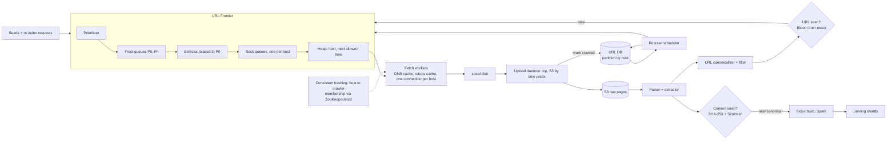
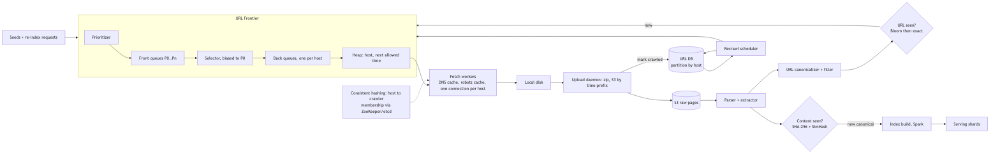
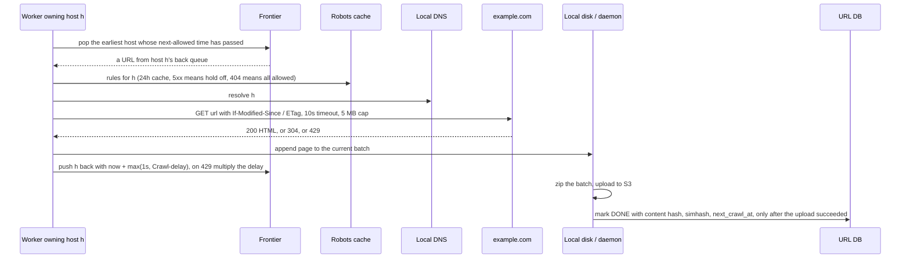
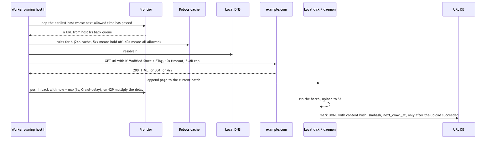

# 06 — Design a Web Crawler (book ch. 9)

*Written as I would talk through it in a design discussion, with the reasoning behind each choice.*

## 1. Problem statement

We are building a crawler to feed a search index. It starts from a set of seed URLs, downloads pages,
extracts the links, and keeps going. The targets are a billion pages a month, HTML only, we have to come back
to pages that change, we store what we download for five years, we skip duplicate content, and we must be
polite to every website we visit. Underneath all that, the operational challenge is to keep hundreds of
workers busy without any single host starving the rest or getting us blocked.

## 2. Scope

I'll cover the URL frontier, which decides what to fetch next and enforces politeness; the fetch, parse and
link extraction stages; deduplication of URLs and of content, both exact and near-duplicate; storage;
freshness and recrawl scheduling; robots.txt and DNS; how we divide hosts among crawlers; traps and
robustness; and how to extend it. Ranking is out of scope, and I'll only sketch the inverted index because
the interviewer may ask how we would serve it. JavaScript rendering and non-HTML formats are extensions I'll
name at the end.

## 3. Functional requirements

Crawl outward from seeds, normalizing and scheduling every link we find. Honour robots.txt, including
Crawl-delay and noindex and nofollow, and never have more than one request in flight to a given host. Skip
URLs we have already seen and content we have already stored, including pages that differ only by a
timestamp or an ad block. Recrawl each page at roughly the rate it changes, and accept sitemap submissions
and re-index requests. Keep the raw HTML with metadata for five years.

## 4. Non-functional requirements

Throughput of about four hundred pages a second on average and a thousand at peak, which comes from a
billion pages divided by the seconds in a month. Freshness tiers: news within an hour, popular pages within a
day, the long tail within thirty days. Availability is a different story from most systems: the crawl is a
batch job, so losing a machine costs throughput rather than correctness; the search-serving fleet is separate
and read-only and needs 99.9%. Consistency is eventual everywhere; we crawl at least once and tolerate the
rare duplicate fetch. Durability: raw pages go to object storage with eleven nines, the URL database is
replicated, and the index can be rebuilt from the raw pages so it needs time rather than backups. And
politeness is a hard requirement with a zero-violation target, because a blocked crawler has zero coverage of
that site.

As an error budget: the crawl itself has a throughput budget rather than an availability one, so I define it as "fetch rate stays within thirty percent of plan over a week". The serving index has a normal 99.9% availability target, about forty-three minutes a month, spent by query errors and failed index swaps.

## 5. Design tenets

The frontier is the brain: prioritization and politeness live there, and fetch workers stay dumb. Every stage
is idempotent and restartable, and in particular we mark a URL as crawled only after its page is durably in
storage, so a crash loses minutes of work, never a page. We dedupe early on URLs and late on content, and we
spend real effort deciding what not to fetch, because the web is effectively infinite and our budget is not.
We assign hosts to crawlers, not URLs, using consistent hashing, which gives politeness and DNS locality for
free. And we store raw bytes once, in batches, and derive everything else.

## 6. Back-of-the-envelope estimation

A billion pages a month is about 400 a second; peak at double is 800 to 1,000. The book assumes 500
kilobytes a page, which gives 500 terabytes a month and 30 petabytes over five years; compressed about five
times that is 6 petabytes, and most of it goes to cold storage. If I assumed 100 kilobytes a page the numbers
are a fifth of that; I'd state the assumption and move on.

Bandwidth at peak is 800 times 500 kilobytes, about 400 megabytes a second or roughly 3 gigabits.

Concurrency: an average fetch takes about half a second, so we have about 400 fetches in flight. With fifty to
a hundred connections per worker that is ten to twenty fetch workers for throughput, bounded by politeness
delays rather than CPU, and I'd run tens of machines anyway for locality and redundancy.

URL-seen set: ten billion URLs at eight bytes of hash is 80 gigabytes sharded, and a Bloom filter over ten
billion at one percent false positives is about 12 gigabytes at ten bits per key.

Writing pages one at a time to S3 is slow and costs per request, so each crawler writes to local disk and a
daemon zips and uploads a batch every minute.

**The hard part** is the frontier: prioritizing, staying polite to every host, keeping hundreds of workers
busy, and never letting one hot or trapped host starve everything else. Second is deciding what not to fetch:
normalization, traps, robots, near-duplicates, and change-rate scheduling. And third, if asked, is turning
hundreds of terabytes of postings into an index that serves queries in milliseconds.

## 7. System components and services

The seed set is curated by the search quality team.

The URL frontier is the Mercator design: a prioritizer places each URL into one of several front queues by
priority; a selector draws from high-priority queues more often but still drains the low ones; URLs then move
into back queues, exactly one per host; and a heap keyed on each host's next-allowed-fetch time hands a
worker the earliest host whose delay has passed. Politeness falls out of the data structure rather than being
checked in code.

Fetch workers do the robots check, resolve DNS through a local cache, fetch with timeouts and a size cap,
and hold one connection per host.

A local disk and upload daemon batch pages, zip them, upload to S3 under a time-partitioned prefix, and only
then mark the URLs crawled.

The parser and extractor use a tolerant HTML5 parser, canonicalize links, and drop anything blocklisted or
unsupported.

Dedupe is three layers: a Bloom filter and exact store for URLs, an exact SHA-256 for byte-identical
content, and SimHash for near-duplicates.

The URL database holds per-URL state and per-host configuration including cached robots rules and
reputation.

The recrawl scheduler feeds due URLs back into the frontier, and a re-index API accepts sitemaps.

Content storage is S3 with lifecycle tiers. Index build is Spark; index serving is a separate
document-partitioned fleet with atomic swaps.

## 8. Architecture and flows





*Vector version: [06-web-crawler-1-architecture.svg](diagrams/06-web-crawler-1-architecture.svg)*






*Vector version: [06-web-crawler-2-flow.svg](diagrams/06-web-crawler-2-flow.svg)*


Narrated: a worker asks the frontier for work and gets back the host whose politeness delay expired longest
ago, with one URL from that host's queue. It checks the cached robots rules, resolves the host through its
local DNS cache, and fetches with a timeout and a size cap, sending If-Modified-Since so an unchanged page
costs almost nothing. It appends the page to a batch on local disk and pushes the host back onto the heap with
its next allowed time; if the host returned 429, the delay for that host alone is multiplied. The daemon
uploads the batch to S3 and only then marks those URLs done in the database, so a crash before the upload
simply means the pages are re-fetched.

## 9. Communication between services

Workers pull from the frontier rather than being pushed to, so politeness is enforced in one place. Workers
talk to websites over asynchronous non-blocking HTTP with many hosts in flight but one connection per host,
five-second connect and ten-second read timeouts, a cap on redirects, and a content-type check before
downloading a body. Pages reach S3 in batches, never one at a time, and the S3 event or a Kafka message
triggers parsing; consumers are idempotent on URL hash and fetch time because those events are at least once.
The parse, extract, dedupe and enqueue stages are decoupled over Kafka topics so each scales and restarts on
its own, with consumer lag as the health signal. Which crawler owns which host comes from a ring held in each
worker and refreshed by a ZooKeeper or etcd watch.

## 10. Deep dives

### 10.1 Why the frontier looks like this

Depth-first goes arbitrarily deep into one site. Plain breadth-first hammers the same host, because most links
on a page point back into it, and it has no notion of which pages matter. So we need priority, from site
rank, change rate and whether the page is news, and we need politeness, which is why there are per-host back
queues and a heap on next-allowed time. Freshness comes from adapting each page's recrawl interval: multiply
it when the page was unchanged, divide it when it changed, with a floor for important pages. Sitemap lastmod
dates and re-index requests enter as high priority.

### 10.2 Deciding what not to fetch

Canonicalize every URL before it touches the database: lowercase the scheme and host, drop the default port
and the fragment, resolve dot segments, sort query parameters, strip tracking parameters like utm and
session IDs, be consistent about trailing slashes, and honour rel=canonical. Otherwise the same page shows
up under many spellings.

Spider traps generate endless new URLs: calendars with "next month" forever, session IDs in every link,
nested paths, faceted search with millions of combinations. Defences are caps on URL length and depth, caps on
pages per host per cycle, dropping parameters that look like IDs or dates, and flagging hosts where new URLs
keep appearing but content hashes keep repeating. A trap does not just waste time; it starves every other
host of that crawler's capacity.

Robots.txt is cached for twenty-four hours per host; a 5xx means do not crawl for now and a 404 means
everything is allowed. The URL-seen Bloom filter gives a cheap "definitely new"; on "maybe seen" we check the
exact store. A false positive means we skip a URL until the next cycle, which is acceptable.

### 10.3 Exact versus near-duplicate content

An exact hash catches only byte-identical pages, and about 28% of the web is near-duplicate: the same article
with a different timestamp, ad block or "logged in as" line. SimHash combines the hashes of word shingles into
one 64-bit fingerprint such that similar pages differ in only a few bits; pages within Hamming distance three
are near-duplicates and can be found quickly with a few permuted sorted tables. MinHash keeps a signature of
around a hundred hashes and estimates Jaccard similarity, which is heavier but gives a score. We still fetch
near-duplicates, because we cannot judge content from a URL, but we store and index only the canonical copy.
What we give up is about 28% of fetch bandwidth; what we gain is a correct index.

### 10.4 Owning hosts with consistent hashing

Hashing hosts onto a ring of crawlers with virtual nodes means one machine talks to a given host, so the back
queue, the DNS cache and the robots cache for that host live in one place and no central scheduler is needed.
When a crawler dies, its hosts spread across all the others after a heartbeat timeout, and the new owner
re-queues URLs that are marked in-progress with old timestamps. Pages already uploaded are fine; the few
minutes of work on the dead disk are fetched again. That is the right side of the trade: nothing lost, a few
things fetched twice.

### 10.5 Storage layout and the index, if asked

Pages live under a time-partitioned prefix like `s3://pages/yyyy/mm/dd/hhmm/batch-N.zip`, so "what is new
since the last index run" is a prefix listing. The index estimate from the book is a million words times ten
million documents each times a 32-byte doc ID, about 320 terabytes; using four-to-eight-byte IDs and storing
gaps between sorted IDs with variable-byte encoding cuts that to tens of terabytes, and champion lists cut it
further. Building the index is naturally term-partitioned, a group-by on word. Serving should be
document-partitioned: each node holds a small full index over its slice of documents, a query scatters to all
of them and a merger gathers the top hits, which gives even load and low latency. A new index is swapped in
atomically only after validation counts pass.

### 10.6 Failure modes

A crawler dies mid-host: throughput dips, the ring reassigns, in-progress URLs older than a threshold are
re-queued. A host returns 429 or repeated 5xx: it is telling us to slow down, so we back off that host alone,
honour Retry-After, and alarm if a large site throttles us because that usually means we broke politeness. A
site blocks our IPs: coverage there is zero, so we alarm on per-host 403 and 429 and keep an identifiable
user agent with a contact address. A trap floods the frontier: per-host caps and trap heuristics, with an
alarm on outliers in new-URLs-per-host. A huge host makes a hot partition in the URL database: sub-partition
it by path prefix, and the per-host delay bounds its write rate anyway. A poison page, a hundred-megabyte
HTML file or a zip bomb or something that crashes the parser: size caps, a parse time limit, and a sandboxed
parser. The upload daemon falls behind and the disk fills: alarm on disk usage and pause fetching before it is
full. A bad parser deploy: run the new parser over a sample from S3 and diff the tokens first, and never swap
an index that failed validation. Stale robots rules: a newly disallowed path might be fetched once more within
the day; takedown requests bypass the cache.

## 11. API design

These are internal:

```
Frontier:  POST /frontier/urls {urls: [{url, priority, discoveredFrom}]}   batch, idempotent
           GET  /frontier/next?worker=w7  -> {url, host, leaseId, deadline}
           POST /frontier/ack {leaseId, status, nextCrawlHint}
Robots:    GET  /robots/{host} -> {rules, crawlDelay, fetchedAt}
Seen:      POST /seen/check {hashes[]} -> {new: [...]}
Storage:   GET  /pages/{urlHash}?version=latest -> {meta, blobRef}
Admin:     POST /seeds, POST /blocklist, POST /reindex {url | sitemap}, GET /stats/hosts/{host}
```

## 12. Data model

```
url(url_hash PK within host partition, url, host, first_seen, last_crawled_at, crawl_count,
    content_hash, simhash, change_count, depth, status (QUEUED, IN_PROGRESS, DONE, FAILED),
    retry_count, next_crawl_at, priority)
host(host PK, robots_txt, robots_fetched_at, crawl_delay_ms, pages_this_cycle, err_rate, reputation,
     blocked, backqueue_id)
page(url_hash, fetched_at) PK, status, headers, content_len, content_sha, s3_key
content_seen(content_sha PK, canonical_url_hash, first_seen)
simhash_index(permutation_k, simhash) -> url_hash
frontier_queue(queue_id, seq) PK, url_hash, priority      -- disk-backed FIFO per queue
```

The queries are point reads and updates by URL hash, per-host reads and updates which are hot, a range scan on
next_crawl_at for the scheduler which I'd partition by time bucket, FIFO pops per queue, and SimHash
near-lookups through the permuted tables.

## 13. Database choices

The URL database is ten billion rows of point operations with locality by host, write-heavy, needing TTL or
archival. DynamoDB with host as the hash key fits, or Cassandra if self-hosted; HBase would also work. I give
up ad-hoc queries, which I'd run with Spark over exports, and I have to sub-partition huge hosts.

Raw pages at petabyte scale go to S3 with lifecycle rules moving them to infrequent access and then archive
tiers, keeping only the latest copy per URL hot. HDFS is the alternative and loses on durability and cost.

The frontier queues are millions of tiny per-host queues that need to be disk-backed with in-memory heads.
Kafka's partition model does not fit per-host queues and Redis would be expensive for this much data, so
RocksDB-backed queues on the frontier nodes.

Host state and robots rules are hot and expiring, so Redis with a durable copy in the URL database.

The URL-seen check is a Bloom filter, in-process or RedisBloom sharded by hash prefix, backed by the exact
store; it is insert-only so the no-delete limitation does not matter.

The index is purpose-built postings files on local SSD built by Spark; the key-value store is the right
mental model but a single item holding ten million doc IDs would be hundreds of megabytes, far past
DynamoDB's 400-kilobyte limit.

## 14. Tools and technologies

Kafka between stages, for throughput, replay and because several consumer types read the same events; I give
up SQS's zero operations. An asynchronous HTTP client in Netty, Go or aiohttp so a worker can hold thousands
of connections. A tolerant HTML5 parser like jsoup or lxml, never regular expressions, and sandboxed. SimHash
with a Hamming threshold of three for near-duplicates; MinHash if I need a similarity score. Consistent
hashing with virtual nodes for host ownership and ZooKeeper or etcd for membership, over a central scheduler
that would be a bottleneck. A local caching DNS resolver on every crawler host, because Mercator found DNS to
be a top bottleneck. Spark for the index build and for computing link-graph priority. Kubernetes with one
deployment per stage, autoscaling parsers on Kafka lag.

## 15. Metrics and monitoring

Pages and bytes per second; success, 4xx, 5xx, timeout and robots-blocked rates overall and per host.
Frontier size and the age of the oldest URL in each priority tier, which is how we measure the freshness
targets, plus starvation of low tiers. Politeness: per-host 429 and 403 with an alarm on big sites, and
delay violations which must be zero. DNS cache hit ratio, robots fetch failures, disk backlog, S3 upload lag,
URL database throttling. Dedupe ratios for URLs, exact content and near-duplicates; trap detections; outliers
in new URLs per host. Kafka lag per stage; index age and build time; query p99 on serving. Alarms when fetch
rate drops thirty percent for ten minutes, when the frontier grows without bound, when one host takes an
outsized share of fetches, and when disk passes eighty percent.

## 16. Notification and logging

Every fetch writes a structured log line with URL hash, host, status, bytes, latency and worker, flowing
through Kafka to S3 where Athena or Presto can query it when we debug a trap or a host problem. Application
logs are sampled with request and batch IDs. A stalled fetch fleet, full disks, URL database throttling and
a failed index build page the on-call, although serving keeps the previous index. A daily report covers
coverage, freshness distribution, dedupe ratio, top errors and blocked hosts. We monitor an abuse mailbox and
our user agent links to a page explaining the crawler.

## 17. CI/CD, cost, operations, and what comes next

Each stage deploys on its own with backward-compatible Kafka schemas in a registry. Deploys roll across the
ring with in-flight fetches draining. Parser changes are replayed against a sample from S3 with a token diff
before release, and canaried on one percent of hosts by hash while comparing success, parse and dedupe rates.
A chaos test kills a worker mid-crawl and verifies its hosts move and its in-progress URLs are fetched exactly
once more. Rollback of a stage is redeploying the previous image, and rollback of an index is pointing serving back
at the previous snapshot, which is why we keep the last two.

Adding crawlers moves about one-Nth of hosts thanks to virtual nodes. Re-keying the URL database is a
dual-write and backfill, done rarely. The index is rebuilt from S3 whenever its layout changes.

Regions: crawl from the region nearest the hosts, because politeness is per host, not per user; keep raw
pages in one region's S3 with replication; serve the index from every user region.

Cost is dominated by S3 storage for raw pages, so lifecycle rules and keeping only the latest copy matter;
then the Spark index build and the serving fleet. The fetch fleet is cheap. Near-duplicate detection and
champion lists are cost features as much as quality features.

Ownership divides into fetch and frontier, URL database and scheduling, storage and dedup, index build, and
index serving, five teams with interfaces defined by the S3 layout, the URL database schema and the index
format.

At ten times the scale we add crawlers on the ring and per-country crawl clusters, and the next features are
a headless-browser rendering tier for JavaScript-heavy sites, PDF and image pipelines, learned change-rate
prediction, an incremental link graph, anti-cloaking checks that compare what a user sees with what we
fetched, and a legal removal pipeline for DMCA and GDPR requests with immediate takedown.
