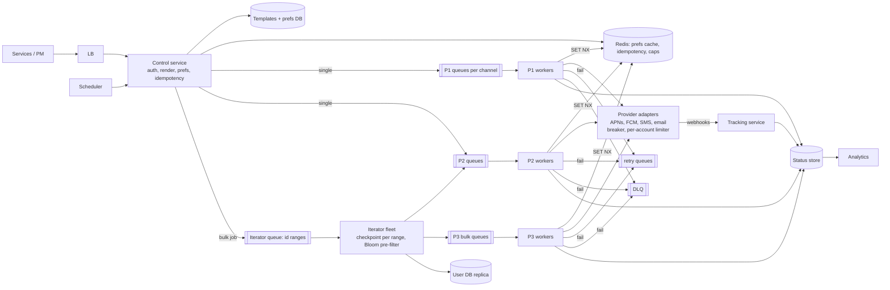
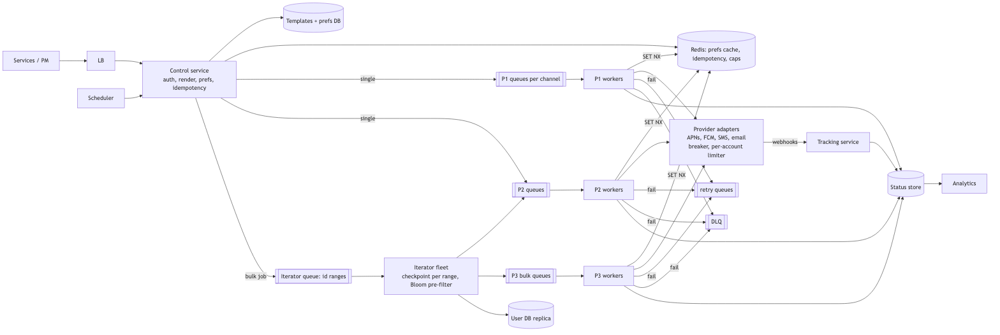
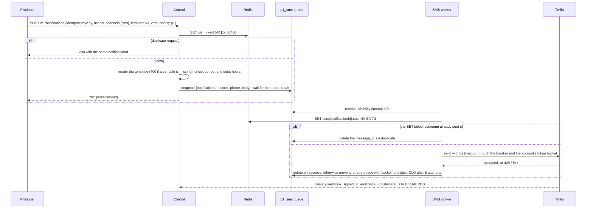

# 07 — Design a Notification System (book ch. 10)

*Written as I would talk through it in a design discussion, with the reasoning behind each choice.*

## 1. Problem statement

We are building the platform that every other team uses to send notifications to users over mobile push,
through Apple's and Google's services, over SMS, and over email. It is soft real-time: a few seconds of delay
is fine, minutes is not for the important ones. The steady load is about ten million pushes, a million SMS
and five million emails a day, but on top of that product teams run campaigns that reach tens of millions of
users at once. Users can opt out. Notifications come from services reacting to events and from schedules. The
two things everyone cares about are that we never lose a notification and that nobody gets the same one twice.

## 2. Scope

I'll build the ingestion API, templates, the lookup of a user's devices and preferences, priority lanes so a
marketing blast cannot delay a one-time password, bulk iteration over a cohort, per-channel workers, provider
integrations with failover, retries with a dead-letter queue, the idempotency that makes "effectively once"
true, delivery tracking, scheduling, and the consent audit the lawyers will ask about. I'll leave out an
in-app inbox UI, the campaign authoring experience, and send-time optimization models, which I'll name as
future work.

## 3. Functional requirements

A service calls us with a template, the variables for it, who to send to, which channels, a priority, and an
idempotency key, optionally with a time to send. We resolve the user to device tokens, a phone number and an
email, and we respect opt-outs, quiet hours in the user's local time zone, and frequency caps. Templates are
versioned per channel and locale, and we render at enqueue time so a missing variable fails the request right
there instead of failing a worker ten minutes later. We retry failures and park the permanent ones. We track
sent, delivered, opened and clicked.

Then the requirements nobody states but every real system needs: consent has to be auditable because of GDPR
and TCPA, marketing emails need unsubscribe links, delivery receipts from providers are also at least once, and
"send at nine in the morning local time" is really twenty-four separate campaigns.

## 4. Non-functional requirements

The accept API should be 99.9% available and return in under a hundred milliseconds at p99, and it returns a
202 only after the notification is durably queued, because producers must not block on us and must not lose
anything.

Priority-one delivery, meaning one-time passwords and appointment reminders, gets 99.99% and an end-to-end
p99 under five seconds from accept to provider acknowledgement, because a missed reminder is a user-visible
failure.

Bulk: a hundred-million-user campaign should drain within an hour, which is about twenty-eight thousand sends
a second. I'd note that SMS providers cap an account at a few hundred messages a second, so a ten-million SMS
campaign takes hours no matter how many workers we add; that is a provider limit, not ours.

Delivery semantics: everything underneath delivers at least once, so our job is to make it effectively once
from the user's point of view with an idempotency key.

Durability: once we say 202, the notification is never lost; the queue is replicated and failures go to a
dead-letter queue rather than being dropped.

Read to write: almost entirely writes; the only reads are the status dashboard.

As an error budget: 99.99% for priority-one delivery is about four minutes a month during which a priority-one notification can fail to reach a provider. Dead-letter arrivals and queue-age breaches on the priority-one lanes spend it, so those are the pages, and a spent budget halts non-essential worker and provider changes.

## 5. Design tenets

Accept fast and deliver asynchronously: the API validates, renders, dedupes and enqueues, and nothing else. One
queue and one worker pool per priority per channel, so a slow SMS carrier never starves one-time passwords.
An atomic idempotency guard before every single provider call, because "check whether we sent it, then send,
then mark it sent" is a race that duplicates. Preferences are checked twice, once when we enqueue and once
right before we send, because a campaign can sit in a queue long enough for someone to opt out. Providers
are pluggable, there are at least two per channel, and each has a health score and its own rate limit. And
templates are rendered at enqueue so the message carries its final body and workers stay dumb.

## 6. Back-of-the-envelope estimation

Steady state of sixteen million a day is about 185 a second. A hundred-million campaign in an hour is about
28,000 a second, so I'd design the pipeline for thirty thousand plus. Each message record is about a kilobyte,
so sixteen gigabytes a day at steady state and thirty days hot is around half a terabyte, with each campaign
adding a hundred gigabytes.

The idempotency tracker needs one key per user per campaign per channel. A hundred million users at eight
bytes is 800 megabytes per campaign; five concurrent campaigns is four gigabytes in Redis with a seven-day
TTL, which is easy.

Device tokens: a hundred million users with one and a half devices at 200 bytes is 30 gigabytes; we cache the
active twenty percent.

SQS lets us batch ten messages per call, so the queue is not the limit; providers are. Push services take
thousands a second per connection pool; SMS takes hundreds a second per account. That means parallelism has
to be managed per provider account, not just by adding workers.

**The hard part** is two things. Fan-out throughput without hurting priority one, which is where the separate
queues, the parallel iterator and per-provider rate limiting earn their place. And effectively-once on top of
at-least-once plumbing: SQS redelivers, the iterator restarts, a worker crashes after the provider accepted,
our own retries fire, and provider webhooks arrive twice. The atomic idempotency key is the single mechanism
that makes all of that safe, so I'd spend interview time on it.

## 7. System components and services

The control service is the accept API: it authenticates the calling service with an app key and HMAC
signature, validates the request, renders the template, does a quick preference check, checks the request's
idempotency key, and enqueues.

The template service and its database hold versioned templates per channel and locale with their required
variables and a preview endpoint. The platform owns the service; product teams own the content.

The preference and contact store holds devices, phone and email encrypted, opt-outs, quiet hours, frequency
caps, and the consent audit, with a cache in front.

The iterator service handles bulk sends. It splits a campaign into about a thousand ranges of user IDs, and
many iterator instances work the ranges in parallel, each checkpointing progress so a crash resumes rather
than restarts. It applies preferences and a Bloom-filter pre-check and enqueues one message per user.

The queues are one per priority per channel: p1 push, p1 SMS, p2 email and so on, each with its own worker
pool.

Channel workers dequeue, take the idempotency guard, re-check quiet hours, call the provider through a
circuit breaker and a per-account rate limiter, and either delete the message or route it to retry or the
dead-letter queue, updating status as they go.

Provider adapters wrap APNs, FCM, Twilio, Vonage, SES and SendGrid, keep a health score per provider, and
fail over.

The tracker is Redis holding idempotency keys and per-user frequency counters.

The status store and tracking API record delivery states from provider callbacks, which are signature-verified,
and open and click events from clients.

The scheduler moves due jobs onto the queues, with one job per time zone for local-time campaigns.

And an admin surface provides a thousand-user canary cohort and a kill switch that drains a campaign's
messages without sending them.

## 8. Architecture and flows





*Vector version: [07-notification-system-1-architecture.svg](diagrams/07-notification-system-1-architecture.svg)*





*Vector version: [07-notification-system-2-flow.svg](diagrams/07-notification-system-2-flow.svg)*


Narrated: a service posts a notification with an idempotency key. The control service tries to set that key
in Redis; if it was already there, this is a retry from the producer and we return the original ID. Otherwise
we render the template, failing fast if a variable is missing, check that the user has not opted out and is
not in quiet hours, enqueue to the right priority-and-channel queue, wait for the queue to acknowledge, and
return 202. A worker receives the message and, before anything else, tries to set a "sent" key for this
notification and channel. If that set fails, another worker already handled it and this is a redelivery, so
we drop it. If it succeeds, we call the provider. On success we delete the message; on a retryable failure we
move it to a delay queue; after five attempts it goes to the dead-letter queue and an alarm fires.

## 9. Communication between services

Producers call the control service synchronously and get 202 only after the queue has acknowledged the
message; with Kafka that would mean acks from all in-sync replicas. The control service's calls to the
database and Redis are synchronous with short timeouts, and the preference cache is cache-aside with a
five-minute TTL plus delete-on-write.

From control and iterator into the queues and out to workers is asynchronous and at least once, one queue
per priority per channel.

Workers call providers synchronously over HTTP/2 for Apple and HTTPS connection pools for the rest, each
behind a client-side circuit breaker that opens on a high failure rate and half-opens to test recovery, a
per-account token bucket so we never exceed the provider's limit, and a bulkhead so one provider's slowness
cannot exhaust the threads for the others.

Retries go to separate delay queues at one minute, five, thirty, two hours and twelve hours, with jitter so
thousands of failed messages do not retry in lockstep. Attempts are capped and the dead-letter queue keeps
messages for fourteen days.

Providers call our tracking service with webhooks, which we verify by signature and treat as idempotent by
provider message ID because they too arrive more than once.

One correctness point on the write path: if the control service inserts a notification row and then publishes
to the queue, a crash between the two leaves a row that says accepted with nothing behind it. If the row must
exist for the status API, I'd use a transactional outbox, writing the row and the event in one transaction and
having a relay publish, rather than write-then-publish.

## 10. Deep dives

### 10.1 Effectively once

Every path in this system can duplicate: SQS redelivers when a visibility timeout expires, the iterator
resumes from a checkpoint and re-enqueues a few, a worker crashes after the provider accepted but before it
deleted the message, our retries fire, and webhooks repeat. The guard is a single atomic Redis command, SET
the key notif-user-campaign-channel only if it does not exist with a seven-day expiry, executed before the
provider call. Only the worker whose SET succeeded proceeds. Where the provider accepts an idempotency key we
pass the same one along. A Bloom filter is fine as a cheap pre-filter in the iterator to avoid wasted
enqueues, but it cannot be the real guard: it is not atomic, and a false positive would silently skip a user
who never got the campaign.

### 10.2 Bulk fan-out without starving priority one

The iterator splits a campaign into about a thousand ranges of user IDs and puts one message per range on its
own queue, so many instances work in parallel and each range checkpoints where it got to. Separate queues and
worker pools per priority give load isolation, which matters because SQS has no priority ordering. Each
provider account has a token bucket so one campaign cannot consume the SMS quota that one-time passwords
need, and priority one gets a reserved share of each account's capacity.

### 10.3 Providers

A breaker per provider opens at around fifty percent errors over thirty seconds with a minimum volume so a
quiet provider does not flap. When it is open, the adapter routes to the secondary provider for that channel
or parks messages in a delay queue. We honour 429 and Retry-After. Permanent errors, an invalid device token, a
hard email bounce or a spam complaint, mark that channel invalid for that user and stop retries.

### 10.4 Preferences, consent and scheduling

Opt-out and quiet hours are checked at enqueue so we skip early, and again in the worker because a backlog
can be long. Frequency caps are a per-user daily counter in Redis, with transactional notifications exempt.
Consent changes are appended to an audit table with timestamps and source. Scheduling is a table of due jobs
polled by a scheduler process; a local-time campaign becomes one job per time zone.

### 10.5 Failure modes

A provider returns 429 or 5xx or is down: workers back off with jitter, the breaker opens, we fail over to the
secondary, and the dead-letter queue catches what cannot be sent. The Redis tracker is down: for priority one
we send anyway, because a duplicate reminder beats a missed one; for marketing we pause, leaving messages in
the queue for the visibility timeout to return them; either way we alarm. The iterator crashes mid-campaign:
its range message is redelivered and resumes from the checkpoint, and anything it re-enqueues is caught by the
idempotency key. Queue age grows: we alarm on the age of the oldest message per queue rather than depth,
autoscale workers per queue, and shed priority three. A bad template or wrong cohort filter: the preview and
the thousand-user canary catch most of it, and the kill switch drains the rest without sending. Stale device
tokens: the provider's permanent error marks the channel invalid. A webhook storm or replay: idempotent by
provider message ID and signature-verified. And the control service writing a row but failing to enqueue: the
outbox, or returning 5xx before 202.

## 11. API design

```
POST /v1/notifications   headers: X-App-Key, X-Signature (HMAC), Idempotency-Key
  body {recipients: [{userId}] | cohort: {filter}, channels: [push, sms, email],
        template: {id, version}, locale, vars, priority: p1 | p2 | p3,
        category: transactional | marketing, scheduleAt?, ttlSeconds?, collapseKey?}
  202 {notificationId | campaignId, perChannel: {push: "QUEUED", sms: "SKIPPED_OPTOUT"}}
  400 on a render error
GET  /v1/notifications/{id}        status per channel, attempts, provider ids
POST /v1/campaigns/{id}/cancel     the kill switch, drains without sending
PUT  /v1/users/{id}/preferences    {optOut: {marketing_push: true}, quietHours: {start, end, tz}}
POST /v1/users/{id}/devices        {platform, token, appVersion}
POST /v1/callbacks/{provider}      provider webhooks, signature-verified
POST /v1/events                    client open and click events
```

## 12. Data model

```
users(user_id PK, email encrypted, phone encrypted, country, locale, tz)
devices(device_id PK, user_id, platform, token encrypted, app_version, last_seen, valid)
preferences(user_id, channel, category) PK, opt_out, quiet_start, quiet_end, tz, updated_at
consent_audit(user_id, channel, category, granted, source, ts)      -- append only
templates(template_id, channel, locale, version) PK, subject, body, required_vars
notifications(notification_id PK, idempotency_key UNIQUE, app_id, user_id, campaign_id, priority,
              template_ref, rendered_payload, created_at, schedule_at, ttl, collapse_key)   -- 90 day TTL
deliveries(notification_id, channel) PK, status (QUEUED, SENT, DELIVERED, FAILED, SKIPPED, DLQ),
           attempts, provider, provider_msg_id, last_error, updated_at
campaign_ranges(campaign_id, range_id) PK, start_uid, end_uid, checkpoint_uid, status
events(notification_id, event, ts, meta)   -- append only, partitioned by time
Redis: idem:{key}, sent:{notificationId}:{channel}, cap:{user}:{day}, prefs:{user}
```

The queries are: devices and preferences by user, which is hot and cached; insert a notification and its
deliveries; update a delivery by notification and channel; look up by idempotency key; update a range's
checkpoint; and time-range scans of events, which belong in a warehouse.

## 13. Database choices

Users, devices, preferences and consent need correctness: constraints, an audit trail, and transactional
updates to preference logic. They are moderate in size. A managed relational database with a Redis cache in
front is the right call; I'd move to DynamoDB only past a billion users, giving up some constraint checking
for scale-out. Templates live in the same relational store because they are tiny and versioned.

Notifications and deliveries are sixteen million or more writes a day with point updates by ID and a
natural TTL. That is a wide-column or key-value shape, so DynamoDB, or Cassandra if we self-host. I give up
ad-hoc queries, which the warehouse serves.

The tracker needs an atomic set-if-not-exists with expiry, counters, and in-memory speed at around a hundred
thousand operations a second per node: Redis Cluster. I'd turn persistence off because the keys are
rebuildable and the worst case of losing them is a rare duplicate; DynamoDB conditional writes are the
durable alternative at a latency cost.

Events go through Kafka into Parquet on S3 and a warehouse for analytics; they do not belong in the
transactional store. Campaign ranges and checkpoints are small transactional rows and sit in the relational
database.

## 14. Tools and technologies

Queues: SQS over Kafka and RabbitMQ. The deciding factors are per-message acknowledgement with a visibility
timeout, a dead-letter queue out of the box, managed operation, and the fact that we do not need ordering per
user. I give up replay and the ability for several consumer types to read the same event; if we later need
per-user ordering or replay for the bulk path, that path moves to Kafka keyed by user.

Redis over Memcached for the tracker because of the atomic set-if-not-exists and counters. Native APNs over
HTTP/2 with token authentication and FCM's HTTP v1 API, with connection pools and batching. Twilio as primary
SMS with Vonage as failover and local aggregators in markets like India for cost, routed by country. SES
primary and SendGrid failover for email with bounce and complaint webhooks and DKIM and SPF configured. A
database-backed scheduler polled by a process, moving to Temporal if workflows grow complex. An application
outbox for the row-plus-event atomicity. And a resilience library such as resilience4j in the workers for
breakers and bulkheads per provider.

## 15. Metrics and monitoring

Accept rate and status codes and p99; the idempotency duplicate rate, where a rise means a producer is
re-sending; preference cache hit ratio, because the control service's latency budget assumes most lookups never
reach the database. Per queue: age of the oldest message with an alarm at sixty seconds for priority one, depth,
in-flight count, and dead-letter depth which alarms above zero. Per provider: send rate, latency, errors by
code, breaker state, remaining quota, and failover count. End-to-end priority-one latency from accept to
provider acknowledgement to delivered webhook. The dedup hit rate in the workers, where a sudden rise means
something upstream is re-sending. Opt-out rate after a campaign as a quality signal, and bounce and complaint
rates for deliverability. And a campaign dashboard showing ranges done, sends per second and an ETA.

## 16. Notification and logging

Every state transition is logged as a structured record with notification ID, channel, status, provider,
latency and error, flowing through Kafka to a searchable store for two weeks and S3 long-term, with personal
data masked and the payload text kept only in the notifications table. Priority-one queue age, dead-letter
depth, a breaker open for more than five minutes and accept 5xx all page. Deliverability trends open tickets.
Campaign start, finish and kill events post to the owning team's channel, and a weekly deliverability report
goes to product owners.

## 17. CI/CD, cost, operations, and what comes next

Control, each worker type, the iterator and tracking deploy independently, with the message schema
versioned. Worker changes canary on the priority-three pool first; a new provider takes a small percentage of
traffic before the rest. Staging uses provider sandboxes, and a synthetic end-to-end canary sends to devices
and numbers we own every five minutes in production. Templates are reviewed and preview-rendered in CI, and
campaigns go to the canary cohort before the full send with the kill switch armed. Rollback for code is redeploying the previous worker image, and rollback for a campaign is the kill switch.

Backups: the preference and consent database needs point-in-time recovery because consent records are a legal
obligation; a recovery point of minutes and a recovery time of an hour, with restores drilled. Notifications and
deliveries are ninety-day data and need only replication, not long-term backup.

Cost is dominated by provider fees, SMS especially; dedup and preference checks pay for themselves by not
sending what should not be sent.

Regions: control, queues and workers run per region; each user is homed in one region so the tracker is
regional, and a user moving regions mid-campaign is rare enough to accept. Provider accounts may be global.

Ownership: the platform team owns control, queues, workers, tracker and preferences; product teams own their
templates and cohorts; the contract between them is the notify call with template, version, target, priority
and idempotency key.

At ten times the scale the bulk path moves to Kafka for replay and per-user ordering, rate limiting becomes
hierarchical per provider account, and the next features are an in-app inbox and web push, WhatsApp and RCS
channels, send-time optimization, coalescing many pushes into a summary, regional data residency, and an A/B
testing harness.
