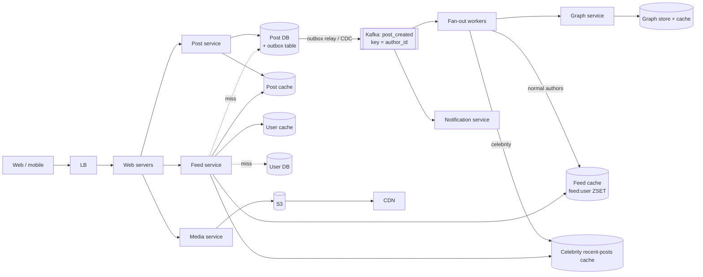
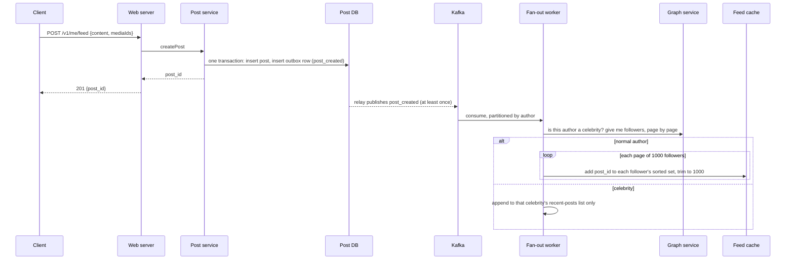

# 08 — Design a News Feed System (book ch. 11)

*Written the way I would talk through it in a 45–60 minute design discussion. Each section is what I would
actually say, including why I make each call and what I give up by making it.*

## 1. Problem statement

We are building a news feed like Facebook's or Twitter's. People publish posts, which can carry text and
media, and every user sees a feed made up of posts from the people they follow, newest first. It has to
work on web and mobile. We are told to plan for 10 million daily active users and that a user can follow up
to 5,000 people, but we should also assume a small number of accounts with millions of followers, because
that is where feed systems usually break.

## 2. Scope

I want to agree on what we are and are not building before I draw anything. We are building the publish
path, the feed read path, and the fan-out machinery in between that gets a new post into the right feeds.
We will touch the follow graph and media storage because the feed depends on them, but only as far as the
feed needs. I am leaving ranking out: the interviewer confirmed reverse-chronological order is fine, and a
ranked feed is a different problem that layers on top of this one. Ads, stories, and comment threads are
also out; I'll mention where they would plug in at the end.

## 3. Functional requirements

Three things have to work. First, a user publishes a post and gets a confirmation that it was saved. Second,
a user opens the app and sees a feed of posts from the people they follow, newest first, with the author's
name and avatar and any media attached, and they can keep scrolling backwards in time. Third, when someone
I follow posts, it shows up in my feed within a few seconds, not minutes.

## 4. Non-functional requirements

The numbers I'd put down, and why each one matters.

Reading the feed has to be fast: I'd target a p99 under 200 milliseconds on the server side, because the
feed is the first screen in the app and it is what the product is. I would hold it to 99.9% availability.

Publishing can be a bit slower, say p99 under 300 milliseconds, but the post has to be durably saved before
we tell the user it posted. We never want the "I posted it and it vanished" bug.

Delivery into friends' feeds can lag by a few seconds. I'd say p95 under 5 seconds, p99 under 30. This is
important to state out loud, because it means the feed is eventually consistent, and that one admission is
what makes the rest of the design cheap.

Read-to-write ratio: 10 million people each opening the feed around ten times a day is 100 million feed
reads, against maybe 2 million posts a day if one in five users posts once. That is roughly 50 to 100 reads
per write. Everything downstream follows from that number: we optimise for reads and precompute wherever we
can.

Durability: posts must never be lost, but the feed itself is derived data that we can always rebuild from
posts and the follow graph. That distinction decides where we spend money on durability and where we do not.

As an error budget: 99.9% for feed reads is about forty-three minutes a month of failed or slow loads. Read errors and p99 breaches spend it, fan-out lag past its target spends the freshness promise, and when either is spent we stop rolling read-path changes until the cause is fixed.

## 5. Design tenets

These are the principles I'd state up front so the interviewer knows how I'll make decisions later.

I'll precompute the feed for the normal case and compute it on the fly only for the cases that would be
too expensive to precompute. Concretely, when most users post, we push the post ID into their followers'
feeds immediately; when a celebrity posts, we don't, and readers pull celebrity posts in at read time.

The feed cache holds post IDs only, never the post content. Content lives in its own cache. That keeps the
feed cache small and means an edited or deleted post is reflected everywhere without touching millions of
feeds.

The publish path does one durable write and then hands everything else to asynchronous workers. The user
waits for the write, not for the fan-out.

The follow graph service is the single source of truth for who is allowed to see what. Fan-out workers ask
it; they can cache the answer for a short while but never for long, because unfollows and blocks have to
take effect.

## 6. Back-of-the-envelope estimation

Posts: 10 million users, assume 20% post once a day, so 2 million posts a day. Divided by roughly 100,000
seconds in a day that is about 23 posts per second, maybe 70 at peak. This is a tiny write rate. A single
relational database primary handles thousands of writes a second, so the post store is not where the scale
problem is.

Fan-out: if the average user has 200 followers, 2 million posts turn into 400 million feed-cache inserts a
day, about 4,600 per second on average and maybe 15,000 at peak. Spread across a sharded in-memory store
that is comfortable. But one celebrity with 5 million followers turns one post into 5 million inserts, which
is a thousand times the normal per-post cost and would land on the workers all at once. That number is why
celebrities get a different path.

Feed reads: 100 million a day is about 1,200 per second, say 3,000 at peak. Each read fetches one page of
20 post IDs, then 20 posts and 20 author records. If those are batched and mostly cached, that is around
120,000 cache operations per second at peak, which is a few Redis shards.

Feed cache size: if we keep the latest 500 post IDs per active user at 16 bytes each, 10 million users is
about 80 gigabytes. Add some headroom for recently inactive users and we are around 100 gigabytes, which is
a modest Redis cluster. The post content cache for the last couple of days is a few gigabytes. Media goes to
a CDN and I'm not counting it here.

So the numbers tell me: the post database is easy, the fan-out and the caches are where the engineering is,
and celebrities are the thing that can hurt us.

**The hard part**, which I would name here: fan-out. Deciding when to do work at write time versus read
time, keeping fan-out lag bounded when follower counts vary by five orders of magnitude, and making sure
every cached copy of the feed is never stale beyond a window we have agreed to.

## 7. System components and services

I'll draw only the boxes I know we need, and for each I'll say what it alone is responsible for.

The web and API servers terminate the client connection, authenticate, rate-limit, and route to the right
service. They hold no state.

The post service owns posts: writing them, reading them by ID, and the post cache in front of its database.
It also writes an "a post was created" event, and I'll explain below why that write has to be in the same
transaction as the post.

The graph service owns the follow relationships and the block and mute lists. It answers two questions:
"who follows this user" in pages of a thousand, which the fan-out needs, and "who does this user follow",
which we need to rebuild a feed from scratch.

The fan-out service and its workers take a new post and push its ID into every follower's feed cache,
except for celebrities, whose posts go into a small per-celebrity list instead.

The feed cache is a sorted set per user in Redis, holding post IDs ordered by time.

The feed service answers the read. It fetches a page of IDs from the feed cache, merges in any recent posts
from celebrities the user follows, fetches the post and author content from caches, and returns the page.

The media service hands out upload URLs so clients send bytes straight to object storage, then processes
images and videos and serves them through a CDN.

The notification platform, which is its own design, gets told about new posts so it can send pushes.

A small counters service owns like and comment counts, because those are high-write and should not sit on
the post row.

If I zoom into the fan-out worker, it does this: read the event from the queue, ask the graph service for a
page of followers, drop anyone who has blocked or muted the author, drop anyone who hasn't opened the app
in 30 days, and then write the post ID into each remaining follower's sorted set, trimming the set so it
never grows past about a thousand entries.

## 8. Architecture and flows




*Vector version: [08-news-feed-1-architecture.svg](diagrams/08-news-feed-1-architecture.svg)*


Here is the publish flow as I would narrate it.




*Vector version: [08-news-feed-2-flow.svg](diagrams/08-news-feed-2-flow.svg)*


The user hits publish. The web server calls the post service, which in a single database transaction
inserts the post and also inserts a row into an outbox table saying "post created". We return 201 to the
user right there; they have waited only for one database write. A relay process reads the outbox and
publishes the event to Kafka, keyed by the author's ID. A fan-out worker picks it up, asks the graph service
whether this author is a celebrity, and if not, pages through the followers and writes the post ID into each
follower's feed. If the author is a celebrity, the worker writes the post into a short list that belongs to
that celebrity and does nothing else.

The read flow: the client asks for its feed with a cursor. The feed service reads the next 20 post IDs from
the user's sorted set. It also looks up which celebrities this user follows, reads each one's recent-posts
list, and merges those in by time. Then it fetches the 20 posts and 20 authors in one batched call to the
content caches, falls back to the database for any misses, filters out anything deleted or from a blocked
author, and returns the page with a new cursor.

## 9. Communication between services

Client to API is a normal synchronous HTTPS request. I'd use REST with cursor-based pagination, where the
cursor is just the last post ID the client saw, which works because post IDs are time-ordered.

The API's call into the post service is synchronous, and the 201 goes back only after the post and the
outbox row are committed. That is the one place a user waits.

Getting the event from the database into Kafka is the piece people get wrong, so I'd call it out. If the
post service wrote to the database and then separately published to Kafka, a crash between the two leaves a
post that exists but never reaches anyone's feed. Writing both in one transaction is impossible across two
systems. So we write the event into an outbox table inside the same database transaction as the post, and a
relay publishes from there. The relay might publish twice if it crashes, which is fine because adding the
same post ID to a sorted set twice is a no-op. Change-data-capture with something like Debezium does the
same job without the outbox table, and I'd switch to that once several tables need to emit events.

Fan-out workers call the graph service synchronously, in batches of a thousand followers, with a short
timeout and a brief cache of the result. They write to Redis with pipelining so a page of a thousand
followers is a handful of round trips, not a thousand.

The feed service fans out its content reads in parallel and coalesces concurrent misses for the same post so
a viral post does not turn into a thousand identical database queries.

Media never flows through our API servers. The client asks for a pre-signed upload URL and sends the bytes
to object storage directly; processing is kicked off by the storage event.

## 10. Deep dives

### 10.1 Fan-out on write versus fan-out on read

This is the decision the whole design turns on, so I'd spend time here. There are two pure options and one
hybrid.

Fan-out on read means we store nothing per user; when you open the app we look up everyone you follow, fetch
their recent posts, merge and sort. The read is expensive, a few hundred lookups, and it is expensive every
single time. The write is free.

Fan-out on write means that when you post, we push the post into every follower's precomputed feed. The
read becomes one range query. The write costs one insert per follower. That is cheap for a normal user and
ruinous for a celebrity, and it wastes work on followers who never open the app.

My criteria are read latency, because reads are a hundred times more common than writes; the cost of the
worst-case write; and wasted work. Those criteria point to the hybrid. For any author with fewer than, say,
ten thousand followers, we fan out on write. For the handful of accounts above that threshold we skip the
push entirely and let readers pull their recent posts at read time; the per-celebrity list is tiny and hot,
so the pull is a single cache read per celebrity followed. And we skip pushing to anyone who has been
inactive for 30 days; if they come back, we rebuild their feed once from the graph, which is just fan-out on
read done lazily.

What I give up: writes for mid-sized authors still cost thousands of inserts, there are a few seconds of
lag before a post appears, and a user who follows many celebrities pays a merge cost on every read. I
accept all three because they keep the common read path to a single sorted-set query.

### 10.2 The feed cache

Each user has a Redis sorted set where the member is the post ID and the score is also the post ID, which
works because we generate IDs with a Snowflake-style scheme that embeds the timestamp in the high bits, so
sorting by ID is sorting by time. After each insert we trim the set to the newest thousand entries. If a
user scrolls past that, the feed service falls back to building older pages from the graph and the post
database, which is rare enough that it does not need to be fast.

The cache is sharded by user ID across a Redis cluster with replicas, so reads scale and a lost shard is a
failover, not a data loss.

I want to be precise about staleness, because every cache has a window where it serves old data. The feed
cache is at most the fan-out lag behind. The post content cache is behind only until we delete the key on
edit or delete, with a short TTL as a backstop. Media on the CDN uses versioned URLs, so a new upload is a
new URL and nothing is ever stale. Saying those three windows out loud is what makes "eventually
consistent" a design rather than an excuse.

### 10.3 Correctness under concurrency

Fan-out is idempotent by construction: adding a post ID that is already in the sorted set does nothing, so
Kafka replays and duplicate outbox publishes are harmless.

Ordering is by the post ID. Two posts created in the same millisecond on different machines will be ordered
by machine ID rather than by true time, and for a feed that is fine.

Deletes and privacy changes do not fan out. We mark the post deleted in the database, drop it from the post
cache, and the feed service simply skips IDs it cannot hydrate. A low-priority job removes the ID from feed
sets later. Trying to synchronously remove a post from a million sorted sets would be slow and pointless
when a filter at read time gives the same result.

Blocks work the same way: the graph service is checked at read time, so a block takes effect on the next
refresh regardless of what is sitting in the cache.

Like counts are incremented inside Redis with an atomic increment and written back to the database
periodically. The bug to avoid is reading the count, adding one in application code, and writing it back;
two concurrent likes would both read 77 and both write 78, and one like is lost.

A user who just posted should see their own post on their profile immediately, so the author's own reads of
their profile timeline go to the primary database, not a replica, for a few seconds after a write.

### 10.4 Failure modes

I'd walk through what breaks, what the user sees, and what we do.

If Kafka is backed up or the workers are slow, feeds get stale by seconds to minutes. Reads keep working
because the cache is there. We alarm when fan-out lag passes 30 seconds and autoscale workers.

If a feed cache shard dies, those users see an empty feed on their next load. The feed service detects the
miss and rebuilds that user's feed from the graph and the post store, which is slower but correct. Replicas
make this rare.

If the graph service is slow, fan-out lags. For reads, I'd fail closed on blocks (if I cannot confirm the
block list, I'd rather show a slightly degraded feed than show someone a post from a person who blocked
them) and fail open on mutes, which are a convenience.

If the post database primary dies, publishing fails until a replica is promoted, which takes a minute with
semi-synchronous replication so no acknowledged post is lost. Reads continue from caches and replicas.

If a celebrity is misclassified as a normal user, one post produces millions of inserts and the workers for
that partition stall. The worker checks the live follower count before fanning out, and we alarm on any
single key producing an outsized number of writes.

A viral post can cause a cache stampede when its content cache entry expires and thousands of readers miss
at once. We coalesce misses per key, add jitter to TTLs, and keep a one-second in-process cache in front of
Redis on the feed servers.

## 11. API design

```
POST /v1/me/feed
  body: {content, mediaIds[], visibility}
  201: {postId, createdAt}

GET /v1/me/feed?cursor=<lastPostId>&limit=20
  200: {items: [{postId, author: {id, name, avatarUrl}, content, media: [{url, type}],
                 createdAt, likeCount, commentCount}], nextCursor}

POST /v1/media/upload-url        -> {uploadUrl, mediaId}
GET  /v1/users/{id}/posts?cursor= (a user's own timeline)
POST /v1/users/{id}/follow, DELETE /v1/users/{id}/follow, POST /v1/users/{id}/block
```

The cursor is opaque to the client but is just the last post ID, so paging is a range query on the sorted
set and never a scan.

## 12. Data model

```
users(user_id PK, handle UNIQUE, name, avatar_url, created_at)
posts(post_id PK, author_id, content, media JSON, visibility, created_at, deleted_at NULL)
      index on (author_id, post_id DESC)            -- profile timeline
outbox(id PK, aggregate_id, event_type, payload, created_at, published_at NULL)
follows(follower_id, followee_id) PK                 -- "who do I follow", partitioned by follower
followers(followee_id, follower_id) PK               -- "who follows me", partitioned by followee
blocks(user_id, blocked_id) PK;  mutes(user_id, muted_id) PK
celebrity_flags(user_id PK, follower_count, is_celebrity, refreshed_at)

Redis: feed:{user} sorted set; celebrity_recent:{author} list of 50; post:{id}; user:{id}; count:{post}
```

The follow relationship is stored twice, once in each direction, each partitioned by the ID you look it up
by. That duplication is deliberate: the fan-out asks "who follows X" millions of times a day and needs it to
be one partition read, and the feed rebuild asks "who does Y follow" and needs the same. A join would not
survive sharding.

## 13. Database choices

I'd go through each piece of data and ask what its queries look like before naming a store.

Posts: 23 writes a second, point reads by ID, and a range by author. That fits on a single managed relational
primary with read replicas for years, and I want transactions here so the post and its outbox row commit
together. So Postgres or MySQL. I'd plan the shard key now even though I won't shard yet: author ID, because
it keeps a user's timeline and their outbox rows on one shard. What I give up is day-one horizontal scale;
at ten times the scale I'd shard by author or move posts to a key-value store like DynamoDB with author as the partition
key.

The follow graph: billions of edges, and the hot query is "give me a page of neighbours for one ID". A graph
database would be the textbook answer, but we never traverse more than one hop, and graph databases are
expensive to run at billions of edges. So I'd use a wide-column or key-value store, DynamoDB or Cassandra,
with the two tables above. What I give up is ad-hoc graph queries, which the product does not need.

The feed cache needs a sorted set with range reads and trimming, which is exactly Redis. Memcached cannot do
it because it has no data structures.

The post and user content caches are plain key-value and either Redis or Memcached works; I'd use Redis
simply to run one fewer technology.

Counters go in Redis with atomic increments and periodic write-back to the relational store, plus a nightly
reconciliation that recounts likes for recently active posts and corrects drift. What I give up is exact
counts at every instant, which is fine for likes and would not be fine for money.

Media goes to S3 with a CDN in front and versioned keys.

## 14. Tools and technologies

For the fan-out bus I'd pick Kafka over SQS or RabbitMQ. The deciding reasons are that partitioning by
author gives me ordering per author for free, that retention lets me replay events to rebuild feeds after an
incident, and that more than one consumer needs the same events: the fan-out workers, the notification
platform, and later a search indexer. SQS is simpler to run and I'd pick it if only one consumer existed and
ordering did not matter.

Outbox versus change-data-capture: the outbox is a table and a small relay, and the events are shaped as
business events. CDC is zero application code but couples the events to table layout and adds a connector
to run. I'd start with the outbox and move to Debezium when many tables need to emit.

Service-to-service calls use gRPC for typed contracts and cheap batching; the public edge is REST, or
GraphQL if the mobile clients need to pick fields.

Celebrity flags and inactive-user detection are nightly Spark jobs, with a small Flink job updating flags
faster for accounts that are growing quickly.

Calls to the graph and post services sit behind a client-side circuit breaker so a slow dependency fails fast
instead of filling thread pools.

## 15. Metrics and monitoring

The service-level indicators I'd alarm on map directly to the SLOs: feed read p99 and error rate, publish
p99, and fan-out lag measured from post creation to the last follower's feed update.

Underneath those I'd watch Kafka consumer lag, worker insert rate, graph service latency, the hit ratio of
each cache (feed, post, user; alarm under 90%), the rate of database fallbacks, Redis memory per shard, and
hot-key skew, which is how a misflagged celebrity shows up.

Alarms: fan-out lag p99 over 60 seconds, feed p99 over 400 milliseconds, cache hit ratio under 90%, Kafka
lag rising for ten minutes, and replication lag on the post database.

## 16. Notification and logging

Request logs carry a request ID so a single user's slow feed load can be traced across the web server, feed
service, and caches. I'd sample successful requests at one percent and log every error in full.

For each post I'd log how many followers were targeted versus how many feed inserts succeeded, because a gap
between those numbers is a partial fan-out that no other metric would catch.

SLO breaches page the feed team. Content moderation hooks emit events to the trust and safety pipeline. User
notifications about new posts go through the notification platform with rate caps so a prolific poster
does not generate a push storm.

## 17. CI/CD, cost, operations, and what comes next

Each service deploys independently. Changes to the feed read path go out behind a feature flag with a shadow
mode that computes both the old and new feed and logs any difference, so we catch regressions before users
do.

Before any capacity change I'd replay production read traffic against a staging cache cluster, and I'd run a
chaos test that kills a Redis shard to confirm the lazy rebuild works.

Data migrations, such as moving posts to a sharded store, follow dual-write, backfill, verify, cut over,
with the old path kept until we are sure.

Backups: the post database has snapshots plus the write-ahead log for point-in-time recovery, a recovery point
of minutes and a recovery time of under an hour, kept immutable in another account and restored on a schedule.
The feed cache needs no backup because it is rebuilt from posts and the graph.

Cost: Redis memory for the feed and content caches and CDN egress for media are the two big line items. The
post database is cheap. Trimming the feed sets and skipping inactive users are the main levers.

Regions: web servers, feed service, and caches live in every region. The post database has one primary
region with replicas elsewhere, active-passive. If a region is lost we promote a replica and let feed caches
rebuild lazily.

Ownership: posts, graph, feed, media, and counters are separate teams, and the Kafka topics and gRPC
contracts between them are the boundaries.

At ten times the scale, the post database sharding I planned for kicks in, we add Redis slots, and the next features are a
ranked feed (a scoring step between fetching IDs and hydrating content), real-time push of new items over a
WebSocket or server-sent events, ads insertion, and stories.
