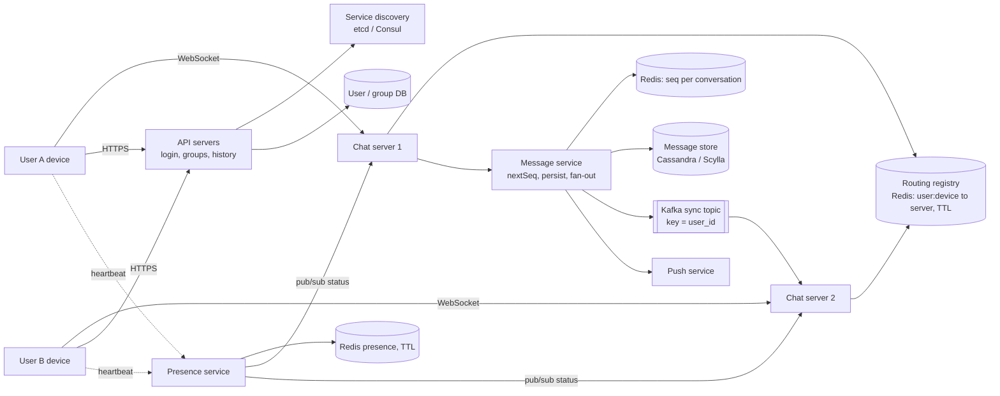
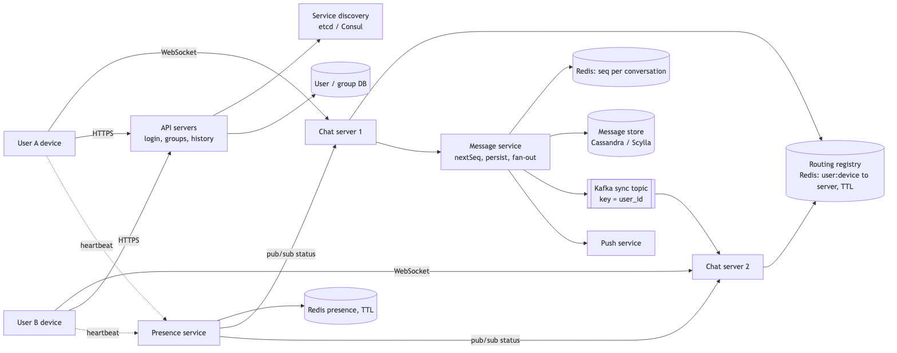
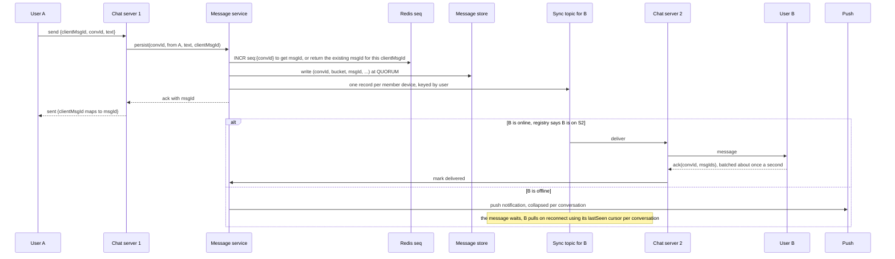
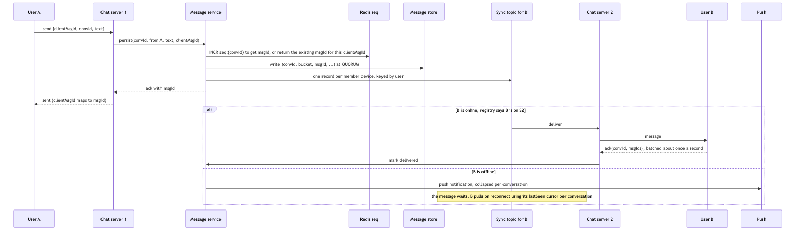

# 09 — Design a Chat System (book ch. 12)

*Written as I would talk through it in a design discussion, with the reasoning behind each choice.*

## 1. Problem statement

We are building a chat application like WhatsApp or Messenger. It supports one-to-one conversations and
groups of up to a hundred people, text messages up to a hundred thousand characters, an online indicator,
multiple devices per user, push notifications when someone is offline, and chat history kept forever. We are
planning for fifty million daily active users on web and mobile.

## 2. Scope

I'll cover real-time delivery over persistent connections, how messages are stored and ordered, how a user's
several devices stay in sync, how group messages fan out, presence, push for offline users, how clients find
a server to connect to, how the connection tier survives losing servers, and the races that can go wrong.
End-to-end encryption is a follow-up the interviewer said we could discuss if time allows; media attachments
would be a pre-signed upload and a URL in the message; voice, video and search are out.

## 3. Functional requirements

Send and receive text in one-to-one and group chats in real time, with delivered and read receipts. Persist
every message and let a user page back through history. Deliver each message to all of a user's devices and
keep them converged. Show whether a contact is online and when they were last seen. Send a push notification
to anyone who is offline.

## 4. Non-functional requirements

Delivery to an online recipient should feel instant, so a p99 under five hundred milliseconds within a
region. Messages in a conversation must appear in the same order on every device; out-of-order chat is a
correctness bug, not a cosmetic one. Durability means we show "sent" only after the message is persisted, and
we never lose a message after that. Availability of 99.99% for sending and receiving, because chat is a
utility people depend on. Scale: fifty million daily users sending about forty messages each is two billion
messages a day, around twenty-three thousand a second on average and fifty thousand at peak, with maybe ten
million concurrent connections. And a consistency split I want to state clearly: the message store is strongly
consistent per conversation, while presence is best-effort and eventually consistent, and presence must never
block messaging.

As an error budget: 99.99% for send and receive is about four minutes a month. Failed sends, delivery past a second, and reconnect storms spend it, so those are the metrics on the pager, and a spent budget pauses connection-tier rollouts.

## 5. Design tenets

A stateful WebSocket tier for real time and a stateless HTTP tier for everything else. Persist first, then
deliver: the message store is the truth and the socket is a fast path. A per-conversation sequence number for
ordering, because a global time-based ID alone is not enough when two people send at once. Groups are small,
so we fan out on write into a sync queue per user and device, and clients resume by cursor. Presence is cheap
to lose, so we push it with pub/sub and fetch it on open as the safety net. And every send carries a client
message ID, because the client will retry and we have to recognize the retry.

## 6. Back-of-the-envelope estimation

Two billion messages a day is about twenty-three thousand a second, fifty thousand at peak. With an average
group of ten members, the delivery side sees about a hundred and fifty thousand delivery events a second at
peak.

Connections: if twenty percent of daily users are online at peak, that is ten million open sockets. A server
holds fifty to a hundred thousand, and the ceiling is memory and file descriptors rather than CPU, so a
hundred to two hundred chat servers plus headroom.

Storage: about two hundred bytes per message gives four hundred gigabytes a day, roughly a hundred and
forty-six terabytes a year, so we tier older data after a year.

Presence: ten million online users heartbeating every thirty seconds is about three hundred and thirty
thousand a second, which is manageable; every five seconds would be two million a second, which is not, so
thirty-second heartbeats plus socket-close detection for fast offline.

The message store takes fifty thousand writes a second, which is a wide-column cluster of ten to twenty
nodes. Sequence counters at fifty thousand increments a second sharded by conversation fit a small Redis
cluster.

**The hard part** is three things. A stateful connection tier that survives losing servers without losing
messages, which needs discovery, a routing registry, and resume by cursor. Ordering and deduplication when
several senders and several devices are involved. And presence fan-out at ten million online users without
melting the pub/sub layer.

## 7. System components and services

API servers over HTTP handle login, profile, group management, history, and the entry point to service
discovery.

Service discovery, on etcd or Consul, picks the best chat server for a client by geography, load and health.

Chat servers hold the WebSocket connections. Each one authenticates on the handshake, runs heartbeats, takes
inbound messages and hands them to the message service, dispatches outbound messages to the right sockets,
and tracks acknowledgements.

A routing registry in Redis maps user-and-device to chat server, with a TTL refreshed by heartbeats so a dead
server's entries expire on their own.

The message service allocates the next sequence number for a conversation, persists the message, fans it out
to the recipients' sync queues, and records receipts.

Sync queues on Kafka, keyed by user, hold undelivered messages per user and device.

The message store is a wide-column database holding all messages by conversation.

The presence service takes heartbeats, decides online or offline, and publishes changes to the chat servers
that care.

Push goes through the notification platform with a collapse key per conversation.

A relational database holds users, devices, group membership and last-read markers.

## 8. Architecture and flows





*Vector version: [09-chat-system-1-architecture.svg](diagrams/09-chat-system-1-architecture.svg)*






*Vector version: [09-chat-system-2-flow.svg](diagrams/09-chat-system-2-flow.svg)*


Narrated: A sends a message over its socket with a client-generated ID. The chat server hands it to the
message service, which gets the next sequence number for that conversation, writes the message to the store
with a quorum write, and produces one record per recipient device onto the sync topic. Only then does it
acknowledge back, and only then does A see "sent". The chat server holding B's connection consumes B's
records and pushes the message down the socket; B acknowledges in a batch about once a second, and the
service marks it delivered. If B is offline, we send a push, and the message simply waits until B's device
reconnects and asks for everything after the last ID it saw.

## 9. Communication between services

Client to chat server is a WebSocket carrying binary protobuf frames, because both sides send constantly and
we want the server to push without being asked. On restrictive networks we fall back to long polling. We ping
every twenty to thirty seconds because proxies kill idle connections at around sixty, and clients reconnect
with exponential backoff and jitter and resume by cursor.

Client to API servers is ordinary HTTPS for everything that is not real time.

Chat server to message service is synchronous gRPC with a timeout set from the service's p99 plus headroom and a
client-side circuit breaker, so a slow message service produces fast "sending failed, retrying" on the client
rather than a thread pool full of waiting requests on the chat server. The sender's acknowledgement goes out only
after persistence, because durability comes before the word "sent".

Message service to sync topic to the recipient's server is asynchronous, with Kafka partitioned by user ID so
one user's messages stay in order.

The routing registry is a synchronous Redis lookup, and because entries carry a TTL refreshed by heartbeats,
a dead server's entries disappear without anyone cleaning them up.

Presence uses pub/sub on per-user channels: a chat server subscribes only for the users its connected clients
are currently looking at, and offline friends are fetched when a chat list is opened. Pub/sub is
fire-and-forget, which is acceptable for presence and would never be acceptable for messages.

The load balancer in front of the sockets is layer four or WebSocket-aware layer seven and routes by
connection, which is the one legitimate case for sticky routing, and it drains slowly on deploys.

## 10. Deep dives

### 10.1 Making the connection tier survive

Service discovery assigns a server at login and the client connects to it directly. Each server holds fifty
to a hundred thousand sockets and records each one in the registry with a TTL. When a server dies, its clients
see a disconnect, ask discovery for a new server, reconnect, and send a sync frame listing their last-seen
message ID per conversation; the gaps are served from the store. Nothing is lost, because every message was
persisted and queued before anyone was told it was sent. For deploys, a server stops accepting new
connections, sends reconnect hints to its clients in waves over five to ten minutes, and only then
terminates, so we never create a reconnect storm ourselves.

### 10.2 Ordering, IDs and deduplication

For the message ID I considered a global Snowflake and a per-conversation counter. A Snowflake is
time-ordered, but two people sending in the same millisecond can be ordered differently on different
devices, which breaks the "same order everywhere" requirement. A per-conversation counter in Redis gives a
total order within the conversation. It is a hot key per conversation, but a conversation is a human-speed
thing and even a hundred-member group is a low rate, so that is fine. I'd pick the counter, snapshot it
durably, and on a cold start derive it from the store's maximum. For deduplication, the pair of conversation
ID and client message ID is unique per sender, so a client retry returns the same message ID rather than
creating a second message, and devices dedupe on conversation ID and message ID.

### 10.3 How messages are stored

The read pattern is recent messages in a conversation, which is hot; infinite scroll backwards; and rare
random access to old data. The write pattern is append-only, with receipts kept separately. That is the
classic wide-column shape that Discord uses with Cassandra and Messenger used with HBase: partition by
conversation plus a time bucket such as the month so no partition grows without bound, and cluster by message
ID descending so the latest page is the first rows. Hot partitions from bots or huge groups get smaller
buckets.

### 10.4 Multiple devices and receipts

Each user-and-device pair has its own sync stream. Delivered is tracked per device and read per user, and the
sender sees the aggregate. Acknowledgements are batched every second or so rather than sent per message. A
last-read marker per member drives unread counts.

### 10.5 Presence at scale

Online means an active socket or a heartbeat within thirty seconds. Offline is fast when the socket closes and
slow when heartbeats stop. Status changes fan out only to people currently watching that user, and for very
large contact lists we switch from push to fetch-on-open. A celebrity's presence channel can get hot, in which
case we shard the channel or move presence to a compacted Kafka topic.

### 10.6 Failure modes

A chat server dies: clients reconnect within seconds and nothing is lost, thanks to registry TTLs, discovery
and cursor resume. A network event causes a reconnect storm: clients back off with jitter, discovery is
load-aware, and servers admit connections at a controlled rate. The message store is slow: the sender sees
"sending" linger, the client retries with the same client message ID so there is no duplicate, writes are
quorum, and we alarm on p99. The Redis sequence shard is down: sends in those conversations fail briefly until
the cluster fails over, with a fallback of store-maximum-plus-one and a conditional insert. Kafka lags: online
recipients get messages late, so we alarm on lag and can route directly via the registry as a fast path while
the topic remains the durable path. The push provider is down: that is the notification platform's problem,
and the messages wait in the store regardless. Presence shows someone offline who is online: cosmetic, we
accept it. A message is delivered twice: the client dedupes on conversation and message ID. The registry has
a stale mapping to a dead server: the TTL fixes it and the sync topic is consumed by whichever server now
holds the user, because the store is the truth.

## 11. API design

HTTP:
```
POST /v1/auth/login -> {token, chatServer: {host, port}, presenceServer}
GET  /v1/discovery/chat-server
GET  /v1/conversations?cursor=                     list with last message and unread count
GET  /v1/conversations/{id}/messages?before=<msgId>&limit=50
POST /v1/groups {memberIds[], name}   (up to 100)      PUT /v1/groups/{id}/members
```
WebSocket frames in protobuf:
```
client to server: send {clientMsgId, convId, text}          server to client: sent {clientMsgId, msgId, ts}
server to client: message {convId, msgId, from, text, ts}
client to server: ack {convId, msgIds[]}  (delivered)        client to server: read {convId, uptoMsgId}
heartbeat both ways                                           client to server: sync {convId: lastSeenMsgId, ...}
server to client: presence {userId, status, lastSeen}         client to server: typing {convId} (never persisted)
```

## 12. Data model

```
users(user_id PK, handle, name, avatar);  devices(device_id PK, user_id, platform, push_token, last_seen)
conversations(conv_id PK, type (direct, group), name, created_at)
conversation_members(conv_id, user_id) PK, joined_at, role, last_read_msg_id       -- partition by conv_id
user_conversations(user_id, last_msg_ts DESC, conv_id) PK, unread_count            -- inbox list, partition by user_id
messages(conv_id, bucket, msg_id DESC) PK, sender_id, content, client_msg_id, created_at   -- wide-column
message_receipts(conv_id, msg_id, user_id) PK, delivered_at, read_at
Redis: seq:{conv_id}; route:{user}:{device} to server (TTL); presence:{user} to {status, last_seen} (TTL)
```

The queries are the latest N messages in a conversation, messages after a given ID for sync, a user's
conversations ordered by activity, point lookups for routing and presence, and the dedupe lookup by
conversation and client message ID.

## 13. Database choices

Messages are append-heavy at fifty thousand a second, read as ranges by conversation, and kept forever. The
options were Cassandra or ScyllaDB, HBase, DynamoDB, and sharded MySQL. The criteria are the partition-plus-
sort-key shape, write throughput from a log-structured engine, tunable consistency so we can write at quorum,
and proven operation at this scale. Cassandra or Scylla fit, and DynamoDB is the managed alternative with
conversation-and-bucket as partition key and message ID as sort key. What I give up is any ad-hoc query; every
access pattern gets its own table.

Users, groups and membership need constraints and transactional membership changes and are small, so a
managed relational database with a cache in front; I give up scale-out I do not need.

Sequence counters, routing and presence need atomic increments, TTLs and sub-millisecond reads, so Redis
Cluster with replicas; the sequence is snapshotted and recoverable from the store, so I give up little by
not persisting Redis.

Sync queues need durability, ordering per key and replay, so Kafka keyed by user; Redis Streams would give
lower latency with bounded retention if that trade suited better.

Receipts live alongside messages in the wide-column store.

## 14. Tools and technologies

WebSocket over server-sent events or long polling, because both sides talk constantly; long polling stays as
the fallback. For the server runtime, Go or Netty on the JVM for connection density, or Elixir if the team has
BEAM experience, which is what WhatsApp and Discord used. Consul or etcd for discovery with health checks.
Redis Pub/Sub or NATS for presence because fire-and-forget at low latency is exactly right for data we can
afford to lose. Kafka with acknowledgements from all replicas and a replication factor of three for the sync
topic. Protobuf on the wire for size and speed, with a JSON debug mode. A layer-four load balancer for the
sockets and layer seven for HTTP. TLS in transit now, with the message store designed to hold ciphertext so
the Signal protocol can be added later.

## 15. Metrics and monitoring

Connections per server with an alarm above ninety percent of capacity; connect, disconnect and reconnect
rates for storm detection; handshake failures. Send-to-sent p99 and send-to-delivered p99 for the online
path; age of the sync topic for the offline path; push fallback rate. Store write and read p99 and hot
partitions; sequence increment latency; registry errors. Duplicate delivery rate, which should be
approximately zero after client dedupe; false-offline rate; heartbeat volume. Alarms on delivery p99 over a
second, Kafka lag rising, a reconnect spike, and store p99.

## 16. Notification and logging

Each message produces lifecycle log entries with the message ID, a hash of the conversation ID, the stage and
the latency, never the content, sampled at one percent for successes and in full for failures, with a request
ID across hops. The connection tier logs aggregate counts per server rather than per connection. Delivery
SLOs and capacity page the on-call, and a capacity forecast dashboard tracks connections against servers.
Push to users goes through the notification platform with per-conversation collapse and mute settings.

## 17. CI/CD, cost, operations, and what comes next

Chat servers roll with connection draining in waves, and the protocol is versioned on the handshake so servers
support the current and previous client version. Stateless services deploy blue-green, so rollback is flipping back to the previous colour; for chat servers
rollback means draining the new version's connections to the old one in the same waves. Load tests simulate a
million sockets, and chaos tests kill chat servers and Redis shards.

Backups: message history is kept forever, so the store has periodic snapshots to object storage in another
region with incremental backups between them, a recovery point of an hour and a recovery time of several hours
for a full restore, which is acceptable because replication across three nodes handles everything short of a
catastrophic bug or deletion; restores are drilled.

Cost is the message store, SSD times a replication factor of three, and the connection fleet; older buckets
move to cheaper storage.

Regions: connection servers, registry and presence are regional so users connect nearby. Each conversation
has a home region for its sequence counter and store, which is per-key ownership and avoids conflicts; members
in another region pay one hop; if a region is lost we re-home conversations from the replicated store.

Ownership: the connection tier, messaging core, presence, push, and users and groups are separate teams, with
the WebSocket frame schema and the Kafka topics as contracts.

At ten times the scale the connection fleet grows linearly and the store adds nodes on its ring; channels
beyond a thousand members switch to a pull model; and the next features are end-to-end encryption with a key
distribution service, a media pipeline, search done client-side if encrypted, and edit, delete and expiring
messages.
