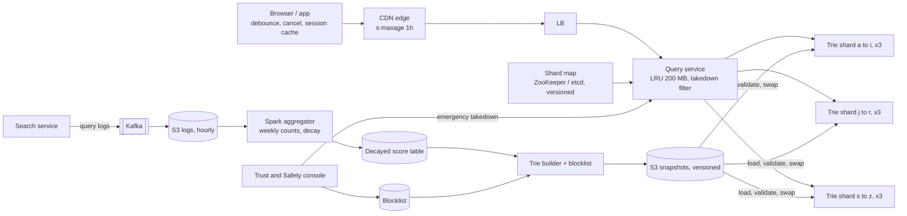
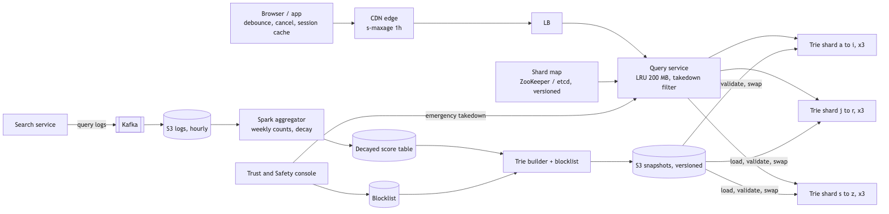
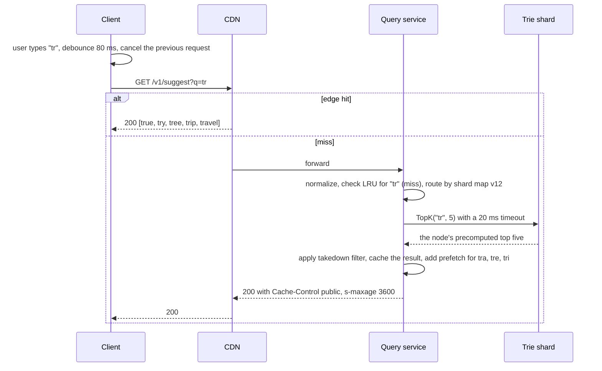
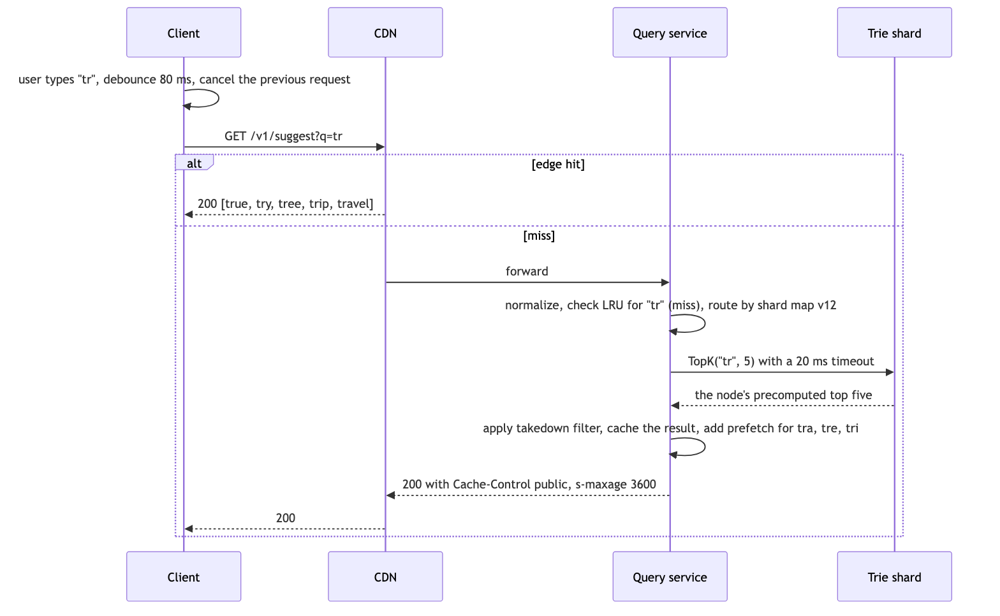

# 10 — Design a Search Autocomplete System (book ch. 13)

*Written as I would talk through it in a design discussion, with the reasoning behind each choice.*

## 1. Problem statement

As a user types into the search box, we show the five most popular queries that start with what they have
typed so far, updated on every keystroke, fast enough that it never feels like it is lagging behind their
fingers. Popularity means how often people searched for that query historically. We have ten million daily
active users, English only, lowercase letters, no spell correction.

## 2. Scope

I'll cover prefix matching and top-k by frequency, how we collect query logs, the offline aggregation and
build of the data structure, sharded in-memory serving, the layers of caching, how often we refresh, how we
filter out suggestions we should not show, and how the client behaves. Spell correction, personalization,
other languages and real-time trending are follow-ups I'll name at the end.

## 3. Functional requirements

Given a prefix, return the top five queries by frequency that begin with it, matching only at the start of the
query. Refresh suggestions from real traffic daily, with an hourly refresh of the hottest prefixes as a
nice-to-have. Filter offensive or harmful suggestions at build time, and have a way to take one down within
seconds without a rebuild.

## 4. Non-functional requirements

Latency is the whole product. People type a character every hundred milliseconds or so, so the suggestion has
to arrive in under a hundred milliseconds end to end at p99, which means our server's share is under twenty.
Serving should be 99.99% available, and I'd separate that from the build pipeline, which can fail without any
user noticing because serving continues on the last good snapshot. Consistency is eventual: a new snapshot
should be visible within minutes of being activated, and if two servers briefly disagree nobody will notice a
day-old popularity ranking. Durability: raw logs and snapshots live in object storage and the serving nodes
are rebuildable, so serving data is derived. And the read-to-write shape is extreme: serving is essentially
read-only at twenty-four thousand queries a second average and forty-eight thousand at peak, while writes
happen once a day in a batch job.

As an error budget: 99.99% for serving is about four minutes a month of empty or late suggestions at the origin. Shard timeouts spend it, build failures do not because the old snapshot keeps serving, and a spent budget means no snapshot or shard-map changes until the cause is understood.

## 5. Design tenets

Separate gathering data, which is offline and batch, from serving it, which is online, in memory and
read-only. Precompute the top five at every node of the trie so a read is a lookup, not a search. Cache as
close to the user as staleness allows, from the browser to the CDN to an in-process cache to the trie itself.
Build a new snapshot, validate it, and swap it in atomically; never mutate the live structure per query. And
shard by learned prefix ranges rather than by first letter.

## 6. Back-of-the-envelope estimation

Ten million users, ten searches each, about twenty keystrokes per search, gives two billion suggestion
requests a day, which is about twenty-four thousand a second and forty-eight thousand at peak. New data is
small: if twenty percent of the hundred million daily queries are new and each is twenty bytes, that is 400
megabytes a day.

The trie is the sizing question. If we accumulate five hundred million distinct queries over time averaging
twenty characters, with heavy prefix sharing we might have two to five billion nodes, and if each carries a
cached top five it is around a hundred bytes, so hundreds of gigabytes. That has to be sharded into ten to
thirty pieces of thirty-two gigabytes or so, compressed with a compact trie representation, and pruned: most
of those five hundred million queries never appear in anyone's top five, so we keep only queries above a
frequency floor.

Traffic follows a Zipf distribution, so the top million prefixes cover most requests. A million prefixes at two
hundred bytes each is two hundred megabytes of in-process cache per server with a hit ratio above ninety
percent. With the CDN taking eighty-five to ninety percent of requests at the edge, the origin sees around five
thousand a second, which is a handful of servers per region.

**The hard part** is making the per-keystroke read constant time, which is the cached top-k and a cap on
prefix length; refreshing the structure without mutating it under load, which is the rebuild-and-swap plus
time-decayed frequencies; and sharding a key space where the letter s is far heavier than the letter x.

## 7. System components and services

The client debounces keystrokes by fifty to a hundred milliseconds, starts suggesting at one or two
characters, cancels the in-flight request when a new key arrives, caches results per prefix for the session,
and uses the prefetch hints the server sends.

The CDN caches the suggestion response per normalized prefix for about an hour.

The query service normalizes the prefix, routes to the right shard, checks its in-process cache, calls the
trie shard, applies the serve-time takedown filter, and returns.

Trie shards hold an immutable snapshot in memory with the top five at every node, replicated three times, and
hot-swap to a new snapshot on command.

The shard map manager holds the learned prefix-range-to-shard assignment, versioned, in ZooKeeper or etcd.

The log pipeline takes queries from the search service through Kafka into hourly partitions in object
storage.

The aggregator is a Spark job producing query counts per week and a decayed score table.

The trie builder applies the blocklist, builds a snapshot per shard range, validates it with golden queries,
uploads it, and publishes the new version.

The filter service lets trust and safety manage the blocklist and push an emergency takedown map to the query
service.

## 8. Architecture and flows





*Vector version: [10-search-autocomplete-1-architecture.svg](diagrams/10-search-autocomplete-1-architecture.svg)*






*Vector version: [10-search-autocomplete-2-flow.svg](diagrams/10-search-autocomplete-2-flow.svg)*


Narrated serving: the user types "tr". The client waits eighty milliseconds for the next key, then asks the
CDN. On a miss the query service normalizes the prefix, checks its own cache, finds the right shard from the
map, and asks it for the top five, which is a walk of two nodes and a read of a precomputed list. It filters
anything on the emergency takedown list, caches the answer, attaches the top results for the three likeliest
next keystrokes so the client may not need another round trip, and returns with cache headers so the CDN keeps
it for an hour.

Narrated build, once a day: aggregate the last few weeks of logs with a decay so older weeks count less, apply
the blocklist, build a trie per shard range inserting queries and computing each node's top five bottom-up,
serialize, upload to object storage, run a golden set of a thousand prefixes against it, publish the version to
ZooKeeper, and each trie server loads it into a second buffer and swaps a pointer.

## 9. Communication between services

Client to edge to query service is a synchronous, idempotent, cacheable GET, with the prefix normalized on the
client so the CDN's cache keys collapse. The client cancels the previous in-flight request on each keystroke.

Query service to trie shards is synchronous gRPC within the region with a twenty-millisecond timeout; on a
timeout or an open breaker we return whatever the in-process cache has or an empty list, because the one thing
we must never do is make the search box wait.

The search service writes query logs asynchronously to Kafka and on to object storage; nothing in serving
depends on it.

The builder publishes a snapshot to object storage and a version to ZooKeeper, which the trie servers watch;
they also poll periodically because a watch can be missed. The takedown map reaches the query service by the
same push-plus-poll pattern.

## 10. Deep dives

### 10.1 Why the trie caches the top five at every node

A plain trie answers a prefix query by walking to the prefix node, then traversing the entire subtree to
collect every completion, then sorting them. The walk is cheap, but the subtree under a two-letter prefix can
hold millions of nodes, which is far too slow for a keystroke. Two fixes. Cap the prefix length at something
like fifty characters, which makes the walk constant time. And store the top five completions at every node,
computed bottom-up during the build by merging each child's top five with the node's own frequency. The read
becomes a pointer chase and a list copy. The costs are memory for five entries per node and a slower build,
which is a fine trade since the build runs offline.

### 10.2 How we update it

Three options: update the live trie on every query, rebuild it periodically from aggregates, or
incrementally update just the hot prefixes. Updating per query at twenty-four thousand a second would thrash
the structure and defeat every cache in front of it. I'd rebuild daily from time-decayed counts, weighting this
week fully, last week by half, the week before by a quarter, so stale queries fade out naturally, and add an
hourly overlay that refreshes only the hottest prefixes. What I give up is minute-level freshness, and real
trending is a follow-up.

### 10.3 Sharding

Sharding by first letter is unbalanced because s and c prefixes dwarf x and z. Instead a shard-map manager
looks at the historical distribution of prefixes and assigns contiguous ranges so each shard gets roughly
equal size and traffic: the letter s might be a shard on its own while u through z share one. The map is
versioned in ZooKeeper and the query service routes by the first one or two characters. Each shard is
replicated three times. Resharding means publishing a new map version together with new snapshots and
swapping both.

### 10.4 Where the trie lives

In-memory trie servers with snapshots in object storage are the fastest option, compress well as a DAWG, and
are fully rebuildable, at the cost of running custom servers. A key-value store mapping every prefix to its
top five, in Redis or DynamoDB, is trivially sharded and managed, but it stores every prefix of every query,
roughly twenty rows per query, so it only makes sense as a hybrid for the hot prefixes. Elasticsearch's
completion suggester is a reasonable buy if the company already runs Elasticsearch, with less control over
ranking. I'd go with in-memory trie servers plus the in-process cache, and keep the key-value option in reserve
for hot prefixes.

### 10.5 Correctness

The snapshot swap is atomic on each server, but servers may run different versions for a short while, which is
acceptable; I'd alarm if they diverge for more than ten minutes. A takedown is applied at serve time
immediately and removed permanently at the next build. And normalization has to be identical in the client,
the CDN key and the builder, lowercase, trimmed, spaces collapsed, or cache keys and trie lookups quietly
diverge.

### 10.6 Failure modes

A trie shard is slow or down: users in that prefix range get stale or empty suggestions, the twenty-millisecond
timeout falls back to the in-process cache, replicas take over, and a breaker per shard stops us hammering
it. The build fails: nobody notices, serving continues on the old snapshot, and an alarm fires when the
snapshot is more than forty-eight hours old; no one is paged for a failed build. A bad snapshot with empty
ranges or blocked terms: the golden-query gate catches it and we roll back automatically to the previous
version. A hot prefix during breaking news: the in-process cache and the CDN absorb it and the hourly overlay
refreshes it. A stale shard map on some query servers: lookups are misrouted, so the map is versioned, trie
servers reject out-of-range prefixes, and we alarm on divergence. An offensive suggestion appears: the
emergency takedown removes it in seconds and the blocklist removes it permanently at the next build. Kafka or
the log pipeline is down: serving is unaffected, we alarm and replay from Kafka retention.

## 11. API design

```
GET /v1/suggest?q=<prefix>&limit=5&locale=en-US
  200 {"q": "tr", "suggestions": [{"text": "true", "score": 35}, ...],
       "prefetch": {"tra": [...], "tre": [...]}}
  Cache-Control: public, s-maxage=3600, max-age=60; ETag
Internal: TopK(prefix, k) on the trie shards; GET /internal/shard-map;
          POST /internal/snapshots/{version}/activate; POST /internal/filter/block {terms[]}
```

## 12. Data model

```
query_log(ts, query, user_hash, locale)                -- Parquet on S3, hourly partitions
query_freq_weekly(week, query) PK, count
query_freq_decayed(query PK, score, last_seen)
blocklist(term PK, reason, added_by, added_at);  takedown_map (tiny, versioned)
trie_snapshot(version PK, shard_id, s3_path, built_at, source_week, size, status)
shard_map(version PK, ranges: [{start_prefix, end_prefix, shard_id, replicas[]}])
Trie node: children by character, top_k as (query_id, score) pairs, is_terminal, frequency
```

The queries are a prefix walk and a top-k read when serving, a weekly group-by over logs when aggregating,
point lookups on the blocklist, the latest snapshot per shard, and the shard map by version.

## 13. Database choices

For the serving structure I pick in-memory trie shards in a compact DAWG representation with an in-process
cache in front, because the read has to be sub-millisecond and memory density matters; the key-value store for
hot prefixes is optional, and Elasticsearch's suggester is the buy option. What I give up is managed
convenience.

Raw logs go to S3 as Parquet, because it is cheap, replayable and Spark-native; I give up low-latency
queries over them, which I do not need. Aggregates stay in Parquet with the small decayed table in a relational
database for the builder. Snapshots are versioned objects in S3. The shard map and version live in ZooKeeper
or etcd because they need to be watched and consistent. The CDN is the edge cache for the Zipf head; since I
cannot version a prefix URL the way I would an asset, I accept a short cache lifetime instead of instant
invalidation.

## 14. Tools and technologies

Kafka or Kinesis into an S3 sink for logs rather than direct S3 writes, because it also enables the trending
extension later. Spark for the daily batch and Flink for the hourly overlay, accepting two engines for now. An
in-process LRU such as Caffeine for the origin cache rather than a shared Redis, because the hot keys are so
concentrated that a shared cache would add a network hop for little gain in hit ratio. Go or C++ for the trie
servers with a memory-mapped compact trie, because memory density and the absence of garbage-collection pauses
matter more than the JVM ecosystem here. A ZooKeeper watch plus a double-buffered pointer for the zero-downtime
swap. A CDN keyed on the normalized prefix.

## 15. Metrics and monitoring

Suggest p50 and p99 at the edge and at the origin, error and empty-result rates, and availability are the
indicators tied to the SLOs. Underneath: CDN hit ratio with a target above eighty-five percent, in-process
hit ratio, shard traffic balance as the ratio of busiest to average, and shard memory with an alarm at eighty
percent. Snapshot age with an alarm at twice the build cadence, build duration and row counts with a plus or
minus thirty percent gate, and version divergence across servers alarming at ten minutes. For quality,
suggestion click-through and empty-result rate by prefix length, and a click-through drop of more than twenty
percent after a new snapshot triggers an automatic rollback.

## 16. Notification and logging

Serving logs are sampled and carry prefix length, shard, latency and which cache tier answered, never raw
identifiers. Build pipeline events post to a channel with statistics on success or a logs link on failure; only
serving SLO breaches page anyone. Takedown requests are logged with actor and reason and trust and safety is
notified.

## 17. CI/CD, cost, operations, and what comes next

The query service is stateless and deploys blue-green. Trie servers load the new snapshot alongside the old,
validate against a thousand golden prefixes checking for non-empty results, no blocked terms and monotonic
scores, then swap, with automatic rollback on a failed health check. The data pipeline runs on Airflow with
data-quality gates, and shard-map changes are staged one shard at a time.

Cost is trie server memory across shards and three replicas, plus CDN egress. Pruning the long tail and DAWG
compression are the levers, and logs move to cold storage after ninety days.

Regions: trie shards and query service run in every region because serving is regional; builds run in one
region and snapshots are replicated; where top queries differ by country we build per-market snapshots.

Ownership: the suggest team owns serving and the builder, the data platform owns logs and aggregation, and
trust and safety owns the blocklist.

At ten times the scale the map manager adds shards, and the next features are per-locale tries with Unicode
handling, per-country snapshots, real-time trending through a Flink hot-prefix overlay merged at read time,
personalization blended in at the query service, fuzzy prefix matching through an n-gram index, and
diversification of the five results.
