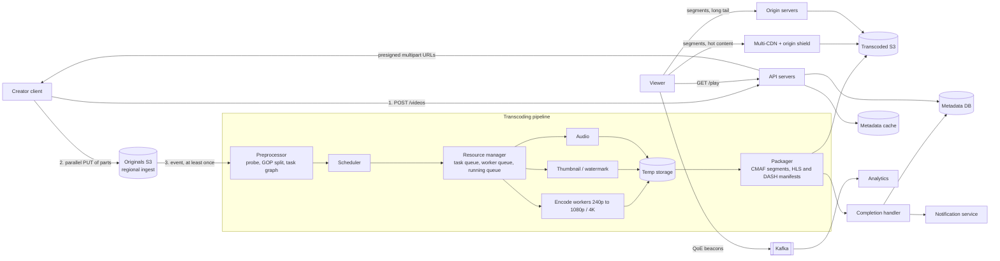
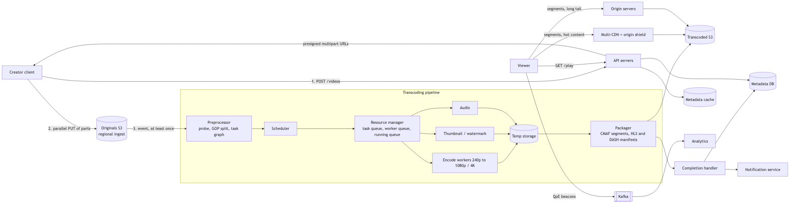
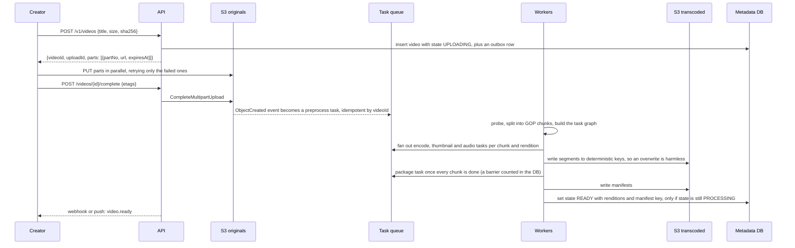

# 11 — Design YouTube (video upload and streaming) (book ch. 14)

*Written as I would talk through it in a design discussion, with the reasoning behind each choice.*

## 1. Problem statement

We are building a video platform. Creators upload videos up to a gigabyte in most common formats, and viewers
stream them on mobile, web and smart TVs anywhere in the world. We are planning for five million daily active
users watching about thirty minutes a day, a largely international audience, and encrypted content. The
interviewer confirmed we can build on cloud primitives such as object storage, CDNs and managed transcoding
rather than from scratch, which I'll take advantage of wherever it is the right call.

## 2. Scope

I'll cover resumable upload, the transcoding pipeline as a directed graph of tasks, storage tiers, CDN
delivery with adaptive streaming, the metadata service and its state machine, the watch flow, cost control
since delivery cost is a first-class concern, content protection, and failure handling. Recommendations and
search, live streaming, ads and monetization, and comments and likes are out, and I'll name where they would
attach.

## 3. Functional requirements

A creator uploads a video with its metadata; the upload resumes after a dropped connection; and we can start
processing before the whole file has arrived. We transcode into a ladder of resolutions and bitrates, generate
thumbnails, and package for adaptive streaming. A viewer streams with the player adapting bitrate to their
network, can seek instantly, and the video moves through draft, processing, ready or failed, with the creator
notified.

## 4. Non-functional requirements

Playback quality is the product: start time under two seconds anywhere in the world and a rebuffer ratio under
half a percent. Processing should have a ten-minute video ready within a few minutes at p95, because creators
wait for it. Availability of 99.99% for playback, since that is where the revenue is, and 99.9% for upload and
the API. Durability of eleven nines for stored video with versioning, and never losing an upload once we have
said it is complete, because creators cannot re-create their content. Consistency: the metadata state machine
is strong, because a video marked ready must actually have its manifest, while CDN caches are eventually
consistent. And scale with a cost constraint: around a hundred and fifty terabytes a day of ingest and seven
and a half petabytes a day of egress, where the CDN bill at list price would be a hundred and fifty thousand
dollars a day.

As an error budget: 99.99% for playback is about four minutes a month, measured as player error rate and startup time across CDNs and regions; a single CDN having a bad day spends it quickly, which is why multi-CDN steering exists. Upload and API at 99.9% have about forty-three minutes.

## 5. Design tenets

Bytes never pass through our API servers; clients upload straight to object storage with pre-signed multipart
URLs. Transcoding is an asynchronous graph of idempotent tasks parallelized by chunk, so anything can be
retried. Metadata and bytes are separate systems with separate consistency needs. We use the CDN for the
popular head of the catalog and serve the long tail from origin, because cost shapes the delivery topology.
And we buy managed primitives unless a measured cost or latency reason says otherwise.

## 6. Back-of-the-envelope estimation

Uploads: five million daily users, ten percent uploading one video a day, is five hundred thousand uploads a
day, about six a second. At an average of three hundred megabytes that is a hundred and fifty terabytes a day
of originals, around fifty-five petabytes a year, and the renditions add another one to one and a half times
that.

Views: five million users watching five videos each is twenty-five million a day, about two hundred and ninety
a second and six hundred at peak.

Egress: twenty-five million views times three hundred megabytes is seven and a half petabytes a day, about
seven hundred gigabits per second on average. At the book's two cents a gigabyte that is a hundred and fifty
thousand dollars a day, fifty-five million a year, which is why delivery topology is a design concern and not an
afterthought.

Transcoding: five hundred thousand videos a day at ten minutes each and roughly two times real time is around
a hundred and seventy thousand CPU-hours a day, which is thousands of cores and argues for spot instances and
chunk-level parallelism.

Metadata: five hundred thousand records a day at two kilobytes is a gigabyte a day, trivial, so the metadata
store is relational and everything heavy is asynchronous.

**The hard part** is the transcoding pipeline as a parallel, restartable graph with a resource manager;
delivery cost, meaning CDN for popular content, origin for the long tail, and per-title encoding; and making a
one-gigabyte upload fast and reliable over a bad network.

## 7. System components and services

Client SDKs on web, mobile and TV do chunked, resumable multipart uploads and run an adaptive player that sends
quality-of-experience beacons.

API servers handle authentication, metadata CRUD, issuing pre-signed upload URLs, and issuing signed playback
manifest URLs.

Original storage is S3 with regional ingest buckets, versioning, and lifecycle rules that move originals to
cold storage after transcoding.

The preprocessor probes the file, splits it at group-of-pictures boundaries into chunks, and produces the task
graph for this video according to the creator's tier.

The scheduler and resource manager hold a task queue ordered by priority, a queue of idle workers by type, and a
running queue with heartbeats; they retry and dead-letter.

Workers for encoding, thumbnails, watermarking, audio and packaging are idempotent and write to deterministic
keys, temporary first and then final.

Transcoded storage is S3 with a CDN in front for hot content and origin servers for the long tail.

The metadata database holds the video state machine, renditions, and jobs and tasks, with a cache in front.

A completion handler flips the state to ready or failed, notifies the creator through the notification
platform, and pre-warms the CDN for big creators.

Safety and DRM cover signed URLs, token-based playback, multi-DRM for premium content, and encryption at rest.

## 8. Architecture and flows





*Vector version: [11-youtube-1-architecture.svg](diagrams/11-youtube-1-architecture.svg)*





*Vector version: [11-youtube-2-flow.svg](diagrams/11-youtube-2-flow.svg)*


Narrated upload: the creator's client tells the API about the video and gets back pre-signed URLs for each
part. It uploads the parts in parallel directly to S3, retrying only parts that failed, and tells the API when
it is done. The API completes the multipart upload, S3 emits an event, and the preprocessor picks it up,
inspects the file, splits it into chunks at keyframe boundaries, and fans out one encode task per chunk per
rendition plus thumbnail and audio tasks. Workers pull tasks, write their output to deterministic keys, and
when the database shows every chunk of a rendition is done the packager builds the segments and manifests.
The completion handler then flips the video to ready, but only if it is still in processing, so a duplicate
event cannot regress the state.

Narrated watch: the viewer asks the API to play a video and gets a signed manifest URL, and a DRM license URL
if the content is protected. The player fetches the manifest and then segments, from the CDN if the video is
popular or from our origin servers if it is in the long tail, switching bitrate as bandwidth changes.

## 9. Communication between services

Client to API is synchronous HTTPS and carries only small payloads. Client to S3 is direct parallel multipart
PUT, resumable, with regional ingest buckets or transfer acceleration and asynchronous replication to the
processing region; chunks can start processing as they land. S3 to the pipeline is an asynchronous event
delivered at least once into SQS, so consumers are idempotent by video and task key. The scheduler hands tasks
to workers by pull from per-task-type queues, with heartbeats on running tasks; an expired heartbeat
re-queues the task, so losing a spot instance is just a re-queue. Completion updates metadata with conditional
state transitions and uses an outbox for notifications. The player fetches from the CDN over HTTP range and
segment requests, and the CDN goes through an origin shield to S3 on a miss. Encoding itself is CPU-bound
blocking work per task; the parallelism comes from having many chunks and tasks.

## 10. Deep dives

### 10.1 The transcoding graph and its resource manager

Each video becomes a graph: probe, then split at group-of-pictures boundaries, then in parallel encode each
chunk for each rendition, extract audio, generate thumbnails and apply any watermark, then merge the chunks per
rendition, then package. Chunking means many workers encode one video at once and a retry costs one chunk, not
the whole file. The graph is declared per creator tier, so premium creators get 4K and HDR renditions.

The resource manager keeps three queues: tasks waiting, ordered by tier and age; workers idle, by type; and
tasks running, with heartbeats. The scheduler matches the highest-priority task to a suitable idle worker, and
tasks whose heartbeat expired go back to waiting. Per-tenant caps on running tasks give backpressure.
Facebook's streaming video engine is the published reference for this shape.

The build-or-buy question for the encoders themselves: a managed transcoder gets us shipping with no fleet to
run, while an FFmpeg fleet on spot instances is cheaper per minute at volume and gives full codec control. I'd
start managed and move the high-volume renditions to FFmpeg on spot when the bill proves it, accepting less
codec flexibility early.

### 10.2 Keeping delivery cost sane

Views are heavily skewed, so I'd put only the popular head on the CDN and serve the long tail from origin
servers in front of S3. Rarely watched renditions can be encoded on demand instead of stored. Per-title
encoding picks the lowest bitrate that preserves quality for each video rather than a fixed ladder. Multi-CDN
with steering by cost and performance plus an origin shield keeps us from being captive to one provider and
protects S3 from a miss storm. At very large scale, placing our own points of presence inside ISPs for the top
content, the Netflix Open Connect model, is the end state. And when a big creator publishes we pre-warm the
CDN.

### 10.3 Making uploads fast and reliable

Parallel multipart with resumability: the client keeps the upload ID and the list of completed parts, so a
crash or dropped connection resumes rather than restarts. Regional ingest buckets or transfer acceleration keep
the first hop short. A lifecycle rule aborts incomplete multipart uploads after a day so orphaned parts do
not cost money. We verify the SHA-256 on completion and dedupe an identical re-upload by hash.

### 10.4 Correctness

State transitions are conditional updates, "set ready where state is processing", so duplicate completion
events cannot move a video backwards. Tasks write deterministic keys so an overwrite is idempotent. The barrier
before packaging counts done chunks in the database rather than inferring from an empty queue, because at-
least-once delivery means an empty queue proves nothing. The metadata cache is deleted on write with a short
TTL, and the play endpoint reads the state from the database on a cache miss and never issues a manifest URL
for a video that is not ready. A viral video whose cache entry expires can send thousands of simultaneous
misses to the database, so misses are coalesced per key and TTLs carry jitter. The API's calls to the database
and cache have timeouts and client-side breakers so a slow dependency fails fast instead of exhausting threads. View counters are incremented atomically in Redis and written back, never
read-then-written in application code.

### 10.5 Content protection

Signed URLs with short expiry and optional IP or geography binding, token-based playback authentication,
multi-DRM for premium content, server-side encryption with managed keys at rest and TLS in transit, and
buckets that are private and readable only by the CDN and origin servers.

### 10.6 Failure modes

An upload is interrupted: it resumes, and stale uploads are aborted by lifecycle. A worker crashes or a spot
instance is reclaimed: the heartbeat expires and the task is re-queued, and because outputs are idempotent
nothing is corrupted. The input is corrupt: we classify it as non-retryable, mark the video failed with a
reason, and tell the creator. The scheduler is down: processing pauses but tasks persist in the queue and
uploads and playback continue; the scheduler itself runs leader-elected for availability. The metadata cache
is down: the API reads the database. The metadata primary is down: uploads and state changes fail until a
replica is promoted, with semi-synchronous replication so nothing acknowledged is lost, and playback continues
from cache and CDN. A CDN has an outage: multi-CDN steering moves traffic and the origin shield absorbs the
miss. An S3 region is out: long-tail playback in that region fails and new uploads fail, so critical
transcoded assets are replicated across regions and reads fail over. A re-encoded video serves a stale
manifest from cache: manifest and segment keys are versioned and published keys are never overwritten, with a
CDN purge as the safety valve. The egress bill spikes: we alarm on cost run rate and shift the tail off the
CDN.

## 11. API design

```
POST /v1/videos {title, description, tags[], visibility, sizeBytes, contentType, sha256}
     -> {videoId, uploadId, parts: [{partNo, url, expiresAt}]}
POST /v1/videos/{id}/complete {parts: [{partNo, etag}]} -> {state: "PROCESSING"}
GET  /v1/videos/{id} -> metadata, state, renditions[], thumbnails[]
PUT  /v1/videos/{id}  (title, description, visibility; If-Match on version)
GET  /v1/videos/{id}/play -> {manifestUrl (signed HLS/DASH), drmLicenseUrl?, expiresAt}
POST /v1/videos/{id}/thumbnail -> presigned URL for a custom thumbnail
GET  /v1/users/{id}/videos?cursor=
Webhooks: video.ready, video.failed, signed and idempotent by event id
```

## 12. Data model

```
users(user_id PK, name, email, tier)
videos(video_id PK, owner_id, title, description, tags[], visibility,
       state (UPLOADING, PROCESSING, READY, FAILED, DELETED), version, duration_s, original_key, sha256,
       created_at, published_at)   index (owner_id, created_at DESC);  unique (owner_id, sha256)
renditions(video_id, rendition_id) PK, codec, width, height, bitrate_kbps, manifest_key, segment_prefix, size_bytes
thumbnails(video_id, idx) PK, key, w, h
transcode_jobs(job_id PK, video_id, dag_version, state, started_at, finished_at, error)
transcode_tasks(job_id, task_id) PK, type, chunk_no, rendition_id, state, worker_id, attempts, heartbeat_at
outbox(id, event, payload, published_at NULL)
video_stats(video_id PK, views, likes)   -- owned by the counters service
```

A user has many videos; a video has many renditions, thumbnails and jobs; a job has many tasks. The queries
are a point read of a video, which is hot and cached; a list by owner; conditional state transitions; tasks by
job for the scheduler; and a scan for tasks whose heartbeat is older than sixty seconds, which I'd index and
partition by time bucket.

## 13. Database choices

Video metadata is a gigabyte a day with rich queries and a state machine that needs transactions together
with the outbox row. That fits a single managed relational primary with replicas for years, so Postgres or
MySQL with a cache in front, and I'd plan to shard by owner or move to DynamoDB at ten times the scale. I give
up day-one scale-out that I do not need.

Jobs and tasks are high-write, short-lived rows needing conditional updates, expiry and a scan for stuck
tasks. DynamoDB with a TTL fits well, though early on they can sit in the same relational database; I give up
joins with the videos table, which I do not need.

The live task queues need visibility-timeout semantics as heartbeats and a dead-letter queue, so SQS per task
type; I give up replay, which tasks do not need.

Blobs go to S3 with lifecycle tiers, standard to infrequent access to archive for originals. Self-hosting on
Ceph or HDFS only pays off at exabyte scale and loses on durability and events.

The metadata cache is plain key-value, so Memcached, or Redis if the counters share the tier. View counters
are Redis increments flushed periodically, giving up exactness for a count that does not need it. Quality-of-
experience events go through Kafka into Parquet and a warehouse.

## 14. Tools and technologies

Transcoding: managed first, then FFmpeg on spot for hot volume, as discussed. Orchestration: Temporal or Step
Functions over SQS rather than a fully custom scheduler, because graph barriers, retries and visibility are
what those tools do, at the cost of some control. Format: CMAF segments with both HLS and DASH manifests, so
one set of segments serves every player, giving up only legacy-only devices. Codecs: H.264 everywhere for
compatibility, with VP9 or AV1 for top content where the thirty to fifty percent bitrate saving pays for the
encode cost. CDN: multi-CDN with an origin shield rather than a single provider, trading simpler contracts for
resilience and cost steering. DRM: Widevine, FairPlay and PlayReady through a multi-DRM vendor for premium
content only. Uploads: multipart with transfer acceleration.

## 15. Metrics and monitoring

Upload success and resume rates, part retry rate, time to complete, and abort cleanups. Pipeline queue depth
and age per task type, retries, dead-letter count alarming above zero, worker utilization, processing minutes
per video minute, cost per encoded minute, and stuck tasks. Quality of experience: startup time, rebuffer
ratio, average bitrate, and error rate per device, CDN and region, which are the SLO alarms; CDN hit ratio; and
egress cost per day against budget with a run-rate alarm. Metadata API p99, cache hit ratio and replica lag.

## 16. Notification and logging

Creators are notified through the notification platform and partners through signed, idempotent webhooks.
Pipeline logs are structured per task, with FFmpeg's error output saved to S3 only for failures, and request
IDs flow from the API through the S3 event into the tasks. Player beacons are sampled at one to ten percent
into Kafka. A pipeline stall or a playback SLO breach on any CDN pages the on-call, and cost anomalies alert a
finance-and-engineering channel.

## 17. CI/CD, cost, operations, and what comes next

Services deploy independently; worker images are versioned; task-graph configurations are versioned and
canaried by sending one percent of uploads through the new graph and comparing output size and VMAF quality
before promoting. A golden set of awkward media, odd resolutions and corrupt files, runs in CI. Player changes
go behind flags with quality-of-experience A/B tests, and CDN configuration changes through infrastructure as
code in stages.

Backups: the metadata database has point-in-time recovery with a recovery point of minutes and a recovery time
of under an hour; originals in S3 are versioned so a bad delete is reversible; and restores are drilled, since
losing metadata would orphan petabytes of video.

The biggest cost line items are egress, storage of renditions across tiers, and transcode compute. The levers
are moving the tail off the CDN, per-title encoding, AV1 for top content, lifecycle of originals to archive,
and spot fleets.

Regions: ingest buckets and CDN are regional; processing runs in a few regions; the metadata primary is in one
region with replicas elsewhere, active-passive; critical transcoded assets are replicated; losing a region means
promoting the metadata replica and letting the CDN steer to healthy origins.

Ownership: upload and API, pipeline, delivery, metadata, and safety are separate teams, and the S3 key layout,
the task schema and the manifest format are the contracts between them.

At ten times the scale the next features are live streaming with a low-latency path from RTMP or SRT ingest
to low-latency HLS, content fingerprinting and takedowns, recommendations and search, comments and likes, our
own edge points of presence, captions through speech recognition, and a short-form vertical video path.
