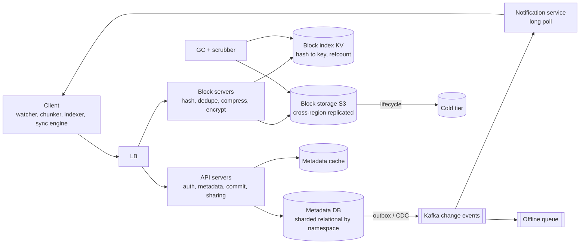
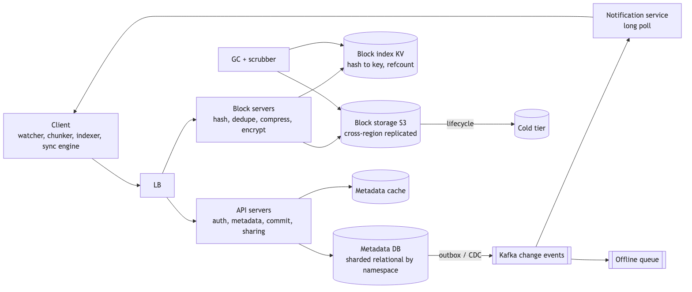
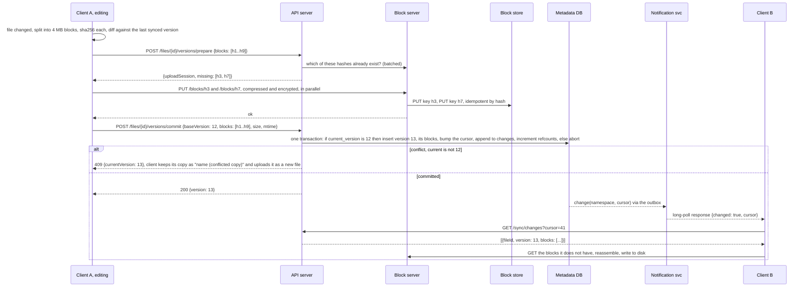

# 12 — Design Google Drive (cloud file storage and sync) (book ch. 15)

*Written as I would talk through it in a design discussion, with the reasoning behind each choice.*

## 1. Problem statement

We are building a Dropbox or Google Drive: upload and download any kind of file up to ten gigabytes, keep a
user's files in sync across their devices, notify devices of changes, keep revision history, let people share,
encrypt everything, and do all of it reliably on bad networks. We have fifty million signed-up users, ten
million daily active, and each gets ten gigabytes free.

## 2. Scope

I'll cover simple and resumable upload, download, block-level deduplication and delta sync, strong consistency
of the metadata, conflict resolution when two devices edit the same file, change notification, revisions,
basic sharing, storage cost, and failure handling. Real-time collaborative editing, previews and thumbnails,
full-text search, and team administration are follow-ups.

## 3. Functional requirements

Add, update, delete and rename files and folders from any device and see the change on the others. Resume a
large upload after a drop and upload only the changed parts of a modified file. Keep revision history with
restore, and soft-delete with a restore window. Share a file or folder as viewer or editor. Tell online devices
about changes and let offline devices catch up when they return.

## 4. Non-functional requirements

Durability is the first requirement and it is absolute: no data loss, ever. Blocks are checksummed,
replicated and versioned, and once a version is committed the recovery point objective is zero. These are
often the user's only copies.

Metadata consistency is strong: every device sees the same file tree and version, with no phantom files and
no lost files. That is what makes sync correct.

Sync latency: a change committed on one device should be applied on another online device within five seconds
at p95.

Availability of 99.9% for the API, with the clients working offline and reconciling when they reconnect, which
is what a local-first client buys us.

Bandwidth efficiency: only changed blocks travel, blocks are deduplicated and compressed, because mobile data
and egress cost money.

Scale: five hundred petabytes allocated, perhaps a hundred actually used; about four hundred and eighty uploads
a second at peak; and up to fifteen million devices holding a long-poll connection.

As an error budget: 99.9% for the API is about forty-three minutes a month of failed commits or reads, and clients working offline hide most of it from users. Commit errors and sync propagation past target spend it. Durability has no budget at all; a single lost block is an incident, not a statistic.

## 5. Design tenets

A file is a list of content-addressed four-megabyte blocks; the blocks are immutable and the metadata is a
versioned list of their hashes. We write blocks first and commit metadata last, and the metadata commit is
the one place in the system that needs strong consistency. The client does the heavy lifting: chunking,
hashing, compressing, encrypting and diffing. Sync is reconciliation of state by cursor, not replay of an
event stream. Concurrent edits are resolved optimistically with a base version, and a conflict produces a
second copy, never a silent overwrite. And change notification is long polling that says "something changed";
the client then pulls the metadata.

## 6. Back-of-the-envelope estimation

Ten million daily users uploading two files a day at an average of five hundred kilobytes is ten terabytes a
day, about two hundred and forty uploads a second on average and four hundred and eighty at peak.

Allocated space is fifty million users times ten gigabytes, five hundred petabytes. Actual usage is maybe
twenty percent, a hundred petabytes, and deduplication plus compression cut that by thirty to fifty percent.

The block index: a hundred petabytes in four-megabyte blocks is about twenty-five billion blocks, and at
around sixty-four bytes of index per block that is roughly one point six terabytes, which has to be a sharded
key-value store.

Metadata: fifty million users with ten thousand files each at five hundred bytes a row is about two hundred
and fifty terabytes including revisions, so the relational metadata store is sharded by namespace.

Notifications: fifteen million online devices at about a million long-poll connections per server, which is
the figure Dropbox has quoted, is fifteen to thirty notification servers.

The decision the numbers force: bytes go to object storage for throughput and durability, and metadata goes to
a relational database for transactional commits.

**The hard part** is three things. Keeping metadata strongly consistent while handling concurrent edits from
several devices. Block-level deduplication and delta sync, and the awkward interaction between deduplication
and encryption, because encrypting blocks with a content-derived key lets us dedupe across users but leaks
which users hold identical blocks. And lifecycle correctness: garbage-collecting unreferenced blocks without
deleting one that an in-flight upload is about to reference, plus deletes and revisions.

## 7. System components and services

The client on desktop, mobile and web watches the file system, chunks files into blocks, hashes, compresses
and encrypts them, keeps a local index database, runs the sync engine, and does resumable transfers.

Block servers receive blocks, verify the SHA-256, check the block index to skip blocks we already have,
compress and encrypt in the server-side mode, write to S3, and maintain reference counts.

Block storage is S3, holding immutable content-addressed blocks, replicated across regions, with lifecycle
tiers.

The block index is a key-value store mapping hash to S3 key, size, reference count and tier.

API servers handle authentication, metadata CRUD, upload sessions, the commit transaction, sharing and
revisions.

The metadata database is relational, sharded by namespace, with a cache in front, and holds files, versions,
the version-to-blocks mapping, the change log, cursors and access lists.

The notification service serves long-poll requests and publishes per-namespace change signals; on mobile it
sends a silent push to wake the app.

An offline queue holds change events for devices that were not connected, purely as an optimization, because
the cursor is the correctness path.

A garbage collector and integrity scrubber reclaim unreferenced blocks after a grace period and continuously
re-read a sample of blocks to verify their hashes.

## 8. Architecture and flows





*Vector version: [12-google-drive-1-architecture.svg](diagrams/12-google-drive-1-architecture.svg)*





*Vector version: [12-google-drive-2-flow.svg](diagrams/12-google-drive-2-flow.svg)*


Narrated: Client A notices a file changed, chunks it, hashes each block, and compares the list to what it last
synced. It tells the API which blocks the new version needs; the API asks the block servers which of those we
already have and returns the missing ones with an upload session. The client uploads just the missing blocks.
Then it asks the API to commit, saying "I am building on version 12". The API runs one transaction: if the
file is still at version 12, insert version 13, record its blocks, bump the namespace's change cursor, append
to the change log, and increment the block reference counts; otherwise abort. On a conflict the client gets a
409 with the current version, keeps its own copy under a conflicted-copy name, and uploads that as a new file,
so nothing is ever silently lost. On success the outbox relay publishes a change, the notification service
wakes Client B's long poll, and Client B pulls the changes since its cursor, fetches the blocks it lacks, and
writes the file.

## 9. Communication between services

Client to API is synchronous HTTPS REST, and every mutation is idempotent through a request ID and the
base-version precondition. Client to block servers is a synchronous PUT or GET per block over four to eight
parallel streams; a block is atomic, so resumability is per block, and for downloads we can hand out
pre-signed S3 URLs to keep bytes off our servers entirely. Block server to S3 is idempotent by content hash,
and because S3 is strongly consistent a just-written block is immediately readable. Every call from the client
to our servers and from our servers to S3 carries a timeout set from the observed p99, and the clients back off
with jitter on failure, because a flaky mobile network is the normal case, not the exception.

API to the metadata database is an ACID transaction for the commit; this is the only strongly consistent
point in the system, and the cache is invalidated on commit so no device ever sees a file list the database
has not committed.

Metadata to notification goes through an outbox or change-data-capture into Kafka rather than "commit, then
publish", because that dual write can lose a notification.

Notification to client is long polling: the client holds a request open for thirty to sixty seconds and the
server answers when something changes or the timer runs out. Changes are infrequent and one-directional, so a
WebSocket would hold a two-way socket for nothing, and short polling would waste a request every few seconds.
Mobile gets a silent push to wake the app. Offline devices rely on the cursor to catch up; the offline queue is
just an optimization.

## 10. Deep dives

### 10.1 Blocks, deduplication, delta sync and the encryption trade

Files are split into fixed four-megabyte blocks, identified by the SHA-256 of their content; content-defined
chunking can come later for formats where inserts shift everything. Identical blocks are stored once with a
reference count. A modified file is just a new ordered list of hashes, and only the blocks not already stored
are uploaded. We compress per type with zstd, skipping media that is already compressed, and then encrypt.

Here is the trade I'd call out. If we derive the encryption key from the content, called convergent
encryption, identical blocks encrypt identically and we can dedupe across all users, but anyone who can see the
store learns that two users hold the same block. If we encrypt with per-user keys under a key management
service, we keep that private but lose cross-user dedupe. I'd default to per-user envelope keys with
server-side KMS, dedupe within a user, and offer client-side end-to-end encryption as a tier. I give up some
global storage savings for privacy.

### 10.2 Metadata consistency and conflicts

Metadata lives in a relational database sharded by namespace. The commit transaction checks that the current
version equals the client's base version, inserts the new version, appends to the change log, and bumps the
namespace's cursor, all atomically. First writer wins; the loser's work is preserved as a conflicted copy for
the user to resolve. Rename, move and delete are metadata edits under the same precondition. Deletes are
tombstone versions with a restore window and are purged by the collector after thirty days. A shared folder
gets its own namespace, so a transaction on it still stays on one shard.

### 10.3 Upload sessions

Prepare returns the missing hashes and a session. The client uploads blocks in any order; the session records
which hashes have arrived, so a crash resumes. Commit is allowed only when every block is present. A ten-
gigabyte file is twenty-five hundred blocks and uses exactly the same flow. Sessions expire, and the garbage
collector must never collect a block referenced by a live session, which is why its grace period is at least
the session TTL.

### 10.4 Storage cost and garbage collection

Deduplication, a cap on revisions such as the last thirty or thirty days, compression by type, and lifecycle
to cold storage for blocks unread in ninety days, while metadata stays hot. Garbage collection deletes a block
when its reference count is zero and it is older than the grace period. Because counters drift, a periodic
reconciliation recounts references from the version-to-blocks table before anything is deleted.

### 10.5 Failure modes

A block server crashes mid-upload: the client retries on another, blocks are idempotent, and the session
resumes. An S3 region is out: block reads fail there, so blocks are replicated across regions and reads fail
over, while clients queue their writes locally. The metadata primary is down: commits fail briefly and reads
continue from replica and cache; we promote a replica with semi-synchronous replication so nothing committed
is lost, and clients queue changes until it is back. The metadata cache is down: we read the database. A
notification server is down: clients reconnect through the load balancer and catch up by cursor. The outbox
relay or Kafka lags: notifications are late, and clients also poll every few minutes as a safety net. Two
devices edit the same file: a 409 and a conflicted copy, never a silent overwrite. The garbage collector has
a bug and deletes a referenced block: the grace period and the reconciliation make it unlikely, S3 versioning
makes it reversible, and the integrity scrubber raises an alarm. A checksum mismatch on read: serve from the
replica region and page. Clock skew on file modification times: we order by version, never by mtime.

## 11. API design

```
POST /v1/files                        {parentId, name, size, mtime, blocks: [sha256]} -> {fileId, uploadSession, missing[]}
POST /v1/files/{id}/versions/prepare  {blocks} -> {uploadSession, missing[]}
PUT  /v1/blocks/{sha256}              body: the block; headers X-Session, Content-Length
POST /v1/files/{id}/versions/commit   {baseVersion, blocks, size, mtime} -> 200 {version} | 409 {currentVersion}
GET  /v1/files/{id}?version=  ;  GET /v1/files/{id}/content?version= -> {blocks: [{sha256, url (signed)}]}
GET  /v1/blocks/{sha256}
PATCH /v1/files/{id} {name?, parentId?} with If-Match: version      DELETE /v1/files/{id}  (soft)
GET  /v1/files/{id}/versions ;  POST /v1/files/{id}/versions/{v}/restore
GET  /v1/sync/changes?cursor=&limit= -> {changes[], nextCursor, hasMore}
GET  /v1/notifications/poll?cursor=  (long poll, 30 to 60 s) -> {changed, cursor}
POST /v1/shares {fileId, grantee, role}
```

## 12. Data model

```
users(user_id PK, email UNIQUE, quota_bytes, used_bytes)
devices(device_id PK, user_id, platform, last_seen, sync_cursor)
namespaces(ns_id PK, owner_user_id, type (personal, shared_folder))          -- the shard key
files(file_id PK, ns_id, parent_id NULL, name, is_dir, current_version, deleted_at NULL, updated_at)
      UNIQUE (ns_id, parent_id, name) WHERE deleted_at IS NULL
file_versions(file_id, version) PK, size, mtime, checksum, created_by_device, created_at
version_blocks(file_id, version, block_idx) PK, block_hash
blocks(block_hash PK, size, compressed_size, s3_key, refcount, tier, created_at)   -- key-value
changes(ns_id, cursor) PK, file_id, version, op (add, modify, rename, delete), ts
shares(ns_id, grantee_user_id) PK, role, granted_by, granted_at
upload_sessions(session_id PK, user_id, file_id, expected[], received[], expires_at)
outbox(id, ns_id, cursor, payload, published_at NULL)
```

A user has many devices; a namespace has many files forming a tree through parent ID; a file has many
versions; a version has many blocks, and blocks are shared many-to-many with reference counts; namespaces are
shared with users through the shares table. The queries are listing a folder's children, reading a file with
its current version and blocks, the commit transaction, scanning changes by namespace and cursor, batched
block-existence checks by hash, and the collector's reference-count scans.

## 13. Database choices

Metadata, meaning the tree, versions, access lists and cursors at around two hundred and fifty terabytes,
needs an ACID commit that writes the version and the change log together, a unique-name constraint per folder,
and listings that are joins. I considered sharded MySQL or Postgres by namespace, which is what Dropbox did
with Edgestore; Spanner or CockroachDB; and DynamoDB with transactions. I'd pick sharded relational by namespace
because every transaction stays on one shard, and I'd move to Spanner or Cockroach if global strong consistency
without manual sharding were worth its cost. What I give up is cross-namespace transactions, which are rare;
moving a file between namespaces becomes a saga.

The block index at twenty-five billion rows of point operations with atomic reference-count updates fits
DynamoDB using conditional updates, or Cassandra; I give up range queries I do not need.

Blocks go to S3 for eleven nines, strong consistency, lifecycle tiers and cost at petabyte scale; building our
own store, as Dropbox eventually did with Magic Pocket, only pays off at exabyte scale.

The cache is Memcached because it is hot metadata invalidated on commit and needs no data structures. Change
events go through Kafka partitioned by namespace so they stay ordered and notification servers can replay.

## 14. Tools and technologies

Long polling for change notification over WebSockets or server-sent events, because changes are infrequent,
one-directional and a long-poll server can hold about a million connections; mobile gets a silent push. An
application outbox for atomicity with the commit, moving to Debezium when many tables need to emit. Fixed
four-megabyte chunking first, content-defined chunking later for insert-heavy formats. SHA-256 for content
addressing, because a routing hash is not collision-safe enough to name data. zstd for compression, skipping
media. Server-side KMS envelope encryption by default with an end-to-end tier. Batch garbage collection with a
grace period and S3 versioning as the undo. Client-side backoff with jitter and server-side circuit breakers
for flaky networks.

## 15. Metrics and monitoring

Upload and download throughput and success rate, resume rate, deduplication ratio and compression ratio.
Commit p99 and the 409 conflict rate, where a spike means a sync-engine bug; metadata cache hit ratio, because
the database is sized for miss traffic and a falling ratio is the early warning; metadata write latency, replica
lag, and shard hot spots from very large shared namespaces. Sync propagation from commit to another device
applying it at p50 and p95; long-poll connections per server. Storage: bytes stored against allocated, cold
fraction, orphan blocks pending collection, and reference-count anomalies. Integrity: scrubber mismatches,
which page immediately, and any collector attempt to delete a block with a non-zero reference count, which
must be zero. Alarms on commit errors above half a percent, sync p95 above thirty seconds, any integrity
failure, and Kafka lag.

## 16. Notification and logging

Devices learn of changes through long polling; users get notifications such as "shared with you", quota
warnings and conflicts through the notification platform with digests. Every metadata mutation is written to
an audit log with who, which device, which file, version and operation, kept a year, because sharing security
and support both depend on it. Block-server access logs are sampled and never include content, and request IDs
run from the API through the block server to S3. Integrity and availability page the on-call, and a weekly
report covers storage cost and deduplication.

## 17. CI/CD, cost, operations, and what comes next

Clients roll out in stages, one percent then ten then everyone, gated on crash rate and conflict rate, and the
sync engine has a simulation suite that runs randomized concurrent edits across virtual devices and asserts
that they converge with no loss. Servers deploy blue-green with expand-and-contract schema migrations, and the
block format carries a version byte so old blocks remain readable forever. Rollback for servers is the blue-green
switch, and for clients it is halting the staged rollout and serving the previous build to new installs.

Backups: metadata snapshots plus the write-ahead log for point-in-time recovery, kept immutable in another
account and region and restored on a schedule; S3 versioning and object lock for blocks.

Cost is dominated by block storage, so tiers, deduplication and revision caps are the levers; then egress; the
metadata database is small by comparison.

Regions: block storage is replicated; each namespace is homed in one region, which is per-key ownership and
avoids write conflicts, with read replicas elsewhere; losing a region means promoting replicas and re-homing
namespaces; the notification tier is regional.

Ownership: client, storage with blocks, index and collection, metadata, sync and notifications, and sharing are
separate teams, with the block format, the metadata schema and the sync API as contracts.

At ten times the scale we pre-split more namespace shards, adopt content-defined chunking, and consider our own
block store; the next features are collaborative editing with operational transforms or CRDTs, a previews
pipeline, a search index fed by change-data-capture, team namespaces and administration, selective and
on-demand sync, LAN sync between a user's own devices, and ransomware detection through mass-modification
anomalies with bulk restore.
