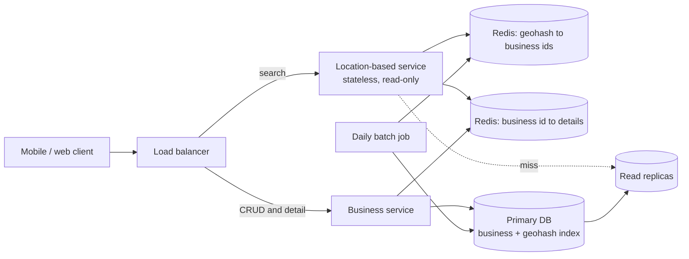
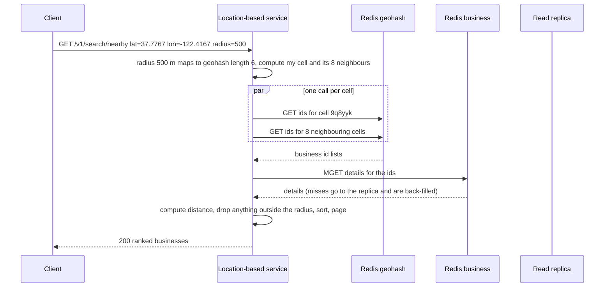

# 13 — Design a Proximity Service (Vol. 2, ch. 1)

*Written as I would talk through it in a design discussion, with the reasoning behind each choice.*

## 1. Problem statement

We are building the "find places near me" feature behind Yelp or the local-results part of Google Maps. A
user gives us their location and a radius and we return the businesses inside it. Business owners add,
update and delete their listings, and anyone can open a business and see its details. The scale we were
given is a hundred million daily active users and two hundred million businesses.

## 2. Scope

I'll build the search by location and radius, the business create, read, update and delete path, and the
business detail page. The heart of the problem is the geospatial index that turns "within five kilometres of
this point" into a cheap lookup, so most of my time goes there. Ranking results by anything other than
distance is out; so are reviews, photos and real-time anything. The interviewer confirmed that business
updates do not have to be visible instantly, which I'll lean on.

## 3. Functional requirements

Return the businesses within a radius of a latitude and longitude, sorted by distance, in pages. Let owners
create, update and delete a business, with changes visible within a day. Serve a business detail page by ID.

## 4. Non-functional requirements

Latency for the search is what users feel, so I'd target a p99 under a hundred milliseconds server-side,
because the map draws nothing until the results arrive. Availability of 99.99% for search and 99.9% for the
owner-facing write path, because a search outage is visible to a hundred million people and an owner who
cannot edit for a few minutes loses nothing. Consistency is eventual for business data: a replica or cache
that is a day behind is acceptable because the interviewer said updates are not real-time, and that one
admission lets me cache aggressively. Privacy: we must handle location data under GDPR and CCPA, which means
we do not log raw coordinates tied to a user and we do not keep them longer than needed. The workload is
extremely read-heavy: five thousand searches a second against a trickle of owner edits.

As an error budget, 99.99% for search is about four minutes a month of failed or slow searches. Index-server
timeouts and cache failures are what spend it, so those are the alarms, and a spent budget halts index and
cache rollouts.

## 5. Design tenets

Turn two dimensions into one so the database can index them; this is the whole trick. Split the read-heavy
search service from the write-light business service so they scale and fail independently. Cache by
geohash cell, never by raw coordinate, because coordinates jitter and users move. Keep the geospatial index
small enough to live in memory and replicate rather than shard. And treat business data as eventually
consistent on purpose.

## 6. Back-of-the-envelope estimation

A hundred million users making five searches a day is five hundred million searches, which over roughly a
hundred thousand seconds is about five thousand a second, say ten to fifteen thousand at peak in dense cities
at lunchtime.

Two hundred million businesses at a kilobyte of detail each is around two hundred gigabytes, which fits a
single relational primary with replicas. The geospatial index is far smaller: one row of geohash plus
business ID is about twenty bytes, so two hundred million rows is about four gigabytes, or a quadtree of a few
gigabytes in memory. That tells me the index does not need sharding; it needs replicas.

Writes are tiny. If one percent of businesses change per day that is two million writes a day, about
twenty-three a second.

**The hard part** is the index. A database can use a B-tree on one column at a time, so "latitude between
and longitude between" scans a huge candidate set. I need a way to map a two-dimensional point to a
one-dimensional key such that nearby points share a key or a prefix, and then deal with the edge cases that
mapping creates: cells that are too big in cities and too small in the countryside, and the boundary problem
where two very close points sit in different cells.

## 7. System components and services

A load balancer routes search traffic to the location-based service and everything else to the business
service.

The location-based service is stateless and read-only. It converts the request into geohash cells, fetches
business IDs for those cells, fetches business details, sorts by distance and pages.

The business service handles owner writes and the detail page. Writes go to the primary; detail reads go to
replicas and a cache.

The database cluster is one relational primary with read replicas holding the business table and the
geohash index table.

A Redis cluster caches two things: for each geohash cell the list of business IDs in it, and for each business
ID its details.

A daily batch job rebuilds the geohash index and refreshes caches, which is enough because updates are not
real-time.

## 8. Architecture and flows




*Vector version: [13-proximity-service-1-architecture.svg](diagrams/13-proximity-service-1-architecture.svg)*





*Vector version: [13-proximity-service-2-flow.svg](diagrams/13-proximity-service-2-flow.svg)*


Narrated: the client sends its coordinates and a radius of five hundred metres. The service looks up a small
table that says five hundred metres needs a six-character geohash, computes the user's cell and its eight
neighbours, and fetches the business IDs for all nine cells from Redis in parallel. It then fetches the
details for those IDs in one batched call, computes the true distance for each, discards anything outside
the circle, sorts by distance and returns a page. Nothing on this path touches the primary database.

## 9. Communication between services

Client to our services is synchronous HTTPS. The location-based service calls Redis synchronously but fans the
nine cell lookups out in parallel so latency is one round trip rather than nine, and the detail fetch is a
single batched call. Misses fall through to a read replica, never the primary. The business service writes
to the primary synchronously and returns; propagation to replicas is asynchronous replication, and propagation
into the geohash cache is the daily batch job. I'd put a timeout of a few milliseconds on each Redis call and
a circuit breaker per Redis shard, so a sick shard degrades one cell's results rather than the whole search.

## 10. Deep dives

### 10.1 Why a plain database query does not work

The intuitive approach is a query with latitude between two bounds and longitude between two bounds. Even
with indexes on both columns, a B-tree speeds up one dimension at a time; the database picks one index, gets
back every business in a horizontal band around the world at that latitude, and filters the rest in memory.
That is a scan of millions of rows for every search. So we need an index that understands two dimensions, and
the standard way to get one is to encode the two dimensions into a single key.

### 10.2 The indexing options

An evenly divided grid splits the world into fixed squares. It is trivial, but businesses are not evenly
distributed: a square in Manhattan holds thousands and a square in the desert holds none, so cells are
either too crowded to be useful or too empty to be worth storing.

Geohash interleaves the bits of latitude and longitude and encodes them in base 32, so the world is
recursively quartered and each extra character makes the cell four times smaller. Nearby points usually
share a prefix, so "everything in this cell" is a prefix match, which a normal B-tree index handles. The
precision is chosen from the radius: six characters is about 1.2 kilometres by 600 metres, which covers a
five-hundred-metre search. The weaknesses are that the grid is fixed, so it cannot adapt to density, and the
boundary problem: two points on opposite sides of a cell edge, or on opposite sides of the equator or the
prime meridian, can be metres apart and share no prefix at all. The fix is to always query the cell and its
eight neighbours, which is cheap.

A quadtree is an in-memory tree that recursively splits a region into four until each leaf holds at most
about a hundred businesses. It adapts to density automatically, dense cities get deep subtrees and empty
areas stay as one leaf, and it supports "give me the k nearest" directly by walking outward from the leaf.
The costs are that it has to be built at server start, which for two hundred million businesses takes a few
minutes during which that server cannot serve, and that updating it is awkward: either rebuild
incrementally on a schedule or update in place with locking.

Google S2 maps the sphere onto a Hilbert curve so that points close on the curve are close in space, and it
can cover an arbitrary shape with cells of varying size, which is what makes it good for geofencing. It is
also the hardest to implement from scratch.

My pick is geohash for this problem. The criteria are implementation simplicity, easy index updates, a
fixed-radius query shape, and the fact that the whole index fits in a few gigabytes. What I give up is
density adaptation and native k-nearest search; if the product later needs "the three closest gas stations"
I would move to a quadtree, and if it needs geofencing I would move to S2.

### 10.3 Storing and scaling the index

The index is a two-column table of geohash and business ID, with a geohash row per business, about four
gigabytes. There is no technical reason to shard it; it fits in one server many times over, and a prefix
query by cell is a single index range read. So I replicate it for read throughput rather than shard it.
The business table, at two hundred gigabytes, also fits one primary but I would shard it by business ID if it
ever grows past a few terabytes, because business ID is high cardinality and present in every detail read.

### 10.4 Caching

The obvious cache key is the user's coordinates, and it is wrong for two reasons: GPS coordinates are
imprecise, so two searches from the same spot produce different keys, and a walking user changes
coordinates every second. The right key is the geohash cell, which is stable and shared by everyone in that
area. So Redis holds cell to list of business IDs, and separately business ID to details. The cell cache is
read-only to the request path and refreshed by the nightly job, which is where the "not real-time" admission
pays off; the details cache uses delete-on-write from the business service plus a TTL. Hit ratios will be very
high because popular areas are searched constantly, and a cold cell simply falls through to a replica.

### 10.5 Correctness and concurrency

Owner edits are plain row updates on the primary; two owners editing the same business is a last-writer-wins
situation that is acceptable here, though I would add a version column if the product grows a collaborative
editing surface. The search path is read-only and idempotent, so retries are safe. Distance filtering after
the cell fetch is what guarantees the circle is honoured even though the cells are squares.

### 10.6 Failure modes

If the geohash Redis is slow or down, the service falls through to read replicas, which are sized to take the
load for a while because the index is small and the query is an index range read; a tight timeout means a
slow cache cannot make the search slow. If the business details cache is down, the same fall-through applies.
If the primary is down, owners cannot save edits and see an error, searches are unaffected, and a replica is
promoted within a minute. If the nightly job fails, new businesses do not appear in search until the next
run, which is inside the stated freshness tolerance, and we alarm on job failure. If a replica lags badly, an
owner sees their edit missing on the detail page, so an owner's own reads go to the primary for a short
window after a write. If a location is spoofed or malformed, we validate bounds and clamp the radius to a
maximum so one request cannot ask for the whole planet.

## 11. API design

```
GET  /v1/search/nearby?latitude=&longitude=&radius=5000&page=&pageSize=
     -> {total, businesses: [{id, name, address, latitude, longitude, distanceMeters, rating}]}
GET  /v1/businesses/{id}        business details
POST /v1/businesses             create (owner); PUT /v1/businesses/{id}; DELETE /v1/businesses/{id}
```

The radius is clamped to a maximum, and pagination is by page number because the result set is small and
sorted deterministically by distance.

## 12. Data model

```
business(business_id PK, name, address, city, state, country, latitude, longitude, category, owner_id,
         created_at, updated_at)
geospatial_index(geohash VARCHAR(12), business_id) PK (geohash, business_id)   -- one row per business
Redis: geo:{geohash6} -> [business_id...];  biz:{business_id} -> details
```

The queries are a prefix range on geohash for the nine cells, a batched point read of business details, and
single-row writes by business ID. The index stores one row per business at the finest precision, and a
coarser query is a prefix match.

## 13. Database choices

The business table and the geohash index are relational data with simple queries at a few thousand reads a
second and tens of writes a second. The options were a managed relational database, a key-value store, and a
specialised geospatial database. A relational database with read replicas fits comfortably, gives me the
prefix index for free and ad-hoc queries while the product is young, and MySQL or Postgres, with PostGIS as an
option if we ever want real geometry queries. A key-value store would scale further than I need and would
make the owner-facing admin queries harder. I give up nothing material at this scale.

For the two caches, Redis, because I want the batched multi-get and the ability to store a list per cell; the
cell lists are small so memory is a few gigabytes.

## 14. Tools and technologies

Geohash over quadtree and S2 for the reasons in the deep dive. Redis for caching. A nightly Spark or plain SQL
batch to rebuild the cell lists, because updates are not real-time and a rebuild is simpler and safer than
incremental invalidation. Deployment across several regions with each region holding a full replica set and
cache, because the data is small enough to copy everywhere and users want nearby latency.

## 15. Metrics and monitoring

Search p99 and error rate are the indicators tied to the SLO. Underneath: Redis hit ratio for cells and for
details with an alarm under ninety percent, replica lag, primary write latency, the nightly job's duration
and row count with a gate on large deltas, and per-region request rate so a hot city shows up. Alarms on
search p99 over two hundred milliseconds, hit ratio drops, job failure, and replica lag over a few seconds.

## 16. Notification and logging

Search logs record the geohash cell, radius and latency but never the raw coordinates tied to a user, which
is how we stay inside GDPR and CCPA; a request ID ties the search to its cache and replica calls. Owner
changes are audited with who changed what. SLO breaches page the on-call; a failed nightly job opens a
ticket because the user impact is bounded.

## 17. CI/CD, cost, operations, and what comes next

The location-based service is stateless and rolls out gradually; if we ever adopt a quadtree, a server must
finish building its tree before it takes traffic, so the rollout goes to a subset of servers at a time and
health checks gate it. Schema changes are additive. Rollback is redeploying the previous image.

Backups: the business table has point-in-time recovery with a recovery point of minutes and a recovery time
under an hour, and restores are drilled; the geohash index and both caches are derived data that the nightly
job rebuilds, so they need no backup of their own.

Cost is small: a relational cluster, a few Redis nodes per region, and the batch job. Business data is two
hundred gigabytes and the index four, so storage is negligible.

Regions: the service, replicas and caches are deployed per region and the primary is in one region with
cross-region replication, which is fine because writes are rare and not time-sensitive.

Ownership: the location service and the business service are two teams, and the index table and cache keys
are the contract.

At ten times the scale we shard the business table by ID, replicate the index further, and the next features
are k-nearest search, which pushes toward a quadtree, geofencing with S2, and category or rating filters
applied after the cell fetch.
