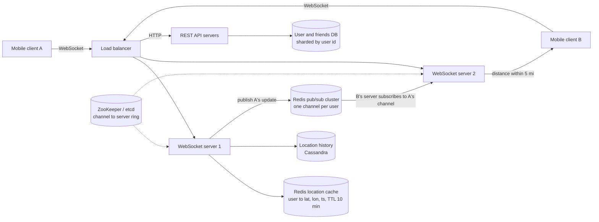
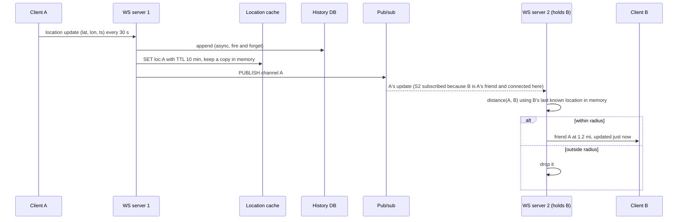

# 14 — Design Nearby Friends (Vol. 2, ch. 2)

*Written as I would talk through it in a design discussion, with the reasoning behind each choice.*

## 1. Problem statement

We are building the "nearby friends" feature of a large social app: a user opts in, shares their location,
and sees which of their friends are within a few miles, each with a distance and how recently their location
was updated, refreshing every few seconds. The crucial difference from the proximity service is that here the
points move constantly; a restaurant's address is stable, a friend walking downtown is not. The app has a
billion users, ten percent use this feature, and friends who go inactive should disappear within ten minutes.

## 2. Scope

I'll build the location update path from the phone, the fan-out that delivers each update to the right
friends, the initial seeding of the map when a user opens the feature, how we expire inactive users, and the
location history store the interviewer asked for. Friend management lives in the main app and we only react to
it. Straight-line distance is fine, GDPR is out of scope for this exercise by agreement, and ranking or
notifications are out.

## 3. Functional requirements

A user sees a list of nearby friends with distance and timestamp, updated every few seconds. The radius is
configurable, five miles by default. Friends who have not reported a location in ten minutes drop off. We keep
a history of locations for later analysis, which is not read on the hot path.

## 4. Non-functional requirements

Low latency matters because a location update that arrives thirty seconds late is a friend shown in the wrong
place; I'd target end-to-end delivery under a second at p95. Reliability is "generally available, occasional
data point loss is fine", which is a very different bar from chat: losing one location update out of thousands
is invisible because the next one arrives in thirty seconds, and that admission is what lets me use
fire-and-forget pub/sub. Consistency is eventual; replicas of the location cache being a few seconds apart is
acceptable. Scale is the defining constraint: ten million concurrent users each sending an update every thirty
seconds is about 334,000 updates a second, and each update fans out to the friends who are online.

As an error budget, 99.9% availability for the WebSocket tier is about forty-three minutes a month of users
unable to connect or receive updates; what spends it is connection-server failures and pub/sub cluster
rebalancing, so those are the alarms, and spending it pauses cluster resizing until we understand why.

## 5. Design tenets

A shared backend fans out, because peer-to-peer between phones is impractical on flaky connections with tight
battery budgets. Stateful WebSocket servers hold the connections; stateless API servers do everything else.
The current location lives in a cache with a TTL, so expiry of inactive users is free. Fan-out rides on a
pub/sub channel per user, and the WebSocket server does the distance filtering, because only it knows where
the receiving friend is. Losing an occasional update is acceptable, so pub/sub can be fire-and-forget. And
history goes to a write-optimised store off the hot path.

## 6. Back-of-the-envelope estimation

A hundred million daily users of the feature with ten percent concurrent is ten million connected at once.
An update every thirty seconds is ten million divided by thirty, about 334,000 location updates a second.

A user has four hundred friends on average and ten percent of them are online, so each update must reach
about forty people. That is 334,000 times forty, roughly fourteen million deliveries a second across the
pub/sub layer. That number drives the whole design.

The location cache holds ten million entries of user ID plus latitude, longitude and timestamp, under a
hundred bytes each, so about a gigabyte, trivially small; the write rate of 334,000 a second is what matters,
and that is a few Redis shards.

Pub/sub channels: a hundred million users of the feature each need a channel. The book estimates about two
hundred gigabytes to hold all channels, which is two large Redis servers for memory, but at a hundred thousand
pushes a second per server the fourteen million deliveries need at least a hundred and forty servers. So the
pub/sub tier is CPU-bound, not memory-bound, and must be a distributed cluster.

History: 334,000 rows a second at about fifty bytes each is around seventeen megabytes a second, about one
and a half terabytes a day, which is a write-heavy wide-column store.

**The hard part** is the fan-out at fourteen million deliveries a second: making a pub/sub tier that large
work, knowing which server owns which channel, resizing it without losing too many updates, and handling
users with thousands of friends.

## 7. System components and services

A load balancer spreads HTTP traffic across the REST API servers and WebSocket connections across the
WebSocket servers.

REST API servers handle friend management hooks, profile and anything that is not real time.

WebSocket servers are stateful. Each holds connections, receives location updates, writes to the cache and
history, publishes to the user's channel, and, for the channels it subscribes to on behalf of its connected
users, receives friends' updates, computes distance, and forwards only those within the radius. On a new
connection it seeds the client with the current locations of nearby friends.

The Redis location cache maps user ID to latest location with a TTL of ten minutes.

The user database holds users and friendships, sharded by user ID, probably exposed by a dedicated friends
service owned by another team.

The location history database stores every update for analytics.

A Redis pub/sub cluster provides a channel per user, with a service-discovery store such as ZooKeeper or etcd
holding which server owns which range of channels.

## 8. Architecture and flows




*Vector version: [14-nearby-friends-1-architecture.svg](diagrams/14-nearby-friends-1-architecture.svg)*





*Vector version: [14-nearby-friends-2-flow.svg](diagrams/14-nearby-friends-2-flow.svg)*


Narrated: A's phone sends a location every thirty seconds over its WebSocket. The server holding A writes it
to the history store without waiting, sets it in the location cache with a ten-minute expiry, keeps a copy in
memory for its own distance calculations, and publishes it to A's channel. Every WebSocket server that has
one of A's online friends connected is subscribed to that channel, receives the update, computes the distance
to each of those friends using the friend's last known position, and pushes the update down only the sockets
of friends within five miles. On average forty friends are online, so one update becomes about forty
deliveries, and the servers drop the ones outside the radius before they reach a phone.

Initialization: when B connects, B's server loads B's friend list, subscribes to each friend's channel, reads
each friend's current location from the cache, computes distances, and sends B the initial nearby list.

## 9. Communication between services

Client to WebSocket server is a persistent two-way connection, because the server needs to push forty
friends' updates per thirty seconds per user and the client sends its own; polling would be ten million
requests every few seconds. Client to REST servers is ordinary HTTPS for friend management and profile.
Server to location cache is a synchronous Redis write with a short timeout. Server to history store is
asynchronous and fire-and-forget, because history is not on the hot path and a dropped row is acceptable.
Server to pub/sub is a publish with no acknowledgement, and the subscriber side is a push; both are
fire-and-forget, which is exactly right because the next update is thirty seconds away. Servers learn the
channel-to-node mapping from ZooKeeper or etcd and cache the ring in memory.

## 10. Deep dives

### 10.1 Why pub/sub, and why fire-and-forget is acceptable here

The alternative to a message bus is for the receiving server to poll the cache for each of a user's friends
every few seconds, which is four hundred reads per user per interval, four billion reads a second. Pub/sub
inverts that: an update is pushed once and delivered only to servers that care. Redis Pub/Sub persists
nothing and drops messages to slow subscribers; in chat that would be disqualifying, but here a lost update is
replaced thirty seconds later and the cache always holds the latest position for the next initialization. The
requirement explicitly allows occasional loss, so I take the simplest, fastest tool. If the requirement ever
tightened, Redis Streams or Kafka would replace it at the cost of storage and offset management.

### 10.2 Scaling the pub/sub cluster

Channels cost nothing until used, so I pre-create a channel per feature user and avoid coordinating channel
creation when someone comes online. Memory is about two hundred gigabytes, which is two servers, but CPU for
fourteen million pushes a second needs well over a hundred servers, so the cluster is sharded by channel using
consistent hashing, with the ring stored in ZooKeeper or etcd and cached on every WebSocket server. Resizing
the cluster moves channels, which forces WebSocket servers to resubscribe and loses a few updates in the
window; consistent hashing keeps the moved fraction near one over N, and we do resizes at the daily traffic
low with a scheduled job sized from historical traffic, over-provisioning for spikes. The cluster is stateful
in the sense that subscribers must be told to move, so a resize is a coordinated operation, not an autoscale.

### 10.3 The WebSocket tier

Servers scale out easily but must drain gracefully: mark the server as draining in the load balancer, stop
sending it new connections, and let clients reconnect elsewhere over a few minutes before terminating. A
reconnecting client re-runs initialization, which is a friend-list read, a set of subscriptions and a batch of
cache reads, so a mass reconnect is a spike on the user database and the cache; clients back off with jitter.

### 10.4 Friends with many friends, and friend changes

A user with thousands of friends makes their server do more distance calculations and more subscriptions. The
app already caps friends at a few thousand, and with enough servers the load is spread. When a friend is
added or removed, the mobile app already gets a callback from the main product, and it tells its WebSocket
server to subscribe or unsubscribe from that friend's channel.

### 10.5 The random nearby person extension

If the interviewer asks for occasionally showing a random nearby stranger, the natural extension is a second
set of channels keyed by geohash cell: a user subscribes to their cell and the neighbouring cells and receives
updates from strangers in them, filtered by distance the same way.

### 10.6 Correctness and concurrency

Updates carry the client's timestamp, and a server ignores an update older than the one it already has for
that user, so out-of-order delivery through pub/sub cannot move a friend backwards. The cache write is a plain
set with a TTL and is idempotent. The history append is idempotent by user and timestamp. Distance is computed
from the receiver's last known location held in memory on its server, so if that server just restarted it
seeds from the cache first.

### 10.7 Failure modes

If a WebSocket server dies, its users reconnect elsewhere and re-initialize; they lose a few seconds of
updates, which is within tolerance. If the location cache is down, new updates still fan out live via pub/sub,
but initialization cannot seed friends' positions until it recovers, so clients show an empty map briefly;
Redis Cluster failover is seconds. If a pub/sub shard is down, updates for channels on it are lost until
failover, and clients see those friends' positions age; we alarm on channel-shard health. If the history store
is slow, nothing user-facing happens because the write is fire-and-forget, and we alarm on drop rate. If the
user database is slow, initialization is slow and new connections pile up, so friend lists are cached per
server with a short TTL. If a cluster resize moves many channels at once, resubscription storms spike CPU, so
resizes happen at low traffic and in steps. If a client sends a spoofed or implausible location, we discard
jumps that would require supersonic travel.

## 11. API design

WebSocket routines:
```
client to server: location_update {lat, lon, ts}             every 30 s
server to client: friend_location {friendId, lat, lon, distance, ts}
client to server: init {lat, lon}  then server to client: nearby_friends [...]
server to client: subscribe {friendId}      (a friend came online, start tracking)
server to client: unsubscribe {friendId}    (a friend went offline or was removed)
```
HTTP, on the REST servers: friend list and profile endpoints owned by the main app.

## 12. Data model

```
Redis location cache:  loc:{user_id} -> {lat, lon, ts}   TTL 10 min
location_history(user_id, ts) PK, lat, lon                 -- Cassandra, partition by user_id, bucket by day
users(user_id PK, ...);  friendships(user_id, friend_id) PK   -- sharded by user_id
Redis pub/sub: channel:{user_id}
ZooKeeper / etcd: /pubsub/ring -> [{channel range, redis node}]
```

The queries are a set and get by user ID on the cache, an append and occasional range scan by user and time
on history, and "friends of X" on the user database at initialization.

## 13. Database choices

The location cache needs fast writes at 334,000 a second, a TTL per key so inactive users vanish on their
own, and tiny values: Redis Cluster, sharded by user ID. Memcached would also hold the data but I want the
same technology for pub/sub, and Redis TTL semantics are exactly the expiry requirement.

Location history is write-heavy at 1.5 terabytes a day, append-only, queried by user and time range for
analytics: Cassandra or a similar wide-column store, partitioned by user with a day bucket. A relational
database would not take the write rate without sharding and we do not need its features.

Users and friendships fit a relational database or a key-value store sharded by user ID; this is owned by the
main app, and I would consume it through a friends service rather than reading its tables.

Pub/sub is Redis for simplicity and speed, accepting message loss by requirement. The channel ring lives in
ZooKeeper or etcd because it needs to be watched and consistent.

## 14. Tools and technologies

WebSockets over long polling or server-sent events because traffic is two-way and continuous. Redis Pub/Sub
over Kafka because the requirement allows loss and latency matters more than durability; Kafka would add
offsets, retention and latency we do not need. Consistent hashing for the channel cluster so resizing moves
about one over N of channels. ZooKeeper or etcd for the ring. Cassandra for history. An alternative worth
naming for the whole real-time tier is Erlang or Elixir on the BEAM, where millions of lightweight processes
can hold connections and act as channels in one distributed application; it fits the problem beautifully but
the hiring pool is small, so I would only choose it with an existing team.

## 15. Metrics and monitoring

Connections per WebSocket server and connect and reconnect rates; location updates per second received,
published and delivered; delivery latency from publish to client push at p95; pub/sub CPU per shard and
dropped-message counts; cache write latency and TTL expirations; history write drop rate; initialization time
and user database latency. Alarms on delivery p95 over two seconds, any pub/sub shard over eighty percent CPU,
reconnect storms, and cache errors.

## 16. Notification and logging

Per-server aggregate logs, never per update, because the volume would be the system's own biggest cost.
Sampled traces of an update from receipt to delivery for latency debugging. Resize operations logged with
channels moved and resubscriptions triggered. Connection-tier capacity and pub/sub health page the on-call.

## 17. CI/CD, cost, operations, and what comes next

WebSocket servers roll out with draining; pub/sub resizes are scheduled at the daily low and stepped;
rollback for servers is redeploying the previous image behind the balancer, and for a resize it is publishing
the previous ring. Load tests simulate millions of connections and the full fan-out rate before capacity
changes. History and the user database have normal backups; the cache and pub/sub hold nothing worth backing
up.

Cost is the pub/sub fleet, well over a hundred CPU-bound servers, then the WebSocket fleet and history
storage. The main levers are the update interval and the friend fan-out cap.

Regions: the WebSocket, cache and pub/sub tiers are regional because latency matters and friends cluster
geographically; a friend in another region is reached by a cross-region subscription with extra latency.

Ownership: the real-time tier, the location data stores, and the friends service are separate teams, with the
channel naming and the WebSocket routines as contracts.

At ten times the scale the pub/sub cluster grows linearly on the ring, the update interval becomes adaptive
to movement, and the next features are the random nearby stranger via geohash channels, battery-aware update
rates, and privacy controls such as approximate locations per friend group.
