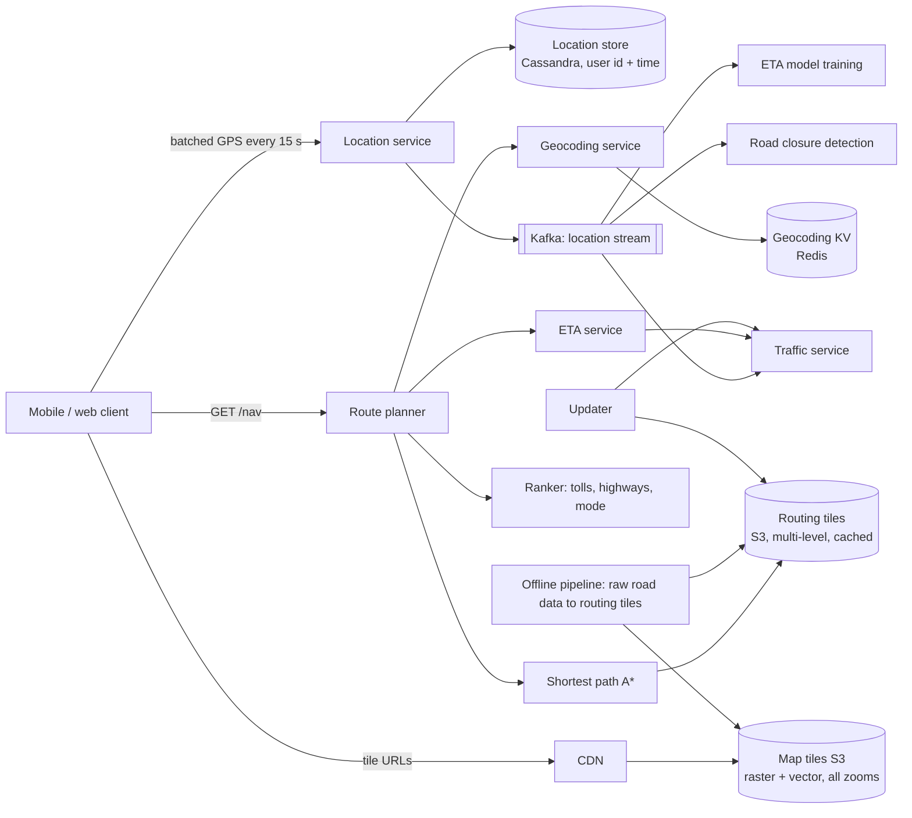
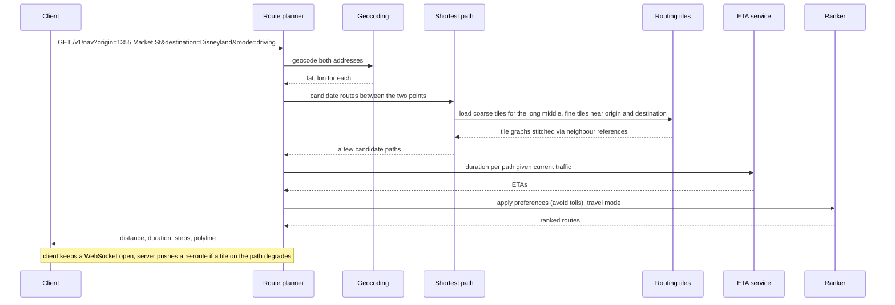

# 15 — Design Google Maps (Vol. 2, ch. 3)

*Written as I would talk through it in a design discussion, with the reasoning behind each choice.*

## 1. Problem statement

We are building a simplified Google Maps with three features: recording users' location updates, navigation
with turn-by-turn routes and an estimated time of arrival that accounts for traffic, and rendering the map.
The scale is a billion daily active users. We have terabytes of raw road data from various sources, we must
support walking, cycling and driving, and we leave out multi-stop routes, business listings and photos.

## 2. Scope

I'll build the location service that ingests batched GPS updates and streams them to consumers, the
navigation service with geocoding, shortest path, ETA and ranking, and map rendering through tiles on a CDN.
I'll go deep on how road data becomes routing tiles, how tiles make both rendering and routing tractable,
and how we re-route people when traffic changes. Satellite imagery, street view, places and photos are out.

## 3. Functional requirements

Clients send location updates periodically. A user asks for a route from an origin to a destination for a
travel mode and gets a route with distance, duration, step instructions and a polyline, taking current
traffic into account, and gets re-routed if conditions change. The client renders a smooth map at any zoom
level while panning and navigating.

## 4. Non-functional requirements

Accuracy is the one that cannot bend: a wrong turn is a failed product, so route correctness beats route
optimality; a route that is a minute slower but correct is acceptable, a shortcut through a closed road is
not. Smoothness of rendering: tiles must arrive before the user pans into them, which means tile latency at
the edge in tens of milliseconds and aggressive prefetching. Data and battery usage on mobile is a real
constraint, which shapes how often we send location updates and how tiles are encoded. Availability of 99.99%
for routing and tiles, because people are driving. Consistency is eventual everywhere; location data is stale
by nature and traffic is an estimate. Scale is a billion users and petabytes of tiles.

As an error budget, 99.99% for navigation is about four minutes a month of failed route requests. Shortest-
path timeouts and geocoding failures are what spend it, and when it is spent we stop rolling changes to the
routing tiles pipeline until the cause is clear.

## 5. Design tenets

Tile everything. Map images are tiles so the client downloads only what it sees, and the road graph is tiled
so the router loads only the tiles a route crosses, at the coarseness the route needs. Serve static tiles
from a CDN, never compute them per request. Batch location updates on the device and write them to a store
built for writes, then stream them to everyone who wants them. Separate the services that must be fast,
geocoding and shortest path, from the ones that can be slow and offline, like building tiles and training
ETA models. And prefer vector tiles to image tiles where the client can render them, because bandwidth is the
mobile user's cost.

## 6. Back-of-the-envelope estimation

Map tiles: the book estimates about seventy petabytes for all zoom levels of the world after compressing the
near-identical tiles over oceans and deserts. That is static data on object storage behind a CDN. Metadata is
negligible. Road data is terabytes raw and becomes routing tiles in object storage.

Navigation traffic: a billion users at thirty-five minutes a week is about five billion navigation-minutes a
day. If the client batches GPS updates and sends them every fifteen seconds or so, that is roughly two hundred
thousand location requests a second on average and about a million at peak. Each batch carries several
points, so the write store sees millions of rows a second.

Tile requests dwarf everything else but almost all hit the CDN; origin traffic is whatever the CDN misses,
which for popular areas is close to zero.

**The hard part** is making routing work on a planet-sized graph: a shortest-path algorithm is sensitive to
graph size, so I cannot load the world; routing tiles at several levels of detail solve that. The second hard
part is live traffic: turning millions of location updates a second into ETA corrections and re-routes for
the people already on the road.

## 7. System components and services

The location service receives batched updates over HTTPS, writes them to a write-optimised store partitioned
by user, and publishes them to a Kafka stream for traffic analysis, ETA model training, road closure
detection and other consumers.

The navigation service is a small pipeline: a geocoding service that turns an address into coordinates and
back, a route planner that orchestrates, a shortest-path service that runs A* over routing tiles, an ETA
service that applies a traffic model, a ranker that applies user preferences such as avoiding tolls, and an
updater that keeps the traffic and routing data current.

Map rendering is pre-rendered tiles, raster or vector, at every zoom level, stored in object storage and
served from a CDN; the client computes which tiles it needs from its viewport and zoom.

An offline pipeline turns raw road data into routing tiles at several levels of detail and rebuilds them
periodically, enriched by what we learn from location data.

A geocoding store maps addresses to coordinates and back, read-heavy and cached.

## 8. Architecture and flows




*Vector version: [15-google-maps-1-architecture.svg](diagrams/15-google-maps-1-architecture.svg)*





*Vector version: [15-google-maps-2-flow.svg](diagrams/15-google-maps-2-flow.svg)*


Narrated: the user types two addresses. The planner geocodes both into coordinates, hands them to the
shortest-path service, which works out the geohash of each endpoint, loads the fine routing tiles around them
and progressively coarser tiles for the long stretch in between, and runs A* across the stitched graph until
it has a good-enough path, not necessarily the perfect one. The planner asks the ETA service how long each
candidate takes under current traffic, lets the ranker apply the user's preferences and travel mode, and
returns the best route with its polyline. While the user drives, the client keeps a connection open and the
server pushes a new route if traffic on an upcoming tile changes.

## 9. Communication between services

Client to location service is HTTPS with batched points, because sending every GPS fix individually would
cost battery and radio time; batching every fifteen seconds or so is the trade between freshness and power.
Location service to its store is a synchronous write and to Kafka an asynchronous publish, and the Kafka
stream is how traffic, ETA training and closure detection consume updates without coupling to the ingest
path. Navigation is a synchronous request with a budget of a second or two; inside it the planner calls
geocoding, shortest path, ETA and ranker over gRPC with timeouts and breakers, and shortest path reads routing
tiles from a local cache over object storage. Tiles are plain HTTPS GETs against the CDN, with URLs the client
can compute from geohash and zoom; the alternative of an API that returns tile URLs costs a round trip but
lets us change the tiling scheme without forcing client updates, and I would offer both and steer new clients
to the API. Re-routing is pushed over a WebSocket, because push notifications have payload limits and are
absent on the web, long polling costs more server resources, and server-sent events are one-way while a
last-mile feature might want two-way later.

## 10. Deep dives

### 10.1 Map basics that shape the design

The world is a sphere and the screen is flat, so we project; Google uses Web Mercator, a modified Mercator
that distorts area near the poles but keeps angles, which is what navigation needs. Geocoding converts an
address to coordinates and reverse geocoding does the opposite, usually by interpolating along a street
network from geographic information systems. Geohashing encodes an area as a string by recursively quartering
the world, which gives us a natural key for both map tiles and routing tiles.

### 10.2 Map rendering with tiles

Rendering the whole map as one image is impossible, so the world is cut into 256-by-256 tiles at each zoom
level; zoom level zero is one tile for the planet, and each level quadruples the tile count. The client works
out which tiles its viewport needs and stitches them. Computing tiles on demand would put enormous load on
servers and defeat caching, so tiles are pre-rendered, stored in object storage, keyed by geohash and zoom, and
served by a CDN from points of presence near the user. The client prefetches tiles in the direction of travel
and the next zoom level in. The big optimisation is vector tiles: instead of pixels, send paths and polygons
and let the device render them, which cuts bandwidth substantially and lets styling change without
re-rendering petabytes.

### 10.3 Routing tiles and the shortest path

The road network is a graph with intersections as nodes and roads as edges, and routing uses a variant of
Dijkstra or A*. Running that on a planet-sized graph is too slow and too large, so we tile the graph the same
way we tile the map: each routing tile holds its local subgraph and references to its neighbours, and the
algorithm stitches tiles as it expands. For a long route, even stitching detailed tiles across a continent is
too much, so we keep routing tiles at several levels of detail, highways only at the coarse level, every
street at the fine level, and the algorithm uses fine tiles near the endpoints and coarse tiles in between.
Tiles are built by an offline pipeline from raw road data and improved over time by what location data tells
us, stored as compressed adjacency lists in object storage because we need no database features, and cached
aggressively on the shortest-path servers.

### 10.4 Traffic, ETA, and adaptive re-routing

Location updates flow through Kafka to a traffic service that estimates current speed per road segment and to
a machine-learned ETA model. When a user starts a route we record which routing tiles their path crosses; a
naive list of every fine tile is large, so we store the origin tile plus its ancestors at coarser levels until
the destination tile is covered, which makes "is this user affected by an incident on tile X" a check of a few
containment relationships. When a tile's traffic degrades, we find the affected users, recompute, and push a
re-route if the new path is meaningfully faster.

### 10.5 Correctness and concurrency

Location batches are idempotent by user and timestamp, so retries do not duplicate rows. Routing tile
publication is atomic per version so a route is never computed across tiles from two different builds, which
could create a path that does not connect. Geocoding is cached with versioned keys. Re-route decisions use
the latest route version the client acknowledged, so a stale push cannot overwrite a newer route.

### 10.6 Failure modes

If the shortest-path service is slow, the planner times out and returns the best candidate it has or a cached
recent route for the same endpoints, and the user sees a slightly less optimal route rather than none. If the
ETA service is down, routes still return with durations from static speed limits and a flag, and we alarm. If
geocoding is down, typed addresses fail but map-tap coordinates still route, and the cache serves popular
addresses. If the CDN has an outage in a region, tile requests go to an origin shield and the client falls
back to lower-zoom cached tiles, drawing a coarser map rather than a blank one. If Kafka lags, traffic
estimates and re-routes go stale, routing still works, and we alarm on lag. If a bad routing-tile build ships
with a disconnected graph, validation that samples routes between known city pairs before publication catches
it, and rollback is pointing shortest path at the previous tile version. If a client sends a flood of location
batches, we rate-limit per device.

## 11. API design

```
POST /v1/locations        body {locs: [{lat, lon, ts}, ...]}      batched, idempotent by (user, ts)
GET  /v1/nav?origin=&destination=&mode=driving|walking|cycling&avoid=tolls,highways
     -> {distance: {text, value}, duration: {text, value}, start_location, end_location,
         steps: [{html_instructions, polyline, distance, duration}], polyline, travel_mode, route_version}
GET  /v1/geocode?address=            -> {results: [{formatted_address, location: {lat, lng}, place_id}]}
GET  /v1/tiles/url?lat=&lon=&zoom=   -> tile URLs (optional, lets us change the tiling scheme)
CDN: GET https://tiles.example.com/{zoom}/{geohash}.{png|pbf}
WebSocket: server to client reroute {route_version, new route}
```

## 12. Data model

```
location_updates(user_id, ts) PK, lat, lon, mode, speed                 -- Cassandra, partition by user, cluster by ts
routing_tile: object storage key {level}/{geohash}.bin                    -- compressed adjacency list + neighbour refs
map_tile:     object storage key {zoom}/{geohash}.png and .pbf
geocode(address_hash PK) -> {lat, lon, place_id};  reverse(geohash12 PK) -> address    -- Redis
active_routes(user_id PK, route_version, origin_tile, ancestor_tiles[], destination_tile, started_at)
traffic(segment_id PK, current_speed, updated_at)                         -- Redis or Cassandra, fed by stream
```

The queries are: append location rows and scan them by user and time for analysis; fetch routing tiles by
level and geohash; fetch map tiles by zoom and geohash through the CDN; point lookups for geocoding; find
active routes whose ancestor tiles contain an incident tile; read current speed per segment.

## 13. Database choices

Location updates are millions of writes a second, append-only, read by user and time for analytics, and we
prefer availability over consistency because stale location data is replaced anyway. That is Cassandra's
shape exactly: partition by user, cluster by time. A relational store would need heavy sharding and gives
nothing we need.

Routing tiles and map tiles are large immutable blobs read by key with no query features needed, so object
storage with aggressive caching, and a CDN in front of map tiles. A database would add cost without benefit.

Geocoding is a key-value lookup, read-heavy and rarely written: Redis for speed, backed by a durable copy.

Traffic state per segment is small, hot, and frequently updated: Redis, with Cassandra for history.

Active routes need a containment lookup from incident tile to users; a key-value store indexed by ancestor
tile works, with a TTL so finished routes vanish.

## 14. Tools and technologies

Kafka for the location stream because several independent consumers need the same updates and replay matters
for retraining models. Cassandra for location history. Object storage plus a CDN for tiles, with vector tiles
in a compact binary format where the client can render them. A* over tiled graphs for routing, with
precomputed coarse levels. A machine-learned ETA model trained offline from the stream. WebSockets for pushed
re-routes. Web Mercator projection and geohash-based tile keys. An offline batch pipeline, Spark-scale, for
building tiles from raw road data and from learned corrections.

## 15. Metrics and monitoring

Navigation p99 and error rate are the SLO indicators, with per-stage latency for geocoding, shortest path,
ETA and ranking. Tile CDN hit ratio and edge latency, and origin request rate. Location ingest rate, store
write latency, Kafka lag per consumer. ETA accuracy measured as predicted versus actual arrival on completed
trips, which is the quality metric. Re-route rate and the share accepted by users. Routing tile build age and
validation pass rate. Alarms on navigation p99 over two seconds, CDN hit ratio drops, Kafka lag, and ETA
accuracy drift.

## 16. Notification and logging

Location data is sensitive, so logs carry user IDs hashed and coordinates only in the data store, with
retention limits. Route requests are logged with endpoints coarsened to geohash cells. Each route carries a
version in logs so a bad re-route can be traced. Pipeline builds post to a channel with validation results.
Navigation SLO breaches page the on-call; pipeline failures open tickets because serving continues on the
previous tiles. Users are notified of re-routes in the app and nowhere else.

## 17. CI/CD, cost, operations, and what comes next

Services deploy independently; routing tiles are versioned builds that must pass a route-validation suite
between known pairs before being published, and the shortest-path fleet switches versions atomically with
rollback to the previous build. ETA models go through shadow mode comparing predicted against actual before
promotion. Client changes to tile URL computation are the risky ones because old clients linger, which is why
the URL API exists. Location history and geocoding have normal backups; tiles are rebuildable from raw road
data kept immutable in object storage.

Cost is dominated by tile storage and CDN egress, then the location store, then the compute for tile builds
and model training; vector tiles and tile compression are the main levers.

Regions: tiles are global via the CDN; routing and geocoding services run per region with full copies of the
tiles; location ingest and Kafka are regional with analytics aggregated centrally.

Ownership: location platform, routing, ETA and traffic, map tiles, and the offline data pipeline are separate
teams, with tile formats and the Kafka topic schemas as contracts.

At ten times the scale the stream and the location store add partitions and nodes, and the next features are
multi-stop routing for fleets, lane-level guidance, live transit, offline map downloads, and crowd-sourced
incident reports feeding the traffic service.
