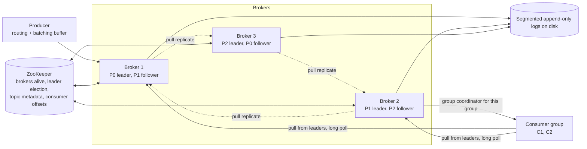
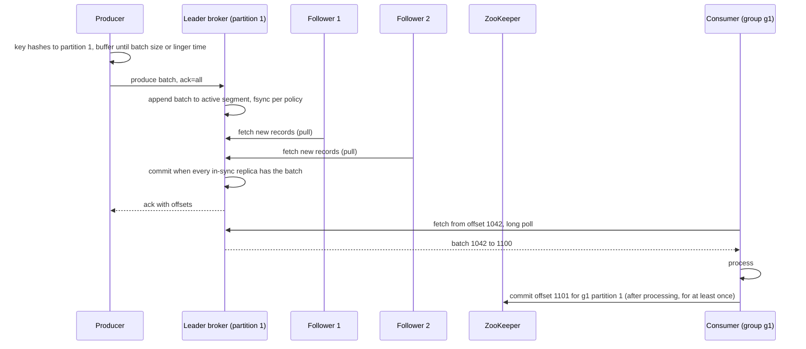

# 16 — Design a Distributed Message Queue (Vol. 2, ch. 4)

*Written as I would talk through it in a design discussion, with the reasoning behind each choice.*

## 1. Problem statement

We are building a distributed message queue in the style of Kafka: producers write messages of a few
kilobytes to topics, consumers read them, and unlike a traditional queue the messages are retained for two
weeks and can be read repeatedly by different consumer groups, order is preserved within a partition, and
the delivery semantics, at most once, at least once or exactly once, are configurable. It has to support both
high-throughput cases like log aggregation and low-latency cases like a traditional work queue.

## 2. Scope

I'll design the messaging model with topics, partitions and consumer groups, the broker and its on-disk
storage, the producer and consumer flows, consumer rebalancing, replication with in-sync replicas, the
metadata and state stores, scaling brokers and partitions, the three delivery semantics, and two advanced
features, filtering and delayed messages. I'll leave out the wire protocol details, cross-datacenter
mirroring beyond a mention, and security, and I'll note them as follow-ups.

## 3. Functional requirements

Producers send messages to a topic; consumers subscribe and receive them. A message can be consumed once or
many times by different groups. Order is preserved within a partition. Data is retained for two weeks and old
data can be truncated. Message size is kilobytes. Delivery semantics are configurable per use.

## 4. Non-functional requirements

Throughput or latency, configurable by use case, because a log pipeline wants millions of messages a second
and tolerates a hundred milliseconds of batching while a task queue wants a message delivered in a few
milliseconds; the batching knobs are how one system serves both. Scalable, meaning distributed and able to
absorb a sudden surge in volume by adding partitions and brokers. Persistent and durable: messages are on
disk and replicated across brokers before we acknowledge them when the producer asks for that. Availability
of 99.99% for produce and consume, with the honest note that durability and availability trade against each
other through the in-sync replica settings.

As an error budget, 99.99% is about four minutes a month of failed produces or consumes. Leader elections,
rebalance pauses and under-replicated partitions are what spend it, so those are the alarms, and a spent
budget stops broker upgrades until we understand why.

## 5. Design tenets

Treat the disk as a sequential device: an append-only log in segments, written in batches, read sequentially,
and let the operating system's page cache do the caching. Keep messages immutable end to end so nothing is
copied or re-serialized between producer, broker and consumer. Batch at every hop, because small I/O is the
enemy of throughput, and expose the batch size as the latency-versus-throughput dial. Put ordering on the
partition, not the topic, and let the partition key decide what shares an order. Pull, not push, so consumers
control their own pace. Keep the brokers dumb about coordination and put metadata, consumer state and leader
election in a consensus store.

## 6. Back-of-the-envelope estimation

Say a large topic takes a million messages a second at two kilobytes each, two gigabytes a second. A single
disk writes sequentially at a few hundred megabytes a second, so that topic needs at least ten partitions on
separate disks for writes alone, and with a replication factor of three, thirty disk-streams. Two weeks of
retention at two gigabytes a second is about 2.4 petabytes before replication; this is why retention is a
cost knob and why old segments go to cheap storage.

Message overhead: key, topic, partition, offset, timestamp, size and checksum are a few tens of bytes per
message, so negligible against kilobyte payloads but worth batching so headers amortize.

Consumer-side: each consumer group reads every message once, so three groups on that topic triple the read
bandwidth; sequential reads from the page cache make this cheap when consumers keep up, and expensive when a
lagging consumer forces disk reads.

Metadata is tiny: thousands of topics, tens of thousands of partitions, offsets per group per partition; it
fits a small ZooKeeper ensemble easily.

**The hard part** is three things. Getting durability and ordering out of commodity disks at high throughput,
which is the append-only log plus batching plus in-sync replicas. Coordinating consumers so each partition has
exactly one reader in a group while consumers come and go, which is rebalancing. And being honest about what
"exactly once" means and where it stops.

## 7. System components and services

Producers and consumers are clients; the producer embeds the routing logic and a batching buffer, and the
consumer embeds the group protocol.

Brokers host partitions. Each partition is an append-only log split into segments, with one leader replica
that takes writes and followers that pull from it.

Data storage is the segmented write-ahead log on each broker's disk.

State storage holds consumer group membership and committed offsets per group per partition.

Metadata storage holds topic configuration: partition count, retention, replica placement.

The coordination service, ZooKeeper, provides service discovery of live brokers, leader election among a
partition's replicas, and the home for state and metadata.

A consumer group coordinator role on a broker, chosen by hashing the group name, runs rebalancing for that
group.

## 8. Architecture and flows




*Vector version: [16-distributed-message-queue-1-architecture.svg](diagrams/16-distributed-message-queue-1-architecture.svg)*





*Vector version: [16-distributed-message-queue-2-flow.svg](diagrams/16-distributed-message-queue-2-flow.svg)*


Narrated: a producer hashes the message key to a partition, appends the message to an in-memory buffer, and
sends the buffer as one batch when it reaches a size or a time limit. The partition leader appends the batch
to the end of its current log segment, the followers pull it, and once every in-sync follower has it the
leader marks it committed and acknowledges with the assigned offsets. A consumer in a group asks its assigned
partition's leader for messages from its last offset, waits in a long poll if nothing is new, receives a
batch, processes it, and then commits the new offset so a crash resumes from there.

## 9. Communication between services

Producer to broker is a synchronous batched request; the producer learns partition leadership from metadata
and talks to the leader directly, because a routing layer in between would add a hop and defeat batching. The
acknowledgement level is per request: none, leader only, or all in-sync replicas. Followers pull from the
leader rather than the leader pushing, which lets a slow follower lag without slowing the leader. Consumers
pull from leaders with long polling, so an idle consumer costs one held connection rather than a busy loop,
and a busy consumer fetches as large a batch as it can handle. Consumers heartbeat to their group coordinator,
and rebalance instructions ride back on the heartbeat responses. Brokers register ephemeral nodes in
ZooKeeper, and leader election and metadata changes propagate through ZooKeeper watches.

## 10. Deep dives

### 10.1 Storage: why a log on disk beats a database

Messages are written once, read once per group, never updated or deleted individually, and accessed
sequentially. A general database is optimised for random reads and in-place updates and does neither of our
patterns well. An append-only write-ahead log is the opposite: appends are sequential, which spinning disks
handle at hundreds of megabytes a second despite their reputation, and the operating system caches recently
written pages so consumers who keep up read from memory. We split each partition's log into segments so no
file grows without bound; only the newest segment takes writes, older ones are read-only, and retention is
deleting whole segments older than two weeks. The message record is a fixed layout of key, value, topic,
partition, offset, timestamp, size and a checksum, and it is the same bytes on the producer, on disk and on
the consumer, so no hop re-serializes it.

### 10.2 Batching as the latency-throughput dial

Batching amortizes network round trips and turns many small writes into one sequential write. Larger batches
mean higher throughput and higher latency because messages wait for the batch to fill; smaller batches mean
the reverse. A log-aggregation topic uses large batches; a task queue uses tiny ones and compensates for the
lower per-partition throughput with more partitions. The same knob exists on the producer buffer, the broker
write and the consumer fetch.

### 10.3 Producer routing

A separate routing tier would read the replica plan from metadata and forward to the leader. It works but adds
a network hop and, worse, prevents batching because the tier sees messages one at a time. Embedding the
routing in the producer removes the hop, lets the producer choose partitions deliberately, and gives it a
buffer to batch in. The cost is a smarter client library in every language.

### 10.4 Pull versus push on the consumer

Push gives the lowest latency but the broker then sets the pace, and a consumer slower than the producer is
overwhelmed, with no good way to handle consumers of different speeds. Pull lets each consumer take what it
can handle and makes batch processing natural because the consumer can ask for a large chunk. Its downsides
are extra latency and wasted calls when nothing is new, and long polling removes the second. Nearly every
production queue chooses pull, and so do we.

### 10.5 Consumer groups and rebalancing

A consumer group is one logical reader of a topic with its own offsets; several consumers in the group split
the partitions, and to preserve order each partition is read by exactly one consumer in the group, which
caps a group's parallelism at the partition count. A broker chosen by hashing the group name acts as the
group's coordinator. When a consumer joins, leaves or stops heartbeating, the coordinator tells the others to
rebalance on their next heartbeat, picks a group leader once everyone has rejoined, the leader computes a
partition assignment by round robin or range, hands it to the coordinator, and the coordinator distributes
it. Consumption pauses during the rebalance, which is why frequent consumer restarts hurt.

### 10.6 Replication and in-sync replicas

Each partition has a leader and followers on different brokers, placed by a replica distribution plan the
leader writes to ZooKeeper. Followers pull from the leader; a message is committed when every replica in the
in-sync set has it. The in-sync set is maintained by the leader, which drops a follower that lags beyond a
configured threshold and readmits it when it catches up. This is the durability-versus-availability dial:
acknowledging only when all in-sync replicas have the message means no acknowledged message is ever lost,
but one slow replica would stall the partition, which is why a lagging replica is removed from the set rather
than waited for. Producers choose: ack from all in-sync replicas for durability, from the leader only for
speed, or none for fire-and-forget. Consumers read from the leader for simplicity; reading from a follower in
another data centre is a reasonable exception.

### 10.7 Scaling brokers and partitions

When a broker fails, its partitions still have replicas, a new leader is elected per partition, and the
coordinator reassigns the lost replicas to other brokers which catch up and rejoin the in-sync set. Replicas
of a partition must never share a broker, and the minimum in-sync count is tuned per topic. Adding a broker
temporarily allows extra replicas while the new one catches up, then drops the surplus. Adding a partition
only directs new messages there; we do not move old ones, and because the key-to-partition mapping changes,
per-key ordering breaks across the change, so we over-provision partitions up front. Removing a partition is
gradual: producers stop writing to it, consumers keep reading until retention expires, then it is dropped and
the group rebalances.

### 10.8 Delivery semantics

At most once: the producer sends without retry and the consumer commits the offset before processing, so a
crash loses the message but never duplicates it; fine for metrics. At least once: the producer retries with
acknowledgements, and the consumer commits after processing, so a crash between processing and committing
replays the message; the consumer must be idempotent or tolerate duplicates, and this is the default most
systems want. Exactly once: the broker can give an idempotent producer, where a retried send is deduplicated
by sequence number, and transactions that commit offsets and output atomically for queue-to-queue pipelines.
It is the costliest to implement, and it stops at the queue's edge: the consumer's write to its own database
is not inside the transaction, so that write still needs an idempotency key.

### 10.9 Advanced features

Filtering: separate topics per message subtype waste storage and couple producers to every consumer's needs,
so instead messages carry tags and consumers subscribe to tags, with the broker filtering before sending;
filtering on payload content is unsafe for encrypted or serialized bodies, and a full expression engine in the
broker is too heavy. Delayed and scheduled messages, such as "check this payment in thirty minutes", go to a
temporary topic and a timing component, dedicated delay queues or a hierarchical timing wheel, moves them to
the real partition when due.

### 10.10 Failure modes

A leader broker dies: a follower is elected, producers refresh metadata and retry, consumers reconnect; the
gap is seconds and no committed message is lost if acks were from all in-sync replicas. A follower lags: it is
dropped from the in-sync set, the partition stays available, durability briefly rests on fewer copies, and we
alarm on under-replicated partitions. ZooKeeper is unavailable: existing produce and consume continue on
cached metadata, but no leader elections or rebalances can happen, so it runs as a five-node ensemble across
zones. A consumer stops heartbeating: a rebalance assigns its partitions elsewhere after the session timeout;
if it was alive but slow, two consumers briefly process the same messages, which at-least-once already
tolerates. A disk fills: retention and segment deletion are enforced and we alarm at eighty percent. A
poison message that a consumer cannot process: the consumer sends it to a retry topic and moves on rather than
blocking the partition. All replicas of a partition are lost: data is gone, which is why replicas spread
across brokers and racks and why mirroring to another datacenter exists for critical topics.

## 11. API design

```
Producer:  send(topic, key?, value, ack: none|leader|all) -> {partition, offset}   (batched internally)
Consumer:  subscribe(topics[], group);  poll(maxBytes, maxWaitMs) -> [record];  commit(offsets) | auto
           seek(partition, offset)  for replay
Admin:     createTopic(name, partitions, replicationFactor, retentionMs, minInSync)
           alterPartitions(topic, count);  describeGroup(group) -> members, assignments, lag
Record:    {key, value, topic, partition, offset, timestamp, size, crc, tags?}
```

## 12. Data model

```
On disk per partition:  /topic/partition/segment-<baseOffset>.log  (append-only records)  + .index (offset to position)
ZooKeeper:
  /brokers/ids/<id>                    ephemeral: host, port
  /topics/<topic>                      partitions, retention, replica plan per partition, leader per partition
  /consumers/<group>/offsets/<topic>/<partition> -> committed offset
  /consumers/<group>/members           ephemeral members, coordinator assignment
```

The access patterns are sequential append and sequential read by offset on the logs; small, frequent,
strongly consistent reads and writes of offsets and membership; rare, small, strongly consistent reads and
writes of topic metadata.

## 13. Storage and database choices

For messages the options were a database, a key-value store, or a segmented append-only log on local disk.
The write-heavy and read-heavy sequential pattern with no updates fits the log and nothing else; databases
pay for random-access structures we never use, and a key-value store's per-record overhead would dominate
kilobyte messages. I pick the log and give up ad-hoc queries, which nobody runs against a queue.

For consumer state, offsets and membership, the pattern is frequent small random reads and writes with
strong consistency, and ZooKeeper, a consensus-backed hierarchical key-value store, is built for it. A
relational database would work but adds a dependency without adding a feature.

For metadata, small, rarely changed and strongly consistent, ZooKeeper again, which also gives us ephemeral
nodes for broker liveness and leader election, so one system serves three needs. I give up the option of
running without a coordination service, which newer systems achieve with a built-in Raft group; that is the
natural evolution.

## 14. Tools and technologies

ZooKeeper over etcd mostly for ecosystem reasons in this design; etcd would serve identically. Local disks,
spinning or SSD, for the logs because sequential throughput is what we pay for. A compact binary record format
shared by all three parties, with a checksum per message. Long polling for consumer fetches. A hierarchical
timing wheel for delayed messages. For the wire protocol, either AMQP or a Kafka-style binary protocol; the
criteria are support for batching, high volume and integrity checks. Old segments archived to object storage
or HDFS for history beyond two weeks.

## 15. Metrics and monitoring

Produce and consume latency at p99 and error rates are the SLO indicators. Under them: under-replicated
partitions, which should be zero; in-sync set shrinks and expands; leader elections per minute; consumer lag
per group per partition, which is the metric that tells us a consumer is falling behind; rebalance frequency
and duration; disk usage per broker with an alarm at eighty percent; request queue time on brokers; and bytes
in and out per topic. Alarms on under-replicated partitions for more than a minute, lag growing for ten
minutes, repeated rebalances, and ZooKeeper quorum health.

## 16. Notification and logging

Broker logs record leader changes, in-sync set changes and segment rolls; consumer coordinators log every
rebalance with cause and new assignment. Producers and consumers expose client metrics. Pages for lost
quorum, under-replication beyond a threshold and broker disk; tickets for rising lag on a non-critical group.
Topic owners are notified when their retention or partition settings change.

## 17. CI/CD, cost, operations, and what comes next

Brokers upgrade one at a time with leadership moved off the broker first so clients see no election storm;
rollback is reinstalling the previous version the same way. Client libraries are versioned with wire-protocol
compatibility across one major version. Chaos tests kill leaders and partition the network and assert no
acknowledged message is lost with acks from all in-sync replicas. Backups of the data are the replicas plus
archived segments in object storage; ZooKeeper has snapshots and transaction logs backed up, since losing it
loses offsets.

Cost is disk for retention times replication factor, then network between brokers; retention length and
compression are the levers.

Regions: a cluster is regional; cross-region durability comes from mirroring selected topics to a cluster in
another region, accepting the latency of asynchronous mirroring rather than paying it on every write.

Ownership: the platform team owns brokers and coordination; topic owners own partition counts, retention and
delivery settings for their topics.

At ten times the scale we add brokers and partitions, move metadata into a built-in Raft group to remove the
external dependency, add tiered storage so old segments live in object storage while the broker keeps an
index, and the next features are a schema registry, quotas per client, encryption and access control, and
the retry topic and dead-letter conventions as first-class features.
