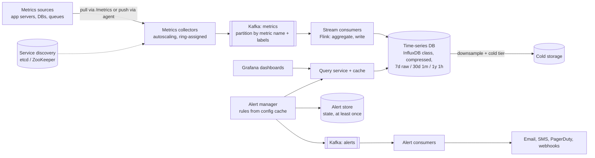
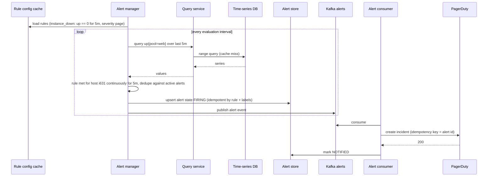

# 17 — Design a Metrics Monitoring and Alerting System (Vol. 2, ch. 5)

*Written as I would talk through it in a design discussion, with the reasoning behind each choice.*

## 1. Problem statement

We are building the in-house metrics system for a large company: it collects operational metrics such as
CPU, memory, disk and requests per second from about a hundred thousand machines, stores them for a year with
decreasing resolution, lets engineers query and graph them with low latency, and fires alerts to email, phone,
PagerDuty and webhooks when rules match. It is for internal use, not a product like Datadog, and it is
metrics only: no logs, no distributed tracing.

## 2. Scope

I'll design the five parts every metrics system has: collection, transmission, storage, alerting and
visualization. I'll go deep on the data model, pull versus push collection, the ingestion pipeline and where
aggregation happens, the storage layer with retention and downsampling, and the alert manager. Logs are a
different system, usually the ELK stack, and tracing is another, so both are out and I'll say so.

## 3. Functional requirements

Collect system metrics and high-level service metrics from a thousand server pools of a hundred machines each.
Keep raw data for seven days, one-minute resolution for thirty days and one-hour resolution for a year. Serve
dashboards and ad-hoc queries over any time range. Evaluate alert rules continuously and notify over several
channels, with deduplication so one flapping instance does not page a hundred times.

## 4. Non-functional requirements

Scalability: more metrics and more alert rules over time without redesign. Low latency on queries, because an
engineer during an incident is staring at a dashboard and an alert rule runs every few seconds; I'd target
dashboard queries under a second and alert evaluations under a few hundred milliseconds. Reliability: this is
the system that tells us other systems are broken, so a missed critical alert is the worst failure, and
notification must be at least once. Flexibility: we should be able to swap the time-series database or the
dashboard tool later, which argues for a thin query layer in between. Data loss tolerance is interesting
here: losing an occasional data point in collection is acceptable, but losing an alert is not, so the two
paths get different guarantees.

As an error budget, I'd set 99.99% for alert evaluation and delivery, about four minutes a month when a firing
rule might not notify; that is spent by query-service failures and alert-pipeline lag, which are the pages.
Dashboards get 99.9%.

## 5. Design tenets

Metrics are time series: a name, a set of labels and timestamped values, and the store must be built for that
shape, not a general database. Collection is fire-and-forget because a lost sample is harmless and the next
one arrives in ten seconds. Put a durable queue between collection and storage so a storage outage loses
nothing. Downsample old data aggressively because most queries look at the last day. Keep labels low
cardinality or the index explodes. Buy the dashboard and, honestly, consider buying the alerting; build the
pipeline and storage.

## 6. Back-of-the-envelope estimation

A thousand pools times a hundred machines is a hundred thousand machines, at about a hundred metrics each,
so ten million active time series. If each reports every ten seconds that is a million samples a second. A
sample encoded naively is around sixteen bytes of timestamp and value plus the series identity, but a
time-series database compresses deltas to a byte or two per sample, so raw storage is on the order of a few
terabytes a day uncompressed and a few hundred gigabytes a day compressed; seven days of raw is a few
terabytes, and the one-minute and one-hour rollups are a fraction of that.

Reads are bursty: dashboards during an incident and alert rules every few seconds. Facebook's published
finding is that about 85 percent of operational queries are for the last 26 hours, which tells me to keep the
recent window in memory and optimise for it.

Alert rules: thousands, each evaluated every ten to sixty seconds, so hundreds of queries a second against the
recent window.

**The hard part** is storage: a million writes a second into a structure that answers "average CPU across
these hosts for the last ten minutes" fast, with compression and tiered retention. Second is choosing between
pull and push collection, where a large organisation ends up supporting both. Third is making alerting
reliable and quiet at the same time, deduplicating and merging without ever dropping one.

## 7. System components and services

Metrics sources are application servers, databases, queues and anything else exposing numbers.

The metrics collector either scrapes a metrics endpoint on each target on a schedule, discovering targets from
a service registry, or receives pushed metrics from agents on the hosts; it writes to Kafka, not directly to
the database.

Kafka is the durable buffer between collection and storage, partitioned by metric name and further by labels.

Stream consumers, Flink or a similar engine, read from Kafka, optionally pre-aggregate, and write to the
time-series database.

The time-series database stores and indexes series by name and labels, compresses samples, and serves time-
range and aggregation queries.

A query service fronts the database with a cache, so dashboards and alerting are not coupled to a specific
database's API.

The alert manager loads rule definitions from a config cache, evaluates them against the query service on a
schedule, deduplicates and merges, writes alert state to an alert store, and publishes alert events to Kafka.

Alert consumers read events and send to email, SMS, PagerDuty and webhooks.

The visualization system is Grafana or equivalent, reading through the query service.

## 8. Architecture and flows




*Vector version: [17-metrics-monitoring-alerting-1-architecture.svg](diagrams/17-metrics-monitoring-alerting-1-architecture.svg)*





*Vector version: [17-metrics-monitoring-alerting-2-flow.svg](diagrams/17-metrics-monitoring-alerting-2-flow.svg)*


Narrated: the alert manager loads its rules from the config cache. On each interval it asks the query service
for the data each rule needs, the query service serves from cache or the database, and the manager checks the
condition and the "for" duration. When a rule has been true long enough it writes the alert's state to the
alert store, deduplicating against anything already firing for the same rule and labels, and publishes one
event to Kafka. A consumer picks it up and calls PagerDuty with an idempotency key, then marks the alert
notified. If the consumer crashes after calling PagerDuty but before marking, it retries, and the idempotency
key stops a second incident.

## 9. Communication between services

Collection is fire-and-forget: a pull collector scrapes an HTTP endpoint with a short timeout and moves on;
a push agent sends UDP or HTTP and does not wait. Collectors produce to Kafka asynchronously with
acknowledgements from the leader; here a brief loss on a broker failure is acceptable for metrics. Stream
consumers read in batches and write to the database in batches. Query service to database is synchronous with
a timeout and a cache in front. The alert manager calls the query service synchronously on a schedule. Alert
events ride a separate Kafka topic with acknowledgements from all replicas, because alerts must not be lost,
and consumers commit offsets only after the channel accepts the notification. Service discovery pushes target
changes to collectors by watch, with a periodic poll as a safety net.

## 10. Deep dives

### 10.1 The data model

A series is a metric name plus labels, for example `cpu.load{host=web01, region=us-west}`, and a stream of
timestamp-value pairs. A query like "average CPU across all web servers in us-west for the last ten minutes"
selects every series matching those labels over that range and aggregates. This is the line protocol used by
Prometheus and OpenTSDB. The access pattern is write-heavy and read-spiky: millions of writes a second all the
time, reads in bursts during incidents. A time-series database indexes every label value, which is what makes
label queries fast and also why cardinality must stay low: a label like request ID would create a series per
request and destroy the index.

### 10.2 Pull versus push collection

In the pull model the collector reads a target list from service discovery, with scrape interval, addresses,
timeouts and retries, and scrapes each target's metrics endpoint. Many collectors are needed, and to avoid two
collectors scraping the same target we place collectors and targets on a consistent-hash ring so each target
has exactly one collector. In the push model an agent on each host collects locally, can pre-aggregate, and
sends to collectors behind a load balancer in an autoscaling group.

Pull wins on debugging, because anyone can hit the metrics endpoint and see what the server reports; on health
checks, because a failed scrape means the target is down, whereas a missing push could be a network problem;
and on authenticity, because targets are defined in advance. Push wins on short-lived jobs that end before a
scrape, though a push gateway fixes that for pull; on firewalled or multi-datacenter networks where the
collector cannot reach every target; and on transport latency if UDP is used. Prometheus pulls; CloudWatch and
Graphite push. There is no winner: a large organisation supports both, and I would run pull as the default
with a push gateway and agent path for jobs and networks that need it.

### 10.3 The ingestion pipeline and where to aggregate

Collectors write to Kafka rather than the database so that a database outage loses nothing and so collection
and processing scale independently. Partitioning by metric name, and by labels within hot names, lets a
consumer aggregate a metric's data on one partition. The cost is operating Kafka; a purpose-built ingestion
system like Facebook's Gorilla is the alternative and is arguably as scalable.

Aggregation can happen in three places. In the collection agent, only simple things like a one-minute
counter, which cuts volume at the source. In the ingestion pipeline with a stream engine, which cuts write
volume substantially but discards the raw data, so precision is lost. At query time, which keeps all data but
makes queries slow. I would aggregate simple counters at the agent, keep raw data for seven days, and let the
downsampling jobs do the rest, because an incident investigation often needs the raw ten-second samples from
yesterday.

### 10.4 Storage, compression and retention

A general-purpose relational or NoSQL database can be made to work with expert tuning but fights the access
pattern; a time-series database is built for it. OpenTSDB needs a Hadoop and HBase stack; InfluxDB and
Prometheus are the common choices with an in-memory recent window and on-disk history, and InfluxDB handles
over 250,000 writes a second on an eight-core, thirty-two-gigabyte box. Compression is built in: timestamps
are stored as deltas of deltas and values with XOR encoding, which gets a sample down to a byte or two.
Downsampling converts old high-resolution data to lower resolution, keeping raw for seven days, one-minute
averages for thirty, one-hour for a year, with rules configurable by the people who use the data. Data older
than the hot window moves to cold storage, which is far cheaper. The query language is not SQL, because
window functions over time series are painful in SQL; a Flux or PromQL expression for an exponential moving
average is one line where the SQL is a page.

### 10.5 The query service

A thin service between clients and the database decouples dashboards and alerting from the database's API so
we can change the database later, and it hosts a cache for repeated dashboard queries. The honest counterpoint
is that Grafana and most alerting tools have plugins for every major time-series database and a good database
has its own cache, so the service may be unnecessary; I would keep it thin and justify it on flexibility.

### 10.6 The alert manager

Rules are YAML: an expression, a duration the condition must hold, and labels like severity. The manager
fetches rules from a config cache, evaluates on an interval through the query service, and when a rule is
met creates an alert event. It filters, merges and deduplicates so a flapping instance produces one alert, it
enforces access control on who can change rules, and it retries so an alert is propagated at least once. Alert
state lives in a key-value store such as Cassandra. Events go to Kafka and consumers deliver to channels. In
practice off-the-shelf alert managers are mature and hard to justify rebuilding; the same is even more true of
visualization, where Grafana is the answer.

### 10.7 Correctness and concurrency

Two collectors must not scrape the same target, hence the ring. Alert deduplication is keyed by rule plus
label set, and the alert store write is an upsert, so a re-evaluation cannot create a second firing alert.
Notification is at least once; the idempotency key passed to PagerDuty and the webhook receivers makes it
effectively once. Downsampling jobs are idempotent per time bucket so a rerun overwrites rather than
duplicates. Clock skew between hosts is absorbed by using the collector's receive time when the source's
timestamp is implausible.

### 10.8 Failure modes

If the time-series database is down, Kafka retains the metrics and consumers catch up when it returns;
dashboards show a gap and alert rules that need recent data fall back to a "no data" state, which for critical
rules is itself configured to page. If Kafka is down, collectors buffer briefly and then drop samples, which is
acceptable for metrics, while the alert path's separate topic is the one we protect with a larger replica set.
If a collector dies, the ring reassigns its targets after a heartbeat timeout and a few scrapes are missed. If
the query service is slow, alert evaluations run late, so the manager runs several instances with the rule set
partitioned, and we alarm on evaluation lag. If the alert consumer cannot reach PagerDuty, it retries with
backoff and fails over to another channel for page-severity alerts. If a rule is misconfigured and fires
constantly, deduplication keeps it to one alert and a rule-change review process catches it. If label
cardinality explodes because someone added a user ID label, ingestion rejects series beyond a per-metric
cardinality limit and alarms.

## 11. API design

```
Ingest (push): POST /v1/metrics   body: line protocol  "cpu.load,host=web01,region=us-west value=62 1613707265"
Scrape (pull): GET  http://<target>/metrics   exposed by the client library
Query:         GET  /v1/query?q=<expression>&start=&end=&step=   -> series with timestamp-value pairs
Alert rules:   GET/PUT /v1/alerts/rules  (YAML, access-controlled, versioned)
Alert state:   GET /v1/alerts/active ;  POST /v1/alerts/{id}/silence
```

## 12. Data model

```
series(metric_name, labels{} ) -> [(timestamp, value)]           -- time-series DB, label index per label
retention tiers: raw 7d, 1m rollups 30d, 1h rollups 1y, cold storage beyond
alert_rules(rule_id PK, name, expr, for_duration, labels, channels, version, owner)
alert_state(rule_id, label_hash) PK, state FIRING|RESOLVED|SILENCED, since, last_notified, notify_count
service_discovery: /targets/<pool>/<host> -> {endpoint, interval, timeout}
```

Queries: range reads by metric and label selector, aggregated; point writes at a million a second; rule and
alert state lookups by key.

## 13. Database choices

For metrics storage the options were a general relational database, a NoSQL store with a hand-built schema, and
a time-series database. The write rate, the compression needs and the label-selector query shape point
squarely at a time-series database; InfluxDB or Prometheus-class storage, with the in-memory recent window
matching the fact that most queries are about the last day. I give up SQL and general-purpose flexibility,
which this data never needs.

For alert state, a key-value store with high availability such as Cassandra, because the manager must be able
to record and read state even when other things are failing, and the data is small and keyed.

For rules and configuration, a small relational database with version history, cached in front of the alert
manager.

Service discovery lives in etcd or ZooKeeper for watches and consistency.

## 14. Tools and technologies

Kafka as the ingestion buffer for durability and decoupling, accepting its operational cost; Gorilla-style
ingestion as the alternative. Flink or Spark Streaming for consumers that pre-aggregate and write. Pull by
default with Prometheus-style client libraries, plus a push gateway and agents. Consistent hashing to assign
targets to collectors. InfluxDB-class storage with built-in compression and downsampling. Grafana for
dashboards, which I would not rebuild. An off-the-shelf alert manager if one meets the dedupe and routing
needs, otherwise the manager described here. PagerDuty, email, SMS and webhooks as channels.

## 15. Metrics and monitoring

Yes, the monitoring system is monitored, ideally by a separate small instance. Ingest rate and Kafka lag;
database write latency and memory of the hot window; query p99 and cache hit ratio; alert evaluation lag and
the count of rules in "no data"; alert delivery latency and failures per channel; series cardinality per
metric with a cap; collector scrape failures per target. Alarms on evaluation lag, delivery failures, Kafka lag
and cardinality growth, and these alarms go to a channel outside this system.

## 16. Notification and logging

The system's own notifications are the alerts it produces, routed by severity and owner labels, deduplicated
and silenceable. Its logs record scrape failures per target, rule evaluations that errored, and every
notification attempt with its idempotency key and outcome. Rule changes are audited with author and diff.

## 17. CI/CD, cost, operations, and what comes next

Rule changes go through review and a validation step that parses the expression and dry-runs it against
recent data to show what would have fired; rollback is reverting the rule version. Pipeline components deploy
independently with Kafka as the seam; the database upgrades with replicas so the hot window is never lost.
Downsampling and retention jobs are idempotent and scheduled. Backups: rules and alert state are backed up like
any small database; metrics beyond the hot window are in cold storage and raw data older than seven days is by
design not retained.

Cost is storage of the hot window on fast disks and memory, then Kafka, then the collector fleet; downsampling
and cardinality limits are the levers.

Regions: collectors and Kafka run per region close to the targets; storage is per region with a federated
query layer for global dashboards; alerting runs per region so a region's loss does not silence its alerts,
with a global view on top.

Ownership: the observability team owns the pipeline, storage and alert manager; service teams own their
metrics, dashboards and rules.

At ten times the scale we shard the time-series database by metric name and tenant, add a long-term store
such as Thanos or Cortex-style object-storage-backed blocks, and the next features are anomaly detection on top
of static thresholds, SLO burn-rate alerts, and linking alerts to runbooks and traces.
