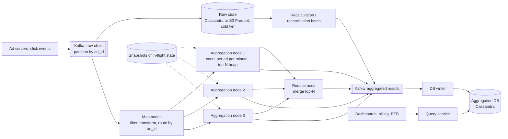
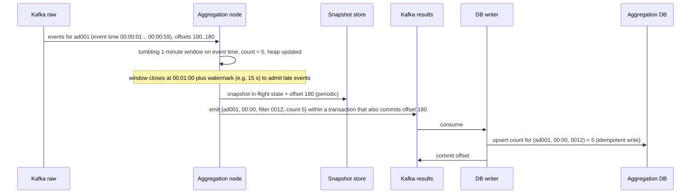

# 18 — Design an Ad Click Event Aggregation System (Vol. 2, ch. 6)

*Written as I would talk through it in a design discussion, with the reasoning behind each choice.*

## 1. Problem statement

We are building the system that counts ad clicks at Facebook or Google scale and serves the aggregates that
drive billing and real-time bidding decisions. A billion clicks a day across two million ads, growing thirty
percent a year. The two queries that matter are "how many clicks did ad X get in the last Y minutes" and "what
are the top hundred most clicked ads in the last minute", both filterable by attributes like country, IP and
user. Events can arrive late, events can be duplicated, parts of the system will fail, and because the numbers
turn into invoices, correctness is not negotiable.

## 2. Scope

I'll build the ingestion stream, the aggregation pipeline, the raw and aggregated stores, the query API, and
the correctness machinery: event-time windows with watermarks, exactly-once processing, deduplication,
hot-key handling, fault tolerance with snapshots, and end-of-day reconciliation. The real-time bidding engine
itself, fraud detection beyond a mention, and dashboards are out; the aggregates feed them.

## 3. Functional requirements

Aggregate click counts per ad per minute and answer the count for any ad over the last Y minutes. Produce the
top N most clicked ads over the last M minutes every minute, with N and M configurable. Support filtering by
predefined attributes such as country, IP and user ID. Handle late and duplicate events and recover from
partial failures without losing or double-counting.

## 4. Non-functional requirements

Correctness comes first: these aggregates set what advertisers pay, so a one percent error is millions of
dollars, which is why we need exactly-once processing rather than the usual at-least-once. Late and duplicate
events must be handled explicitly, not hoped away. Robustness to partial failure: a crashed aggregation node
must resume where it left off. Latency: a few minutes end to end is acceptable because aggregates feed billing
and reporting; the sub-second path is the bidding engine, not this system. Scale: ten thousand clicks a
second on average and fifty thousand at peak, growing thirty percent a year.

As an error budget, I'd frame two: availability of the query API at 99.9%, about forty-three minutes a month,
spent by database and query-service failures; and a correctness budget of zero, enforced by the nightly
reconciliation, where any discrepancy is an incident, not a statistic.

## 5. Design tenets

Keep the raw events, because aggregates are derived data and the only way to fix a bug is to recompute from
the source. Decouple every stage with a durable log so a slow or dead consumer never stalls producers.
Aggregate on event time, not processing time, because accuracy is the requirement, and bound lateness with a
watermark. Make the pipeline exactly-once end to end by committing offsets and results atomically, or by
making the sink idempotent. Pre-aggregate by the filter dimensions we know in advance, the star-schema idea,
so filtered queries are lookups. And reconcile against the raw data every day, because no streaming system
should be trusted with money without an independent check.

## 6. Back-of-the-envelope estimation

A billion clicks a day over roughly a hundred thousand seconds is about ten thousand a second, with peaks at
five times that, fifty thousand. A click event is around a hundred bytes, so raw storage is about a hundred
gigabytes a day and three terabytes a month, which is cheap in a write-optimised store or as columnar files in
object storage.

Aggregated data is far smaller: two million ads times a count per minute is about three billion rows a day in
the worst case, but most ads get no clicks in most minutes, so in practice tens of millions of rows a day,
multiplied by the number of filter dimensions we pre-aggregate.

The top-N structure is one row per minute per window size, trivially small.

Thirty percent annual growth means the pipeline needs headroom to roughly double every two and a half years,
which argues for pre-provisioning Kafka partitions and letting the aggregation and storage tiers scale
horizontally.

**The hard part** is correctness under distributed failure: counting every event exactly once when the
delivery layer is at-least-once, when events arrive out of order and late, when a hot ad concentrates load on
one node, and when nodes die mid-window holding in-memory partial counts.

## 7. System components and services

Click producers, the ad-serving front ends, publish click events to the first Kafka topic.

The aggregation service is a stream-processing job in a map-aggregate-reduce shape: map nodes read, filter and
route by ad ID; aggregation nodes count per ad per minute in memory and maintain a heap for the top N; a reduce
node merges the per-node tops into the final list.

A second Kafka topic carries the aggregated results, per-minute counts and the top-N lists, so the write into
the database is decoupled and so the pipeline can commit offsets and outputs atomically.

A database writer consumes the results topic and writes to the aggregation database.

The raw data store keeps every event for debugging and recomputation, with cold tiering.

The aggregation database holds per-ad per-minute counts by filter and the top-N lists.

The query service answers the two API queries from the aggregation database.

A recalculation service is a batch job that replays raw data through a dedicated aggregation path when a bug
requires recomputation, and a reconciliation job recomputes from raw data nightly and compares.

## 8. Architecture and flows




*Vector version: [18-ad-click-event-aggregation-1-architecture.svg](diagrams/18-ad-click-event-aggregation-1-architecture.svg)*





*Vector version: [18-ad-click-event-aggregation-2-flow.svg](diagrams/18-ad-click-event-aggregation-2-flow.svg)*


Narrated: click events land on the first topic, partitioned by ad ID so one ad's events go to one aggregation
node. The node counts per ad for each one-minute window on the event's own timestamp, and keeps a heap of the
most clicked ads for the sliding top-N window. When a window closes, after waiting a watermark period for
stragglers, the node emits the counts and the top list to the results topic in the same transaction in which
it commits its input offset, so either both happen or neither. A writer consumes the results and upserts them
into the aggregation database with the window and filter as the key, so a replayed result overwrites rather
than adds. Periodically the node snapshots its in-flight state and offsets so a replacement can resume mid-
window.

## 9. Communication between services

Producers publish to Kafka asynchronously with acknowledgements from all replicas, because losing a click is
losing money. Aggregation nodes consume by pull in batches. Within the aggregation job, map to aggregate to
reduce communicates over TCP or shared memory with intermediate state in memory, which is what makes it fast
and what makes snapshots necessary. Aggregation to the results topic is a transactional produce tied to the
offset commit. The writer consumes and upserts, committing offsets after the database acknowledges. The query
service reads the database synchronously with a cache for the hottest ads and the current top list, behind a
timeout and a client-side circuit breaker so a slow database degrades to cached values rather than stalling
dashboards and the bidding engine's calls. The
recalculation path runs as a batch against the raw store and writes through the same results topic so the
database sees one write path.

## 10. Deep dives

### 10.1 Streaming, batching and the Kappa architecture

An online service answers requests; a batch system processes bounded input for throughput; a streaming system
processes unbounded input for throughput and latency. We stream for the live aggregates and we batch for
history and recomputation. Having both paths with two codebases is the Lambda architecture and its cost is
exactly that duplication. We avoid it with Kappa: recomputation replays raw data through the same aggregation
logic, on a dedicated instance so the live pipeline is not disturbed, and writes through the same results
topic.

### 10.2 Event time, processing time and watermarks

An event has the time the click happened and the time our system saw it, and with queues and network delays
they can differ by seconds or minutes. Aggregating on processing time gives wrong answers when events are
delayed; aggregating on event time gives right answers but forces us to handle late events. Since accuracy is
the requirement, we use event time, and we accept that clients may have wrong clocks or lie, which the risk
engine handles. For lateness we extend each window by a watermark: a short watermark means lower latency and
more missed stragglers, a long one the reverse. Some events will always be later than any watermark; rather
than chase them, the nightly reconciliation corrects them.

### 10.3 Windows

Of the four window types, tumbling, hopping, sliding and session, the per-minute count is a tumbling window
because minutes do not overlap, and the top N in the last M minutes is a sliding window updated every minute
because the user wants a rolling view.

### 10.4 Exactly once and deduplication

Duplicates arrive from clients resending and from our own failures: an aggregation node dies after sending
results downstream but before acknowledging its input, so the input is redelivered and processed again. Three
options. Store the last processed offset in external storage before sending downstream, which risks the result
never reaching downstream if we crash in between. Send downstream first and then store the offset, which is
the duplicate case. Or make the offset commit and the downstream write atomic in a distributed transaction,
which Kafka's transactional produce gives us for the results topic. I use the transaction, and I also make the
database write an upsert keyed by ad, minute and filter, so even a duplicate result is harmless. The honest
note is that exactly-once stops at the Kafka boundary; the idempotent sink is what carries it to the database.

### 10.5 Hot ads

A viral ad concentrates all its events on one aggregation node. The node asks the resource manager for extra
capacity, splits its events across several helper nodes, and merges their partial counts back; this is the
map-side pre-aggregation idea applied dynamically. More sophisticated variants are global-local aggregation
and split-distinct aggregation. Partitioning the topic by geography as well as ad ID also spreads load.

### 10.6 Fault tolerance

Aggregation state is in memory, so a node crash loses the current window's partial counts. Kafka offsets let a
replacement resume from the last commit, and periodic snapshots of in-flight state, taken at the minute
boundary, let it resume mid-window: the new node loads the latest snapshot plus the committed offset and
continues. Without snapshots, recovery means replaying the whole window, which is acceptable for a one-minute
window but not for a long sliding top-N window.

### 10.7 Correctness and reconciliation

Every result write is idempotent by key. Every emitted result is tied to its input offsets by a transaction.
And every night a batch job recomputes the day's aggregates from the raw store and compares them with the
aggregation database; any difference is investigated, and the raw store is the source of truth that lets us
correct it. This is what makes the system trustworthy for billing: not that the stream never errs, but that
every error is caught and fixed.

### 10.8 Failure modes

If an aggregation node dies, a replacement loads the snapshot and offsets and resumes; the aggregate for that
minute is late by seconds. If Kafka is down, producers buffer briefly and ad servers write to a local spool,
because losing clicks is losing revenue; we alarm immediately. If the aggregation database is down, results
wait in the second topic and the query API serves stale data with an "as of" timestamp. If the query service is
slow, dashboards degrade and the bidding engine uses its last good values. If the watermark is too short for a
burst of late events, the minute undercounts and reconciliation corrects it the next day. If a bug ships in
the aggregation logic, we fix it, replay raw data through the recalculation path, and overwrite. If a hot ad
overwhelms a node, the split-and-merge path absorbs it and we alarm on partition skew. If a client floods
duplicate or fraudulent clicks, deduplication by event ID catches resends and the risk engine handles intent.

## 11. API design

```
GET /v1/ads/{ad_id}/aggregated_count?from=<minute>&to=<minute>&filter=<filter_id>
    -> {ad_id, count}
GET /v1/ads/popular_ads?count=100&window=1&filter=<filter_id>
    -> {update_time_minute, ad_ids: [...]}
```

The filter ID names a predefined combination of dimensions such as "non-US clicks", because pre-aggregation
needs to know the dimensions in advance.

## 12. Data model

```
raw click event:  {ad_id, click_timestamp, user_id, ip, country, event_id}         -- Kafka, then raw store
aggregated count: (ad_id, click_minute, filter_id) PK, count                         -- upsert
most_clicked_ads: (window_size, update_time_minute) PK, most_clicked_ads JSON array
filter definitions: filter_id PK, region, ip, user_id patterns
star-schema variant: (ad_id, click_minute, country) PK, count   -- one row per dimension value
snapshots: (job_id, minute) -> serialized in-flight counts and heap, committed offset
```

The queries are a range by ad and minute with a filter, a point read of the latest top-N row, append-only raw
writes, and idempotent upserts of aggregates. Pre-aggregating per dimension, the star schema, makes filtered
queries lookups at the cost of many more rows as dimensions multiply.

## 13. Database choices

Raw events are ten to fifty thousand writes a second, read rarely and only for recomputation or debugging.
Options were a relational database, which can take the writes only with hard sharding; Cassandra or a
time-series store, which handle write-heavy loads natively; or object storage with a columnar format like
Parquet, which is cheapest and ideal for batch recomputation. I would pick Cassandra for familiarity in the
interview setting and name S3 plus Parquet as the better long-term choice for cost and batch access; I give up
nothing on the hot path either way because raw data is not read there.

Aggregated data is both write-heavy, every minute, and read-heavy, dashboards and alerts all day, keyed by ad
and minute. Cassandra fits again with its partition-plus-clustering shape and horizontal scaling through
consistent hashing, so adding a node rebalances automatically. The alternative worth naming is an OLAP store
such as ClickHouse or Druid, which is purpose-built for exactly these aggregate queries and is what many real
systems use; I give up some of that query power for operational simplicity of one store.

Snapshots go to a durable key-value store or object storage. Filter definitions are a tiny relational table.

## 14. Tools and technologies

Kafka for both topics because we need durability, replay for recomputation, partitioning by ad ID for
locality, and transactional produce for exactly-once. A stream engine, Flink or Spark Structured Streaming,
rather than hand-written consumers, because it gives event-time windows, watermarks, keyed state and
checkpointed exactly-once out of the box; the map-aggregate-reduce description is how that engine works
underneath. A resource manager such as YARN or Kubernetes so hot-key splitting can request capacity. Cassandra
for storage as discussed, with ClickHouse or Druid as the OLAP alternative, and Hive plus Elasticsearch as the
off-the-shelf alternative for raw-data exploration.

## 15. Metrics and monitoring

End-to-end latency from click event time to aggregate availability, measured per stage. Kafka records-lag per
consumer group, because a growing lag means we need more aggregation nodes; queue depth is the wrong metric
for a log. Aggregation node resources: CPU, memory, JVM pauses, and partition skew for hot ads. Late-event rate
beyond the watermark and duplicate-event rate. Reconciliation discrepancies, which should be zero and are an
incident otherwise. Query p99 and database health. Alarms on lag growth, latency over the few-minute target,
snapshot failures, and any reconciliation mismatch.

## 16. Notification and logging

Every emitted aggregate carries its input offset range in logs so a disputed number can be traced to events.
Reconciliation results post daily to the billing and engineering channels, with mismatches paging the data
on-call. Pipeline stalls and Kafka lag page; database degradation opens a ticket if the stale-read fallback is
serving. Raw events are logged only in the raw store, never in application logs, because they include IPs and
user IDs.

## 17. CI/CD, cost, operations, and what comes next

Aggregation logic changes are validated by running the new version over a day of raw data and diffing against
the stored aggregates before deployment, then rolled out as a new job instance that takes over partitions, with
rollback by restarting the previous job from its last checkpoint. Schema changes to the results topic are
backward compatible through a registry. Kafka partitions are over-provisioned for growth and rebalances are
done off-peak because thousands of consumers rebalance slowly. Backups: raw data in the raw store is the backup
of the aggregates, and it is tiered to cold storage; the aggregation database is replicated, and a lost
aggregate is recomputable.

Cost is Kafka retention, aggregation compute, and the two stores; moving raw data to columnar object storage
and shortening Kafka retention are the levers.

Regions: topics can be partitioned by geography, with aggregation per region and a global merge for the top-N,
which also keeps click data close to where it is produced.

Ownership: the ads data platform team owns the pipeline and stores; the billing team owns reconciliation
rules; the ads team owns filter definitions.

At ten times the scale we add partitions and nodes and move aggregates to an OLAP store; the next features are
more dimensions with roll-up cubes, anomaly detection on click rates for fraud, impression and conversion
aggregation alongside clicks, and self-serve filter definitions.
