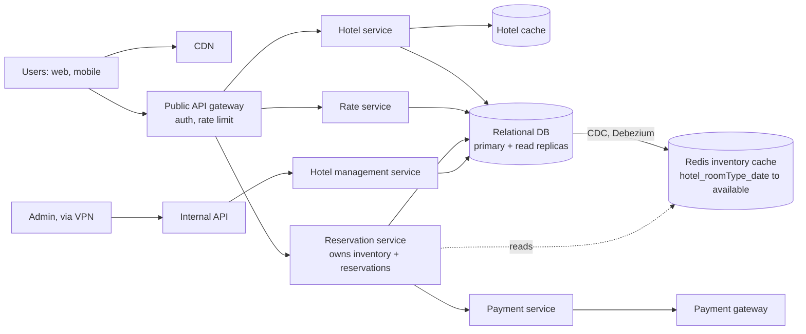
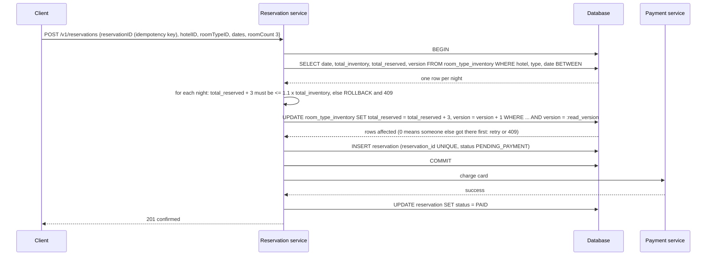

# 19 — Design a Hotel Reservation System (Vol. 2, ch. 7)

*Written as I would talk through it in a design discussion, with the reasoning behind each choice.*

## 1. Problem statement

We are building the reservation system for a hotel chain the size of Marriott: five thousand hotels and a
million rooms, bookings made only through the website and app, paid in full at booking, cancellable, with
the hotel allowed to overbook by ten percent in anticipation of cancellations. Room prices change daily. The
same design applies to Airbnb, airline seats and cinema tickets, which is why interviewers like it: the
interesting part is not the scale, it is the correctness of inventory under concurrent bookings.

## 2. Scope

We agreed to focus on the hotel and room detail pages, making a reservation, the admin panel, and overbooking.
Search across hotels by many criteria is out because it is not technically interesting here. I'll go deep on
the data model for inventory, the double-booking problem, how to scale if this were adopted by a site a
thousand times busier, and how consistency works across services.

## 3. Functional requirements

Show a hotel and its room types with prices for future dates. Reserve a number of rooms of a room type for a
date range, paying in full, with the hotel allowed to sell up to a hundred and ten percent of its inventory.
Cancel a reservation. Let operations staff manage hotels, rooms and reservations through an internal panel.
Prices change daily.

## 4. Non-functional requirements

High concurrency on the same inventory during peak season, which is where correctness is tested: two people
booking the last room at the same moment must not both succeed beyond the overbooking limit. Latency is
moderate; a reservation taking a couple of seconds is acceptable, because the user has just entered card
details and expects a short wait. Consistency is strong for inventory and reservations, because money and
rooms are involved; it is eventual for hotel descriptions, prices for far-future dates, and caches. Availability
of 99.95% for booking, because every minute down is lost revenue, but this is not a chat app; a minute of
degraded booking is survivable. Scale is modest: around three reservations a second on average, with page
views two orders of magnitude higher.

As an error budget, 99.95% is about twenty-two minutes a month of failed bookings. Database failovers and
payment-provider failures are what spend it, and a spent budget halts schema and service rollouts.

## 5. Design tenets

Model inventory as a count per hotel, room type and date, not as individual rooms, because guests book a
type and the hotel assigns a room at check-in. Keep reservation and inventory in the same relational database
so one ACID transaction protects them, even though that bends pure microservice doctrine. Make every booking
request idempotent with a client-generated reservation ID. Use optimistic concurrency or a database constraint
to resolve concurrent bookings, not pessimistic locks, because contention is actually low. Cache aggressively
for reads and let the database be the final arbiter on writes.

## 6. Back-of-the-envelope estimation

A million rooms at seventy percent occupancy and an average three-night stay means about 240,000 reservations
a day, which is roughly three a second. If reaching the booking page takes three steps at ten percent
conversion each, three bookings imply thirty booking-page views and three hundred room-detail views a second.
These are tiny numbers; a single relational primary handles them with room to spare.

Inventory rows: five thousand hotels, twenty room types each, two years of dates, is 5,000 × 20 × 730, about
73 million rows. That fits one database comfortably with read replicas for availability.

The decision the numbers force: a relational database, no sharding on day one, but a shard key chosen now
for the day a travel site a thousand times bigger adopts this.

**The hard part** is the double-booking problem in both its forms: one user clicking "book" twice, and two
users booking the last room simultaneously. The second is a classic lost-update race that default isolation
levels do not prevent, so the deep dive is about which of pessimistic locking, optimistic locking and database
constraints to use and why.

## 7. System components and services

Users book on web and mobile; admins use an internal panel behind a VPN.

A CDN serves static assets. A public API gateway handles authentication and rate limiting; internal APIs are
reachable only by authorised staff.

The hotel service serves hotel and room data, which is nearly static and cached aggressively.

The rate service serves room prices per future date; prices depend on how full the hotel is, which is an
interesting domain wrinkle.

The reservation service accepts bookings, checks and updates inventory, records reservations and cancels them.
It owns the inventory tables.

The payment service charges the card and tells the reservation service to confirm or release.

The hotel management service gives staff administrative views and actions.

Services talk over gRPC.

## 8. Architecture and flows




*Vector version: [19-hotel-reservation-1-architecture.svg](diagrams/19-hotel-reservation-1-architecture.svg)*





*Vector version: [19-hotel-reservation-2-flow.svg](diagrams/19-hotel-reservation-2-flow.svg)*


Narrated: the booking page generates a reservation ID the moment the user starts filling in details. When they
click book, the request carries that ID, the hotel, the room type, the dates and the count. The reservation
service opens a transaction, reads the inventory row for each night with its version, checks that the
requested rooms fit under a hundred and ten percent of inventory for every night, and updates each row with a
condition that the version is still what it read. If another booking slipped in, zero rows update and we
retry or return a conflict. Then it inserts the reservation, whose ID column is unique so a second click with
the same ID fails harmlessly, and commits. Only then does it charge the card and mark the reservation paid.

## 9. Communication between services

Client to gateway to services is synchronous HTTPS, and services talk to each other over gRPC with timeouts and
client-side circuit breakers. Reservation to payment is synchronous because the user is waiting for a
confirmation that includes the charge result, with a timeout and an idempotency key passed to the payment
provider so a retry cannot double-charge. The database to the Redis inventory cache is asynchronous through
change-data-capture with Debezium, so the cache lags by a little and the database remains the arbiter.
Hotel and rate reads are cache-aside with long TTLs because the data changes daily at most.

## 10. Deep dives

### 10.1 The data model, and why room type rather than room

A first version keyed reservations by room ID with a status state machine per room. That works for Airbnb,
where you book a specific home, but hotels sell a room type and assign a number at check-in. So the model
becomes a room type inventory table with one row per hotel, room type and date, holding total inventory,
rooms temporarily out of service subtracted, and total reserved. Availability for a date range is one query
across the rows for those dates, and the overbooking rule is a comparison per row. A nightly job pre-populates
rows two years ahead. Alternatives like one row per room per date or a bitmap per month exist, but one row per
type per date keeps the queries simple and the concurrency unit small.

### 10.2 Double booking, part one: the same user twice

Disabling the button on the client helps but is not a guarantee; JavaScript may be off or the user may have
two tabs. The server-side fix is idempotency: generate the reservation ID when the booking form opens, send it
with the request, and make the column unique in the database. A second submission with the same ID violates
the constraint and we return the original confirmation.

### 10.3 Double booking, part two: two users at once

With a non-serializable isolation level, two transactions both read ninety-nine reserved out of a hundred,
both decide there is room, both update, and the hotel is over its limit. This is the lost update, and
Repeatable Read does not stop it. Three fixes.

Pessimistic locking with SELECT FOR UPDATE locks the inventory rows until commit, serializing updates. It is
simple and right when contention is heavy, but it can deadlock when several resources are locked, and a
long-held lock stalls every other transaction on those rows; a multi-night booking locks several rows for the
duration of the transaction. I would not pick it here.

Optimistic locking adds a version column, reads it, and updates only where the version is unchanged, bumping
it. No locks are held, so it is faster, and it degrades only when contention is high because of rollbacks and
retries. Reservation traffic is three a second, so contention on any one hotel-type-date is low, which makes
this a good fit.

A database check constraint such as total reserved must not exceed inventory times one point one is even
simpler: the update just fails when it would violate the rule. It performs like optimistic locking, with the
downsides that constraints are harder to version-control than code and not every database supports them.

I'd pick optimistic locking as the primary mechanism because contention is low and it keeps the rule in
application code where it is reviewed and tested, and I'd add the check constraint as a belt-and-braces
guard, because two independent safeguards against overselling rooms are worth one extra line of DDL. What I
give up is pessimistic locking's predictability under very heavy contention, which this system will not see.

### 10.4 Scaling if a huge travel site adopted this

Services are stateless and scale by replication. The database is the stateful part. At a thousand times the
load, around thirty thousand reservations a second, we shard by hotel ID, because every inventory and
reservation query filters by hotel; sixteen shards puts each at under two thousand queries a second, which one
MySQL cluster handles. We also move past reservations to cold storage so the hot database holds only current
and future bookings. For reads we cache available-room counts in Redis keyed by hotel, room type and date,
with TTLs so past dates expire, populated by change-data-capture. The cache can lag the database, which is fine:
a user might see a room as available, try to book, and be told it is gone, which happens anyway when someone
hesitates; the database never lets an invalid reservation through.

### 10.5 Consistency across services

A monolith gets atomicity from one database. Pure microservices give each service its own database, and then
reserving inventory and creating a reservation span two services and lose atomicity. The options are two-phase
commit, which is slow and blocks everyone when one participant stalls, or sagas, a sequence of local
transactions with compensating actions, which is eventually consistent and requires designing the undo for
every step. I take the pragmatic position: the reservation service owns both inventory and reservations in
one relational database, so one transaction covers both, and I defend that against the "not pure
microservices" challenge on the grounds that correctness of money and rooms is worth a slightly larger service
boundary. Payment, which is a separate service and an external provider, is handled with a pending status and
a compensating release if the charge fails, which is a small saga.

### 10.6 Failure modes

If the payment provider is slow or down, the reservation sits in pending; a timeout returns "we could not
confirm your payment", a background job releases pending reservations after a window, and the provider's
idempotency key stops a double charge on retry. If the database primary fails, bookings fail until a replica is
promoted, about a minute with semi-synchronous replication so no committed booking is lost; reads continue
from replicas. If the inventory cache is stale, a user is told the room is gone at booking time, which is
acceptable. If the nightly inventory job fails, far-future dates are missing rows and show as unavailable;
we alarm and rerun. If the price changes between viewing and booking, the booking carries the quoted price
and rate ID, and the service rejects a stale quote beyond a short validity. If an admin takes rooms out of
service below current reservations, the UI warns and the hotel handles it as an overbooking case, which is
exactly what the ten percent policy exists for.

## 11. API design

```
GET  /v1/hotels/{id};  POST/PUT/DELETE /v1/hotels (ops only)
GET  /v1/hotels/{id}/rooms/{roomTypeId};  POST/PUT/DELETE (ops only)
GET  /v1/reservations            current user's history
GET  /v1/reservations/{id}
POST /v1/reservations   {startDate, endDate, hotelID, roomTypeID, roomCount, reservationID}
     201 confirmed | 409 no availability | 200 on an idempotent repeat
DELETE /v1/reservations/{id}     cancel
```

The reservationID is generated by the client when the form opens and is the idempotency key; it is unique in
the database.

## 12. Data model

```
hotel(hotel_id PK, name, address, location, ...)
room(room_id PK, hotel_id, room_type_id, floor, number, is_available)
room_type_rate(hotel_id, room_type_id, date) PK, rate
room_type_inventory(hotel_id, room_type_id, date) PK, total_inventory, total_reserved, version
reservation(reservation_id PK, hotel_id, room_type_id, start_date, end_date, room_count, guest_id,
            status (PENDING_PAYMENT, PAID, REFUNDED, CANCELED), rate_id, created_at)
guest(guest_id PK, name, email, ...)
```

The queries are: hotel and room type by ID (cached); rates and inventory by hotel, type and date range;
conditional update of inventory rows by version; insert reservation with a unique ID; a guest's reservations.
The shard key, when needed, is hotel ID, because it appears in every inventory and reservation query.

## 13. Database choices

The workload is read-heavy with few writes, needs ACID so that inventory, reservations and payment status
never disagree, and the data is clearly relational. The options were a relational database, which fits all
three; a NoSQL store, which is optimised for write volume we do not have and would make the inventory
transaction a saga; and a document store, which gives flexible schema we do not need. I pick a managed
relational database, MySQL or Postgres, with read replicas across zones. What I give up is effortless
horizontal scale, which the hotel-ID shard plan recovers if ever needed.

For the inventory read cache, Redis with TTL keys fed by Debezium, because it is a point lookup per date and
expiry of past dates is free; I accept the stale window because the database guards the write.

For hotel and room content, the same relational database with a cache in front, because it is small and
nearly static.

## 14. Tools and technologies

gRPC between services for typed contracts. Optimistic locking plus a check constraint for inventory, as
discussed. Debezium for change-data-capture into Redis rather than application dual-writes, so the cache
cannot be forgotten on a write path. A managed API gateway for authentication and rate limiting. An
idempotency key passed through to the payment provider. For the admin panel, the internal API behind a VPN
with role-based access.

## 15. Metrics and monitoring

Booking success rate and p99, and the 409 rate, which is the natural measure of contention and of cache
staleness. Payment success rate and latency, and the count of reservations stuck in pending. Database
replica lag, primary CPU, and lock wait time, which should stay near zero with optimistic locking. Cache hit
ratio for inventory and hotel data. Nightly inventory job success. Alarms on booking errors over half a
percent, pending reservations older than the release window, replica lag, and job failure.

## 16. Notification and logging

Every reservation state change is audited with who or what caused it, which the admin panel and customer
service rely on. Guests get confirmation and cancellation emails through the notification platform. Booking
failures page the on-call; payment-provider degradation opens a ticket if the pending-release job is coping.
Logs carry the reservation ID as the trace key across services.

## 17. CI/CD, cost, operations, and what comes next

Services deploy independently with the gateway routing a canary slice first; schema changes are expand-and-
contract because the database is shared by the reservation path. Rollback is redeploying the previous version;
the idempotency key means a retried booking during a deploy is safe. Backups: the database has point-in-time
recovery with a recovery point of minutes and a recovery time under an hour, restored on a schedule, because
reservations are money.

Cost is small: a relational cluster, a cache, and stateless services; payment-provider fees dominate.

Regions: a single primary region with replicas elsewhere for reads and disaster recovery, active-passive,
because inventory must have one writer per hotel; the hotel-ID shard key also allows homing hotels in their
own region later.

Ownership: the reservation service owns inventory and reservations; hotel content, rates, payments and the
admin panel are separate teams with gRPC contracts.

At ten times the scale we shard by hotel ID, add the inventory cache if not already present, and move history
to cold storage; the next features are search with filters, dynamic pricing driven by occupancy, loyalty
points, waitlists against overbooking, and multi-room group bookings.
