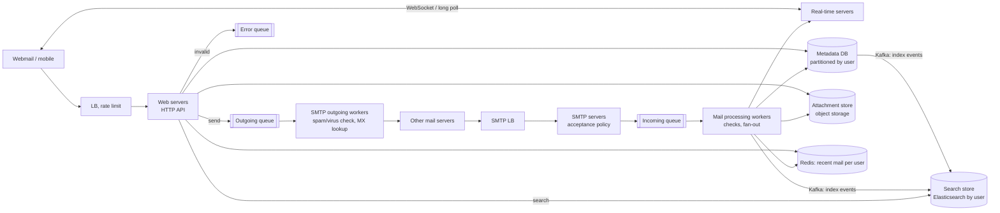
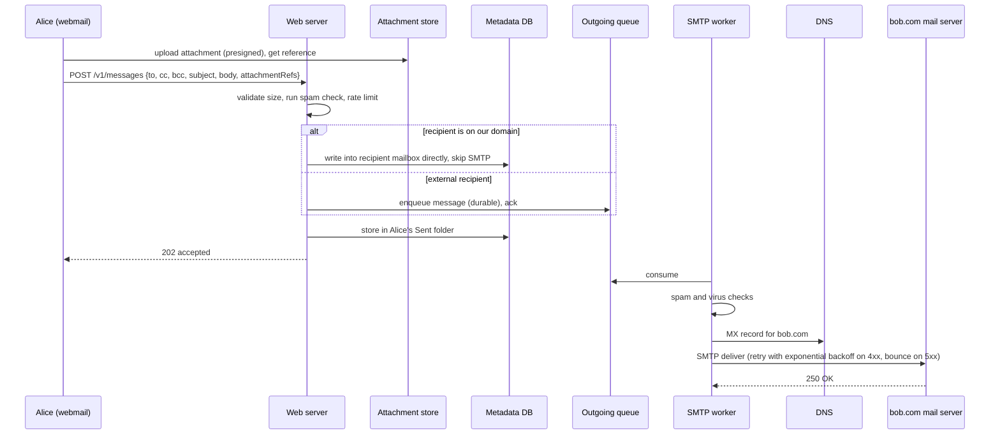

# 20 — Design a Distributed Email Service (Vol. 2, ch. 8)

*Written as I would talk through it in a design discussion, with the reasoning behind each choice.*

## 1. Problem statement

We are building an email service in the shape of Gmail for a billion users. People send and receive mail with
attachments, browse folders, mark messages read, search their mailbox, and are protected from spam. Clients
talk to us over HTTP rather than the traditional mail protocols, which keeps the client surface flexible,
while we still speak SMTP to the rest of the internet. The interviewer asked us to leave authentication out.

## 2. Scope

I'll design the send and receive flows, the metadata store that holds mailboxes, attachment storage, real-time
delivery to open clients, folders and read state, search, and the operational realities of actually getting
mail delivered to other providers' inboxes. Authentication is out by agreement. Spam filtering and virus
scanning appear as stages in the flow, but their internals are a separate design. Encryption, compliance and
attachment deduplication are follow-ups I'll name.

## 3. Functional requirements

Send a message to recipients in To, Cc and Bcc, with attachments up to a size limit. Receive messages from
other providers over SMTP and from our own users internally. Fetch folders and the messages in a folder with
pagination, open a message, mark it read or unread, and view conversation threads. Full-text search within a
user's mailbox with filters such as sender, subject and unread. Protect users from spam and malware.

## 4. Non-functional requirements

Reliability first: we must never lose a message, which for the metadata store means choosing consistency over
availability during failures, and I'll say that trade explicitly. Availability through replication and
tolerance of partial failures, but if a shard is failing over, I accept that its users briefly cannot sync
rather than risk losing or duplicating mail. Scalability to a billion users and to storage measured in
petabytes per year. Flexibility and extensibility, which is one reason we chose HTTP over SMTP and IMAP for our
own clients: new features ship as API changes, not protocol extensions. Latency: opening the inbox should feel
instant, under a few hundred milliseconds, and a sent message should appear in the recipient's open client
within seconds.

As an error budget, 99.9% for the mailbox API is about forty-three minutes a month of failed reads or syncs,
spent mostly by metadata shard failovers; delivery has no budget for loss, only for delay, and the queue age
alarms enforce that.

## 5. Design tenets

Separate metadata from bodies and attachments: headers are small and hot, attachments are large and cold, and
they belong in different stores. Partition everything by user, because nearly every operation is confined to
one mailbox. Make the outbound and inbound paths asynchronous through queues so a slow destination or a burst
of inbound mail never blocks users. Push new mail to open clients in real time and let offline clients catch up
on reconnect. Treat search as a derived index fed asynchronously from the source of truth. And respect that
deliverability is a domain of its own with reputation, authentication and warm-up, not just a server that
speaks SMTP.

## 6. Back-of-the-envelope estimation

A billion users sending ten emails a day is ten billion sends a day, about a hundred thousand a second. Each
user receives about forty a day, and at fifty kilobytes of metadata and body per message that is about 730
petabytes of mail per year. If twenty percent of messages carry an attachment averaging five hundred
kilobytes, attachments add roughly 1,460 petabytes a year. Storage is the defining cost, and it argues for
putting attachments in object storage with lifecycle tiers and deduplicating identical attachments.

Reads are concentrated on recent mail, so a cache of each active user's recent headers handles most inbox
loads; a few kilobytes of headers per message times fifty recent messages per active user is well under a
terabyte of cache for the daily active set.

**The hard part** is the metadata store: a single value can be megabytes, consistency must be strong, data loss
is unacceptable, I/O must be minimised because headers are read constantly and bodies once, and it must shard
cleanly by user. No off-the-shelf database is a perfect fit, which is why Gmail uses a custom one on Bigtable.
The second hard part is deliverability, which is reputation engineering rather than software.

## 7. System components and services

Web servers handle the HTTP API for the webmail and mobile clients: send, folders, messages, read state.

Real-time servers push new-mail notifications to connected clients over WebSockets, with long polling as a
fallback for old browsers.

A load balancer in front of the web tier also rate-limits sends per user to curb abuse.

An outgoing queue decouples send acceptance from SMTP delivery; SMTP outgoing workers consume it, run spam and
virus checks, look up the recipient domain's MX record, and deliver. An error queue captures rejected sends.

SMTP servers behind an SMTP load balancer accept inbound mail from the internet, apply acceptance policy, and
hand to an incoming queue; mail processing workers run checks and fan out to storage, cache, search and the
real-time servers.

The metadata database stores folders, message headers and bodies partitioned by user.

An attachment store on object storage holds attachments, referenced from messages.

A distributed cache holds recent messages per active user.

A search store, Elasticsearch partitioned by user, indexes mail asynchronously via Kafka.

## 8. Architecture and flows




*Vector version: [20-distributed-email-service-1-architecture.svg](diagrams/20-distributed-email-service-1-architecture.svg)*





*Vector version: [20-distributed-email-service-2-flow.svg](diagrams/20-distributed-email-service-2-flow.svg)*


Narrated send: Alice uploads the attachment to object storage first and gets a reference, so bytes never flow
through our web servers. She posts the message; the web server validates size and runs a spam check, and if
the recipient is one of our users it writes straight into their mailbox and skips SMTP entirely. Otherwise it
puts the message on the durable outgoing queue, stores a copy in Alice's Sent folder, and returns. An SMTP
worker picks it up, runs the outbound spam and virus checks, finds the recipient domain's mail exchanger
through DNS, and delivers, retrying with backoff if the remote server is temporarily unavailable.

Narrated receive: a remote server connects to our SMTP load balancer; an SMTP server applies acceptance policy
and discards obviously invalid mail, moves an oversized attachment to object storage, and enqueues. A
processing worker runs spam and virus checks, writes the message to the recipient's mailbox in the metadata
store, updates their recent-mail cache, emits an index event, and tells the real-time servers, which push
"new mail" to the recipient if they are connected; if not, they see it on their next fetch.

## 9. Communication between services

Clients use HTTPS for the API and a WebSocket for real-time notifications, falling back to long polling; the
notification carries only "you have new mail", and the client fetches through the API, which keeps the
real-time tier stateless about content. Attachments move by presigned URLs directly to object storage. Send
acceptance is synchronous up to the durable enqueue and asynchronous after. SMTP between servers is the
internet's protocol and is inherently retried: temporary failures are retried with exponential backoff and
jitter, permanent failures generate a bounce to the sender. Inbound mail is likewise queued before processing
so a burst never overwhelms the workers. Indexing is asynchronous over Kafka so a search cluster slowdown
never delays delivery; search queries themselves are synchronous. The metadata store is called synchronously
with strong consistency, and every internal call carries a timeout set from its p99 and sits behind a client-
side circuit breaker, so a slow search cluster or object store fails fast instead of holding web-server threads.

## 10. Deep dives

### 10.1 Why traditional mail servers do not scale here

A traditional server stores each email as a file on the local disk of the one server a user connects to. That
works for a small organisation; at scale disk I/O becomes the bottleneck, a failed disk loses mail, and a down
server takes its users offline. A distributed design keeps SMTP for talking to other providers and IMAP or
POP for native clients, but puts mail in a replicated store and uses an HTTP API for our own clients.

### 10.2 The metadata store

The characteristics are specific: headers are small and read constantly; bodies range from small to large and
are read about once; nearly every operation is confined to one user; recent mail is read far more than old;
and loss is unacceptable. A relational database can index headers but is tuned for small rows and would be
hard to shard at this scale. A distributed object store is excellent for bodies and backups but cannot
support marking read or listing a folder efficiently. A wide-column store like Bigtable is what Gmail actually
uses, and the open equivalents, Cassandra or HBase, come closest. In an interview I would not design a new
database; I would state the properties it needs: columns up to single-digit megabytes, strong consistency,
minimised disk I/O, high availability and fault tolerance, and easy incremental backups.

Partition by user ID so one mailbox lives on one shard, which keeps every operation local; the cost is that
sharing a message between users is awkward, which is not a requirement here. Tables are keyed by partition key
plus clustering key: folders by user; emails by user and folder, clustered by a time-based UUID so they sort
by arrival; attachments by email and filename. Filtering by read state on a non-key column is not possible in
a wide-column store, so we denormalise into read and unread tables, keeping them in step on each state
change. Conversation threads come from the standard Message-Id, In-Reply-To and References headers, which the
client uses to reconstruct the thread. And the consistency choice: for this data we choose consistency over
availability, so during a failover or partition the affected users briefly cannot sync, which is the right
trade when the alternative is losing or duplicating mail.

### 10.3 Deliverability

Standing up a server that speaks SMTP is easy; getting mail into other providers' inboxes is hard because of
their spam filters. The practices are: send from dedicated IP addresses, because shared ones carry others'
reputations; separate marketing mail onto its own IPs so it cannot drag transactional mail into the spam
folder; warm up new IPs slowly over two to six weeks; ban spammers on our platform quickly; process feedback
loops from ISPs to track complaint rates; and authenticate with SPF and DKIM, plus DMARC, so receivers can
verify our mail. The point to make in the room is that this is a domain requiring sustained operational
expertise, not a feature.

### 10.4 Search

Email search is unlike web search: the scope is one mailbox, results sort by attributes like date rather than
relevance, and indexing must be fast and results exact. It is also write-heavier than it looks, because every
operation re-indexes and most users rarely search. One option is an Elasticsearch cluster partitioned by user,
fed asynchronously through Kafka, with synchronous queries; it is off the shelf and handles full text well, but
it is a second system to run and scales only so far. The other is a custom index built into the data store
using a log-structured merge tree so writes are sequential, which is how Cassandra and Bigtable organise data;
it can scale further and removes a system, at the cost of major engineering. I would start with Elasticsearch
as a derived index that can always be rebuilt from the metadata store, and keep the custom path as the
long-term option.

### 10.5 Correctness and concurrency

Message IDs are globally unique so a retried send or a duplicated inbound delivery is detected and dropped.
The write into a mailbox and the emission of the index and notification events are ordered so a client is
never told about mail it cannot fetch: write first, notify after. Read state changes are idempotent sets, not
toggles. Attachments are content-addressed so identical files are stored once, which is also the
deduplication optimisation.

### 10.6 Failure modes

If the outgoing queue grows, either a destination is down, which exponential backoff handles, or we need more
workers; we alarm on the age of the oldest message. If a destination permanently rejects, we bounce to the
sender. If the metadata shard for a user is failing over, that user cannot sync for the duration, by the
consistency choice, and sees a brief error. If the real-time tier is down, mail still lands and clients see it
on their next poll. If the search cluster lags, recent mail is missing from results until the index catches up,
and search is never the source of truth. If object storage is unavailable, attachments cannot be opened, though
mail bodies still load. If our IP reputation drops, deliverability falls and the feedback loop and warm-up
process are how we recover. If a flood of inbound spam arrives, the SMTP acceptance policy and the queue absorb
it, and processing workers scale on queue depth.

## 11. API design

```
POST /v1/messages                    {to, cc, bcc, subject, body, attachmentRefs[]}  -> 202 {messageId}
GET  /v1/folders                     -> [{id, name (All, Archive, Drafts, Flagged, Junk, Sent, Trash), user_id}]
GET  /v1/folders/{folderId}/messages?cursor=&limit=
GET  /v1/messages/{messageId}        -> {user_id, from, to, cc, subject, body, is_read, headers, attachments[]}
PATCH /v1/messages/{messageId}      {is_read, folder_id}
GET  /v1/search?q=&from=&unread=&after=
POST /v1/attachments/upload-url      -> presigned URL and reference
WebSocket: server to client new_mail {folderId, messageId}
```

## 12. Data model

```
folders(user_id, folder_id) PK, name, type
emails(user_id, folder_id, email_id timeuuid DESC) PK, from, to[], cc[], bcc[], subject, body, headers,
       is_read, attachment_refs[]
emails_read / emails_unread: same key shape, denormalised for read-state filtering
attachments(email_id, filename) PK, content_hash, object_key, size
Object storage: attachments by content hash (deduplicated)
Redis: recent:{user_id} -> last N headers
Elasticsearch: index per user shard, documents = emails with searchable fields
```

The queries are: folders by user; messages by user and folder newest first; a message by ID; unread messages
by folder via the denormalised table; search within a user's documents. Everything carries user ID, which is
the partition key.

## 13. Database choices

For mail metadata and bodies the options were relational, object storage, and a wide-column store. The
requirements of megabyte values, strong consistency, user partitioning, and minimised I/O point at a
wide-column store with strong consistency settings, Cassandra or HBase in the open world, Bigtable at Google;
I give up ad-hoc queries and accept denormalised tables for read state. Object storage is right for
attachments, with content-addressed keys and lifecycle tiers, because they are large, cold and immutable. Redis
caches recent headers per active user because inbox loads are overwhelmingly about recent mail. Elasticsearch
is the search index, derived and rebuildable, never the source of truth. Queues are Kafka for the index events
and either Kafka or a managed queue for outgoing and incoming mail, where I want durability and per-message
retry with dead-lettering.

## 14. Tools and technologies

HTTP API for our clients rather than IMAP and POP, keeping SMTP for interoperability and optionally IMAP for
native clients. WebSockets with long-polling fallback for new-mail pushes. Kafka for indexing events. SPF, DKIM
and DMARC for authentication, dedicated and warmed IP pools, and ISP feedback loops for deliverability. Spam and
virus scanning engines as pluggable stages on both paths. Elasticsearch for search initially. Content-addressed
object storage for attachments with a 25-megabyte default limit, configurable per account type.

## 15. Metrics and monitoring

Send acceptance rate and latency; outgoing queue age and depth with alarms, since growth means a destination
outage or too few workers; delivery success, deferral and bounce rates per destination domain; inbound
acceptance and rejection rates; processing latency from SMTP receipt to mailbox write; real-time push latency;
metadata store read and write p99 and failover events; cache hit ratio for recent mail; search index lag and
query p99; complaint rate from feedback loops and IP reputation scores. Alarms on queue age, delivery failure
spikes to major providers, store failovers, and complaint-rate rises.

## 16. Notification and logging

Mail content is never logged; logs carry message IDs, user IDs hashed, and stage timings. Delivery attempts to
external servers are logged with response codes because they are the evidence in reputation disputes. Bounces
and deferrals are reported to senders as mail, which is how email works. Operational alarms page the mail
platform on-call; reputation and complaint trends go to a deliverability team channel.

## 17. CI/CD, cost, operations, and what comes next

Web and worker tiers deploy independently and roll gradually; SMTP servers drain connections before restart.
Metadata schema changes are additive with background migrations; the search index can be rebuilt from the
store, which is also the rollback for an index change. Backups: the metadata store takes incremental backups,
which was one of the required properties, with restores drilled; attachments rely on object storage
durability plus versioning; a recovery point of minutes and a recovery time of hours for a full mailbox shard
restore.

Cost is dominated by storage, petabytes a year, so attachment deduplication, compression, and lifecycle tiers
are the levers, followed by the SMTP and processing fleets.

Regions: mailboxes are homed in a region with cross-region replication for disaster recovery in a leader-
follower arrangement; SMTP ingress is global via MX records pointing at multiple regions.

Ownership: mailbox storage, delivery, real-time, search and anti-abuse are separate teams, with the metadata
schema, queue message formats and the API as contracts.

At ten times the scale we add shards by user and move toward a custom index inside the store; the next
features are end-to-end encryption options, phishing and safe-browsing protection, GDPR data handling and
deletion flows, attachment deduplication across users, and native IMAP support alongside the HTTP API.
