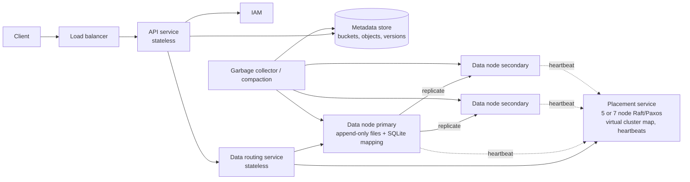
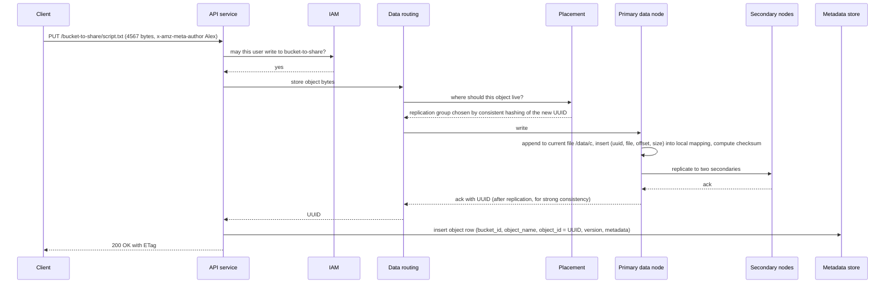

# 21 — Design S3-like Object Storage (Vol. 2, ch. 9)

*Written as I would talk through it in a design discussion, with the reasoning behind each choice.*

## 1. Problem statement

We are building an object storage service like Amazon S3: users create buckets, upload and download objects of
any size from bytes to gigabytes, keep versions, and list the objects in a bucket. We store a hundred petabytes
a year, promise six nines of durability and four nines of availability, and have to be storage-efficient
because cost is the product.

## 2. Scope

I'll design bucket creation, object upload and download, versioning and listing, with the deep work on the
data store: how bytes are placed and replicated, how small objects are packed on disk, how we reach six nines,
replication versus erasure coding, checksums, the metadata store and its sharding, multipart upload, and
garbage collection. Identity and access management is a dependency we call, not something we design. Lifecycle
tiers, cross-region replication and event notifications are follow-ups.

## 3. Functional requirements

Create a bucket with a globally unique name. Put an object by bucket and key with user metadata; get it back by
the same key; delete it. Keep versions when enabled, so a put creates a new version and a delete leaves a
marker. List objects in a bucket, optionally by prefix, which simulates folders in a flat namespace. Handle
objects from kilobytes to many gigabytes, the latter via multipart upload.

## 4. Non-functional requirements

Durability of six nines, meaning out of a million objects we may lose one per year, which forces replication
across failure domains and continuous integrity checking. Availability of four nines, about four minutes a
month, for the API. Storage efficiency, because at a hundred petabytes a year the difference between three
replicas and erasure coding is tens of petabytes of disk. Strong consistency on reads after writes, which the
real S3 has provided since 2020 and which simplifies every client. Performance is secondary: object storage
trades latency for durability, scale and cost; tens of milliseconds to first byte is fine, and throughput comes
from parallelism.

As an error budget, the four nines of availability are the budget, about four minutes a month of failed API
calls, spent by placement service outages and metadata shard failovers. Durability has no budget at all; a lost
object is an incident with a root cause.

## 5. Design tenets

Objects are immutable; you write a new version or delete, never update in place, which simplifies replication
and caching enormously. Separate metadata from data, like a file system's inode and blocks, so each scales on
its own. Pack small objects into large append-only files to avoid wasting disk blocks and inodes. Replicate
across failure domains, and use erasure coding where cost matters more than latency. Verify everything with
checksums, because disks corrupt silently. Make the placement service a small consensus cluster, because it is
the one component that must agree with itself.

## 6. Back-of-the-envelope estimation

The bottlenecks of object storage are disk capacity and I/O operations per second; a SATA disk does a hundred
to a hundred and fifty random seeks a second, so small-object workloads are IOPS-bound and large-object
workloads are capacity-bound.

Assume twenty percent of objects are small, under a megabyte, sixty percent are mid-sized between one and
sixty-four megabytes, and twenty percent are large. Using medians of half a megabyte, thirty-two megabytes and
two hundred megabytes, a hundred petabytes at forty percent utilisation holds about 680 million objects. At a
kilobyte of metadata each, that is about 0.68 terabytes of metadata, which is one database with replicas, but
sharded for throughput and growth.

Reads dominate: LinkedIn's research puts object storage at about ninety-five percent reads. So the data path is
tuned for reads and the write path for durability.

Replication at three copies is two hundred percent overhead, three hundred petabytes of disk for a hundred of
data; eight-plus-four erasure coding is fifty percent overhead, a hundred and fifty petabytes. That difference
is why erasure coding exists.

**The hard part** is durability at a cost that works: placing data across failure domains, choosing between
replication and erasure coding, packing small objects efficiently without creating lock contention, detecting
silent corruption, and garbage-collecting without ever deleting something still referenced. Second is the
metadata store, which must be sharded in a way that keeps lookups fast while listing stays possible.

## 7. System components and services

A load balancer fronts stateless API servers that validate requests, call identity and access management for
authorisation, and orchestrate metadata and data operations.

The identity and access management service is the central place for authentication and permissions.

The metadata store holds buckets and objects: name to object ID, version history, and listing data.

The data store has three parts. A data routing service, stateless, exposes a REST or gRPC API, asks the
placement service where to put or find an object, and reads and writes data nodes. The placement service
maintains the virtual cluster map, the physical topology, decides which nodes hold each object, and tracks node
health by heartbeat; it runs as a five- or seven-node Paxos or Raft cluster because it is critical. Data nodes
store bytes on local disks, replicate to peers, and run a daemon that heartbeats to placement with disk counts
and usage.

A garbage collector reclaims space from deleted objects, orphaned multipart parts and corrupted data by
compaction.

## 8. Architecture and flows




*Vector version: [21-s3-like-object-storage-1-architecture.svg](diagrams/21-s3-like-object-storage-1-architecture.svg)*





*Vector version: [21-s3-like-object-storage-2-flow.svg](diagrams/21-s3-like-object-storage-2-flow.svg)*


Narrated upload: the client puts an object. The API service checks with IAM that the user may write to the
bucket, then streams the bytes to the data routing service. Routing asks placement for the nodes, which are
chosen deterministically from the object's new UUID by consistent hashing over the cluster map, and writes to
the primary. The primary appends the object to its current large file, records where it landed in its local
mapping table, computes a checksum, replicates to two secondaries, and only when they acknowledge does it
return the UUID. The API service then writes the metadata row binding bucket and key to that UUID and returns
success. Download is the reverse: authorise, look up the UUID by bucket and key, fetch from a data node by UUID,
verify the checksum, stream back.

## 9. Communication between services

Client to API is HTTPS with the S3-style request shape. API to IAM is a synchronous call with a short cache of
decisions. API to metadata is synchronous and strongly consistent. API to data routing and routing to data
nodes are synchronous gRPC or REST streaming the bytes; the primary replicates to secondaries synchronously
before acknowledging, which costs latency and buys strong consistency and durability at write time. Placement
to data nodes is heartbeats, and routing's queries to placement are cached because the cluster map changes
rarely. Garbage collection and compaction run in the background with rate limits. Every synchronous hop carries a
timeout, and the API service keeps a circuit breaker per dependency, IAM, metadata and routing, so one slow
dependency produces fast, honest errors instead of a pile-up of waiting requests. For large objects, multipart
upload lets the client send parts in parallel and the service assemble them asynchronously.

## 10. Deep dives

### 10.1 Block, file and object storage

Block storage is raw devices, high performance, high cost, used for databases and virtual machines. File
storage adds directories and files on top. Object storage sacrifices performance for durability, scale and
cost: a flat namespace of immutable objects behind a REST API, aimed at binary and unstructured data, backups
and archives. Knowing which one a workload needs is half the design.

### 10.2 How data is organised on a node

Storing each object as its own file fails at scale: a four-kilobyte disk block is wasted on every tiny object,
and millions of files mean millions of inodes, which file systems handle badly and cap. Instead a node appends
objects into large files, a few gigabytes each, like a write-ahead log, rolling to a new file when one fills.
Appending to one file serialises writers across cores, so each core owns its own current file. To find an
object the node keeps a mapping of object ID to file name, offset and size. That mapping could live in a
shared database cluster, but every read would pay a network hop and the cluster would need heavy scaling; since
a node only cares about its own objects, we run a lightweight relational database, SQLite, on each node. The
access pattern is low write, high read, which suits a relational engine over a key-value one.

### 10.3 Durability: replication across failure domains, and erasure coding

Hardware fails, so we replicate; but a rack power failure or a datacenter event takes out many disks at once,
so replicas must sit in different failure domains: different racks, different zones, different networks. With
an annual disk failure rate around 0.81 percent, three copies in separate domains reach six nines.

Erasure coding is the alternative: split an object into data chunks and compute parity chunks so that any
subset of a certain size reconstructs the whole. With eight data and four parity chunks across twelve domains,
we survive four failures. The comparison, stated as a trade: replication costs two hundred percent overhead and
gives six nines with simple reads from one node; eight-plus-four erasure coding costs fifty percent overhead
and reaches eleven nines, but a read gathers chunks from eight nodes, so latency is higher, computing parity
costs CPU, and it is much harder to implement. I would use replication for latency-sensitive and hot data and
erasure coding for the cold majority, which is what real object stores do under the hood.

### 10.4 Correctness verification

A dead disk is obvious; a few flipped bits on a healthy disk are not. We store a checksum per object and per
file, verify on every read, and run a background scrubber that re-reads and verifies. With erasure coding each
of the eight chunks is checksummed and verified separately. A failed checksum marks the data corrupted, which
the garbage collector treats as garbage after a replica or reconstruction has replaced it.

### 10.5 The metadata store and sharding

The queries are: find an object ID by bucket and name; insert or delete by name; list objects in a bucket by
prefix. The bucket table is small because users are limited in how many buckets they can create, so it fits one
database with read replicas. The object table does not fit one node, so we shard. Sharding by bucket ID makes a
bucket with billions of objects a hotspot. Sharding by object ID spreads load but makes the name lookup a
scatter. Sharding by the hash of bucket name plus object name makes the common lookup a single-shard read,
which is what we pick, and we accept that listing becomes the slow path.

### 10.6 Listing, versioning, multipart and garbage collection

Listing by prefix on a sharded table means querying every shard and merging, and pagination across shards
with different result sizes is painful. Object stores are not optimised for listing, so we accept slower
listing, and if it matters we keep a denormalised listing table sharded by bucket ID so a list is one shard.

Versioning adds a time-based version UUID column; each new version is a new object ID, and a delete writes a
version with a marker so reads return not found while history remains.

Multipart upload: the client initiates and gets an upload ID, uploads parts independently and in parallel,
receives an ETag checksum per part, then sends a complete request listing part numbers and ETags; the store
assembles the object, which can take minutes for very large files, and old parts become garbage.

Garbage arises from lazy deletion, orphaned parts from abandoned uploads, and corrupted data. Because files are
append-only, reclaiming space means compaction: copy live objects from a file into a new one, update the
mapping table in a transaction, and drop the old file, done only when a file's dead fraction crosses a
threshold so we do not churn. With replication the collector acts on all copies; with erasure coding on all
twelve chunks.

### 10.7 Correctness and concurrency

Two puts to the same key race only at the metadata row; the metadata store's transactional write decides the
winner and, with versioning on, both are kept as versions. Multipart completion is idempotent by upload ID so a
retried complete does not assemble twice. Compaction updates the mapping atomically so a concurrent read sees
the old or new location, never neither. Placement is consensus-backed so two routers cannot disagree about
where an object lives. Checksums make a partial or corrupted replica detectable rather than silently served.

### 10.8 Failure modes

If a data node dies, reads go to another replica and placement schedules re-replication to restore the copy
count; with erasure coding the missing chunk is reconstructed. If the placement cluster loses quorum, no new
placements can be made and writes fail while reads continue from cached maps, which is why it is five or seven
nodes across zones and why the API returns a clear retryable error. If the metadata store shard fails over,
those keys are briefly unavailable, by our consistency choice. If IAM is slow, the API uses short-lived cached
decisions and fails closed on cache miss, because granting access by default is the wrong failure. If a disk
corrupts silently, the scrubber or a read checksum catches it and repairs from replicas. If a multipart upload
is abandoned, parts expire and the collector reclaims them. If a bucket has a billion objects, listing is slow
by design and the denormalised listing table bounds it.

## 11. API design

```
PUT    /{bucket}                                   create bucket (name globally unique)
PUT    /{bucket}/{key}   headers: Content-Type, Content-Length, x-amz-meta-*   -> 200, ETag
GET    /{bucket}/{key}[?versionId=]                -> bytes, metadata headers
DELETE /{bucket}/{key}                             -> delete marker when versioning is on
GET    /{bucket}?prefix=abc/&max-keys=1000&continuation-token=
POST   /{bucket}/{key}?uploads                     initiate multipart -> uploadId
PUT    /{bucket}/{key}?partNumber=N&uploadId=      -> ETag per part
POST   /{bucket}/{key}?uploadId=  body: parts with ETags   complete
PUT    /{bucket}?versioning   enable
```

## 12. Data model

```
bucket(bucket_id PK, bucket_name UNIQUE, owner_id, enable_versioning, created_at)
object(bucket_id, object_name, object_version timeuuid) PK, object_id UUID, size, checksum, user_metadata,
       is_delete_marker   -- sharded by hash(bucket_name, object_name)
object_listing(bucket_id, object_name) PK, latest object_id   -- denormalised, sharded by bucket_id
On each data node: object_mapping(object_id PK, file_name, file_offset, object_size, checksum)  -- SQLite
Placement: virtual cluster map {node_id, rack, zone, disks[], capacity, health}; object_id -> replication group
multipart_upload(upload_id PK, bucket, key, parts[{number, etag, object_id}], state, expires_at)
```

The queries are: object ID by bucket and key, which is the hot path; insert and delete by key; list by bucket
and prefix; mapping lookup by object ID on a node; and the collector's scans for dead objects per file.

## 13. Database choices

For the object metadata, the options were a relational database sharded by a chosen key, a wide-column store,
and a key-value store. The lookups are by exact key and the writes need transactions for versioning and
delete markers, so a sharded relational database or a strongly consistent wide-column store both fit; I'd pick
a relational database sharded by hash of bucket and object name for the exact-key path, with the listing table
sharded by bucket, giving up cheap cross-shard listing. For the bucket table, one relational database with
replicas. For the per-node mapping, SQLite on the node, because the pattern is read-heavy and local and a
network hop per read is the thing to avoid. For the cluster map and health, a Raft or Paxos cluster, because
placement must be consistent and is a single point of truth. Bytes live on the data nodes' local disks in
append-only files, not in any database.

## 14. Tools and technologies

Raft or Paxos for the placement cluster, five or seven nodes. Consistent hashing to map object IDs to
replication groups. SQLite for per-node mappings. Replication for hot data and eight-plus-four erasure coding for
cold data, with Reed-Solomon as the usual scheme. Checksums per object and file, MD5 or a faster CRC with a
cryptographic hash for ETags where S3 compatibility matters. A background scrubber. Compaction-based garbage
collection. gRPC between routing and data nodes for streaming efficiency.

## 15. Metrics and monitoring

API availability and p99 for put, get and list are the SLO indicators. Durability indicators: under-replicated
objects, chunks missing for erasure-coded objects, checksum failures per day from reads and from the scrubber,
and time to re-replicate after a node loss, all of which should be near zero and alarm when not. Capacity: disk
utilisation per node and per failure domain, and the garbage ratio per file driving compaction. Placement
cluster health and leader elections. Metadata shard latency and hot shards. Multipart uploads abandoned and
reclaimed. Alarms on any durability indicator, on availability, and on capacity above eighty percent.

## 16. Notification and logging

Every put, get and delete is logged with bucket, key hash, size, result and latency as an access log, which is
also a product feature for bucket owners. Checksum failures and re-replication events are logged with object
IDs and nodes for root-cause analysis. Durability events page the storage on-call immediately; capacity trends
open tickets. Bucket owners can subscribe to event notifications on object creation and deletion as a
follow-up feature.

## 17. CI/CD, cost, operations, and what comes next

API and routing services are stateless and roll gradually. Data node software rolls one failure domain at a
time so a bad build cannot touch all replicas of anything; placement nodes upgrade one at a time within quorum.
The on-disk file format and mapping schema are versioned and readable forever. Rollback is redeploying the
previous build the same way. Backups of the metadata store with point-in-time recovery, because losing metadata
orphans every object; the bytes are their own backup through replication and erasure coding, plus versioning
as the undo for user mistakes, and the scrubber as the ongoing integrity check.

Cost is disk, which is why erasure coding for cold data and compaction matter, then network for replication
and repair.

Regions: a bucket lives in one region with replicas across zones; cross-region replication is a follow-up
configured per bucket.

Ownership: the API and metadata, the data store with placement, and the integrity and garbage-collection
machinery are separate teams, with the routing API and the mapping format as contracts.

At ten times the scale we add data nodes and shards, move more data to erasure coding, and the next features
are storage classes with lifecycle transitions, cross-region replication, event notifications, object lock for
immutability, and server-side encryption with customer keys.
