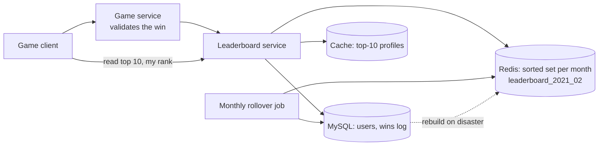
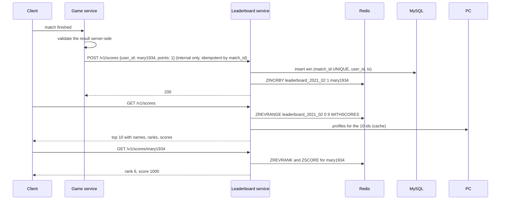

# 22 — Design a Real-time Gaming Leaderboard (Vol. 2, ch. 10)

*Written as I would talk through it in a design discussion, with the reasoning behind each choice.*

## 1. Problem statement

We are building the leaderboard for an online mobile game. A player earns a point for every match they win,
a new tournament and therefore a new leaderboard starts every month, every player is on it, and the product
wants to show the top ten, a player's own rank, and ideally the players just above and below them. It has to
be real time: a win shows up on the board immediately, not in a batch an hour later. The game has five
million daily and twenty-five million monthly active users, each playing about ten matches a day.

## 2. Scope

I'll design the score update path from the game servers, the leaderboard store that keeps players sorted, the
read APIs for top ten and rank, the monthly rollover, and how to scale if the game grows a hundredfold. I'll
compare a relational approach, Redis sorted sets and a NoSQL approach. Match validation and anti-cheat belong
to the game service and are out, as are prizes and social features.

## 3. Functional requirements

Record a point when a player wins. Show the top ten players with name, rank and score. Show a given player's
rank and score. As a bonus, show the four players above and below a given player. Players with equal scores
share a rank for now; tie-breaking is a follow-up.

## 4. Non-functional requirements

Real time: a score update must be visible on the next leaderboard read, which rules out any batch
recomputation. Scalability, availability and reliability in the general sense; concretely I'd target the read
APIs at 99.9% and a p99 under fifty milliseconds, because the leaderboard is a screen in the game, and the
write path at 99.95% because a lost win is a player complaint. Consistency: the leaderboard itself can be a
single authoritative in-memory structure, and I would rather it be slightly behind than wrong about a
player's score. Durability: the game's record of wins is the source of truth and must be durable; the
leaderboard is a derived structure we must be able to rebuild.

As an error budget, 99.9% on reads is about forty-three minutes a month, spent by Redis failovers and
replica lag; the write path's tighter budget is protected by the durable record of wins behind it.

## 5. Design tenets

Only game servers write scores; clients never do, because a client that can post its own score can cheat.
Keep the sorted structure in memory in a store built for sorted sets, because rank is a question relational
databases answer badly. Keep a durable record of every win in a database so the leaderboard can always be
rebuilt. One leaderboard per month, with old ones archived. Prefer managed and serverless pieces if the game is
new, because the traffic is small and bursty.

## 6. Back-of-the-envelope estimation

Five million daily users spread over a day is about fifty-eight players arriving per second on average; play
is uneven so peak is maybe five times that, around two hundred and fifty. At ten matches a day each, score
updates are about five hundred a second on average and twenty-five hundred at peak. Reads of the top ten, if
each user opens it once a day, are about fifty a second. These are small numbers; a single Redis instance
handles tens of thousands of sorted-set operations a second.

Storage: the worst case is all twenty-five million monthly users on the board. A twenty-four-character user ID
plus a two-byte score is twenty-six bytes, so about 650 megabytes, and even doubled for the skip-list overhead
it is well under two gigabytes. It fits one Redis node with room to spare. A best practice is to provision
twice the memory a write-heavy Redis node needs so snapshots have headroom.

**The hard part** is not scale at the stated numbers; it is picking a data structure where "what is my rank"
is cheap for twenty-five million players, and then knowing what breaks when the game grows a hundredfold: at
five hundred million users the board is sixty-five gigabytes and a quarter of a million updates a second, and
sharding a sorted structure while still answering rank is genuinely hard.

## 7. System components and services

Game clients talk to the game service, which runs or validates the match.

The game service, on a valid win, calls the leaderboard service to add a point. It is the only writer.

The leaderboard service exposes the score update and the read APIs and talks to the leaderboard store.

The leaderboard store is Redis holding one sorted set per monthly tournament.

A relational database holds user profiles, names and display data, and a durable log of wins with timestamps,
which is used both to show details and to rebuild the board after a disaster.

A small cache of the top ten players' profiles avoids repeated profile lookups for the hottest read.

A monthly job creates the new tournament's board and archives the previous one.

## 8. Architecture and flows




*Vector version: [22-real-time-gaming-leaderboard-1-architecture.svg](diagrams/22-real-time-gaming-leaderboard-1-architecture.svg)*





*Vector version: [22-real-time-gaming-leaderboard-2-flow.svg](diagrams/22-real-time-gaming-leaderboard-2-flow.svg)*


Narrated: a match ends and the game service confirms the result on the server, never trusting the client. It
calls the leaderboard service with the winner and the match ID. The service records the win in the database,
with the match ID unique so a retry cannot count twice, then increments the player's score in this month's
sorted set, which inserts them if they are new. Reading the top ten is a reverse range of the first ten
entries; reading a player's rank is a reverse rank lookup; both are logarithmic in the number of players.
Showing the neighbours is a reverse range around the player's rank.

## 9. Communication between services

Client to game service and client to leaderboard reads are synchronous HTTPS. Game service to leaderboard
service is a synchronous internal call, authenticated so only game servers can write; the alternative of
clients posting their own scores is rejected because a proxy in the middle could alter them. I considered a
message queue between the game service and the leaderboard, and I would add one if other services needed
match results, but nothing requires it yet, so I keep the path direct and simple. The leaderboard service
writes the durable win record before the Redis increment, so the source of truth is never behind the derived
structure. Reads go to Redis with a short timeout and fall back to a cached last-known top ten if Redis is
unavailable.

## 10. Deep dives

### 10.1 Why not a relational database

A table of user and score works at small scale: insert on first win, then increment. Top ten with an index on
score and a limit is fine. The problem is rank: for a player in the middle of twenty-five million, "how many
players have a higher score" is a count over the table or a correlated subquery, which is a scan every time
someone opens their profile. It does not scale to real-time rank for everyone. I'd also note the book's own
aside that a table per month is unnecessary; a month column does the same job.

### 10.2 Why Redis sorted sets

A sorted set keeps members ordered by score at all times, implemented as a hash map from member to score plus a
skip list from score to members. A skip list is a linked list with multi-level express lanes, so finding a
position is logarithmic rather than linear. The operations map exactly to our needs: increment a score and
insert if absent in log N; fetch a range by rank in log N plus the range size; fetch a member's rank in log N.
Scoring a point is one increment; top ten is one reverse range; my rank is one reverse rank; my neighbours is
a reverse range from my rank minus four to plus four. A new key per month gives us the monthly tournament for
free, and old keys are archived. We keep a replica and enable persistence so a crash does not lose the board,
and the win log in MySQL is the ultimate rebuild source.

### 10.3 Build it ourselves or on a cloud provider

If we run it ourselves, it is Redis for the board, MySQL for profiles and the win log, and a cache for profiles
if the database needs relief. If the game is new, the author's recommendation, which I share, is to go
serverless: an API gateway routing to functions that read and write a managed Redis and database, so there is
nothing to provision or scale for a workload that is small and bursty. The trade is less control over
performance tuning and cold-start latency against zero fleet management.

### 10.4 Scaling Redis to a hundred times the users

At five hundred million daily users the board needs about sixty-five gigabytes and takes two hundred and
fifty thousand updates a second, which forces sharding. Two ways.

Range partitioning by score: each shard holds a score band, say zero to a hundred, a hundred to two hundred,
and so on, and the application keeps a mapping of user to shard in a database or cache. Top ten is a query on
the highest band only. A player's rank is their rank within their shard plus the total count of all higher
shards, and a shard's count is a constant-time info call. The cost is that players move between shards as
their score crosses a boundary, which the application must handle, and bands must be chosen to balance load.

Hash partitioning with Redis Cluster spreads players across nodes by hash. It balances writes automatically,
but top ten requires fetching the top ten from every shard and merging, which gets slower as shards grow and
is worse for a large K, and there is no straightforward way to compute a player's global rank at all. For a
leaderboard, the author leans toward fixed range partitions, and so do I: the queries we care about are
exactly the ones hashing breaks. Benchmark with a tool like redis-benchmark before choosing band sizes.

### 10.5 The NoSQL alternative

A write-optimised NoSQL store like DynamoDB can hold the board with the month as partition key and the score
as sort key, which makes top ten a reverse query on the sort key. The latest month is then a hot partition, so
we write-shard by appending a partition number derived from the user ID, which spreads writes but turns reads
into scatter-gather across the partitions; more partitions means better writes and worse reads, and the right
number comes from benchmarking. The remaining weakness is the same as hash partitioning: an exact rank is hard.
At that scale a reasonable product compromise is a percentile instead of a rank, computed by a periodic job
over the score distribution, so a player sees "top 10 percent" rather than "rank 1,284,311".

### 10.6 Correctness and concurrency

The increment happens inside Redis, so concurrent wins for the same player never lose an update, which a read-
then-write in application code would. The win log has a unique match ID so a retried call from the game
service is idempotent and the increment is only issued after a successful insert. Ties share a rank by the
sorted set's semantics; if we break ties by most recent win, we encode the timestamp into the low bits of the
score so ordering stays inside Redis. The monthly rollover creates the new key before the month starts so no
win lands on a missing board.

### 10.7 Failure modes

If Redis crashes, the replica is promoted and persistence limits loss to seconds; if the whole cluster is
lost, a script replays the win log from MySQL to rebuild the board, and the leaderboard shows a "rebuilding"
state. If the game service retries a win after a timeout, the unique match ID stops double counting. If a
client tries to post its own score, the API refuses because only game servers are authorised. If the profile
database is slow, the top-ten profile cache serves the hot read and other lookups degrade gracefully. If the
monthly job fails, the service creates the key on first write as a fallback and alarms. If a shard boundary
in range partitioning is badly chosen and one shard is hot, we rebalance bands at the monthly rollover.

## 11. API design

```
POST /v1/scores              {user_id, points, match_id}      internal, game servers only
GET  /v1/scores              -> {data: [{user_id, user_name, rank, score} x 10], total: 10}
GET  /v1/scores/{user_id}    -> {user_info: {user_id, score, rank}}
GET  /v1/scores/{user_id}/neighbours?radius=4   (bonus)
```

## 12. Data model

```
Redis: leaderboard_{yyyy_mm}  sorted set, member = user_id, score = points (optionally with tie-break bits)
users(user_id PK, user_name, display_name, avatar, ...)
wins(match_id PK, user_id, tournament_month, won_at)        -- durable log, index on (tournament_month, user_id)
Cache: profile:{user_id} -> user object, for the top 10
```

The queries are: increment by user; top N by reverse range; rank by member; range around a rank; profile by
ID; and a replay of wins by month to rebuild.

## 13. Database choices

For the leaderboard itself, the options were a relational table with a score index, a Redis sorted set, and a
NoSQL table with score as sort key. The deciding query is rank for an arbitrary player in real time, which the
sorted set answers in logarithmic time and the others answer with scans or scatter-gather. I pick Redis, with
replication and persistence, and I give up effortless sharding, which I address with range partitions if the
game grows. For profiles and the win log, a relational database, because the data is small, relational and
needs the unique constraint on match ID. For the top-ten profiles, a small cache, Redis hash or in-process,
because the same ten users are read constantly.

## 14. Tools and technologies

Redis sorted sets as discussed. MySQL or Postgres for users and wins. A serverless API gateway and functions if
the game is new, or a small service fleet if we already run one. Redis replicas and persistence for recovery.
redis-benchmark for capacity decisions. A monthly scheduled job for rollover and archival to cold storage.

## 15. Metrics and monitoring

Score update rate and latency; read p99 for top ten and rank; Redis memory, operations per second, replication
lag and persistence status; the gap between the win log and the board, measured by a periodic count comparison,
which should be zero; rollover job success. Alarms on read p99 over a hundred milliseconds, Redis memory above
half the node with snapshots in mind, replication failure, and any count mismatch.

## 16. Notification and logging

Every score update is logged with match ID and user, which is the audit trail for disputes. Redis failover and
rebuilds page the on-call; a rollover failure opens a ticket if the on-first-write fallback is working. Players
are not notified by this system; the game shows the board.

## 17. CI/CD, cost, operations, and what comes next

The leaderboard service is stateless and deploys with a canary; Redis upgrades are replica-first then failover.
Rollback is redeploying the previous service version; the board itself needs no migration because it is a
single sorted set per month. Backups: MySQL with point-in-time recovery for the win log, which is the system's
real durability, with a drilled rebuild of Redis from it; Redis persistence is a convenience, not the backup.

Cost is tiny at the stated scale, a Redis node with a replica and a small database; at a hundredfold scale it
is the sharded Redis fleet.

Regions: a single region is correct because a tournament is global and needs one authoritative board; replicas
in other regions can serve reads with slight lag.

Ownership: the game team owns match validation; the platform team owns the leaderboard service and store.

At ten times the scale a single Redis node still suffices; at a hundred times we range-partition and
consider percentiles for rank. The next features are tie-breaking by last win, friends-only leaderboards,
which are small sorted sets per user, regional boards, and seasonal rewards computed at rollover.
