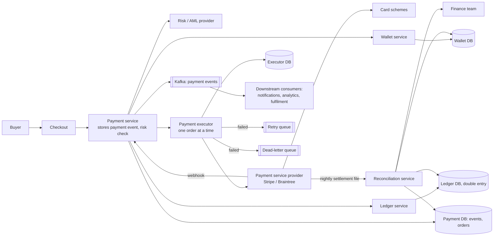
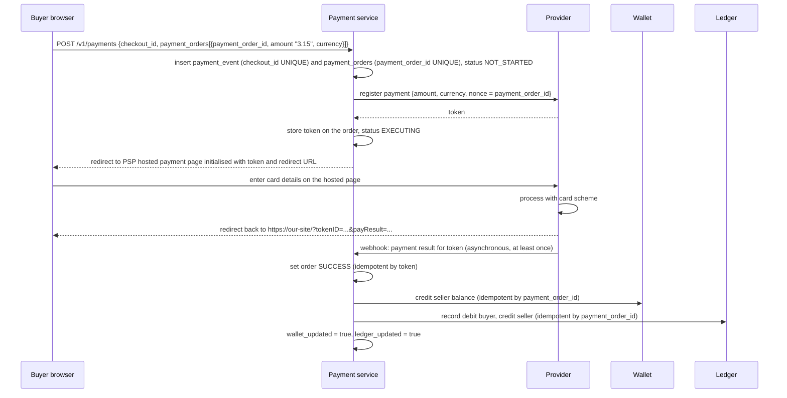

# 23 — Design a Payment System (Vol. 2, ch. 11)

*Written as I would talk through it in a design discussion, with the reasoning behind each choice.*

## 1. Problem statement

We are building the payment backend for an e-commerce platform like Amazon: everything to do with moving money.
Customers pay by card, which we process through a third-party payment service provider such as Stripe or
Braintree rather than touching card networks ourselves, and we never store card data because of compliance.
Sellers get paid out, say monthly. The platform is global but we assume one currency for the interview. A
million transactions a day. And the interviewer added the requirement that defines this design: we need
reconciliation to fix the inconsistencies that will arise between our systems and the outside world.

## 2. Scope

I'll design the pay-in flow, where we take money from buyers on behalf of sellers, and the pay-out flow, where
we send money to sellers, with a payment service, a payment executor, a double-entry ledger, a wallet, the
provider integration through a hosted payment page, webhooks, retries, idempotency, exactly-once processing,
reconciliation, and security. Currency exchange, local payment methods such as cash in India or Brazil, and
wallet integrations like Apple Pay are follow-ups I'll name.

## 3. Functional requirements

Pay-in: accept a checkout containing one or more payment orders, charge the buyer through the provider, credit
each seller's wallet, and record every movement in the ledger. Pay-out: transfer sellers' balances to their
bank accounts, through a payables provider such as Tipalti, with the bookkeeping that regulators require. Show
the status of a payment. Reconcile our records against the provider's settlement files every day and route
mismatches to the finance team.

## 4. Non-functional requirements

Reliability and fault tolerance above everything: a failed payment must be handled deliberately, never
dropped, never charged twice. Correctness is strong consistency for all money records; a wallet balance that is
eventually consistent is a wallet that shows the wrong number. Throughput is not the challenge: a million a
day is about ten a second, which any database handles, so the interview is about correctness, not scale.
Availability of 99.99% for accepting payments, because checkout down is revenue down, with the honest caveat
that we depend on an external provider whose availability bounds ours. Security and compliance: PCI scope
minimised by never holding card data, encryption in transit and at rest, and fraud controls.

As an error budget, the four nines on the accept path are about four minutes a month, spent by our database
and the provider's outages; the correctness budget is zero, and reconciliation is how we prove we met it.

## 5. Design tenets

Every money movement is recorded in a double-entry ledger, so the books always balance and every cent is
traceable. Every payment carries an idempotency key end to end, from the client to our database to the
provider, so retries can never double-charge. The payment state machine is explicit and persisted, and a
background job watches for anything stuck. Internal side effects of a payment happen asynchronously through
events, because a payment triggers many downstream actions and none of them should be able to fail the
payment. Reads and writes of money go to the primary database, not replicas, because replication lag is a
wrong balance. And reconcile every day against external truth, because communication with the outside world
will fail in ways we cannot see in real time.

## 6. Back-of-the-envelope estimation

A million transactions a day is about ten a second, perhaps fifty at a sales peak. A payment event with a few
orders is a few kilobytes, so storage is tens of gigabytes a year. The ledger gets two entries per movement
and a few movements per payment, so maybe ten million rows a day, still small. None of this stresses a single
relational primary. The numbers tell me to spend zero time on scaling and all of it on correctness, failure
handling and reconciliation.

**The hard part** is making money movement correct in a world where every call can fail or time out: achieving
exactly-once payment execution on top of retries, keeping four stateful systems, our payment service, the
ledger, the wallet and the external provider, consistent with each other, and detecting and fixing whatever
still goes wrong through reconciliation.

## 7. System components and services

The payment service accepts payment events from checkout, stores them, runs a risk check with a third-party
anti-money-laundering and fraud provider, and coordinates the rest.

The payment executor executes one payment order at a time against the provider and persists each order's
state.

The payment service provider moves money from the buyer's card account to our bank account and talks to the
card schemes, Visa and Mastercard; we integrate through its API or, preferably, its hosted payment page.

The ledger records every movement as double-entry bookkeeping.

The wallet keeps each seller's balance.

For pay-out, a similar set of components moves money from our bank account to sellers, often through a
payables provider.

A reconciliation service ingests the provider's nightly settlement file and compares it with our records,
and also compares our ledger against our wallet.

A retry queue and a dead-letter queue handle failed payments.

## 8. Architecture and flows




*Vector version: [23-payment-system-1-architecture.svg](diagrams/23-payment-system-1-architecture.svg)*





*Vector version: [23-payment-system-2-flow.svg](diagrams/23-payment-system-2-flow.svg)*


Narrated: the buyer places the order. The payment service stores the payment event and its orders with unique
IDs, then registers the payment with the provider using the order ID as the idempotency nonce and receives a
token. It stores the token and sends the buyer to the provider's hosted page, so card details never touch our
systems. The buyer pays there and is redirected back. Independently, the provider calls our webhook with the
result; we record success keyed by the token, credit the seller's wallet, write the two ledger entries, and
mark the order's wallet and ledger flags. A background job looks for orders that have been executing too long
and alerts.

## 9. Communication between services

Checkout to payment service is synchronous: the buyer is waiting for a redirect. Payment service to the risk
provider is synchronous with a tight timeout and a policy for what to do when it is unavailable. Payment
service to the provider is a synchronous registration call, then the hosted page handles the card, then the
result comes back asynchronously by webhook, which arrives at least once and must be handled idempotently; if
the provider lacks webhooks we poll its API. Internally, I'd avoid a long synchronous chain across payment,
ledger and wallet. Synchronous calls between many services make the request slow, let any one failure fail
the whole request, couple senders to receivers and give no buffer for spikes. Instead the payment service
publishes events to a topic and the ledger, wallet, notifications and analytics each consume them, the
multiple-receiver pattern, because one payment has several independent side effects. The trade is that
asynchronous communication gives up simplicity and immediate consistency for resilience and autonomy, and I
make the downstream updates idempotent and tracked by the flags on the order so the background job can see
what is incomplete. Failed executions go to a retry queue with exponential backoff and, after the limit, a
dead-letter queue for a human.

## 10. Deep dives

### 10.1 The double-entry ledger

Every movement is recorded against two accounts: one debited and one credited by the same amount, so the sum
of all entries is always zero and every cent is traceable from source to destination. A buyer paying a dollar
is a debit of a dollar to the buyer's account and a credit of a dollar to the seller's. This is accounting's
five-hundred-year-old answer to "where did the money go" and it is what auditors and reconciliation rely on.
Amounts are strings or fixed-point decimals, never floating point, because binary floating point cannot
represent most decimal fractions exactly.

### 10.2 Provider integration and the hosted page

Connecting directly to card schemes and banks is rare and only justified at enormous scale. With a provider
there are two integrations: through its API, which means we collect card details and fall under heavy PCI
obligations; or through a hosted payment page, where the provider's widget collects the card and we only ever
see a token. The hosted page is the right default because it keeps card data out of our systems entirely. The
flow is register the payment with a nonce, receive a token, show the hosted page initialised with the token and
redirect URLs, receive the buyer back, and record the result from the webhook.

### 10.3 Exactly once

Exactly once is at-least-once plus at-most-once. At-least-once comes from retries: on a failure we retry,
preferably with exponential backoff and honouring a Retry-After header, and we cancel when the error is
terminal or the attempt limit is reached. At-most-once comes from idempotency. The client sends an idempotency
key, a UUID, with the request; we insert a row with that key under a unique constraint; if the insert fails
because the row exists, we return the existing result rather than processing again. The same key is the nonce
we pass to the provider, which refuses to process the same nonce twice. The two double-charge scenarios this
prevents are a buyer clicking pay twice, and a payment the provider processed whose downstream ledger or
wallet update failed, so a naive retry would charge again.

### 10.4 Reconciliation

The happy path is a fraction of the design. Every night the provider sends a settlement file listing what it
actually moved; the reconciliation service compares it line by line with our payment orders, and separately
compares our ledger with our wallet balances. Mismatches fall into three classes: known patterns adjusted by a
standard automated procedure; known patterns that need a human to adjust; and unknown ones that need
investigation. The finance team owns the queue. This is not a nice-to-have; it is how a payment system knows
it is correct.

### 10.5 Delays, failures and consistency

Payments usually complete in seconds but can take hours when a transaction is flagged for manual risk review
or when the card requires 3-D Secure authentication. We handle that by waiting for the webhook or polling,
showing the buyer a pending status with a page to check back on, and emailing when it completes. Failed
payments are handled by the persisted state, which tells us whether to retry or refund; the retry queue; and
the dead-letter queue for terminal failures with tooling to inspect them. Consistency across the four
stateful systems comes from exactly-once processing plus reconciliation. For our own databases, I serve reads
and writes of money from the primary and use replicas only for failover, because replication lag would show a
buyer or seller a wrong balance; a consensus-replicated database such as CockroachDB or YugabyteDB is the
alternative that keeps replicas in step.

### 10.6 Security

HTTPS everywhere against eavesdropping; encryption and integrity monitoring against tampering; certificate
pinning against man-in-the-middle; multi-region replication and snapshots against data loss; rate limiting
and a firewall against denial of service; tokens instead of card numbers against card theft; PCI compliance
scoped down by the hosted page; and fraud controls such as address verification, card verification codes and
behavioural analysis.

### 10.7 Failure modes

If the provider is down, registration fails and checkout shows a retryable error; nothing has been charged. If
the webhook never arrives, the background job notices an order executing too long and polls the provider's
API. If the webhook arrives twice, the idempotent update by token makes the second a no-op. If the wallet or
ledger update fails after the provider succeeded, the flags on the order stay false, the retry queue replays the
update idempotently, and reconciliation catches anything that still slipped. If our database primary fails, we
promote a replica with synchronous replication so no acknowledged payment is lost, and checkout is briefly
unavailable, which is preferable to a lost record. If the risk provider is down, we fail closed for high-value
orders and allow low-value ones with an asynchronous re-check, a policy agreed in advance. If a buyer double-
clicks, the idempotency key returns the first result. If a settlement file is late or malformed, reconciliation
alarms and finance is told the day is unreconciled.

## 11. API design

```
POST /v1/payments   headers: Idempotency-Key
  body {buyer_info, checkout_id, payment_orders: [{seller_account, amount: "3.15", currency: "USD",
        payment_order_id}]}
  -> 201 {checkout_id, orders: [{payment_order_id, status}], redirect_url to hosted page}
GET  /v1/payments/{payment_order_id}   -> {status: NOT_STARTED | EXECUTING | SUCCESS | FAILED, ...}
POST /v1/webhooks/psp                  provider result, signature-verified, idempotent by token
POST /v1/payouts                       {seller_account, amount, currency, payout_id}
```

Amounts are strings because doubles cannot represent money exactly. The payment order ID is the idempotency
key forwarded to the provider.

## 12. Data model

```
payment_event(checkout_id PK, buyer_info, seller_info, credit_card_info (token only), is_payment_done)
payment_order(payment_order_id PK, checkout_id FK, buyer_account, amount DECIMAL as string, currency,
              payment_order_status (NOT_STARTED, EXECUTING, SUCCESS, FAILED), psp_token, ledger_updated,
              wallet_updated, created_at, updated_at)
ledger_entry(entry_id PK, payment_order_id, account_id, debit DECIMAL, credit DECIMAL, created_at)
   -- two entries per movement, sum of all debits equals sum of all credits
wallet(account_id PK, balance DECIMAL, version)
payout(payout_id PK, seller_account, amount, currency, status, provider_ref)
reconciliation_run(date PK, matched, auto_adjusted, manual_adjusted, unresolved)
```

The queries are: insert event and orders with unique constraints; update order status by ID or by token; append
ledger entries; update a wallet balance with a version check; find orders executing longer than a threshold;
join settlement rows to orders by ID for reconciliation.

## 13. Database choices

For every money table the criteria are strong consistency and ACID transactions, a proven record at financial
institutions, a deep pool of administrators to hire, and rich tooling. That is a traditional relational
database over NoSQL or NewSQL, and performance is irrelevant at ten transactions a second. I pick Postgres or
MySQL with synchronous replication for failover, reads from the primary, and I give up horizontal scale I will
never need. If multi-region strong consistency became a requirement, a consensus-based SQL database such as
CockroachDB is the upgrade path. The ledger is append-only in the same relational store, partitioned by month
for archival. Events between services go through Kafka because several consumers need each payment event and
replay matters for recovery.

## 14. Tools and technologies

A provider such as Stripe or Braintree through its hosted payment page, and a payables provider such as
Tipalti for pay-outs. A risk and anti-money-laundering provider for the synchronous check. Kafka for payment
events to multiple consumers. Exponential backoff with Retry-After for retries, and a dead-letter queue. Unique
constraints for idempotency on our side and nonces on the provider's. Decimal types or strings for amounts.
Certificate pinning, HTTPS and tokenisation for security. A reconciliation job consuming the provider's
settlement file format.

## 15. Metrics and monitoring

Payment success, failure and pending rates, by failure reason and by provider response code; time from
registration to webhook, with an alarm on orders executing beyond the expected window; webhook delivery
delay and duplicate rate; retry and dead-letter counts, with any dead-letter item alarmed; wallet and ledger
update lag behind provider success; reconciliation results each night, with unresolved mismatches as an
incident; provider and risk service latency and error rates; database primary health and failover events.

## 16. Notification and logging

Every state transition of every order is logged with the idempotency key, provider token and timestamps, and
retained for years because audits require it; card data is never logged. Buyers get emails on completion of a
delayed payment and on failure. Finance gets the nightly reconciliation report and the manual-adjustment queue.
Engineering is paged for provider outages, stuck payments beyond threshold, and any dead-letter arrival.
Debugging tooling that shows the full timeline of a payment is part of the system, not an afterthought.

## 17. CI/CD, cost, operations, and what comes next

Changes to the payment path deploy behind flags with a small canary of real traffic and a shadow comparison
against the previous version; rollback is the flag. Provider integrations are tested against sandboxes with
the full webhook flow, and contract tests pin the webhook schema. Schema changes are additive. Backups: the
payment, ledger and wallet databases have point-in-time recovery with a recovery point of seconds given
synchronous replication and a recovery time under an hour, restores are drilled, and backups are immutable in
a separate account, because this is money.

Cost is provider fees, by far, then compliance and the small database and service footprint.

Regions: a primary region with synchronous or near-synchronous replicas for failover; buyers worldwide pay the
cross-region latency on checkout, which is acceptable against the alternative of multi-region write conflicts
over money.

Ownership: payments, ledger, wallet and reconciliation are separate services, with finance owning the
reconciliation rules and the adjustment queue.

At ten times the scale nothing architectural changes at a hundred transactions a second. The next features are
multiple currencies with exchange, regional payment methods including cash and local wallets, Apple Pay and
Google Pay, subscription billing, and richer fraud modelling.
