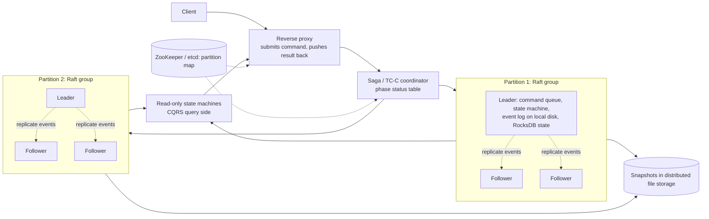
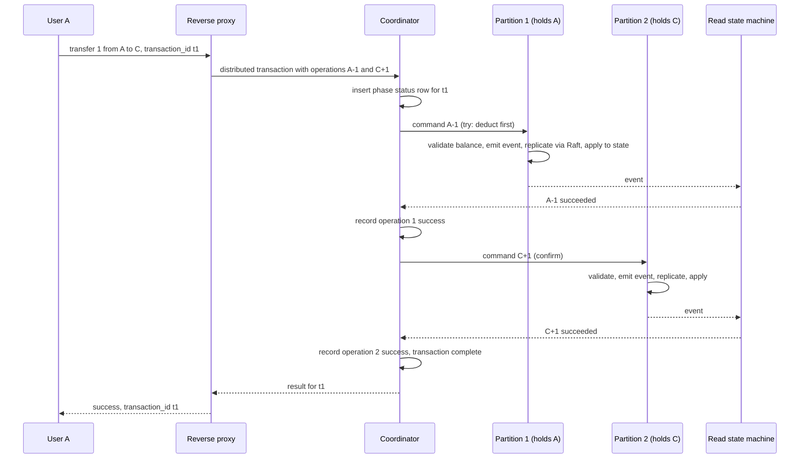

# 24 — Design a Digital Wallet (Vol. 2, ch. 12)

*Written as I would talk through it in a design discussion, with the reasoning behind each choice.*

## 1. Problem statement

We are building the wallet service inside a payment platform: users hold a balance and transfer money to each
other's wallets, which is faster and cheaper than going through card networks. The interviewer narrowed it to
balance transfers between wallets, at a million transactions a second, with transactional guarantees, 99.99%
availability, and one requirement that shapes everything: we must be able to reproduce the history, replaying
from the beginning to reconstruct any balance at any time, because reconciliation only tells us that something
is wrong, not why. Foreign exchange is out.

## 2. Scope

I'll build the transfer API and work through the evolution the problem demands: a sharded in-memory store that
cannot do atomic transfers, distributed transactions over sharded relational databases with two-phase commit,
Try-Confirm/Cancel and sagas, then event sourcing for reproducibility, then the performance work to make event
sourcing hit a million transactions a second with local storage and Raft replication, then partitioning into
many Raft groups coordinated by a distributed transaction. Deposits and withdrawals through external rails,
fraud, and limits are follow-ups.

## 3. Functional requirements

Transfer an amount from one wallet to another, atomically: either both balances change or neither does, and a
balance never goes negative. Expose the result of a transfer by its transaction ID. Reconstruct the balance of
any account at any point in time, and prove that the current balances are correct and that a code change did
not change results.

## 4. Non-functional requirements

A million transfers a second, which with two legs per transfer is two million balance updates a second, and
that is the number that pushes us away from a plain relational cluster. Availability of 99.99%. Transactional
correctness: a transfer is all-or-nothing and the two accounts never disagree in a way a user can exploit.
Reproducibility: an immutable, ordered record of what happened, and deterministic logic to replay it. Latency
should be low for the user, but I'd state that a transfer completing in a second or two with a clear
in-progress status is acceptable, which opens the door to asynchronous processing.

As an error budget, four nines is about four minutes a month of transfers failing to be accepted; Raft leader
elections and coordinator failovers are what spend it, so those are alarmed. Correctness has no budget, and
replay is how we prove it.

## 5. Design tenets

Money needs atomicity, so a design that cannot make both legs of a transfer succeed or fail together is
disqualified no matter how fast it is. Record facts, not just state: an append-only log of events is the
source of truth and balances are derived from it. Keep the state machine deterministic so replay always
produces the same answer. Always deduct before adding, so an in-flight transfer can never create spendable money
out of thin air. Replicate the one thing that cannot be regenerated, the event log, with consensus. And
partition only when one consensus group runs out of capacity, then coordinate across partitions with a
compensating protocol.

## 6. Back-of-the-envelope estimation

A relational database node in the cloud handles roughly a thousand transactions a second. Two million balance
updates a second would need two thousand nodes, which is operationally absurd. The table that frames the design
goal: at a hundred updates a second per node we need twenty thousand nodes, at a thousand we need two thousand,
at ten thousand we need two hundred. So the whole deep dive is about raising per-node throughput so the node
count becomes sane, which is why we end up with local append-only logs, memory-mapped files and an embedded
log-structured store rather than a networked database per operation.

**The hard part** is three things stacked: atomic transfers across partitions, since one node cannot hold all
accounts; reproducibility, which forces event sourcing; and throughput, which forces every hop in the event-
sourcing path to be local and sequential while remaining durable through replication.

## 7. System components and services

Clients call a wallet API with a transfer request carrying a transaction ID as the idempotency key.

A reverse proxy accepts the command on the user's behalf, submits it, and receives the result when it is
ready, so the user does not poll.

A coordinator, running a Try-Confirm/Cancel or saga protocol, breaks a transfer into per-partition commands and
tracks their status in a phase status table.

Each partition is a Raft group: a leader and followers holding the same ordered event log. Within a node, a
command queue, a deterministic state machine that validates commands and emits events, an event log on local
disk, and a state store holding balances.

Read-only state machines consume the event log and serve balance queries and push results back to the proxy,
which is the CQRS split.

Snapshots of state are taken periodically to distributed file storage so replay need not start from zero.

A configuration store, ZooKeeper or etcd, holds partition membership and addresses.

## 8. Architecture and flows




*Vector version: [24-digital-wallet-1-architecture.svg](diagrams/24-digital-wallet-1-architecture.svg)*





*Vector version: [24-digital-wallet-2-flow.svg](diagrams/24-digital-wallet-2-flow.svg)*


Narrated: the user asks to send a dollar from A to C. The proxy hands the request to the coordinator, which
records the transaction in its phase status table and works out which partitions hold A and C. It sends the
deduction to A's partition first. That partition's Raft leader validates that A has the balance, turns the
command into an event, replicates the event to its followers, applies it to A's balance, and the read-side
state machine pushes the result back to the coordinator. The coordinator records success and sends the credit
to C's partition, which does the same. When both are recorded, the coordinator reports success through the
proxy. If the deduction failed, nothing else happens; if the credit failed, the coordinator issues a
compensating credit back to A.

## 9. Communication between services

Client to proxy is a synchronous request from the user's point of view, but internally the proxy submits a
command and waits for a pushed result, which is what makes the CQRS design feel real time without clients
polling the query side and overloading it. Coordinator to partitions is asynchronous command submission with
results pushed back from the read-side state machines, with a timeout per operation after which the coordinator
retries with the same transaction ID or moves to cancel; a breaker per partition stops it flooding a partition
that is mid-election. Within a partition, the state machine reads from a local
command queue and writes to a local event log, both on local disk via memory-mapped files rather than over a
network, because network round trips are what cap throughput. Replication within a Raft group is the
consensus protocol's own synchronous append to a majority before an event is committed. Snapshots are written
asynchronously. Partition membership comes from the configuration store.

## 10. Deep dives

### 10.1 Why the simple designs fail

The first idea is a map from account to balance in Redis, partitioned across nodes by hashing the account, with
ZooKeeper holding the partition map and a stateless wallet service in front. It scales, and it cannot execute a
transfer atomically when the two accounts are on different nodes, so it fails the correctness requirement.

The second idea is sharded relational databases with two-phase commit: the coordinator writes to both, asks
both to prepare, and commits only if both say yes. It is correct, but it holds locks across the network while
waiting, so throughput collapses under contention, and the coordinator is a single point of failure whose
crash leaves participants blocked.

### 10.2 Try-Confirm/Cancel and sagas

Try-Confirm/Cancel is two-phase commit's cousin that uses compensation instead of held locks. In the try phase
the coordinator asks A's database to deduct a dollar in a local, committed transaction and asks C's database
to do nothing. If the try succeeds, the confirm phase tells C's database to add a dollar; if it fails, the
cancel phase tells A's database to add the dollar back. The difference from two-phase commit is that each phase
is a complete, committed local transaction, so no locks are held between phases; the price is that the
compensation logic lives in the application, and that there is a visible window where A has been debited and C
not yet credited. That window is safe only because we always deduct before adding: the invalid orderings are
adding to C first, which would let C spend money that A still has, or doing both in the try phase, which
cannot be made atomic across databases. The coordinator keeps a phase status table recording the transaction,
whether the try was sent and answered, which second phase applies, and its status, so a coordinator that
crashes mid-flight can resume. One edge case is out-of-order delivery, where a cancel reaches a database before
its try; an out-of-order flag in the status table makes a late try fail instead of deducting after the cancel.

A saga orders the operations in a sequence, runs them one after another, and on failure runs compensations
backwards. It can be choreographed, where each service reacts to events, or orchestrated by a coordinator;
for a wallet, orchestration is preferred because choreography scatters the business logic. Compared with Try-
Confirm/Cancel, a saga is linear while TC/C can run its operations in parallel, so when latency matters, TC/C
wins; both show a partial state in flight and both put the logic in the application.

### 10.3 Event sourcing for reproducibility

Auditors ask three questions: what was the balance at a given time, how do we know balances are correct, and
how do we prove a code change did not change results. Event sourcing answers all three. A command is an
intention from the outside, like "transfer a dollar from A to B"; commands can fail and can involve randomness
or external input, so they go into a FIFO queue with a global order. An event is a fact that happened inside
the system, like "transferred a dollar from A to B"; events are immutable and also ordered. State is what the
events produced, the account balances. The state machine validates commands, emits events, and applies them to
state, and it must be deterministic: no external I/O, no randomness. The state machine reads commands, reads
the current state, validates, emits the events for each account, then applies each event by updating the
balance. Because the event list is immutable and the state machine is deterministic, replaying from the start
reconstructs any intermediate state; a balance at time T is a replay up to T; correctness is a full replay
compared against the current state; and a code change is verified by running both versions against the same
events. Queries about balances are served by separate read-only state machines consuming the same events,
which is the CQRS pattern.

### 10.4 Making event sourcing fast

Writing commands and events to an external queue and database costs a network round trip per hop and caps
throughput. So we store the command and event lists on local disk, where appends are sequential and fast even
on spinning disks, and we cache the recent tail in memory; memory-mapped files give us both at once. State moves
to a local embedded store: SQLite would work, but RocksDB's log-structured merge tree is optimised for writes,
which is our pattern, with caching for reads. Periodic snapshots of state go to distributed file storage so
replay starts from the latest snapshot rather than from the beginning.

### 10.5 Making it reliable again

All of that made the node stateful and a single point of failure, so we ask what actually needs high
reliability. State and snapshots can be regenerated from events. Events cannot be regenerated from commands,
because commands are non-deterministic. So the event list is the one thing that must never be lost or
reordered, and we replicate it with Raft: a leader accepts writes, followers replicate, a majority must
acknowledge before an event is committed, and a new leader is elected if the leader dies. Every node in the
group applies the same event list and therefore holds the same state.

### 10.6 Partitioning and the final shape

One Raft group has finite capacity, so we shard accounts across many groups, and a transfer across groups is a
distributed transaction coordinated by TC/C or a saga as above. The CQRS query side is slow if clients poll, so
the reverse proxy submits on their behalf and the read-side state machines push results back to it, giving
users a real-time feel without polling load. That is the final design: a proxy, a coordinator with a phase
status table, many Raft-replicated event-sourced partitions, read-side state machines, snapshots, and a
configuration store.

### 10.7 Correctness and concurrency

The transaction ID is the idempotency key at every layer: the coordinator ignores a repeated transfer, and each
partition ignores a repeated command. Deduct-before-add prevents an exploitable intermediate state. Validation
inside the state machine rejects a deduction that would go negative. Raft guarantees every replica sees the
same ordered events. The phase status table lets a recovered coordinator finish or compensate every in-flight
transaction exactly once. Determinism of the state machine is enforced by code review and by replay tests.

### 10.8 Failure modes

If the coordinator crashes, a replacement reads the phase status table and resumes each transaction from its
recorded phase, cancelling tries that never confirmed. If a partition leader dies, Raft elects a follower in
seconds and no committed event is lost; in-flight commands are retried by the coordinator with the same IDs. If
a partition is unreachable for longer, transfers touching it fail and are cancelled, while other partitions
keep working. If a try succeeds but the confirm cannot be delivered, the coordinator retries the confirm until it
succeeds or decides to cancel, and the status table makes the decision durable. If a cancel arrives before its
try, the out-of-order flag blocks the late try. If a replay after a code change produces different balances,
that is a bug caught before release. If snapshots are lost, replay runs from the beginning, which is slow but
correct. If the proxy loses the push, the client can query the transaction by ID.

## 11. API design

```
POST /v1/wallet/balance_transfer
  body {from_account, to_account, amount: "1.00", currency, transaction_id}   transaction_id is the idempotency key
  -> {status: success | failed | in_progress, transaction_id}
GET  /v1/wallet/transactions/{transaction_id}   -> status and phases
GET  /v1/wallet/accounts/{account_id}/balance?as_of=<timestamp>   served by the read side, replayable
```

Amounts are strings to avoid floating-point loss.

## 12. Data model

```
command log (per partition, local, append-only): {transaction_id, op, account, amount, received_at}
event log (per partition, Raft-replicated, append-only): {event_id, transaction_id, account, delta, applied_at}
state (per partition, RocksDB): account_id -> balance
snapshot (distributed file storage): {partition, event_offset, serialized state}
phase_status(transaction_id PK, content, try_status (not_sent, sent, answered), second_phase (confirm|cancel),
             second_phase_status, out_of_order_flag, updated_at)
partition map (ZooKeeper / etcd): account hash range -> raft group members
```

The queries are: append command; read next command; read and update a balance; append event; read events from
an offset for replay; point reads and updates of phase status; map an account to its partition.

## 13. Database choices

For balances inside a partition the options were a networked relational database, SQLite, and RocksDB. The
pattern is extremely write-heavy local updates, so RocksDB's log-structured engine wins, giving up SQL I do not
need. For the event log, a local append-only file replicated by Raft, because durability with ordering is the
requirement and a general database adds nothing; I give up external queryability, which the read side provides.
For the command log, a local append-only file; Kafka was the first version and lost on network latency. For
snapshots, distributed file storage such as HDFS or object storage, because they are large binaries read rarely.
For the phase status table, a replicated relational database or the coordinator's own Raft group, because
coordinator recovery depends on it and it is small. For the partition map, ZooKeeper or etcd for consistency
and watches. The in-memory Redis version was rejected for lacking atomic transfers and durability.

## 14. Tools and technologies

Raft for replicating event logs, and for the coordinator's own state. RocksDB for state. Memory-mapped append-
only files for logs. Try-Confirm/Cancel when latency matters because it parallelises, orchestrated sagas when
simplicity matters more; both are compensating protocols, and two-phase commit is rejected for lock
contention and coordinator fragility. CQRS with read-only state machines and a reverse proxy that receives
pushed results. HDFS or object storage for snapshots. ZooKeeper or etcd for the partition map.

## 15. Metrics and monitoring

Transfers per second accepted and completed, and end-to-end latency. In-flight transactions by phase and their
age, with an alarm on anything stuck beyond a threshold, which is the coordinator's health. Raft leader
elections per group and replication lag between leader and followers. Event-log append latency and command
queue depth per partition, which is throughput headroom. Snapshot age per partition, because it bounds replay
time. Read-side lag behind the event log, which is how stale a balance query can be. Replay verification
results from a periodic job that rebuilds a sample of accounts from events and compares; a mismatch is an
incident. Alarms on stuck transactions, election storms, append latency, and verification failures.

## 16. Notification and logging

The event log is the audit log, immutable and replayable, which is the point of the design. Operational logs
record coordinator decisions per transaction and Raft events per group. Users see transfer status in the app
and can be notified through the notification platform on completion of a delayed transfer. Stuck transactions
and verification mismatches page the on-call; compliance receives replay-based reports.

## 17. CI/CD, cost, operations, and what comes next

State machine changes are validated by replaying the full event history, or a sampled one plus snapshots, with
the old and new versions and diffing the resulting balances; a difference blocks the release. Partitions roll
out one Raft group at a time, followers first, then a leadership transfer, so there is no write outage;
rollback is the same process with the previous build. Coordinator and proxy deploy as stateless services behind
the status table. Backups are the replicated event logs plus snapshots in distributed storage; recovery point is
zero for committed events because Raft commits to a majority, and recovery time is the replay from the latest
snapshot, which the snapshot cadence bounds.

Cost is the partition fleet, three nodes per group on fast disks, then snapshot storage; raising per-node
throughput, which this whole design is about, is the cost lever.

Regions: a Raft group spans zones within a region for latency; cross-region is a follow-up with per-account
home regions.

Ownership: the wallet core, the coordinator, the query side and the audit tooling are separate teams, with the
command and event schemas as contracts.

At ten times the scale we add Raft groups and re-split hot account ranges. The next features are deposits and
withdrawals through the payment system, spending limits and holds, multi-currency, and cross-region partitions.
