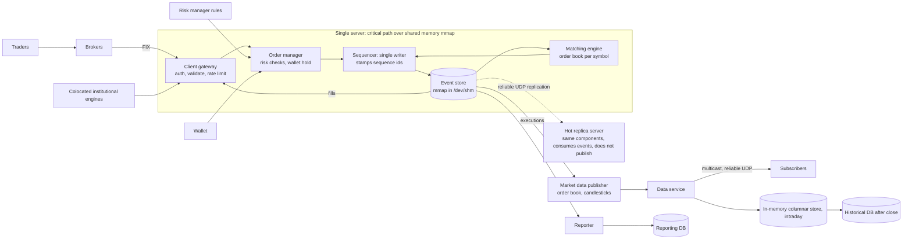
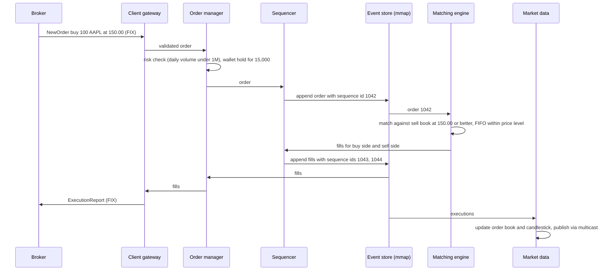

# 25 — Design a Stock Exchange (Vol. 2, ch. 13)

*Written as I would talk through it in a design discussion, with the reasoning behind each choice.*

## 1. Problem statement

We are building an electronic stock exchange whose job is to match buyers and sellers efficiently and fairly.
Stocks only, limit orders only, place and cancel, normal trading hours. Clients, through brokers, place and
cancel orders, receive their fills in real time, and see the order book in real time. The scale is tens of
thousands of concurrent traders, about a hundred symbols, and billions of orders a day, with simple risk checks
such as a daily volume cap per user and a wallet check that holds funds for pending orders.

## 2. Scope

I'll design the trading flow, which is the critical path: client gateway, order manager with risk and wallet
checks, sequencer, matching engine and the fills back out; the market data flow that builds order books and
candlestick charts for subscribers; and the reporting flow for history, tax and compliance. I'll go deep on
the order book data structure, the matching algorithm, why exchanges run on one big server with shared-memory
event stores, determinism through sequencing, event sourcing, high availability with hot replicas and Raft,
fair market data distribution over multicast, colocation and network security. Market orders, after-hours
trading, options and futures, and settlement are out.

## 3. Functional requirements

Accept a limit order to buy or sell a quantity of a symbol at a price; cancel an open order. Match orders and
emit two executions, called fills, per match, one for each side, in a deterministic order. Deliver fills to
clients in real time. Publish level-two order book and candlestick market data in real time. Enforce risk rules
such as a user may trade at most a million shares of a symbol per day. Check and withhold wallet funds for
pending orders until they finalise. Record everything for reporting.

## 4. Non-functional requirements

Availability of at least 99.99%, because downtime damages the exchange's reputation and that is only about
eight and a half seconds a day. Fault tolerance with fast recovery to bound the impact of any incident.
Latency in the millisecond round trip, and the focus is the 99th percentile, because a persistently slow tail
is a terrible experience for the traders who hit it; inside the matching path we are aiming at tens of
microseconds. Security: account management, know-your-customer identity verification for compliance, and
protection of the public surfaces against denial of service. Fairness: every market data subscriber receives
the same data at the same time, because a head start is an advantage that can be used to manipulate the market.
Determinism: the same input sequence must always produce the same matches, because that is what makes replay
and failover correct.

As an error budget, four nines is eight and a half seconds a day. Failover time is what spends it, so failover
must be automated and measured in sub-second terms; a manual failover would blow the budget in one incident.

## 5. Design tenets

Keep the critical path tiny: gateway, order manager, sequencer, matching engine, and nothing else, not even
logging inline. Make matching deterministic by stamping every inbound order and outbound fill with a sequence
number from a single writer. Put the whole critical path on one machine and communicate through shared memory,
because network hops cost tens of microseconds each and we have a budget of tens of microseconds total. Use
event sourcing so state is a replay of an immutable event log, which gives recovery, audit and exactly-once for
free. Run hot replicas that consume the same events and can take over without rebuilding state. Distribute
market data by multicast so fairness is a property of the network, not a promise.

## 6. Back-of-the-envelope estimation

A billion orders a day over six and a half trading hours, 9:30 to 16:00, is about 43,000 orders a second on
average, and five times that at the open and close, about 215,000 a second. A hundred symbols means each
symbol's order book sees a few thousand updates a second on average. An order is a few hundred bytes, so the
inbound stream is tens of megabytes a second, which a single machine's memory bandwidth handles with ease. The
event log for a day is a billion orders plus fills, a few hundred gigabytes, which fits in memory-mapped
files on fast storage and is replicated for safety.

**The hard part** is latency and determinism together: achieving tens of microseconds on the matching path,
which rules out networks, disks, locks and garbage collection on that path, while guaranteeing that every
replica produces exactly the same matches so a failover is seamless, and distributing results to thousands of
subscribers fairly.

## 7. System components and services

Brokers mediate between traders and the exchange; institutional clients connect through their own
low-latency software, often colocated in our data centre.

The client gateway authenticates, validates, rate-limits and normalises inbound orders, speaking the FIX
protocol to the outside world, and returns fills. It is on the critical path so it stays lightweight.

The order manager keeps order state, runs risk checks against rules from the risk manager, checks and
withholds wallet funds, and forwards only the fields the matching engine needs. Its state management is
event-sourced.

The sequencer is a single writer that stamps every inbound order and outbound fill with a monotonically
increasing sequence ID and appends them to the event store, giving timeliness, fairness, replay and exactly-
once.

The matching engine, also called the cross engine, maintains an order book per symbol, matches orders, emits
fills in deterministic order, and feeds the execution stream to market data.

The market data publisher rebuilds order books and candlestick charts from the fill stream and sends them to
the data service, which serves subscribers; an in-memory columnar store holds intraday analytics and a
historical database stores it after close.

The reporter collects the fields needed for trading history, tax, compliance and settlement and writes them to
a database, off the critical path.

A hot replica of the whole critical path consumes the same event stream and stands ready to take over.

## 8. Architecture and flows




*Vector version: [25-stock-exchange-1-architecture.svg](diagrams/25-stock-exchange-1-architecture.svg)*





*Vector version: [25-stock-exchange-2-flow.svg](diagrams/25-stock-exchange-2-flow.svg)*


Narrated: a broker sends a buy order over FIX. The gateway validates and authenticates it and passes it to the
order manager, which checks the trader has not exceeded the daily volume limit, checks the wallet has enough
funds and holds them, and passes the order to the sequencer. The sequencer stamps it with the next sequence
number and appends it to the shared-memory event store. The matching engine reads it, finds resting sell orders
at or below the price, matches first-in-first-out within each price level, and emits a fill for each side back
through the sequencer, which stamps and appends them. The order manager and gateway read the fills from the
store and the broker receives execution reports. Independently, the market data publisher reads the same fills,
updates the book and the current candlestick, and multicasts to subscribers. The reporter reads the same store
and writes to its database at its own pace.

## 9. Communication between services

External clients speak FIX, the industry protocol, to the gateway; brokers can also use a REST API for
convenience and institutions use proprietary low-latency protocols. Inside the critical path there is no
network at all: components on one machine communicate through a memory-mapped file used as an event store,
created in /dev/shm so it never touches a disk, and each component runs an application loop pinned to its own
CPU core, which avoids context switches and removes lock contention because there is one thread per task. The
sequencer is the only writer to the store. Market data goes out over multicast using reliable UDP with
retransmission, because unicast to thousands of subscribers would deliver at different times and TCP's
per-connection behaviour would too. Replication to the hot replica server also uses reliable UDP for speed. The
reporter and market data read the event store asynchronously; they are not on the critical path and their
latency requirements are different.

## 10. Deep dives

### 10.1 Market basics

A limit order names a price and may fill immediately, partially, or rest in the book; a market order takes the
current price and is out of scope. The bid is the highest price a buyer will pay, the ask the lowest a seller
will accept. Level one market data is best bid and ask with sizes; level two adds more price levels; level
three shows individual queued orders at each level. A candlestick shows open, close, high and low for an
interval.

### 10.2 The order book

The order book per symbol needs constant-time lookup of volume at a price level, fast add, execute and
cancel, instant best bid and ask, and iteration through price levels. The structure is a buy book and a sell
book, each a map from price to a price level, where a price level holds the limit price, total volume, and a
doubly linked list of orders in arrival order, plus pointers to the best bid and best offer and a map from
order ID to the order. Adding appends to the tail of a level's list in constant time; matching removes from the
head in constant time; cancelling finds the order through the ID map and unlinks it in constant time because
the doubly linked list gives it its neighbours. The market data publisher uses the same structure to rebuild
books from the fill stream.

### 10.3 The matching algorithm

Handle an event only if its sequence ID is the next expected one; otherwise return an out-of-order error,
which is how determinism is enforced. A broker's order carries its own client order ID, and the gateway
rejects a duplicate so a retried submission is idempotent and cannot place two orders; the sequencer's
stamping then makes every accepted order and fill exactly-once downstream. Validate symbol, price and quantity. For a new buy, match against the
sell book, and vice versa: walk the orders at the matching price level in first-in-first-out order, fill the
minimum of the resting quantity and the remaining quantity, remove filled resting orders, and generate a fill
per match, until the incoming order is exhausted or no more resting orders qualify; what remains rests in the
book. For a cancel, look up the order in the ID map, fail if it has already matched, otherwise unlink and mark
cancelled. First-in-first-out at a price level is the simplest fairness rule; pro-rata is the alternative.

### 10.4 Why everything runs on one server

The first design has the gateway, order manager, sequencer and matching engine as separate services over a
network with the sequencer writing to disk. That gives tens of milliseconds end to end. The requirement is tens
of microseconds. Two levers: do fewer things on the critical path, which is why even logging is stripped out of
it, and make each thing faster, which means no network and no disk. So all critical-path components run on one
large machine and communicate through a memory-mapped event store in shared memory, each in an application
loop pinned to a core. The sequencer is no longer a store but a single writer that orders events before they
enter the shared store. Every component embeds the order manager as a library so nobody makes a call to manage
order state. This is genuinely how many exchanges run, although some now use cloud infrastructure and automated
market makers instead of an order book.

### 10.5 Determinism and event sourcing

Functional determinism comes from the sequencer: given the same ordered events, every instance of the matching
engine produces the same fills, regardless of wall-clock time, which is what makes replicas and replay
trustworthy. Latency determinism, meaning no spikes, is something we measure at the 99th and 99.99th
percentile; garbage collection pauses in managed runtimes are the classic culprit, so the critical path either
avoids allocation or runs on a runtime without stop-the-world collection. Event sourcing, described in detail in
the digital wallet design, means we store immutable state transitions rather than current state: the order
manager receives a new-order event, validates it, updates its in-memory state and forwards it; a match produces
an order-filled event over the shared store; every other component subscribes and does its part. Recovery is
replaying the store.

### 10.6 High availability and fault tolerance

Four nines is eight and a half seconds a day, so failover must be automatic and fast. Stateless pieces like
the gateway scale horizontally. For the stateful matching path, a backup instance processes the same inbound
events but does not publish outbound events unless it is the leader; a heartbeat detects the primary's death
and the backup starts publishing with identical state because of determinism. Within one server this is
process-level; across servers, a whole hot or warm replica machine receives the event store by reliable UDP and
takes over. For disasters that take both, core data is replicated to data centres in other cities, and we ask
in advance: when and how do we fail over, who elects the leader among backups, what is the recovery time
objective, and what can run degraded. Leader election uses Raft; failures that are bugs affect primary and
replica alike, which is why chaos engineering and initially manual failover, until we understand the failure
modes, are reasonable. Data loss is unacceptable, so Raft replication of the event store is what bounds it.

### 10.7 Market data fairness and optimisations

The publisher rebuilds the book and candlesticks from fills using the same data structures. Candlesticks live
in pre-allocated, lock-free ring buffers with padding so the sequence number never shares a cache line with
other data, and only a bounded number stay in memory with the rest on disk; finer granularity can be a paid
tier. Distribution uses multicast, one source to many hosts on different subnets, so in theory all subscribers
receive each update at the same instant; UDP's unreliability is handled with retransmission. Colocation lets
brokers place servers in our data centre for the lowest possible latency, which exchanges sell as a premium
service.

### 10.8 Security

Public services and data are isolated from private ones so a denial-of-service attack on the website cannot
touch the trading path. Infrequently changing data is cached. URLs are shaped to be cacheable, such as a path
for recent data rather than arbitrary query ranges. Allowlists and blocklists plus rate limiting mitigate
attacks. Accounts require know-your-customer verification.

### 10.9 Failure modes

If the matching engine process dies, the backup process on the same server detects the missed heartbeat and
begins publishing, with no state to rebuild because it consumed the same events. If the whole server dies, the
hot replica server takes over the same way; the recovery time is the heartbeat timeout plus leadership change,
and the event store is replicated so no sequenced event is lost. If an out-of-order event reaches the matching
engine, it is rejected rather than processed, preserving determinism. If the gateway is overloaded by a flood of
orders, rate limits per client protect the sequencer, and more gateways can be added. If the wallet or risk
service is slow, orders queue at the order manager and latency rises, so those checks are local lookups against
replicated state rather than remote calls. If market data multicast drops packets, subscribers request
retransmission by sequence number. If a garbage-collection pause spikes latency, the 99.99th percentile alarm
fires and the runtime configuration is the fix. If a bug corrupts matching, both primary and replica are
affected, which is why the event store allows replay from before the bug with a corrected engine, and why
trading can be halted.

## 11. API design

```
POST /v1/order        {symbol, side: buy|sell, price (long, in ticks), orderType: limit, quantity}
                      -> {id, creationTime, filledQuantity, remainingQuantity, status: new|canceled|filled, ...}
DELETE /v1/order/{id}
GET  /execution?symbol=&orderId=&startTime=&endTime=  -> {executions: [{id, orderId, symbol, side, price, quantity}]}
GET  /marketdata/orderBook/L2?symbol=&depth=          -> {bids: [[price, size]], asks: [[price, size]]}
GET  /marketdata/candles?symbol=&resolution=&startTime=&endTime=  -> {candles: [{open, close, high, low, volume, ts}]}
FIX for brokers; proprietary binary protocol for colocated institutional clients.
```

Prices are integers in ticks, never floating point.

## 12. Data model

```
product(symbol PK, product_type, display_symbol, tick_size, ...)          -- rarely changes
order(order_id PK, client_id, symbol, side, price, quantity, filled_quantity, remaining_quantity,
      status, sequence_id, created_at)
execution(execution_id PK, order_id, symbol, side, price, quantity, sequence_id, executed_at)
event store (mmap): sequenced events: NewOrder, Cancel, OrderFilled, ...
order book (in memory): buyBook, sellBook as price -> PriceLevel{limitPrice, totalVolume, orders doubly linked},
                        bestBid, bestOffer, orderMap order_id -> Order
candlestick(open, close, high, low, volume, timestamp, interval) in ring buffers
reporting tables: orders and executions with client_id, price, quantity, order_type, filled and remaining
```

On the critical path orders and executions live in memory and are recovered from the sequencer's event store.
The reporter writes them to its database. Market data rebuilds books and candles from executions.

## 13. Database choices

The critical path uses no database at all, by design; its store is the memory-mapped event log replicated by
Raft, because any database call is a network or disk hop we cannot afford. For intraday market data analytics,
an in-memory columnar database such as kdb+ is the industry choice because time-series slicing over the day's
ticks is its specialty; after close the day is persisted to a historical database, a columnar or time-series
store, for research and compliance. The reporter writes to a relational database, because reporting needs
accuracy, joins and auditability and has no latency requirement. Product reference data is a small relational
table. The risk rules and wallet balances the order manager consults are replicated into local memory on the
critical-path server and sourced from their owning systems off the path.

## 14. Tools and technologies

FIX protocol at the edge. Memory-mapped files in /dev/shm as the event store, with a single-writer sequencer.
Core-pinned application loops, lock-free ring buffers with cache-line padding. A runtime without stop-the-world
pauses on the critical path, or careful allocation-free code. Raft for leader election and event store
replication; reliable UDP for low-latency replication and for multicast market data. kdb+ or equivalent for
intraday analytics. Colocation as a product. Chaos engineering to surface correlated failures.

## 15. Metrics and monitoring

Order-to-fill latency at the 50th, 99th and 99.99th percentiles, measured by sequence timestamps, which is the
primary indicator; any tail spike is investigated. Orders and fills per second per symbol. Sequencer backlog
and event store growth. Replica lag in sequence IDs between primary and hot replica, which must stay near zero
for failover to be safe. Heartbeat health and time since last leadership change. Market data publish latency and
retransmission rate. Gateway rejections by reason, risk check rejections, wallet holds. Reporter lag behind the
event store. Alarms on tail latency, replica lag, heartbeat loss, and retransmission spikes.

## 16. Notification and logging

Nothing logs synchronously on the critical path; the event store is the log, and the reporter and monitoring
read from it off the path. Trading halts, failovers and risk-rule breaches page the operations desk
immediately, and regulators receive the compliance reports the reporter produces. Brokers receive execution
reports and market data as the product itself; operational notices go out through a separate status channel.

## 17. CI/CD, cost, operations, and what comes next

Releases happen outside trading hours. A new matching engine build is validated by replaying a full day's event
store and diffing every fill against production, which determinism makes exact; any difference blocks the
release. Deployment is to the replica first, then a controlled leadership switch, with rollback by switching
back. Failover is drilled regularly and, early on, performed manually until its failure modes are understood,
then automated. Backups are the Raft-replicated event store plus copies to other data centres; the recovery
point is zero for sequenced events, and the recovery time is the heartbeat timeout plus election.

Cost is a small number of very large servers, the colocation facility, network gear for multicast, and the
market data and reporting stores; it is a specialised system where hardware is cheap relative to the value of a
microsecond.

Regions: one primary data centre with hot replicas, and disaster replicas in other cities; an exchange is not
multi-region active-active because the order book must have one sequencer.

Ownership: the matching core, the gateway and risk, market data, and reporting are separate teams, with the
event schema and sequence semantics as the contract.

At ten times the scale we shard by symbol across servers, since symbols are independent books, and the next
features are market orders and conditional orders, after-hours trading, options and futures, and settlement
integration; and, as the book notes, some modern venues move to cloud infrastructure and automated market
makers rather than a central order book.
