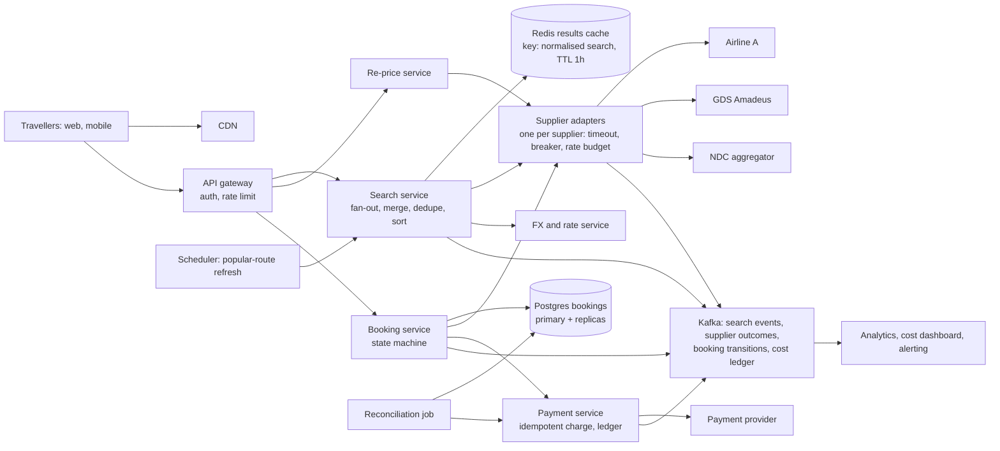
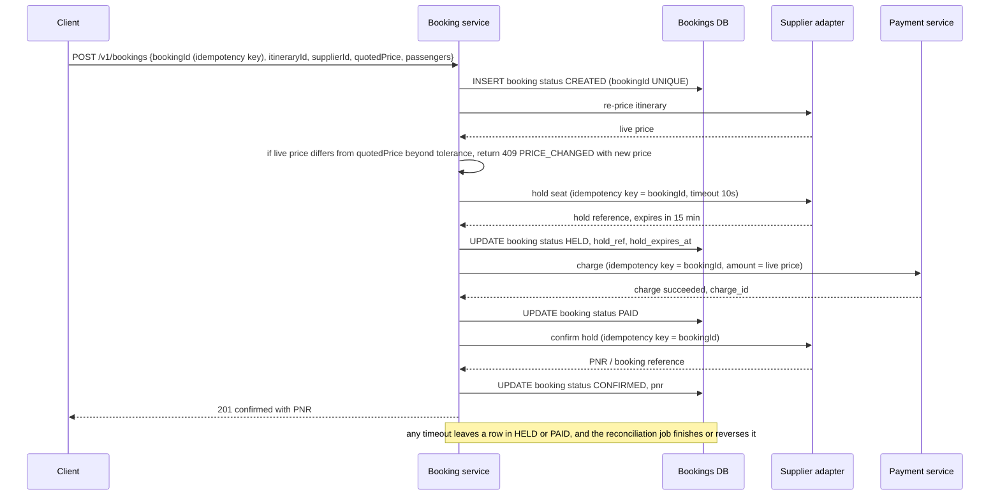

# 26 — Design a Flight Search and Booking Service with Multi-Supplier Aggregation (Agoda bank: B1, B3, B5, R1, R8, S9)

*Written as I would talk through it in a design discussion, with the reasoning behind each choice.*

## 1. Problem statement

We are building the flight product for an online travel agency the size of Agoda or Skyscanner. We do not own
any inventory. Fifty to a few hundred suppliers, which are airlines, global distribution systems like Amadeus
and Sabre, and NDC aggregators, each expose their own API for searching and booking, each with its own data
shape, its own rate limit, and its own bill per call. A traveller types origin, destination, dates and
passengers, we fan the search out, merge what comes back into one de-duplicated list where the same flight
from two suppliers shows once at the cheapest price, and when the traveller books we have to get the seat
from that supplier, take payment, and never sell a seat we did not get or charge a card for a seat we did not
confirm. The interviewer is checking two things: whether I can run a metered, pull-only aggregation under
freshness and cost pressure, and whether I can get the booking state machine right when money and a third
party are both involved.

## 2. Scope

I'll focus on the search fan-out and the supplier adapters, de-duplication and cheapest-wins merging, the
cache and its freshness policy, pagination, and the search-to-confirmed-booking path including re-pricing,
hold, payment and reconciliation. Out of scope are ranking and personalisation beyond price sort, loyalty
programmes, post-booking changes and refunds beyond cancellation, and the supplier contracts themselves. I'll
treat passenger data handling as a compliance requirement rather than designing identity verification.

## 3. Functional requirements

Search one-way and return flights by origin, destination, dates, passenger count and cabin, and get back a
list of itineraries sorted by total price, each itinerary shown once even if several suppliers sell it, with
the cheapest supplier behind it. Page through results. Open an itinerary and see the current price, which may
differ from the search result because fares move. Book: give passenger details, we hold the seat with the
supplier, take payment, and confirm with a booking reference. Cancel a booking. Operations staff need to see
supplier health, cost per supplier, and bookings stuck in any intermediate state.

## 4. Non-functional requirements

Search latency is the product. The target is a first page of results within two seconds at p95, with results
continuing to improve for a few seconds after that, because travellers compare sites and the slow one loses.
Freshness is bounded: a price shown in search may be up to an hour old, but the price shown on the itinerary
page before payment must be live, because that is the one we are contractually committing to. Cost matters
in a way most designs ignore: every supplier call is billed and rate-limited, so the design has a budget per
search and a budget per supplier per minute, and exceeding it is a failure like any other. Availability of
99.9% for search, because a degraded search with a few suppliers missing is still useful, and 99.95% for
booking and payment, because a failed payment is lost revenue and a possible double charge is a trust
incident. Consistency is strong for bookings and ledger entries and eventual for everything else. Scale is
tens of thousands of searches a second at peak and a few hundred bookings a minute.

As an error budget, 99.9% on search is about forty-three minutes a month of search unavailable or over
latency, and supplier outages are what spend it, so the design must survive any single supplier being down
without counting against the budget. 99.95% on booking is twenty-two minutes a month, spent by payment
provider incidents and our own deploys, which is why booking rollouts are canaried and halted when the budget
is gone.

## 5. Design tenets

Treat suppliers as unreliable, slow and expensive by default and isolate each one behind its own adapter with
its own timeout, breaker and rate budget. Serve search from a cache and let the cache be stale within a
declared bound rather than paying for a fresh pull per user. Separate the quote from the commitment: search
results are quotes, and the only authoritative price is the one re-fetched immediately before payment. Make
every write to a supplier and to the payment provider idempotent with a key we generate. Model the booking as
an explicit state machine persisted in a relational database, and make every stuck state visible and
recoverable by a job, never by a human reading logs. Measure cost per search as a first-class metric alongside
latency.

## 6. Back-of-the-envelope estimation

Say 50 million searches a day. That is about 580 a second on average, and travel peaks hard around lunchtime
and evenings in each market, so I plan for ten thousand a second at peak. If each search fanned out to fifty
suppliers with no cache, that is half a million supplier calls a second, which no supplier would allow and
which, at a tenth of a cent per call, costs 500 dollars a second. So the cache is not an optimisation, it is
the design. If popular routes give a 70% hit ratio and the average search touches twenty relevant suppliers,
supplier calls drop to about 60,000 a second at peak, still large, so I also batch and cap fan-out per
supplier.

Conversion from search to booking is around one to two percent of sessions, so 50 million searches become
something like 100,000 bookings a day, which is just over one a second, a few hundred a minute at peak. The
booking path is tiny by volume and must be correct, so it goes on a relational database with no sharding.

Cache size: a search key is origin, destination, date, return date, passengers and cabin. The hot set is maybe
ten million distinct keys a day, each with up to a couple of hundred itineraries at a kilobyte each, which is
tens of gigabytes to a couple of terabytes depending on how much we keep. That fits a Redis cluster with a
one-hour TTL, since most keys expire before they grow.

The decision the numbers force: cache-first search with bounded fan-out and per-supplier budgets, and a small,
strongly consistent booking core.

**The hard part** is two-fold. On the search side it is running a metered, pull-only aggregation where
suppliers do not push changes, so we have to decide when to spend money refreshing, how to avoid a stampede
of users triggering the same refresh, and how to keep the page useful when a supplier is slow or down. On the
booking side it is the gap between what we showed, what the supplier will actually sell us, and what we
charged, where any two of those can disagree and a customer ends up either without a seat or with a double
charge.

## 7. System components and services

Travellers use web and mobile apps through a CDN and an API gateway that does authentication, rate limiting
per client and request shaping.

The search service takes a normalised search request, checks the cache, and orchestrates fan-out to the
supplier adapters when the cache misses or is stale. It merges, de-duplicates and sorts, writes the result
back to the cache and returns the first page.

The supplier adapter layer has one adapter per supplier. Each translates our canonical search and booking
model into that supplier's protocol, enforces that supplier's timeout, concurrency and rate budget, and
normalises the response, including currency conversion and tax inclusion.

The results cache is Redis, keyed by the full normalised search plus a schema version, holding the merged
result set with a one-hour TTL.

The pricing service, which I'll call re-price, fetches a live fare for one itinerary from one supplier when a
traveller opens the itinerary page, and returns the authoritative price.

The booking service owns the booking state machine in a relational database: created, held, paid, confirmed,
and the failure branches. It calls the supplier adapter to hold and confirm and the payment service to charge.

The payment service wraps the payment provider with idempotency, retries and a ledger, and runs the
reconciliation job against provider settlement files, which I covered in depth in design 23.

A rate and FX service provides exchange rates updated a few times an hour so we can normalise supplier prices
to the traveller's currency.

A scheduler drives proactive refreshes of popular routes, and a reconciliation job walks bookings in
intermediate states and resolves them.

Kafka carries search events, supplier call outcomes and booking state changes to analytics, monitoring and
the cost ledger.

## 8. Architecture and flows




*Vector version: [26-flight-search-and-booking-1-architecture.svg](diagrams/26-flight-search-and-booking-1-architecture.svg)*





*Vector version: [26-flight-search-and-booking-2-flow.svg](diagrams/26-flight-search-and-booking-2-flow.svg)*


Narrated, the search path first. The gateway authenticates and applies a per-client rate limit, then the
search service normalises the request: airport codes upper-cased, dates in ISO form, passengers sorted by type,
cabin canonicalised, so that two travellers asking the same question produce the same cache key. It looks up
Redis. On a hit that is younger than the freshness bound it returns the first page immediately. On a miss or a
stale hit it takes a short per-key lock so only one request does the expensive work, decides which suppliers
are relevant for this route, and fans out to their adapters in parallel with a total deadline of about two
seconds. As responses arrive it normalises them, converts to the traveller's currency, de-duplicates by flight
identity keeping the cheapest, sorts, writes the merged set to Redis with the TTL, and releases the lock.
Suppliers that have not answered by the deadline are left out of this response and their late results, if
they arrive within a grace window, are merged into the cached set so the next page or the next user sees them.

The booking path is the diagram. The important properties are that the booking ID is generated by the client
when the passenger form opens and is the idempotency key for our database, the supplier hold, the charge and
the confirm, so a retry anywhere re-enters the same state rather than creating a second anything; and that the
state is persisted before each external call, so a crash leaves a row that the reconciliation job can finish.

## 9. Communication between services

Client to gateway to search is synchronous HTTPS because the traveller is waiting. Search to adapters is
synchronous with a per-supplier timeout and an overall deadline, run in parallel with a bounded concurrency
per supplier, because the whole point is to answer within two seconds and a slow supplier must not hold the
page. Adapters to suppliers are whatever the supplier offers, which is HTTP, sometimes SOAP, and for a couple
of GDSs a session-based protocol, so the adapter also owns connection pooling and session management.

Booking to adapter and booking to payment are synchronous with timeouts, because the user needs a confirmation
and because the sequence has ordering constraints, but every call is persisted-before and idempotent so a
timeout is a recoverable state, not a lost one. Everything downstream of the user, which is analytics, cost
accounting, supplier health scoring and notifications, is asynchronous over Kafka, so that a slow consumer can
never slow a search or a booking.

The scheduler to search service is asynchronous: it enqueues refresh requests for popular routes at a cadence
chosen per route, and the search service treats them as low-priority fan-outs that yield to user traffic.

## 10. Deep dives

### 10.1 Pull-only suppliers and the freshness-versus-cost decision

Suppliers do not tell us when a fare changes. We find out by asking, and asking costs money and rate budget.
So the first decision is a freshness policy. The options are: pull on every user search, which is fresh but
unaffordable and would exhaust rate limits at peak; cache with a fixed TTL and refresh only on demand, which is
cheap but means a popular route goes stale between the first search after expiry and the refresh; and a tiered
policy where hot routes are proactively refreshed by a scheduler on a cadence and cold routes are refreshed on
demand with a TTL. I pick the tiered policy. The criteria were cost per search, p95 latency, and the fraction
of itinerary pages where the live price differs from the search price, which is the business measure of
staleness. The hot routes are where most searches land, so proactively refreshing them every twenty to thirty
minutes keeps most users on warm cache with fresh-enough data, and the long tail is refreshed on demand with a
one-hour TTL and jitter. What I give up is a stale window of up to an hour on cold routes, which I make
acceptable by re-pricing before payment and by showing the search price as "from" rather than as a commitment.

The polling cadence is itself a tuned value. I would start with a per-route refresh interval derived from how
often that route's prices changed in the last day, and let the scheduler spend a daily budget of supplier
calls across routes in proportion to search volume. Routes with a high price-change rate and high volume get
refreshed more often; nobody refreshes a route no one searched.

### 10.2 Per-supplier budgets, timeouts and breakers

Each adapter has three limits: a concurrency cap, a token-bucket rate limit matching the contract, and a
per-call timeout, typically between 800 milliseconds and three seconds depending on the supplier's history. The
rate limiter is the design from document 1 applied per supplier, with the bucket in Redis so all search
instances share it, and a local fallback if Redis is unreachable. When the bucket is empty the adapter does not
queue the call, it returns "budget exhausted" immediately and the search proceeds without that supplier,
because queuing would turn a cost limit into a latency problem.

A circuit breaker per supplier opens when the error or timeout rate crosses a threshold over a short window and
half-opens after a cooldown. The breaker exists so a down supplier costs us nothing, not even the timeout. A
retry budget caps retries at a small percentage of calls per supplier, because retries against a struggling
supplier are how a brownout becomes an outage, and we never retry a call that timed out on a supplier that is
already slow.

The alternative is one shared pool and one timeout for all suppliers, which is simpler and wrong: the slowest
supplier sets the page latency and the flakiest one eats the pool.

Where a supplier offers a batch or multi-date API, the adapter uses it: one call for the whole date range of a
flexible search instead of seven. That is a cost lever worth more than most caching tweaks, and it is per
supplier, which is another reason the adapter owns protocol details.

### 10.3 De-duplication and cheapest-wins

The same physical flight arrives from several suppliers with different identifiers, different fare
breakdowns and different currencies. First the adapter normalises to a canonical itinerary: an ordered list
of segments, each with marketing carrier, flight number, departure date and time, origin and destination, and
cabin. That tuple is the flight identity, and codeshares are resolved to the marketing carrier so that the
same seat sold under two codes still appears once. Operating carrier is kept as an attribute, not part of the
identity. Each supplier's total is converted to one settlement currency using the FX service rate at search
time, and the total includes taxes and mandatory fees, because comparing base fares would pick the supplier
with the most creative fee structure.

Then the merge is a hash map from flight identity to the best offer. Cheapest total wins. Ties are broken by
the supplier's trailing booking success rate, because a supplier whose holds fail twenty percent of the time
is not actually cheapest, and then by supplier ID for determinism so two servers produce the same page.

I considered keeping all offers per itinerary and letting the UI pick, which gives flexibility but multiplies
the cached payload and pushes business rules into clients. Keeping only the best offer, plus a small list of
alternatives for the itinerary page, keeps the cache small and the rule in one place.

### 10.4 Cache stampede and partial results

When a popular key expires at the moment a thousand people search it, a naive design sends a thousand
fan-outs. I use a per-key lock in Redis with a short lease: the first request acquires it and does the
fan-out, the others either wait briefly for the result or serve the stale value if one exists, which is the
stale-while-revalidate pattern. Jitter on the TTL spreads expiries so hot keys do not all expire on the hour.
If a refresh fails because suppliers are down, we serve the stale value and extend its life rather than
showing nothing, which is stale-if-error, and we mark the response so the UI can say prices may be out of date.

Partial results are normal, not exceptional. The response carries which suppliers contributed and which were
excluded and why, and the first page is served when either all relevant suppliers have answered or the
deadline has passed. Late answers within a grace window are merged into the cached set, so the second page
and later users benefit, and the client can poll once for an updated first page, which is how competitors
show "finding more flights" for a few seconds.

### 10.5 Pagination without supplier pagination

Suppliers do not page, and even if they did, paging across fifty of them would be incoherent. So we page our
merged, sorted cache, not the suppliers. The options are offset pagination, which breaks when the cached set
changes between pages as late results merge in, and cursor pagination, where the cursor encodes the sort key
and identity of the last item plus the cache version. I pick cursors. The criteria were stability across
late merges and resistance to duplicates and gaps, and offset fails both. The cursor carries the result-set
version so if the set was rebuilt since the first page we can either continue on the old snapshot, kept for a
few minutes under a versioned key, or tell the client the results were refreshed. I give up random access to
page forty, which no traveller wants.

### 10.6 Quote versus commitment, re-pricing and holds

The search result is a quote that may be an hour old. When the traveller opens an itinerary we re-price with
the winning supplier, which is one call for one itinerary and therefore affordable. If the price changed we
show the change before they enter payment details, and the booking request carries the price they saw, so the
booking service can re-check and return a price-changed error rather than silently charging more. The
tolerance is a product decision; I would start at zero and let the business widen it.

Holds matter because payment takes seconds and a fare can disappear in that window. Most suppliers offer a
hold, usually fifteen to thirty minutes, that reserves the seat at the price without charging. The sequence is
re-price, hold, charge, confirm. If the charge fails we release the hold. If the confirm fails after the
charge, we are holding money for a seat we may not have, which is the worst state, and the reconciliation job
retries confirm with the same idempotency key, and if the hold has expired, it refunds and notifies the
customer. Where a supplier has no hold, we accept a small rate of "paid but seat gone" and the same job
refunds, and we weight that supplier lower in ties.

### 10.7 Double booking and concurrency

Two kinds. One traveller double-clicking produces two requests with the same booking ID, and the unique
constraint on the bookings table makes the second a no-op returning the first's state. Two travellers booking
the last seat is resolved by the supplier, because they own the inventory; our job is to make sure we do not
charge the loser, which the hold-before-charge order guarantees, since the hold fails for one of them.

Inside our system the state machine is advanced with conditional updates: update booking set status equals
HELD where booking ID equals this and status equals CREATED. If zero rows change, another worker or a retry
already advanced it, and we read the row and continue from where it is. That is optimistic concurrency on the
state, and it removes the need for distributed locks across the booking, payment and adapter calls.

### 10.8 Payment and reconciliation

The payment service passes our booking ID as the idempotency key to the provider, so a retried charge returns
the original result. Every charge, refund and provider callback is written to an append-only ledger, and a
nightly job compares the ledger to the provider's settlement file, flagging mismatches for a finance queue.
Bookings in HELD or PAID older than a few minutes are picked up by the reconciliation job, which re-reads the
supplier and provider state and drives the row to CONFIRMED, or to REFUNDED with a customer notification. The
job is idempotent and safe to run twice, which is the design from document 23 applied here.

### Failure modes

A supplier is slow: its adapter times out at its own limit, the page is served without it, and its results
merge later if they arrive. A supplier is down: the breaker opens, searches skip it at zero cost, and the
dashboard shows its share of results dropping. Redis is down: the search service falls back to direct
fan-out with a reduced supplier set and a stricter deadline, which is expensive and slower but keeps search
working, and the rate limiters fall back to local buckets, which overspend by the instance count for a few
minutes. The payment provider is down: holds are placed, charges fail, holds are released, and the customer is
asked to retry; the breaker on the provider stops us from placing holds we cannot pay for. The booking
database primary fails: the replica is promoted within a minute and the idempotency keys make in-flight
retries safe. A deploy breaks the booking path: the canary slice shows the HELD-older-than-five-minutes
alarm first and the release is rolled back. The FX service is stale: we use the last rate and mark it, because
a slightly wrong currency conversion in search is corrected at re-price.

### Testing, since the bank asks for it

Adapters are tested against recorded supplier responses replayed from fixtures, because real suppliers charge
per call and change behaviour. Contract tests per supplier run in CI against those fixtures and against a
sandbox where the supplier offers one. The merge and de-duplication logic is pure and gets property-based
tests: the same set of offers in any order gives the same page. The booking state machine gets a model-based
test that injects a failure at every transition and asserts the reconciliation job converges. Load tests run
against adapter stubs with configurable latency distributions so we can see the page deadline hold under a
slow supplier. In production, a shadow fraction of searches is replayed against a new adapter version and the
results diffed before any traveller sees it.

## 11. API design

```
GET  /v1/search?from=BKK&to=SIN&depart=2026-11-03&return=2026-11-10&adults=2&cabin=economy&currency=THB
     200 {searchId, results[...], suppliersIncluded[], suppliersPending[], nextCursor, freshness}
GET  /v1/search/{searchId}?cursor=...                      next page from the cached, versioned set
GET  /v1/itineraries/{itineraryId}/price?supplierId=...    live re-price before payment
POST /v1/bookings   {bookingId (client-generated idempotency key), itineraryId, supplierId,
                     quotedTotal, currency, passengers[], contact}
     201 confirmed {bookingId, pnr} | 202 pending {bookingId} | 409 PRICE_CHANGED {newTotal}
     | 409 SEAT_UNAVAILABLE | 200 on idempotent repeat
GET  /v1/bookings/{bookingId}
DELETE /v1/bookings/{bookingId}                            cancel, triggers refund per fare rules
Internal:  GET /ops/suppliers/health, GET /ops/bookings?status=HELD&olderThan=5m
```

A 202 is returned when a supplier confirm is taking longer than our synchronous wait; the client polls the
booking and we notify by email and push when it settles.

## 12. Data model

```
booking(booking_id PK (client-generated), user_id, itinerary_hash, supplier_id, status
        (CREATED, HELD, PAID, CONFIRMED, CANCELLED, REFUND_PENDING, REFUNDED, FAILED),
        quoted_total, live_total, currency, hold_ref, hold_expires_at, charge_id, pnr,
        created_at, updated_at, version)
booking_passenger(booking_id FK, seq, name, dob, document_ref_encrypted)   -- PII, encrypted at rest
booking_event(event_id PK, booking_id FK, from_status, to_status, actor, payload, created_at)  -- audit
payment_ledger(entry_id PK, booking_id, type (CHARGE, REFUND, CALLBACK), amount, currency,
               provider_ref, idempotency_key UNIQUE, created_at)
supplier(supplier_id PK, name, rate_limit_per_min, timeout_ms, cost_per_call, has_hold, enabled)
supplier_call(call_id, supplier_id, kind, latency_ms, outcome, cost, ts)   -- Kafka to warehouse
search_result (Redis)  key: v2:search:{from}:{to}:{depart}:{return}:{pax}:{cabin}
                       value: compressed merged list + version + fetched_at; TTL 3600s + jitter
search_lock  (Redis)   key: lock:{search key}, lease 5s
route_stats(route PK, searches_24h, price_change_rate, refresh_interval_s)   -- scheduler input
```

Query patterns: booking by ID, which is the idempotency check and the status poll; bookings by user; bookings
by status and age, which is the reconciliation scan and needs an index on status and updated_at; ledger by
booking ID for reconciliation; search result by key; and route stats sorted by volume for the scheduler. The
itinerary hash is the flight identity from 10.3, so we can see how often a given flight's quoted and live
prices disagree, which tunes the refresh cadence.

## 13. Database choices

For bookings, the ledger and audit events, the options were a relational database, which gives the
transaction that moves status and writes the audit event atomically and the unique constraint for
idempotency; a key-value store such as DynamoDB, which scales effortlessly but turns the state transition
plus audit write into two writes or a transaction API with less tooling; and an event-sourced store, which is
elegant for audit but a lot of machinery for a hundred thousand rows a day. I pick Postgres with synchronous
replication to a standby and read replicas for the ops views. The criteria were correctness of state
transitions, idempotency enforcement, and the fact that the volume is small. What I give up is horizontal
write scale, which at one booking a second is not a real loss, and at ten times the scale I would partition by
booking ID hash before I would change the store.

For the search results cache, Redis cluster, because the workload is a point lookup by key with TTL, the
per-key lock needs an atomic set-if-absent with expiry, and the values are a few hundred kilobytes compressed.
Memcached would do the lookups but not the lock or the data structures for versioned snapshots. What I give
up is durability, which is fine because the cache is rebuildable from suppliers at a cost.

For supplier call records and search events, Kafka into a columnar warehouse, because the questions are
aggregates over time: cost per supplier per day, p95 per supplier, conversion by route. Nobody looks up one
call by ID. Putting these in the relational database would drown the booking store in telemetry.

For route statistics driving the scheduler, a small table in the same Postgres or in Redis sorted sets; it is
tiny and read by one job.

## 14. Tools and technologies

Kafka over RabbitMQ for events, because we replay supplier outcomes into new cost models and health scorers,
and replay plus multiple independent consumers is Kafka's shape; RabbitMQ would fit if we needed per-message
routing and acknowledgement semantics, which we do not here. Redis over Memcached for the reasons above.
Postgres over MySQL mostly for familiarity and for partial indexes on status, either is fine. Resilience4j or
the equivalent for per-supplier breakers, bulkheads and rate limiters, with the rate bucket state in Redis so
it is shared across instances. gRPC between our services for typed contracts, HTTP and SOAP to suppliers
because that is what they offer. A workflow engine such as Temporal is a reasonable alternative for the
booking saga; I chose the explicit state table plus reconciliation job because the sequence is short, the
states are few, and the team can read a table more easily than a workflow history, but I would switch if the
post-booking flows such as changes and multi-leg refunds grew the state machine past a dozen states.

## 15. Metrics and monitoring

Search: p50 and p95 latency to first page, cache hit ratio, fan-out count per search, suppliers included per
response, and cost per search in cents, which is the one metric most teams forget and the one finance asks
about. Per supplier: call rate against the contract limit, p95 latency, timeout rate, error rate, breaker state,
result share, and booking success rate on holds and confirms. Freshness: the fraction of re-prices that differ
from the quote, by route, which tunes the scheduler. Booking: funnel conversion from search to itinerary to
booking, success rate, p95, and the count of rows in HELD or PAID older than five minutes, which is the
single most important alarm in the system. Payment: charge success, refund count, and reconciliation
mismatches. Alarms page on the stuck-booking count, on booking error rate above half a percent, on cache hit
ratio dropping below sixty percent, and on any supplier's breaker staying open for more than ten minutes; the
last one opens a ticket to the partnerships team rather than paging engineering.

## 16. Notification and logging

Travellers get a booking confirmation with the PNR by email and push, a pending notice if we returned a 202,
and a refund notice if reconciliation reversed a booking. Every booking state change writes an audit event
with the actor and the payload, and the ledger is append-only; customer service reads these, never the logs.
Logs carry the booking ID or search ID as the trace key across the gateway, search, adapters, booking and
payment, and supplier request and response bodies are logged with passenger PII and card data redacted, kept
for thirty days for dispute resolution. Supplier degradation notifies the partnerships channel; stuck
bookings page the on-call.

## 17. CI/CD, cost, operations, and what comes next

Each adapter deploys independently behind a feature flag per supplier so a bad adapter can be turned off
without a deploy; the search and booking services deploy with a canary slice of a few percent and automatic
rollback on the stuck-booking alarm or on p95 regression. Schema changes to the bookings database are
expand-and-contract because old and new code run together during the canary. Rollback is redeploying the
previous build, which is safe because every external call is idempotent on the booking ID. A new adapter goes
through shadow traffic, where we send a slice of real searches to it and diff the normalised results against
the current adapter, before it contributes to any page.

Migration: moving a supplier from one protocol version to another is a second adapter behind the same flag,
run in shadow, then switched. Moving the cache key schema bumps the version prefix so old and new keys coexist
and the old ones expire on their own.

Backups: the bookings database has point-in-time recovery with a recovery point of under a minute from the
synchronous standby and a recovery time under thirty minutes, and we restore into a staging environment
monthly to prove it. The ledger is also exported daily to object storage. The cache is not backed up; it is
rebuilt.

Cost line items: supplier calls are the largest, often more than the infrastructure, which is why cost per
search is a dashboard, then Redis memory, then the stateless compute for adapters at peak, then the payment
provider's percentage, then the warehouse.

Regions: search runs active-active in each market's region with its own Redis, because results are
market-specific anyway and latency to the traveller matters. Booking runs with one primary writer per
region and bookings are homed to the region that created them, because a booking never needs to move.
Suppliers are reached from whichever region is closest to them, which for a GDS can be a different region
than the traveller's.

Ownership: the adapter layer is one team with a per-supplier on-call rotation and the partnerships
relationship; search and cache is a second team; booking and payment is a third because its correctness bar
and its compliance scope, which is PCI and passenger data, are different.

At ten times the scale, the cache tier shards by route prefix, the scheduler becomes a proper budget allocator
across routes, adapters get per-supplier autoscaling, and the bookings database is partitioned by booking ID.
The next features are personalised ranking beyond price, price-drop alerts driven by the scheduler's
refreshes, multi-city search, bundling with hotels, and post-booking changes, which is where a workflow engine
would start to earn its place.
