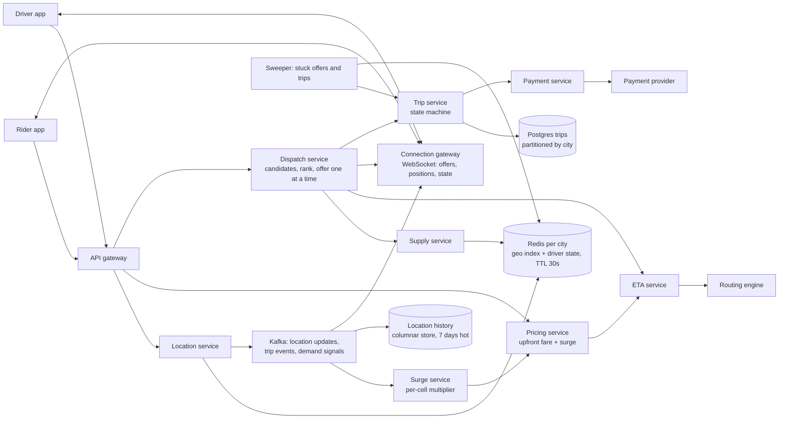
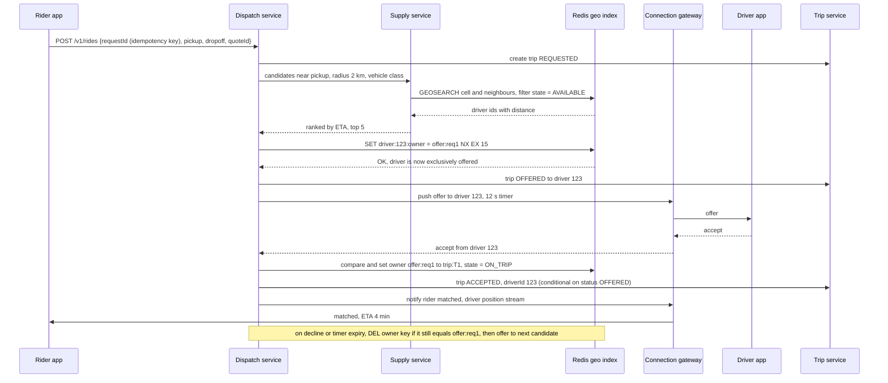
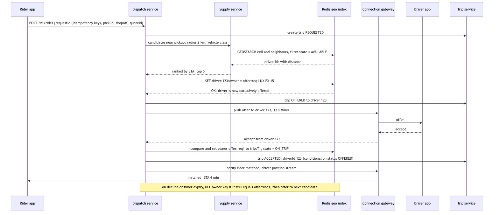

# 27 — Design a Ride-Sharing Service like Uber or Lyft (Agoda bank: S6)

*Written as I would talk through it in a design discussion, with the reasoning behind each choice.*

## 1. Problem statement

We are building the core of a ride-hailing service at the scale of Uber in a large country: millions of riders,
a few hundred thousand drivers online at peak, and the job of connecting a rider who wants to go somewhere
with a nearby driver within seconds, then tracking the trip, pricing it and charging for it. The interviewer
is checking whether I can handle a high-rate stream of location updates cheaply, find nearby drivers fast,
make sure no driver is assigned to two riders and no rider waits forever, and keep the trip and the money
consistent through a state machine that spans two phones and a payment provider.

## 2. Scope

I'll focus on driver location ingestion and storage, rider-to-driver matching and dispatch, the trip
lifecycle, upfront pricing with surge, ETA at the level of what the matcher needs, and payment at the end of a
trip. Out of scope are maps and routing internals, which I covered in design 15, driver onboarding and
background checks, fraud, pooled rides, and the full payment platform from design 23, which I treat as a
dependency. Safety features and support tooling I'll mention where they touch the data model.

## 3. Functional requirements

Drivers go online and their app reports location continuously while online. A rider enters a destination and
sees an upfront price and an estimated pickup time. The rider requests a ride and the system offers it to a
nearby driver, who accepts or declines within a few seconds; if they decline or time out we offer it to the
next driver. Rider and driver see each other's location live until pickup. The trip runs from pickup to
drop-off, the rider is charged the upfront price adjusted for genuine route changes, the driver is paid, and
both can rate the trip. Either side can cancel with rules about fees. Operations staff see supply, demand and
stuck trips per city.

## 4. Non-functional requirements

Matching latency: a rider should have a driver assigned within a few seconds of requesting at p95, and the
first offer should go to a driver within half a second, because every second of waiting is a cancellation
risk. Location freshness: the position we match against should be no more than a few seconds old, because a
driver who was here five seconds ago is a hundred metres away now. Correctness: a driver is never on two
offers or two trips at once, a rider is never charged twice, and a trip is never lost in a half-state.
Availability of 99.99% for the request-and-match path in each city, because an outage strands people on
streets; 99.9% for pricing and history. Consistency is strong for trip state and payment and eventual for
locations, ETAs and analytics, where being a second behind is fine. Scale is a few hundred thousand drivers
updating location every few seconds and tens of thousands of ride requests a minute at peak in the largest
market.

As an error budget, 99.99% is about four minutes a month where riders in a city cannot request or get
matched. That is spent by a location store outage or a dispatch bug in a deploy, so the location store runs
with hot replicas and dispatch deploys are canaried per city and halted when the budget is gone.

## 5. Design tenets

Treat location as a high-volume, low-value, short-lived stream: store only the latest position per driver in
memory and let old values expire, and keep history only in a cheap append-only store. Make the hot path for a
ride request read from memory and touch a durable store only at state transitions. Give every driver exactly
one owner at a time, which is a trip or an offer, and enforce that with a single conditional write so there is
no distributed lock. Offer rides to one driver at a time with a short timeout, because broadcasting creates
races and bad driver experience. Price upfront and treat the quote as binding within a short window. Model the
trip as an explicit state machine with every transition persisted and every stuck state swept by a job. Keep
everything partitioned by city, because rides never cross cities and that gives us an operational blast radius.

## 6. Back-of-the-envelope estimation

Say 300,000 drivers online at peak, each reporting every four seconds. That is 75,000 location updates a
second, each a few dozen bytes, which is a few megabytes a second. The volume is fine; the cost is in doing
something per update, which is why the hot store is an in-memory write and the history is a batched append.

Ride requests: twenty million rides a day across the platform, peaking at maybe 700 a second globally and a
couple of hundred a second in the busiest city. Each request triggers one nearby-driver query, a few ETA
estimates, and one to three offers. That is a few thousand operations a second, which is small for the hot path.

Location memory: 300,000 drivers times a few hundred bytes with indexes is about a hundred megabytes, which
is trivially one Redis per city with replicas. Location history: 75,000 updates a second is about six billion
rows a day, which at a hundred bytes each is 600 gigabytes a day before compression, so it goes to a columnar
store with a short hot retention and cold archive, not a database.

Trips: twenty million a day, a few kilobytes each including events, is tens of gigabytes a day on a
relational store, which is fine with partitioning by city and time.

The decision the numbers force: in-memory latest location indexed by geographic cell per city, an append-only
history pipeline, and a small strongly consistent trip store.

**The hard part** is dispatch under concurrency and change. The nearest driver moves while we are asking
them, several riders request at the same moment and want the same driver, the driver's phone drops out for
five seconds, and all of this has to resolve to exactly one assignment per driver with nobody double-booked
and nobody waiting indefinitely. The second hard part is the location stream: cheap enough to ingest at tens
of thousands a second and indexed well enough to answer "who is near here" in milliseconds.

## 7. System components and services

Rider and driver apps talk to an API gateway for request-response calls and hold a WebSocket to a connection
gateway for pushes such as offers, driver position and trip state.

The location service ingests driver updates, writes the latest position to a per-city Redis geo index with a
TTL, and publishes the update to Kafka for history and for the live tracking fan-out.

The supply service answers "which available drivers are within this radius" from the geo index, filtered by
vehicle type and by availability state.

The ETA service estimates travel time between two points using the routing engine from design 15, with a
cache and a straight-line fallback.

The pricing service computes an upfront fare from distance, time, vehicle class and the current surge
multiplier for the pickup cell, and signs the quote with an expiry.

The dispatch service is the heart: it takes a ride request, asks supply for candidates, ranks by ETA, offers
to one driver at a time through the connection gateway, and on acceptance atomically assigns the driver by a
conditional write and creates the trip.

The trip service owns the trip state machine in a relational database: requested, offered, accepted, driver
arriving, in progress, completed, cancelled, and the payment states.

The payment service charges the rider's stored method at completion with an idempotency key and pays the
driver on a schedule, with a ledger and reconciliation as in design 23.

The surge service aggregates demand and supply per cell every few seconds from Kafka and publishes a multiplier
per cell.

A notification service sends push and SMS for offline users, and a sweeper job finds trips and offers stuck
in any state past its timeout and resolves them.

## 8. Architecture and flows




*Vector version: [27-ride-sharing-1-architecture.svg](diagrams/27-ride-sharing-1-architecture.svg)*






*Vector version: [27-ride-sharing-2-flow.svg](diagrams/27-ride-sharing-2-flow.svg)*


Narrated. A driver's app sends its position every four seconds while online. The location service writes the
latest point into a Redis geo set for that city, writes the driver's state record with a thirty-second TTL so a
driver whose phone dies disappears from supply on its own, and publishes the update to Kafka, where the
history writer batches it into the columnar store and the connection gateway forwards it to any rider who is
currently watching that driver.

A rider asks for a price. The pricing service calls ETA for distance and duration, applies the vehicle class
rate and the surge multiplier for the pickup cell, and returns a signed quote valid for a couple of minutes.
The rider requests the ride with that quote and a client-generated request ID. Dispatch creates the trip in
REQUESTED, asks supply for available drivers within a radius, which is a geo search over the pickup cell and
its neighbours, ranks the top handful by ETA rather than straight-line distance because rivers and one-way
streets exist, and then claims the best driver by writing an owner key for that driver with set-if-absent and
a fifteen-second expiry. If the set fails, another dispatcher got that driver and we move to the next
candidate. Having claimed the driver, we push the offer over their WebSocket with a twelve-second timer. If
they accept, we compare-and-set the owner key from the offer to the trip, move the trip to ACCEPTED with a
conditional update on its previous state, and start streaming the driver's position to the rider. If they
decline or time out, we delete the owner key only if it still carries our offer, and offer to the next
candidate, widening the radius on each round until a cap, at which point the rider is told no drivers are
available and the trip is cancelled with no charge.

## 9. Communication between services

Driver location updates go over the WebSocket or a lightweight HTTP post, whichever the connection state
allows, and are fire-and-forget from the app's point of view: no acknowledgement is waited on because the
next update supersedes this one in four seconds. Inside, location to Redis is a synchronous write because the
whole point is that the index is current, and location to Kafka is asynchronous because history and tracking
can lag by a second.

The ride request path is synchronous to the rider up to the point where the trip is created and the first
offer is sent, and then asynchronous: the rider's app gets "finding your driver" and the match result arrives
by push over the WebSocket, because dispatch may take fifteen to forty seconds across several offers and
holding an HTTP request that long is fragile. Dispatch to driver is a push over the WebSocket with a timer,
and the driver's answer comes back the same way; if the driver has no socket, we fall back to a push
notification and treat silence as a decline.

Dispatch to trip service is synchronous gRPC with conditional writes, because the state transition is the
correctness boundary. Trip completion to payment is asynchronous through an outbox on the trip table into
Kafka, because the rider does not need to wait for the charge to clear to leave the car, and payment retries
against a provider should never hold the trip. Surge computation is a stream job over Kafka, publishing
multipliers that pricing reads from Redis.

## 10. Deep dives

### 10.1 Storing and indexing live driver locations

The options were a relational database with a spatial index, which gives rich queries but cannot take
75,000 writes a second to the same hot table while serving radius queries at millisecond latency; a
geohash or S2 or H3 cell index in Redis, where the latest position per driver lives in a geo set per city and
a radius search reads the cell and its neighbours; and an in-process grid index inside the dispatch servers,
sharded by city, which is fastest but makes dispatch servers stateful and complicates failover. I pick Redis
geo per city. The criteria were write rate, query latency, and operational simplicity, and Redis takes the
writes in memory, answers a neighbourhood query in under a millisecond, and the TTL on the driver's state
record gives us free expiry of dead drivers. Design 13 covers why cell-based indexing beats a quadtree for
moving objects: a position update is a single key write, not a tree rebalance. What I give up is the richer
spatial queries of a database, which nobody needs on the hot path, and durability, which does not matter for a
value that is replaced every four seconds; after a Redis failover the index refills within one update
interval.

Cell size matters. For matching I want cells where a reasonable pickup radius spans the cell and its eight
neighbours, which at city density is roughly a kilometre on a side, which is geohash precision six or H3
resolution eight. Dense downtowns want smaller cells so a search does not return two thousand candidates;
suburbs want larger ones. H3 makes the neighbour calculation uniform, which is why I would lean to it over
plain geohash, but Redis GEOSEARCH does the radius for us so the choice mostly affects the surge grid.

Update rate is a cost lever. Drivers who are idle and stationary can report every ten seconds; drivers on a
trip with a rider watching report every two to three seconds; the app adapts based on state and movement, and
that halves ingest cost without anyone noticing.

### 10.2 Matching and ranking

Nearest by straight line is wrong often enough to matter, so the candidate set is the nearest fifteen or so by
distance from the geo index and the ranking is by ETA from the routing engine, batched into one call. The
ranking also considers a driver's acceptance rate, how long they have been idle, and in some markets a
fairness term so the same driver near a hotel does not get every ride. This is a scoring function with weights
the marketplace team tunes; I design for it being pluggable and logged so experiments can compare.

Batching matters when many riders request in the same cell at the same moment, which is exactly what happens
when a concert ends. Instead of resolving each request independently and having them fight over the same
closest driver, dispatch can buffer requests in a cell for a second or two and solve a small assignment
problem across riders and drivers, which reduces total pickup time and reduces offer churn. The cost is up to
two seconds of added latency, so I would enable it only when a cell's request rate crosses a threshold.

### 10.3 Dispatch without double-assignment

The invariant is that a driver has at most one owner, where an owner is either an offer or a trip. The options
for enforcing it were a distributed lock service such as ZooKeeper, which is heavy and adds a dependency to the
hottest path; a relational row per driver with a conditional update, which is correct but puts 75,000 location
writes' worth of contention next to a hot row; and a Redis key per driver written with set-if-absent and an
expiry, where the value names the owner and transitions are compare-and-set in a small Lua script. I pick the
Redis owner key. The criteria were latency, correctness under concurrent dispatchers, and recovery when a
dispatcher dies mid-offer, and the expiry handles the last one: an offer that nobody resolves releases itself
in fifteen seconds. The driver's trip assignment is also persisted in the trip table with a unique partial
index on driver ID where status is active, as a belt to the Redis braces, so even if Redis loses the key in a
failover the database refuses a second active trip for the same driver and dispatch backs off.

The compare-and-set from offer to trip on acceptance protects against the late accept: a driver who accepts
after the timer expired and the key was released, and possibly re-offered to someone else, gets a "ride no
longer available" rather than a trip. The same script checks that the key still names this offer before
promoting it.

Offering to one driver at a time rather than broadcasting is a deliberate trade. Broadcast gives a faster
first accept but means several drivers tap accept and all but one are told no, which drivers hate and which
creates the races we just avoided. Sequential offers with a short timer and a good ranking give most riders a
match within one or two offers and keep the invariant trivial.

### 10.4 The trip state machine

States are REQUESTED, OFFERED, ACCEPTED, ARRIVING, IN_PROGRESS, COMPLETED, PAYMENT_PENDING, PAID, and the
cancellation branches with who cancelled and whether a fee applies. Every transition is a conditional update
on the previous status with the version incremented, and writes an event row in the same transaction, so the
audit trail and the state can never disagree. Transitions come from the rider's app, the driver's app, the
dispatcher and the sweeper, and because they are conditional, two of them racing resolve to one winner and a
clear error for the other, which the app refreshes from.

Every non-terminal state has a timeout and the sweeper enforces it: an OFFERED trip older than its offer
timer re-enters dispatch; an ACCEPTED trip where the driver has not moved toward pickup in several minutes
prompts the driver and then reassigns; an IN_PROGRESS trip with no location updates from either phone for a
long time is flagged for support rather than auto-completed, because it might be a tunnel or might be an
incident. A COMPLETED trip not PAID within a minute retries payment, and after repeated failure moves to a
collections state and the rider's account is restricted for new rides.

### 10.5 Pricing, surge and the binding quote

Upfront pricing computes the fare before the ride from estimated distance and time, which means the rider
knows what they pay and the company absorbs estimation error, which is why the ETA service matters for money
and not only for matching. The quote is signed, carries the surge multiplier and expires in two minutes, and
the ride request references it, so a rider cannot replay an old cheap quote and the pricing service cannot be
bypassed. If the trip's actual route differs substantially because the rider changed destination, the fare is
recomputed and the rider is told in the app.

Surge is a per-cell multiplier recomputed every few seconds from a stream job that counts open requests and
available drivers per cell over a sliding window. The options for where this runs were a batch job every
minute, which is too slow, and a stream processor such as Flink over the Kafka demand and supply topics,
which gives second-level freshness; I pick the stream processor and publish multipliers to Redis so pricing
reads them in a microsecond. Smoothing matters so the multiplier does not flap, and a cap exists for
reputational reasons.

### 10.6 Live tracking fan-out

A rider watching a driver approach needs that driver's position every couple of seconds. The connection
gateway subscribes the rider's socket to the driver's location topic key for the duration of the pickup, and
the location service's Kafka stream, or a Redis pub/sub channel per driver for lower latency, delivers each
update. Design 14 covers the pub/sub pattern. The subscription is one-to-one or one-to-few here, which is far
easier than the friends case, and it ends at pickup. On the driver's side, the rider's position before pickup
is sent the same way in reverse.

### 10.7 Payment at the end of the trip

When the driver ends the trip, the trip service computes the final fare, moves the row to COMPLETED, and writes
an outbox event in the same transaction. A relay publishes it to Kafka and the payment service charges the
rider's stored method with the trip ID as the idempotency key. Success moves the trip to PAID; failure retries
with backoff and then the collections state. Driver earnings are ledger entries settled weekly or on demand.
Tips and adjustments are separate ledger entries against the same trip. The ledger and the nightly
reconciliation against the provider are the same design as 23.

### Failure modes

A driver's phone loses signal: their state TTL expires in thirty seconds and they vanish from supply; if they
were on an offer the key expires and dispatch moves on; if they were on a trip the trip stays, the rider sees
"reconnecting", and the sweeper only flags it after a longer window. A dispatcher crashes mid-offer: the owner
key expires, the sweeper sees an OFFERED trip past its timer and re-dispatches. Redis for a city fails over:
the replica is promoted in seconds, the geo index refills within one update interval, owner keys may be lost,
and the unique index on active driver trips prevents double trips in the gap while dispatch treats conflicts
as a signal to re-fetch. Kafka lags: history and surge go stale, which degrades pricing accuracy but nothing
on the request path. The routing engine is down: ETA falls back to straight-line distance times a city speed
factor, matching gets a bit worse, upfront prices get a bit less accurate, and we alarm. The payment provider
is down: trips complete and sit in PAYMENT_PENDING, the retry queue grows, and the breaker stops hammering;
riders are not blocked from new rides until the collections threshold. A bad dispatch deploy: the per-city
canary shows match rate dropping and time-to-match rising within a minute and the release is rolled back for
that city only.

## 11. API design

```
Driver
POST /v1/drivers/me/status        {online: true, vehicleClass}
POST /v1/drivers/me/location      {lat, lng, heading, speed, ts}   (or over WebSocket), fire and forget
WS   offer {tripId, pickup, eta, fare, expiresAt} -> accept | decline
POST /v1/trips/{tripId}/arrived | /start | /complete

Rider
POST /v1/quotes      {pickup, dropoff, vehicleClass}  -> {quoteId, fare, surge, etaToPickup, expiresAt}
POST /v1/rides       {requestId (idempotency key), quoteId, pickup, dropoff}
     202 {tripId, status: REQUESTED}      match result pushed over WebSocket
GET  /v1/trips/{tripId}
POST /v1/trips/{tripId}/cancel  {reason}
POST /v1/trips/{tripId}/rating  {stars, comment}
WS   tripUpdate {status, driver, position, eta}

Ops
GET /ops/cities/{city}/supply, /demand, /trips?status=OFFERED&olderThan=30s
```

## 12. Data model

```
driver_state (Redis, per city)   key driver:{id}  value {status AVAILABLE|OFFERED|ON_TRIP, vehicleClass, ts}  TTL 30s
driver_geo   (Redis, per city)   GEO set drivers:{city}:{vehicleClass}  member driverId
driver_owner (Redis, per city)   key owner:{driverId}  value offer:{requestId} or trip:{tripId}  EX 15 for offers

trip(trip_id PK, request_id UNIQUE (idempotency), city, rider_id, driver_id, status, quote_id, vehicle_class,
     pickup_point, dropoff_point, requested_at, accepted_at, started_at, completed_at,
     quoted_fare, final_fare, surge, version)
     -- partitioned by city and month; unique partial index on (driver_id) where status in active states
trip_event(event_id PK, trip_id FK, from_status, to_status, actor, at, payload)      -- audit, same txn
trip_outbox(id PK, trip_id, event_type, payload, published_at NULL)                 -- relayed to Kafka
quote(quote_id PK, rider_id, pickup, dropoff, fare, surge, expires_at, signature)
rider(rider_id PK, name, phone, default_payment_method_ref, rating)
driver(driver_id PK, name, phone, vehicle, licence_ref, rating, acceptance_rate)
payment_ledger(entry_id PK, trip_id, party (RIDER|DRIVER), type (CHARGE|PAYOUT|TIP|ADJUSTMENT|REFUND),
               amount, idempotency_key UNIQUE, provider_ref, at)
location_history(driver_id, ts, lat, lng, trip_id)      -- columnar, partitioned by day, 7 days hot then archived
surge_cell (Redis)   key surge:{city}:{h3cell}  value multiplier, refreshed every few seconds
```

Query patterns: available drivers near a point by vehicle class, which is the GEOSEARCH; a driver's current
owner, which is the point read on the hot path; trip by ID and by request ID for idempotency; a rider's or
driver's active trip; trips by status and age in a city for the sweeper, indexed on city, status, updated_at;
ledger entries by trip; and location history by trip for receipts and disputes, which is a scan of one
driver's partition over the trip's time range. The partial unique index on active driver trips is the
database-level guard for the one-owner invariant.

## 13. Database choices

For live locations and dispatch ownership, Redis per city with a replica, for the reasons in 10.1 and 10.3:
in-memory writes at the ingest rate, geo queries built in, atomic set-if-absent with expiry for the owner
key, and automatic expiry of dead drivers. The alternative of a spatial database could not take the write
rate on the hot path, and Cassandra could take the writes but cannot answer a radius query or give atomic
compare-and-set cheaply. I give up durability, which the data does not need.

For trips, events, quotes and the ledger, a relational database, Postgres, partitioned by city and month. The
criteria were conditional updates on status with an audit row in the same transaction, the unique constraints
for idempotency and the one-active-trip-per-driver guard, and the query by status and age for the sweeper. A
key-value store would make the audit-plus-state write two writes and the partial unique index impossible;
Cassandra would need lightweight transactions for the conditional updates and would make the sweeper's scan
awkward. What I give up is write scale beyond one primary per city partition, which at a few hundred trip
transitions a second per city is nowhere near a limit, and if a city outgrows it I split the partition.

For location history, a columnar store such as ClickHouse or Parquet in object storage queried by a
warehouse engine, because the write is a batched append from Kafka and the reads are a time range for one
driver or aggregates per cell; a relational store would be a terabyte a day of index maintenance for queries
that are never point lookups. I give up fast single-row lookups, which nobody needs.

For surge multipliers, Redis, because it is a few thousand small values read on every quote and refreshed
every few seconds.

## 14. Tools and technologies

Kafka over RabbitMQ for the location and trip event streams, because several consumers read the same stream
at their own pace, the history writer, the surge job, the tracking fan-out and analytics, and replay matters
when a surge model changes; RabbitMQ's per-queue routing would mean duplicating the stream per consumer.
Redis over Memcached because geo sets, TTLs, pub/sub and Lua scripts for the compare-and-set are the whole
point. Flink or Kafka Streams for surge, since it is windowed aggregation over a stream; a cron job would be
a minute stale. H3 for the cell grid because neighbours are uniform and the hexagons suit density
visualisation, with Redis GEOSEARCH doing the actual radius query. WebSockets through a connection gateway
for pushes, with a push notification fallback. gRPC between services with deadlines, breakers and retry
budgets. Postgres with table partitioning and a partial unique index as described. A transactional outbox
rather than dual writes from the trip service to Kafka, because losing a completion event means a ride nobody
paid for.

## 15. Metrics and monitoring

Supply and demand: online drivers per city and per cell, open requests, and the ratio, which is what surge
reads. Matching: time from request to first offer, time to accept, offers per matched trip, match rate, and
the unfulfilled rate, broken down by city; the p95 time-to-match is the product metric. Location: ingest rate,
write latency to Redis, the fraction of online drivers whose last update is older than ten seconds, and Kafka
lag for the history and tracking consumers. ETA: call rate to the routing engine and the cache hit ratio in
front of it, because a cold ETA cache is what turns a concert letting out into a routing-engine incident. Dispatch correctness: the count of conditional-write conflicts,
which should be small and steady, and the count of unique-index violations on active driver trips, which
should be zero and pages if it is not. Trips: counts by state, the number stuck past their timeout per state,
cancellation rate by side, and payment pending age. Alarms page on match rate dropping, time-to-match p95
over the target, Redis replica lag or failover in a city, stuck trips over a threshold, and any unique-index
violation. ETA accuracy is tracked as the error between predicted and actual pickup and trip time because it
drives both matching quality and fare accuracy.

## 16. Notification and logging

Riders get push updates for match, driver arriving, trip complete and receipt, with SMS fallback when the app
is not reachable. Drivers get the offer by WebSocket with push fallback and a sound. Every trip state change
is an audit event with actor and payload, which support and safety teams read for disputes; location history
for a trip is attached to the receipt and retained per policy. Logs carry the trip ID as the trace key across
dispatch, trip, payment and the gateway, and the request ID before a trip exists. Location logs are sampled
because full logging of every update would cost more than the system; the history store is the record. Stuck
trip counts page the on-call; supply anomalies alert the city operations team rather than engineering.

## 17. CI/CD, cost, operations, and what comes next

Services deploy per city, with the smallest city as the first canary, because the blast radius of a dispatch
bug is a city's riders. Rollout proceeds city by city on match rate and time-to-match staying flat, and rolls
back automatically for a city on regression. Rollback is redeploying the previous build for that city, which
is safe because every trip transition is conditional and every charge is idempotent on the trip ID, so
in-flight requests during the switch re-enter the same state. Dispatch ranking changes ship behind flags with an experiment
framework so a new scoring function runs on a percentage of requests and is compared on time-to-match and
cancellation. Schema changes to the trip database are expand-and-contract because old and new dispatchers
run together during the canary; the state machine tolerates unknown states by refusing to transition them
and alerting.

Migration: moving a city to a new Redis cluster is a dual-write for one update interval and a cutover,
because the data refreshes itself in seconds. Moving trip partitions is online by city.

Backups: the trip database has point-in-time recovery with a recovery point under a minute from a synchronous
standby and a recovery time under thirty minutes, restored into staging monthly; the ledger is exported daily.
Redis is not backed up, it is rebuilt from the next round of updates. Location history is in object storage
with lifecycle rules.

Cost line items: mobile data and battery are a real cost borne by drivers, which is why update frequency
adapts; then the routing engine's compute for ETA calls, then Kafka and the columnar store for history, then
Redis and Postgres, which are small, and the payment provider's percentage.

Regions: cities are the unit, and a region hosts the cities in it with an active-passive standby in another
region for the trip database; the location index does not need cross-region replication because it rebuilds
in seconds, so failover of a city means pointing dispatchers at the standby and waiting one update interval.

Ownership: location and supply are a platform team; dispatch and pricing are the marketplace team with the
experiment framework; trips and payment are a third team whose bar is correctness and compliance.

At ten times the scale, Redis per city becomes Redis sharded by cell range within a city, dispatch servers
partition by cell groups so batching in 10.2 is local, and the trip database partitions by city and week.
The next features are pooled rides, which turns matching into a routing problem with capacity; scheduled
rides; driver destination preferences; and safety features such as trip sharing and anomaly detection on
the location stream, which the history pipeline already makes possible.
