# Agoda Staff — worked answers for the four themes behind ~70% of recent loops

*Each answer below is written as it would be spoken to the interviewer: a direct answer, with the reasoning
behind every choice and what that choice gives up. The method follows `../system-design/00-approach-and-framework.md`.
The evidence for why these problems and not others is in `agoda-staff-platform-and-system-design-question-bank.md`.*

The platform round in 2025 and 2026 is one problem family presented two ways: Agoda data flowing out to
suppliers, and supplier data flowing in to Agoda. In both cases the candidate is given a design and a Java
snippet and asked to find the problems and fix them. The architecture round is dominated by three systems:
hotel booking, flight booking, and a payment gateway with reconciliation. This document gives one answer for
each.

1. Platform: external suppliers pull booking data out of Agoda
2. Platform: aggregating flight inventory and prices from many vendors
3. Platform: the Java code review, the corrected code, and the general questions
4. Architecture: hotel booking system
5. Architecture: flight booking system
6. Architecture: payment gateway with reconciliation

Appendix: A1 concert booking with a flash-sale opening; A2 critique of a pre-drawn hotel search design;
A3 critique of the promo service; A4 top-K trending hotels; A5 multi-source ingestion with approval and bank
settlement, plus the log-storage and reconciliation variants; A6 a fundamentals sheet for the general
platform questions.

The three architecture answers follow the seventeen-section structure used by every design in the
system-design folder. The two platform answers follow the structure of that round: the problem as given, the
issues with the current design, the proposed design, the decisions with their alternatives, and then
concurrency, failure handling, testing and monitoring.

---

## 1. Platform: external suppliers pull booking data out of Agoda

### The problem as given

Ten to twenty suppliers need to retrieve their own bookings from Agoda. They filter in two ways: by how
recently a booking changed, meaning the last five minutes, two hours or one day, and by upcoming check-in
date, meaning the next seven or thirty days. Peak load is about a hundred requests per minute. The current
proposal is a new External Booking API that calls the existing internal Booking API, and the internal API
gains an endpoint that accepts a supplier ID and a date range and returns matching bookings.

### The key observation

A hundred requests per minute is less than two requests per second, so this is not a scaling problem. It is
a problem of coupling and of API contract design. The two questions that matter are whether a supplier's
misbehaving client can affect the service that handles bookings and payments, and whether the API will still
be sound when the twenty-first supplier arrives with slightly different needs.

### Problems with the current design

First, supplier traffic reaches the core booking service and, through it, the transactional database that
holds live bookings. Even at low volume, the availability of a partner feed and the availability of booking
should not depend on each other. A supplier whose client is stuck in a retry loop would effectively be load
testing the system that processes payments.

Second, an internal API is being changed to serve an external consumer. "Bookings for a supplier within a
date range" is a range scan over check-in date filtered by supplier. The booking table is indexed for lookups
by booking ID and by user, so this query would require a new index on the most important table in the
system, purely to serve polling.

Third, the query shape is wrong for what suppliers actually need. "The last five minutes" really means
"everything that changed since my previous request." Time-window queries produce gaps when the supplier's
clock differs from ours, and they produce duplicates when a booking is amended after it was already
returned. Without pagination a supplier cannot page through a large result, and without a stable ordering a
retried request can skip or repeat rows.

Fourth, authentication, rate limiting and tenant isolation are absent. A supplier must only see its own
bookings, and one supplier exceeding its quota must not slow down the others.

Fifth, the API contract is undefined: which fields are returned, how timestamps are formatted, how statuses
are named, how the API is versioned, and how a version is retired. These are the most expensive things to
change once twenty integrations depend on them.

### Proposed design

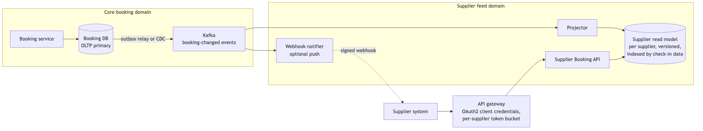

*Vector version: [01-supplier-booking-feed-1-architecture.svg](diagrams/01-supplier-booking-feed-1-architecture.svg)*

The booking service is unchanged. Every change to a booking produces an event, captured either through a
transactional outbox table or through change data capture on the database log. I do not publish the event
from application code as a second write, because two writes that must agree will eventually disagree. The
events are published to a Kafka topic partitioned by supplier. A projector service consumes them and
maintains a supplier read model: a table shaped for the supplier queries, holding only the fields suppliers
are entitled to see, with a monotonically increasing version number per supplier and an index on check-in
date. A separate Supplier Booking API serves requests from this read model. An API gateway in front of it
authenticates each supplier and enforces a per-supplier rate limit. Optionally, a webhook notifier sends
change notifications to suppliers that can receive them, which reduces polling.

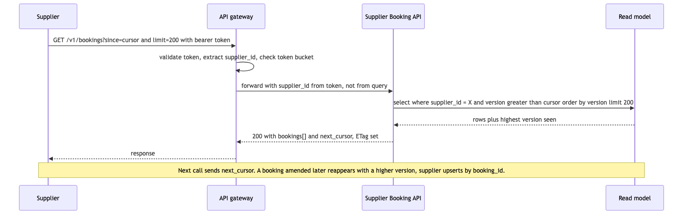

*Vector version: [01-supplier-booking-feed-2-flow.svg](diagrams/01-supplier-booking-feed-2-flow.svg)*

A single request works as follows. The supplier calls the gateway with a bearer token and a cursor. The
gateway validates the token, extracts the supplier ID from the token, and checks the supplier's rate limit.
It forwards the request using the supplier ID from the token, not from the query string, so a supplier
cannot read another supplier's data by changing a parameter. The API selects rows for that supplier with a
version greater than the cursor, ordered by version, limited to one page, and returns the page together with
the highest version seen as the next cursor. If nothing has changed, the ETag matches and the supplier
receives a 304 response with no body.

### Design decisions and alternatives

**Where supplier reads are served from.** The options are the internal API, a read replica of the booking
database, or a projection built from change events. The criteria are isolation from the booking path,
freedom to change the internal schema, and the ability to shape data for the supplier queries. A read replica
removes load from the primary but keeps every supplier coupled to the internal schema, so every internal
migration becomes a partner-facing change. The internal API is the proposal under review. I choose the
projection. The cost is a small amount of staleness, typically hundreds of milliseconds to a few seconds,
which is acceptable for a feed whose finest filter is five minutes, plus one additional component to operate.

**How suppliers page through results.** The options are offset pagination, time-window queries, and a cursor
based on a monotonic version. The criteria are correctness under concurrent updates, safe retries, and query
cost. Offset pagination skips or repeats rows when data changes between pages, and large offsets become
sequential scans. Time windows have the clock and amendment problems described above. I choose a cursor on
a per-supplier version that increases with every change; it can come from a database sequence or from the
change log offset. The supplier requests everything after the cursor, receives a page and a new cursor, and
can retry safely. For the check-in windows, a second endpoint filters by check-in date range with its own
cursor, served by a composite index on supplier, check-in date and booking ID. What this gives up is the
ability to query an arbitrary historical time window, which no supplier has asked for.

**Protocol at the external edge.** The options are REST with JSON, gRPC, and GraphQL. The criteria are the
variety of partner technology stacks, cacheability, and predictable load. gRPC is the right default inside
our own services, but requiring twenty partners to adopt protobuf tooling creates a support burden. GraphQL
lets partners shape responses, but it makes rate limiting and caching harder, and this API has a small,
fixed set of queries. I choose REST with JSON, and publish an OpenAPI document so the contract is still
typed. The cost is some payload efficiency compared with a binary protocol.

**The contract.** Timestamps are ISO 8601 in UTC, with no alternative formats, because supporting a choice
of formats means two code paths and a recurring source of bugs. Status is a closed enumeration that we
define and document. Every record carries its version and the time of its last change. The API version is
in the path. Changes within a version are additive only; a breaking change becomes a new version with a
published deprecation period for the old one. These rules matter because the cost of changing them is
multiplied by the number of integrations.

**Authentication and isolation.** OAuth 2.0 client credentials, or mutual TLS where a partner can manage
certificates, with each token scoped to a single supplier ID. The API never trusts a supplier ID from the
request; it uses the one in the token. Rate limiting is a token bucket per supplier at the gateway, and the
API uses a separate connection pool per supplier so that one supplier's load affects only that supplier.
Every request is audit-logged with the supplier, time and row count, because this is customer data leaving
our systems. The read model stores only the fields suppliers need, so a bug in the API cannot expose a field
that was never stored.

**Push in addition to pull.** Webhooks with request signing and retries allow suppliers that can receive
them to stop polling. The pull API remains the source of truth and the recovery path when a webhook is
missed. Pull is built first because it is simpler for both sides and the current volume does not require
push.

### Concurrency

If a booking is amended after a supplier has already received it, the amendment produces a higher version
and the booking appears again in the next page. Suppliers are expected to upsert by booking ID. Two
concurrent requests with the same cursor return the same page, which is correct because reads have no side
effects. The projector is an at-least-once consumer, so it upserts by booking ID and version and discards
any event older than the version it already holds.

### Failure handling

If the projector falls behind, the read model is stale and a request returns fewer rows than it eventually
will, but never incorrect rows. The alarms are on consumer lag and on the age of the oldest unprocessed
event, not on topic depth. If the read model or its API is unavailable, suppliers receive a 503 response with
a Retry-After header, and booking is unaffected; that isolation is the purpose of the design. If the projector
applies events out of order, the version check on upsert prevents an older event from overwriting a newer
one, and the table can be rebuilt by replaying the topic. Authentication fails closed: a request with a token
that cannot be verified receives nothing, because exposing one supplier's bookings to another is worse than a
short outage for one supplier.

### Testing and monitoring

Testing consists of contract tests against the published OpenAPI document, replay tests that feed a recorded
day of change events through the projector and compare the read model with the booking database, and a small
end-to-end suite that calls the gateway as a test supplier.

For each supplier I monitor request rate, error rate, p99 latency, rows returned, and rate-limit rejections.
For the pipeline I monitor change-capture lag, projector lag, and dead-lettered events. The service-level
objective is that 99.9% of requests succeed within 500 milliseconds at the ninety-ninth percentile, and the
freshness objective is that a committed booking is visible to its supplier within thirty seconds.

---

## 2. Platform: aggregating flight inventory and prices from many vendors

### The problem as given

A search service calls several external vendors, meaning airlines, global distribution systems and NDC
aggregators, merges their results, stores them, and returns the response. Results are considered valid for
about an hour. Users search by origin, destination and dates, and then book. In the current design the
search service does everything itself, the API has no pagination or authentication, and the Java class
contains an if-else chain with one branch per vendor. In a common variant, every vendor call has a monetary
cost and no vendor pushes updates; data can only be pulled.

### The key observation

The central difficulty is freshness against cost. Prices and seat availability change continuously, vendors
charge per call or impose rate limits, and the user must see data that is close to current, ordered by price,
with the same flight from several vendors shown once. The rest of the design is standard service structure,
which I will cover briefly so the time goes to that trade-off.

### Problems with the current design

The search service owns vendor protocols, caching, merging, and the public API. That is four
responsibilities in one deployable unit and one failure domain, so a parsing error for one vendor can take
down search for everyone.

Vendor calls run sequentially, because the if-else chain executes inside a loop. Latency is the sum of all
vendors rather than the slowest one.

Where a cache exists, its key is the product alone. The search parameters and the vendor are not part of the
key, so a result for one query can be returned for a different query.

Nothing prevents many requests from calling every vendor at once when a popular route's cached result
expires.

The same flight sold by three vendors appears three times, and the cheapest is not necessarily first.

The API has no pagination, no authentication, no idempotency on the booking call, and no handling for a
price that changes between search and booking.

The service is drawn as one instance in front of one database. There is nothing to scale horizontally
because the in-process cache and the sequential loop make instances non-interchangeable, and the single
database has no replica, so one disk failure takes out both the stored results and the booking records. The
diagram also uses the wrong verbs where it shows them: a search drawn as POST cannot be cached by anything
between the client and us, and a booking status change drawn as GET has side effects on a method that proxies
and browsers may replay.

### Proposed design

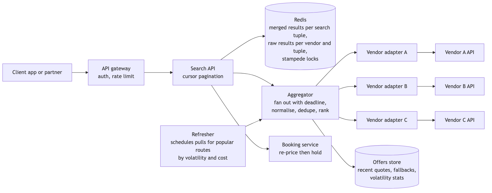

*Vector version: [02-vendor-aggregation-1-architecture.svg](diagrams/02-vendor-aggregation-1-architecture.svg)*

The Search API owns the public contract: authentication through the gateway, cursor pagination, and the
cache lookup. The Aggregator owns parallel fan-out, normalisation, de-duplication and ranking. One adapter
per vendor owns that vendor's protocol, credentials, timeout, circuit breaker and retry budget, and returns
offers in one normalised format. Redis holds two kinds of entries: the merged, ranked result for a complete
search, and the raw result per vendor per search, so that refreshing one vendor does not invalidate the
others. A durable offers store keeps recent quotes, their alternative vendors, and per-route volatility
statistics. A refresher schedules proactive fetches for popular routes. The booking service re-prices with
the chosen vendor before creating a hold.

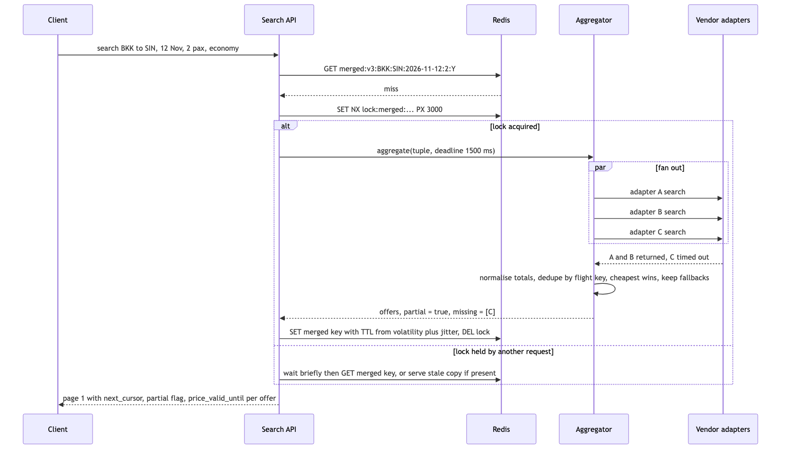

*Vector version: [02-vendor-aggregation-2-flow.svg](diagrams/02-vendor-aggregation-2-flow.svg)*

A search on a cache miss works as follows. The Search API builds the cache key from origin, destination,
date, passenger count and cabin, with a schema version prefix. The key is not in the cache, so the service
attempts to acquire a short lock on that key in Redis. If it acquires the lock, it asks the Aggregator for
results with a deadline of about one and a half seconds. The Aggregator calls every adapter in parallel. In
this example two vendors respond and one times out. The Aggregator normalises prices to totals, collapses
duplicates by flight identity keeping the cheapest offer and recording the alternatives, and returns the
ranked list marked as partial with the missing vendor identified. The Search API stores the result in Redis
with a time to live derived from the route's volatility plus a random offset, releases the lock, and returns
the first page with a cursor. Requests that did not acquire the lock wait briefly for the key to appear, or
return a stale copy if one exists.

### Design decisions and alternatives

**Splitting the service.** The options are one service with better internal structure, or three services:
the API, the Aggregator, and the adapters. The criteria are failure isolation, independent deployment when a
vendor changes its interface, and scaling fan-out separately from the public edge. I choose the split,
because a vendor interface change then becomes a deployment of one adapter and a faulty adapter release
cannot take down the API. The cost is a few milliseconds of latency for the additional network hops and some
additional operational work.

**Parallel fan-out with a deadline.** The options are to wait for all vendors or to call all vendors
concurrently and return what has arrived by a deadline. The criteria are latency at the ninety-ninth
percentile and completeness. I choose the deadline with a partial-results indicator, because users are
better served by most of the market in one and a half seconds than by all of it in six, and a late response
is still written to that vendor's cache for the next search. The cost is incomplete results when a vendor is
slow, and the client has to display that clearly.

**Cache key and time to live.** The key includes every input that affects the result, plus a schema version
so a deployment can invalidate old entries without clearing the cache. The time to live is set per route from
how often that route's price has changed in recent refreshes, rather than a fixed hour, with a random offset
so that expirations do not align. A fixed time to live is either too stale for volatile routes or too costly
for stable ones. Explicit invalidation without a time to live is not possible because vendors do not notify
us of price changes. The cost is more logic in the cache layer, in exchange for direct control over the
trade-off between cost and freshness.

**Preventing simultaneous refreshes.** On a cache miss, exactly one request per key acquires a Redis lock
using set-if-not-exists with a short expiry and performs the fetch; the others wait for the key or serve a
stale entry while it is refreshed. For a popular route this reduces many vendor calls to one, which is the
largest single reduction in vendor cost available. The cost is a few hundred milliseconds of waiting for the
requests that did not acquire the lock.

**Metered vendors that only support pull.** Since vendors do not push updates, we schedule the fetches. A
small fraction of routes accounts for most searches. Those routes are refreshed proactively by the scheduler
at an interval based on their volatility and on the vendor's cost per call, and are served from cache. The
remaining routes are fetched on demand and cached. Cost per vendor per day is a tracked metric with a budget
and an alarm. The cost is lower freshness for rarely searched routes, where the traffic does not justify the
spend.

**De-duplication and ranking.** A flight is identified by marketing carrier, marketing flight number,
departure date and time, origin, destination and cabin; an itinerary is the ordered list of its flights.
Codeshares are a product decision that I state rather than leave implicit: with the marketing key, the same
aircraft sold under two airline codes appears as two itineraries, which is what the traveller actually buys,
because the ticket, fare rules and loyalty credit differ by marketing carrier. If the product wants codeshares
collapsed, the key becomes operating carrier plus operating flight number and the cheapest marketing code wins.
I default to the marketing key and carry the operating carrier as a display attribute. The same itinerary from
several vendors
collapses to one entry with the lowest total price, where total means price including taxes and fees
normalised to one currency, because vendors differ in what they include and comparing base fares would choose
the wrong result. Ties are resolved by the vendor's historical booking success rate, then by vendor ID so the
order is deterministic. Every vendor's offer is retained in the offers store, because the cheapest vendor may
fail at booking time and the next offer should be available without a new search.

**Booking.** Search results are quotes, not inventory that we hold. The booking flow re-prices with the
chosen vendor, shows the user any price change and asks them to confirm, creates the hold with the vendor
using our booking ID as the idempotency reference, authorises payment, and then confirms. No payment is taken
before the vendor confirms a hold. Section 5 covers this flow in detail.

**API corrections.** Pagination first, because the API has none and the interviewer asks cursor or offset.
Offset is simple and lets a client jump to page forty, but the ranked list changes under it as late vendor
responses merge in, so a client paging with offsets sees duplicates and gaps, and a large offset is a scan on
whatever serves it. A cursor encodes the sort key and identity of the last item plus the version of the result
set it was taken from, so the next page continues from the same snapshot, and if the set has been rebuilt the
server can say so instead of silently shifting. I choose cursors and give up random access, which no traveller
uses. OAuth for partner callers and session authentication for the app. UTC timestamps. GET for search with
the parameters in the query string so the response is cacheable, POST for booking with an idempotency key. A
price-valid-until field on every offer so the client can tell the user how long the quote holds. A batch
endpoint that prices several itineraries in one call, so the client does not make one request per result.

**Horizontal scaling and replication.** Once the cache is in Redis and the vendor calls are parallel, the
Search API and the Aggregator are stateless and scale by adding instances behind the load balancer, with
adapters scaled per vendor because their concurrency caps differ. The offers store and the booking database
get a synchronous replica with automatic failover and read replicas for the ops views. Redis runs with a
replica per shard. The point to make aloud is that none of this was possible with the original in-process
`HashMap`, because every new instance would have started cold and disagreed with the others.

### Connectivity management

REST is used for the public API because clients vary and responses cache well. gRPC is used between the
Search API, the Aggregator and the adapters because it is typed, efficient, and can stream results back as
vendors respond. The vendor side uses whatever protocol each vendor provides, which is the reason the
adapters exist.

Timeouts are set from each vendor's measured ninety-ninth percentile latency plus a margin, not from a single
global value. Circuit breakers open on error rate and also on latency, because a vendor that is slow but not
failing would otherwise consume the entire deadline on every search. Retries are allowed only for idempotent
read operations, with exponential backoff, a random delay, and a per-vendor retry budget, because retrying a
metered API during the vendor's outage increases cost without improving results. The circuit breaker is a
state machine inside our adapter, not a flag in a shared table.

### Concurrency

Two searches for the same parameters at the same moment are serialised by the lock. Two refreshes of the
same vendor result each carry the fetch timestamp, and the newer one wins, so a slow response cannot
overwrite a fresher one. An adapter writes its raw result to the per-vendor cache even when the response
arrives after the Aggregator's deadline, under the same newer-wins rule.

### Failure handling

If a vendor is slow, its circuit breaker opens on latency, its offers are omitted, and the response is marked
partial with that vendor named. If a vendor is down, the same applies, and the refresher skips it so no budget
is spent on failing calls. If a vendor returns incorrect prices, its price-change rate at re-pricing rises,
which is an alarmed metric and a reason to shorten its time to live or rank it lower. If Redis is unavailable,
search fails open: requests go directly to the Aggregator at full vendor cost for the duration, with a cap on
concurrent fan-outs so that vendors do not rate-limit us. A temporary increase in cost is preferable to an
empty results page.

### Testing and monitoring

Unit tests cover normalisation, de-duplication and ranking, which are pure functions and where most logic
errors occur. Adapter tests replay recorded vendor responses so that a vendor schema change fails in
continuous integration rather than in production. Contract tests cover our public API. A fault-injection test
times out one vendor and verifies the partial indicator and the circuit breaker. A load test exercises the
cache-miss path at three times peak traffic.

For each vendor I monitor call rate, cost per day, p99 latency, timeout rate, circuit breaker state, and the
rate at which its prices change at re-pricing. For the cache I monitor hit ratio by route tier and lock wait
time. For the business I monitor the proportion of searches returned partial, the search-to-booking
conversion rate, and the overall price-change rate. The last of these is the freshness objective: if it
rises, the time to live is too long.

---

## 3. Platform: the Java code review, the corrected code, and the general questions

### The code under review

The snippet is a search service of roughly this form. The details vary between interviews; the problems do
not.

```java
public class SearchService {
    static Map<String, List<Flight>> cache = new HashMap<>();

    public List<Flight> search(String from, String to, String date, String vendor) {
        try {
            String key = from + to + date;
            if (cache.containsKey(key)) return cache.get(key);
            List<Flight> result = new ArrayList<>();
            if (vendor.equals("A")) { /* call vendor A, parse */ }
            else if (vendor.equals("B")) { /* call vendor B, parse */ }
            else if (vendor.equals("C")) { /* call vendor C, parse */ }
            cache.put(key, result);
            return result;
        } catch (Exception e) {
            return null;
        }
    }
}
```

My understanding of the code is that it searches one vendor for flights matching a route and date, caches the
result, and returns it. The early return on a cache hit is correct and I would keep it. The improvements below
are ordered by how much damage each problem causes in production.

### The improvements I suggest in this code

**1. Define the input types.** The parameters `date` and `vendor` are strings, so the method accepts any
value and has to validate on every call. I would introduce a `SearchRequest` value type that holds a
`LocalDate`, a `Vendor` enumeration, the two airport codes, the passenger count and the cabin, and validates
all of them once in its constructor. The service method then takes a `SearchRequest` and can rely on its
contents being valid.

**2. Replace the if-else chain with one class per vendor.** Each branch contains a different vendor's protocol
and parsing inside the method that coordinates the search. Adding a vendor means editing and redeploying this
class. I would define a `VendorClient` interface with one implementation per vendor, and have the service
obtain the clients from a registry that is populated by dependency injection. This is the Strategy pattern.
I use a registry rather than a factory with a switch statement, because a switch simply moves the chain to
another file; with a registry, a new vendor is a new class and a configuration entry, and the service is not
changed.

**3. Replace the static HashMap with a real cache.** A static mutable `HashMap` is not safe for concurrent
writes, never evicts entries so it grows without limit, and exists separately in every process so every
instance warms up independently. I would inject a cache behind a small `OfferCache` interface, implemented
with Caffeine in process or Redis shared across instances, with a time to live and a maximum size.

**4. Fix the cache key.** Concatenating the three strings without a separator produces collisions, for
example "BKK" plus "SIN" and "BK" plus "KSIN" give the same key. The vendor is also missing from the key, so a
result fetched for vendor A is returned to a caller asking for vendor B. The key must contain every input that
affects the result, separated by a delimiter, and prefixed with a schema version so that a deployment can
invalidate old entries without clearing the whole cache.

**5. Stop catching Exception and returning null.** This hides every vendor outage and every programming
error, and forces every caller to check for null. I would catch the vendor client's specific exception,
record which vendor failed, log it with the request ID, and return a result that states which vendors are
missing. Programming errors should propagate so they are detected.

**6. Separate responsibilities.** The class currently handles caching, vendor dispatch, HTTP calls and
response parsing. I would leave orchestration in the service, move I/O and parsing into the vendor clients,
move caching behind the `OfferCache` interface, and move the merging of results into a pure `OfferMerger`
class. Each part can then be tested on its own.

**7. Call vendors in parallel.** When this method is used for several vendors, the calls run one after
another, so latency is the sum of all vendors. I would submit the calls to a bounded executor concurrently,
with a timeout per vendor and an overall deadline, and return whatever has completed by the deadline.

**8. Security, which reviewers are told to look for.** The `from`, `to` and `date` strings go straight into
vendor calls, so a crafted value becomes whatever the vendor client builds with it, which is query or header
injection if the client concatenates URLs; the `SearchRequest` validation in improvement 1 is the fix, applied
once at the boundary. Vendor credentials must come from a secrets store injected into each client, never from
a constant or a properties file in the repository, and they must never appear in a log line or an exception
message. The cache key must not include anything user-identifying, because a shared cache keyed by user leaks
one user's results to another on a collision. And the `catch (Exception e) { return null; }` is a security
problem as well as a correctness one: it swallows authentication failures from vendors, so an expired
credential looks like an empty market instead of an incident.

**9. Smaller improvements.** Constructor injection for dependencies so the class is testable. An immutable
`Offer` type instead of a mutable `Flight`. Comparison on an enumeration instead of string equality.
Structured log lines that include the vendor and the cache key. Tests at three levels: unit tests for the
merge logic, adapter tests that replay recorded vendor responses, and one integration test for the
orchestration.

### The corrected code

The code below applies all nine improvements. It is Java 17 with no framework, so the structure is visible;
in production the constructors would be wired by Spring or Guice. The numbered comments refer to the
improvements above.

```java
// Improvement 1: input types with validation in one place.

public enum Vendor { A, B, C }

public enum Cabin { ECONOMY, PREMIUM_ECONOMY, BUSINESS, FIRST }

public record SearchRequest(String origin, String destination, LocalDate date, int passengers, Cabin cabin) {
    public SearchRequest {
        if (origin == null || !origin.matches("[A-Z]{3}")) throw new IllegalArgumentException("origin must be a three-letter IATA code");
        if (destination == null || !destination.matches("[A-Z]{3}")) throw new IllegalArgumentException("destination must be a three-letter IATA code");
        if (origin.equals(destination)) throw new IllegalArgumentException("origin and destination must differ");
        if (date == null || date.isBefore(LocalDate.now(ZoneOffset.UTC))) throw new IllegalArgumentException("date must be today or later");
        if (passengers < 1 || passengers > 9) throw new IllegalArgumentException("passengers must be between 1 and 9");
        Objects.requireNonNull(cabin, "cabin");
    }

    // Improvement 4: every input that affects the result, delimited, with a schema version.
    public String cacheKey() {
        return String.join(":", "search", "v3", origin, destination, date.toString(),
                Integer.toString(passengers), cabin.name());
    }
}

// Money is comparable only within one currency. Adapters convert to the search currency before building an Offer.
public record Money(BigDecimal amount, Currency currency) implements Comparable<Money> {
    public Money {
        Objects.requireNonNull(amount, "amount");
        Objects.requireNonNull(currency, "currency");
        if (amount.signum() < 0) throw new IllegalArgumentException("amount must not be negative");
    }
    @Override public int compareTo(Money other) {
        if (!currency.equals(other.currency)) {
            throw new IllegalArgumentException("cannot compare " + currency + " with " + other.currency);
        }
        return amount.compareTo(other.amount);
    }
}

// Improvement 9: immutable result types.

public record FlightKey(String marketingCarrier, String flightNumber, LocalDateTime departure,
                        String origin, String destination, Cabin cabin) {}

public record Offer(FlightKey flight, Vendor vendor, Money total, Instant fetchedAt, Instant validUntil) {}

// Improvement 5: the result says which vendors are missing instead of returning null.
public record SearchResult(List<Offer> offers, Set<Vendor> missingVendors) {
    public boolean partial() { return !missingVendors.isEmpty(); }
}

// Improvement 2: one client per vendor behind a common interface.

public interface VendorClient {
    Vendor vendor();
    // Blocking call bounded by this vendor's own timeout. Throws VendorException for any vendor-side failure.
    List<Offer> search(SearchRequest request) throws VendorException;
}

public class VendorException extends Exception {
    private static final long serialVersionUID = 1L;
    private final Vendor vendor;
    public VendorException(Vendor vendor, String message, Throwable cause) {
        super(message, cause);
        this.vendor = vendor;
    }
    public Vendor vendor() { return vendor; }
}

// Improvement 2: a registry populated by dependency injection. Adding a vendor does not change this class.
public final class VendorRegistry {
    private final Map<Vendor, VendorClient> clients;
    public VendorRegistry(Collection<VendorClient> clients) {
        this.clients = clients.stream()
                .collect(Collectors.toUnmodifiableMap(VendorClient::vendor, client -> client));
    }
    public Collection<VendorClient> all() { return clients.values(); }
}

// Improvement 3: the cache is injected and bounded. The implementation can be Caffeine or Redis.
public interface OfferCache {
    Optional<SearchResult> get(String key);
    void put(String key, SearchResult value, Duration ttl);
}

// Decides the time to live per route from observed volatility. Shorter when the result is partial.
public interface TtlPolicy {
    Duration forRoute(SearchRequest request, boolean partial);
}

// Improvement 6: the service only coordinates. I/O lives in the clients, merging in the merger.
public final class SearchService {
    private static final Logger log = LoggerFactory.getLogger(SearchService.class);

    private final VendorRegistry vendors;
    private final OfferCache cache;
    private final ExecutorService fanOut;   // bounded pool, sized for the number of vendors times expected concurrency
    private final Duration deadline;        // overall time budget for one search, for example 1500 ms
    private final TtlPolicy ttlPolicy;
    private final OfferMerger merger;

    // Improvement 9: constructor injection.
    public SearchService(VendorRegistry vendors, OfferCache cache, ExecutorService fanOut,
                         Duration deadline, TtlPolicy ttlPolicy, OfferMerger merger) {
        this.vendors = Objects.requireNonNull(vendors);
        this.cache = Objects.requireNonNull(cache);
        this.fanOut = Objects.requireNonNull(fanOut);
        this.deadline = Objects.requireNonNull(deadline);
        this.ttlPolicy = Objects.requireNonNull(ttlPolicy);
        this.merger = Objects.requireNonNull(merger);
    }

    public SearchResult search(SearchRequest request) {
        String key = request.cacheKey();
        Optional<SearchResult> cached = cache.get(key);
        if (cached.isPresent()) {
            return cached.get();
        }

        // Improvement 7: call every vendor concurrently. Each future is keyed by vendor so a failure is attributable.
        Map<Vendor, CompletableFuture<List<Offer>>> calls = new EnumMap<>(Vendor.class);
        for (VendorClient client : vendors.all()) {
            calls.put(client.vendor(), CompletableFuture.supplyAsync(() -> {
                try {
                    return client.search(request);
                } catch (VendorException e) {
                    throw new CompletionException(e);
                }
            }, fanOut));
        }

        // Wait until the deadline, then use whatever has completed.
        try {
            CompletableFuture.allOf(calls.values().toArray(CompletableFuture[]::new))
                    .get(deadline.toMillis(), TimeUnit.MILLISECONDS);
        } catch (TimeoutException expectedWhenAVendorIsSlow) {
            // Handled below: the vendors that did not finish are reported as missing.
        } catch (InterruptedException e) {
            Thread.currentThread().interrupt();
            throw new IllegalStateException("interrupted while waiting for vendor results", e);
        } catch (ExecutionException handledPerVendorBelow) {
            // One vendor failing must not fail the search. Each future is inspected individually below.
        }

        // Improvement 5: collect successes, record failures by vendor, never return null.
        List<Offer> collected = new ArrayList<>();
        Set<Vendor> missing = EnumSet.noneOf(Vendor.class);
        for (Map.Entry<Vendor, CompletableFuture<List<Offer>>> entry : calls.entrySet()) {
            CompletableFuture<List<Offer>> future = entry.getValue();
            if (future.isDone() && !future.isCompletedExceptionally()) {
                collected.addAll(future.join());
            } else {
                missing.add(entry.getKey());
                // Describe before cancelling: after cancel() the future reports CancellationException,
                // which would hide whether the vendor failed or was merely slow.
                String why = describeFailure(future);
                // cancel() only marks this future; it does not interrupt the vendor call in flight.
                // The spend on a slow call is bounded by the vendor client's own timeout, not by this line.
                future.cancel(true);
                log.warn("vendor {} missing for key {}: {}", entry.getKey(), key, why);
            }
        }

        SearchResult result = new SearchResult(merger.merge(collected), missing);

        // Partial results are cached too, with a shorter time to live, so the next search benefits from them.
        if (!result.offers().isEmpty()) {
            cache.put(key, result, ttlPolicy.forRoute(request, result.partial()));
        }
        return result;
    }

    private static String describeFailure(CompletableFuture<?> future) {
        if (!future.isDone()) {
            return "did not complete before the deadline";
        }
        try {
            future.join();
            return "";
        } catch (CompletionException | CancellationException e) {
            Throwable cause = e.getCause() != null ? e.getCause() : e;
            return cause.getClass().getSimpleName() + ": " + cause.getMessage();
        }
    }
}

// Improvement 6: merging is deterministic and has no I/O, so it can be tested without a network.
// Tie-break order matches the design text: price, then the vendor's trailing booking success rate, then
// vendor ID so two instances produce the same page. The success rates are injected, not looked up here.
public final class OfferMerger {
    private final Map<Vendor, Double> bookingSuccessRate;

    public OfferMerger(Map<Vendor, Double> bookingSuccessRate) {
        this.bookingSuccessRate = Map.copyOf(bookingSuccessRate);
    }

    public List<Offer> merge(List<Offer> offers) {
        Map<FlightKey, Offer> cheapest = new HashMap<>();
        for (Offer offer : offers) {
            cheapest.merge(offer.flight(), offer, (a, b) -> {
                int byPrice = a.total().compareTo(b.total());
                if (byPrice != 0) return byPrice < 0 ? a : b;
                int byReliability = Double.compare(rate(b.vendor()), rate(a.vendor())); // higher rate first
                if (byReliability != 0) return byReliability < 0 ? a : b;
                return a.vendor().compareTo(b.vendor()) <= 0 ? a : b; // deterministic tie-break
            });
        }
        return cheapest.values().stream()
                .sorted(Comparator.comparing(Offer::total).thenComparing(Offer::vendor))
                .toList();
    }

    private double rate(Vendor vendor) {
        return bookingSuccessRate.getOrDefault(vendor, 0.0);
    }
}
```

Three notes on what is deliberately not in this code. The lock that prevents simultaneous refreshes of one
key, and the per-vendor raw cache, belong in the Redis implementation of `OfferCache`, not in the service.
The executor is injected and bounded because an unbounded pool during a vendor outage is how a service runs
out of threads. The merger does no I/O and depends only on its inputs and the injected success rates,
because that is where ranking errors occur and it should be tested without a network.

### The general questions in this round

**How I would test this system.** I follow the testing pyramid and I can say why each layer is there. Unit
tests cover normalisation, de-duplication and ranking, because they are pure functions and most logic errors
occur there. Adapter tests replay recorded vendor responses so that a change in a vendor's response format
fails in continuous integration rather than in production. Consumer-driven contract tests cover our public
API so that client expectations are encoded. A small end-to-end suite covers the booking path against vendor
sandbox environments, because that path moves money and it is where all the layers meet. A load test
exercises the cache-miss path at three times peak traffic, and a fault-injection test times out one vendor
and verifies the partial indicator and the circuit breaker. For non-functional requirements, I test p99
latency under load and cost per search against the budget, because those are objectives we have committed to.

**How I would roll out a change to limited traffic.** The change is deployed behind a feature flag that is
off by default. It is enabled first for internal users, then for one percent of traffic in one region, then
ten, fifty and one hundred percent. Each step is gated on error rate, p99 latency and the business metric,
which for search is the conversion from search to booking, remaining within the error budget, and rollback is
automatic when a gate fails. If the change affects ranking, it runs first in shadow mode, where both the old
and new versions run, the results are compared, and the old result is served. Database schema changes follow
expand-then-contract so that a rollback never needs a reverse migration.

**What I would monitor.** Request rate, error rate and latency per endpoint, mapped to the service-level
objectives. The same three per dependency, together with circuit breaker state. Cache hit ratio. Queue
consumer lag and the age of the oldest unprocessed message wherever a queue exists. Cost per vendor. And two
business metrics, conversion and the price-change rate, because they reveal problems that infrastructure
metrics do not. Alarms are based on the rate at which the error budget is being consumed rather than on single
thresholds, so that both a slow degradation and a sudden failure are detected without paging on noise.

**When to use REST, gRPC or GraphQL.** REST at external boundaries, because every client can use it and
responses can be cached. gRPC between our own services, because it is typed, efficient and supports streaming.
GraphQL where one client needs flexible response shapes across many backends, which describes our own
application, and not for partner feeds, where predictable load and straightforward rate limiting matter more.

**When to use synchronous or asynchronous communication.** Synchronous when the caller cannot proceed
without the answer, which applies to search and re-pricing. Asynchronous when the work can complete later and
must not be lost, which applies to confirmation email, supplier notification and ledger writes. Asynchronous
work goes through a transactional outbox so that the event and the state change are committed together.

---

## 4. Architecture: hotel booking system

### 4.1 Problem statement

We are designing the search and booking core for an online travel agency at Agoda's scale. There are millions
of properties. Inventory is sold by room type per night, and prices vary by night and by rate plan. A
traveller searches by destination and dates, sees available room types with prices, holds one, pays, and
receives a confirmed booking. The design must support search by proximity to a location, and it must handle
two travellers attempting to book the last available room at the same time.

### 4.2 Scope

In scope are search with availability, the hold, payment and confirmation flow, and cancellation. The
hotel-side inventory feed is in scope only as a source of inventory changes. Out of scope are reviews,
loyalty programmes, the pricing engine, and the hotel extranet user interface; each has a clear integration
point noted below. One assumption I make explicit: hotels sometimes oversell deliberately to compensate for
no-shows, so the overbooking allowance is a configurable number per hotel rather than a fixed zero.

### 4.3 Functional requirements

A traveller searches by city or by map area together with a date range and receives hotels with available
room types and the total price for the stay. A traveller holds a room type for a set of nights, pays, and
receives a confirmed booking with a reference. A traveller cancels a booking and receives the refund the rate
plan allows. A hotel, through its extranet or channel manager, changes inventory and rates and sees the change
reflected in search within seconds. A retried request never creates a second booking or a second charge.

### 4.4 Non-functional requirements

Search returns within 300 milliseconds at the ninety-ninth percentile and is available 99.95% of the time,
because it is the entry point and a slow or unavailable search loses the sale before any other system is
involved. Search may be eventually consistent with a staleness of a few seconds; this is what allows search to
be served from caches and an index rather than from the transactional store.

Booking completes within two seconds at the ninety-ninth percentile, most of which is the payment provider,
and is available 99.99% of the time, which allows about four minutes of downtime per month, because this is
the path that takes money. Inventory requires strong consistency: a room-night is never sold beyond the
hotel's allowance. Bookings require zero data loss.

The ratio of searches to booking attempts is roughly a hundred to one. This means search is a caching and
indexing problem, and booking is a correctness problem rather than a throughput problem.

The error budget for booking at 99.99% is small and is not spent on experiments. Search at 99.95% has about
twenty minutes per month, which is where ranking changes and A/B tests are run.

In CAP terms, I make the choice per piece of data rather than for the system. Inventory and reservations are
CP: during a partition between the primary and its replica, booking for the affected hotels refuses writes
rather than risking an oversell, because a sold-out message is recoverable and a double booking is not. Search,
the availability cache and the index are AP: they keep answering from whatever copy they have, accept
staleness, and rely on the booking path to be the final check. Saying this explicitly matters because the
interviewer is listening for whether I know the trade-off is made per table, not per system.

### 4.5 Design tenets

Inventory is a count per room type per night, not a list of physical rooms. This matches how hotels sell and
reduces the availability check to one integer comparison.

The database performs the arithmetic on inventory. Application code never reads a count and then writes a new
one, because that pattern is where double bookings originate.

Search never reads the inventory database. It reads derived copies, so that the transactional store does not
carry search load.

Every hold expires. Nothing a traveller abandons can block inventory for more than a few minutes.

Every state change emits an event from the same transaction that made the change, through an outbox table,
so downstream systems see exactly what was committed.

### 4.6 Back-of-the-envelope estimation

Twenty million searches per day is about 230 per second on average and about 1,500 at peak. Each search reads
a few hundred hotel documents from the index and a few hundred availability and price entries from the cache,
so at peak the cache serves a few hundred thousand operations per second. That is a small Redis cluster.

Bookings at one percent of searches are 200,000 per day, which is two to three per second on average and
perhaps thirty at peak. A single relational primary handles thousands of writes per second, so booking
throughput will not be a constraint for many years. This is why the booking store is not sharded for
throughput. Inventory is sharded, but for a different reason explained next.

Inventory rows: four million properties, about five room types each, 365 nights, gives about seven billion
rows of a few dozen bytes each, which is several hundred gigabytes with indexes. That exceeds what one node
holds comfortably, which is one reason to shard inventory. The second reason is transaction locality: a
booking's nights must all be on one shard so one transaction can cover them.

**The hard part.** Two travellers hold the last room for overlapping nights at the same instant, and payment
can fail or time out between the hold and the confirmation. The rest of the system is standard.

### 4.7 System components and services

The API gateway terminates client connections, authenticates, applies rate limits and routes requests. It
holds no state.

The search service answers what is available where, for which dates, at what price. It reads the search index
and the availability cache. It is owned by the search team.

The search index holds one document per hotel with its location, amenities, price bands and a coarse
availability flag per date. It is kept current by consuming inventory and rate events.

The availability cache holds the current available count per hotel, room type and night, also fed by events,
with a short time to live as a safeguard.

The booking service owns the reservation state machine: hold, confirm, cancel and expire. It owns the
idempotency table and is the only component that changes reserved counts in inventory. It is owned by the
booking team.

The inventory database holds the counts and the rate tables, sharded by hotel.

The bookings database holds reservations, their state history and the outbox table.

The payment service, described in section 6, authorises and captures payments.

The inventory API accepts versioned updates from hotel extranets and channel managers. It is the only other
writer to inventory, and it changes totals and rates, not reserved counts.

The hold expiry sweeper changes pending holds that have passed their deadline to expired and releases their
counts.

The booking service handles a hold as follows: it checks the idempotency key; in one database transaction on
the hotel's shard it conditionally increments the reserved count for every night; if every night succeeded,
it inserts the reservation as pending with an expiry time and inserts an outbox row; it commits and returns.

### 4.8 Architecture and flows

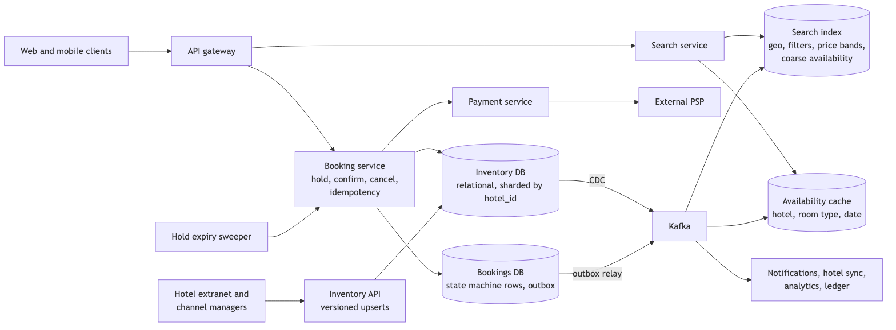

*Vector version: [04-hotel-booking-1-architecture.svg](diagrams/04-hotel-booking-1-architecture.svg)*

Clients enter through the gateway. Search requests go to the search service and its two derived stores.
Booking requests go to the booking service, which writes to inventory and bookings and calls the payment
service. Change data capture on inventory and the outbox relay on bookings both publish to Kafka. The cache,
the index, notifications, hotel synchronisation and the ledger consume from Kafka. Hotels write inventory
through the inventory API. The sweeper runs on a schedule against the booking service.

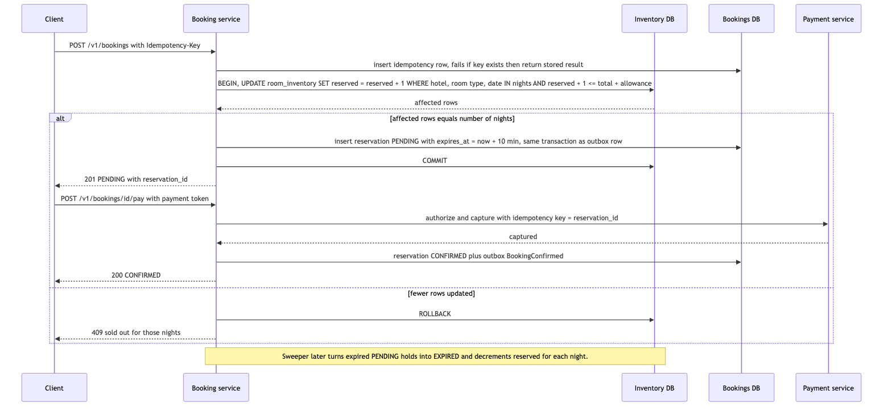

*Vector version: [04-hotel-booking-2-flow.svg](diagrams/04-hotel-booking-2-flow.svg)*

The main flow works as follows. The client sends a booking request with an idempotency key. The booking
service inserts the key; if it already exists, the service returns the stored result and stops. Otherwise it
opens a transaction on the hotel's shard and runs one update that increments the reserved count for every
night of the stay, with a condition that only matches rows where the reserved count plus one is within the
total plus the allowance. It compares the number of rows affected with the number of nights. If they match, it
inserts the pending reservation and its outbox row in the same transaction and commits, and the client
receives a response with a ten-minute hold. The client then submits payment. The booking service calls the
payment service with the reservation ID as the idempotency key, and on success changes the reservation to
confirmed and writes the confirmed event to the outbox. If fewer rows than nights were affected, the
transaction is rolled back and the client receives a sold-out response.

### 4.9 Communication between services

The gateway calls search and booking synchronously over REST, with a 300 millisecond timeout for search and a
two second timeout for booking, because the user is waiting. The booking service reaches inventory through a
database transaction rather than a service call, so that the conditional update and the reservation insert are
one atomic unit. The booking service calls payment synchronously with a timeout of about eight seconds and
no automatic retry, because retrying a payment after a timeout is how double charges occur; a timeout moves the
reservation to a payment-pending state that a resolver handles. Everything after confirmation, meaning email,
hotel notification, analytics and the ledger, is asynchronous over Kafka. Writing a reservation and then
publishing an event is not atomic, which is why the event is written to an outbox table in the same
transaction and published by a relay.

### 4.10 Deep dives

#### 4.10.1 Preventing the double booking

The options are a read followed by a write with an optimistic version column, selecting the rows for update
and then updating them, a single conditional update, or a lock held in Redis. The criteria are correctness
under contention, how long locks are held, and whether the source of truth enforces the rule. A Redis lock is
rejected because a cache is not a source of truth; if Redis loses the lock, we oversell. Optimistic versioning
is correct, but under contention for the last room it produces retries without benefit. Select-for-update
works, but holds row locks across more round trips, and two transactions locking the same nights in different
orders will deadlock, so it requires a strict lock order by date. I choose the single conditional update:

```sql
UPDATE room_inventory
   SET reserved = reserved + 1
 WHERE hotel_id = ? AND room_type_id = ? AND night IN (?, ?, ?)
   AND reserved + 1 <= total + overbook_allowance;
-- the number of affected rows must equal the number of nights, otherwise ROLLBACK
```

The database serialises the two concurrent updates on the row locks. The second transaction evaluates the
condition against the first transaction's committed count and matches fewer rows, so it rolls back. The cost
is that every night of a booking must be on the same shard, which is why the shard key is the hotel.

#### 4.10.2 Hold, pay, confirm as a state machine

The options are one long transaction that includes the payment call, or a state machine with an expiring
hold. A transaction that waits on a payment provider holds database locks for seconds and fails badly when the
provider times out. I choose the state machine: pending with an expiry, then confirmed, expired or cancelled.
The hold means the traveller keeps the room while entering payment details, and the expiry means an abandoned
attempt cannot block inventory. The cost is that inventory is held for up to ten minutes per abandoned attempt,
which the hotel's overbooking allowance absorbs. The sweeper is idempotent: it only expires rows that are still
pending and past their deadline, and it decrements each night's count once per reservation.

#### 4.10.3 Idempotency

The client generates a key for each booking attempt. The booking service writes the key in the same
transaction as the reservation, under a unique constraint, and stores the response. A retried request after a
timeout returns the same reservation rather than creating a second one. The payment call uses the reservation
ID as its idempotency key, so a retried payment cannot charge twice. Both layers are needed because either call
can time out.

#### 4.10.4 Search and proximity

The search index holds one document per hotel with a geographic point. Proximity search is a geo-distance
query combined with filters, sorted by the ranking the product team defines. For map views, hotels are
pre-grouped by geohash so the common query is a term lookup rather than a radius scan. Availability in the
index is coarse and may be seconds stale, which is acceptable because the booking path re-checks inventory.
Prices in search come from the availability cache or a replica of the rate table; the booking path re-quotes
before payment and shows any difference to the traveller.

#### 4.10.5 Failure handling

If the payment service is slow, holds accumulate until they expire. The traveller sees a message that payment
is being processed and will be confirmed by email. Nothing is confirmed without a payment outcome; booking
fails closed where money is involved.

If an inventory shard is unavailable, bookings for hotels on that shard fail quickly with a clear message,
while all other hotels and all of search continue to work. The inventory database runs with a synchronous
replica and automatic failover, and the old primary is fenced so two primaries cannot exist.

If the availability cache or the index is stale, a traveller may see a room that has just sold out and
receive a sold-out response from the conditional update. This is inconvenient but never incorrect.

If a channel manager sends conflicting totals, the inventory API applies versioned updates where the highest
version wins, and an alarm fires if any row has a reserved count above total plus allowance.

### 4.11 API design

```
GET  /v1/search?city=BKK&checkin=2026-11-12&checkout=2026-11-14&guests=2&lat=&lng=&radius_km=&cursor=
     -> 200 { hotels: [{ hotel_id, name, distance_km, room_types: [{ room_type_id, available, price_total, rate_plan_id, price_valid_until }] }], next_cursor }

POST /v1/bookings            Idempotency-Key: <uuid>
     { hotel_id, room_type_id, rate_plan_id, checkin, checkout, guests, quoted_price_total }
     -> 201 { reservation_id, status: PENDING, expires_at, price_total }
     -> 409 { error: SOLD_OUT } | 409 { error: PRICE_CHANGED, new_price_total }

POST /v1/bookings/{id}/pay   Idempotency-Key: <uuid>
     { payment_token }
     -> 200 { reservation_id, status: CONFIRMED, booking_reference }
     -> 202 { status: PAYMENT_PENDING }

DELETE /v1/bookings/{id}     -> 200 { status: CANCELLED, refund_amount }
GET    /v1/bookings/{id}     -> 200 { ...reservation }
```

The quoted price is sent with the hold request so the server can detect a rate change and return the new
price instead of charging a different amount. Cursors are opaque and encode the sort key and the last ID.

### 4.12 Data model

```
room_inventory (shard key: hotel_id)
  hotel_id, room_type_id, night, total, reserved, overbook_allowance, version
  PK (hotel_id, room_type_id, night)

rate (shard key: hotel_id)
  hotel_id, room_type_id, rate_plan_id, night, price, currency, version
  PK (hotel_id, room_type_id, rate_plan_id, night)

reservation
  reservation_id (PK), hotel_id, room_type_id, rate_plan_id, user_id, checkin, checkout, guests,
  price_total, currency, rate_version, status, expires_at, created_at, updated_at
  INDEX (user_id, created_at), INDEX (hotel_id, checkin), INDEX (status, expires_at)

idempotency_key
  key (PK), reservation_id, response_body, created_at

outbox
  id (PK), aggregate_id, event_type, payload, created_at, published_at
```

Inventory and rate tables are sharded by hotel so that one booking's nights and rates are on one shard and one
transaction covers them. Reservations are keyed by their own ID and indexed by user for the traveller's booking
list, by hotel and check-in date for the hotel's arrivals list, and by status and expiry for the sweeper. The
reservation stores the rate version at which it was quoted, so a later price change by the hotel does not
affect what the traveller pays.

### 4.13 Database choices

For inventory and rates, the options are a relational database, a key-value store, or a document store. The
criteria are multi-row transactions, conditional updates, and sharding by hotel. I choose a managed relational
database such as PostgreSQL or MySQL, because the correctness argument depends on a conditional multi-row
update inside one transaction, and a key-value store would move that logic into application code where it is
harder to get right. The cost is lower write throughput per shard, which the estimates show is not needed.

Reservations use the same relational database, unsharded, because thirty writes per second is well within
one primary's capacity. The table is partitioned by month for archival when it grows large, not for
throughput.

For the search index, the options are the relational database with a spatial extension or a dedicated search
engine. The criteria are geographic queries with many filters at a few thousand per second, and tolerance for
staleness. I choose Elasticsearch or OpenSearch as a derived store rebuilt from events; it is never the only
copy of any data. The cost is that search is eventually consistent, which was already accepted.

For the availability cache, I choose Redis, because access is get and set by key and it avoids running an
additional technology.

### 4.14 Tools and technologies

Kafka is used for events rather than a simple queue, because inventory changes need ordering per hotel, which
partitioning by hotel provides; because several consumers need the same events; and because retention allows
the cache and index to be rebuilt after an incident. The cost is more operational work than a managed queue.

Change data capture is used for inventory, because the inventory API and the booking service both write to
that table and one stream from the database log is more reliable than two application-side publishers. An
outbox table is used for reservations, because the booking service is the only writer and the outbox places
the event in the same transaction as the state change.

gRPC is used between internal services and REST at the gateway. Timeouts are derived from each dependency's
measured p99 latency, and circuit breakers are implemented in the callers.

### 4.15 Metrics and monitoring

The indicators tied to objectives are search p99 latency and availability, booking success rate and p99
latency, and the rate of sold-out responses at booking time, which measures staleness in the search path.

Per component, I monitor cache hit ratio, change-capture and projector lag, index freshness, inventory write
p99 latency and lock wait time, hold-to-confirmation conversion, hold expiry rate, and the count and age of
payment-pending reservations.

Alarms: booking success rate below 99.5% over five minutes pages the on-call engineer. Payment-pending age
above fifteen minutes pages. Projector lag above sixty seconds opens a ticket. Any row with a reserved count
above total plus allowance pages, because it means the inventory invariant has been violated.

### 4.16 Notification and logging

Every request carries a request ID that appears in each service's logs and in Kafka event headers, so one
booking can be traced from the first click to the confirmation email. Booking and payment are logged in full
with card data excluded; search is sampled at one percent. The traveller is informed of each state: held with a
countdown, confirmed with a reference, payment pending with an expected time, or sold out. Hotels receive
confirmed and cancelled bookings through their channel manager within a minute.

### 4.17 CI/CD, cost, operations, and what comes next

Releases are deployed behind a feature flag enabled for one percent of hotels by hotel ID. Because inventory is
sharded by hotel, a faulty release affects a known subset and is rolled back by disabling the flag. Schema
changes follow expand-then-contract.

Backups of the booking and inventory stores are continuous with point-in-time recovery, a recovery point of
seconds, and a recovery time under thirty minutes. A restore into a test environment is performed monthly to
verify this.

The largest costs are the search index and cache fleet, followed by the inventory database shards. The first
cost lever is index document size, and the second is cache time to live.

Search is regional, with the index replicated per region. Inventory and bookings have a single primary in the
hotel's home region with a warm standby elsewhere, because strong consistency on inventory cannot be maintained
across active-active regions without a conflict resolution strategy that this system does not need.

At ten times the scale, search scales by adding index replicas and cache capacity. Booking writes remain
small. The only change is moving hotels with event-weekend demand onto their own shards and adding Kafka
partitions.

---

## 5. Architecture: flight booking system

### 5.1 Problem statement

We are designing flight search and booking for an online travel agency. Unlike hotels, we own no inventory.
Airlines, global distribution systems and NDC aggregators hold the seats and prices, and they change them
independently of us. A traveller searches a route and dates, sees itineraries ordered by price with duplicates
across suppliers shown once, selects one, pays, and receives a ticket. The design must balance price freshness
against the cost of supplier calls, and it must handle two travellers attempting to buy the last seat.

### 5.2 Scope

In scope are search across suppliers, re-pricing, the hold, authorise, ticket and capture booking flow, and
the handling of supplier failures and timeouts. Out of scope are ancillaries, seat maps, post-booking changes,
refunds beyond voiding a failed booking, and any ranking beyond price. The central distinction, which drives
every decision below, is that for hotels we enforce inventory ourselves, while for flights we hold a quote and
the airline holds the truth.

### 5.3 Functional requirements

A traveller searches by origin, destination, dates, passenger count and cabin and receives itineraries with
total prices, cheapest first, with one entry per distinct itinerary even when several suppliers sell it. A
traveller selects an itinerary and sees the current price before paying, with any change clearly shown. A
traveller pays and receives ticket numbers and a booking reference, exactly once. When a supplier fails after
the traveller has committed, the traveller is either ticketed through another supplier for the same flight or
told clearly that the booking failed, and is never left charged without a ticket.

### 5.4 Non-functional requirements

Search returns within two seconds at the ninety-ninth percentile, with partial results permitted, because
supplier latency dominates and most of the market quickly is more useful than all of it slowly. Booking on our
side is available 99.99% of the time; end-to-end latency may reach five seconds at the ninety-ninth percentile
because supplier confirmation is slow and travellers expect to wait. Correctness on booking is absolute: one
reservation and one charge per confirmed booking. Freshness: a price shown in search is at most a few minutes
old for popular routes and is always re-validated before payment. Supplier cost is an explicit requirement:
each call to a metered supplier has a price, so cost per search has a budget.

Ten million searches per day across ten suppliers would be a hundred million supplier calls per day without
caching. The cache hit ratio is therefore not an optimisation; it is the design.

In CAP terms the split is the same as for hotels but with a twist. Our booking state and ledger are CP: a
partition means we stop advancing bookings rather than risk a charge without a ticket. Search is AP: it serves
stale cache, partial results and even results with a supplier missing, because a traveller would rather see most
of the market than an error page. The twist is that the supplier owns the inventory, so even our CP booking path
can only be consistent with what the supplier tells us; the re-price and hold steps are how we convert an
eventually consistent quote into a consistent commitment at the last possible moment.

### 5.5 Design tenets

A search result is a quote, not a hold. Every price is re-validated with the supplier before money moves.

Money moves in two steps, authorise then capture, so that a supplier failure after payment results in a void
rather than a refund.

Every step of a booking is its own transaction with an explicit compensating action, because a distributed
transaction across our database, a supplier and a payment provider is not available.

A supplier timeout is an unknown outcome, never a failure. We ask the supplier what happened before retrying
anything.

Each supplier is isolated behind its own adapter with its own timeout, circuit breaker and budget, so one
supplier's outage reduces the result set rather than causing an outage of ours.

### 5.6 Back-of-the-envelope estimation

Ten million searches per day is about 115 per second on average and about 800 at peak. With ten suppliers,
that is up to 8,000 outbound calls per second at peak if nothing is cached, 1,600 at an eighty percent cache
hit ratio, and 400 at ninety-five percent. These three numbers define the cost discussion.

Bookings at half a percent of searches are 50,000 per day, which is under one per second. Booking throughput
is trivial; booking correctness is the work.

A results cache for the hundred thousand most popular route and date combinations at a few kilobytes each is a
few hundred megabytes, which fits one Redis node with a replica.

**The hard part.** Keeping prices fresh when suppliers charge per call and do not push updates, and avoiding
a double booking or a double charge when a supplier call times out between hold and ticket.

### 5.7 System components and services

The gateway authenticates and applies rate limits. The Search API owns the public contract and the cache
lookup. The Aggregator owns parallel fan-out, normalisation, de-duplication and ranking. One adapter per
supplier owns that supplier's protocol, credentials, timeout, circuit breaker and retry budget. Redis caches
merged results per search and raw results per supplier per search. The offers store keeps recent quotes, their
alternative suppliers, and per-route volatility statistics. A refresher schedules proactive fetches for popular
routes.

The booking service owns the booking saga: re-price, hold, authorise, ticket, capture, with compensating
actions. It owns the idempotency table and the booking step log. The payment service, described in section 6,
authorises, captures and voids. The pending resolver handles bookings whose supplier call timed out by looking
them up at the supplier using our reference. Kafka carries booking events to email, ledger, analytics and
supplier reconciliation.

The booking service handles one booking as follows: check the idempotency key; re-price with the chosen
supplier; if the price changed, stop and ask the traveller to confirm; create the hold with the supplier using
our booking ID as the reference; authorise the card; issue the ticket; capture; and write each transition with
its outbox event in its own transaction.

### 5.8 Architecture and flows

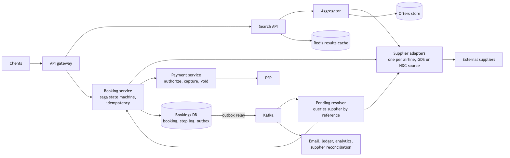

*Vector version: [05-flight-booking-1-architecture.svg](diagrams/05-flight-booking-1-architecture.svg)*

Search traffic flows from the gateway to the Search API, the Aggregator, the adapters and the suppliers, with
Redis beside the Search API and the offers store beside the Aggregator. Booking traffic flows from the gateway
to the booking service, which calls the adapters for hold and ticket and the payment service for authorise,
capture and void, and writes its state and outbox to the bookings database. The relay publishes to Kafka,
which the resolver and the downstream consumers read.

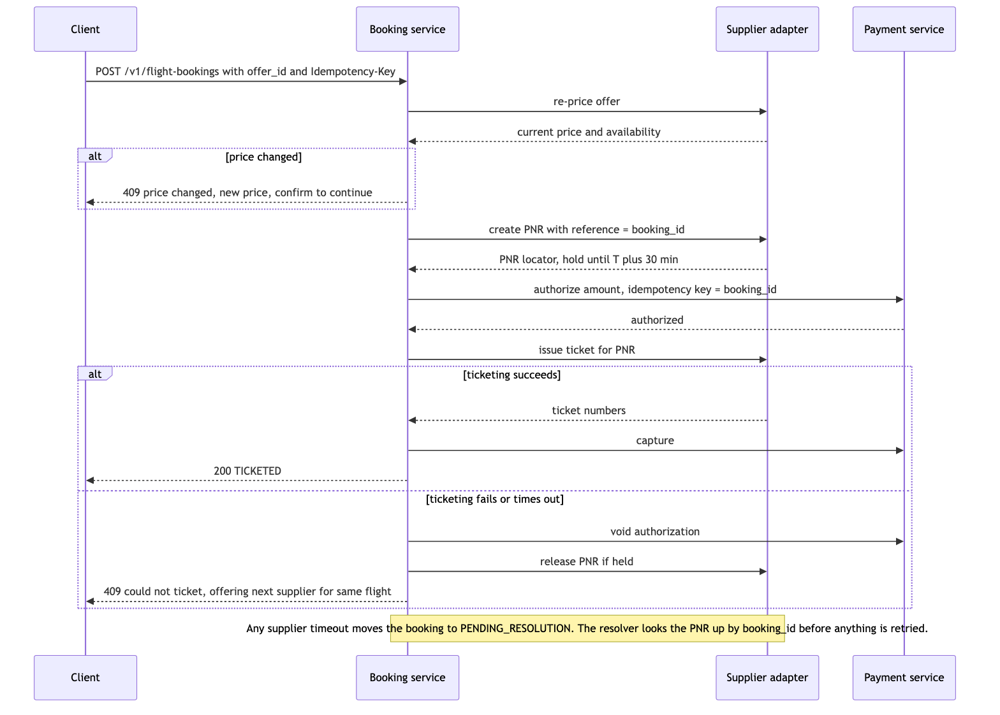

*Vector version: [05-flight-booking-2-flow.svg](diagrams/05-flight-booking-2-flow.svg)*

The booking flow works as follows. The client submits a booking for an offer with an idempotency key. The
booking service re-prices with the supplier. If the price has changed, it returns a 409 response with the new
price and waits for the traveller to confirm. Otherwise it creates the reservation with the supplier, passing
our booking ID as the reference, and receives a record locator and a hold deadline. It authorises the card for
the amount, using the booking ID as the payment idempotency key. It requests ticket issuance from the supplier.
On success it captures the authorisation and returns the ticket numbers. If ticketing fails, it voids the
authorisation, releases the hold, and offers the next supplier's fare for the same flight from the offers
store. If any supplier call times out, the booking moves to a pending-resolution state and nothing is retried
until the resolver has confirmed with the supplier what actually happened.

### 5.9 Communication between services

Search is synchronous from the client through to the adapters. The Aggregator enforces a deadline of about one
and a half seconds, and each adapter enforces its own supplier timeout derived from that supplier's measured
p99 latency. Adapter-to-supplier calls use whatever protocol the supplier provides, often SOAP or NDC XML over
HTTPS, and are retried only when the operation is a read. Booking-to-supplier calls for hold and ticket are
synchronous with a longer timeout of about ten seconds and are never retried automatically. Booking-to-payment
calls are synchronous with idempotency keys and no blind retry. Everything after a state transition is
asynchronous through the outbox and Kafka. Each transition writes its event in the same transaction as the
state change, which avoids the problem of a state change without its event or an event without its state
change.

### 5.10 Deep dives

#### 5.10.1 Freshness against cost

The options are to call suppliers on every search, to cache with a fixed time to live, or to cache with a
per-route time to live plus proactive refresh for popular routes. The criteria are cost per search, the rate at
which displayed prices fail re-pricing, and latency. Calling on every search is correct but unaffordable. A
fixed time to live is either too stale for volatile routes or too costly for stable ones. I choose a per-route
time to live derived from observed volatility, with a random offset, combined with a scheduler that refreshes
the small fraction of routes carrying most searches at an interval based on their volatility and the
supplier's cost per call, and a lock so that a popular key expiring causes one supplier fan-out rather than
hundreds. The cost is lower freshness for rarely searched routes, where traffic does not justify the spend, and
a measurable price-change rate at re-pricing, which is monitored and alarmed.

#### 5.10.2 De-duplication and ranking

A flight is identified by marketing carrier, marketing flight number, departure date and time, origin,
destination and cabin, and an itinerary is the ordered list of its flights. Codeshares stay separate under this
key, because a traveller buying the Lufthansa code and one buying the United code on the same aircraft receive
different tickets, fare rules and loyalty credit; the operating carrier is shown as an attribute. Collapsing
codeshares is possible by switching the key to operating carrier and operating flight number, and I would do
that only if the product asked for it. The same itinerary from several suppliers collapses to one entry with
the lowest total, where total includes taxes and fees normalised to one currency, because suppliers differ in
what they include and comparing base fares would choose incorrectly. Ties are resolved by the supplier's
historical ticketing success rate, then by supplier ID for a deterministic order. Every supplier's offer is
retained in the offers store so that a failed ticketing can fall back to the next supplier without a new
search.

#### 5.10.3 The saga and its compensating actions

The booking is an explicit state machine with the states quoted, priced, held, authorised, ticketed and
captured, and the side states failed, voided and pending resolution. The alternative, a single transaction
spanning all three parties, is not possible. The design work is the table of compensating actions: a failure
after hold releases the hold; a failure after authorisation voids the authorisation; a failure after ticketing,
which is rare because capture almost never fails, triggers a refund and an alert. Each transition is
idempotent so that a replay after a crash is safe. The cost is a more complex model than a single transaction,
in exchange for one that is actually correct.

#### 5.10.4 Idempotency in both directions

From the client to us: an idempotency key per attempt is stored with the booking under a unique constraint,
and a retry returns the stored response. From us to the supplier: our booking ID is sent as the supplier's
reference when the hold is created, and on a timeout the resolver retrieves the reservation by that reference
before deciding whether to retry or compensate. From us to payment: the booking ID is the payment idempotency
key. Where a supplier does not support idempotent creation, a timeout is treated as unknown and the booking
remains pending until the lookup resolves it; it is never retried blindly, because a blind retry produces a
duplicate reservation.

#### 5.10.5 Two travellers and the last seat

We cannot lock the airline's inventory, so both travellers can pass re-pricing and one will fail at hold or at
ticketing. The state machine handles this: the unsuccessful traveller receives a clear failure before capture,
nothing has been charged, and the offers store allows us to offer the same flight from the next supplier
immediately. The guarantee we can give is that nobody is charged without a ticket, not that the seat shown in
search is reserved.

#### 5.10.6 Failure handling

If a supplier is slow, its circuit breaker opens on latency, its fares are omitted from results, and the
search is marked partial. If a supplier is unavailable during ticketing, the booking compensates and falls back
to the next supplier or fails cleanly. If a supplier returns incorrect prices, its price-change rate at
re-pricing rises; this is alarmed and leads to a shorter time to live or a lower rank for that supplier. If the
payment service is unavailable, the booking stays held until the supplier's hold deadline and is then released;
nothing is ticketed without authorised funds. If our database primary fails, a synchronous replica takes over
and the idempotent transitions replay safely. Search fails open when Redis is unavailable, paying supplier
cost for the duration under a concurrency cap. Booking fails closed on any uncertainty about money.

### 5.11 API design

```
GET  /v1/flights/search?from=BKK&to=SIN&date=2026-11-12&pax=2&cabin=Y&cursor=
     -> 200 { offers: [{ offer_id, itinerary: [...segments], total, currency, supplier, price_valid_until }], partial, missing_suppliers, next_cursor }

POST /v1/flights/price        { offer_ids: [...] }
     -> 200 { prices: [{ offer_id, total, available }] }          // batch re-price for the results page

POST /v1/flight-bookings      Idempotency-Key: <uuid>
     { offer_id, passengers: [...], contact, payment_token, accepted_total }
     -> 200 { booking_id, status: TICKETED, record_locator, tickets: [...] }
     -> 202 { booking_id, status: PENDING_RESOLUTION }
     -> 409 { error: PRICE_CHANGED, new_total } | 409 { error: UNAVAILABLE, alternatives: [offer_id] }

GET  /v1/flight-bookings/{id} -> 200 { ...booking with state history }
```

The accepted total is sent with the booking so the server can refuse to proceed if the supplier's current
price differs, rather than charging more than the traveller agreed to.

### 5.12 Data model

```
booking
  booking_id (PK), user_id, offer_id, supplier, flight_key, total, currency, status,
  supplier_reference, record_locator, payment_id, created_at, updated_at
  INDEX (user_id, created_at), INDEX (status, updated_at)

booking_step
  id (PK), booking_id, step, outcome, request_summary, response_summary, started_at, finished_at
  INDEX (booking_id, started_at)

idempotency_key
  key (PK), booking_id, response_body, created_at

offer (offers store, TTL by route)
  offer_id (PK), search_tuple, flight_key, supplier, total, currency, fetched_at, valid_until
  INDEX (search_tuple, flight_key, total)

route_stats
  route (PK), observed_change_rate, last_refreshed_at, refresh_interval, cost_per_call
```

The step log is the audit trail that makes resolution possible. When a booking is pending, the resolver reads
the last step to determine which supplier call was in flight and which reference to look up. The offers store
is indexed by search tuple and flight key so that finding the same flight from the next supplier is one query.

### 5.13 Database choices

Bookings and steps are stored in a managed relational database, because every transition needs a transaction
and a unique constraint on the idempotency key, and the volume is under one write per second. For the offers
store, I use Redis for the hot search cache and a relational table for durable recent offers, because the
fallback query is relational and the cache should not be the only copy of a quote we may need to book. Route
statistics are stored in the same relational database because they are small and are read by the scheduler.

### 5.14 Tools and technologies

Kafka carries booking events for the same reasons given in section 4: ordering per booking, multiple consumers,
and replay. gRPC is used internally and REST externally. Resilience is a circuit breaker per supplier inside
the adapter, timeouts from measured p99 latencies, and retries only on idempotent reads with a random delay and
a per-supplier budget. The scheduler is a simple leader-elected job, which is sufficient at this volume. A
workflow engine such as Temporal would be a reasonable choice for the saga if the team already operates one,
but the saga here is small enough that an explicit state machine in the booking service is easier to understand
and debug.

### 5.15 Metrics and monitoring

The indicators tied to objectives are search p99 latency and partial-result rate, booking success rate, and
the count and age of bookings in pending resolution, which is the first alarm I would page on because it
represents a traveller who may have been charged.

Per supplier, I monitor cost per day, p99 latency, timeout rate, circuit breaker state, hold success rate,
ticket success rate, and price-change rate at re-pricing. For the cache, hit ratio by route tier and lock wait
time. For the funnel, conversion from search to re-price to hold to ticket.

Alarms: pending resolution older than ten minutes pages. Any supplier's cost per day above budget opens a ticket
at eighty percent and pages at one hundred percent. A price-change rate above five percent opens a ticket.

### 5.16 Notification and logging

A request ID follows the booking through every adapter call and every event. Supplier request and response
bodies are logged in full for booking calls, with passenger data redacted, and sampled for search. The traveller
is informed accurately at each state: the new price if it changed, a message that the booking is being
confirmed while pending, ticket numbers on success, or the alternative offered if ticketing failed.

### 5.17 CI/CD, cost, operations, and what comes next

Adapters are deployed independently behind a per-supplier flag, so a new supplier integration starts at one
percent of searches and can be disabled in seconds. Ranking changes run in shadow mode before being served.

The largest cost is supplier calls, followed by the cache fleet. The cost levers are cache hit ratio and the
refresh interval for popular routes, in that order.

Search is regional. Bookings have a single primary with a warm standby, and supplier credentials are per
region where suppliers require it.

At ten times the scale, search cost is the constraint. I would invest in a more precise time to live, route
prefetching and request coalescing before adding capacity. Booking volume remains small.

---

## 6. Architecture: payment gateway with reconciliation

### 6.1 Problem statement

We are designing the internal payment service for Agoda at ten million daily active users. It accepts a
booking's payment, communicates with external payment service providers such as Stripe, Adyen and local
payment networks, records every movement of money, handles refunds, and verifies every day that our records,
the providers' records and the booking systems agree. The term gateway here refers to this internal service,
not to a card processor that we build ourselves.

### 6.2 Scope

In scope are authorise, capture, void and refund against external providers; a ledger; webhook handling;
routing across providers; and reconciliation with discrepancy handling. Out of scope are card processing, card
issuing, fraud scoring beyond calling a vendor, and the finance department's general ledger, which consumes
ours. One compliance constraint shapes the design: we never handle a raw card number. The client tokenises the
card with the provider's SDK, and we handle only tokens, which keeps us out of the most demanding PCI scope.

### 6.3 Functional requirements

A booking service authorises an amount for a customer and later captures or voids it. A booking service refunds
all or part of a captured payment. The system records every money movement so that any amount can be
explained. Provider outcomes that arrive asynchronously, such as 3-D Secure completion, disputes and
settlements, are applied correctly. Every day, for every provider, the system reconciles what we believe
happened with what the provider reports, and presents every difference to finance operations with a
classification.

### 6.4 Non-functional requirements

Availability of 99.99% on authorise and capture, because a payment outage is a booking outage. Latency under
three seconds at the ninety-ninth percentile for authorise, nearly all of which is the provider. Correctness
takes precedence over everything else: never double charge, never lose a payment record, and account for every
unit of currency. Durability with a recovery point of zero for the ledger, because a lost ledger entry is money
that cannot be accounted for. An immutable, auditable history, because finance and regulators require it.

Ten million daily users with one and a half percent transacting is 150,000 payments per day, about two per
second on average and perhaps thirty at peak, plus refunds and webhooks. This is a small system in terms of
throughput. The design is about state correctness, idempotency and reconciliation, not about scale.

### 6.5 Design tenets

Idempotency at both boundaries, ours and the provider's, because either call can time out.

A timeout is an unknown outcome. We ask the provider what happened before doing anything else.

Authorise then capture, aligned with the booking's own hold-then-confirm flow, so that a booking failure after
payment results in a void rather than a refund.

The ledger is append-only double-entry bookkeeping. Balances are derived; no entry is ever modified.

Reconciliation is a product with its own design, not an afterthought. It runs every day, classifies every
difference, resolves the benign classes automatically, and pages for the dangerous ones.

### 6.6 Back-of-the-envelope estimation

Two payments per second on average and thirty at peak, each producing a payment row, one or more attempt rows,
several ledger entries and an outbox row. That is a few hundred rows per second at peak and a few gigabytes per
year of frequently accessed data. One relational primary with a synchronous replica handles this with an order
of magnitude to spare, which is why nothing is sharded and the ledger is partitioned by month only for
archival. Webhooks arrive at roughly the same rate as payments. The daily settlement file per provider has tens
of thousands of lines. None of this is a throughput problem.

**The hard part.** The provider call that times out, where we do not know whether the charge happened, and
proving at the end of each day that three sets of records agree, with a defined response for every way they can
disagree.

### 6.7 System components and services

The payment service owns the payment state machine, the attempt log and the idempotency table, and is the only
component that communicates with providers. The ledger is an append-only table that the payment service writes
in the same transaction as every state change. The provider router selects a provider for each payment based
on currency, country, card scheme and current health. One adapter per provider owns that provider's API,
credentials, timeout and circuit breaker. The webhook receiver verifies signatures, de-duplicates by the
provider's event ID, and applies events through the state machine. The pending resolver finds payments in an
unknown state and queries the provider. The outbox relay publishes payment events to Kafka for the booking
services and the reconciliation service. The reconciliation service ingests settlement files and our ledger,
matches them, classifies differences, and feeds a discrepancy queue for finance operations.

The payment service handles an authorisation as follows: it checks the idempotency key; inserts the payment
and the key in one transaction; inserts an attempt row; calls the provider with the same idempotency key; on a
definite answer, records the attempt outcome, the state transition, the ledger entries and the outbox event in
one transaction; on a timeout, records the attempt as timed out and the payment as pending provider.

### 6.8 Architecture and flows

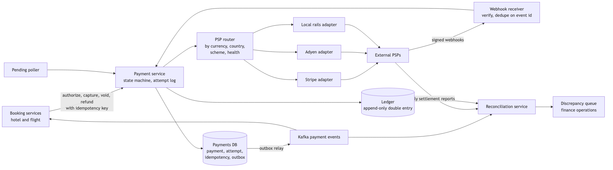

*Vector version: [06-payments-1-architecture.svg](diagrams/06-payments-1-architecture.svg)*

Booking services call the payment service with idempotency keys. The payment service writes to its own
database and the ledger, and calls a provider through the router and the provider's adapter. Providers send
webhooks to the receiver, which feeds the state machine; the poller does the same for anything the webhooks
missed. The outbox relay publishes to Kafka, which booking consumes for outcomes and reconciliation consumes
for its near-real-time pass. Reconciliation also reads the daily settlement reports and the ledger, and writes
to a discrepancy queue that finance operations works through.

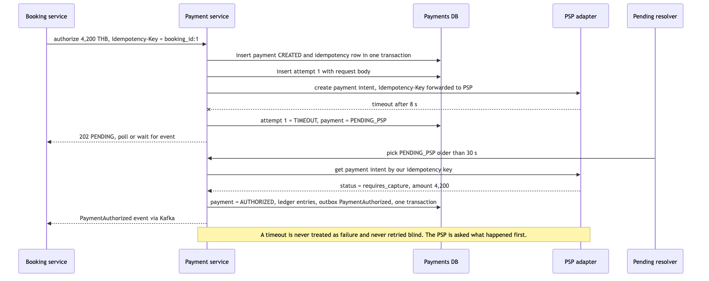

*Vector version: [06-payments-2-flow.svg](diagrams/06-payments-2-flow.svg)*

The flow that matters most works as follows. Booking requests an authorisation with the booking ID as the
idempotency key. The payment service inserts the payment as created and the idempotency row in one
transaction, then inserts an attempt row. It calls the provider, forwarding the same idempotency key. The call
times out. The service marks the attempt as timed out and the payment as pending, and responds to booking that
the outcome is pending. After thirty seconds the resolver picks up the pending payment and asks the provider for
the payment intent by our key. The provider reports that it is authorised. In one transaction the service marks
the payment as authorised, writes the ledger entries and the outbox event, and booking receives the outcome
through Kafka. At no point was the authorisation retried without first asking the provider.

### 6.9 Communication between services

Booking calls payment synchronously over REST or gRPC with idempotency keys, an eight second timeout, and no
automatic retry on timeout; a 202 pending response is a valid outcome that booking must handle. Payment calls
providers over HTTPS with each provider's timeout, with no blind retries on create operations and retries
permitted on reads. Providers call us through webhooks over HTTPS with signature verification, and we also
poll. Payment outcomes to booking and to reconciliation are asynchronous over Kafka through the outbox. At every
state change, the ledger entries, the state and the outbox row are written in one database transaction, so a
state change cannot exist without its event or its ledger entries.

### 6.10 Deep dives

#### 6.10.1 Idempotency at two boundaries

Booking sends a key for each attempt. The payment service inserts it under a unique constraint in the same
transaction as the payment row; a duplicate request returns the stored result. The same key is forwarded to
the provider as its idempotency key, so a retried request cannot produce a second charge at the provider. With
idempotency only on our side, there would be a window where our request reached the provider, the response was
lost, and a retry with a new provider request charged twice. Both layers are required because either side can
time out.

#### 6.10.2 The state machine and the attempt log

The states are created, authorised, captured and settled, with failed, voided, refunded and partially refunded
as branches, and pending provider as the state for an unknown outcome. Every provider call is recorded as an
attempt with a request summary, a response summary and timestamps. The alternative, treating a timeout as a
failure and letting the user retry, is how customers are charged twice, so the unknown outcome is modelled
explicitly. The resolver queries the provider by our key or its intent ID and advances the state. The cost is a
short delay for the user, shown as a processing message, in exchange for never charging twice.

#### 6.10.3 Authorise then capture

We authorise when the hotel or airline hold is created, capture when the booking is confirmed, and void if the
booking fails. Refunds are a separate flow against a captured charge. The alternative, a single charge at
booking time, turns every downstream failure into a refund, with its fees and customer-facing delay. The cost
is a slightly more complex booking flow, in exchange for a system where a charge without a booking is an
incident rather than a routine event.

#### 6.10.4 The ledger

The ledger is append-only double-entry bookkeeping. Every money movement writes balanced entries against
accounts such as customer receivable, provider clearing, revenue, refunds payable, and foreign exchange gain or
loss. Corrections are new entries, never modifications. Balances are sums. The alternative, a status and an
amount on the payment row, cannot answer where the money is at a given moment or why the provider's payout
differs from our captures, which are the questions reconciliation exists to answer. The ledger write is in the
same transaction as the state change, so a payment can never be recorded as captured without its entries.

#### 6.10.5 Reconciliation

The inputs are our ledger and payment states, each provider's daily settlement report listing captures,
refunds, fees, chargebacks and the payout total, and the booking systems' record of what should have been paid.
Matching is three-way, keyed on the provider transaction ID that we stored at attempt time. For every provider
line, we locate our payment and compare amount, currency and status. For every payment we recorded as
captured, we expect a provider line within the settlement window.

The design work is in classifying mismatches rather than merely flagging them. A timing difference, where we
captured shortly before midnight and the provider settles it the next day, resolves automatically on the next
run. A fee variance, where the provider's fee differs from our expectation, is booked to a fee variance account.
A foreign exchange variance, where the provider settled in a different currency, is booked as gain or loss. A
duplicate, where two provider charges exist for one booking, is resolved by automatically refunding one and
raising an alert, because it means idempotency failed somewhere and the cause must be found. A payment missing
on the provider's side, where we recorded a capture and the provider did not, stops the booking from being
treated as paid and raises an alert. A payment missing on our side, where the provider charged and we have no
record, is the most serious case; it usually results from a lost webhook combined with a resolver gap. The
system creates a payment record under investigation, reconstructs what it can from provider data, and pages
the on-call engineer.

The output is a run record per provider per day with totals, and a discrepancy queue with each item
classified. Reconciliation runs as a daily batch over the settlement files and as a near-real-time pass over
webhooks and our own events, because a daily batch alone would find a double charge a day after the customer
did.

#### 6.10.6 Failure handling

If a provider times out, the payment becomes pending and the resolver queries the provider; the customer sees a
processing message. If a provider is unavailable, the router sends new authorisations to another provider, and
in-flight payments stay with their original provider because the token and the payment intent exist there. If a
provider sends inconsistent data, meaning a webhook that contradicts a settlement line, reconciliation
classifies it and a person decides, treating the provider's settlement as authoritative for money and our
ledger as authoritative for intent. If webhooks arrive in bursts or are replayed, the receiver de-duplicates by
event ID and the state machine ignores transitions already applied. If our database is unavailable, the service
returns 503, and booking keeps its hold and retries later with the same key; nothing was started, so nothing is
lost. Payment fails closed in every case: no state advances without a definite answer from the provider.

### 6.11 API design

```
POST /v1/payments/authorize      Idempotency-Key: <booking_id:attempt>
     { amount, currency, payment_token, customer_id, booking_ref, metadata }
     -> 200 { payment_id, status: AUTHORIZED, provider, provider_ref }
     -> 202 { payment_id, status: PENDING_PSP }
     -> 402 { payment_id, status: FAILED, decline_code }

POST /v1/payments/{id}/capture   Idempotency-Key   { amount? }  -> 200 { status: CAPTURED } | 202 PENDING_PSP
POST /v1/payments/{id}/void      Idempotency-Key               -> 200 { status: VOIDED }
POST /v1/payments/{id}/refunds   Idempotency-Key   { amount, reason } -> 200 { refund_id, status } | 202
GET  /v1/payments/{id}           -> 200 { ...payment, attempts: [...], ledger_entries: [...] }

POST /webhooks/{provider}        signed by provider -> 200 always after durable store, processed async
```

Every mutating call carries an idempotency key and may return 202. Callers treat pending as a normal state,
not as an error.

### 6.12 Data model

```
payment
  payment_id (PK), booking_ref, customer_id, amount, currency, status, provider, provider_ref,
  created_at, updated_at
  INDEX (booking_ref), INDEX (status, updated_at), INDEX (provider, provider_ref)

payment_attempt
  attempt_id (PK), payment_id, operation, idempotency_key, request_summary, response_summary,
  outcome, started_at, finished_at
  INDEX (payment_id, started_at)

idempotency_key
  key (PK), payment_id, operation, response_body, created_at

ledger_entry (partitioned by month, append-only)
  entry_id (PK), payment_id, account, direction, amount, currency, posted_at, source_attempt_id
  INDEX (payment_id), INDEX (account, posted_at)

provider_event
  provider, event_id (PK with provider), payment_id, type, payload, received_at, applied_at

reconciliation_run
  run_id (PK), provider, settlement_date, provider_total, ledger_total, matched_count, discrepancy_count, status

discrepancy
  id (PK), run_id, class, payment_id, provider_ref, our_amount, provider_amount, status, resolved_by, notes
```

The attempt table is what makes an unknown outcome resolvable and what finance audits. The ledger is
partitioned by month for archival, not for throughput. The provider event table is the de-duplication record
for webhooks.

### 6.13 Database choices

All of this data is stored in one managed relational database with a synchronous replica. The options were a
relational database, a key-value store for payments with an event store for the ledger, or a dedicated ledger
product. The criteria are transactions spanning payment, ledger and outbox, unique constraints for idempotency,
and auditability. The relational database satisfies all three, and the volume is trivial. An event-sourced
ledger is elegant but adds a technology for no measured need; the append-only table provides the audit property
that is actually required. Data is encrypted at rest, column-level access control applies to anything that
identifies a provider transaction, and no card data is stored anywhere.

### 6.14 Tools and technologies

Kafka carries payment events, because booking, reconciliation and analytics all need the same stream and
replay is valuable after an incident. Provider SDKs are used inside adapters, and provider-specific types never
cross the adapter boundary, so adding or replacing a provider does not affect the state machine. A circuit
breaker and a health score per provider feed the router. Settlement files arrive through the provider's
mechanism, usually SFTP or an API, into object storage with a checksum before reconciliation reads them.

### 6.15 Metrics and monitoring

The indicators tied to objectives are authorise and capture success rate per provider, p99 latency per
provider, the count and age of payments pending provider, and unexplained reconciliation variance.

Per component, I monitor webhook lag and de-duplication rate, resolver backlog, outbox relay lag, routing
decisions per provider, chargeback rate, and cost per transaction per provider.

Alarms: pending-provider age above five minutes pages. Any discrepancy classified as missing on our side pages.
Unexplained variance above a small fixed amount pages. Provider success rate below 98% over five minutes opens
a ticket and shifts routing. Webhook lag above two minutes opens a ticket.

### 6.16 Notification and logging

Every payment carries the booking's request ID and its own payment ID through every attempt, webhook and ledger
entry. Attempt logs retain provider request and response summaries with tokens and personal data redacted.
Finance operations receive the discrepancy queue with classifications and suggested actions; the serious classes
page the payments on-call engineer. Customers see a processing message while a payment is pending and receive a
receipt on capture and on refund.

### 6.17 CI/CD, cost, operations, and what comes next

Provider adapters are deployed independently behind a routing weight, so a new provider receives one percent of
eligible traffic and can be removed by setting its weight to zero. Changes to the state machine are tested in
shadow mode against replayed attempt logs before release.

Backups are continuous with point-in-time recovery, a recovery point of zero through the synchronous replica,
and a recovery time under fifteen minutes. A monthly restore drill re-runs a past reconciliation against the
restored copy to verify it.

The largest costs are provider fees, followed by the engineering time spent on discrepancy handling. The cost
levers are routing by cost where success rates are equal, and automating the resolution of more discrepancy
classes.

The service has a single primary per region with a warm standby. Provider credentials and tokens are bound to a
region, so losing a region means failing over the database and redirecting routing; in-flight pending payments
resolve from the attempt log.

At ten times the scale, the only change is partitioning the attempt table as well as the ledger. The
correctness design does not change.

---

## Using these answers in the interview

In the platform round, I begin with the three most serious problems in the design I am given, present the
structure in section 1 or section 2, and then follow the interviewer's direction into connectivity, testing and
the code review. The code review stays focused on what each problem causes in production, and the corrected
code in section 3 is ready if asked for.

In the architecture round, I state the numbers in the first five minutes so I can say whether the problem is
one of scale or one of correctness. I spend the middle twenty minutes on the single hardest part, which for
these three systems is the double booking, the unknown supplier outcome, and the provider timeout. I close with
metrics and with what changes at ten times the scale.

Every decision is stated in four parts: the options, the criteria, the choice with its reason, and what the
choice gives up.

---

# Appendix

The appendix covers the prompts from the question bank that the six main answers do not and that have no
home elsewhere: the one remaining Staff architecture prompt in the top five, two recent Staff platform
critiques, the Senior-level prompts that appear after a down-level, two short answers for prompts reported
twice, and a one-page sheet for the general platform questions. Prompts that already have a full
seventeen-section answer in the system-design folder are listed in the cross-reference table first, so nothing
in the bank is left without a pointer.

- A0. Where the rest of the question bank is answered
- A1. Architecture: concert ticket booking with a flash-sale opening
- A2. Platform critique: a pre-drawn hotel search design
- A3. Platform critique: the promo service
- A4. Senior architecture: top-K trending hotels
- A5. Senior architecture: multi-source ingestion with approval and bank settlement, and the two reconciliation variants
- A6. Fundamentals sheet for the general platform questions
- A7. Senior architecture: the "X users are viewing this room" counter
- A8. Senior LLD: a shadow-testing framework

---

## A0. Where the rest of the question bank is answered

| Bank prompt | Where the answer is | What to carry over from this document |
|---|---|---|
| S6 ride-sharing (Uber, Lyft) | [27-ride-sharing.md](../system-design/27-ride-sharing.md) | Dispatch owner key and conditional transitions are the same one-owner idea as the seat row in A1 |
| S3, S9, R1, R8, B1–B5 flight search and booking as a standalone design | [26-flight-search-and-booking.md](../system-design/26-flight-search-and-booking.md) | Sections 2 and 5 here are the platform-round and saga views of the same system; 26 is the full seventeen-section walk |
| S9 second half: design YouTube | [11-youtube.md](../system-design/11-youtube.md) | The rejection there was "lack of depth"; lead with the transcoding DAG and the upload flow, not the CDN |
| S11 stock exchange HLD | [25-stock-exchange.md](../system-design/25-stock-exchange.md) | The down-level there was thin NFRs; state latency, throughput and determinism as numbers in the first five minutes |
| R23 and the WhatsApp platform prompt: chat with 1:1, groups, read receipts | [09-chat-system.md](../system-design/09-chat-system.md) | |
| R17 and the 2023 platform prompt: rate limiter with per-provider limits | [01-rate-limiter.md](../system-design/01-rate-limiter.md) | The flat answer reported there was "Redis TTL"; the doc gives the token bucket in Redis with Lua, the local fallback, and why per-provider buckets differ from per-user ones |
| R19 URL shortener | [05-url-shortener.md](../system-design/05-url-shortener.md) | |
| R6 location sharing with time and location restrictions | [14-nearby-friends.md](../system-design/14-nearby-friends.md) for the location fan-out; the restriction rules are a permissions table checked at publish time | |
| R18 distributed scheduler over 500M URL rows; exactly-once payments on Kafka | [06-web-crawler.md](../system-design/06-web-crawler.md) for the URL frontier and politeness; section 6 here for exactly-once | Partition the table by `next_due` bucket, lease a bucket per worker with a heartbeat, and make the hit idempotent on `(id, scheduled_at)` |
| R13 trending songs; R5 trending hotels | A4 here | |
| R4 top-K heavy hitters | A4 here, plus [18-ad-click-event-aggregation.md](../system-design/18-ad-click-event-aggregation.md) for the exact path | |
| S12 car-dealer reconciliation; R10 activity-table reconciliation | 6.10.5 and A5 here | For the vague S12 prompt, the clarifying questions are the answer: which two parties, what is the matching key, what is the interval, who consumes discrepancies |
| B6 hotel review system with external rating jobs; B7 inventory from internal plus external sources | Section 2 here, with the adapters pulling reviews or inventory instead of fares | The dedup key changes; the per-source budget, breaker and freshness policy do not |
| D2 GDPR service performance | A6 database internals plus section 1's projection pattern | Erasure requests are a write path; serve lookups from a projection, batch deletes by partition, and keep an audit of what was erased |
| Platform E: file storage, notification LLD, e-commerce | [12-google-drive.md](../system-design/12-google-drive.md), [07-notification-system.md](../system-design/07-notification-system.md); e-commerce is 4 plus 6 here with a catalogue search from A2 | |
| R21 blocklisted domains, R20 SIM-card number store, R14 multilingual DB, R7 elevator, R11 tag management | Not written; one-paragraph shapes in the note below | |

The five unwritten prompts are small enough to carry as shapes. Blocklisted domains: a Bloom filter sized for
the 30-day list at a one-in-a-thousand false-positive rate shipped to clients, with a definitive check against
the server for positives. SIM-card numbers: pre-generate the 10-digit space in blocks, shuffle within a block,
hand out from a Redis list per block and record sold numbers in a relational table with a unique constraint, so
"unpredictable" comes from the shuffle and "no duplicates" from the constraint. Multilingual database: a
translations table keyed by entity, field and locale with a fallback chain, never a column per language. Elevator:
a state machine per car and a scheduler that assigns calls by direction and distance, with the interesting
part being the request queue as a sorted set per direction. Tag management at 500 reviews a second: a stream
job extracts tags, writes `(hotel, tag, count)` into a store keyed by tag, and "top 10 hotels for good
location" is one sorted-set read per tag.

---

## A1. Architecture: concert ticket booking with a flash-sale opening

### A1.1 Problem statement

We are designing ticket sales for a concert where tickets go on sale at a fixed time and demand far exceeds
supply. A venue has a fixed set of seats, each sold once. Hundreds of thousands of people arrive in the first
minute for perhaps ten thousand seats. A buyer chooses seats, holds them, pays, and receives tickets. The
design must not sell a seat twice, must not collapse under the opening surge, and must treat buyers fairly.

### A1.2 Scope

In scope are the waiting room that absorbs the opening surge, seat selection and hold, payment and
confirmation, and hold expiry. Out of scope are resale, dynamic pricing, and the event management interface.
General admission, where only a count matters, is a simpler case of the same design; I cover assigned seating
because it is the harder one.

### A1.3 Functional requirements

A buyer joins the sale and is told their position and an estimated wait. When admitted, a buyer sees current
seat availability, selects up to a small number of seats, and holds them for a few minutes. A buyer pays and
receives tickets. A hold that is not paid in time is released. A retried request never creates a second hold
or a second charge.

### A1.4 Non-functional requirements

Availability of 99.99% during the sale window, because the window is short and an outage during it is the
whole event's revenue. Admission and hold requests complete within 500 milliseconds at the ninety-ninth
percentile for admitted buyers; the waiting room itself may be slower because buyers are already waiting.
Correctness is absolute: a seat is never sold twice. Fairness is a requirement, not a nicety: the order of
admission is by arrival, and automated buyers must not gain an advantage. The system must handle a spike of
several hundred thousand arrivals in under a minute, which is a thousand times the normal rate for a ticketing
site.

### A1.5 Design tenets

The surge is absorbed before the booking path, not by it. A waiting room admits buyers at the rate the booking
path can serve correctly.

The database decides who holds a seat, with a conditional update on the seat row, because that is the only
place a race between two buyers is resolved reliably.

Every hold expires. Abandoned holds return to the pool within minutes.

Capacity for the sale is provisioned in advance from the known seat count and the admission rate, not
discovered during the sale.

### A1.6 Back-of-the-envelope estimation

Say 500,000 buyers arrive in the first minute for 10,000 seats. That is about 8,000 arrivals per second. The
waiting room must accept that rate; a stateless service in front of Redis does so comfortably, because joining
the queue is one increment and one write.

The booking path does not need to serve 8,000 per second. If each admitted buyer takes about two minutes to
choose and pay, and we want the sale to finish in roughly ten minutes, we admit about 2,000 buyers per minute,
or around 35 per second, with a few seconds of hold activity each. That is a few hundred database writes per
second against one event's seat table, which a single relational primary handles easily. The admission rate is
the control knob: it is set so the booking path is always well inside its capacity.

The seat table for one event is 10,000 rows. The seat map read path, where every admitted buyer looks at
availability, is served from a cache refreshed every second.

**The hard part.** Admitting half a million people fairly without letting them all reach the database, and
resolving two admitted buyers choosing the same seat in the same moment.

### A1.7 System components and services

A content delivery network serves the static event page and holds the surge of page loads away from our
servers.

The API gateway applies per-user and per-IP rate limits and bot checks.

The waiting room service issues signed queue tokens, tracks position, and admits buyers at a configured rate.
Its state is in Redis: the queue position counter, the set of admitted tokens, and the admission counter.

The booking service accepts only requests carrying a valid admitted token. It owns the hold, pay and confirm
state machine and the idempotency table.

The seat inventory database holds one row per seat per event, with status available, held or sold. One event
is one shard.

The orders database holds holds and orders, their state history, and the outbox.

The payment service, described in section 6, authorises and captures.

The seat map read service serves availability snapshots from a cache refreshed from change data capture.

The hold expiry sweeper releases expired holds.

### A1.8 Architecture and flows

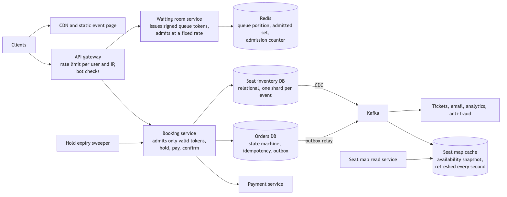

*Vector version: [A1-concert-booking-1-architecture.svg](diagrams/A1-concert-booking-1-architecture.svg)*

Buyers load the event page from the content delivery network. Joining the sale goes through the gateway to the
waiting room, which writes to Redis. Admitted buyers reach the booking service, which writes to seat inventory
and orders and calls payment. The outbox relay and change data capture publish to Kafka; ticket issuance, email,
analytics, anti-fraud and the seat map cache consume from it.

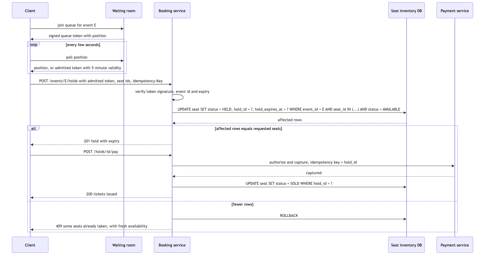

*Vector version: [A1-concert-booking-2-flow.svg](diagrams/A1-concert-booking-2-flow.svg)*

The flow works as follows. The buyer joins the queue and receives a signed token containing their position.
They poll every few seconds. When their position is reached, the waiting room returns an admitted token valid
for five minutes. The buyer submits a hold request with the admitted token, the chosen seat IDs and an
idempotency key. The booking service verifies the token's signature, event and expiry, then runs one update
that changes the chosen seats from available to held with a hold ID and expiry, only where the current status
is available. If the number of rows affected equals the number of seats requested, the hold succeeds and the
buyer proceeds to payment with the hold ID as the payment idempotency key. On capture, the seats are marked
sold. If fewer rows were affected, the transaction is rolled back and the buyer is shown current availability
to choose again.

### A1.9 Communication between services

Joining and polling the waiting room are synchronous and cheap; polling is preferred over a persistent
connection because half a million open connections is a cost with no benefit when a position changes once
every few seconds. Admitted buyers call the booking service synchronously with a 500 millisecond timeout on
hold. The booking service calls payment synchronously with no blind retry, as in section 6. Everything after
confirmation is asynchronous through the outbox and Kafka. The seat map cache is refreshed from change data
capture rather than from the booking service, so the read path never touches the transactional database.

### A1.10 Deep dives

#### A1.10.1 The waiting room

The options are no waiting room with aggressive rate limiting, a waiting room with random admission, or a
waiting room with ordered admission at a fixed rate. The criteria are fairness, the ability to protect the
booking path, and buyer experience. Rate limiting alone turns the opening minute into a lottery of retries that
favours automated clients. Random admission protects the system but is unfair and is seen as such. I choose
ordered admission at a configured rate. Each arrival increments a counter in Redis and receives a signed token
with its position; the admission counter advances at the configured rate, and a buyer whose position is below
the counter is admitted. The token is signed so a buyer cannot forge a better position, and it is bound to the
event and to the buyer's session. The cost is that buyers wait visibly, which is better than failing
invisibly.

#### A1.10.2 Resolving two buyers on the same seat

The options are a Redis lock per seat, a Redis counter per section with the database written afterwards, or a
conditional update on the seat row in the database. A Redis lock is not a source of truth; if Redis loses it,
two buyers hold the same seat. A Redis counter followed by a database write can disagree with the database if
the write fails. I choose the conditional update: the row changes from available to held only if it is still
available, and the database serialises the two buyers on the row lock. The seat map cache may show a seat as
available for up to a second after it was held; the buyer who clicks it receives a clear response and a fresh
map. The cost is that the database is on the hold path, which is acceptable because the admission rate keeps
that path at a few hundred writes per second.

#### A1.10.3 Hold expiry and idempotency

Holds expire after a few minutes. The sweeper changes expired holds back to available, only where the hold ID
still matches, so it cannot release a seat that was re-held by someone else. The hold request carries an
idempotency key stored with the hold, so a retried request returns the same hold. The payment uses the hold ID
as its idempotency key, so a retried payment cannot charge twice.

#### A1.10.4 Automated buyers

The gateway limits requests per user and per IP, and the waiting room requires an authenticated session to
join. Signed tokens prevent position forgery. Purchase limits per account and per payment instrument are
enforced at hold time. Anti-fraud consumes order events asynchronously and can cancel orders after the fact.
None of this stops a determined automated buyer completely; the design aims to remove their advantage in the
queue, which is the part buyers see.

#### A1.10.5 Failure handling

If Redis is unavailable, the waiting room cannot admit anyone. I fail closed here: the sale pauses with a clear
message rather than letting everyone through to the booking path, because an unprotected booking path during
the opening minute would fail for everyone. Redis runs with a replica and automatic failover to make this rare.
If the seat inventory database is slow, hold requests time out and admitted tokens remain valid for their five
minutes, so buyers retry without losing their place. If the payment service is unavailable, holds expire
unpaid and seats return to the pool; nothing is sold without payment. If the seat map cache is stale, a buyer
sees a seat that was just taken and receives a sold-out response from the conditional update, which is
inconvenient and never incorrect.

### A1.11 API design

```
POST /v1/events/{event_id}/queue                       -> 200 { queue_token, position, estimated_wait_s }
GET  /v1/events/{event_id}/queue?token=                -> 200 { position } | 200 { admitted_token, expires_at }
GET  /v1/events/{event_id}/seats                       -> 200 { snapshot_at, sections: [{ id, seats: [{ seat_id, status, price }] }] }
POST /v1/events/{event_id}/holds   Idempotency-Key    { admitted_token, seat_ids: [...] }
                                                       -> 201 { hold_id, expires_at, total } | 409 { error: SEATS_TAKEN, taken: [...] }
POST /v1/holds/{hold_id}/pay       Idempotency-Key    { payment_token } -> 200 { order_id, tickets: [...] } | 202 { status: PAYMENT_PENDING }
DELETE /v1/holds/{hold_id}                             -> 200 { status: RELEASED }
```

### A1.12 Data model

```
seat (shard key: event_id)
  event_id, seat_id, section_id, price, status, hold_id, hold_expires_at, order_id, version
  PK (event_id, seat_id), INDEX (event_id, status), INDEX (hold_expires_at) WHERE status = HELD

hold
  hold_id (PK), event_id, user_id, seat_ids, total, status, expires_at, created_at
  INDEX (user_id, event_id), INDEX (status, expires_at)

order
  order_id (PK), hold_id, user_id, event_id, total, payment_id, status, created_at

idempotency_key
  key (PK), hold_id, response_body, created_at

outbox
  id (PK), aggregate_id, event_type, payload, created_at, published_at
```

One event is one shard, so every hold's seats are on one shard and one transaction covers them. The partial
index on held seats keeps the sweeper's query cheap.

### A1.13 Database choices

Seat inventory and orders use a managed relational database, because the correctness argument depends on a
conditional multi-row update in one transaction, and the write rate after admission control is a few hundred
per second. The waiting room uses Redis, because its operations are counters and set membership at thousands
per second with no durability requirement beyond the sale window; if the queue is lost, the sale pauses and
restarts, which is acceptable where losing a seat record is not. The seat map snapshot is also in Redis, as a
derived copy.

### A1.14 Tools and technologies

Kafka for events, for ordering per event and multiple consumers. A content delivery network for the event page
and seat map images. Signed tokens using a message authentication code with a key held only by the waiting room
and booking services. Change data capture on the seat table to refresh the seat map cache.

### A1.15 Metrics and monitoring

The indicators tied to objectives are admissions per second against the configured rate, hold success rate,
hold p99 latency, and seats sold against seats available over time. Per component, queue length and estimated
wait, Redis latency, seat inventory write p99 and lock wait time, hold expiry rate, payment-pending count and
age. Alarms: hold p99 above 500 milliseconds for one minute pages, because it means the admission rate is too
high for current capacity and should be lowered; any seat with two live holds or two orders pages; payment
pending age above five minutes pages.

### A1.16 Notification and logging

Every request carries the buyer's session and a request ID through the waiting room, booking and payment logs.
Buyers see their position and estimated wait while queued, a countdown while holding, and clear messages when
seats are taken or payment is pending. Confirmed orders produce tickets and an email through the event stream.

### A1.17 CI/CD, cost, operations, and what comes next

The admission rate is a runtime configuration changed without a deployment, which is the primary operational
control during a sale. Capacity for the sale is provisioned ahead of the opening from the expected arrival rate
and tested with a load test that replays a previous sale's arrival pattern. The largest costs are the Redis and
web fleet sized for the opening minute, which are scaled down after the sale. The system is regional per
event, because a venue is in one place. At ten times the scale, meaning five million arrivals, the waiting room
is sharded by event and the admission rate is tuned per event; the booking path does not change, because
admission control keeps its load constant.

---

## A2. Platform critique: a pre-drawn hotel search design

### The problem as given

A high-level design of hotel search is already drawn: clients call a search service, which queries a hotel
database and returns results. The questions are how to add or remove functionality, how to scale it, where to
cache, where to rate limit, and what the trade-offs are.

### Problems with the design as drawn

The search service reads the transactional hotel and inventory database directly. Search is the highest-volume
read path in the system and a database shaped for bookings is not shaped for geographic queries with many
filters. Every popular search becomes a full scan or a poorly selective index lookup on the store that holds
live inventory.

There is no cache, so identical searches for the same city and dates, which are the majority, each cost a
database query.

There is no pagination, so a search for a large city returns thousands of results in one response.

There is no rate limiting, so a partner or a scraper can take down search for everyone.

Availability and price are read at search time from the transactional store, which couples search freshness to
database load.

### Proposed design

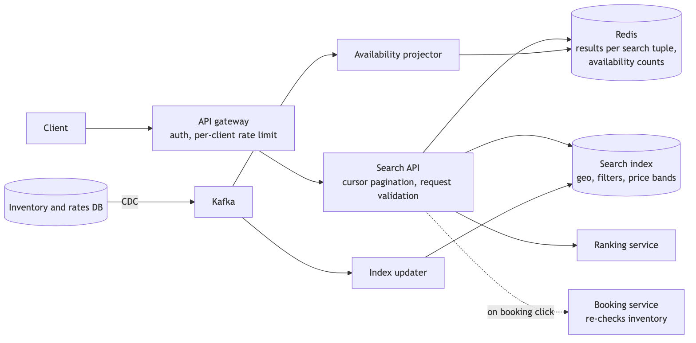

*Vector version: [A2-hotel-search-critique-1-architecture.svg](diagrams/A2-hotel-search-critique-1-architecture.svg)*

Search is served from derived stores. Change data capture on the inventory and rate database publishes to
Kafka. An index updater maintains a search index with one document per hotel containing location, amenities,
price bands and a coarse availability flag per date. An availability projector maintains per-hotel availability
counts in Redis. The Search API validates requests, applies cursor pagination, checks a results cache keyed by
the full search tuple, and otherwise queries the index and the availability counts, calls the ranking service,
and caches the page. The gateway authenticates and rate limits per client. Booking re-checks inventory against
the transactional store, so staleness in search is corrected at the moment it matters.

### The changes I would make, in order

First, move search off the transactional database onto a search index and a cache fed by change data capture.
The cost is a few seconds of staleness, which is acceptable because booking re-checks inventory. This change
removes the largest risk, which is search load affecting booking.

Second, add a results cache keyed by city, dates, guests and the filter set, with a time to live of about a
minute and a lock so that one expiry causes one index query rather than many. Hit ratios for hotel search are
high because most searches are for popular cities on near-term dates.

Third, add cursor pagination over the ranked result, with the cursor encoding the sort key and the last hotel
ID, so that scrolling is stable while data changes.

Fourth, add rate limiting at the gateway per client and per IP, with higher limits for authenticated partners,
so that one caller's load affects only that caller.

Fifth, separate ranking into its own service so that the ranking model can change independently of the index.
Adding a feature such as "sort by distance from a landmark" becomes an index field and a ranking input rather
than a change to the database schema.

### Adding and removing functionality

Adding a filter, such as pet-friendly, is a new field in the hotel document and a new filter clause; the index
updater back-fills it from the source of truth. Adding proximity search is a geo-distance query on the
document's location field, with hotels pre-grouped by geohash for map views. Removing a feature is removing its
filter from the API and leaving the index field in place until the next reindex, so that removal never
requires a synchronous migration.

### Trade-offs stated plainly

Freshness against load: search is seconds stale in exchange for never touching the transactional store.
Cache time to live against accuracy: a longer time to live raises hit ratio and the rate of "sold out at
booking" responses; I set it at about a minute and monitor that rate. Index completeness against cost: a richer
document gives more filters and costs more index storage and reindex time.

### Failure handling

If the index is unavailable, search returns cached pages where they exist and a clear error otherwise; booking
is unaffected. If the projector lags, availability flags are stale and the booking path corrects them. If Redis
is unavailable, search goes directly to the index at higher latency under a concurrency cap. Search fails open
on staleness and fails closed on nothing, because no money moves here.

### Metrics

Search p99 latency, cache hit ratio, index query latency, projector lag, rate-limit rejections per client, and
the rate of sold-out responses at booking time as the measure of acceptable staleness.

---

## A3. Platform critique: the promo service

### The problem as given

A promotion service lets an admin create and update promotions, and lets booking and pricing services evaluate
whether a promotion applies. The design shows an admin client calling a single promo service with one database.
The API includes an endpoint `POST /promo/updatestaus`. The questions are what is wrong and how to improve it.

### Problems with the design as drawn

The API is incorrect and incomplete. `POST /promo/updatestaus` uses POST for an update of an existing resource,
which should be PUT or PATCH on the resource's path, and the endpoint name contains a typo that would become
permanent once clients depend on it. There is no endpoint to create a promotion, no endpoint to read one, and no
list endpoint, so the API cannot be used end to end.

The same service and database serve both the admin write path and the high-volume evaluation path. Every
booking evaluates promotions, so a slow admin query or a schema migration affects pricing for every customer.

There is no gateway, so there is no authentication boundary or rate limiting. Promotions are financial
controls; an unauthenticated update endpoint is a direct loss.

There is a single database with no replication, so one failure removes the ability to price bookings.

There is no idempotency on updates and no versioning, so two admins changing the same promotion overwrite each
other silently, and a retried request can apply a change twice.

Redemption limits, such as a promotion valid for the first thousand bookings, are not addressed. Without an
atomic counter, concurrent bookings exceed the budget.

### Proposed design

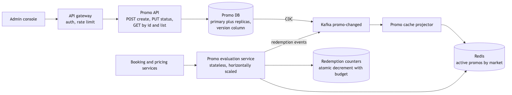

*Vector version: [A3-promo-critique-1-architecture.svg](diagrams/A3-promo-critique-1-architecture.svg)*

The admin console calls the Promo API through a gateway that authenticates and rate limits. The API exposes
`POST /v1/promos` to create, `PUT /v1/promos/{id}/status` to change status, `PATCH /v1/promos/{id}` for other
fields, and `GET` for one or many. The promo database is a relational primary with replicas and a version
column on each promotion. Change data capture publishes promotion changes to Kafka, and a projector maintains a
Redis cache of active promotions by market. A separate, stateless promo evaluation service answers "which
promotions apply to this booking" from the cache and is scaled horizontally for the booking path. Redemption
budgets are atomic counters decremented at redemption time, and redemptions are published as events.

### The changes I would make, in order

First, correct the API: proper verbs on resource paths, a create endpoint, read and list endpoints, a version
in the path, and consistent naming.

Second, split evaluation from administration. The evaluation path is read-heavy, latency-sensitive and on
every booking; the administration path is low-volume and can tolerate slower, stronger consistency. Serving
evaluation from a cache fed by change data capture means an admin operation can never slow a booking.

Third, add the gateway with authentication and per-client rate limits, and require an admin role for mutating
endpoints.

Fourth, replicate the database and route evaluation reads to replicas where the cache misses, so that the loss
of the primary degrades administration but not pricing.

Fifth, add idempotency keys on create and optimistic concurrency on update: the client sends the version it
read, and the update succeeds only if the version matches, returning a conflict otherwise. This prevents two
admins from overwriting each other and prevents a retried request from applying twice.

Sixth, enforce redemption budgets with an atomic decrement in Redis checked at evaluation time, with the
database as the durable record of redemptions written through the booking's outbox. The counter can
over-admit by a small amount if Redis fails over, which is acceptable for a promotion; the alternative of a
database row lock on every booking is not acceptable for latency.

### Where two requests race

Two admins updating the same promotion: the version check rejects the second with a conflict. Two bookings
redeeming the last unit of a budget: the atomic decrement admits one and rejects the other. A retried create:
the idempotency key returns the existing promotion.

### Failure handling

If the promo database is unavailable, administration fails and evaluation continues from the cache with the
last known promotions; this is fail open on administration and fail closed only when the cache is also empty,
in which case no promotion applies, because applying a stale or unknown discount is a financial loss while
applying none is a conversion loss. If Redis is unavailable, evaluation falls back to a replica with a short
local cache. If the projector lags, a newly created promotion takes longer to become active, which is visible
in a lag metric.

### Metrics

Evaluation p99 latency and error rate, cache hit ratio, projector lag, version conflicts per day, redemption
counter rejections, and redemptions against budget per promotion.

---

## A4. Senior architecture: top-K trending hotels

### The problem

Show the top K trending hotels, for example the ten most viewed or most booked hotels in the last hour, per
region, with results refreshed every minute and served with low latency.

### Requirements as numbers

Events are hotel views and bookings. Say twenty million searches per day produce about two hundred million
hotel views, roughly 2,300 per second on average and 10,000 at peak. K is ten to a hundred. Results must be
available within a minute of the events that produced them, and the read path must serve a region's list in
under 50 milliseconds at the ninety-ninth percentile, because it appears on a landing page. Approximate counts
are acceptable for the live list if the error is bounded; exact counts are required for reporting.

### The hard part

Counting the frequency of every hotel in a sliding window at ten thousand events per second, across millions of
distinct hotels, without a memory footprint proportional to the number of hotels, and without a single
aggregation point that becomes a bottleneck.

### The design

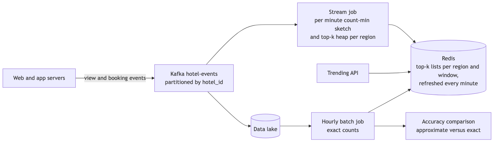

*Vector version: [A4-topk-trending-1-architecture.svg](diagrams/A4-topk-trending-1-architecture.svg)*

Web and app servers publish view and booking events to Kafka, partitioned by hotel ID. A stream processing job,
for example Flink, maintains for each region and each one-minute window a count-min sketch and a small heap of
the top candidates. Every minute it emits the top K for each window, and a serving layer combines the last sixty
one-minute results into the hourly list, which is written to Redis. The trending API reads the list from Redis.
In parallel, events land in the data lake and an hourly batch job computes exact counts, writes them to Redis
for reporting, and compares them with the approximate list to measure error.

### Decisions and alternatives

**Approximate versus exact counting.** The options are an exact hash map per window, which is memory
proportional to the number of distinct hotels per window and is fine at one region but grows with regions and
windows; a count-min sketch, which uses fixed memory and overestimates by a bounded amount; or exact counts
only from a batch job, which is accurate but minutes to hours late. I choose a count-min sketch with a top-K
heap for the live list and an exact batch path for reporting and for measuring the sketch's error. A sketch
with width about 2,700 and depth five gives an error bound of about 0.1% of total events with 99% probability,
in under a megabyte per window. The cost is that the live list can occasionally include a hotel whose count is
slightly overestimated; the heap tracks only candidates, so the sketch error only affects ordering near the
boundary of the top K.

**Sliding window.** The options are one sketch for the whole hour that is reset hourly, which produces a list
that empties on the hour, or one sketch per minute with the hour as the sum of the last sixty. I choose per
minute sketches, because sketches of the same dimensions add element-wise, so the hourly view is a sum of sixty
small sketches and the heap is recomputed from the merged sketch for the candidate set. The cost is sixty times
the memory, which is still small.

**Reducing traffic before counting.** Partitioning by hotel ID means each hotel's events reach one task, so
pre-aggregation per task over a few seconds reduces the event rate by an order of magnitude before any
cross-task merge. The merge is a sum of sketches and a merge of heaps, which is cheap.

**Serving.** The result is a list of at most a hundred IDs per region per window, written to Redis every
minute and read by the API. Hotel names and images are joined from the hotel content cache at read time, so the
trending list stores IDs only and a renamed hotel is reflected immediately.

### Where two requests race

The stream job is at-least-once, so a restart can replay events. Each window's sketch is keyed by window start
and the job's state is checkpointed with Kafka offsets, so a replay rebuilds the same sketch rather than
double-counting. The Redis write is a replace of the whole list under a versioned key, so a reader never sees a
half-written list.

### Failure handling

If the stream job falls behind, the live list is stale by the lag, which is shown to users as "updated N
minutes ago" and alarmed on. If the job fails, Redis retains the last list and the API continues to serve it.
If Redis is unavailable, the API serves a static fallback list computed by the last batch run. If the sketch
and the exact counts diverge beyond the expected bound, the alarm indicates a bug in the job rather than
sampling error.

### Metrics

Stream processing lag, events per second per region, sketch error measured against the batch, Redis write
success per minute, API p99 latency and cache hit ratio. The alarm that matters is lag above two minutes.

---

## A5. Senior architecture: multi-source ingestion with approval and settlement, and the reconciliation variants

### The problem

Transactions arrive from three kinds of sources: a message queue, a MySQL database owned by another team, and
CSV files dropped on an SFTP server. Internal users review each transaction and approve or reject it. Approved
transactions are sent to a bank's SFTP server for settlement. Two related prompts ask for the same ingestion
shape with a different consumer: a log and media store accepting data from APIs, CSV files and events, and a
reconciliation between Agoda's activity records and an external platform's records that detects price
anomalies at an interval.

### Requirements as numbers

Volume is modest: say a hundred thousand transactions per day across all sources, which is about one per
second. The requirements that matter are completeness, meaning every source record is ingested exactly once;
traceability, meaning every transaction can be traced to its source and offset; and correctness of settlement,
meaning a transaction is settled once and only after approval. The settlement file is daily per bank and must be
delivered atomically.

### The hard part

Three sources with three delivery semantics, none of which is exactly once, feeding one review workflow that
must present each transaction exactly once, and an outbound file that must be delivered exactly once to a
system we do not control.

### The design

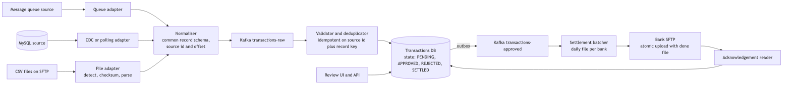

*Vector version: [A5-ingestion-1-architecture.svg](diagrams/A5-ingestion-1-architecture.svg)*

Each source has an adapter whose only job is to read from that source and emit records in a common schema with
a source identifier and a source offset. The queue adapter consumes the queue. The MySQL adapter uses change
data capture if the owning team allows it, otherwise polls by an increasing primary key or timestamp with a
stored watermark. The file adapter watches the SFTP directory, waits for a file to be complete, verifies a
checksum, parses it, and records the file name as the source offset. All adapters publish to a Kafka topic. A
validator consumes the topic, validates each record against the schema, and deduplicates on source identifier
plus record key, writing to the transactions database with a unique constraint. The review API and user
interface read pending transactions and record decisions. Approved transactions are published through an
outbox to a second topic. A settlement batcher builds one file per bank per day, uploads it to the bank's SFTP
with a temporary name, renames it to its final name, and writes a done marker. An acknowledgement reader picks
up the bank's response file and updates transaction status to settled.

### Decisions and alternatives

**One adapter per source.** The alternative is one ingestion service that understands all three sources. The
criteria are isolation and ease of adding a source. I choose one adapter per source, so that a malformed CSV
cannot stop queue consumption and a fourth source is a new adapter rather than a change to the pipeline.

**Normalising into Kafka rather than writing directly to the database.** The alternative is adapters writing to
the database directly. The criteria are replay, back-pressure and separation of parsing from validation. I
choose Kafka, because a validation bug can be fixed and the topic replayed, and because adapters are decoupled
from database availability. The cost is one more component.

**Exactly-once presentation through deduplication, not through source guarantees.** The queue is at least once,
polling can re-read rows, and files can be re-dropped. Instead of relying on any source, the validator writes
each record with a unique constraint on source identifier and record key, and treats a constraint violation as
a duplicate. This is the single rule that makes the review path show each transaction once.

**File handling.** Files are considered complete only when a done marker exists or the file size has been
stable for a period, because a file being written looks like a short file. Each file's checksum and name are
recorded so a re-dropped file is ignored. A file that fails parsing is moved to a quarantine directory and
alarmed, not retried.

**Settlement delivery.** The batcher uploads under a temporary name and renames on completion, because a bank
that reads a half-written file settles half a day. A done marker signals completion where the bank supports it.
The file name embeds the date and a sequence, and the batcher records the file and its transaction IDs before
upload, so a crash during upload is resolved by checking what exists on the bank's server rather than by
uploading again blindly.

### The two variants

**Log and media storage from APIs, CSV files and events.** The same adapter and topic structure applies. The
consumer is a storage service rather than a review workflow: large payloads go to object storage with the
record holding a reference, metadata goes to a relational table, and a search index is built from the topic
for queries. The design question is the same, which is exactly-once ingestion from sources with different
guarantees, and the answer is the same deduplication rule.

**Reconciliation of Agoda's activity table against an external platform's table.** Agoda's table has activity
ID, activity type, currency, price and timestamp; the external platform's table has the same plus an offer ID.
The job runs at an interval, for example hourly, over the window since the last run with an overlap to catch
late records. It joins on activity ID, compares price and currency, and classifies each result: matched;
missing on one side, which may be timing and is re-checked next run before it is reported; price mismatch,
which is reported immediately with both values; and currency mismatch, which is reported as a data error. The
output is a run record with counts and a discrepancy table that a dashboard and an alert read. The design
choice to state is the overlap window: without it, a record that arrives late on one side is reported as
missing and then silently matched later, so the overlap turns timing differences into non-events rather than
alerts. The structure is the same as the reconciliation in section 6.10.5, with two parties instead of three.

### Where two requests race

Two reviewers approving the same transaction: the status update is conditional on the current status being
pending, so the second receives a conflict. A replayed topic: the unique constraint rejects the duplicates. Two
batcher instances: a leader election ensures one builds the file for a given bank and day.

### Failure handling

If a source is unavailable, its adapter stops and the others continue; the watermark or offset means it
resumes without loss. If the validator fails, Kafka retains the records and the validator resumes from its
offset. If the bank's SFTP is unavailable, the batcher retries with backoff and the transactions remain
approved but unsettled, which is visible in a metric. If the acknowledgement never arrives, transactions
remain in a sent state and an alarm fires after the bank's expected turnaround time.

### Metrics

Records ingested per source, duplicates rejected per source, validation failures, pending review count and
age, approved-but-unsettled count and age, settlement files sent and acknowledged per bank, and quarantined
files. The alarms are on age: pending review older than the business's service level, and approved but
unsettled older than one day.

---

## A6. Fundamentals sheet for the general platform questions

Short direct answers to the general questions reported in the platform round that the main sections do not
already cover.

**CAP, strong versus eventual consistency, and consistency across regions.** CAP says that when a network
partition happens, a distributed store has to choose between staying consistent and staying available; the
partition itself is not optional, so the real question is which of the two to give up and for which data. Strong
consistency means every read sees the latest committed write; eventual consistency means reads may be stale for
a bounded period and all replicas converge. I decide per piece of data: inventory, payments and anything with a
uniqueness rule are CP and strongly consistent, because the cost of a wrong answer is money; search results,
counters and feeds are AP and eventually consistent, because the cost of a stale answer is a retry. The follow-up
question is usually PACELC: when there is no partition, I still trade latency against consistency, and that is
where read replicas and caches live. Across regions, the options
are a single write region per piece of data with asynchronous replicas elsewhere, active-active writes with a
conflict rule such as last-writer-wins or a merge function, or a consensus system that pays a cross-region
round trip on every write. For a booking system I choose a home region per hotel: all writes for a hotel go to
one region, reads can be served anywhere with a staleness window, and a writer's own reads are routed to the
home region briefly so they see their own writes. Active-active is reserved for data where conflicts are
harmless, such as user preferences.

**Authentication and authorisation for external clients, and what the API gateway owns.** For partner
systems calling us machine to machine, the options are API keys, OAuth 2.0 client credentials, and mutual
TLS. API keys are simple and are the weakest: a long-lived secret in a header, with no standard expiry or
scope, so I accept them only for low-value read APIs and rotate them. OAuth client credentials give a
short-lived access token scoped to one partner and a small set of permissions, issued by an authorisation
server we run or buy, and revocation is just refusing to issue the next token; this is my default for partner
APIs. Mutual TLS binds the connection to a certificate and is the strongest, but partners have to manage
certificates, so I offer it to those who can. For our own apps, the user signs in once and holds a short-lived
JWT plus a refresh token.

On JWTs specifically: the gateway validates the signature against the issuer's published keys, checks expiry,
audience and issuer, and rejects anything it cannot verify. The token is short-lived, about fifteen minutes,
because a JWT cannot be revoked before it expires; the refresh token is the thing we can revoke. Claims carry
the subject and coarse roles or scopes, never anything sensitive, because a JWT is only signed, not encrypted.
Services behind the gateway still authorise: the gateway answers "who is this" and the service answers "may
they do this to this resource", so a supplier ID always comes from the verified token and never from a query
parameter. The alternative of having the gateway issue tokens as well as verify them is where the friction in
one reported round came from; I keep issuance in an identity service and verification at the edge, so the
gateway holds public keys only.

What the gateway owns: TLS termination, authentication, per-client rate limiting and quotas, request
validation against the published contract, routing and versioning, and request IDs for tracing. What it does
not own: business authorisation, data transformation beyond protocol translation, and anything that needs a
database, because those belong to the service that owns the data and a gateway that holds business logic
becomes a second monolith.

**Load balancers.** A layer-4 balancer routes on IP and port and is fast and protocol-agnostic; a layer-7
balancer reads HTTP and can route by path, header or cookie, terminate TLS, retry idempotent requests, and
apply per-route health checks. I put a layer-7 balancer at the edge because path routing and per-route health
are what I need there, and layer-4 or client-side balancing between internal services where the hop count
matters. Algorithms: round robin for homogeneous stateless services, least outstanding requests when
latencies vary, consistent hashing when a cache or a connection needs to stick to one instance. Health checks
should exercise a dependency-light endpoint so a slow database does not take every instance out of rotation
at once. The balancer itself is made redundant with two instances behind an anycast or DNS front, because an
unreplicated balancer is the single point of failure everyone forgets.

**Local versus global caching.** A local cache lives in the process, responds in microseconds, and is
inconsistent across instances; a global cache such as Redis is shared, responds in about a millisecond, and
gives all instances the same view. I use a local cache for small, hot, slowly changing data such as
configuration and the top few hundred hotels, and a global cache for everything else. For both, the pattern is
cache-aside: read the cache, on a miss read the store and populate. Invalidation is delete-on-write plus a
time to live as a safeguard. A stampede on expiry is prevented by a per-key lock or by serving the stale value
while one request refreshes. A hot key is handled by adding a local cache in front of the global one or by
splitting the key across several copies.

**Redis internals.** Redis executes commands on a single thread, which is why every command is atomic and why
a slow command such as a large key scan blocks everything; network I/O can use additional threads since
version 6. Data structures are chosen per type: strings are simple dynamic strings, hashes and sets use hash
tables with compact encodings for small sizes, sorted sets use a skip list plus a hash table so that rank and
lookup are both logarithmic. Persistence is a point-in-time snapshot, an append-only command log, or both;
replication is asynchronous, so a failover can lose the last few writes, which is why Redis is a cache or a
coordination aid and not the source of truth for money. Redis Cluster splits the key space into 16,384 slots
assigned to nodes; multi-key operations require keys in the same slot, achieved with hash tags. Lua scripts
and transactions give atomic multi-step operations on one node.

**Database internals: indexing and transactions.** A B-tree index makes lookups and range scans logarithmic;
a composite index serves queries that filter on its leading columns in order, so column order matters; a
covering index that includes every column the query needs avoids reading the table. Every index costs write
time and space, so I index for the top queries and no more. Transactions give atomicity and isolation; under
Read Committed a transaction can see different data on repeated reads, under Repeatable Read it sees a
snapshot but can still suffer lost updates and write skew, and Serializable prevents those at the cost of
aborts. For a conditional update such as inventory, I rely on the row lock and the predicate rather than on
the isolation level.

**Transactions across microservices where consistency matters.** There is no reliable distributed
transaction across services. My rule is that data that must be consistent together lives in one service and one
database, so the transaction is local. Across services I use a saga: a sequence of local transactions with a
compensating action for each, driven by an explicit state machine. Each step emits its event through an outbox
in the same transaction, and each consumer is idempotent on a key stored with its work. Where a step calls an
external party, a timeout is an unknown outcome resolved by asking the party, never by retrying blindly.

**Sharding versus federation.** Federation splits a database by function: orders in one database, users in
another, each owned by its service. Sharding splits one table by a key across many databases. Federation
improves isolation and ownership; sharding improves write throughput and storage for one large table. Both
remove cross-database joins and transactions, so queries that need data from two places are served by a read
model built from events. The shard key must have high cardinality, spread load evenly, and appear in the hot
queries; the hard parts are rebalancing when a shard fills and hot shards when one key is popular, which are
handled by pre-splitting into many logical shards and by isolating known hot keys.

**Prometheus and Grafana.** Prometheus pulls metrics from services on a schedule. The metric types are counters
for things that only increase, gauges for current values, and histograms for distributions, from which
percentiles are computed with the histogram quantile function over a rate. Labels partition a metric, and
their cardinality must be bounded, so a user ID is never a label. Recording rules precompute expensive
queries, and Alertmanager routes alerts. Grafana displays the queries as dashboards. I build dashboards around
rate, errors and duration per service and per dependency, and I alert on the rate at which the error budget is
being spent over two windows, a fast one and a slow one, so that both a sudden failure and a slow degradation
page without noise.

**Implementing Strategy, Factory and Singleton.** Strategy is an interface with one implementation per
variant and a registry keyed by the variant, so that the caller selects behaviour without a conditional; the
corrected code in section 3 is an example. Factory is a method that creates the right implementation from a
key, used when construction needs logic; with dependency injection a registry usually replaces it. Singleton is
one instance per process; the correct implementation in Java is to let the dependency injection container
manage the instance, or, without a container, an enum with one value or a static holder class, both of which
are thread-safe by the language's class initialisation rules. I avoid hand-written double-checked locking.

**File and FTP adapters.** An adapter translates an external interface into the shape our system expects. For
files on FTP or SFTP, the adapter polls the directory, treats a file as complete only when a done marker exists
or its size has been stable, verifies a checksum where available, records the file name and checksum so a
re-dropped file is ignored, parses it in a streaming manner so a large file does not exhaust memory, validates
each record against a schema, publishes the records, and moves the file to an archive directory. A file that
fails is moved to quarantine and alarmed. Credentials are keys rather than passwords, rotated, and held in a
secrets store.

**Concurrency and thread safety in Java.** Shared mutable state is the problem; the options are to avoid it with
immutable objects and message passing, to make it atomic with classes such as `AtomicLong` and
`ConcurrentHashMap` that use compare-and-set, or to guard it with a lock. A counter built without library help
is a compare-and-set loop: read the current value, compute the new value, and attempt to write it only if the
current value is unchanged, retrying on failure. Thread pools are bounded, with a rejection policy, because an
unbounded pool under load is how a service runs out of memory. Blocking calls carry timeouts. I prefer
immutable data and a small number of well-understood concurrent collections over custom locking.

**Synchronous and asynchronous communication.** Synchronous when the caller needs the answer to continue;
asynchronous when the work can complete later and must not be lost. Asynchronous work goes through a queue with
at-least-once delivery, idempotent consumers, exponential backoff with a random delay, a dead-letter queue after a
few attempts, and an alarm on the age of the oldest unprocessed message. The database write and the queue
publish are made atomic by a transactional outbox or change data capture.

**Change data capture.** Reading the database's replication log and publishing each committed change as an
event. It gives one ordered stream of truth from a table that several services write, with no change to those
services. The cost is coupling consumers to the table's schema, which I manage by transforming the raw change
into a stable event schema in a projector before other teams consume it.

---

## A7. Senior architecture: the "X users are viewing this room" counter

### The problem

The hotel page shows "12 people are looking at this property right now". It is reported twice in the bank,
once as a backend design and once as a front-end platform question, and the interviewer wants to see whether I
can keep a near-real-time counter cheap, approximately right, and honest.

### Requirements as numbers

Twenty million searches a day lead to perhaps two hundred million property page views, around 2,300 a second
on average and ten thousand at peak, across a few million properties, most of which have nobody looking at
them at any given moment. The counter should reflect arrivals and departures within a few seconds, be read on
every page view, and may be approximate, because the number is a nudge and not a ledger. The one hard
requirement is that it must never be wildly wrong in a way that a user could prove, for instance showing
twelve viewers on a page with one, because that is the kind of thing that ends up in a screenshot.

### The design

Each page view sends a heartbeat every thirty seconds while the tab is open, carrying the property ID and an
anonymous session ID. The counter service writes `ZADD viewers:{propertyId} now sessionId` into Redis, so the
sorted set for a property holds one member per session scored by its last heartbeat. The read is
`ZCOUNT viewers:{propertyId} now-60s +inf`, which counts sessions seen in the last minute. Expiry is free:
either a periodic `ZREMRANGEBYSCORE` on write, or simply counting only recent scores and letting a TTL on the
whole key clean up properties nobody is viewing. The read is served through the page's own API response and
cached for a few seconds per property, so ten thousand views a second become a few hundred Redis reads.

### Decisions and alternatives

**Where the count lives.** The options were a relational row per property incremented and decremented, a
Redis integer incremented on arrival and decremented on departure, or a Redis sorted set of sessions with
timestamps. The criteria were correctness when a departure is missed, which is most departures because tabs
are closed and phones are locked, and cost at ten thousand writes a second. A counter that relies on a
decrement drifts upward forever, since the decrement never arrives, and the relational row is a hot-row
contention problem for no benefit. The sorted set makes the count self-healing: a session that stops
heartbeating simply ages out. What I give up is the memory of one entry per active session, which at a few
hundred thousand concurrent viewers is a few tens of megabytes.

**Approximate versus exact.** The heartbeat interval and the sixty-second window mean the count lags a
departure by up to a minute and double-counts a user with two tabs. That is acceptable. If the product wanted
to cap memory further, a HyperLogLog per property per minute gives a cardinality estimate within two percent in
twelve kilobytes, at the cost of not being able to expire individual sessions; I would start with the sorted
set and move to HyperLogLog only for the handful of properties with thousands of concurrent viewers.

**Honesty.** Show nothing below a threshold of about three, because "1 person is viewing" is both creepy and
verifiably about the user themselves. Round upward in buckets at higher numbers. And never fabricate: the
alternative of a seeded random number is a dark pattern that regulators in several markets have fined.

### Where two requests race

Two heartbeats from the same session are two `ZADD`s on the same member; the later score wins and the count
is unchanged. A read during a write sees either the old or the new score; both are valid. Redis sorted sets
are single-threaded per key, so there is no partial state.

### Failure handling

If Redis is unavailable, the page shows nothing for the widget rather than a stale or made-up number, because
the feature is a nudge and the page is the product. If heartbeats are delayed by a slow client, the count is
briefly low, which is the safe direction. If a bot opens thousands of sessions on one property, the number
spikes; the gateway's per-IP rate limit and a per-property cap on displayed value bound the damage.

### Metrics

Heartbeats per second, Redis write and read p99, the distribution of displayed counts, the fraction of pages
showing the widget, and a sampled comparison of the count against the number of distinct sessions in the
analytics stream for the same minute, which is how I would know the window and interval are tuned right.

---

## A8. Senior LLD: a shadow-testing framework

### The problem

A function `a()` is being replaced by `a_updated()`. We want to run both on real inputs, compare the outputs,
persist the results, and tag every run with a `feature_id` so that one framework serves every migration the
team does. The interviewer walks from a concrete `int f1(int, int)` to generics to persistence, and is watching
for whether the abstraction is introduced when it is needed and not before.

### The shape of the answer, in the order the interviewer walks it

Start concrete. For `int f1(int a, int b)`, the shadow is a function that calls both implementations, compares
the two integers, records a match or a mismatch with the inputs, and returns the old result, because the old
implementation is still the one in production. That is a dozen lines and it is correct; I would say so, and
then say what breaks when the second team wants to use it.

Generalise the types. The inputs become a type parameter `I` and the output `O`, the two implementations are
`Function<I, O>`, and the comparison is a `BiPredicate<O, O>` that defaults to `equals` but can be supplied,
because floating-point outputs, timestamps and lists in different orders need a tolerant comparison. The
result is a small record: the feature ID, a hash or a serialised form of the input, both outputs, whether they
matched, the two latencies, and the time. Exceptions are outputs too: if the new implementation throws and the
old one does not, that is the most important mismatch to record.

Make the shadow safe. The new implementation runs on a separate bounded executor with a timeout so that it
can never slow the production path or exhaust its threads, and the comparison and persistence happen off the
request thread. Sampling is a parameter per feature, because shadowing every call of a hot function doubles its
cost. The framework must never let the new implementation's side effects reach production: the function under
shadow has to be pure, or the new implementation runs against a stubbed dependency, and I would say that
constraint out loud because it is the one that makes or breaks real use.

Persist. Three entities: `feature` with its ID, name, owner, sampling rate and status; `shadow_run` with the
feature ID, a run ID, and when it started and stopped; and `shadow_result` with the run ID, the input
fingerprint, the two outputs, the match flag, the two latencies and the timestamp. Results are written in
batches through a queue to a relational table partitioned by feature and day, because the write rate is the
sampled call rate and nobody needs a result row synchronously. The queries are mismatch rate per feature per
hour, the first N mismatching inputs for a feature so an engineer can reproduce them, and the latency
distribution of new against old.

Decide. A feature flips from shadow to live when its mismatch rate has been below a threshold for a window and
its p99 latency is within budget; the framework exposes that as a report, and the flip itself stays a human
decision behind a feature flag, because the framework cannot know which mismatches are the new code being
right.

### Where two requests race

Two shadow calls for the same input in the same millisecond write two result rows, which is correct, since they
are two observations. Changing a feature's sampling rate while calls are in flight affects only subsequent
calls. A run that is stopped while results are buffered flushes the buffer before marking the run stopped.

### Failure handling

If the new implementation throws, times out or hangs, the old result is returned and the failure is recorded;
the production path never sees it. If the results queue is down, results are dropped with a counter, not
blocked, because losing shadow data is cheaper than slowing production. If the persistence store falls behind,
the queue absorbs it and the dashboard shows lag.

### Metrics

Shadow calls per feature, mismatch rate, exception rate of the new implementation, added latency on the
production path, which should be near zero, dropped results, and queue lag.
