# System Design Notes

A structured set of notes on designing scalable, fault-tolerant systems: how to approach a design problem, the core building blocks (databases, caches, queues, streams, load balancers, blob storage, consistent hashing, Bloom filters, big data processing), and eleven worked case studies that put the building blocks together.

## How to read this document

- Each section starts with the core idea and the simplest working design, then a **Going deeper** block that adds what a Staff or Principal level discussion expects: non-functional requirements and SLOs, the genuinely hard part, failure modes, explicit trade-offs, and how the system is operated and evolved.
- Where a common belief is wrong or only half true, the correct statement is given in place and a short **Note:** explains the misconception (for example, 301 redirects and analytics, TCP teardown, Kafka and the dual-write problem, how circuit breakers really work).
- Where a simpler design is shown first, it is kept and labelled as an approach with its drawbacks, followed by the stronger approach. The point is the trade-off, not the answer.
- Diagrams are Mermaid blocks (rendered by most markdown viewers) or tables and ASCII sketches, each preceded by a short prose description so nothing is lost where diagrams do not render.
- Every section ends with hands-on exercises, including ones that reproduce the failure modes discussed.

## Contents

**Foundations**

1. [What is System Design](#what-is-system-design)
2. [How to Approach System Design](#how-to-approach-system-design)
3. [Knowing You Have Built a Good System](#knowing-you-have-built-a-good-system)

**Databases**

4. [Relational Databases](#relational-databases)
5. [Database Isolation Levels](#database-isolation-levels)
6. [Database Scaling Techniques](#database-scaling-techniques)
7. [Sharding and Partitioning](#sharding-and-partitioning)
8. [Non-Relational Databases](#non-relational-databases)
9. [Picking the Right Database](#picking-the-right-database)

**Caching**

10. [Understanding Caching](#understanding-caching)
11. [Populating and Scaling Caches](#populating-and-scaling-caches)
12. [Caching at Different Levels](#caching-at-different-levels)

**Asynchronous Processing and Messaging**

13. [Message Queues](#message-queues)
14. [Message Streams and Kafka](#message-streams-and-kafka)
15. [Realtime Pub/Sub](#realtime-pubsub)

**Resilience and Scale**

16. [Load Balancers](#load-balancers)
17. [Circuit Breakers](#circuit-breakers)
18. [Data Redundancy and Recovery](#data-redundancy-and-recovery)
19. [Leader Election for Auto-Recovery](#leader-election-for-auto-recovery)

**Communication, Storage and Core Algorithms**

20. [Client-Server Model and Communication Protocols](#client-server-model-and-communication-protocols)
21. [Blob Storage and S3](#blob-storage-and-s3)
22. [Bloom Filters](#bloom-filters)
23. [Consistent Hashing](#consistent-hashing)
24. [Introduction to Big Data Processing](#introduction-to-big-data-processing)

**Design Case Studies**

25. [Designing E-commerce Product Listing](#designing-e-commerce-product-listing)
26. [Designing a Rate Limiter](#designing-a-rate-limiter)
27. [Designing a Notification Service](#designing-a-notification-service)
28. [Designing a Realtime Abuse Masker](#designing-a-realtime-abuse-masker)
29. [Designing Tinder Feed](#designing-tinder-feed)
30. [Designing Twitter Trends](#designing-twitter-trends)
31. [Designing URL Shorteners](#designing-url-shorteners)
32. [Designing PasteBin](#designing-pastebin)
33. [Designing Fraud Detection](#designing-fraud-detection)
34. [Designing a Recommendation Engine](#designing-a-recommendation-engine)
35. [Designing a Web Crawler](#designing-a-web-crawler)


---

# Part 1: Foundations

## What is System Design

System design starts from a set of requirements and, from them, we:

- decide the architecture
- decide the components
- decide the modules

and decide how they interact with each other, all in order to solve the problem. This is almost the same as "product development".

The flow from requirements to a solved problem is shown below.

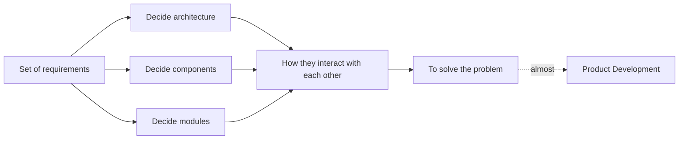

### Why is it so popular?

- Every single "tech" product is a "system" that has been "designed".
- Companies are building products and need you all to design them.

### Why is understanding system design important?

- This is what people do at work.
- Everything is practical.
- You can see it from day 1 of joining a company.
- Once you grow in your career, you will spend 80% of your time doing this.

System design is hence relevant for literally everyone!

### Side effects of system design

- It will make everything else uninteresting.
- You solve real problems, not something made up.
- You learn to break down a problem statement.
- It re-wires your brain to think in a structured way, considering all possible cases to deliver a great user experience!

### What will we do when we design a system?

- Break down the problem statement into solvable sub-problems.
- Decide on the key components and their responsibilities.
- Decide on the boundaries of each component.
- Touch upon the key challenges in scaling it.
- Make our architecture fault tolerant and available.

### Going deeper

#### What a Staff / Principal round actually checks

The list above is enough to draw a working system. At a senior level the interviewer is checking *how you think*, not whether the boxes are right. In plain words, they look for:

- **You drive the ambiguity.** You ask the clarifying questions and state your assumptions out loud, instead of waiting to be told what to build.
- **You pin down the non-functional requirements.** How available (99.9%? 99.99%?), how fast (latency at the 99th percentile, not the average), how consistent, how durable, how big. You turn them into SLOs (Service Level Objectives: measurable targets like "p99 under 200 ms").
- **You estimate, with reasons.** QPS, storage, bandwidth, and what one machine can handle. The numbers should change your design ("10k writes/s means a single primary is fine; 1M means sharding").
- **You find the hard part and go deep there.** Most of the system is standard. One or two pieces are not. Spend your time on those.
- **You present alternatives with explicit trade-offs.** "Option A gives us X, costs us Y; I pick A because..." Not just the one answer.
- **You reason about failure and concurrency.** What happens when a component is slow, down, or two requests race each other? Is the data still correct?
- **You think past day one.** How do we roll it out, migrate data, watch it in production (metrics, alarms), keep the cost sane, and change it later without a rewrite?

The rest of these notes build these habits one topic at a time.

## How to Approach System Design

System design is extremely practical, and there is a structured way to tackle the situations. Take baby steps, no matter what!

### Understand the problem statement

Without having a thorough understanding of the problem at hand, we would easily digress.

### Clarify requirements: functional and non-functional

Before drawing anything, write two short lists.

**Functional requirements** are what the system does: "users can post", "users see a feed". Pick the 3 to 5 that matter and say out loud what you are leaving out.

**Non-functional requirements (NFRs)** are how well it does it. Ask for each one, and if nobody answers, pick a number and state it:

- **Availability target.** 99.9% means about 43 minutes of downtime per month; 99.99% means about 4 minutes. Each extra nine costs a lot more.
- **Latency at p99, not average.** The average hides the slow tail; p99 (the time 99 out of 100 requests beat) is what your unhappy users feel.
- **Consistency.** Strong (everyone sees the latest write) or eventual (they will, soon), and *where*: money and inventory usually strong, likes and feeds eventual.
- **Durability.** Can we ever lose a committed write? For payments, no. For a "last seen" timestamp, a little loss is fine.
- **Read/write ratio.** A feed is 100:1 reads; a logging pipeline is nearly all writes. This alone decides caching vs. write scaling.
- **Scale.** Users, requests per second (QPS), data size, and growth rate for the next 2 to 3 years.

Three terms you will hear (from the Google SRE book):

- **SLI** (Service Level Indicator): the thing you measure, e.g. "fraction of requests under 200 ms".
- **SLO** (Service Level Objective): the target on that measure, e.g. "99.9% of requests under 200 ms over 30 days".
- **Error budget:** the allowed miss, here 0.1%. When you have budget left you ship faster; when it is spent you stop and fix reliability.

### Estimate with back-of-the-envelope numbers

Rough numbers are enough, but each one needs a one-line justification.

- **QPS:** 10M daily users x 20 requests/day / ~100k seconds per day = ~2k QPS average; plan for 3x to 5x at peak.
- **Storage:** 1M posts/day x 1 KB = 1 GB/day, ~365 GB/year, before replicas and indexes.
- **Bandwidth:** QPS x average response size.
- **Per-node capacity:** a single relational primary handles a few thousand writes/s; one web server a few thousand simple requests/s; one Redis node ~100k ops/s. Compare to your numbers.

Why bother: the numbers pick the design for you. 2k QPS on 365 GB fits one primary with replicas. 200k QPS on 100 TB does not, and you need sharding and caching from day one. Say which side of the line you are on.

### Find the hard part

Most of any system is standard: a web tier, a database, a cache. Name the one or two things that make *this* problem non-trivial ("fan-out to 10M followers", "two users swiping at the same instant", "exactly-once payments") and spend most of your time there. Interviewers notice when you spend twenty minutes on the load balancer and two on the hard part.

### Break it down into components (essential)

- **Note:** do not create components for the sake of it.
- **Note:** to start with, create only the components that you know are a must.

**eg:** Design Facebook. When the statement is too big, break it into components/features: Auth, Notification, Feed, Gamification.

The user talks to a gateway (GW), which fans out to the Auth, Notification and Feed components.

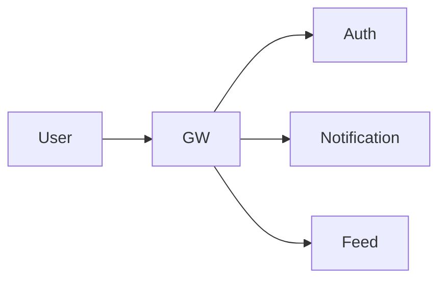

### Dissect each component (if required)

**eg:** Feed might have a generator, an aggregator and a webserver.

Inside the Feed component, the user talks to the Webserver in both directions; the Webserver reads from the Database; the Generator writes into the Database; and the Aggregator also writes into the Database.

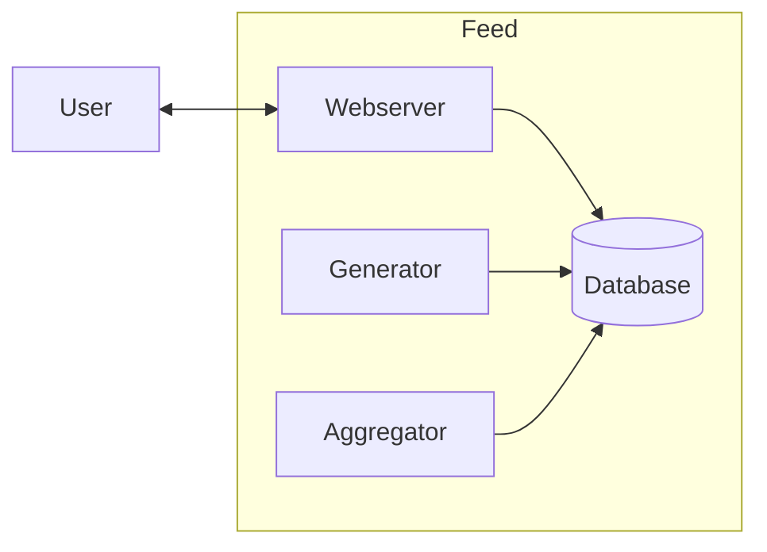

### For each sub-component look into

1. Database and Caching
2. Scaling and Fault Tolerance
3. Async processing (Delegation)
4. Communication
5. Consistency and correctness (what happens when two requests race; can data go wrong)
6. Observability (which metrics, logs and alarms tell us it is healthy)

Repeat this for each sub-component, one by one.

### Articulate trade-offs

For every non-obvious choice, use the same four beats: list the options, state the criteria, pick one, say what you give up.

**Tiny example:** "Feed storage: (a) build the feed on read, (b) precompute on write. Criteria: read latency, write cost, celebrity fan-out. I pick (b) for normal users because reads are 100x writes and must be fast. I give up write efficiency for celebrities, so for accounts over 1M followers I fall back to (a) and merge at read time."

### Walk through failure modes

For each component ask three questions: what if it is **slow**, what if it is **down**, what if it returns **wrong data**? Then say what the user sees and what you do about it.

**eg:** Cache slow: requests pile up waiting on it, so set a tight timeout and fall through to the DB. Cache down: DB takes the full load, so rate-limit or serve a degraded page. Cache returns stale data: acceptable for a feed, not for a balance, so balances skip the cache.

### Add more sub-components if needed

- Understand the scope.
- Decide how other components will talk to this new one.
- Decide on the 6 factors above for this new component.
- Repeat.

Zooming into the Feed Generator: the Merger pulls from the Post service, the Recommendation service and the Follow service (dependencies on other services) and writes into the Feed Database. The user talks to the Webserver in both directions, and the Webserver reads from and writes to the Feed Database.

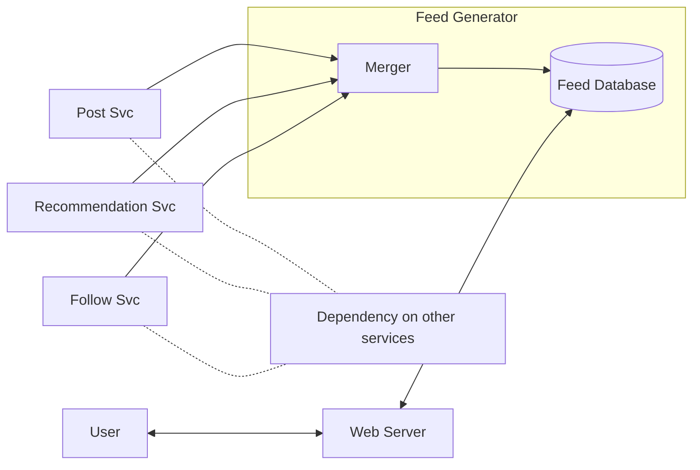

### Evolve and operate it

A design is not done when the diagram is done. Close with how it lives in production:

- **Rollout:** ship behind a feature flag, to 1% of traffic first, with a way to roll back.
- **Migration:** how existing data moves (dual writes, backfill, then cut over) without downtime.
- **Observability:** the 3 to 5 metrics that map to your SLOs (p99 latency, error rate, queue depth, replication lag) and the alarms on them.
- **Cost:** the two or three biggest line items (storage, egress, the biggest fleet) and what you would trim first.
- **Ownership:** which team owns which component, so every alarm has a pager behind it.

### Going deeper

#### Order of operations in a 45-minute round

Roughly: 5 minutes on requirements and NFRs, 5 on estimates, 10 on the high-level picture, 20 on the hard part with trade-offs and failure modes, 5 on rollout and operations. If you run out of time, cut breadth, not the hard part.

#### Say the assumption, then move

Do not stall on unknowns. "I'll assume 100:1 read/write; if it is closer to 1:1 the cache goes away and we shard the writes instead." That one sentence shows you know what the assumption controls.

## Knowing You Have Built a Good System

How do you know that you have built a good system? Every system is "infinitely" buildable, and hence knowing when to stop the evolution is important. Here are some pointers that will help you.

### 1. You broke your system into components

Taking the Feed example: the user talks to the Webserver in both directions, the Webserver reads from the Database, and the Generator and Aggregator write into the Database.


### 2. Every component has a clear (exclusive) set of responsibilities

- **Feed Webserver** serves the feed over HTTP.
- **Feed Generator** pulls data from multiple services (posts, friends, recommendations) and puts them in the DB as candidate feed items.
- **Feed Aggregator** combines the candidate items fetched by the generator, filters out redundant ones, ranks them and creates a final consumable feed.

Clear responsibilities also mean clear **ownership boundaries**: one team owns each component, its data, its API and its pager. If two components write the same table, or nobody can say who is paged when the Aggregator lags, the boundary is not clear yet.

### 3. For each component, you have slight technical details figured out

1. Database and Caching
2. Scaling and Fault Tolerance
3. Async processing (Delegation)
4. Communication

### 4. Each component (in isolation) is

- **Scalable:** horizontally scalable (mostly the data).
- **Fault tolerant:** there is a plan for recovery to a stable state in case of a failure.
- **Available:** the component functions even when some other component "fails".

This is precisely how we would tackle every single system: structured and detailed.

### Going deeper

The four checks above tell you the design is *complete*. The checks below tell you it is *ready to run*. A staff-level answer covers both.

#### 5. Failure modes are written down

For each component: what breaks, what the user sees, what we do about it. One line each is enough.

**eg:** Generator down: no new candidates, the user sees yesterday's feed (acceptable), alarm fires, Webserver keeps serving from the DB. DB primary down: writes fail, reads continue from a replica, promote a replica within minutes.

#### 6. SLOs and an error budget exist

You have named a target ("99.9% of feed loads under 300 ms") and know how much failure that allows (0.1% of requests, about 43 minutes of full outage per month). Without a number, "available" and "fast" are opinions.

#### 7. Observability is designed in, not bolted on

- **Metrics** tied to the SLOs: p99 latency, error rate, and per-component health signals (queue depth, replication lag, cache hit ratio).
- **Logs** with a request id so one user's failure can be traced across components.
- **Traces** across service hops for the slow-request question.
- **Alarms** on the SLO metrics, each with an owner. An alarm nobody acts on is noise.

#### 8. There is a rollout and migration plan

Ship behind a flag to a small slice of traffic, watch the metrics, then widen. For data changes: dual write to old and new, backfill, verify, cut over, keep the old path until you are sure. Every step has a rollback.

#### 9. You have a cost estimate

The two or three biggest line items (the largest fleet, storage with replicas, egress) and a rough monthly number. If the design is 10x more expensive than the value it creates, it is not a good system.

#### 10. Multi-region is at least considered

Say which components are **regional** (web servers, caches, read replicas: one copy per region, close to users) and which are **global** (the source-of-truth database, id generation, user identity: one owner, everyone agrees). Then say what happens when one region is lost: fail over, degrade, or nothing yet, but decided.

#### 11. You can say what changes at 10x scale

"At 10x, the single primary runs out of write capacity, so we shard by user id; the Generator's fan-out to celebrities becomes the bottleneck, so those switch to fan-out on read." Knowing the next bottleneck proves you understand the current design's limits, and it is a strong way to end an interview.


---

# Part 2: Databases

## Relational Databases

Databases are the most critical component of any system. They make or break a system.

In a relational database, data is stored and represented in rows and columns.

### History of relational databases

Everything "revolutionary" starts with financial applications (computers, the internet, blockchain). Computers first did "accounting", which means ledgers, which means rows and columns. Databases were developed to support accounting, hence the key properties were:

1. Data consistency
2. Data durability
3. Data integrity
4. Constraints
5. Everything in one place

Because of these reasons, relational databases provide "Transactions"!

### ACID

- **A** - Atomicity
- **C** - Consistency
- **I** - Isolation
- **D** - Durability

#### Atomicity

All statements within a transaction take effect, or none of them do.

**eg:** publish a post and increase the total posts count in one transaction:

```sql
START TRANSACTION;
INSERT INTO posts VALUES (....);
UPDATE stats SET total_posts = total_posts + 1 WHERE user_id = 100;
COMMIT;
```

#### Consistency

Data will never go incorrect, no matter what. This is enforced through constraints, cascades and triggers.

**eg:** foreign key checks do not allow you to delete a parent row if a child exists (this behaviour can be tuned).

You have the necessary tools to ensure that your data never goes inconsistent, e.g. `total_posts` = total entries in the posts table for the user!

**Note:** the C in ACID is about the rules the database can check (constraints, keys). Application-level rules ("a user can't be on two teams") are still your job; the database only enforces what you tell it.

#### Durability

When a transaction commits, the changes outlive an outage.

How: the change is first appended to a write-ahead log (WAL, a sequential file flushed to disk before the commit is acknowledged), so a crash right after `COMMIT` is replayed from the log on restart.

#### Isolation

When multiple transactions are executing in parallel, the isolation level determines how much of the changes of one transaction are visible to the other.

The sketch shows two transactions, Txn 1 and Txn 2, running side by side; a line in the middle of Txn 1 is linked to a line in Txn 2 with the question: should changes done at this line in Txn 1 be visible to Txn 2 before Txn 1 commits?

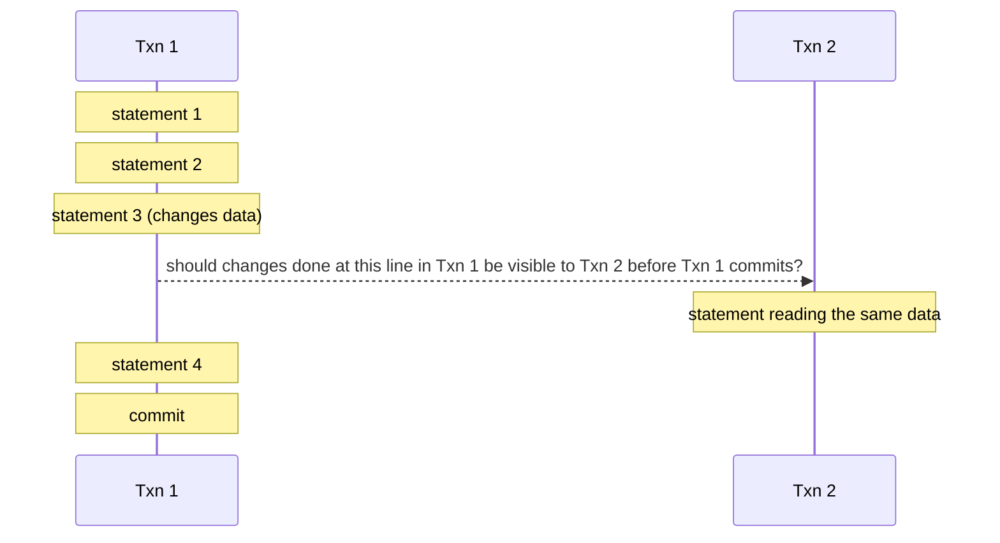

Most relational databases implement isolation with **MVCC** (multi-version concurrency control): every transaction reads a snapshot of the data as of its start, and writers create new row versions instead of overwriting, so readers never block writers and writers never block readers.

### Remember

You pick relational databases for relations and ACID.

### Going deeper

#### Two anomalies that "ACID" does not save you from by default

Isolation is not all-or-nothing. At the default levels (Read Committed in PostgreSQL, Repeatable Read in MySQL) two classic bugs still happen. Both come from "read something, decide, then write" with a gap in between.

**Lost update.** Two transactions increment the same counter.

```
T1: SELECT total_posts FROM stats WHERE user_id = 100;   -- reads 5
T2: SELECT total_posts FROM stats WHERE user_id = 100;   -- reads 5
T1: UPDATE stats SET total_posts = 6 WHERE user_id = 100;
T2: UPDATE stats SET total_posts = 6 WHERE user_id = 100; -- should be 7
```

Both read 5, both write 6. One increment is silently lost.

**Write skew.** A hospital rule says at least one doctor must stay on call. Two doctors, Alice and Bob, both check at the same time.

```
T1 (Alice): SELECT count(*) FROM shifts WHERE on_call = true;  -- sees 2, ok to leave
T2 (Bob):   SELECT count(*) FROM shifts WHERE on_call = true;  -- sees 2, ok to leave
T1: UPDATE shifts SET on_call = false WHERE doctor = 'Alice';
T2: UPDATE shifts SET on_call = false WHERE doctor = 'Bob';
```

Each transaction wrote a different row, so no write conflicts, yet the rule is broken: nobody is on call. The check each one made was invalidated by the other's write.

**Fixes, one line each:**

- **Pessimistic lock:** `SELECT ... FOR UPDATE` locks the rows you read, so the second transaction waits and then re-reads the new value. Works for lost update; for write skew, lock the rows the rule depends on (all on-call shifts).
- **Optimistic concurrency:** add a `version` column; `UPDATE ... SET total_posts = 6, version = 8 WHERE user_id = 100 AND version = 7`. Zero rows updated means someone got there first, so retry.
- **Serializable isolation:** the database detects the conflict and aborts one transaction; you retry. Simplest to reason about, costs throughput and needs retry logic (details in the next section).

For a plain counter, the original `SET total_posts = total_posts + 1` already avoids the problem: the read and write happen in one atomic statement inside the database.

#### When relational starts to hurt at scale

One primary handles a few thousand writes per second and a few TB comfortably. Past that you shard (split rows across machines by a key, e.g. `user_id`), and the first things you give up are exactly the features you chose relational for:

- **Foreign key checks across shards.** Checking that `post.user_id` exists means a network hop to another shard on every insert. Too slow, so the check moves to the application, or is dropped.
- **Cross-shard joins.** A join across shards means pulling data from many machines and merging it (scatter-gather). You denormalize (copy the needed columns) instead.
- **Cross-shard transactions.** Atomic commit across machines needs two-phase commit, which is slow and blocks on failure. You design the shard key so rows that must change together live on the same shard, and use idempotent, retryable steps (sagas) for the rest.

The trade-off in one line: constraints are cheap when all data is on one box and expensive when it is not. Keep the relational model, but pick a shard key that keeps each transaction on one shard, and accept eventual consistency for anything that crosses shards.

### Exercise

1. Set up a SQL database (MySQL or PostgreSQL).
2. Create a schema for a social network: users, posts, profile, photos, following, etc. Define the relationships.
3. Insert data into users and profile in one transaction.
4. Reproduce the lost update with two terminal sessions (read the count in both, then update in both). Fix it once with `SELECT ... FOR UPDATE` and once with a `version` column.
5. Reproduce the on-call write skew at the default isolation level, then run the same two sessions at `SERIALIZABLE` and observe which one is aborted.

## Database Isolation Levels

Relational databases provide ACID guarantees. The I in ACID is "Isolation", and isolation levels help us tune it.

Isolation levels dictate how much one transaction knows about the other. We look at each one of them and understand it with examples.

The sketch is a timeline of two transactions running concurrently on two CPUs: T1 runs on CPU1 while T2 runs on CPU2, and their execution windows overlap in time.

```
time ------------------------------------>
T1   [==========]                 (CPU1)
T2          [==========]          (CPU2)
T1   [========]                   (CPU1)
```

### The anomalies we are protecting against

Each isolation level is defined by which of these it lets through. All examples use two transactions, T1 and T2, overlapping in time.

- **Dirty read:** T2 reads a value T1 has written but not committed. T1 rolls back; T2 acted on data that never existed. *eg:* T1 sets balance to 0 then aborts; T2 saw 0 and declined a payment.
- **Non-repeatable read:** T2 reads a row, T1 updates and commits it, T2 reads the same row again and gets a different value. *eg:* T2 reads price 10, then 12, in the same transaction.
- **Phantom read:** T2 runs a query, T1 inserts or deletes a row that matches it and commits, T2 runs the same query and gets a different set of rows. *eg:* `count(*) WHERE on_call = true` returns 2, then 3.
- **Lost update:** T1 and T2 both read `count = 5`, both write `6`. One increment is gone.
- **Write skew:** T1 and T2 each read the same rows, make a decision, and write *different* rows, so no write clashes, but together they break a rule. *eg:* two doctors both see 2 on call and both go off call; now nobody is on call.

### Repeatable Reads

Consistent reads within the same transaction: even if another transaction committed, the first transaction would not see the changes (if the value was already read).

### Read Committed

Reads within the same transaction always read the fresh (latest committed) value.

**Con:** multiple reads within the same transaction are inconsistent.

### Read Uncommitted

Reads even uncommitted values from other transactions: the "dirty read".

### Serializable

Transactions behave as if they ran one after another. How this is achieved depends on the storage engine: in MySQL InnoDB every plain `SELECT` becomes a locking read (shared lock), so while one transaction reads, writers to those rows have to wait. PostgreSQL instead uses Serializable Snapshot Isolation (SSI): reads take no locks, the database tracks read/write dependencies between transactions, and if a pattern that could not happen in a serial order is detected it aborts one transaction with a serialization failure, which the application must retry.

**Note:** "Serializable means every read locks" is only true for InnoDB. In PostgreSQL nothing blocks; you get an abort instead, so code running at Serializable must be written to retry.

**Note:** storage engines can alter the implementation of isolation levels, so read the documentation before you alter them.

### Isolation level vs anomaly (SQL standard view)

| Level | Dirty read | Non-repeatable read | Phantom read | Lost update / write skew |
|---|---|---|---|---|
| Read Uncommitted | allowed | allowed | allowed | allowed |
| Read Committed | prevented | allowed | allowed | allowed |
| Repeatable Read | prevented | prevented | allowed | write skew allowed (see engine notes) |
| Serializable | prevented | prevented | prevented | prevented |

The standard only talks about the first three columns. Lost update and write skew are the ones that actually bite in production, and the standard leaves them to the engine.

### Going deeper

#### MVCC and snapshot isolation in a few lines

Most engines (PostgreSQL, InnoDB, Oracle) implement isolation with **MVCC** (multi-version concurrency control). A write does not overwrite the row; it creates a new version stamped with the writer's transaction id. Each transaction gets a **snapshot**: it sees only versions committed before it started (or before each statement, at Read Committed). So:

- readers never block writers and writers never block readers;
- Repeatable Read is "one snapshot for the whole transaction", Read Committed is "a fresh snapshot per statement";
- old versions are garbage collected later (PostgreSQL `VACUUM`, InnoDB purge). Long-running transactions keep old versions alive and bloat the table.

Snapshot isolation prevents dirty and non-repeatable reads for free, but it does *not* stop write skew: both transactions read the same clean snapshot and write disjoint rows.

#### Engine differences that matter

- **Default level differs.** MySQL InnoDB defaults to Repeatable Read; PostgreSQL defaults to Read Committed. Same SQL, different behaviour.
- **InnoDB Repeatable Read** uses gap locks (locks on the *range* between index entries) on locking reads and writes, so it prevents most phantoms that the standard says it may allow. Plain `SELECT`s still read from the snapshot.
- **PostgreSQL Repeatable Read** is snapshot isolation. No phantoms in plain reads, but write skew is possible. It also aborts a transaction that tries to update a row already changed by a concurrent committed transaction, which stops lost updates.
- **InnoDB Repeatable Read does not stop lost update** on a read-then-write: both snapshots read 5, both `UPDATE ... SET count = 6` succeed. Use `SELECT ... FOR UPDATE` or an atomic `SET count = count + 1`.
- **Serializable:** InnoDB locks, PostgreSQL detects and aborts (see above).

#### Practical guidance

- The default level is fine for the vast majority of queries. Do not raise it globally; the cost is throughput and deadlocks or retries everywhere.
- For the few critical paths (money, inventory, "at least one on call"), choose one:
  - **Explicit locks:** `SELECT ... FOR UPDATE` on the rows the decision depends on. Simple, blocks concurrent writers.
  - **Optimistic concurrency:** a `version` column and a compare-and-set update (`WHERE id = ? AND version = ?`); zero rows affected means retry. No blocking, good when conflicts are rare.
  - **Serializable for that transaction only** (`SET TRANSACTION ISOLATION LEVEL SERIALIZABLE`), with a retry loop.
- Keep transactions short. Long transactions hold locks or pin old row versions, and both hurt everyone else.
- Never hold a transaction open across a network call to another service.

### Exercise

1. Open two sessions against PostgreSQL. In session 1, `BEGIN` and read a row. In session 2, update and commit that row. Read again in session 1 at Read Committed, then repeat at Repeatable Read, and note the difference.
2. Reproduce the on-call write skew at each engine's default level. Then set both sessions to `SERIALIZABLE` in PostgreSQL and observe the serialization failure; do the same in MySQL and observe the lock wait instead.
3. Fix the lost update three ways: `SELECT ... FOR UPDATE`, a `version` column, and an atomic `count = count + 1`. Decide which you would use on a hot counter and why.

## Database Scaling Techniques

Databases are the most important component of any system out there. They make or break any system. Hence, it is critical to understand how to scale them.

**Note:** these techniques are applicable to most databases out there, relational and non-relational. Read your DB documentation.

### Vertical Scaling

- Add more CPU, RAM and disk to the database.
- Requires downtime during the reboot.
- Gives you the ability to handle "scale", i.e. more load.
- Vertical scaling has a physical hardware limitation.

The sketch shows a small database node being replaced by a bigger one.

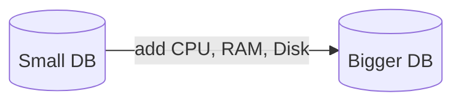

### Horizontal Scaling: Read Replicas

- Used when read : write = 90 : 10.
- You move reads to another database so that the "primary" is free to do writes.
- API servers should know which DB to connect to in order to get things done.
- Read replicas do not help a write-heavy load. Every write still lands on the primary, and then on every replica too. For write scale you shard (see below and section 07).

The API server writes to the Primary and reads from the Replica; changes flow from Primary to Replica through SYNC/ASYNC replication.

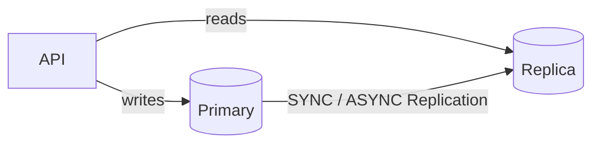

### Replication

Changes on one database (the Primary) need to be sent to the Replica to maintain consistency. There are two modes of replication, plus a common middle ground.

#### 1. Synchronous replication

- Strong consistency
- Zero replication lag
- Slower writes
- If the replica is down or slow, writes stall or fail (you traded availability for consistency).

The write (W) from the user goes to the API, then to the Primary, and the Primary forwards it to the Replica; the acknowledgement travels back along the same path only after the Replica has acknowledged.

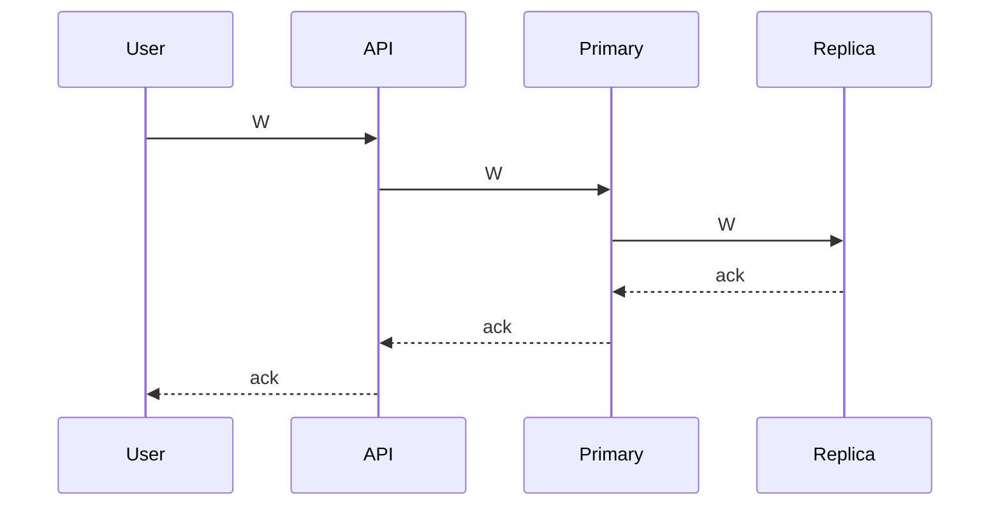

#### 2. Asynchronous replication

- Eventual consistency
- Some replication lag
- Faster writes
- If the primary dies, writes that had not reached a replica yet are lost.

The write (W) goes from the user to the API to the Primary, which acknowledges immediately; the Primary and Replica then sync in the background.

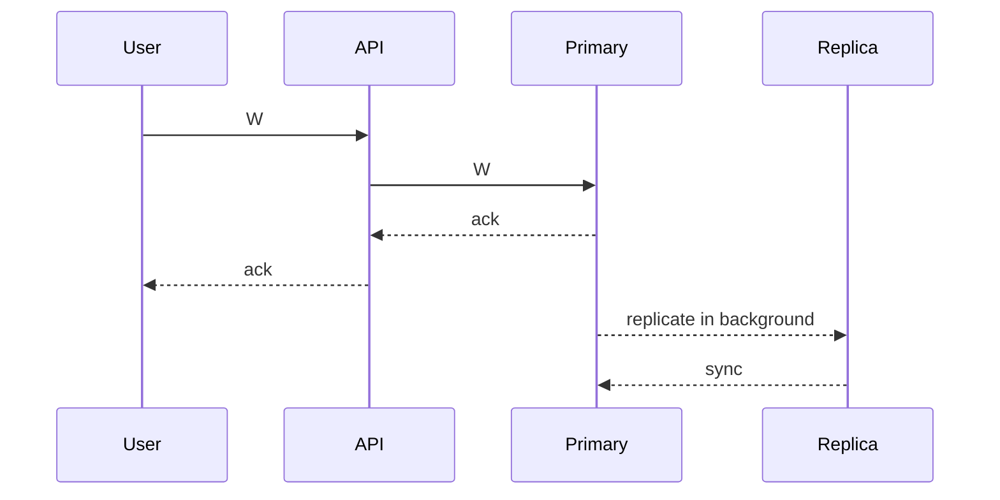

#### 3. Semi-synchronous replication

- The primary waits for **at least one** replica to acknowledge, then replies. The rest of the replicas catch up asynchronously.
- You get "the write exists on two machines" durability without paying for the slowest replica.
- This is the common production middle ground (MySQL semi-sync, PostgreSQL `synchronous_standby_names` with one standby).

### Horizontal Scaling: Sharding

Because one node cannot handle the data/load, we split it into multiple exclusive subsets. Writes on a particular row/document will go to one particular shard. This way, we scale our overall database load.

- **Note:** shards are independent; there is no replication between them.
- The API server needs to know whom to connect to, to get things done.
- **Note:** some databases have a proxy that takes care of routing.
- Each shard can have its own replica (if needed).
- Sharding is what actually scales writes. The hard part is not the first split, it is **resharding** later (moving data when you add shards) while the system stays live. Section 07 covers this.

The API server connects to each of Shard 1, Shard 2 and Shard 3 directly.

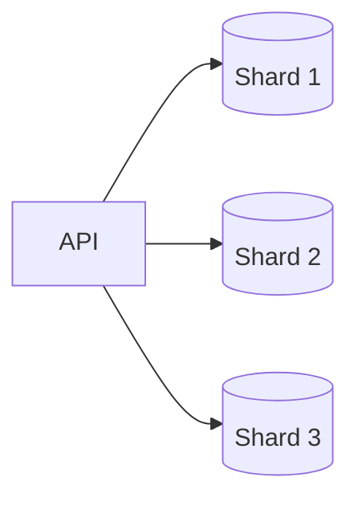

### Going deeper

#### Replication lag and what it does to users

With async replication, a replica is a few milliseconds to a few seconds behind. Two classic bugs:

- **Read-your-own-writes.** A user updates their profile, the page reloads from a replica, and the old profile is shown. Fixes: route that user's reads to the primary for a few seconds after a write, or send a version (the primary's log position) with the read and only serve from a replica that has caught up to it.
- **Monotonic reads.** A user refreshes twice, hits two different replicas, and sees a comment appear and then disappear. Fix: stick a user (hash of user id) to one replica so they never go "back in time".

Measure replication lag and alarm on it. Lag over a few seconds usually means a replica is unhealthy or the primary is overloaded.

#### Failover

- When the primary dies, one replica is **promoted** to be the new primary and the API servers (or a proxy / DNS name) are pointed to it. Pick the replica with the most recent log position.
- In async mode, any writes the old primary acknowledged but never replicated are **lost** on promotion. This is the real cost of async replication, and why semi-sync exists.
- **Split-brain:** the old primary was only slow, not dead. It comes back and both nodes accept writes, so the data diverges. **Fencing** prevents this: the old primary is shut off (kill its process, revoke its storage access, or reject writes carrying an old leader number) before the new one starts taking writes.

#### Consensus in one line

Databases and orchestrators pick a primary safely using a consensus protocol (Raft or Paxos): a majority of nodes must agree on who leads, so two primaries cannot be elected at the same time. Section 19 goes further.

#### Quorums: consistency without a single primary

Leaderless stores (Dynamo, Cassandra) let any node accept a write and instead keep N copies of each key. A write is acknowledged after W copies confirm, a read asks R copies and takes the newest value. If **W + R > N**, at least one node in every read has the latest write, so you get consistency without a primary. Example: N=3, W=2, R=2. Lower W or R for speed, raise them for safety.

#### Trade-offs

- Sync vs async replication: sync gives zero lag and no data loss on failover, async gives fast writes and stays up when a replica is down. Most systems pick semi-sync as the compromise.
- Read replicas vs sharding: replicas are easy and fix read load, sharding is operationally heavy and fixes write load and storage. Do replicas first, shard when writes or data size force you.

### Exercise

1. Configure one MySQL as a replica of another.
2. Put some data in and see the replication happening.
3. Write a small API service that has two connection objects: one to the primary and one to the replica.
4. Depending on the request, make the call to either the primary or the replica.
5. Implement sharding by spinning up two DBs: one handling keys (a to m), the second handling keys (n to z).
6. Write an API service that routes a request to one of them depending on the key.
7. Add an artificial delay to the replica and reproduce the read-your-own-writes bug. Then fix it by routing the writing user's reads to the primary for a few seconds.
8. Kill the primary mid-write with async replication on. Promote the replica and count how many acknowledged writes were lost. Repeat with semi-sync.

## Sharding and Partitioning

- **Sharding:** a method of distributing data across multiple machines.
- **Partitioning:** splitting a subset of data within the same instance.

### How is a database scaled?

A database server is just a database process (mysqld, mongod) running on an EC2 machine, and we represent it as a single database cylinder.

The sketch shows a virtual server (EC2 machine) exposing port 3306, which is forwarded to the MySQL process running inside it.

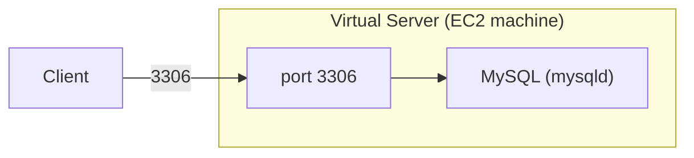

You put your database in production, serving real traffic: users talk to a fleet of API servers, which talk to one database handling 100 WPS (writes per second).

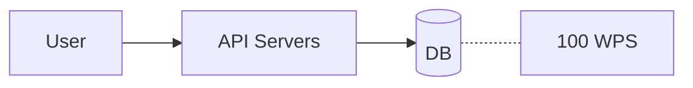

You are getting more users, so many that your DB is unable to manage. You scale up your DB, giving it more CPU, RAM and disk. The bigger database now handles 200 WPS.

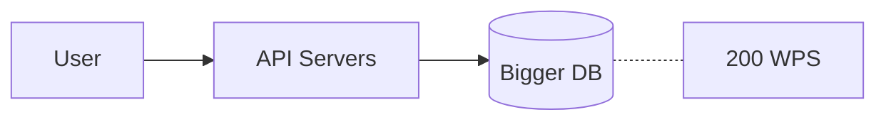

The next step: a bulkier server + a read replica.

Your product went viral and your bulky database is unable to handle the load, so you scale up again. The even bigger database now handles 1000 WPS.

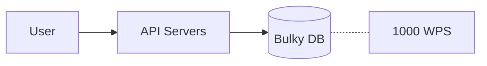

But after a certain stage you know you would not be able to scale "up" your DB, because **vertical scaling has a limit**. So, you will have to resort to horizontal scaling.

Say one DB server was handling 1000 WPS and we cannot scale up beyond that, but we are getting 1500 WPS. We scale horizontally and split the data: the API servers now talk to two databases, each holding 50% of the data and serving 750 WPS.

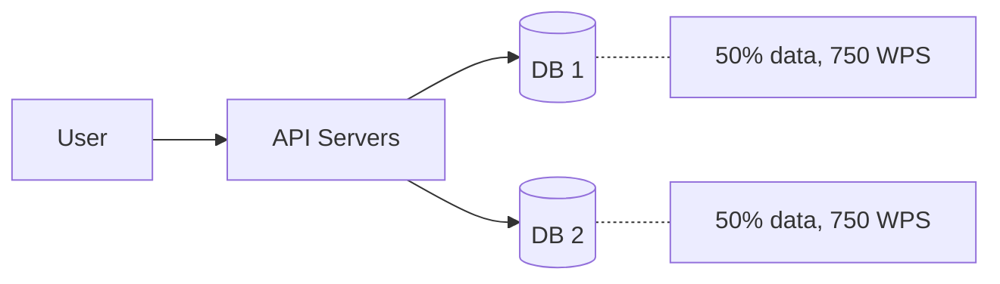

By adding one more database server, we reduced the load to 750 WPS on each node and thus handled a higher throughput.

Each database server is thus a **shard**, and we say that the data is **partitioned**. Overall, a database is sharded while the data is partitioned (split across). This is an oversimplification; most people use the terms interchangeably.

### Partitions vs shards

You partitioned the 100 GB of total data into 5 mutually exclusive partitions: A (30 GB), B (10 GB), C (30 GB), D (20 GB) and E (10 GB).

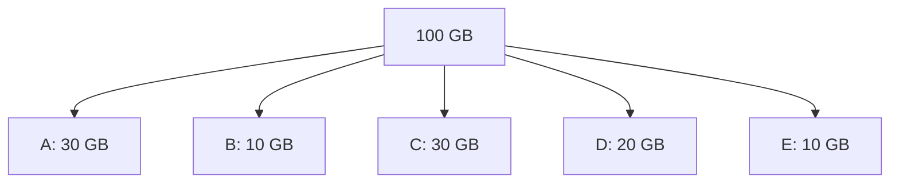

Each of these partitions can either live on one database server, or a couple of them can share one server. This depends on the number of shards you have.

In the sketch, the 5 partitions of our 100 GB dataset are distributed across 2 shards: partitions A (30 GB) and C (30 GB) go to Shard 1, while partitions B (10 GB), D (20 GB) and E (10 GB) go to Shard 2.

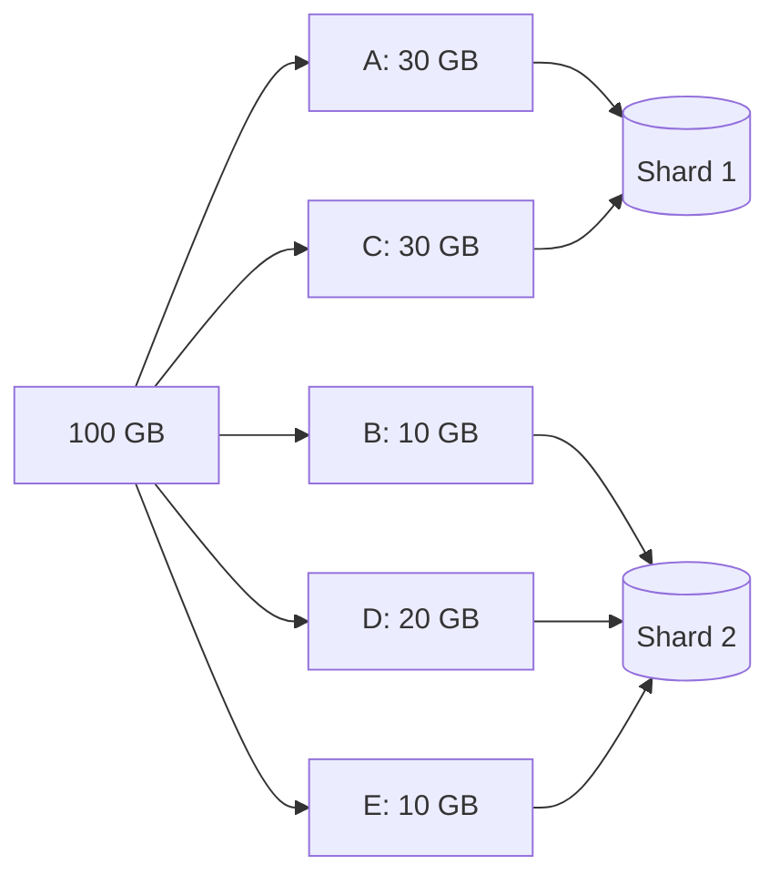

This "many small partitions, few servers" layout is not just a drawing convenience. It is the trick that makes growing later cheap (see "Resharding" below).

### How to partition the data?

There are two categories of partitioning:

1. **Horizontal partitioning:** split the **rows**. Every partition has the same columns but different rows. Example: `users` with `id 1 to 1M` on partition 1, `id 1M to 2M` on partition 2. This is what people almost always mean by sharding.
2. **Vertical partitioning:** split the **columns or tables**. Example: keep `users(id, name, email)` on one database and the rarely-read, heavy `user_profiles(id, bio, avatar_blob)` on another. Or move the `orders` table to its own server. This is how you start splitting a monolith DB by domain.

The sketch shows one box splitting into two boxes, representing a dataset being split into two partitions.

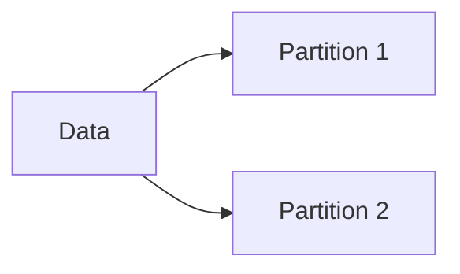

When we "split" the 100 GB data, we could have used either of the ways, but deciding which one to pick depends on load, use case and access pattern.

### Sharding and partitioning combinations

The matrix below shows the four combinations of sharding and partitioning. Without either, there is one database holding one whole table. With partitioning alone, one database holds the table split into two partitions. With sharding alone, the same table is copied to two databases (this is the read replica setup). With both, two databases each hold a different partition of the table.

| | Partitioning: No | Partitioning: Yes |
|---|---|---|
| **Sharding: No** | One DB holding the whole table | One DB holding two partitions of the table |
| **Sharding: Yes** | Two DBs, each holding a copy of the same table (Read Replica) | Two DBs, each holding a different partition of the table |

### Advantages of sharding

- Handle large reads and writes
- Increase overall storage capacity
- Higher availability

### Disadvantages of sharding

- Operationally complex
- Cross-shard queries are expensive

### Going deeper

#### Picking the shard key

The shard key decides which partition a row lands on. Everything else in this section follows from this one choice. A good key has:

- **High cardinality:** many distinct values (`user_id`, not `country`), so there is something to spread.
- **Even distribution:** no value gets a disproportionate share of rows or traffic.
- **Matches the main access pattern:** most queries carry the key, so they hit exactly one shard.

Bad keys and why:

- `created_date`: all of today's writes go to one shard (the newest), the rest sit idle.
- `status` (`active`, `deleted`): two or three values, so two or three shards do all the work.
- Anything you do not have at query time: you end up asking every shard.

#### Partitioning strategies

- **Hash:** `shard = hash(key) mod N`. Even spread, cheap routing. You lose range queries (adjacent keys land on random shards) and plain `mod N` moves almost every key when N changes (consistent hashing, section 23, fixes that).
- **Range:** each shard owns a key range (`a to m`, `n to z`, or a time range). Range scans stay on one shard. Risk: hot ranges, for example the current month gets every write.
- **Directory / lookup-based:** a small table says which shard holds each key or tenant. Very flexible (move one tenant at a time, put a big customer alone). The lookup service is now a dependency on every request, so cache it and make it highly available.

Bigtable (and HBase) use range partitioning by row key and split a tablet automatically when it grows. Dynamo uses consistent hashing on the key plus replication to the next nodes on the ring.

#### Hotspots

A **hot key** is one value that takes a large share of traffic: a celebrity's profile, one viral post, one tenant that is 100x bigger than the others. The shard holding it melts while others idle. Fixes:

- **Key salting:** write the hot key under several sub-keys (`post123#0` to `post123#9`) so it spreads across shards, then fan in (read all sub-keys and merge) on read. Works well for counters and append-only data.
- **Split the hot shard:** move half of its range or hash slots to a new node.
- **Cache hot keys** in front of the database so most reads never reach the shard.

#### Resharding

Adding a shard means moving data, while the system stays live and correct. This is the hard operational part. Options:

- **Pre-split into many logical partitions** (for example 1024) and map them onto a few physical nodes, exactly like the 5-partitions-on-2-shards sketch above. Growing means moving whole partitions between nodes, never re-cutting them. The routing table is just `partition -> node`.
- **Consistent hashing:** when a node joins or leaves, only about 1/N of the keys move (section 23).
- **Live migration with dual writes:** copy the old data to the new shard in the background, write to both old and new during the copy, verify they match, switch reads, then stop writing to the old one. Slow and careful, but no downtime.

#### Cross-shard queries

A query that does not carry the shard key must be sent to every shard and the results merged. This is **scatter-gather**. Its latency is the **slowest shard's** latency, and with 100 shards one of them is always slow. Its cost is 100 queries for one user request. You design the shard key so the common queries never need it, and you accept scatter-gather only for rare admin or analytics paths.

#### Cross-shard transactions

Moving money from a user on shard 1 to a user on shard 2 needs both writes to commit or neither.

- **Two-phase commit (2PC):** a coordinator asks every shard to "prepare" (lock and promise), then tells all to "commit". Correct but slow (extra round trips) and **blocking**: if the coordinator dies after prepare, the shards hold their locks until it comes back.
- **Sagas:** do the steps as separate local transactions, and if a later step fails, run **compensating actions** (a refund for the debit). No locks held across shards, but you must design the undo for every step and live with a short inconsistent window.
- **Avoid by design:** co-locate data that must change together. Put a user's orders, payments and cart on the same shard as the user (shard key = `user_id` everywhere). Most real systems do this and keep cross-shard transactions for rare cases.

#### Secondary indexes on sharded data

Querying by something other than the shard key (find users by `email`) needs an index. Two ways to keep it:

- **Local index:** each shard indexes its own rows. Writes are cheap (same shard, same transaction). Reads by that column are scatter-gather across all shards.
- **Global index:** a separate index, itself partitioned by the indexed column. Reads hit one index partition. Writes now touch two places (the row's shard and the index's shard), so they are slower and usually **eventually consistent**. DynamoDB's Global Secondary Index (GSI) works this way, and its Local Secondary Index (LSI) is the local kind.

#### Trade-offs

- Hash vs range: hash for even spread and key lookups, range when you need range scans. We usually pick hash and give up range queries.
- Local vs global index: local for write speed and consistency, global for fast lookups by the indexed column. Pick global only for the queries users actually wait on.
- Shard by `user_id` vs by `tenant`: user gives even spread, tenant gives easy per-customer isolation but a huge tenant becomes a hotspot.

#### Failure modes

- One shard down: only the users on it are affected (a partial outage, which is a feature of sharding). Each shard needs its own replica and failover.
- Routing table wrong or stale after a move: writes land on the wrong shard and "disappear". Version the routing table and have shards reject keys they do not own.
- Resharding job crashes halfway: dual writes and a verification step let you resume or roll back without loss.

### Exercise

1. Take the `a to m` / `n to z` sharded setup from section 06 and add a third shard. Write down every step needed to move the data live, without stopping writes.
2. Load a skewed dataset (one key gets 50% of writes) and watch one shard saturate. Fix it with key salting and measure again.
3. Implement a "find user by email" query on the sharded setup once as scatter-gather and once with a global index table. Compare read latency and write cost.

## Non-Relational Databases

"Non-relational" is a very broad generalization of databases that are not relational (i.e. not MySQL, PostgreSQL, etc.). But this does not mean all non-relational databases are similar.

### What makes non-relational databases interesting?

Most non-relational databases shard out of the box, which gives horizontal scalability.

We talk about the 3 most important types of NoSQL databases, then two more families you will meet in practice.

### Document DBs (MongoDB, and Elasticsearch as a search index)

- Mostly JSON based.
- Support complex queries, so they are almost like relational (SQL) databases.
- Partial updates to documents are possible.
- Closest to a relational database.
- Use cases: in-app notification service, catalog service.

MongoDB is the document DB example. Elasticsearch also stores JSON documents, but it is a **search engine**: keep it as a secondary index that is fed from your primary store, not as the source of truth.

**Note:** using Elasticsearch as the primary database is a common anti-pattern. It has no transactions, its writes become visible only after a refresh, and it can lose writes during shard relocation or a node failure. Write to MongoDB or a relational DB first, then index into Elasticsearch for full-text search.

Example of a partial update: given a document like

```json
{
  "user_id": "...",
  "total_posts": 270
}
```

we can do `total_posts += 1` without re-writing the entire document.

### Key-Value Stores (Redis, DynamoDB, Aerospike)

- Extremely simple databases.
- Limited functionality: `GET(k)`, `PUT(k, v)`, `DEL(k)`.
- Meant for key-based access patterns.
- Do not support complex queries (aggregations).
- Can be heavily sharded and partitioned.
- Use cases: profile data, order data, auth data, messages, etc. (key-based access covers most of the use cases).

**Note:** You can use relational databases and document DBs as KV stores too.

### Wide-Column Stores (Cassandra, Bigtable, HBase)

- Every row is found by a **partition key** (decides which node holds it) plus a **sort key** (orders rows inside the partition).
- A "read all events for device X between 9:00 and 10:00" is one partition, one range scan. That is the sweet spot: time-series, event logs, chat history, anything write-heavy with a natural "owner then time" shape.
- Very high write throughput because writes are append-only (see storage engines below).
- No joins, no ad-hoc queries: you design one table per query.
- DynamoDB is a KV store with an optional sort key, so it behaves much like this family in practice.

### Time-Series DBs (InfluxDB, TimescaleDB, Prometheus)

One line: a store tuned for "timestamp + value" data with fast append, range queries over time, automatic downsampling and expiry of old points. Use for metrics and sensor data, not as a general database.

### Graph Databases (Neo4j, Neptune, Dgraph)

What if our graph data structure had a database? A graph database stores data that is represented as nodes, edges, and relations.

The sketch on the page shows a small graph: a handful of circular nodes joined by edges (one central node connected to four neighbours, one of which links on to a further node).

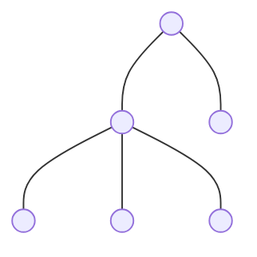

**eg:** relationships are stored as labelled edges between nodes, such as `A --FOLLOWS--> B` and `Alice --BOUGHT--> iPad`.

```mermaid
flowchart LR
    A["A"] -->|"FOLLOWS"| B["B"]
    U["Alice"] -->|"BOUGHT"| I["iPad"]
```

- Great for running complex graph algorithms.
- Powerful for modelling social networks, recommendations, and fraud detection.

### Going deeper

#### Storage engines: LSM tree vs B-tree

How a database lays out bytes on disk explains most of its performance shape.

- **B-tree** (MySQL InnoDB, PostgreSQL, most relational DBs): data lives in fixed-size pages in a sorted tree, updated in place. Point reads are fast (a few page reads), and there is one copy of each row. Random writes are slower because each one touches a page somewhere on disk.
- **LSM tree** (Cassandra, HBase, RocksDB, LevelDB, and the engines under many NoSQL stores): writes go to memory and an append-only log, then are flushed as sorted files. Writes are very fast and sequential. The costs are **read amplification** (a read may check several files, Bloom filters help skip most), **space amplification** (old versions sit around until compaction) and **compaction** running in the background, which eats disk and CPU and can cause latency spikes.

Rule of thumb: write-heavy and append-heavy → LSM. Read-heavy with lots of updates in place → B-tree.

#### CAP and PACELC in plain words

- **CAP:** when the network splits and nodes cannot talk (a **P**artition), a distributed store must pick: stay **C**onsistent (refuse some requests rather than return stale data) or stay **A**vailable (answer everyone, possibly with stale data). You cannot have both during the partition. Partitions do happen, so "pick two of three" really means "pick C or A when things break".
- **PACELC** is the practical version: during a **P**artition you pick **A** or **C**; **E**lse (network is fine, the normal case) you still trade **L**atency vs **C**onsistency. Waiting for every replica costs latency; answering from one replica risks staleness. Most of the day you are in the "else" branch, so this trade-off matters more.
- **Tunable consistency** lets you choose per request. Cassandra: `QUORUM` reads and writes for consistency, `ONE` for speed. DynamoDB: reads are eventually consistent by default, pass the `ConsistentRead` flag for a strongly consistent read at double the cost.

#### Secondary indexes in NoSQL

Every index is one more write on the write path. On a sharded store, an index on a non-key column is either:

- **Local** (per partition): cheap to write, but a query by that column asks every partition (scatter-gather).
- **Global** (its own partitioned structure): one partition to read, but the index update is a second write and is usually **eventually consistent**, so a read right after a write may miss the row. DynamoDB GSIs behave this way.

Keep indexes few. Design the primary key for the main queries and accept an index only for queries users actually wait on.

#### Trade-offs

- Flexible schema vs data quality: document DBs let every document differ, which speeds up early development and pushes validation into your code. Relational schemas catch bad data at write time.
- Denormalize for reads vs update cost: NoSQL usually stores the same fact in several places (one per query). Reads are one lookup; updates must touch every copy, and a missed copy is a silent inconsistency.
- Out-of-the-box sharding vs losing transactions and joins: you get horizontal scale by giving up cross-partition atomicity. Model so the things that must change together live in one partition.

#### Failure modes

- Node down in a leaderless store: reads and writes still succeed if enough replicas answer (quorum). Set N, R, W knowingly.
- Hot partition: one partition key takes most traffic and throttles (DynamoDB returns throttling errors). Fix with a better key or key salting (section 07).
- Compaction storm in an LSM store: p99 latency spikes while the background merge runs. Watch pending compactions and size nodes with headroom.
- Search index out of sync with the primary store: a document updated in the DB is stale in Elasticsearch until the indexing pipeline catches up. Feed the index from a change stream, monitor its lag, and be able to rebuild it from the primary store.

### Exercise

On your local machine, spin up MongoDB, Redis and Neo4j and play around with them.

1. Add Cassandra: model a "messages by chat, newest first" table with `chat_id` as the partition key and `sent_at` as the sort key. Read the last 50 messages for a chat with one query.
2. Write 1M documents to a MongoDB collection with and without a secondary index on a non-key field. Compare write throughput and the query time for that field.
3. Run a 3-node Cassandra cluster, write with `QUORUM`, then kill one node. Read with `ONE`, then with `QUORUM`, then with `ALL`. Explain which reads succeed and which do not.

## Picking the Right Database

It is not a fight, so there is no need to pick a side. A database is designed to solve a **particular problem** really well.

The sketch shows a box containing several overlapping circles: each kind of database picks a segment of the problem space, with a slight overlap between neighbours.

```mermaid
flowchart LR
    subgraph S["Problem space"]
        D1(("Relational")) --- D2(("Document"))
        D2 --- D3(("Key-Value"))
        D3 --- D4(("Graph"))
    end
```

**Common misconception:** picking a non-relational DB because relational databases do not scale.

### Why non-relational DBs scale

- There are no relations and constraints.
- Data is modelled to be sharded, i.e. split across multiple nodes.

If we relax the above two points on a relational DB, we can scale it too!

- Do not use foreign key checks.
- Do not use cross-shard transactions.
- Do manual sharding.

The diagram shows a user talking to an API server, which routes to one of two database shards.

```mermaid
flowchart LR
    U["User"] --> API["API server"]
    API --> DB1[("DB shard 1")]
    API --> DB2[("DB shard 2")]
```

### Does this mean no DB is different?

No! Every single database has some peculiar properties and guarantees, and if you need those, you pick that DB.

### How does this help in designing a system?

While designing any system, do not jump to a particular DB right away.

1. Understand **what** data you are storing.
2. Understand **how much** data you will be storing.
3. Understand how you will be **accessing** the data.
4. What kind of **queries** you will be firing.
5. Any **special feature** you expect, eg: expiration.
6. What **consistency** each piece of data needs: strong where money, inventory or uniqueness is involved; eventual for feeds, counters, analytics.
7. What your **team can run**: operational maturity and expertise, whether a managed offering exists, cost at your scale, and multi-region support if you need it.

### Model for your access patterns first

Steps 3 and 4 above are the ones people skip. Write down **every query the product needs** before you pick a store or draw a table. Then shape the data so each query is one cheap lookup. This is how NoSQL modelling works, and it is good discipline for relational too.

A tiny DynamoDB single-table example. Two access patterns: "get an order by id" and "list a user's orders, newest first". One table, partition key `PK`, sort key `SK`:

| PK | SK | Attributes |
|---|---|---|
| `USER#42` | `ORDER#2024-05-01T10:00#o91` | total, status |
| `USER#42` | `ORDER#2024-05-03T09:12#o97` | total, status |
| `ORDER#o91` | `META` | user_id, total, items |

- "Orders for user 42, newest first": query `PK = USER#42`, `SK begins_with ORDER#`, descending. One partition, one range read.
- "Order o91": get `PK = ORDER#o91, SK = META`. One key lookup.

The order is written twice (once under the user, once under its own id). That is the trade: duplicate writes for single-lookup reads. If a third access pattern appears later ("orders by status"), you add a Global Secondary Index or another item shape, not a join.

### How to pick the right DB? (Not exhaustive, but you'll get the idea)

**If data can fit on a single node:**

- You need strong consistency and data correctness is critical → go for a relational database.
- You need complex queries, aggregations → go for a relational database.
- Your access is KV based but you need it to be really fast → go for Redis.
- You need advanced data structures and algorithms → go for Redis.

**If data cannot fit on one node:**

- You have expertise in SQL and can do manual sharding → drop constraints and go for a relational DB.
- You have simple KV based access → go for a KV store like DynamoDB, MongoDB, etc.
- You require sophisticated graph algorithms → go for a graph DB like Neo4j.
- You have nothing specific, but want to future-proof → a document DB like MongoDB is the common pick, and it is fine.

**Note:** "future-proof" is not a requirement, and no store is future-proof; every one of them is a bet on an access pattern. If you truly have nothing specific, a managed relational DB (RDS or Aurora, PostgreSQL or MySQL) is the safer default: strong consistency, ad-hoc queries while the product is still changing, and a large pool of people who can run it. Move a piece of data to a specialised store only when a **measured** need appears (a query you cannot make fast, a write rate a single primary cannot take, a data size that no longer fits).

### Going deeper

#### The checklist a staff engineer says out loud

Walk through these in the interview before naming a database:

1. What are the top 3 to 5 queries, and which one is on the hot path?
2. Read/write ratio and QPS at launch and at 10x? Does the data fit on one node (roughly, a few TB)?
3. Which data needs strong consistency or transactions, and which can be eventually consistent?
4. Do I need range queries, full-text search, aggregations or graph traversals, or is it all key lookups?
5. What is the durability and availability target, and does it need more than one region?
6. Who runs it: is there a managed service, does the team know it, what does it cost at our scale?
7. What is the cost of being wrong: how hard is it to migrate this data later?

Then pick, and say what you give up.

#### Trade-offs

- Relational default vs NoSQL default: relational gives correctness and flexible queries at the cost of manual sharding later; NoSQL gives scale-out at the cost of modelling every query up front. We start relational unless the scale or shape is known on day one.
- One database vs polyglot persistence: one store is simpler to run and keeps data consistent; several stores each do one job well but every extra store is another thing to operate, back up, and keep in sync. Add a second store only for a query the first cannot serve.
- Managed vs self-hosted: managed costs more per node and limits tuning; self-hosted needs an on-call who knows the engine. For most teams the managed service is cheaper once you count people.

#### Failure modes of the choice itself

- Picked for scale you never reached: a sharded KV store with no joins slows every new feature while the data would still fit in one PostgreSQL.
- Picked relational, hit the write ceiling on one primary: you now shard live, in production, under pressure. Plan the shard key early even if you do not shard yet.
- Elasticsearch or Redis used as the only copy: data loss on a node failure. Keep a durable source of truth and treat these as derived stores you can rebuild.

#### Operating and evolving it

Whatever you pick, decide on day one: backups and a tested restore, replication and failover, the metrics you alarm on (latency p99, error rate, replication lag, disk), and how you would migrate off it. A migration is dual-writes, a backfill, verification, then a read cut-over. Knowing that path is what makes the initial choice low-risk.

### Exercise

1. Take a product you know (a food delivery app). List every query the app fires. Group them by data and access pattern, and pick a store per group. Justify each pick and say what you give up.
2. Model the same "user's orders" data twice: normalised in PostgreSQL and single-table in DynamoDB. Write the queries for both access patterns and compare what happens when a new access pattern is added.
3. Argue the case for one managed relational database for the whole app at launch, and write down the one measurement that would tell you it is time to move a piece of data elsewhere.


---

# Part 3: Caching

## Understanding Caching

Caches are anything that helps you avoid an **expensive** network I/O, disk I/O, or computation. The goal is performance improvement.

Examples of expensive operations:

1. API call to get profile information.
2. Reading a specific line from a file.
3. Doing multiple table joins.

Store frequently accessed data in a temporary storage location.

The diagram shows a user talking to a set of API servers. The API servers talk to the database, but they also talk to a cache, and the cache is checked first.

```mermaid
flowchart LR
    U["User"] <--> API["API servers"]
    API <--> DB[("Database")]
    API <--> C[("Cache")]
```

- Fetching from the DB is expensive (eg: expensive DB query, expensive disk I/O).
- Hence, we "cache" the information in some other place, so that we do not have to go to the main database.
- The cache is checked first.

This pattern (check the cache, on a miss read the DB and fill the cache) is called **cache-aside**. The application, not the cache, decides what goes in. It is the most common pattern and the one assumed in the rest of these notes.

Caches are faster and expensive, hence we do not cache all the data, just a subset of it which is most likely to be accessed.

Caches that we typically use are Redis and Memcached.

**Note:** Caches are not restricted to RAM-based storage. Any storage that is "nearer" and helps you avoid something expensive is a cache for you!

In their simplest form, caches are just glorified hash tables.

### Some examples

1. **Google News:** the most recent news articles are more likely to be accessed, hence they are served from cache.
2. **Auth tokens:** authentication tokens are cached to avoid load on the database (tokens are checked on every request).
3. **Live stream:** the last 10 minutes of a live stream are cached on the CDN, as they will be accessed the most.

### Going deeper

#### Hit ratio

- Hit ratio = cache hits / total lookups. 95% means 19 of 20 reads never touch the DB.
- A low hit ratio makes the cache pointless, and often harmful: every miss now costs a cache lookup **plus** the DB read, and you pay for the memory and one more component that can fail.
- Hit ratio is the first metric to watch on any cache. If it is low, the data is not "hot" enough, the TTL is too short, or the cache is too small (things get evicted before they are read again).
- Say the number out loud in an interview: "the DB must handle miss traffic, so at a 90% hit ratio the DB sees 10% of reads, plus 100% of reads if the cache dies" (more on that in the next section).

#### Eviction policies

The cache is full. What do we throw out?

- **LRU (least recently used):** evict the key not read for the longest time. Good default; matches "recent = hot" (Google News).
- **LFU (least frequently used):** evict the key read the fewest times. Better when a few keys stay hot for a long time and a burst of one-off reads should not push them out.
- **TTL-based:** every key has an expiry; expired keys are removed. This bounds staleness, not memory, so it is used together with LRU/LFU (Redis: `allkeys-lru`, `volatile-lru`, etc.).

#### Negative caching

- Cache the fact that something does **not** exist (eg: "user 999 not found") with a short TTL (seconds).
- Helps when many requests keep asking for missing keys: a deleted profile still linked from old pages, or a bot scanning random ids. Without it every such request is a guaranteed miss that hits the DB.
- Keep the TTL short so a newly created item shows up quickly.

#### What not to cache

- Queries that are already fast (a primary key lookup on a small table): the cache round trip costs about the same and adds a stale window.
- Data that is rarely read: it gets evicted before the second read, so it only costs memory.
- Data that needs strong consistency: account balance, stock count at checkout, permissions right after a revoke. Read these from the primary; the stale window of a cache is a correctness bug here, not a performance detail.
- Very large values: they evict many small hot keys and cost bandwidth on every read.

#### Trade-offs

- Latency vs staleness: longer TTL means more hits, but a longer window where users see old data. Pick the TTL from the product question "how old is acceptable?", not from a default.
- Memory vs hit ratio: a bigger cache holds more of the tail, but the gain flattens fast. Measure hit ratio as you grow it.

### Exercise

1. Set up Redis locally.
2. Put and get some data.
3. Measure the time taken.
4. Compare it with a database.
5. Fill Redis with a small `maxmemory` and compare `allkeys-lru` with `allkeys-lfu` under a skewed key distribution (a few hot keys, many cold). Watch the hit ratio in `INFO stats`.
6. Add negative caching for a "user not found" path and measure DB load with and without it under a burst of random ids.

## Populating and Scaling Caches

### Populating the cache

The cache sits between the API server and the database. The diagram shows a user talking to a set of API servers, which talk to both the database and the cache.

```mermaid
flowchart LR
    U["User"] <--> API["API servers"]
    API <--> DB[("Database")]
    API <--> C[("Cache")]
```

There are two ways to populate the cache.

**Note:** Whenever we set something in the cache, we set an expiry.

#### Lazy population (most popular)

This is the **cache-aside** pattern.

On a read, first go to the cache:

- If the data exists, return the data.
- Else (this is the lazy population part):
  - go to the database / do the heavy operation,
  - persist the result in the cache,
  - return the data.

**Example: caching blogs.** Fetching a blog from the DB is expensive (multiple joins). Hence, when someone accesses it, we fetch it from the DB and cache it on Redis. Subsequent requests are served from the cache.

#### Eager population

1. **Writes go to both the database and the cache in the same request call.** This is **write-through**: the cache is updated on the write path, so reads never miss for recently written data. Cost: every write does two writes, and if the cache write fails after the DB write you have to decide what to do (usually delete the key and let the next read refill it).

   **Example: live cricket score.** Thousands of people are watching the cricket score and you will be serving it from the cache. So, why not update the cache and the DB at once and save the cache miss?

   The diagram shows the commentator (who updates the score) sending the update to a service, which writes to both MySQL and Redis.

   ```mermaid
   flowchart LR
       C["Commentator (updates the score)"] --> S["Score service"]
       S --> M[("MySQL")]
       S --> R[("Redis")]
   ```

2. **Proactively push data to the cache because you anticipate the need.** This is **cache warming** (pre-loading), done from the write path here, but it can also be a job that runs before a deploy or a big event.

   **Example: when a celebrity tweets / posts something.** When an account with 100,000 followers posts something, proactively push it to the cache. We will anyway need it, and we save a cache miss.

   The diagram shows the celebrity (creating a post) sending the post to a service, which writes to both MySQL and Redis.

   ```mermaid
   flowchart LR
       C["Celebrity (creates a post)"] --> S["Post service"]
       S --> M[("MySQL")]
       S --> R[("Redis")]
   ```

#### The other two names you will hear

- **Write-behind (write-back):** write to the cache first and return; a background process flushes to the DB later (in batches). Very fast writes, absorbs write bursts. Risk: if the cache node dies before the flush, those writes are lost. Only for data you can afford to lose or re-derive (view counters, "last seen" timestamps).
- **Write-around:** write only to the DB and skip the cache; the next read misses and fills it. Good when written data is rarely read soon after (audit logs, bulk imports), so you do not pollute the cache with cold data.

### Scaling the cache

A cache is just like a database, hence the scaling techniques for a cache like Redis are similar to those for a regular database.

#### Vertical scaling

Make your cache bigger to handle more data / load. (The sketch shows a small cache cylinder growing into a large one.)

#### Horizontal scaling: replicas (scaling reads)

The same data is replicated across multiple nodes so that reads can scale. The diagram shows the API talking to a primary node and a replica node.

```mermaid
flowchart LR
    API["API"] --> P[("Primary")]
    API --> R[("Replica")]
```

Redis replication is asynchronous, so a replica can be a little behind the primary. Reads from a replica may be slightly stale, which is usually fine for a cache.

#### Horizontal scaling: sharding (scaling writes)

Data is partitioned across multiple shards so that writes can scale. The diagram shows the API talking to three separate shards.

```mermaid
flowchart LR
    API["API"] --> S1[("Shard 1")]
    API --> S2[("Shard 2")]
    API --> S3[("Shard 3")]
```

- Each shard can have a replica.
- Shards are mutually exclusive.

How the sharding actually happens:

- **Redis Cluster** hashes every key into one of 16384 fixed **hash slots** (`CRC16(key) mod 16384`). Each node owns a range of slots. Adding a node means moving some slots to it, key by key, while serving traffic. Clients learn the slot map and go straight to the right node (a wrong node replies with `MOVED`). Multi-key commands only work if all keys are in the same slot (use `{hashtag}` in the key name to force that).
- **Memcached** has no cluster mode. The client library does **consistent hashing** over the node list, so adding or removing a node only remaps about 1/N of the keys (see the consistent hashing section).

### Going deeper

#### Cache stampede (thundering herd)

A hot key expires (or the cache is empty after a deploy). Thousands of requests miss at once and all run the expensive DB query. The DB, sized for miss traffic, falls over.

Fixes (they stack):

- **Per-key lock / request coalescing:** on a miss, only the first request for that key goes to the DB (a `SET NX` lock in Redis, or a single-flight map in the process). The others wait a few ms and read the filled value.
- **Probabilistic early refresh:** a request that finds a value close to expiry refreshes it in the background with a small probability, so the key is renewed before anyone sees a miss.
- **TTL jitter:** set the TTL to `base + random(0, 10%)` so keys written together do not expire together.
- **Warm-up on deploy:** pre-load the top N keys before taking traffic, or roll out slowly.

The Amazon Builders' Library article on caching makes the point: once the DB is sized for miss traffic, anything that turns misses into a burst is an outage risk.

#### Hot keys

One key (the celebrity post, today's match) gets most of the traffic. Sharding does not help: the key lives on one shard, and that node saturates while the others idle.

- **Local (in-process) cache** in front of Redis for the hottest keys, with a very short TTL (about a second). Redis sees one read per server per second instead of one per request.
- **Replicate the hot key under several names:** write `post:123:0` to `post:123:9`; readers pick a random suffix. Load spreads over 10 shards; the write path updates all copies.
- Detect early: `redis-cli --hotkeys`; alarm on per-node CPU / network skew.

#### Cache / DB consistency

There is always a **stale window**: the time between a DB write and the cache reflecting it. Make it short and bounded, not zero.

- **Update-on-write:** set the new value in the cache after the DB. Two concurrent writers can land in the wrong order (writer 1 wins in the DB, writer 2 wins in the cache) and disagree until the TTL.
- **Delete-on-write:** delete the key after the DB write; the next read refills it. Simpler; ordering problems are much rarer.
- The race that remains: A misses and reads the old value from the DB; B writes the DB and deletes the key; A then sets its old value. Stale until TTL. It needs a read to be slow across a write, which is rare, so the usual compromise is **delete after write, plus a short TTL** as a safety net.
- **CDC-driven invalidation:** a process tails the DB change log (binlog / WAL, eg: Debezium) and deletes cache keys for every committed row change. No code path can forget to invalidate; works for writes by other services too. Cost: one more pipeline, a few hundred ms of lag.

```mermaid
flowchart LR
    API["API server"] -->|"1. write"| DB[("Database")]
    DB -->|"2. change log (binlog / WAL)"| CDC["CDC (eg: Debezium)"]
    CDC -->|"3. DEL key"| C[("Cache")]
    API -->|"read (miss refills)"| C
```

#### Failure mode: the cache cluster is down

At a 95% hit ratio the DB sees 5% of reads. If the cache dies it sees 100%, twenty times more. Most DBs will not survive that: "the cache is just an optimization" stops being true once you depend on the hit ratio.

Options (decide before it happens):

- **Fail with a degraded page:** static or build-time content for non-critical parts (recommendations, counters); the DB only serves the essentials.
- **Rate-limit DB access:** cap concurrent DB queries per API server (a semaphore), return 503 fast for the rest. Some users get errors instead of everyone getting a timeout.
- **Warm standby cache:** a replica cluster kept filled (same writes, or CDC) that takes traffic within seconds.
- **Size the DB for a fraction of miss traffic:** eg: it must survive a 50% hit ratio. Costs money all year for a few minutes of safety; reasonable for critical paths.
- Always: alarm on cache error rate and DB QPS; circuit-break and time out fast so servers stop hammering a dead cache.

#### Trade-offs

- Write-through vs cache-aside: write-through has no misses on fresh data but writes every DB write into the cache, read or not. Pick write-through for read-immediately data (live scores), cache-aside for the rest.
- Local cache vs Redis-only: the local cache kills hot-key load, but each server has its own stale copy, so the stale window grows by the local TTL.
- Delete-on-write vs CDC invalidation: a few lines of code vs a pipeline. Start with delete-on-write plus TTL; move to CDC when many writers touch the same tables.

Watch: hit ratio, evictions/s, p99 latency, replication lag, per-node CPU skew. Alarm on hit ratio dropping while DB QPS rises: that is a stampede or a dying cache.

### Exercise

1. Set up Redis locally with a small `maxmemory`.
2. Implement cache-aside for a slow query and measure hit ratio and p99 latency.
3. Simulate a stampede: expire a hot key while 200 concurrent clients read it, and count DB queries. Add a per-key lock (`SET NX`) and TTL jitter, then count again.
4. Kill Redis while the load test runs. Decide fail-open (everything to the DB) vs a bounded DB concurrency limit with fast 503s, and measure what the user sees in each case.
5. Reproduce the delete-on-write race with an artificially slow read, and confirm the short TTL bounds the stale window.

## Caching at Different Levels

The most common cache we saw was Redis, but that is not the only type of cache out there, nor the only place that can be used as a cache.

Literally every piece / component in your infrastructure can cache something for you. But should you? It depends on the guarantees (stale data and invalidation). Also, too much caching is bad!

Every extra cache level adds another **stale window** (a period where that level serves old data) and another thing you must invalidate when data changes. A user's view is only as fresh as the slowest-refreshing level in the chain.

Let's take a look at different places where we can cache.

### Client-side caching

Storing frequently accessed data on the client side, eg: browser, mobile devices, etc.

The diagram shows a user (client) talking to an API server, which talks to the database; the cache lives on the client, marked by a small box next to the user.

```mermaid
flowchart LR
    U["User / client (with local cache)"] <--> API["API server"]
    API <--> DB[("Database")]
```

- Cache near-constant data (eg: images, JS files, user information, etc.).
- It should be okay to serve cached (stale) info.
- Invalidation by time (expiry).

Massive performance boost, as we need not make any request to the backend.

For browsers this is driven by HTTP headers: `Cache-Control: max-age=3600` says "keep this for an hour without asking"; `ETag` lets the browser ask "has it changed?" and get a cheap `304 Not Modified` instead of the body. You cannot reach into a user's device to invalidate, so keep TTLs short for anything that can change, and use versioned URLs (below) for assets.

### Content Delivery Networks (CDN)

CDNs are used for caching: live streaming, serving images, videos, audio, bundles, etc.

CDNs are a set of servers distributed across the world. A request from a user goes to the nearest CDN server, and hence the user gets a very quick response. US folks getting images from US servers is faster than fetching them from India.

The sketch shows a globe with a user connected to two CDN servers located in different parts of the world.

**Note:** CDN does lazy cache population.

The diagram shows the user talking to the CDN, and the CDN talking to the API (the origin server).

```mermaid
flowchart LR
    U["User"] <--> CDN["CDN"]
    CDN <--> API["API (origin server)"]
```

Flow:

- The user's request comes to the CDN (the closest server).
- The CDN server checks if it has the data.
- If yes, return the data.
- Else, the CDN makes the same request to the origin, gets the response, caches the response, and returns the data.

The diagram shows a user in India whose request goes to the Mumbai CDN server (the closest one); other CDN servers exist in the US, Europe and Sydney, and the CDN nodes forward to the origin when needed.

```mermaid
flowchart LR
    U["User (India)"] <--> M["CDN: Mumbai (closest)"]
    M -->|"on cache miss"| O["Origin (API)"]
    US["CDN: US"] -->|"on cache miss"| O
    EU["CDN: Europe"] -->|"on cache miss"| O
    SY["CDN: Sydney"] -->|"on cache miss"| O
```

Like any other cache, when you put data on the CDN you set an expiry on it (post which the CDN deletes the data).

#### How the CDN knows what to keep, and for how long

- The origin sets the expiry with **`Cache-Control` headers**: `max-age` applies to the browser and the CDN; `s-maxage` applies to shared caches (the CDN) only, so you can say "browser: 1 minute, CDN: 1 day". `private` or `no-store` means "do not cache" (user-specific responses).
- **Purge / invalidation:** you can ask the CDN to drop a URL (or a tag) before it expires. This propagates to hundreds of edge locations and takes seconds to a few minutes, so it is a safety valve, not something to rely on for every write.
- **Versioned URLs** are the reliable way to invalidate: put a content hash in the file name (`app.3f9a1c.js`) and cache it forever (`max-age=31536000, immutable`). A new build gets a new name, so there is nothing to purge and old and new versions can coexist during a rollout.
- **Origin shield:** one extra CDN tier between all the edges and your origin. A miss at Mumbai, Sydney and Europe becomes one request to the shield and one request to the origin instead of three. This protects the origin from a "miss storm" when a popular object expires everywhere at once.
- **Signed URLs / signed cookies** for private content (a paid video): the URL carries a signature and expiry; the edge verifies it without calling the origin. Public caching, private access.

### Remote cache (Redis)

A remote cache is the centralized cache that we most commonly use (Redis). It is expensive and stores data in main memory. Multiple API servers use it to store frequently accessed data.

The diagram shows a user talking to the API, which talks to the DB and to the shared cache.

```mermaid
flowchart LR
    U["User"] <--> API["API"]
    API <--> DB[("DB")]
    API <--> C[("Cache")]
```

- Every key stored should have an expiration (otherwise: memory leak).
- The size of the cache is relatively very small as compared to a database.

### In-process (near) cache

One more level, between the client and Redis: a hash map (with LRU and TTL, eg: Guava / Caffeine in Java, or a plain dict) inside each API server process.

- Fastest possible read: no network at all, sub-microsecond.
- Per instance: 50 servers means 50 separate copies, each filled by its own misses, each with its own stale window. You cannot invalidate them from one place.
- Use it for small, very hot, slow-changing data (feature flags, config, the top few hot keys) with a **short TTL** (seconds), and accept that different servers may briefly disagree.
- It is the standard fix for hot keys that would otherwise saturate one Redis shard.

### Database caching

Instead of computing the total posts by a user every time, we store `total_posts` as a column and update it once in a while. This saves an expensive DB computation.

The expensive query being avoided:

```sql
SELECT COUNT(*) FROM posts WHERE user_id = 123;
```

The `users` table:

| id  | name  | ... | total_posts |
|-----|-------|-----|-------------|
| 123 | Alice |     | 77          |

Every time a post is published, we also update the `users` table and do `total_posts = total_posts + 1`, as a single atomic statement in the DB:

```sql
UPDATE users SET total_posts = total_posts + 1 WHERE id = 123;
```

**Note:** the common bug is to do this as read-then-write in the application (`SELECT total_posts` -> add 1 in code -> `UPDATE ... SET total_posts = 78`). Two posts published at the same time both read 77 and both write 78; one post is lost from the count. This is the "lost update" anomaly from the isolation levels section. Let the DB do the arithmetic in one statement (it locks the row for that instant), or use `SELECT ... FOR UPDATE`.

- Do the insert into `posts` and the counter update in the **same transaction**, so a crash between them cannot leave the count off by one.
- At very high write rates one row becomes a hot spot (every post by a celebrity locks the same `users` row). Move the counter to Redis (`INCR`) or a small counter service, and write it back to the DB periodically.
- Denormalized values drift over time (a failed transaction, a manual fix, a bug). Run a **periodic reconciliation job** that recomputes `COUNT(*)` for recently active users and corrects the column. Treat the column as a cache of the truth, which is the `posts` table.

### Other places

**Note:** There are other places, like the load balancer, where we can cache.

**Note:** We can cache some data at every single component in the system, but should we do it? Not necessarily. It is very use-case specific and subject to the tolerance level for staleness of the served data.

Just because you can, does not mean you should.

### Going deeper

#### Picking the level

| Level | Latency | Shared? | Invalidation | Best for |
|---|---|---|---|---|
| Client / browser | none (local) | per user | TTL only; versioned URLs | static assets, user's own data |
| CDN | few ms | per region | TTL, purge, versioned URLs | public static and media |
| In-process | sub-µs | per server | TTL only | tiny, very hot, config |
| Remote (Redis) | ~1 ms | fleet-wide | explicit delete / TTL | most application data |
| Database column | one query | fleet-wide | your write path + reconciliation | expensive aggregates |

Rule: cache as close to the user as the staleness tolerance allows. Static assets go to the edge forever; a user's cart stays in Redis (or nowhere).

#### Failure modes

- A CDN purge that did not fully propagate: some users see old content for minutes. Use versioned URLs for anything that must switch atomically.
- Wrong `Cache-Control` on a user-specific response: the CDN serves one user's data to another. Default to `private` for anything behind login; allowlist what is public.
- A stampede at the origin when a popular CDN object expires: origin shield plus `stale-while-revalidate` (serve the old copy while one request refreshes).
- In-process caches after a deploy start empty on every server at once: warm them from Redis on boot.

#### Trade-offs

- Long CDN TTL vs fast content updates: long TTLs mean fewer origin hits and lower cost; you give up quick edits unless you version URLs. We pick long TTL plus versioned URLs.
- Denormalized counter vs live `COUNT(*)`: the counter is O(1) to read; you give up exactness for a while and take on a reconciliation job. Fine for "77 posts", not fine for money.
- One more cache level vs simplicity: each level is a real gain in latency and cost, and a real cost in staleness and debugging ("which layer served this stale value?"). Add a level only when a measured problem needs it.

#### Operating it

- Watch per level: hit ratio, origin request rate (CDN), egress cost, evictions, and how long a change takes to become visible end to end (measure it, do not guess).
- Put a version or timestamp in cached payloads so you can tell which layer is stale when a user reports old data.

### Exercise

1. Create an account on Akamai / Cloudflare.
2. Configure a simple CDN and understand how it is used.
3. Cache a simple image on the CDN and access it from the CDN using the CDN URL.
4. Set `Cache-Control: s-maxage=600, max-age=60` on the image, change the image at the origin, and time how long each of browser, CDN and a purge take to show the new one. Then do it again with a hashed file name.
5. Run 100 concurrent "publish post" requests against a read-then-write counter and against `UPDATE ... SET total_posts = total_posts + 1`. Compare the final count with `COUNT(*)`.


---

# Part 4: Asynchronous Processing and Messaging

## Message Queues

### Asynchronous processing

When a user sends a request and you immediately handle it, that is **synchronous**. (The sketch shows a user sending a request arrow to a server and getting a response arrow straight back.)

1. Loading the Instagram feed is synchronous.
2. Login on a website is synchronous.
3. Payments are synchronous.

Most interactions on the web are synchronous. But there are some things that should not be synchronous.

**eg: spinning up a virtual machine.** The sketch shows a user talking to an API server, which talks to a large host box in which a small VM is being created.

```mermaid
flowchart LR
    U["User"] <--> API["API server"]
    subgraph H["Host"]
        VM["VM being created"]
    end
    API -->|"spin up"| VM
```

Spinning up a VM takes minutes, and the user will not wait on the same page for the response. Instead, he/she would love to move around and keep checking the status once in a while. This is **asynchronous**.

The diagram shows the asynchronous flow: (1) the client sends a request to the API, (2) the API puts a task on the broker, (3) the API responds to the client. Workers pick tasks from the broker and update the database, which the API also reads.

```mermaid
flowchart LR
    C["Client"] -->|"1. request"| API["API"]
    API -->|"3. response"| C
    API -->|"2. Task"| B["Broker"]
    B --> W1["Worker"]
    B --> W2["Worker"]
    B --> W3["Worker"]
    W3 -->|"update DB"| DB[("Database")]
    API --- DB
```

### Message queues

Brokers help two services / applications communicate through messages. We use message brokers when we want to do something **asynchronously**:

1. Long-running tasks.
2. Trigger dependent tasks across machines.

**Example: video processing.** Once the video is uploaded, we need to convert it to 360p, 480p, 720p.

The diagram shows three Video Upload Service instances uploading to S3 and pushing messages into a queue (SQS / RabbitMQ). Three Video Processing Service instances consume from the queue and read the video from S3.

```mermaid
flowchart LR
    S3["S3"]
    VU1["Video Upload Service"] --> S3
    VU1 --> Q["SQS / RabbitMQ"]
    VU2["Video Upload Service"] --> Q
    VU3["Video Upload Service"] --> Q
    Q --> VP1["Video Processing Service"]
    Q --> VP2["Video Processing Service"]
    Q --> VP3["Video Processing Service"]
    VP1 --> S3
```

Message queues are also called message brokers.

### Features of message brokers

1. **Brokers help us connect different sub-systems.** (The sketch shows two services joined through a queue.)

   ```mermaid
   flowchart LR
       A["Service A"] --> Q["Queue"] --> B["Service B"]
   ```

2. **Brokers act as a buffer for the messages**, i.e. consumers can consume at their own pace. There is no synchronous load on the connected systems.

   **eg: notification system.** Three Orders Service instances push messages into a queue, and a single Email Sender consumes them.

   ```mermaid
   flowchart LR
       O1["Orders Service"] --> Q["Queue"]
       O2["Orders Service"] --> Q
       O3["Orders Service"] --> Q
       Q --> E["Email Sender"]
   ```

3. **Brokers can retain messages for 'n' days** (depends on the broker you use).

4. **Brokers can re-queue the message if it is not deleted** (depends on the broker you use).

   **eg:** a consumer read the message but, before it could delete it, it crashed. (The sketch shows a queue delivering a message to a consumer that is crossed out.)

   ```mermaid
   flowchart LR
       Q["Queue"] -->|"message"| C["Consumer (crashed)"]
   ```

   In SQS this works through the **visibility timeout**: when a consumer receives a message, the queue hides it from other consumers for a fixed time (default 30 s). If the consumer deletes the message within that time, it is gone for good. If it does not (crash, or just slow), the message becomes visible again and another consumer gets it. So a consumer that is slow but alive will cause the same message to be processed twice. Set the timeout longer than your worst normal processing time, or extend it from the consumer while working.

### Typical flow while using a message queue

**Example: auto-subtitle (auto-captioning).**

The diagram shows a user talking to the video service, which uploads to S3, writes to its DB, and pushes a `video_upload` message to a queue. Three captioner instances consume from the queue, download the video from S3, and write captions back to the DB.

```mermaid
flowchart LR
    U["User"] <--> V["Video service"]
    V --> S3["S3"]
    V <--> DB[("DB")]
    V -->|"video_upload"| Q["Queue"]
    Q --> C1["Captioner"]
    Q --> C2["Captioner"]
    Q --> C3["Captioner"]
    C1 --> S3
    C3 -->|"update captions"| DB
```

1. The user uploads a video to S3 through the video service.
2. The video service puts a message (after the upload completes) on the broker.
3. And returns a response to the user. The user sees "upload complete".
4. The message is asynchronously read by the captioner service.
5. The captioner downloads the video.
6. The captioner generates captions and updates them in the DB.
7. The user now sees the caption button enabled.

Look at steps 1 and 2 again: the video service writes to its DB **and** publishes to the queue. Those are two separate systems, and there is no transaction across them. If the service crashes between them, the DB says "video uploaded" but no captioner ever hears about it. This is the **dual-write problem**, and it is covered under "Going deeper" below.

### Going deeper

#### Delivery semantics

What the broker promises about how many times a consumer sees a message:

- **At-most-once:** delivered zero or one times. Deleted as soon as it is sent; a consumer crash loses it. Fast, no duplicates; fine for metrics or logs where a gap is acceptable.
- **At-least-once:** delivered one or more times. Deleted only when the consumer acknowledges (SQS `DeleteMessage`, RabbitMQ `ack`); a crash or slow consumer means redelivery. The default for SQS and RabbitMQ, and the one to assume.
- **Exactly-once:** processed exactly one time. No broker can guarantee this end to end, because the consumer's side effect (a DB write, an email) and the ack are two separate steps. In practice: at-least-once delivery + an **idempotent** consumer.

#### Idempotency

Idempotent means doing the operation twice has the same result as doing it once. Since you will get duplicates, every consumer must be safe against them.

- **Idempotency key:** put a unique id in every message (the video id, or a UUID the producer generates). The consumer records processed ids in a **dedup table** (or a Redis `SET NX` with a TTL) and skips a message whose id it has already seen. Write the id in the same transaction as the real work so a crash cannot mark it done without doing it.
- **Naturally idempotent operations:** `SET captions_status = 'done'` is safe to repeat; `UPDATE views = views + 1` is not. Prefer "set to a value" over "increment", and "upsert by id" over "insert".
- For external side effects (sending an email, charging a card) pass the key to the provider; most payment and email APIs accept an idempotency key and drop repeats.

#### Retries, backoff and jitter

- A failed message should be retried, but not immediately: if the downstream is overloaded, instant retries make it worse. Use **exponential backoff**: wait 1 s, then 2 s, 4 s, 8 s, capped.
- Add **jitter** (a random amount added to each wait). Without it, a thousand messages that failed together retry together at exactly the same moments, and the downstream sees the same spike again: a **retry storm**. With jitter the retries spread out over time. (The Amazon Builders' Library article on timeouts, retries and backoff with jitter is the reference here.)
- Cap the number of attempts. Infinite retries of a message that can never succeed just burns capacity.

#### Dead-letter queue and poison messages

- A **poison message** is one that fails every time (malformed payload, a bug it triggers, a video file that is corrupt). Left alone it is redelivered forever, blocking a worker each time.
- A **dead-letter queue (DLQ)** is a second queue the broker moves a message to after N failed receives (SQS: `maxReceiveCount` on the redrive policy). The main queue keeps flowing.
- Alarm on DLQ depth greater than zero. Someone looks at the messages, fixes the bug or the data, and redrives them back to the main queue. Keep the DLQ retention long (14 days on SQS) so nothing is lost while you investigate.

#### Backpressure

- Queue depth (number of messages waiting) growing steadily means consumers are slower than producers. The buffer hides it for a while, then the user notices: "my captions took 3 hours".
- Options: **scale consumers** (autoscale workers on queue depth or on age of oldest message); **shed load** (drop or reject low-priority messages when the queue is too deep); **slow producers** (return "try later" or throttle the API when depth crosses a threshold).
- The metric to alarm on is **age of the oldest message** (SQS `ApproximateAgeOfOldestMessage`), not depth. A deep queue that drains in a minute is fine; a shallow queue where one message has waited an hour is not.
- Also watch: messages in flight, empty receives (consumers over-provisioned), DLQ depth.

#### Ordering

- Standard queues (SQS standard, most brokers with several consumers) do **not** guarantee order. Two messages for the same video may be processed in either order, or in parallel, and a retried message arrives later than everything sent after it.
- **FIFO queues** (SQS FIFO) guarantee order within a **message group** (eg: all messages for one video id) and dedupe on a producer-provided id for 5 minutes. Cost: lower throughput per group (one message at a time per group) and a per-queue limit that standard queues do not have.
- Design so order rarely matters: put the full state in the message ("status is now X") rather than a delta ("add 1"), or version messages and let the consumer drop an older version than what it already has.

#### The dual-write problem and the transactional outbox

The problem from the captioning flow: writing to the DB and publishing to the queue cannot be one atomic step.

- Write DB, then publish: a crash in between leaves a DB row with no message. The work never happens.
- Publish, then write DB: a crash in between leaves a message for a row that does not exist. The consumer fails or acts on missing data.
- Wrapping both in a DB transaction does not help: the publish is not part of the transaction, and a commit can fail after the publish already went out.

**Transactional outbox** fixes it by making the message part of the DB transaction:

1. In the same transaction as the business write (insert into `videos`), insert a row into an `outbox` table (`id, event_type, payload, created_at, published_at NULL`).
2. Commit. Either both rows exist or neither does.
3. A small **relay** process reads unpublished outbox rows, publishes them to the queue, and marks them published (or deletes them). If the relay crashes after publishing but before marking, it publishes again: at-least-once, which is why consumers must be idempotent.
4. The relay can be a poller (`SELECT ... WHERE published_at IS NULL ORDER BY id LIMIT 100` every second) or a CDC tool (eg: Debezium) that tails the database log and publishes each outbox insert with almost no lag.

```mermaid
sequenceDiagram
    participant V as Video service
    participant DB as Database
    participant R as Outbox relay
    participant Q as Queue
    participant C as Captioner
    V->>DB: BEGIN
    V->>DB: INSERT INTO videos
    V->>DB: INSERT INTO outbox (video_upload)
    V->>DB: COMMIT (both rows or none)
    R->>DB: SELECT outbox WHERE published_at IS NULL
    R->>Q: publish video_upload
    R->>DB: UPDATE outbox SET published_at = now()
    Q->>C: deliver (at least once)
    C->>C: check idempotency key, then process
```

Cost: one more table and one more process to run, and a small delay (poll interval or CDC lag) before the message goes out. Worth it whenever "DB says done but nothing happened" would be a user-visible bug.

#### Failure modes, in one place

- Consumer crashes mid-work: message reappears after the visibility timeout, duplicate processed. Fix: idempotent consumer.
- Consumer alive but slow: two consumers work the same message. Fix: longer visibility timeout, or extend it while working.
- Downstream (S3, DB) down: everything fails and retries, worst case lands in the DLQ. Fix: backoff with jitter, DLQ alarm, redrive after recovery.
- Broker down: producers cannot publish. With the outbox the write still succeeds and the relay catches up later; without it the API must fail the request.
- Producer spike: depth and user latency grow. Fix: autoscale consumers on age of oldest message; shed low-priority work.

#### Trade-offs

- Queue vs synchronous call: buffering, retries and decoupling; you give up an immediate answer and take on eventual consistency ("processing...") and duplicates.
- Standard vs FIFO: FIFO gives order and dedupe; you give up throughput and add a per-group bottleneck. Pick standard plus idempotent, order-tolerant consumers unless order is a hard requirement.
- Outbox vs "publish after commit": a table and a relay, in exchange for every committed write producing its events. For anything money- or user-facing, take the outbox.
- SQS vs RabbitMQ vs Kafka: SQS is managed, huge scale, no replay. RabbitMQ has flexible routing and low latency but you run it. Kafka keeps a replayable log for many consumer types (next section). Pick the simplest that fits.

### Exercise

1. Set up RabbitMQ locally.
2. Write some code to push and read messages.
3. Go through the documentation to understand its features.
4. Make the consumer crash after processing but before acking, and watch the duplicate arrive. Add an idempotency key and a dedup table so the second delivery is a no-op.
5. Publish a message the consumer can never process, configure a DLQ after 3 attempts, and add an alarm on DLQ depth.
6. Implement the transactional outbox for the captioning flow: kill the service between the DB commit and the publish, and confirm the relay still delivers the message.

## Message Streams and Kafka

### Message Streams

Message streams are similar to message queues, with a few differences. To understand, let's take an example.

Say we are building Medium.com, and upon every blog published, we:

- need to index it in a search engine (Elasticsearch)
- need to do `count++` for the user's total blogs

#### Approach 1: One message broker, with the logic in the consumer

The user hits the API server, which writes to the main database and publishes a message to a RabbitMQ broker. A pool of consumers reads from the broker; each consumer both indexes the blog into Elasticsearch and does `count++` on the main database.

```mermaid
flowchart LR
    U["User"] --> API["API"]
    API <--> MQ["RabbitMQ"]
    API --- DB["Main Database"]
    MQ --> C1["Consumer"]
    MQ --> C2["Consumer"]
    MQ --> C3["Consumer"]
    C1 -->|"index"| ES["Elasticsearch"]
    C2 -->|"index"| ES
    C3 -->|"index"| ES
    C1 -->|"count++"| DB
    C2 -->|"count++"| DB
    C3 -->|"count++"| DB
```

Consumers are doing two things: `count++` and index.

**Issue:** what if the write to one succeeded but the other one failed? `count++` succeeded but the blog is not there in search, or it is there in search but the count does not match.

#### Approach 2: Two brokers and two sets of consumers

The API server writes to two RabbitMQ brokers, and each broker has its own set of consumers: the Search consumers index into Elasticsearch, and the Counter consumers update the count in the main database.

```mermaid
flowchart LR
    U["User"] --> API["API"]
    API <--> MQ1["RabbitMQ 1"]
    API --> MQ2["RabbitMQ 2"]
    API --- DB["Main Database"]
    MQ1 --> S["Search consumers"]
    S -->|"index"| ES["Elasticsearch"]
    MQ2 --> C["Counter consumers"]
    C -->|"count++"| DB
```

This still does not solve the problem! When the API server writes to two RabbitMQ brokers and one of them fails, we end up in the same spot.

Hence, we want "write to one" and "read by many" semantics. This is where message streams come into the picture, e.g. Kafka, Kinesis.

#### Message Streams

Message streams are similar to message brokers with one change: multiple types of consumers read the same message.

#### Approach 3: Using streams and multiple types of consumers

The API server pushes one message into Kafka. The Search service and the Counter service both read the same message and do their work: Search indexes into Elasticsearch, Counter updates the main database.

```mermaid
flowchart LR
    U["User"] --> API["API"]
    API <--> K["Kafka"]
    API --- DB["Main Database"]
    K --> S["Search consumers"]
    S -->|"index"| ES["Elasticsearch"]
    K --> C["Counter consumers"]
    C -->|"count++"| DB
```

Kafka solves "one message, many consumer types": Search and Counter no longer drift apart from each other, because both read the same message.

**Note:** Kafka does not fix the other gap in this picture. The API server still does two writes: one to the main database and one to Kafka. If the DB write succeeds and the Kafka publish fails (or the other way round), the blog exists but is never indexed or counted. This is the "dual write" problem, and it is the same problem as Approach 2, just one level up. The fix is below in "Going deeper".

### Message Queues vs Message Streams

In a message queue (SQS, RabbitMQ), a message in the queue is delivered to exactly one of the consumers in the pool. In a message stream (Kafka, Kinesis), the messages are retained in the stream and each type of consumer (Search, Counter) reads every message.

```mermaid
flowchart LR
    subgraph MQ["Message Queues: SQS, RabbitMQ"]
        Q["Queue: one message"] --> QC1["Consumer"]
        Q --> QC2["Consumer"]
        Q --> QC3["Consumer"]
    end
    subgraph MS["Message Streams: Kafka, Kinesis"]
        ST["Stream: many messages retained"] --> SS["Search consumers"]
        ST --> SC["Counter consumers"]
    end
```

### Kafka Essentials

A producer publishes a message ("on publish") into the stream, and it flows through to the consumers on the other end.

- Kafka is a message stream that holds the messages.
- Internally, Kafka has topics.
- Every topic has `n` partitions.
- A message is sent to a topic, and depending on the configured hash key it is put into a partition.
  - This key is the partition key. Same key, same partition, so all events for one user land in order on one partition.
  - If the key is skewed (one celebrity user produces most events), that partition becomes hot and its consumer falls behind while the others sit idle.
- Within a partition, messages are ordered.
  - There is no ordering guarantee across partitions.

```mermaid
flowchart LR
    P["Producer: on publish"] --> T["Topic"]
    T --> P1["Partition 1: ordered messages"]
    T --> P2["Partition 2: ordered messages"]
    T --> P3["Partition n: ordered messages"]
```

#### Consumer groups and offsets

- A consumer group is one "type" of consumer (all Search consumers form one group, all Counter consumers another).
- Every group gets every message. Within a group, the partitions are split among the members, so each partition is read by exactly one member of the group.
- Each group tracks an offset per partition: "I have processed up to message 1042." Kafka does not delete a message when it is read; it just moves the offset.
- Committing the offset can be automatic (on a timer) or manual. Commit after you finish processing, not before. Otherwise a crash between commit and processing loses the message. Committing after means a crash can replay a message, so the consumer must handle duplicates.
- When a consumer joins or leaves the group, Kafka rebalances: partitions are reassigned, and consumption pauses for a few seconds. Frequent restarts mean frequent pauses.

#### Retention

- Messages are kept for a configured time (e.g. 7 days) or size, not until they are consumed. This is what lets a new consumer type replay history.
- Log compaction is an alternative retention mode: keep only the latest message per key. Good for "current state" topics such as user profile snapshots.

#### Limitation of Kafka

Max number of active consumers (within one consumer group) = number of partitions.

A topic with 3 partitions can feed at most 3 consumers in a consumer group (search consumer 1, 2 and 3). Any additional consumers (a 4th and 5th) sit idle: no messages would be sent to them.

```mermaid
flowchart LR
    T["Topic: partitions = 3"] --> C1["search consumer 1"]
    T --> C2["search consumer 2"]
    T --> C3["search consumer 3"]
    C4["search consumer 4: no messages would be sent"]
    C5["search consumer 5: no messages would be sent"]
```

Two ways around it:

- Add partitions. This changes which partition a key hashes to, so ordering per key breaks across the change. Over-provision partitions up front instead (e.g. 30 partitions for 3 consumers) so you can grow later.
- Keep the partition count, but have each consumer fan its messages out to a local thread pool or a worker queue. You lose strict per-key ordering unless the pool is also keyed.

### Going deeper

#### Fixing the dual write: outbox or CDC

The API server should do one write, not two. Two options:

- **Transactional outbox:** in the same DB transaction that inserts the blog, insert an "event" row into an `outbox` table. A small relay process reads new outbox rows and publishes them to Kafka, then marks them sent. If the relay crashes, it re-reads and re-publishes, so consumers see at-least-once delivery.
- **Change data capture (CDC):** a connector (e.g. Debezium) tails the database's own write log (binlog / WAL) and publishes every committed row change to Kafka. No outbox table, no code change in the API server; the trade-off is one more piece of infrastructure to run and events that look like row changes rather than business events.

Either way, the database is the single source of truth and Kafka is fed from it, never written to in parallel.

```mermaid
flowchart LR
    API["API"] -->|"one write"| DB["Main Database"]
    DB -->|"binlog / WAL"| CDC["CDC: Debezium"]
    CDC --> K["Kafka"]
    K --> S["Search consumers"]
    K --> C["Counter consumers"]
    S -->|"index"| ES["Elasticsearch"]
    C -->|"count++"| DB
```

#### Durability knobs

- Every partition is copied to `replication.factor` brokers (3 is the usual choice). One is the leader, the others are followers.
- The in-sync replicas (ISR) are the followers that are fully caught up.
- Producer `acks=all` means the leader acknowledges a write only after all in-sync replicas have it. `acks=1` (leader only) is faster but a leader crash can lose the message.
- `min.insync.replicas=2` with `acks=all` means a write is refused if fewer than 2 copies would be durable. This is the "no acknowledged message is ever lost" setting; you pay with higher write latency.

#### Exactly-once, and where it stops

- The idempotent producer gives each message a sequence number, so a retried send is not written twice.
- Kafka transactions let a consumer read from one topic, write to another, and commit both offsets atomically. This is exactly-once for Kafka-to-Kafka pipelines.
- It ends at Kafka's boundary. The Counter consumer's `count++` on the main database is not inside a Kafka transaction. If the consumer crashes after the DB write but before committing the offset, it will replay and increment twice. The DB write must be idempotent: store the processed message id with the update, or write an absolute value instead of an increment.

#### Consumer lag

- Lag = latest offset in the partition minus the consumer's committed offset. It is the one metric that tells you consumers are falling behind.
- Alarm on lag (in messages or in seconds). Growing lag means: consumers are too slow, a partition is hot, or a consumer is stuck in a rebalance loop.
- User-visible effect of lag: the blog shows up in search minutes late, counts are stale. Decide up front how much of that is acceptable.

#### Trade-offs

- Kafka vs a queue: Kafka gives replay and many consumer types; a queue is simpler to operate, has per-message acknowledgement and a dead-letter queue out of the box. Pick Kafka when more than one team needs the same events or when you need to replay.
- Outbox vs CDC: outbox keeps events in your own schema and needs no new infrastructure beyond a relay; CDC is zero code in the app but couples events to your table layout and adds a connector to run.

### Exercise

1. Set up Kafka locally.
2. Write some code to push and read messages.
3. Go through the documentation to understand its features.
4. Run two consumers in one group and a third in a different group. Kill one mid-stream and watch the rebalance and the replay from the last committed offset.
5. Add an outbox table to a small app and write the relay. Then kill the relay between "publish" and "mark sent" and confirm the consumer handles the duplicate.

## Realtime Pub/Sub

Both message brokers and message streams require consumers to "pull" the messages out.

- **Advantage:** consumers can pull at their own pace; consumers do not get overwhelmed.
- **Disadvantage:** consumption lag when there is high ingestion.

What if we want low latency and zero lag? Use realtime pub/sub. Realtime pub/sub makes things reactive instead of relying on continuous polling.

Instead of consumers pulling the message, the message is pushed to them. E.g. Redis Pub/Sub.

A publisher sends a message into the channel, and the channel pushes that message out to every subscribed consumer.

```mermaid
flowchart LR
    P["Publisher"] --> CH["Channel: message"]
    CH -->|"push"| S1["Subscriber"]
    CH -->|"push"| S2["Subscriber"]
    CH -->|"push"| S3["Subscriber"]
```

This way we get really fast delivery time, but it can overwhelm the consumers.

- What if consumers receive messages faster than they could process?

Redis Pub/Sub is fire-and-forget:

- Nothing is persisted. A message goes to whoever is subscribed right now and is then gone.
- A subscriber that is offline (restarting, network blip) misses every message published while it was away, and there is no way to ask for them later.
- A slow subscriber does not slow the publisher. Redis buffers its output; when the buffer hits the `client-output-buffer-limit`, Redis disconnects that subscriber and it loses whatever was in flight.

If you need "every subscriber eventually sees every message" or replay, use Redis Streams (persisted, consumer groups, read from a position) or Kafka. Use plain pub/sub only where a missed message is cheap.

**Practical use case:** message broadcast, configuration push. All servers receive updates without polling for data.

A configuration change is published once into the channel, and every server subscribed to it receives the update immediately.

```mermaid
flowchart TD
    CH["Channel: config update"] --> A["Server"]
    CH --> B["Server"]
    CH --> C["Server"]
    CH --> D["Server"]
```

Because a message can be missed, a config push should never be the only path:

- Fetch the full config on start-up, so a freshly booted server is correct without waiting for a push.
- Poll on a slow timer (e.g. every 60 seconds) as a safety net. The push makes changes fast; the poll makes them certain.
- Publish a version number, not the whole config. The server compares it to what it has and fetches the new config if it is behind. This also makes a duplicated or reordered push harmless.

### Going deeper

#### Backpressure with push

Push has no natural brake. When consumers cannot keep up, pick one:

- Bounded buffer per subscriber: hold at most N messages, then either block the producer (rarely possible with pub/sub) or start dropping.
- Drop oldest: fine for "latest value wins" data such as prices, presence, config versions. The consumer only ever needs the newest one.
- Switch to pull with a wake-up: the channel carries a tiny "there is new work" notification, the consumer then pulls from a queue or stream at its own pace. You get the low latency of push and the safety of pull. This is the usual answer for anything that must not be lost.

#### Fanning out to WebSocket servers

The most common real use of pub/sub: pushing to users' browsers or phones.

- Users hold WebSocket connections to a fleet of connection servers. Any given user is connected to exactly one server, and the publisher does not know which.
- Every connection server subscribes to the channels for the users it holds (or one channel per topic, e.g. a chat room).
- A publisher sends the message once into the channel. Each server that has a subscriber for it pushes the message down the matching WebSocket connections.
- If a server dies, its users reconnect to another server, which subscribes on their behalf. Messages published during the gap are lost, so the client also asks "what did I miss since message id X" from a persisted store on reconnect.

```mermaid
flowchart LR
    Pub["Chat service"] --> CH["Channel: room 42"]
    CH --> WS1["Connection server 1"]
    CH --> WS2["Connection server 2"]
    WS1 -->|"WebSocket"| U1["User A"]
    WS1 -->|"WebSocket"| U2["User B"]
    WS2 -->|"WebSocket"| U3["User C"]
```

#### Failure modes

- Redis node down: no messages delivered until failover; subscribers must re-subscribe on reconnect (subscriptions are per connection, not stored). The fallback poll covers the gap.
- Slow subscriber disconnected by Redis: it must detect the disconnect, reconnect, re-subscribe, and re-fetch state. Alarm on subscriber disconnect rate.
- Publisher spike: fan-out cost is publishers x subscribers per message, so a hot channel with thousands of subscribers can saturate the Redis node's network. Shard channels across nodes or move to Kafka for high-volume topics.

#### Trade-offs

- Push vs pull: push gives lowest latency and no polling load; pull gives back-pressure and no lost messages. We use push for signals and cheap-to-lose data, pull (or push-then-pull) for anything we must not drop.
- Redis Pub/Sub vs Redis Streams / Kafka: pub/sub is trivial to run and very fast; streams add persistence and replay at the cost of storage, offsets to manage, and a little latency.

### Exercise

1. Set up Redis locally.
2. Go through Redis Pub/Sub documentation.
3. Test realtime broadcast.
4. Test if it persists the message (check if a new subscriber gets old messages).
5. Make a subscriber that sleeps 1 second per message while a publisher sends 10,000 messages. Watch for the disconnect, then redo it with Redis Streams and a consumer group.
6. Build the config push with a version number plus a 60-second poll. Kill Redis during a config change and confirm every server still converges.


---

# Part 5: Resilience and Scale

## Load Balancers

One of the most important components in a distributed system that makes it easy to scale the load horizontally.

- The load balancer is the only point of contact.

Clients send their requests to the load balancer, which sits in front of the pool of servers and forwards each request to one of them.

```mermaid
flowchart LR
    U1["User"] --> LB["LB"]
    U2["User"] --> LB
    LB --> S1["Server"]
    LB --> S2["Server"]
    LB --> S3["Server"]
```

Every load balancer has either:

1. a static IP, or
2. a static DNS name,

allowing clients (users / servers) to talk to it.

The load balancer hides the number of servers that are "behind" it, allowing us to add as many servers as possible without the client knowing about it. This gives horizontal scalability.

### Request Response Flow

1. The client already has the IP / domain of the load balancer. E.g. `auth.example.com`.
2. The client makes an API call and it comes to the load balancer. E.g. `GET auth.example.com/login`.
3. The load balancer picks one server and makes the same request to it.
4. The load balancer gets the response from the server.
5. The load balancer responds back to the client.

The job of the load balancer is to "balance" the load. How well it does so depends on how it picks the server to forward the request to, and this is configurable.

### Layer 4 vs Layer 7

Step 3 above ("makes the same request") only fully applies to a Layer 7 load balancer. There are two kinds:

- **L4 (transport layer, TCP/UDP):** looks only at IP and port. It forwards packets or the TCP connection to a server without reading the HTTP inside. Very fast, cheap per connection, handles millions of connections, but cannot route on URL path or headers. AWS NLB is an example.
- **L7 (application layer, HTTP):** terminates the client's connection, reads the HTTP request, and can route on path (`/api` vs `/static`), host header, cookies. It usually terminates TLS (decrypts HTTPS) so servers see plain HTTP. More CPU per request, more features. AWS ALB is an example.

Rule of thumb: L7 for HTTP APIs and websites, L4 for raw TCP (databases, game servers), very high throughput, or when you need to keep TLS end to end.

### Load Balancing Algorithms

Each diagram below shows the load balancer on the left, three servers on the right, and the request numbers (1, 2, 3, ...) that each server ends up handling.

#### Round Robin

Distribute the load iteratively. Suited to a uniform infrastructure.

```mermaid
flowchart LR
    LB["Load Balancer"] --> A["Server: requests 1, 4"]
    LB --> B["Server: requests 2, 5"]
    LB --> C["Server: requests 3, 6"]
```

#### Weighted Round Robin

Distribute the load iteratively but as per weights. Suited to a non-uniform infrastructure (the middle, bigger server has a higher weight and receives twice as many requests).

```mermaid
flowchart LR
    LB["Load Balancer"] --> A["Server: requests 1, 5"]
    LB --> B["Bigger Server, higher weight: requests 2, 3, 6, 7"]
    LB --> C["Server: requests 4, 8"]
```

#### Least Connections

Pick the server having the least connections from the load balancer. Useful when response times have a big variance, e.g. analytics.

```mermaid
flowchart LR
    LB["Load Balancer"] --> A["Server: requests 1, 5, 7"]
    LB --> B["Server: requests 2, 4, 8, 9"]
    LB --> C["Server: requests 3, 6, 10"]
```

Close relatives:

- **Least outstanding requests:** same idea at L7, counting in-flight HTTP requests instead of TCP connections (connections are reused with keep-alive, so connection count is a poor signal there). This is what ALB does.
- **Power of two choices:** pick two servers at random, send to the less loaded one. Almost as good as "least" but needs no global view, so it works when many load balancer nodes each see only part of the traffic.

#### Hash Based Routing

The hash of some attribute (IP, user id, URL) determines which server to pick. It is random enough.

```mermaid
flowchart LR
    LB["Load Balancer"] --> A["Server: requests 1, 3, 5"]
    LB --> B["Server: requests 4"]
    LB --> C["Server: requests 2, 6"]
```

Hashing gives you affinity for free (the same user always lands on the same server, useful for a local cache). It also gives you hot spots for free if one key is very popular.

### Key Advantages of Load Balancers

**Scalability:** with more servers behind the load balancer, we can now handle more requests.

With two servers of 100 RPM each behind the load balancer we can handle 200 RPM; adding a third 100 RPM server lets us handle 300 RPM.

```mermaid
flowchart LR
    subgraph Two["We can handle 200 RPM"]
        U1["User"] --> LB1["LB"]
        U2["User"] --> LB1
        LB1 --> A1["Server: 100 RPM"]
        LB1 --> A2["Server: 100 RPM"]
    end
    subgraph Three["We can handle 300 RPM"]
        U3["User"] --> LB2["LB"]
        U4["User"] --> LB2
        LB2 --> B1["Server: 100 RPM"]
        LB2 --> B2["Server: 100 RPM"]
        LB2 --> B3["Server: 100 RPM"]
    end
```

**Availability:** even if one of the servers crashes, it does not take down our entire system. The load balancer will forward requests to the other healthy servers, improving the availability.

With S2 down, the load balancer will forward any new request to S1 and S3.

```mermaid
flowchart LR
    U1["User"] --> LB["LB"]
    U2["User"] --> LB
    LB --> S1["S1"]
    LB -.-> S2["S2: down"]
    LB --> S3["S3"]
```

### Going deeper

#### Health checks

How does the load balancer know S2 is down?

- **Active:** the LB probes each server on a schedule, e.g. `GET /health` every 10 seconds; 3 failures in a row marks it unhealthy, 2 successes bring it back. Make `/health` check what matters (can I reach my DB?) but keep it cheap, or the health check itself becomes load.
- **Passive:** the LB watches real requests. A server returning 5xx or timing out gets marked down without waiting for the next probe. Faster to react, but a bad request from a client can look like a bad server.
- **Slow start:** a server that just came back gets a small share of traffic that ramps up over a minute or two, so a cold cache or JIT does not turn into a burst of timeouts.

Two failure modes to call out: if every server fails the health check at once (a shared dependency died), many LBs "fail open" and route to all of them anyway, since sending nothing is worse. And a health check that is too aggressive can mark healthy-but-busy servers down, shrinking the pool exactly when you need it (Amazon Builders' Library on implementing health checks).

#### Deploys: connection draining

When you take a server out for a deploy, the LB stops sending new requests but lets in-flight ones finish for a deregistration delay (e.g. 30 seconds) before the server is killed. Without it, every deploy drops a handful of requests. Long-lived connections (WebSockets, streaming) need a longer drain or a client-side reconnect.

#### Sticky sessions

Sticky sessions pin a user to one server (via a cookie or hashing). Avoid them where you can: state lives on the server, so a server crash logs users out and the pool becomes uneven. Keep session state in Redis or a signed cookie instead, so any server can serve any request. The one place stickiness is needed is stateful connections such as WebSockets, where the connection itself is on one server.

#### The load balancer is a single point of failure

The diagram has one box called "LB". In real deployments:

- Managed LBs (ALB, NLB, GCP LB) are already a fleet of nodes across availability zones behind one DNS name. You do not see the redundancy, but it is there.
- Self-hosted (HAProxy, Nginx, Envoy): run an HA pair with a floating IP (keepalived / VRRP), or put several LB IPs in DNS so clients spread across them.
- At very large scale: anycast, where the same IP is announced from many locations and the network routes each client to the nearest one.

An LB can also be a bottleneck, not just a failure point. Every byte flows through it, and very large fan-out (thousands of backends, terabits of traffic) outgrows a single LB tier. Options: DNS-level load balancing (return different IPs to different clients) or client-side load balancing, where the client fetches the list of servers from a service registry and picks one itself (gRPC does this natively). Client-side saves a hop and a box, at the cost of smarter clients and a registry to keep correct.

#### Global load balancing

One LB lives in one region. To serve users from the nearest region and survive a regional outage:

- **GeoDNS** (Route 53 latency or geo routing): DNS answers with the IP of the closest healthy region. Failover speed is bounded by DNS TTLs (clients cache answers), so keep TTLs at 60 seconds or less.
- **Anycast** (Cloudflare, Google Cloud LB, AWS Global Accelerator): one IP everywhere, the network does the routing, failover is seconds not minutes.
- Both need region health checks, and both need you to have decided what "failover" means for stateful data (see the replication and multi-region sections).

#### Failure modes and what to watch

- A slow server (not down) gets the same share under round robin and drags p99 up. Least outstanding requests or passive health checks fix this.
- All servers unhealthy: fail-open vs nothing, decide up front and alarm on it.
- Uneven load from hashing or stickiness: watch per-server request rate and CPU, not just the total.
- Metrics: request count, 5xx rate, target response time p99, healthy host count, active connections, LB-generated 5xx (means no healthy target or LB overloaded).

#### Trade-offs

- L4 vs L7: L7 gives routing and TLS offload; L4 gives raw speed and end-to-end TLS. We pick L7 for HTTP services and put L4 in front of anything that is not HTTP.
- Managed vs self-hosted: managed gives redundancy and scaling for free with less control (no custom algorithms, fixed timeouts); self-hosted gives control and cost savings at scale but you now own an HA pair and its pages.
- Round robin vs least outstanding requests: round robin is predictable and stateless; least outstanding handles slow servers and variable response times. Default to least outstanding for HTTP APIs.

### Exercise

Go through the AWS Load Balancer documentation.

Then:

1. Put two servers behind a local Nginx or HAProxy. Make one of them sleep 2 seconds per request and compare p99 under round robin vs least connections.
2. Kill a server during a load test. Measure how many requests fail before the health check removes it, then tune the interval and threshold and measure again.
3. Compare NLB and ALB on the AWS pricing and feature pages and write down which you would pick for (a) a gRPC internal service, (b) a public website, (c) a MySQL proxy.

## Circuit Breakers

Circuit breakers prevent **cascading failures**!

Say you are building a social network that serves a feed for a user.

1. The user's request comes to the Feed service.
2. The Feed service pulls some info from Recommendation and some from Trending.
3. Recommendation and Trending both rely on the Profile service
   - to get the profile details of the user who made the post.
4. Recommendation and Trending depend on the Post service
   - to get details of the post.

The user talks to the Feed service, which fans out to the Recommendation and Trending services. Both of those call the Profile service (backed by the Profile DB) and the Post service (backed by the Posts DB). The Profile and Post services also talk to each other.

```mermaid
flowchart LR
    U["User"] <--> Feed["Feed"]
    Feed --> Rec["Recommendation"]
    Feed --> Tr["Trending"]
    Rec <--> Profile["Profile"]
    Tr <--> Post["Post"]
    Profile <--> Post
    Profile <--> PDB["Profile DB"]
    Post <--> PoDB["Posts DB"]
```

There are lots of other services that depend on the Profile service. If the Profile service's DB is overwhelmed, it slows down, and transitively all services dependent on it are affected: "timeouts" (higher response times).

This leads to:

1. complete outage, or
2. unresponsiveness,

both of which mean a poor user experience.

The same dependency graph applies: an overwhelmed Profile DB slows the Profile service, which slows Recommendation and Trending, which slows the Feed, which the user sees as an outage or unresponsiveness.

```mermaid
flowchart LR
    U["User"] <--> Feed["Feed"]
    Feed --> Rec["Recommendation"]
    Feed --> Tr["Trending"]
    Rec <--> Profile["Profile"]
    Tr <--> Post["Post"]
    Profile <--> Post
    Profile <--> PDB["Profile DB: overwhelmed"]
    Post <--> PoDB["Posts DB"]
```

Why does slowness spread? Every caller holds a thread (or connection) open while it waits. If Profile takes 30 seconds instead of 30 milliseconds, Recommendation's thread pool fills up with waiting threads, it stops answering anything, and the same happens to Feed one hop up. The real culprit is usually a call with no timeout, or a timeout so long that the pool drains before it fires.

**Idea:** what if we make a call to a service only if it is healthy?

This is a circuit breaker: we break the circuit down when we see the failure cascade!

Circuit breakers prevent the entire product from collapsing by preventing cascading failures.

### How is it implemented?

#### Approach 1: A central kill switch

- A common database holds the settings for each breaker.
- Services, before making calls to others, check the config.
  - Cache the config to avoid checking the DB.

A shared Circuit Breaker DB is connected to every service (Feed, Recommendation, Trending, Post, and via Post to Profile). Each service consults it before calling a downstream service.

```mermaid
flowchart LR
    U["User"] <--> Feed["Feed"]
    Feed --> Rec["Recommendation"]
    Feed --> Tr["Trending"]
    Rec <--> Profile["Profile"]
    Tr <--> Post["Post"]
    Profile <--> Post
    Profile <--> PDB["Profile DB: overwhelmed"]
    Post <--> PoDB["Posts DB"]
    CB["Circuit Breaker DB"] --- Feed
    CB --- Rec
    CB --- Tr
    CB --- Post
    CB --- Profile
```

In case of the outage, the circuit is tripped and the DB is updated. Services will periodically check and stop sending requests to the affected services.

This is really a feature flag / kill switch, and it is useful as one. Its drawbacks as the breaker itself:

- It is a shared dependency in the hot path. If the Circuit Breaker DB is slow or down, every service is slow or has to guess. You have added a new way to cause the cascade you were trying to stop.
- Someone or something has to notice the outage and flip the flag, then every service has to poll and pick it up. That lag (seconds to minutes) is exactly the window in which thread pools fill up.
- It is one switch for the whole fleet. One healthy Profile instance and one sick one look the same.
- It is one more thing to run, secure and page on.

**Note:** keep the central switch as a manual override ("turn off Recommendation for everyone, now"). It is not how circuit breakers actually work in Hystrix, resilience4j or Envoy. Those are local, automatic and per instance, as below.

#### Approach 2: A client-side state machine (how real breakers work)

Each caller keeps a small breaker object per downstream dependency, in its own process. No shared DB, no polling, decisions in microseconds.

Three states:

- **Closed** (normal): calls pass through. The breaker records each success and failure (error or timeout) in a sliding window, e.g. the last 100 calls or the last 10 seconds.
- **Open**: if the failure rate in the window crosses a threshold (e.g. 50% failures, and at least 20 calls so a single early error does not trip it), the breaker opens. Every call now fails fast with an error or a fallback, without touching the network, for a cool-down period (e.g. 30 seconds). The downstream gets a breather to recover.
- **Half-open**: when the cool-down ends, the breaker lets a few trial calls through. If they succeed, it closes. If they fail, it re-opens and waits again.

```mermaid
stateDiagram-v2
    [*] --> Closed
    Closed --> Open : failure rate over threshold in window
    Open --> HalfOpen : cool-down timer expires
    HalfOpen --> Closed : trial calls succeed
    HalfOpen --> Open : a trial call fails
    Closed --> Closed : success or failure recorded
```

Two knobs matter most: the failure-rate threshold with a minimum call volume (so quiet services do not flap), and the cool-down length (too short and you hammer a recovering service; too long and you stay degraded after it is fine).

### Going deeper

#### Timeouts first

A breaker counts failures, and a hung call is only a failure once it times out. So every remote call needs a timeout, set from the dependency's normal p99 plus headroom (not "30 seconds because that is the default"). Separate connect and read timeouts. A call without a timeout is the real cause of cascades; the breaker is what you add once timeouts are in place.

#### Fallbacks

When the breaker is open, decide per call what the user gets instead of an error:

- A cached or default response: last known profile, generic avatar.
- A degraded feature: the feed still loads, just without the Recommendation block. Trending alone is better than a spinner.
- Nothing, fail fast: for a payment call, an honest error beats a guess.

The fallback is a product decision as much as an engineering one; agree on it before the outage.

#### Retries, backoff and retry budgets

Retries help with a blip and hurt in an outage: if Profile is at 100% load and every caller retries 3 times, it now sees 4x the traffic. Rules:

- Retry only errors that can succeed on retry (timeouts, 503), never 4xx.
- Exponential backoff with jitter (random spread) so retries from thousands of clients do not line up into synchronized waves (Amazon Builders' Library on timeouts, retries and backoff with jitter).
- A retry budget: allow retries to be at most, say, 10% of normal call volume. Once the budget is spent, fail instead of retrying. This caps the worst-case amplification.
- Retry at one layer only. If Feed retries and Recommendation retries and Profile's client retries, a single user request becomes 27 calls.

#### Bulkheads

Give each dependency its own thread pool or connection pool (the name comes from ship compartments). If Profile hangs, it can only exhaust the Profile pool; the threads for Post and for serving responses are untouched. Size each pool from expected concurrency (rate x latency), and treat "pool full" as an immediate failure that the breaker counts.

#### Load shedding

Breakers protect the caller. Load shedding protects the callee. When Profile is over capacity, it should reject excess requests early and cheaply (return 503 in a few microseconds) rather than accept everything and answer slowly to everyone. Ways to do it: cap concurrent in-flight requests, drop when the queue wait exceeds the client's timeout (the answer would be thrown away anyway), and prioritise: serve the user-facing request, shed the batch job (Amazon Builders' Library on using load shedding to avoid overload).

#### Where the breaker lives

- A library in each service (Hystrix, resilience4j for Java; Polly for .NET; gobreaker for Go). Cheapest to start, but every language and team needs its own copy with the same config.
- A sidecar / service mesh (Envoy via Istio or AWS App Mesh): the proxy next to each service does timeouts, retries with budgets, outlier detection (eject a bad instance) and breaker limits for every language at once, configured centrally. More infrastructure, but consistent behaviour everywhere.

#### Failure modes of the breaker itself

- Threshold too low or window too small: flapping open and closed on normal noise. Fix with minimum call volume.
- One breaker for a whole service when only one endpoint is bad: split by endpoint.
- Breaker opens, fallback path is itself slow (e.g. it hits the same DB): fallbacks must be local and cheap.
- Every instance's breaker opens and closes at the same time, so recovery traffic arrives as a wave: add jitter to the cool-down.

#### Trade-offs

- Central switch vs local state machine: central gives one place to act by hand; local reacts in milliseconds with no shared dependency. We pick local for the breaker and keep central as an override.
- Fail fast vs degrade: failing fast is simple and honest; degrading keeps the product usable but needs a fallback per call and hides problems from users. We degrade non-critical features (recommendations) and fail fast on critical ones (payments).
- Library vs sidecar: library is zero infra and in-process; sidecar is language-agnostic and centrally configured but adds a hop and an operations team.

### Exercise

- Implement a simple circuit breaker (DB). See if you can use Redis Pub/Sub here.
- Write a simple service that checks this setting every time before calling. E.g.:
  - the Post service serves posts
  - the Profile service serves profiles
  - the Post service calls Profile for info
  - if the circuit is tripped, do not make the call to Profile
- Now implement the client-side version: a closed/open/half-open breaker with a sliding window inside the Post service. Make Profile sleep 10 seconds on every request and watch the breaker open, then remove the sleep and watch it recover through half-open.
- Add a 3-retry policy without backoff to the Post to Profile call, load-test with Profile slowed down, and measure how much traffic Profile receives. Then add jitter and a 10% retry budget and measure again.
- Decide the fallback for the Feed when Recommendation is open. Serve the feed with Trending only and check the response time stays flat during the outage.

## Data Redundancy and Recovery

API servers are "stateless" but databases are "stateful".

- API servers going down is fine, because a new one will be spun up almost instantly. An API server gets a request and it does not matter which one handles it.
- Databases going down is catastrophic; it is almost always an outage! Worst case: a disk crash leading to loss of data!

A good system always takes care of such catastrophic situations.

- The only way to protect ourselves against loss of data is to create multiple copies of it. This is data redundancy.

Redundancy can be implemented at the row / document level, table level or DB level. Redundant data can be stored in a different table, a different DB or a different region.

Two numbers frame every choice here:

- **RPO** (recovery point objective): how much data you can afford to lose, in time. "RPO 1 hour" means the last hour of writes may be gone.
- **RTO** (recovery time objective): how long you can afford to be down.

Every strategy below trades cost against RPO and RTO. Say the numbers out loud; they decide the design.

### Backup and Restore

- Daily backup of data (incremental).
- Weekly complete backup.
- Storing one copy across regions, for disaster recovery.
- When something goes wrong, just restore the last backup.
- Almost always the easiest thing to do.
- RPO: up to a day. RTO: hours (copy, load, warm caches).
- **Point-in-time recovery** cuts the RPO to minutes: keep the write-ahead log / binlog (the append-only record of every write) alongside the nightly snapshot. Restore the snapshot, replay the log up to just before the bad moment. This is also the only way to undo a bad `DELETE` from a deploy; a replica happily deletes too.

### Continuous Redundancy

Set up a replica of the database, and writes go to both DBs (sync / async):

1. The API server writes to both databases (sync).
2. The API server writes to one, and it is copied to the other asynchronously (async).

The API server writes synchronously to the main database and to the replica; alternatively, the main database asynchronously copies its writes over to the replica.

```mermaid
flowchart TD
    API["API"] -->|"sync"| Main["main"]
    API -->|"sync"| Replica["replica"]
    Main -->|"async"| Replica
```

- If the main database goes down, the replica can take its place (almost instantly).

**Note:** this replica may just be a stand-by and not serve any production traffic.

- Sync: RPO zero, RTO seconds to minutes (promote the replica). Cost: every write waits for the replica, and writes stall if the replica is down.
- Async: RPO equals the replication lag (usually sub-second, unbounded when the replica is slow). Writes not yet copied when the primary dies are lost.
- **Quorum writes** are the middle path used by leaderless stores (Dynamo, Cassandra): keep N copies, acknowledge only after W have it (N=3, W=2). One node can die without losing acknowledged data or stalling writes.

### Going deeper

#### Backups you never restored are not backups

- Restore last night's backup into a staging account on a schedule, compare checksums or row counts with production, and time it. That time is your real RTO.
- Backups fail silently (full disk, expired credential, empty snapshot). Alarm on "no verified backup in X hours", not just on job errors.

#### Protect backups from the same blast radius

- Whatever destroys production (a deploy that drops a table, a leaked credential, ransomware) also destroys any backup it can reach. Keep copies in a different account and region, with write-only access from production.
- Use immutable storage (S3 Object Lock, versioning with delete protection) so a backup cannot be changed or deleted before its retention ends, not even by an admin.

#### Multi-region

- **Active-passive:** one region takes writes; a warm standby in another region gets async replication. On disaster, promote it and flip DNS. RPO is cross-region lag (seconds), RTO minutes (promotion plus DNS TTL). Start here.
- **Active-active:** both regions take writes. Local latency everywhere and instant failover, but the same row can be written in two places, so you need a conflict rule:
  - Last-writer-wins: keep the latest timestamp, silently drop the other. Fine for profile fields, wrong for balances.
  - Per-key ownership: each user or tenant is "homed" in one region; the other forwards writes for that key. No conflicts, extra latency on forwarded writes.
  - Spanner-style: synchronized clocks (TrueTime) plus Paxos make every write strongly consistent, paying cross-region latency on each commit.
- Trade-off: active-passive gives up instant failover and local write latency in exchange for never having to reason about conflicts. Go active-active only when the product needs it and you can name the conflict rule for every table.

#### Failure modes

- Primary dies under async replication: last few hundred ms of writes lost; user sees "my order disappeared". Mitigation: semi-sync (wait for at least one replica) or accept and document the RPO.
- Failover while the old primary is only partitioned: two primaries (split-brain). Mitigation: fence the old primary off from writes before promoting.
- Bad deploy corrupts data: replication copies the corruption everywhere. Mitigation: point-in-time recovery, or a replica that intentionally lags by an hour.

### Exercise

1. Set up replication between two MySQL servers.
2. See how you can back up a MySQL DB.
3. See how you can restore the database.
4. Kill the primary mid-write under async replication, promote the replica, and count the acknowledged rows that are missing. That is your measured RPO.
5. Restore a snapshot plus binlog to five minutes before a deliberate `DELETE`, and time it (your RTO).

## Leader Election for Auto-Recovery

Say we have a bunch of servers serving HTTP requests.

```mermaid
flowchart LR
    S1["Server"]
    S2["Server"]
    S3["Server"]
```

When one of them goes down, we have to spin up a new one. Doing this is the responsibility of another module, say an orchestrator.

The orchestrator keeps an eye on the servers behind the load balancer. When one goes down, the orchestrator spins up a new one and adds it.

```mermaid
flowchart LR
    U["User"] --> LB["LB"]
    LB --> S1["Server"]
    LB --> S2["Server"]
    LB --> S3["Server"]
    O["Orchestrator"] -.->|"monitors"| S1
    O -.->|"monitors"| S2
    O -.->|"monitors"| S3
```

- No human intervention.
- Minimal outage time!

But what if the orchestrator is down? Who monitors it?

- We need an orchestrator for the orchestrator.
- Who monitors that?
- Another orchestrator??

This goes out of hand quickly!

Hence, we need an automated way to recover the system: when one orchestrator is down, somehow another orchestrator comes back up and takes its responsibilities.

### Leader Follower Setup

We run the orchestrator in leader-follower mode: multiple nodes running the orchestrator code, one leader while the others are workers / followers.

The leader keeps an eye on the workers. If a worker dies, the leader spins up a new one.

Workers ping the servers and check if they are healthy.

Several orchestrator workers monitor the servers behind the load balancer, while the orchestrator leader monitors the workers.

```mermaid
flowchart LR
    U["User"] --> LB["LB"]
    LB --> S1["Server"]
    LB --> S2["Server"]
    LB --> S3["Server"]
    W["Orch. Worker"] -.->|"monitors"| S1
    W -.->|"monitors"| S2
    W -.->|"monitors"| S3
    L["Orch. Leader"] -.->|"monitors"| W
```

- If an orchestrator worker finds a backend server is unhealthy, it spins up a new one.
- If the orchestrator leader finds that an orchestrator worker is unhealthy, it spins up a new one.
- If the orchestrator workers find the orchestrator leader is dead, they trigger a leader election and the system is auto-recovered.

How the workers will choose a leader depends on the leader election algorithm.

**Note:** this is a generic concept and we can apply it to any system that needs an ability to auto-recover.

**Note:** in practice you rarely write this yourself. Kubernetes controllers and cloud autoscaling groups are the "orchestrator" in these diagrams, and they already run in leader-elected mode. Databases (Postgres with Patroni, MongoDB, Kafka) do the same to pick a primary. The concept still matters because you have to reason about what happens when it goes wrong.

### Going deeper

#### Consensus in plain words

- Raft and Paxos pick a leader by majority vote: a node is leader only if more than half of all nodes (a quorum) voted for it. Two majorities always overlap, so two leaders cannot exist in the same term.
- The price: with fewer than a majority alive, nobody is elected. 5 nodes survive 2 failures, 3 survive 1. Safe (no leader) beats available (a possibly wrong leader). Run an odd number; 4 nodes tolerate the same 1 failure as 3.

#### Practical tools

- Don't implement Raft. Use ZooKeeper, etcd or Consul: grab an ephemeral lock; whoever holds it is leader; when the holder's session dies the lock is released.
- Lighter option: a lease row in a database, e.g. a DynamoDB conditional write ("set leader = me if empty or expired") with a TTL. Fine when you already depend on that database.

#### Leases and heartbeats

- A lease is leadership with an expiry. The leader renews it (heartbeat) before it runs out; if it misses, others compete.
- The lease must be longer than a normal pause (GC stop, slow disk, network blip). A 1 s lease with 2 s GC pauses elects a new leader on every collection. Typical: heartbeat every 1 to 3 s, lease 10 to 15 s. Detection takes up to one lease; that is your recovery time.

#### Split-brain and fencing

- The dangerous case: the old leader pauses, its lease expires, a new leader is elected, then the old one wakes up still believing it is leader. Two nodes act as leader; both may spin up servers or write to storage.
- The fix is a fencing token (a number that increases with every new leader, also called an epoch or term). Every leader action carries it; workers and storage remember the highest seen and reject anything lower, so the old leader's late commands are refused.
- Without fencing, election only reduces split-brain, it does not prevent it. This is the part most designs miss.

#### Failure modes

- Election storms: timeouts too tight or a flaky network, so leaders keep losing the lease and re-electing, and nothing gets done. Fix: longer leases, randomized election timeouts (Raft does this), alarm on election rate.
- Alive but stuck: the heartbeat thread is fine but the real work is wedged. Heartbeats only prove the heartbeat is alive. Add a work-based check ("processed a task in the last N seconds") and step down if it fails.
- Coordination service down: no election possible. Run it as 3 or 5 nodes across availability zones, and let the orchestrator degrade (keep serving, stop making changes).
- Zombie workers: fencing applies one level down too; a worker declared dead and replaced must not keep spinning up servers.

### Exercise

Simulate leader failure and run a leader election: workers = threads (no need for multiple machines).

- Add a lease with a timeout. Pause the leader thread for longer than the lease (simulating a GC stop), let a new leader win, then resume the old one. Show the double-leader window, then add a fencing token and show the old leader's actions get rejected.
- Set the lease timeout to just under your heartbeat interval and watch the election storm; then fix it with randomized timeouts.


---

# Part 6: Communication, Storage and Core Algorithms

## Client-Server Model and Communication Protocols

### Client-Server Model

The client-server model is the most common way for two machines to talk to each other. A client (C) demands something, and a server (S) does the job.

- eg: give me my profile info
- eg: delete the post I made
- eg: spin up one server

The diagram shows a client box connected by a line to a server box; the client "demands" and the server "does the job".

```mermaid
flowchart LR
    C["C (client) - demands"] --- S["S (server) - does the job"]
```

The communication happens over the common network connecting the two. There are two protocols to exchange data: TCP and UDP. We use TCP almost 99.99% of the time.

- UDP shows up where a lost packet is better than a late one: video calls, game state, DNS, and now HTTP/3 (more on that below).

### Some important properties of TCP

1. A TCP connection requires a 3-way handshake for setup (SYN, SYN-ACK, ACK).
2. A TCP connection is torn down with a 4-way exchange: each side sends a FIN and the other side ACKs it, so each direction is closed separately. Sometimes one side piggybacks its FIN on its ACK, so you see 3 packets.

   **Note:** teardown is often misremembered as "2-way". Each side closes its own direction, so it is FIN, ACK, FIN, ACK. The side that closes first also sits in `TIME_WAIT`, which is why servers churning short connections run out of ports.
3. A TCP connection does not break immediately after data is exchanged.
   - It breaks because of a network interruption.
   - It breaks because the server/client initiated it.

Hence the connection remains open... almost "forever".

The handshake sketches show three arrows (client to server, server to client, client to server) for setup and four arrows (client to server, server to client, server to client, client to server) for teardown.

```mermaid
sequenceDiagram
    participant C as Client
    participant S as Server
    Note over C,S: 3-way handshake for setup
    C->>S: 1 SYN
    S->>C: 2 SYN-ACK
    C->>S: 3 ACK
    Note over C,S: 4-way exchange for teardown
    C->>S: 1 FIN
    S->>C: 2 ACK
    S->>C: 3 FIN
    C->>S: 4 ACK
```

Why this matters: setup costs one round trip (two with TLS), so a new connection per request can double latency on a 50 ms link. Everything below is about reusing connections.

### Protocol over TCP

TCP does not dictate what data can be sent over it. A common format agreed upon by the client and server is called a protocol, e.g. HTTP.

HTTP is just a format that the client and server understand.

- You can define your own format, and make
  1. your client send data in it
  2. your server parse and process it

The sketch shows a client box connected to a server box, with the client sending a custom-format message `"GET_K\n"`.

```mermaid
flowchart LR
    C["C (client)"] -->|"GET_K + newline"| S["S (server)"]
```

### Properties of HTTP 1.1

There are many versions of HTTP: HTTP 1.1 / HTTP 2 / HTTP 3. HTTP 1.1 is still very widely used, though most browser traffic to large sites is now HTTP/2 or HTTP/3.

1. For the client and server to talk over HTTP 1.1, they need to establish a TCP connection.
2. In HTTP/1.0 the connection was terminated once the response was sent to the client. In HTTP/1.1 the connection is persistent by default: it stays open and the next request reuses it.
3. In HTTP/1.0 that meant almost a new connection for every request/response.
   - This is a little expensive.
4. Hence people passed the `Connection: Keep-Alive` header in HTTP/1.0, which tells the client and server to not close the connection. In HTTP/1.1 keep-alive is the default; you send `Connection: close` when you want the connection to end.
   - It depends on whether the server follows it or not (servers still close idle connections after a timeout, and proxies in between may close them too).

   **Note:** "HTTP/1.1 closes the connection after every response" is a mix-up with HTTP/1.0. In 1.1 reuse is free; the real limit is the next point.
5. Head-of-line blocking: one HTTP/1.1 connection carries one request at a time; a slow response blocks everything queued behind it. Browsers open about 6 connections per host to work around it.

### HTTP/2 and HTTP/3

- HTTP/2: many requests multiplexed as independent streams over one TCP connection, plus header compression. Fixes HTTP-level head-of-line blocking, but one lost TCP packet still stalls every stream, because TCP delivers in order.
- HTTP/3: the same over QUIC (on UDP). Each stream recovers its own losses, TLS is folded into the handshake (one round trip, zero on repeat visits). Big win on lossy mobile networks.
- gRPC: HTTP/2 plus protobuf (compact binary) plus a typed contract (`.proto`) that generates client and server code; streams both ways. The default for service-to-service calls.
- REST/JSON: human-readable, works from any browser and curl, easy to debug and cache. The default for public APIs.
- Trade-off: gRPC gives smaller payloads, strict contracts and streaming; you give up browser friendliness and easy debugging. So gRPC inside, REST at the edge.

### WebSocket

WebSockets are meant to do bi-directional communication.

**Key feature:** the server can proactively send data to the client, without the client asking for it.

Because there is no need for setting up TCP every single time, we get really low latency in communication.

The sketch compares two client-server pairs. With WebSockets, a single long-lived connection carries a continuous stream of messages in both directions (a dense stack of lines between the two boxes). With plain request/response HTTP (as in HTTP/1.0, or 1.1 without reuse), each request/response is a separate exchange, with connection setup and teardown around each one (lines grouped into separate request/response pairs).

```mermaid
flowchart LR
    subgraph WS["WebSockets"]
        C1["Client"] <-->|"one persistent connection, continuous bi-directional messages"| S1["Server"]
    end
    subgraph H11["HTTP 1.1"]
        C2["Client"] -->|"request 1, then connection closed"| S2["Server"]
        C2 -->|"request 2, then connection closed"| S2
        C2 -->|"request 3, then connection closed"| S2
    end
```

**Note:** the HTTP 1.1 side of the sketch shows the worst case (no connection reuse). With keep-alive the connection survives, but the client still has to ask every time; the server cannot push. That, not connection cost, is the real reason to reach for WebSockets.

Anywhere you need "realtime", "low latency" communication for your end user over the internet, think about WebSockets.

- eg: chat, realtime likes on a live stream, stock market ticks

### Going deeper

#### Other realtime options

- Long polling: the server holds the request open until it has data (or times out), the client asks again at once. Works everywhere, but each message costs a full request. Good for slow updates or as a fallback.
- Server-Sent Events (SSE): one long-lived HTTP response the server keeps appending events to. One-way, plain text, auto-reconnect in browsers, proxy friendly. Ideal for feeds, notifications, progress.
- WebSocket: two-way, binary or text, lowest per-message overhead. Pick it when the client also sends a lot (chat, games, collaborative editing). Otherwise SSE is simpler to run.
- Rule of thumb: slow updates, poll. Server pushes, client rarely answers, SSE. Both sides chat constantly, WebSocket.

#### Scaling WebSockets

- A WebSocket is state: the user is attached to one server for minutes or hours, so stateless HTTP tricks stop working.
- Load balancer: L4 (TCP) or one that understands the WebSocket upgrade; route by connection, not by request. This is the one legitimate case for sticky sessions.
- Fan-out: user A on server 1 messages user B on server 2. Every connection server subscribes to a pub/sub layer (Redis Pub/Sub, Kafka) on a topic per user or room; publish once, the server holding B's connection delivers. Or keep a `user -> server` map in Redis and forward directly.
- Capacity: memory per connection and file-descriptor limits are the ceiling, not CPU. Size the fleet on connections first, then on messages per second.
- Reconnects: mobile networks drop constantly. Clients reconnect with exponential backoff and jitter (so a whole fleet does not reconnect at once), send the last message id they saw, and the server resumes from a short per-user buffer.
- Deploys: draining a connection server disconnects everyone on it. Roll slowly and let clients reconnect elsewhere.

#### TLS termination

- Terminate TLS at the load balancer so certificates live in one place; re-encrypt to the service when internal traffic must also be protected (usual now, often via a service mesh).

#### Failure modes

- Proxy idle timeouts (often 60 s) silently kill a quiet WebSocket. Ping every 20 to 30 s.
- A slow client makes server send buffers grow. Cap them and disconnect rather than run out of memory.
- Retrying a write after a connection drop can double-apply it. Use idempotency keys.

### Exercise

- Build a chat application using Socket.IO.
- Run two instances of the chat server behind a load balancer and make a message from a user on instance 1 reach a user on instance 2 (use Redis Pub/Sub). Then kill instance 1 and check that its users reconnect and get the messages they missed.
- Capture the TCP handshake and teardown with Wireshark or `tcpdump` and count the packets.

## Blob Storage and S3

### Storing files on the server

Earlier, when people uploaded any files, they uploaded them to the "server" and the files were stored on the hard disk attached to it. Getting a file was simple: make an API call, the handler reads the file and returns it.

The sketch shows a user sending a request to a single server, which has a disk attached to it.

```mermaid
flowchart LR
    U["User"] --> S["Server"]
    S --> D["Disk attached to server"]
```

- This is precisely how `/static` folders / routes worked.

When the user uploads the file (e.g. `a.txt`):

- Accept it on HTTP POST.
- Create the absolute path using the folder mapped to `/static`: `/home/user/www/static/a.txt`.
- Store the file at that location.

When the user requests `/static/a.txt`:

- Get the path from the URL.
- Create the absolute path: `/home/user/www/static/a.txt`.
- Read the file and return it.

This is how the early days of the internet worked. It worked well for quite some time, but it won't work with multiple servers, because each server will have its own disk.

The sketch shows a user sending requests to a load balancer, which forwards them to two servers. Each server has its own attached disk: the first holds `a.txt`, the second holds `b.txt`, so a file uploaded to one server is not visible from the other.

```mermaid
flowchart LR
    U["User"] --> LB["Load Balancer"]
    LB --> S1["Server 1"]
    LB --> S2["Server 2"]
    S1 --> D1["Disk: a.txt"]
    S2 --> D2["Disk: b.txt"]
```

### Infinitely scalable network-attached storage

Hence, we need an infinitely scalable network-attached storage / file system. This is S3 / Blob Storage.

Any "file" that needs to be accessible by any server is stored at a place accessible by all. Our API servers are now stateless.

The sketch shows two users sending requests to a load balancer, which distributes them across three API servers. All three servers read from and write to a shared S3 cloud that holds `a.txt` and `b.txt`.

```mermaid
flowchart LR
    U1["User 1"] --> LB["Load Balancer"]
    U2["User 2"] --> LB
    LB --> A1["API Server 1"]
    LB --> A2["API Server 2"]
    LB --> A3["API Server 3"]
    A1 --> S3["S3 (a.txt, b.txt)"]
    A2 --> S3
    A3 --> S3
```

### S3 concepts

On S3 you have:

- **Buckets:** a namespace, eg: `insta-images`, `my-bucket` (any unique name).
- **Keys:** the path of the file within the bucket.

```
s3://insta-images/user123/72896.png
     ^bucket^     ^-------key------^
```

You can seamlessly:

- create the file,
- replace the file,
- delete the file,
- read the entire file or a segment of it.

It is not a full-fledged file system.

- Objects are immutable: you cannot append or edit in place, you upload a new version of the whole object.
- "Folders" are just key prefixes; there is no rename, no directory listing that is cheap, no file locks.

### Advantages

- Cheap, durable storage.
  - Durability is designed for 11 nines (99.999999999%): copies on many devices across availability zones, so losing an object to hardware failure is effectively not a thing.
  - **Note:** durability protects you from S3 losing data, not from you deleting or overwriting it. Turn on versioning, and for backups Object Lock (nothing can delete the object before its retention date).
- Can store literally any file: images, video, audio, text, DB backups, DB CSV exports, anything.
- Scalable and available.
- Integration with a lot of AWS and Big Data services.
- Strongly consistent: after a successful write or delete, every read anywhere returns the new state.
  - **Note:** older material says S3 is "eventually consistent for overwrites and deletes". True until late 2020; today a read after a write always sees the write.

### Disadvantages

- Reads on S3 have high per-request latency (tens of milliseconds to first byte, versus microseconds for a local SSD) and every read is an HTTP request. So if you want many small, quick, random reads, you should not use S3.
  - SSDs and HDDs attached to instances are better for that access pattern.
  - **Note:** "S3 is slow" is half true. Per-request latency is high, but throughput is enormous when you read large objects, use range requests and parallelize; pipelines pull tens of GB/s from it. Bad for a million 1 KB lookups, great for a 10 GB scan. Say "high latency, high throughput", not "slow".
- Not a full-fledged file system.
- Cost is storage plus requests plus egress (data out of AWS). A bucket serving many tiny objects to the public can cost more in requests and egress than in storage.

### When to use S3

You should use S3 when you want to store a "blob" that is centrally accessible.

- Database backups
- Static website hosting
- Big Data storage
- Logs archival
- Infrequently accessed data dumping ground
- User uploads (images, videos, documents) that many services need to reach

### Going deeper

#### Presigned URLs: keep bytes off your API servers

- The naive design streams every upload and download through the API server (50 MB in, 50 MB out to S3), burning bandwidth and threads for nothing.
- Instead the API server issues a presigned URL: an S3 URL with a signature and expiry (say 15 minutes) baked in. The client moves bytes directly to/from S3; the API server only records metadata (who, which key, size).
- The signature can pin the key, content type and maximum size, so the client cannot upload elsewhere or something huge.
- Large files: multipart upload. Split into parts (5 MB to 5 GB), upload in parallel, retry only failed parts, one "complete" call assembles the object. Use it above about 100 MB.

```mermaid
sequenceDiagram
    participant U as Client
    participant A as API Server
    participant S as S3
    U->>A: I want to upload photo.jpg
    A->>A: create presigned PUT URL, save metadata as pending
    A-->>U: presigned URL, valid 15 min
    U->>S: PUT bytes directly using the URL
    S-->>U: 200 OK
    S->>A: event notification, object created
    A->>A: mark metadata as uploaded
```

#### Event notifications as the pipeline trigger

- S3 publishes an event (to SQS, SNS or Lambda) when an object is created or deleted. That starts the thumbnail job, virus scan, transcode, or the "mark upload complete" step above, without the client calling you back.
- Events are at-least-once, so consumers must be idempotent.

#### Storage classes and lifecycle rules

- Standard for hot data; Infrequent Access for a few reads a year (cheaper storage, a retrieval fee); Glacier tiers for archives (very cheap, minutes to hours to retrieve).
- Lifecycle rules move objects automatically: "30 days to Infrequent Access, 365 to Glacier, delete after 7 years". Set them on log and backup buckets on day one.

#### CDN in front of S3

- For public static content (images, JS, video segments) put a CDN (CloudFront) in front. Users hit a nearby edge, S3 sees a fraction of the requests, and CDN egress is cheaper than S3 requests plus egress. Keep the bucket private; only the CDN reads it.

#### Failure modes and trade-offs

- Client dies mid multipart upload: orphan parts cost money. Lifecycle rule: abort incomplete multipart uploads after a day.
- Presigned URL leaks: usable by anyone until expiry. Short expiries, one key per URL, never log them.
- Hot prefix: S3 scales per key prefix, so at thousands of requests per second on one path, spread keys across prefixes (hash the first characters).
- Region outage: a bucket lives in one region. For critical data, cross-region replication to a second bucket and a plan to switch reads.
- Trade-off, S3 vs a shared file system (EFS/NFS): the file system gives POSIX semantics, append and locks, at far higher cost and a lower ceiling. Pick S3 unless you need those.

### Exercise

1. Go through the S3 documentation and explore the API.
2. Read about ACLs on S3.
3. If possible, play around with its API.
4. Generate a presigned PUT URL from a small backend and upload a file to it with `curl` without the bytes ever passing through your server. Try it after the URL expires.
5. Time 10,000 reads of 1 KB objects versus one read of a 10 MB object, then the same 10 MB read with 8 parallel range requests. Explain the numbers.

## Bloom Filters

Bloom Filters are approximate data structures (also called probabilistic data structures) that say with 100% certainty that an element does not belong to a set.

### Motivating example

For example, Instagram wants to recommend reels, but it does not want to recommend something you saw already.

**Naive way:** keep track of everything that a user saw in a set.

```
u1 -> < p1, p4, p7, p1024, p1056 >
^user   ^-- posts he/she saw --^
```

People watch 100s of reels every single day. Over time, the set of all posts watched by a user will be huge!

So what? To check the existence of a key in the set, we have to load the entire set in memory and then check. This is super expensive and time consuming.

So, can we do better?

**Key insight:** once something is "watched", you cannot take it back.

- Once a post/reel is watched by you, we do not take it out of the set!

This means storing the actual data is not worth it. This is the concept over which Bloom Filters are set up.

### How Bloom Filters work

A filter is approximately a bit array (eg: we take an 8-bit array).

To keep the example small we use one hash function here. Real Bloom filters use k hash functions (typically 5 to 10); each key sets k bits, and a lookup checks all k bits. More on that below.

Words I want to put in:

- apple -> `f(apple) % 8` -> 2
- ball -> `f(ball) % 8` -> 6
- cat -> `f(cat) % 8` -> 2

The diagram shows an 8-bit array with indices 0 to 7. Bits 2 and 6 are set to 1 (all others are 0). Arrows point from apple and cat to index 2, and from ball to index 6.

```
index:  0   1   2   3   4   5   6   7
bit:  | 0 | 0 | 1 | 0 | 0 | 0 | 1 | 0 |
                ^               ^
           apple, cat          ball
```

Now checking for words:

- dog -> `f(dog) % 8` -> 5; `filter[5] = 0` -> dog is not present!
- elephant -> `f(elephant) % 8` -> 6; `filter[6] = 1` -> elephant may be present.

Thus we see: when the Bloom Filter says No, we can be sure. But when it says Yes, we still need to check.

With k hash functions the same idea holds: insert sets bits `h1(x) ... hk(x)`; lookup says "maybe" only if all k bits are 1, and "definitely absent" if any is 0. Several hashes make false positives much rarer, because another key must collide on all k positions.

- Example, k = 2, 16 bits: `apple -> {3, 11}`, `ball -> {6, 14}`. Checking `dog -> {3, 14}` finds both set: a false positive that no single key produced.

### Space efficiency

Bloom Filters take significantly less space to hold the information (because they do not store keys) and are very efficient in checking existence (just an array lookup).

- About 10 bits per key gives a 1% false positive rate, however long the keys are. A hash set of 64-bit post ids costs 64 bits per key plus overhead; the filter costs 10. A million watched reels is about 1.2 MB instead of tens of MB.

### False positivity rate

As the number of keys we put in the Bloom Filter increases, the false positivity rate increases.

- False positive: says the key is present but in reality it is not.

Hence, when the number of keys increases:

1. We have to re-create the Bloom Filter with a larger size and populate the keys again.
2. Estimate the max keys and provision a large one to start with.

### Practical Bloom Filter

We do not have to re-implement a Bloom Filter. There are libraries in every single language. Redis has it as one of its core features; nowadays, mostly people go for this.

- Redis (`BF.RESERVE`, `BF.ADD`, `BF.EXISTS`) also offers a scalable Bloom filter: when one fills, it chains a larger one behind it, so a wrong max-keys guess is not fatal. Each extra layer adds a little lookup cost.

### Practical application

Use it whenever:

- you insert but do not remove data
- you need a No with 100% certainty
- having false positives is okay

Examples:

- eg: Medium recommendation
- eg: feed generation
- eg: web crawler
- eg: Tinder feed

### Going deeper

#### Sizing the filter

Three numbers: n keys you expect, m bits in the array, k hash functions. They set the false positive rate p.

- Bits needed: `m ≈ -n · ln(p) / (ln 2)^2`, which is about `m ≈ 9.6 · n` for p = 1% and `m ≈ 14.4 · n` for p = 0.1%.
- Hashes needed: `k ≈ (m / n) · ln 2`, so about 0.7 times the bits per key.
- Worked example: 1 million keys at 1% false positives. `m ≈ 1,000,000 × 9.6 ≈ 9.6 million bits ≈ 1.2 MB`. `k ≈ 9.6 × 0.69 ≈ 7 hashes`. For comparison, 1 million 8-byte ids in a hash set is well over 8 MB.
- Knobs: with optimal k, doubling bits per key roughly squares p (1% becomes about 0.01%). More hashes than the optimum makes it worse (bits fill faster). Libraries derive k from n and p; you supply those two.
- You don't need k independent hash functions: compute two and derive the rest as `h1 + i · h2` (the Kirsch-Mitzenmacher trick).

#### Deletion

- You cannot delete from a plain Bloom filter. Clearing a bit for "apple" also clears it for "cat", which shares that bit; now cat is a false negative, and the one guarantee is gone.
- If you need deletes: a counting Bloom filter (a small counter per position, about 4x the memory) or a cuckoo filter (short fingerprints, supports delete, often smaller at low p).
- Or reconsider: the classic uses (already watched, already crawled) never delete. If yours deletes a lot, this is the wrong tool.

#### What a false positive costs: the Tinder feed

- In the Tinder / Instagram use the filter answers "has this user already seen profile X?". A false positive says "seen" for a profile the user never saw, so that profile is never shown to them. The user does not notice; there are thousands of other candidates.
- The bad case would be a false negative (showing a profile twice), and a Bloom filter never produces one. The trade: about 1% of candidates silently dropped, in exchange for an "already seen" check that fits in memory and costs one lookup. Acceptable.
- Not acceptable everywhere. Guarding "was this payment already processed?", a false positive rejects a valid payment. There you still hit the database on "maybe"; the filter is only a fast path for "definitely new" (how crawlers and Cassandra use it: skip disk reads for keys certainly absent).
- Bounding it: pick p (1%) and size for the most profiles a user could ever see (100,000 swipes, about 120 KB per user). Rebuild from the real "seen" log when a user crosses n, or use the scalable filter. Alarm when the fill ratio (fraction of bits set) passes about 50%; that is the leading sign p has drifted.

#### Failure modes and operating it

- Filter lost (Redis restart without persistence): everything looks unseen and users get repeats until you rebuild. Keep the seen log durable and treat the filter as a rebuildable cache.
- Filter grows past n: p climbs quietly, no errors, users just see fewer new candidates. Track fill ratio and item count.
- Filter as the only record: it answers membership, never "list everything seen". Keep the raw log somewhere cheap (S3, a wide-column table) off the hot path.

### Exercise

1. Set up Redis locally.
2. Read Redis's documentation on Bloom Filter.
3. Write small code to play around with it (understand how to use it).
4. Try to get one false positive result.
5. Reserve a filter for n = 100,000 at p = 1%, insert 100,000 keys, then test 100,000 different keys and measure the actual false positive rate. Insert 200,000 more keys and measure again. Plot how p degrades past the planned n.
6. Compute m and k by hand for 10 million keys at 0.1% and check against what Redis reports with `BF.INFO`.

## Consistent Hashing

Consistent hashing is one of the most amazing and popular algorithms out there, and the only problem it solves is **data ownership**. We first understand consistent hashing and then look into a practical implementation.

### Hash-based ownership

Say we have a load balancer, and when a request comes in, it uses the hash of the access token to decide which backend server to forward it to.

The diagram shows users U1 and U2 sending requests to a load balancer, which forwards each request to one of three backend servers (B. server 0, B. server 1, B. server 2) using `fn(r.id) % 3`, where `r.id` is the access token in the request.

```mermaid
flowchart LR
    U1["U1"] --> LB["Load Balancer<br/>fn(r.id) % 3<br/>(r.id = access token in the request)"]
    U2["U2"] --> LB
    LB --> S0["B. server 0"]
    LB --> S1["B. server 1"]
    LB --> S2["B. server 2"]
```

SHA-256, MD5 (128-bit output) or a fast non-cryptographic hash like MurmurHash are popular choices.

**Note:** there is no such thing as "SHA-128". The SHA-2 family has SHA-224, SHA-256, SHA-384 and SHA-512. MD5 is the common 128-bit hash. For routing we do not need cryptographic strength, only even spread and speed, so MurmurHash or xxHash are usually the better pick.

```
SHA256(u1) = x
server = x % 3 = i
```

**Note:** the hashing logic is NOT a "service", but just simple code running in the load balancer's code. It is more of a function.

If one of the servers is taken down, then the routing function changes. Now the requests will be evenly distributed between the remaining two servers. So, no hiccups!

The diagram shows the same setup with B. server 1 crossed out; the load balancer now routes using `fn(r.id) % 2` (the `% 3` is struck through and replaced by `% 2`).

```mermaid
flowchart LR
    U1["U1"] --> LB["Load Balancer<br/>fn(r.id) % 2 (was % 3)<br/>(r.id = access token in the request)"]
    U2["U2"] --> LB
    LB --> S0["B. server 0"]
    LB -.-> S1["B. server 1 (taken down)"]
    LB --> S2["B. server 2"]
```

### Load balancers are stateless

Because the API servers are stateless, which means every server is equally capable of handling requests, it does not matter if a request that was handled by server 1 now starts going to server 0.

This is precisely why we see "hash-based routing" as one of the most common ways of routing for stateless backends, eg: Load Balancer + API servers.

### Hash-based "routing" (ownership) for distributed storage

Instead of stateless API requests, say we are having a stateful distributed storage:

1. Nodes store the data.
2. A proxy forwards the request to a node.
3. The end user / client talks to the proxy.

Picking which node "owns" the data depends on hash-based ownership.

The diagram shows two users talking to a proxy, which routes each key with `fn(k) % 3` to one of three storage nodes: node 0 holds K2 and K6, node 1 holds K3 and K5, node 2 holds K1 and K4.

```mermaid
flowchart LR
    U1["User"] --> P["Proxy<br/>fn(k) % 3"]
    U2["User"] --> P
    P --> N0["node 0<br/>K2, K6"]
    P --> N1["node 1<br/>K3, K5"]
    P --> N2["node 2<br/>K1, K4"]
```

Say we want to store 6 keys: K1, K2, K3, K4, K5 and K6.

| Key | `fn(k) % 3` | Owner |
|-----|-------------|-------|
| K1 | 2 | node 2 |
| K2 | 0 | node 0 |
| K3 | 1 | node 1 |
| K4 | 2 | node 2 |
| K5 | 1 | node 1 |
| K6 | 0 | node 0 |

This is okay to do when the workload is stateless, like an API load balancer.

**Challenge:** if a storage node is removed or added, the proxy cannot just forward the request to any arbitrary node because it won't have the data.

### Repartitioning

When the number of nodes changes, the proxy will change the routing function and it would now become `fn(k) % 2`. Now, all the keys would need to be re-evaluated and moved to the correct node. This involves a lot of data transfer.

Before (3 nodes, `fn(k) % 3`):

| Key | `fn(k) % 3` |
|-----|-------------|
| K1 | 2 |
| K2 | 0 |
| K3 | 1 |
| K4 | 2 |
| K5 | 1 |
| K6 | 0 |

After (2 nodes, `fn(k) % 2`):

| Key | `fn(k) % 2` |
|-----|-------------|
| K1 | 0 |
| K2 | 1 |
| K3 | 1 |
| K4 | 0 |
| K5 | 1 |
| K6 | 0 |

The diagram shows the proxy now routing with `fn(k) % 2` to two nodes: node 0 holds K1, K4, K6 and node 1 holds K2, K3, K5.

```mermaid
flowchart LR
    P["Proxy<br/>fn(k) % 2"] --> N0["node 0<br/>K1, K4, K6"]
    P --> N1["node 1<br/>K2, K3, K5"]
```

With modulo hashing, going from N to N+1 nodes moves almost every key (in the example above, 4 of 6 keys moved). Consistent hashing brings that down to about 1/N of the keys.

Can we minimize the data movement? This is where consistent hashing comes in.

**What consistent hashing is:** an algorithm that helps in determining data ownership (who owns this data).

**What consistent hashing is not:**

- It will not do the data transfer for us.
- It is not a "service" in itself.

### Simple visualization

We use a hash function (e.g. MD5, whose output is 128 bits) with a range of `[0, 2^128)`. The range is simply whatever the hash function outputs: SHA-256 would give `[0, 2^256)`, MurmurHash3 gives 32 or 128 bits. We treat the range as wrapping around (after the largest value comes 0), so we can visualize the range as a ring of integers. Every node occupies one slot in the ring; the slot is calculated by passing the node's IP to the hash function.

**Note:** the original wording "SHA-128" is a common slip. Pick a real hash (MD5, SHA-256, MurmurHash) and use its natural output size as the ring. The ring itself does not care which hash you use, only that it spreads keys evenly.

For simplicity, the ring here uses the range `[0, 15]`. The diagram shows a ring with node 0 at slot 3 (top right), node 2 at slot 8 (bottom), and node 1 at slot 12 (left).

```
        slot 0
          .
  node 1  .      node 0
 (slot 12)       (slot 3)
      .             .
      .             .
          node 2
         (slot 8)
```

| Slot | Occupant |
|------|----------|
| 3 | node 0 |
| 8 | node 2 |
| 12 | node 1 |

The ring can be modelled as a simple array and be part of the proxy.

### How ownership is determined

The diagram shows two users talking to a proxy, which forwards to node 0, node 1 or node 2 based on the ring. On the ring, key K1 hashes to slot 0 (top) and key K2 hashes to slot 10 (bottom left).

```mermaid
flowchart LR
    U1["User"] --> P["Proxy (holds the ring)"]
    U2["User"] --> P
    P --> N0["node 0 (slot 3)"]
    P --> N1["node 1 (slot 12)"]
    P --> N2["node 2 (slot 8)"]
```

A key is owned by the first node to its right (clockwise) on the ring.

| Slot | Occupant | Owner |
|------|----------|-------|
| 0 | key K1 | node 0 (slot 3) |
| 3 | node 0 | |
| 8 | node 2 | |
| 10 | key K2 | node 1 (slot 12) |
| 12 | node 1 | |

- K1 -> hash -> 0 -> node to the right -> node 0
- K2 -> hash -> 10 -> node to the right -> node 1

The consistent hashing ring will only tell you the node that "should" own the key.

### Scaling up

When we add a new node to the "ring", say node 3 hashes to slot 1. The keys that hashed between slot 12 and slot 1 will now be "owned" by node 3 instead of node 0. Other keys continue to remain at their respective nodes. This means minimal data movement.

The diagram shows the ring with node 3 added at slot 1, between K1 (slot 0) and node 0 (slot 3); K1 is now owned by node 3, and K2 (slot 10) stays with node 1 (slot 12).

| Slot | Occupant | Owner |
|------|----------|-------|
| 0 | key K1 | node 3 (slot 1), previously node 0 |
| 1 | node 3 (new) | |
| 3 | node 0 | |
| 8 | node 2 | |
| 10 | key K2 | node 1 (slot 12), unchanged |
| 12 | node 1 | |

Operationally, you just have to:

1. Snapshot node 0.
2. Create node 3.
3. Delete unwanted keys.

### Scaling down

Say we scale down and remove node 0. All the keys that were owned by node 0 will now be owned by node 2 (next in the ring). This means minimal data transfer.

The diagram shows the ring with node 0 (slot 3) crossed out; K1 (slot 0) is now owned by node 2 (slot 8), and K2 (slot 10) stays with node 1 (slot 12).

| Slot | Occupant | Owner |
|------|----------|-------|
| 0 | key K1 | node 2 (slot 8), previously node 0 |
| 3 | node 0 (removed) | |
| 8 | node 2 | |
| 10 | key K2 | node 1 (slot 12), unchanged |
| 12 | node 1 | |

Operationally:

1. Copy everything from node 0 to node 2.
2. Remove node 0 from the ring.
3. Delete node 0.

Notice the problem here: node 2 took over *all* of node 0's load. With one slot per node, removing a node doubles the load on one neighbour. Virtual nodes (below) fix this.

### Going deeper

#### Virtual nodes (vnodes)

With only one slot per physical node, the arcs between nodes are uneven. In the ring above node 1 (slot 12) owns slots 9 to 12 (4 slots) while node 0 (slot 3) owns slots 13, 14, 15, 0, 1, 2, 3 (7 slots). With three nodes that is bad luck you cannot fix.

The fix: give every physical node many positions on the ring (typically 100 to 256), by hashing `ip#0`, `ip#1`, `ip#2`, ... Each position is a virtual node (vnode). A key is still owned by the first vnode clockwise, and that vnode maps back to its physical node.

Same ring `[0, 15]`, two vnodes per physical node:

| Slot | Occupant |
|------|----------|
| 1 | node 2 (vnode b) |
| 3 | node 0 (vnode a) |
| 6 | node 1 (vnode b) |
| 8 | node 2 (vnode a) |
| 10 | node 0 (vnode b) |
| 12 | node 1 (vnode a) |

```
             slot 0
    n0-b (10)   .   n2-b (1)
         .              .
  n2-a (8)               n0-a (3)
         .              .
    n1-a (12)   .   n1-b (6)
```

What this buys us:

- **Even load with few nodes.** Averaging over many random positions smooths the arcs. With 200 vnodes per node the load imbalance is typically within a few percent.
- **Spread-out failover.** When a node leaves, each of its arcs goes to whichever vnode is next clockwise. In the toy ring above both of node 0's arcs happen to land on node 1 (slots 6 and 12), but with 200 vnodes per node its arcs are followed by vnodes of *every* other node, so the load spreads across the whole cluster instead of landing on one neighbour.
- **Weighted nodes.** A machine with twice the RAM simply gets twice the vnodes and owns twice the keys.

Cost: the ring array grows to `nodes x vnodes` entries, still tiny (10,000 entries for 50 nodes at 200 vnodes) and binary search stays fast. Cassandra and Dynamo both do this.

#### Replication on the ring

One owner per key means one node failure loses data. The Dynamo paper's answer: store each key on the next N *distinct physical* nodes clockwise from the key (the "preference list"). "Distinct physical" matters with vnodes, otherwise two consecutive vnodes of the same machine would count as two copies.

- With N = 3, K1 at slot 0 lives on node 0 (slot 3), node 2 (slot 8) and node 1 (slot 12).
- Reads and writes use a quorum: write to W nodes, read from R nodes, with `W + R > N` so at least one node in every read saw the latest write (e.g. N = 3, W = 2, R = 2).
- When a node is down, its writes go to the next node on the ring as a "hinted handoff" and are replayed when it returns.

#### Rebalancing cost

- Modulo hashing: adding or removing one node remaps almost every key.
- Consistent hashing: adding or removing one node moves about `1/N` of the keys (the arc that changed owner), and nothing else.
- With vnodes, that `1/N` is not one neighbour's burden: the new node takes a little slice from every existing node, and a removed node's slices are absorbed by every remaining node. Rebalancing becomes many small parallel copies instead of one big one.
- The copying itself still has to be done by the storage layer (stream the key range, then flip the ring). Consistent hashing only tells you *what* to move.

#### Alternatives

- **Rendezvous (highest random weight) hashing:** for a key, compute `hash(key, node)` for every node and pick the highest. No ring, no vnodes, perfectly even, and removing a node only moves that node's keys. Cost is O(nodes) per lookup, so it fits small clusters (tens of nodes) or a two-level scheme. Used in some caches and CDNs.
- **Jump consistent hash (Google):** a tiny function that maps a key to a bucket in `[0, N)` with O(log N) time and no memory at all. Very compact, but buckets are numbered, so you can only add or remove the *last* bucket. Great for sharding when nodes are numbered and never leave arbitrarily.
- **Pre-split fixed slots (Redis Cluster's 16384 hash slots):** hash the key to a fixed slot, keep a small slot-to-node table. Simple, moves whole slots when rebalancing. This is what section 07 calls "many logical shards mapped to fewer physical nodes".

Pick the ring when nodes join and leave freely and you want replication along it (Dynamo, Cassandra). Pick rendezvous or jump when the cluster is small or the node set is stable and you want zero state.

#### Where the ring lives

- **In the proxy:** simplest. One place to update, clients stay dumb. The proxy is an extra hop and must itself be redundant.
- **In every client (smart client):** each client library holds the ring and talks to nodes directly. Saves a hop (Cassandra drivers, Memcached clients with ketama). Now every client must learn about membership changes.
- **How membership changes propagate:**
  - a small config store (ZooKeeper, etcd, Consul) holds the node list; clients watch it and rebuild the ring on change; or
  - gossip: nodes tell a few random peers about joins and leaves every second, and the news spreads in O(log N) rounds (Dynamo, Cassandra). No central dependency, but a short window where two clients disagree about the ring.
- During that window a request can land on the "old" owner. Storage nodes handle it by forwarding to the right owner or by answering from the copy they still have, which is why "the ring is a hint, the node is the truth" is a common design rule.

### Exercise

1. Understand consistent hashing.
2. Read a detailed write-up on consistent hashing.
3. Implement it in your favourite programming language. The implementation just contains 2 arrays + binary search.
4. Extend your implementation with virtual nodes (start with 1, then 10, then 200 per node). Insert 1 million random keys and print the min and max keys per node each time. Watch the imbalance shrink.
5. Remove one node and count how many keys changed owner, with and without vnodes. Compare against the modulo approach.
6. Implement rendezvous hashing for the same key set and compare lookup cost and movement on node removal.

## Introduction to Big Data Processing

When one machine is not enough to process the data, we divide and conquer. This essentially is Big Data Processing!

Companies use this to process massive amounts of data and extract insights out of it, train ML models, move data across databases, and much more.

- When too much data needs to be processed quickly, we use Big Data tools.
- All this fancy processing happens on commodity hardware.

### Counting word frequency

Given a 1 TB text dataset, find the frequency of each word.

#### Approach 1: Simple

1. Load the data on one machine (disk).
2. Read it character by character.
3. When a space is encountered, update an in-memory hash table: `word_freq[word] += 1` (do `count++`).

This is a simple approach that runs in O(n) time approximately. But because only one machine is doing it, it will take a long time. So, can we parallelize it? Yes... add threads....

Quick estimate: a single disk reads at roughly 200 MB/s to 2 GB/s, so just *reading* 1 TB takes 10 minutes to 1.5 hours before any counting. That is the number that pushes us to parallelism.

#### Approach 2: Threads

You can easily parallelize the code. Each thread can handle a chunk of the file/dataset and can do `word_freq[word] += 1`.

The sketch shows a single file split into horizontal chunks, with each chunk handled by a different thread.

```mermaid
flowchart TD
    F["File / dataset"] --> C1["chunk 1 - thread 1"]
    F --> C2["chunk 2 - thread 2"]
    F --> C3["chunk 3 - thread 3"]
    F --> C4["chunk 4 - thread 4"]
```

Small detail that matters later: either every thread shares one hash table (and pays for locks on every increment) or each thread keeps its own table and we merge at the end. The second is faster and is exactly the map-then-reduce shape we scale out below.

But, what if the dataset is not 1 TB but 100 TB? (Big data, or smaller hardware.)

- Something that does not fit on a single machine, or
- even if it did, it is slow to compute.
  - Threads are bounded by CPU cores.
  - Limited computational capabilities of the underlying hardware.

Instead of one machine, can we distribute the workload across multiple (often smaller) machines, and leverage parallelism?

#### Approach 3: Distributed Computing

More computers, more CPU, more processing.

**Idea:**

- Split the file into "partitions".
- Distribute the partitions across all servers.
- Let each server compute word frequency independently.
- Send the word frequencies to one server (coordinator).
- Merge the word frequencies.
- Return the result.

The diagram shows a user submitting a job to a coordinator machine, which fans the work out to three worker machines (each holding a partition of the data).

```mermaid
flowchart LR
    U["User"] -->|"submit job"| C["Coordinator"]
    C --> W1["Worker (partition 1)"]
    C --> W2["Worker (partition 2)"]
    C --> W3["Worker (partition 3)"]
```

1. The user submits the job to the "coordinator".
2. The coordinator distributes the job across multiple machines.
3. The machines compute and send the result to the coordinator.
4. The coordinator merges and returns.

**Note:** "send everything to one coordinator and merge" has a hidden bottleneck. If the vocabulary is large, the coordinator receives and merges every worker's whole table on one machine, which is Approach 1 again. Real systems spread the merge too, which is what MapReduce does (next).

#### The MapReduce shape

The pattern above, done properly, is MapReduce (Google's paper; Hadoop and Spark implement it).

- **Map:** run a per-record function on each partition, in parallel. For word count: emit `(word, 1)` for every word.
- **Shuffle:** group all pairs by key *across the network*, so every occurrence of `the` ends up on the same machine. This is the expensive step: it is disk and network bound, and it is the only step where machines talk to each other.
- **Reduce:** a per-key function runs on each group. For word count: sum the 1s. Many reducers run in parallel, each owning a range of keys, so the merge is distributed instead of sitting on one coordinator.

```mermaid
flowchart LR
    P1["partition 1"] --> M1["map"]
    P2["partition 2"] --> M2["map"]
    P3["partition 3"] --> M3["map"]
    M1 --> SH["shuffle (group by key over the network)"]
    M2 --> SH
    M3 --> SH
    SH --> R1["reduce (keys a to m)"]
    SH --> R2["reduce (keys n to z)"]
    R1 --> O["output"]
    R2 --> O
```

**Challenges:**

1. What about failures?
2. What about completion?
3. What about recovery?
4. What about scaling and distribution?

Although we can always do it on our own, if there are tools to manage this for us... adopt them.

### Big Data tools manage these complexities for us

We just write the business logic. The tools handle:

- distributing across machines
- knowing which machines are doing what
- retrying in case of failures
- reprocessing in case of crashes or corruption
- cleaning up the resources once the job is complete

### Spark and Flink

Large-scale data processing on commodity hardware. They have connectors to a lot of databases and infra components.

**eg:** combine the users, orders, payments and logistics DBs and put the result in AWS Redshift (a data warehouse).

The diagram shows four databases (users, orders, payments, logistics) feeding into a Spark cluster, whose output is written to Redshift, labelled as the data warehouse.

```mermaid
flowchart LR
    U["users DB"] --> SP["Spark"]
    O["orders DB"] --> SP
    P["payments DB"] --> SP
    L["logistics DB"] --> SP
    SP --> R["Redshift (data warehouse)"]
```

**eg:** when any activity is happening, events are streamed to Kafka. In realtime, enrich the events and put them in an analytics DB to track in realtime. This is too slow if one machine does it.

The diagram shows users hitting an API server, which publishes events to Kafka. A Spark cluster consumes from Kafka, enriches each event by looking up the Profile DB and the Payments DB, and writes the enriched events into Elasticsearch, which a user queries through a dashboard with charts.

```mermaid
flowchart LR
    U1["User"] --> API["API server"]
    U2["User"] --> API
    API --> K["Kafka"]
    K --> SP["Spark<br/>(too slow if one machine does it)"]
    PDB["Profile DB"] --> SP
    PAY["Payments DB"] <--> SP
    SP --> ES["Elasticsearch"]
    ES --> D["Dashboard"]
    A["Analyst"] --> D
```

The first example is a **batch** job (read everything, write a result, done). The second is a **stream** job (never finishes, processes events as they arrive). Same engines, different modes; see "Batch vs stream" below.

There is a plethora of tools available, each solving a niche problem, but the overall concept remains the same. It is easy to get overwhelmed by the ecosystem... but the fundamentals carry over.

### Going deeper

#### Data skew

The shuffle sends all records with the same key to one reducer. If one key is huge (the word `the` is in every document; one celebrity user has 90% of the events), that one reducer gets most of the data and the whole job waits for it. 999 tasks finish in a minute, one runs for an hour.

Fixes:

- **Combiners:** pre-aggregate on the mapper before the shuffle. Each mapper emits `(the, 48213)` once instead of 48,213 copies of `(the, 1)`. This alone fixes word count. Only works when the reduce function is associative (sum, max, count).
- **Salting:** append a small random suffix to the hot key (`the#0` ... `the#9`) so it spreads over 10 reducers, then run a second, tiny aggregation that strips the suffix and sums the 10 partials. Two passes, no hot reducer.
- **Skewed join handling:** broadcast the small side of a join to every worker (map-side join) so the big side never shuffles. Spark does this automatically below a size threshold.

Always look at "task duration max vs median" in the job UI. A big gap means skew.

#### Batch vs stream processing

- **Batch (Spark):** input is finite. Read it all, compute, write output. High throughput, latency of minutes to hours. Easy to rerun: just start over.
- **Stream (Flink, Spark Structured Streaming, Kafka Streams):** input is infinite. Compute per event or per small window, emit results continuously. Latency of milliseconds to seconds. Harder: you never see "all the data", so you have to decide when a window is complete.
- **Event time vs processing time:** event time is when the thing happened (timestamp in the event). Processing time is when our job saw it. They differ whenever a phone was offline or Kafka lagged. Correct aggregates ("clicks between 10:00 and 10:05") must use event time.
- **Windows:** tumbling (fixed, non-overlapping: every 5 minutes) or sliding (overlapping: last 5 minutes, updated every minute). Session windows close after a gap of inactivity.
- **Late data and watermarks:** a watermark is the job's estimate "I have now seen every event up to time T". Events older than the watermark are late. You choose how long to wait (e.g. 1 minute) and what to do with stragglers (drop, or update the already-emitted result). Waiting longer means more accuracy and more latency.

#### Exactly-once in streaming

At-least-once is the default: a crashed worker replays from its last Kafka offset and re-processes some events. To get exactly-once *results*:

- **Checkpoints:** the engine periodically saves its state and the input offsets together (Flink uses a barrier that flows through the pipeline; Spark saves offsets and state per micro-batch). On failure it rewinds to the last checkpoint. State is now consistent with the offsets.
- **The sink still needs help:** re-emitting the same output after a rewind must not double-count. Either make the sink idempotent (upsert by key: `word -> count` overwrites, `INSERT` appends) or transactional (write to Kafka with transactions, or two-phase commit into the DB, committed only when the checkpoint completes).
- Rule of thumb: exactly-once = checkpointed state + replayable source + idempotent or transactional sink. Any one missing and you are at-least-once.

#### Lambda vs Kappa architecture

- **Lambda:** run both a batch layer (accurate, hours late, recomputes from raw storage) and a speed layer (stream, approximate, seconds late), and merge them at query time. Two codebases computing the same thing, which is the main complaint.
- **Kappa:** stream only. Keep raw events in Kafka (or S3) with long retention; to fix a bug or add a metric, deploy the new job and replay from the beginning. One codebase. Needs a stream engine you trust for correctness and enough retention to replay.

Most teams today start Kappa-style and only add a batch path when replay gets too slow.

#### Parallelism = number of partitions

- Each partition is processed by one task. With 10 Kafka partitions you get at most 10 parallel consumers, no matter how many machines you add.
- Too few partitions: throughput is capped, each task is huge, one failure reruns a lot of work.
- Too many partitions: per-task scheduling overhead, thousands of tiny output files, more shuffle connections. Spark's default of 200 shuffle partitions is a common thing to tune.
- Rough target: a few times more partitions than cores in the cluster, each partition 100 MB to 1 GB of data.

#### Failure handling

- **Task retries:** a failed task is rerun on another machine from its input partition (the input is immutable and replicated, in HDFS or S3, or replayable, in Kafka). Usually 3 to 4 attempts before the job fails.
- **Speculative execution:** if one task is much slower than its siblings (a slow disk, a noisy neighbour), the scheduler launches a duplicate on another node and takes whichever finishes first. This handles stragglers without knowing why they are slow. It does not fix skew, because the duplicate has the same oversized input.
- **Coordinator failure:** the Spark driver or Flink JobManager is a single point of failure; run it under a supervisor (YARN, Kubernetes) with high-availability mode so it restarts from checkpoints.
- **Lineage:** Spark remembers how each partition was derived, so a lost in-memory partition is recomputed from its parents rather than the whole job restarting.

### Exercise

1. Set up Spark locally.
2. Take some sample datasets.
   - Recommended: sales data (lots of stats and analytics).
3. Write Spark jobs to process the data.
   - Refer to any beginner tutorial series and get started.
4. Write a Spark job that:
   - reads from Kafka (each event has a user id),
   - for each event goes to the users DB to get the details,
   - enriches the event and dumps the data on disk as a JSON file.

   eg: Kafka event `BLOG_PUBLISHED` (topic), payload `<user_id, blog_id>`. User detail in the users DB: `{ name, email, bio }`.

   Output:

   ```json
   {
     "user_id": ...,
     "blog_id": ...,
     "user": {
       "name": ...,
       "email": ...,
       "bio": ...
     }
   }
   ```

5. Generate a skewed dataset (one user id in 80% of the rows) and run a `groupBy(user_id).count()`. Watch the straggler task in the Spark UI, then fix it with salting and compare the job time.
6. Turn the word count into a streaming job over Kafka with 5-minute tumbling windows on event time. Send a few events with timestamps 10 minutes old and observe what happens with and without a watermark.
7. Kill a worker mid-job and check the output for duplicates. Then make the sink idempotent (upsert by key) and repeat.


---

# Part 7: Design Case Studies

## Designing E-commerce Product Listing

**Motive:** Understand how a system is built, taking a structured approach to building one. Understand the core infra components and how they fit together.

### Problem statement

For a small shop (100 items), design a system through which the shop owner can:

1. Add a new product
2. Update / delete an existing product
3. List all the products on the website
4. Customers should be able to quickly access the catalog

*Payment is out of scope for this problem statement.*

### Storage

- Not huge data, only 100 rows: `100 x 1 KB ≈ 100 KB` of data, which fits on a single node.
- There seems to be a structure, so we can go ahead with a SQL DB.
- A `products` table holds the entire catalog.

### Serving the data

- A simple REST-based HTTP web server is fine.
- We will need many of them (to handle a large number of requests), hence we put a load balancer in front.
- The load balancer will have a DNS name like `api.mystore.com`.

The sketch shows a load balancer in front of three API servers.

```mermaid
flowchart LR
    LB["Load Balancer (api.mystore.com)"] --> S1["API server 1"]
    LB --> S2["API server 2"]
    LB --> S3["API server 3"]
```

### Architecture until now

- Storing the data ✓
- Serving the data ✓

Users talk to a load balancer, which fans out to the API servers (mostly backend API servers), all of which talk to the database.

```mermaid
flowchart LR
    U1["User"] <--> LB["LB"]
    U2["User"] <--> LB
    LB <--> A1["API server"]
    LB <--> A2["API server"]
    LB <--> A3["API server"]
    A1 <--> DB[("Database")]
    A2 <--> DB
    A3 <--> DB
```

*Instead of drawing the LB and multiple servers every time, we simply draw the above diagram as a single stacked box, and we name our service the Catalog Backend Service.*

```mermaid
flowchart LR
    U["User"] <--> CBS["Catalog Backend Service"]
    CBS <--> CDB[("Catalog Database")]
```

The end user will not directly interact with the backend; it needs a frontend.

```mermaid
flowchart LR
    U["User"] <--> CFS["Catalog Frontend Service"]
    CFS <--> CBS["Catalog Backend Service"]
    CBS <--> CDB[("Catalog Database")]
```

### Shop owner's admin interface

The shop owner needs an admin console to manage the catalog. We can keep the Admin UI as a separate frontend service which interacts with the same backend service to do admin things.

The diagram shows the user hitting the Frontend, which talks to the Backend, which talks to the Catalog DB; the shop owner uses an Admin UI that also talks to the same Backend. This satisfies "list product on website" ✓.

```mermaid
flowchart LR
    U["User"] <--> FE["Frontend"]
    FE <--> BE["Backend"]
    BE <--> CDB[("Catalog DB")]
    BE <--> ADM["Admin UI"]
    ADM <--> SO["Shop owner"]
```

*In the real world, early-stage startups would do all this in one service.*

### Understanding the load on each component

Looking at the same diagram (User → Frontend → Backend → Catalog DB, with Shop owner → Admin UI → Backend), ask:

- Load on frontend?
- Load on backend?
- Load on Catalog DB?
- Load on Admin UI?

Answer it with numbers, not adjectives. Say 10,000 shoppers a day, each viewing 10 pages: 100k reads/day ≈ 1 to 2 QPS average, maybe 20 QPS at peak. Writes: one shop owner, a handful of edits a day. So the frontend and backend see the same ~20 QPS, the DB sees whatever the backend does not cache, and the Admin UI sees almost nothing. This ratio (reads outnumber writes by 10,000 to 1) drives every choice below.

### Scaling the DB

When a lot of load comes in, the DB will be under heavy load. Given the use case is to list the pages, the load is certainly read load, hence we add a read replica.

The diagram shows the Backend doing READ and WRITE against Catalog DB (Primary), the primary replicating to Catalog DB (Replica), and the Backend sending READs to the replica. This satisfies "access catalog quickly" ✓.

```mermaid
flowchart LR
    U["User"] <--> FE["Frontend"]
    FE <--> BE["Backend"]
    BE <-->|"READ / WRITE"| M[("Catalog DB (Primary)")]
    M -->|"replication"| R[("Catalog DB (Replica)")]
    BE -->|"READ"| R
    BE <--> ADM["Admin UI"]
    ADM <--> SO["Shop owner"]
```

**Note:** replication is usually asynchronous, so the replica lags the primary by milliseconds to seconds. A shopper may see a product a second after the owner added it. For a catalog that is fine, and we say so out loud: "eventual consistency is acceptable here". The one place it bites is the shop owner editing a product and reloading the admin page: route the owner's reads to the primary (read-your-own-writes) so they do not see their edit "disappear".

### Going deeper

Honest framing first: 100 products and a handful of writes a day do not need a read replica, a cache, or three API servers. A single small DB and one server would carry this for years. The point of the exercise is the *structure* (frontend, backend, DB, admin, then scale the hot component), so that when the numbers are 1000x bigger the same skeleton still works. In an interview, say that: over-building for the stated scale is a mark against you, knowing what you would add at each step is a mark for you.

#### Requirements and SLOs

Functional requirements are the four items in the problem statement. The non-functional ones we should pin down before drawing boxes:

- **Read/write ratio:** extremely read-heavy, roughly 10,000 reads per write. Optimize the read path, keep the write path simple.
- **Availability:** 99.9% for the shopper-facing catalog (about 43 minutes of downtime a month). Admin UI can be lower (99%): if the owner cannot edit for an hour, no sale is lost.
- **Latency:** p99 under 200 ms for the product list API, measured at the load balancer. Average latency hides the slow tail; the p99 is what an unlucky shopper feels.
- **Consistency:** eventual is fine for the catalog (a new product showing up a few seconds late is harmless). If stock counts or prices at checkout are ever added, those need strong consistency and go to the primary.
- **Durability:** losing a product edit is annoying but recoverable (the owner re-enters it); daily backups plus the replica are enough. Once orders exist, durability becomes non-negotiable.
- **Scale:** 100 products, ~20 QPS peak today. Design so the same shape survives 10k products and 2k QPS.

#### The hard part

There is not much of a hard part at this scale, and saying so is the right answer. The two things worth interview time:

1. **Keeping the read path cheap and correct while data changes.** Every layer we add to speed up reads (replica, cache, CDN) is another copy that can be stale. The design question is: where is staleness acceptable, for how long, and how do we bound it?
2. **Knowing what changes at 10x and 100x.** At 100 products a SQL `SELECT *` is the search engine. At 100k products with filters and text search it is not, and the answer becomes a search index fed from the DB. Being able to say "here is the line where this design stops working and here is what replaces it" is the staff-level content of this problem.

#### Caching

The exercise adds a cache; here is the shape. Use cache-aside in the backend: on a read, check Redis for `product_list:page:N`; on a miss, read the DB, store the result with a TTL (say 5 minutes), return it.

- Hit ratio will be very high: 100 products means a few dozen distinct pages, all hot. Expect well over 95% of reads to skip the DB.
- **Invalidation on admin update:** when the owner adds, edits or deletes a product, the write path deletes the affected cache keys (the product's own key and the list pages). Delete rather than update: it avoids the race where a slow "update cache" overwrites a newer value.
- **The stale window:** between the DB write and the cache delete, and between a concurrent read repopulating the cache from a lagging replica, a shopper can see the old product for up to one TTL. Bound it with a short TTL (minutes) and accept it. If you need it tighter, repopulate the cache from the primary, not the replica.
- The replica now sees only cache misses, which is a good time to ask whether we needed it at all at this scale.

#### Failure modes

| What breaks | What the shopper sees | What we do |
|---|---|---|
| DB primary down | Reads still work (replica, cache). Adds and edits fail. | Serve reads from replica in read-only mode. Admin UI shows "saving is temporarily unavailable". Promote the replica to primary (managed DBs do this in about a minute); accept that un-replicated writes from the last few seconds may be lost in async mode. |
| Replica down | Nothing, if the backend falls back to the primary for reads. | Health-check the replica; on failure route reads to primary. Primary must be sized to take full read load for a while, or the cache must absorb it. |
| Cache down | Slower pages, DB sees all reads. | With ~20 QPS the DB does not care. At 2k QPS it might: keep a small in-process cache as a second layer and set a tight timeout on Redis calls so a slow cache does not become a slow site. |
| One API server down | Nothing. | LB health checks remove it; deploy at least two servers across two availability zones. |
| Bad deploy returns 500s | Error pages. | Roll out to one server first (canary), watch error rate for a few minutes, then continue or roll back. |
| Replication lag spikes | Owner edits "vanish" for a while. | Owner reads go to primary; alarm on lag above a few seconds. |
| Owner deletes the wrong product | Product missing from the site. | Soft delete (`deleted_at` column) so it can be restored; nightly backups for everything else. |

#### Trade-offs

- **Read replica vs cache first:** we pick the replica in the walkthrough because it is the simplest step and needs no application code changes. We give up some cost (a second DB instance) and accept replication lag. A cache alone would have been cheaper and faster at this scale, but it introduces invalidation logic the team must own.
- **Eventual vs strong consistency for the catalog:** we pick eventual (reads from replica and cache). We give up "the owner's edit is visible everywhere instantly" and buy cheap, scalable reads. Money-related fields, if added, go the other way.
- **Delete-on-write vs update-on-write for cache invalidation:** we pick delete. We give up one extra DB read after each edit (the next reader repopulates), and avoid stale-overwrite races.
- **Shared backend for shoppers and admin vs separate services:** we pick shared, matching the "early-stage startups do all this in one service" comment. We give up isolation (an admin bulk import could slow shopper reads). Split when the load profiles or teams diverge.

#### Operating and evolving it

- **Metrics and alarms:** request rate, error rate and p99 latency per endpoint at the LB; cache hit ratio (alarm if it drops, it means invalidation or TTL is wrong); replication lag in seconds; DB connections and CPU; 5xx rate tied to the 99.9% error budget (about 43 minutes a month, so an alarm at a few minutes of elevated errors).
- **Rollout:** blue/green or rolling deploy behind the LB with connection draining; schema changes are additive first (add column, deploy code, backfill, then drop old column later).
- **Migration and growth:** at 10k products add pagination, indexes on the filter columns, and a CDN for product images (never serve images from the API server). At 100k products with search and facets, add a search index (OpenSearch or Elasticsearch) fed from the DB by change data capture; the DB stays the source of truth.
- **Multi-region:** for one shop, one region plus backups in a second region is plenty. If shoppers are global, put the frontend and images on a CDN first (that fixes most of the latency), then read replicas per region, with all writes still going to the single primary region.
- **Cost:** at this scale the whole stack is a few hundred dollars a month, dominated by the two DB instances. The cheapest real improvement is turning off the replica and using a cache until read load actually needs it.
- **Ownership:** the catalog team owns backend, DB and cache keys. Frontend and Admin UI can be owned separately, with the backend API as the contract between them.

### Exercise

1. Design the DB schema for this system.
2. Write a simple backend API service exposing the APIs.
3. Set up DB replication.
4. Move read APIs to read from the replica.
5. Add a cache.
6. Update the catalog and invalidate the cache.
7. Stop the replica while load-testing and confirm reads fall back to the primary; measure p99 before and after.
8. Introduce artificial replication lag (pause the replica for 30 seconds), edit a product as the owner, and make the admin page still show the edit by routing owner reads to the primary.
9. Write down what you would change at 10k products and at 1M products, one paragraph each.

## Designing a Rate Limiter

**Motive:** Understanding that more boxes ≠ a better system. Understanding trade-offs and making scaling decisions.

### Problem statement

Systems break down under tremendous load, and we need to ensure that doesn't happen.

Design a rate limiter that:

- limits the number of requests in a given period
- allows developers to configure the threshold at a granular level
- does not add a massive additional overhead

### Rate limiter

- First line of defence.
- Any incoming request is first consulted against the rate limiter.
- If we are under the limits, go through.
- Otherwise, reject with an error (429).

#### Response contract

A rejected request should tell the client what to do, otherwise well-behaved clients retry immediately and make things worse.

- Status `429 Too Many Requests`.
- `Retry-After: 12` (seconds until the client may try again).
- `X-RateLimit-Limit: 100`, `X-RateLimit-Remaining: 0`, `X-RateLimit-Reset: 1718000000` (the limit, what is left, and when the window resets). Send these on *allowed* responses too, so clients can slow down before hitting the wall.
- Document it. A rate limit nobody can see is just random failures.

### Where does it fit?

Two placements are sketched: either a proxy consults the rate limiter before forwarding to the service, or the service (behind an LB) consults the rate limiter itself.

```mermaid
flowchart LR
    U1["User"] <--> P["Proxy"]
    P <--> RL1["Rate Limiter"]
    P <--> S1["Service"]
```

```mermaid
flowchart LR
    U2["User"] <--> LB["LB"]
    LB <--> S2["Service"]
    S2 <--> RL2["Rate Limiter"]
```

*With the proxy placement, a rejected request does not even hit the service.*

### Dissecting the rate limiter

The rate limiter needs to track the number of requests in a given period. Hence we need a database to hold the count, but which one?

1. For every incoming request, we would update the DB.
2. For every incoming request, we would read from the DB (aggregate).
3. We need the ability to "clock" the time.

Say we rate limit per user:

1. We store the number of requests in the current period: `user_id → count`.
2. Once the period is over, we reset the counter.

Resetting the counter ≈ expiring the key.

- KV store + expiration → Redis
- Redis also gives us fast in-memory writes + periodic persistence.

**On the clock:** use Redis's time (`TIME` command, or `EXPIRE` which is evaluated by the Redis server), not the application server's clock. Hundreds of app servers have hundreds of slightly different clocks; if each computes "which window are we in" locally, the same user lands in different windows on different servers and the limit becomes fuzzy. One clock, on the box that owns the counter.

### Checking and updating (pick one)

1. We expose a service (HTTP endpoint) that talks to the rate limiter database.
2. We let the services directly talk to the rate limiter DB.
   - Saves one network hop.
   - But exposes critical internal details.

### Rate limiter as a service

We can make the rate limiter have its own load balancer and a bunch of API servers.

*But this adds substantial network hops.* Nothing wrong in this, just be aware of the trade-off.

The diagram shows the user hitting a proxy/LB, which forwards to the Service; both the proxy and the Service call into the Rate Limiter, which is itself an LB of the rate limiter fronting backend servers of the rate limiter, all backed by Redis.

```mermaid
flowchart LR
    U["User"] <--> PX["Proxy / LB"]
    PX <--> SVC["Service"]
    PX --> RLLB
    SVC --> RLLB
    subgraph RL["Rate Limiter"]
        RLLB["LB of Rate Limiter"] --> B1["Backend server of R.L."]
        RLLB --> B2["Backend server of R.L."]
        RLLB --> B3["Backend server of R.L."]
        B1 --> RD[("Redis")]
        B2 --> RD
        B3 --> RD
    end
```

### Rate limiter as a library

To reduce the overhead of checking the rate limiter, we let the proxy/service directly manipulate the rate limiter database (saving 2 hops). The rate limiter is added as a library holding all the business logic, embedded in the proxy and in the service.

```mermaid
flowchart LR
    U["User"] <--> PX["Proxy (rate limiter library embedded)"]
    PX <--> SVC["Service (rate limiter library embedded)"]
    subgraph RL["Rate Limiter"]
        RD[("Redis")]
    end
    PX --> RD
    SVC --> RD
```

### Counting correctly: atomicity

The naive library code is `count = GET key; if count < limit: SET key count+1`. With many servers that is a race: two servers both read 99, both decide "under 100", both write 100, and 101 requests got through. At high traffic the over-admission is much larger than one.

Fix: do the read-modify-write inside Redis, where it is single-threaded and atomic.

- `INCR key` returns the new value atomically. Pair it with `EXPIRE key window` only when the returned value is 1 (first hit in this window). Wrap both in a small Lua script (`EVAL`), so "increment and set expiry if new" is one atomic step. `MULTI`/`EXEC` also works but cannot branch on the result, which is why Lua is the usual choice.
- For the token bucket below, the whole "refill, check, consume" logic lives in one Lua script. One round trip, no race.

### Which algorithm

The counter above is a **fixed window**. There are better options; pick by the traffic shape you want to allow.

| Algorithm | How it works | Weakness | Memory per key |
|---|---|---|---|
| Fixed window | One counter per window (`user:minute`). Reset by expiry. | Burst at window edges: 100 at 10:00:59 and 100 at 10:01:00 is 200 in two seconds, all allowed. | 1 integer |
| Sliding window log | Store a timestamp per request (sorted set), drop entries older than the window, count the rest. | Exact but memory grows with the limit (1000 req/min = 1000 timestamps per key). | O(limit) |
| Sliding window counter | Weighted mix of the current and previous fixed windows: `prev x (1 - elapsed fraction) + curr`. | Approximate (assumes even spread in the previous window), but cheap and edge bursts are gone. | 2 integers |
| Token bucket | Bucket holds up to B tokens, refilled at rate r per second. Each request takes one token; empty bucket = reject. | Allows a burst of B at once, then a smooth average of r. That is usually what you want. | 2 numbers (tokens, last refill time) |
| Leaky bucket | Requests enter a queue of size B, drained at a fixed rate r. Queue full = reject. | Output is perfectly smooth, but requests wait in the queue, adding latency. Better for shaping outbound traffic than for API limits. | queue of B |

Recommendation: **token bucket** for user and API-key limits (cheap, allows reasonable bursts, easy to explain to developers), **sliding window counter** when you must guarantee "no more than N in any rolling minute" with tiny memory. Fixed window only when you need something in ten lines.

### Scaling the rate limiter

Given the services are directly talking to the rate limiter database, scaling the rate limiter = scaling the database.

1. Should we scale vertically? Yes.
2. Should we add read replicas? No! Traffic is not read heavy.
3. Should we shard the database? Yes.

Any function in the backend service:

- will extract `user_id` from the token
- check the rate limiter DB
- if good, then proceed
- otherwise, block

**Note:** The access is key based:

- `user_id → count` (4 + 4 bytes)
- `ip → count` (16 + 4 bytes)
- `token → count` (16 + 4 bytes)

Hence we can easily shard the database to handle more load.

Back-of-the-envelope: `20 B x 100 M = 2000 MB ≈ 2 GB`. Compute is the concern, not data.

Compute, in numbers: one Redis node handles roughly 100k simple commands per second. If the platform does 1M requests per second and every request is one rate limit check, that is 10+ Redis shards just for the limiter, plus headroom. This is why sharding by key (Redis Cluster does it for you across 16384 hash slots) is the answer and not replicas.

The diagram shows the proxy and the Service, each embedding the rate limiter library (configured with shards s1, s2, s3), talking directly to a sharded Redis inside the Rate Limiter boundary.

```mermaid
flowchart LR
    U["User"] <--> PX["Proxy (library: s1, s2, s3)"]
    PX <--> SVC["Service (library: s1, s2, s3)"]
    subgraph RL["Rate Limiter"]
        R1[("Redis shard s1")]
        R2[("Redis shard s2")]
        R3[("Redis shard s3")]
    end
    PX --> R1
    PX --> R2
    SVC --> R1
    SVC --> R2
    SVC --> R3
```

#### Hot keys

Sharding by key assumes keys are spread out. One abusive client (a scraper hammering with one API key, or thousands of users behind one corporate NAT IP) puts all its traffic on one key, on one shard. That shard melts while the others idle.

- A hot key is *also* exactly the client you want to reject, so reject it as early and cheaply as possible: once a key is over its limit, remember that locally in the server for the rest of the window and stop asking Redis.
- For legitimately huge keys (a big enterprise tenant), split the limit across sub-keys (`tenant:0` ... `tenant:9`, each with limit/10) so the load spreads across shards, at the cost of slight under-admission when traffic is uneven.
- Alarm on per-shard command rate; a shard far above the average is a hot key.

### Admin console

It is better to have a small admin console (frontend / backend) that is used by the developers to reset counters and debug when things go wrong.

The service will also provide observability on the infra and the rate limiting DB, like number of keys, number of requests blocked, CPU/memory load, etc. It is a very low throughput service.

```mermaid
flowchart LR
    DEV["Developer"] <--> ADM["Admin"]
    U["User"] <--> PX["Proxy (library)"]
    PX <--> SVC["Service (library)"]
    subgraph RL["Rate Limiter"]
        ADM <--> RD[("Redis (sharded)")]
    end
    PX --> RD
    SVC --> RD
```

### Going deeper

#### Requirements and SLOs

The functional list is in the problem statement. The non-functional ones that decide the design:

- **Latency:** the check sits in front of every request, so its budget is tiny: p99 under 5 ms added, ideally 1 ms. This is the whole reason for the library approach and for the local tier below.
- **Availability:** higher than the services it protects, otherwise it becomes their worst dependency. Target 99.99% for "the check returns an answer", and define what happens when it cannot (fail-open, below).
- **Consistency:** approximate is fine. Admitting 105 requests when the limit is 100 is acceptable; admitting 1000 is not; rejecting a user who was under the limit is worse than either. Say this out loud: it unlocks the cheap designs.
- **Durability:** none needed. Counters live for one window. Losing Redis means everyone gets a fresh window, which is annoying, not dangerous. Turn off Redis persistence for this workload.
- **Read/write ratio:** every check is a write (increment). No read replicas.
- **Scale:** every request on the platform. If the platform does 1M req/s, so does the limiter. 100M keys ≈ 2 GB as computed above; compute and network, not memory, are the constraint.

#### The hard part

1. **Being correct enough while staying off the critical path.** Every design that is exactly correct (one global counter, synchronously updated) adds a network round trip to every request and makes Redis a single point of failure for the whole platform. Every design that is fast (local counters) over-admits. The interview is about choosing a point on that line and defending it.
2. **Behaving well when the limiter itself is unhealthy.** The rate limiter exists for bad days. If it falls over on a bad day, it has made the outage worse. Fail-open vs fail-closed, timeouts and local fallbacks are where the real thinking goes.

#### Local + global tiers

To get the Redis round trip out of the hot path:

- Each server keeps a **local token bucket** per key in memory, sized to a share of the global limit (e.g. `limit / number of servers`, or a bit more to allow for uneven routing).
- Requests are decided locally in microseconds.
- Every 100 ms or so (or every N requests) the server syncs its consumed counts to Redis in one batched call and pulls the global total back, adjusting its local allowance.
- Result: p99 added latency drops from a Redis round trip (~1 ms) to nearly zero, Redis load drops by 100x, and a Redis blip is absorbed for a few seconds without anyone noticing.
- Cost: over-admission of up to one sync interval's worth of traffic across all servers. For a 1000 req/min limit and 100 ms sync, that is a few percent. Given "approximate is fine", we take it.

This is how large gateways (Envoy's rate limit service with local caching, cloud API gateways) actually work. The pure "every request hits Redis" version is the teaching scaffold.

#### Failure modes

| What breaks | What the user sees | What we do |
|---|---|---|
| Redis unreachable or slow | Nothing, if we fail open: requests pass. Everything, if we fail closed: 429 for all. | Decide per API, in config. Default **fail-open** with a local fallback limit (the local token bucket keeps working with its last known allowance) and a loud alarm. **Fail-closed** only for endpoints where over-admission is dangerous (login attempts, password reset, payment initiation). |
| Redis is slow, not down | Every request waits on the limiter. This is the cascade that takes the site down. | Tight timeout on the Redis call (a few ms), treat timeout as "fail-open with alarm". A limiter without a timeout is a latency amplifier. |
| One shard down | Users whose keys hash there get whatever the fail mode is; others are unaffected. | Redis Cluster promotes the shard's replica in seconds. Bulkhead: one bad shard must not stall calls to the healthy ones. |
| Hot key on one shard | That shard saturates; users on it see latency or fail-open. | Local rejection of over-limit keys, split huge tenants across sub-keys, alarm on per-shard rate. |
| Bad config push (limit set to 0) | Everyone gets 429. | Config changes go through the admin console with validation, staged rollout, and a one-click revert. Keep a hard floor below which a limit cannot be set. |
| Clock skew across app servers | Windows disagree, limits get fuzzy. | Use Redis time, as above. |
| Client ignores 429 and retries in a loop | Self-inflicted load. | `Retry-After` header, and the local tier rejects the repeat in microseconds without touching Redis. |

#### Trade-offs

- **Library vs service:** we pick library (embedded in proxy and services). We give up centralized control and language independence (every language needs the library; a sidecar such as Envoy gets that back). We gain two fewer hops and no extra fleet to run.
- **Token bucket vs sliding window log:** we pick token bucket. We give up exact "never more than N in any rolling window" and accept bursts up to the bucket size. We gain constant memory and a one-command Lua check.
- **Fail-open vs fail-closed:** we pick fail-open by default with an alarm. We give up protection during a limiter outage (a coincident attack gets through). We gain: a limiter outage is not a platform outage. Sensitive endpoints override to fail-closed.
- **Local + global tiers vs every request to Redis:** we pick tiered. We give up a few percent of accuracy. We gain most of the latency budget back and 100x less Redis load.
- **Regional vs global limits:** we pick regional. See below.

#### Operating and evolving it

- **Metrics and alarms:** allowed vs rejected per limit rule (a sudden jump in rejections is either an attack or a bad config); Redis p99 latency and timeout count (alarm well before the fail-open threshold is hit often); fail-open events per minute (should be zero); per-shard command rate and memory; local vs global drift (how much we over-admitted) sampled from the sync.
- **Rollout:** ship new limits in *shadow mode* first (compute the decision, log it, do not enforce) for a day, look at who would have been blocked, then enforce. Roll library upgrades to one service at a time.
- **Resharding:** with Redis Cluster, adding a shard migrates hash slots live. Counters in flight during migration may reset; because the data is one-window-lived, that is acceptable and nobody notices.
- **Multi-region:** a global counter needs a cross-region round trip on every request (100+ ms), which blows the latency budget. Use **regional limits**: each region enforces its own Redis with the full limit (or a per-region share). Worst case a client spreading traffic across three regions gets up to 3x the limit, which is still bounded, and most clients are routed to one region anyway. Sensitive endpoints that truly need one global count route to a single region and pay the latency.
- **Cost:** compute-bound Redis; a dozen mid-size nodes serve a million checks a second. The local tier cuts that by roughly 100x, which is the main cost lever. Turn off persistence and use replicas only for failover, not reads.
- **Ownership:** a platform team owns the library, the Redis fleet and the admin console. Each service team owns *their* limit values through the console. Nobody edits limits by hand in Redis.

### Exercise

Read and implement (understand and then implement): leaky bucket, fixed window, and sliding window algorithms using Redis.

1. Implement the token bucket as a single Lua script (`EVAL`) and confirm with 50 parallel clients that exactly `limit` requests are admitted per window, then repeat with the naive `GET`/`SET` version and count the over-admission.
2. Kill Redis during a load test. Decide fail-open vs fail-closed per endpoint, implement the timeout and local fallback, and measure the p99 latency of your service during the outage with and without the timeout.
3. Add a local token bucket tier with a 100 ms sync to Redis. Measure the over-admission and the drop in Redis command rate.
4. Add `Retry-After` and `X-RateLimit-*` headers, and write a client that honours them.

## Designing a Notification Service

**Motive:** Designing an extensible system and reading unsaid requirements.

### Problem statement

Design a notification service that sends notifications to users across channels. The system needs to be horizontally scalable and should support a very high fan-out.

Instead of directly jumping to sending "millions" of notifications, let's start simple.

### Notification template

We need a UI and a simple backend to create notification templates that will be configured by some internal team.

The number of notification templates will not be huge and will fit on a single machine. Hence, we start with a relational DB.

The Product Manager talks to the Notification Control Service, which stores all templates in the Notification Meta Database. An example template:

```
Hello {{ user.name }},
Order from XYZ and get {{ discount }} off !!
```

```mermaid
flowchart LR
    PM["Product Manager"] <--> NCS["Notification Control Service"]
    NCS <--> META[("Notification Meta Database (stores all templates)")]
```

When any team/product wants to send a notification:

1. Create a template using the Notification Control Service.
2. Specify the variables.
3. Note the ID of the defined template.

Templates should be versioned (`template_id, version`). A campaign pins a version, so editing a template mid-campaign does not change half the sends. Render the template once, at enqueue time, and fail the request right there if a variable is missing. A rendering failure inside a worker would be retried for nothing and would end up in the dead-letter queue.

### Notification channels

A user can be notified via multiple channels:

1. Email
2. Android push notification
3. Apple push notification
4. SMS

For each of these channels there are providers that expose APIs. We invoke them programmatically to send the notification at the very instant. Some examples: SES, Mailgun, OneSignal, Twilio, Msg91, etc.

So, the servers that will send/trigger the actual notification will have to configure their SDKs / libraries.

**Note:** The API calls are expensive network calls with high latencies. One machine will not be able to make millions of concurrent network calls.

### Simple notification flow (one user)

1. PM creates the notification template.
2. PM triggers the notification; the control service creates the notification body and notifies the user instantly.

The diagram shows the PM talking to the Control service, which reads the Meta DB and directly pushes to the users' devices (phones, laptop).

```mermaid
flowchart LR
    PM["PM"] <--> CTRL["Control"]
    CTRL <--> META[("Meta DB")]
    CTRL -->|"creates notification body"| D1["User device 1"]
    CTRL --> D2["User device 2"]
    CTRL --> D3["User device 3"]
```

*What if the PM wants to trigger thousands of notifications at the same time?*

1. Triggering one notification for every user is a pain for the PM.
2. The control service becomes the bottleneck (the network call takes time), plus what about a provider outage?

This is a classic place for making things asynchronous.

### Asynchronous

Sending notifications to thousands of users synchronously through the control service is a bad idea!

The Control service receives `notify(u1, n1)`, looks up the Meta DB, and pushes a message into a message queue (SQS). The message contains `<u1, body, channel>`. A pool of workers consumes the queue and makes the provider calls to deliver to the users' devices. Keep the workers dumb.

```mermaid
flowchart LR
    PM["PM: notify(u1, n1)"] --> CTRL["Control"]
    CTRL <--> META[("Meta DB")]
    CTRL -->|"message: u1, body, channel"| MQ["Message Queue (SQS)"]
    MQ --> W1["Worker"]
    MQ --> W2["Worker"]
    MQ --> W3["Worker"]
    W1 --> UD["User devices"]
    W2 --> UD
    W3 --> UD
```

This architecture solves retries and does not overwhelm the Notification Control service.

**Note:** the queue gives us retries, but SQS delivers *at least once*. If a worker sends the push and then crashes before deleting the message, the message comes back and another worker sends it again. Retries and duplicates are two sides of the same coin; we handle the duplicates below.

### Bulk notification

The above architecture works well when we have moderate traffic and notifications are triggered one on one. A typical use case: "Notify everyone".

User experience: the PM submits a job to notify everyone, and we need to take care of everything else.

**Approach 1: Control server iterates**

The PM calls `notify(n1, e)` (notification n1 to everyone), and the Control service iterates through all users, pushing one message per user into the queue for the workers.

- Iterating through a million rows takes time.
- Plus it eats up the control service, whose responsibility is to accept "notification requests".

**Approach 2: Control server delegates iteration**

The Control service receives `notify(n1, e)`. For a single notification it pushes directly to SQS1. For a bulk notification (with a filter) it pushes a job to SQS2, consumed by an Iterator (cohort) service. The Iterator reads the Meta DB, iterates through the users (from a User DB replica), filters them out on the criteria, and pushes individual notifications to SQS1, from where the workers deliver them.

- SQS1: Notification Emitter.
- SQS2: User iterator, and anything that requires some processing.

```mermaid
flowchart LR
    PM["PM: notify(n1, e)"] --> CTRL["Control"]
    CTRL <--> META[("Meta DB")]
    CTRL -->|"single"| SQS1["SQS1: Notification Emitter"]
    CTRL -->|"bulk (filter)"| SQS2["SQS2: User iterator"]
    SQS2 --> IT["Iterator (cohort)"]
    IT --> META
    IT <--> UDB[("User DB (replica)")]
    IT -->|"one message per user"| SQS1
    SQS1 --> W1["Worker"]
    SQS1 --> W2["Worker"]
    SQS1 --> W3["Worker"]
    W1 --> UD["User devices"]
    W2 --> UD
    W3 --> UD
```

One Iterator walking 100M users is itself a bottleneck. Split the campaign into ranges of the user id (say 1000 ranges of 100K users each) and put one message per range onto SQS2, so many Iterator instances work in parallel. Each range job records where it got to (a checkpoint) so a crashed job resumes instead of restarting.

### Important notifications

Some notifications are more important than others, e.g. Appointment Reminder >>> Marketing push.

In our current architecture, one marketing campaign will keep the executors busy and all other notifications will starve in the queue.

To solve this: instead of having one Notification Emitter queue, have multiple, priority-wise (P1, P2, P3), each having its own set of workers.

The Control service receives `(n1, u1, p1)` and routes to the P1, P2 or P3 queue; the Iterator (fed by SQS2) also pushes into the priority queue matching the campaign. Each priority queue has its own worker pool.

```mermaid
flowchart LR
    PM["PM: (n1, u1, p1)"] --> CTRL["Control"]
    CTRL <--> META[("Meta DB")]
    CTRL -->|"bulk"| SQS2["SQS2"]
    SQS2 --> IT["Iterator"]
    IT --> META
    CTRL --> Q1["P1 queue"]
    CTRL --> Q2["P2 queue"]
    CTRL --> Q3["P3 queue"]
    IT --> Q1
    IT --> Q2
    IT --> Q3
    Q1 --> W1["P1 workers"]
    Q2 --> W2["P2 workers"]
    Q3 --> W3["P3 workers"]
    W1 --> UD["User devices"]
    W2 --> UD
    W3 --> UD
```

- ✓ Horizontal scalability: add more queues, add more workers.
- ✓ Load isolation and avoiding starvation.
- ✗ Duplicate notifications.

### Duplicate notifications

It is really irritating to receive marketing notifications, and it is the worst if we receive multiple of the same campaign.

To ensure we do not accidentally send multiple notifications from the same campaign, we keep track in a database (a KV store is fine): keep track of `<u1, mc1>`, i.e. user and marketing campaign.

- `100 M x (4 B + 4 B) = 800 MB`; 5 campaigns ≈ 4 GB.
- Delete or archive the old data to keep the system performant.

Both the Iterator and the P1/P2/P3 workers consult and update the Notification Tracker Database before emitting/sending.

```mermaid
flowchart LR
    PM["PM: (u, n1, p1)"] --> CTRL["Control"]
    CTRL <--> META[("Meta DB")]
    CTRL -->|"bulk"| SQS2["SQS2"]
    SQS2 --> IT["Iterator"]
    IT --> META
    IT <--> NT[("Notification Tracker Database: u1, mc1")]
    CTRL --> Q1["P1 queue"]
    CTRL --> Q2["P2 queue"]
    CTRL --> Q3["P3 queue"]
    IT --> Q1
    IT --> Q2
    IT --> Q3
    Q1 --> W1["P1 workers"]
    Q2 --> W2["P2 workers"]
    Q3 --> W3["P3 workers"]
    W1 <--> NT
    W1 --> UD["User devices"]
    W2 --> UD
    W3 --> UD
```

**Notification Tracker DB** requirements:

- Lightweight and shard-able.
- In-memory with periodic persistence.
- Bloom filter support is a plus: space efficient, e.g. `mc1: BF<...>` (one Bloom filter per marketing campaign holding the users already notified).

Redis satisfies all the 3 requirements.

**Note:** "check the tracker, then send, then mark" is a race. Two workers holding the same duplicated message both check, both see "not sent", both send. The check and the mark must be one atomic step: `SET notif:{user}:{campaign}:{channel} 1 NX EX 604800` in Redis. Only the worker whose `SET` succeeded proceeds to call the provider. The key is the **idempotency key**: a name for "this exact send" that is the same no matter how many times the message is delivered.

A Bloom filter cannot do this atomically and can also say "already sent" for a user we never sent to (false positive, that user silently misses the campaign). It is fine as a cheap pre-filter in the Iterator; the worker's `SET NX` is the real guard.

### Going deeper

#### Requirements and SLOs

- Functional (above): templates, multi-channel, single and bulk sends, priorities, no duplicates.
- Availability: 99.9% for the accept API (the PM's call returns quickly), 99.99% for P1 delivery, since a missed appointment reminder is a user-visible failure.
- Latency: P1 end-to-end (accept to provider ack) p99 under 5 seconds. Marketing: a 100M-user campaign drains in under 1 hour.
- Consistency: at-least-once delivery from the queues, made *effectively once* by the idempotency key. Eventual consistency for delivery status is fine.
- Durability: an accepted notification is never lost (queue persistence, DLQ instead of drop).
- Read/write ratio: almost all writes. Reads are the delivery-status dashboard.
- Scale: 100M users, a few campaigns per day, each fanning out to tens of millions of sends; plus a steady stream of transactional (single) notifications.

#### The hard part

- **Fan-out throughput without hurting P1.** 100M sends in 1 hour is about 28K sends per second across providers that each have their own rate limits and quotas. The per-priority queues and worker pools, the parallel Iterator, and per-provider rate limiting are where the design earns its keep.
- **Exactly-once as the user sees it, on top of at-least-once plumbing.** Everything (SQS redelivery, Iterator restart, worker crash, our own retries) can duplicate. The atomic idempotency key is the single point that makes the whole thing safe. Spend interview time here.

#### Failure modes

- **Provider down or returning 429/5xx.** Workers back off with exponential backoff and jitter (a random extra delay so thousands of workers do not retry in lockstep, the Amazon Builders' Library retry-storm problem). After N attempts the message goes to a **dead-letter queue** (DLQ, a side queue for messages that keep failing) and we alarm on DLQ depth. For channels with more than one provider, keep a health score per provider and route to the healthy one; keep per-provider rate limits and quotas so one campaign does not burn the whole SMS quota.
- **Redis tracker down.** Decide per priority: P1 sends anyway (a duplicate reminder beats a missed one); marketing pauses (the worker leaves the message in the queue, visibility timeout returns it later). Alarm either way.
- **Iterator crashes mid-campaign.** The range job is redelivered and resumes from its checkpoint; anything re-enqueued is caught by the idempotency key.
- **Queue depth growing.** Consumers are behind or a provider is slow. Alarm on age of the oldest message per queue, not only on depth; auto-scale workers per queue.
- **Bad template or a wrong cohort filter.** The user sees a broken or irrelevant message. Preview and a small canary cohort (say 1000 users) before the full send; a kill switch that drains the campaign's messages without sending.
- **Stale device tokens / bounced emails.** A permanent provider error; mark the channel invalid for that user and stop retrying.

#### Trade-offs

- Priority queues per class vs one queue with a priority field: we pick separate queues because SQS has no priority ordering and load isolation is the goal; we give up a single place to look and add a few queues to operate.
- Idempotency check with `SET NX` (exact, one Redis call per send) vs Bloom filter (cheap, approximate): we pick `SET NX` at the worker because a false positive silently drops a notification; we keep the Bloom filter as a pre-filter in the Iterator to cut wasted enqueues.
- Render at enqueue (message carries the full body) vs render in the worker (message carries ids): we pick render at enqueue, since a rendering bug fails fast and workers stay dumb; we give up smaller messages and fresher personalisation.
- Regional vs global tracker: we pick one tracker in the user's home region; a global one adds cross-region latency to every send for a case (user moves regions mid-campaign) that almost never happens.

#### Operating and evolving it

- **User preferences** (the unsaid requirement): per-channel opt-in/opt-out, unsubscribe links in every marketing email, quiet hours in the user's local timezone, a frequency cap (say at most 2 marketing pushes a day). The Iterator applies these; workers re-check quiet hours right before sending. Marketing consent is a legal requirement (GDPR, TCPA for SMS), so keep an audit of when consent was given.
- **Delivery status.** Providers call back with sent / delivered / opened / bounced. Write these into a status table (per notification id) for analytics and for the CS team. Provider webhooks also arrive at least once; the same idempotency approach applies.
- **Scheduling.** "Send at 9 am user-local time": store due jobs in a scheduler table keyed by due time; a scheduler process moves jobs whose time has come onto SQS2. Local time means the campaign is really 24 smaller campaigns, one per timezone.
- **Throughput numbers to say out loud.** SQS is effectively unlimited, but batch 10 messages per `SendMessage`. Provider limits dominate: a typical SMS provider allows a few hundred messages per second per account, so a 10M SMS campaign takes hours no matter how many workers we add.
- **Metrics and alarms:** accept rate, enqueue-to-send latency per priority, send and delivery rate per provider, provider error rate by code, age of oldest message per queue, DLQ depth, dedup hit rate (a sudden rise means something is re-sending), opt-out rate after a campaign (a quality signal).
- **Rollout:** worker changes go to a canary pool on the P3 queue first; new providers take a small percentage of traffic before the rest.
- **Cost:** provider fees dominate (SMS especially); dedup and preference checks pay for themselves by not sending what should not be sent.
- **Ownership:** the platform team owns Control, queues, workers, tracker, and preferences. Product teams own their templates and cohorts. A clear API contract (`notify(template_id, version, target, priority, idempotency_key)`) is the boundary.

**Exercise**

- Simulate a duplicated SQS message and confirm the `SET NX` guard sends exactly once.
- Simulate the Redis tracker being down and decide fail-open vs fail-closed per priority.
- Estimate how long a 100M-user email campaign takes with a provider limit of 5,000 emails per second, and where you would add parallelism.

## Designing a Realtime Abuse Masker

**Motive:** Not everything is a service.

### Problem statement

Say one video live stream is powered by one server. All participants that are part of that live stream (max 100) are connected to the same server. In this live stream, people can send text messages (broadcast). We want to ensure abuses are masked, e.g. `s***` / `f***`.

The sketch shows six participants connected to a single server box.

```mermaid
flowchart LR
    P1["Participant"] --- SRV["Live stream server"]
    P2["Participant"] --- SRV
    P3["Participant"] --- SRV
    SRV --- P4["Participant"]
    SRV --- P5["Participant"]
    SRV --- P6["Participant"]
```

### Understanding the architecture

- The live stream of the creator is captured over RTMP.
- Participants are connected to the server over WebSocket.
- A participant can send a message to all.

```mermaid
flowchart LR
    P1["Participant"] ---|"WS"| SRV["Live stream server"]
    P2["Participant"] ---|"WS"| SRV
    P3["Participant"] ---|"WS"| SRV
    SRV ---|"WS"| P4["Participant"]
    SRV ---|"WS"| P5["Participant"]
    SRV ---|"WS"| P6["Participant"]
    CR["Creator"] ---|"RTMP"| SRV
```

**How Socket.IO works:** Socket.IO has the notion of rooms. A simple Socket.IO process is running on the server. We create a "room" for this live stream, participants join the room, and when a message is sent to the room, Socket.IO sends it to all.

### Abuse dictionary

Assume that we have a list of words (abuses) stored in a text file on blob storage like S3 (at a path). Hence, when the live stream server starts up, it:

- downloads the abuse file
- loads it in memory (how, and in which data structure?)

### Masking the abuse

Given all the messages of one live stream will go through the same server, we have to find some logic that efficiently detects and masks.

**Approach 1: Tokenize and lookup**

1. Load all abuses in a dictionary (hash table / set).
2. Tokenize the incoming text message.
3. For each word, check if it is in the abuse dict.
4. If yes: mask and update the token.
5. If no: copy the token.

This is a simple approach but not efficient:

1. Tokenizing (text to list of tokens) requires extra space.
2. String lookup is expensive.

**Approach 2: Trie**

We can build a trie out of the abuses and in just an `O(n)` traversal mask the abuses.

- For each character in the text we iterate through the trie.
- Every time we get `' '`, `','`, ... etc. we reset our trie iteration (to the top).
- If the abuse is found and the next char is EOS or a non-alphabet, we mask and write to the new string. Else the word is copied as is.

Example text: `mondays are shit.`

The trie sketch shows a root with children, one path spelling `S → H → I → T$`, where `$` is the end marker.

```mermaid
flowchart TD
    ROOT(( )) --> S(("S"))
    ROOT --> O2(( ))
    S --> O3(( ))
    S --> H(("H"))
    H --> I(("I"))
    I --> T(("T$ (end marker)"))
```

The final string is then sent / broadcast to every participant.

**What the trie-with-reset misses.** Resetting on every separator means we only match whole words, and we miss abuses that are glued together or overlap: `shitfuck` walks `s-h-i-t`, sees `f` is not a separator, copies the word, and never tries `fuck` from position 4. The standard tool for finding every dictionary word at every position in one pass is **Aho-Corasick**: a trie where each node also has a *failure link* to the longest suffix of the current path that is itself a trie prefix. On a mismatch you follow the link instead of restarting, so the text pointer never moves backwards; time is `O(text length + matches)`, independent of dictionary size. Build it at startup and apply the whole-word check on top of its matches.

### How does this fit into the system?

We typically think of databases and the like to hold and query, but that is very slow for this, plus *no database exposes a trie*. So, what do we do?

### A really poor way to design this system

Have an "abuse masker" service that exposes an HTTP endpoint accepting the text and returning a masked version of it. The web service will have the trie loaded in memory, and the live stream server calls it for every message.

```mermaid
flowchart LR
    P1["Participant"] ---|"WS"| SRV["Live stream server"]
    P2["Participant"] ---|"WS"| SRV
    P3["Participant"] ---|"WS"| SRV
    SRV ---|"WS"| P4["Participant"]
    SRV ---|"WS"| P5["Participant"]
    CR["Creator"] --- SRV
    SRV -->|"HTTP: text"| AM["Abuse Masker service (trie in memory)"]
```

**Note:** Not everything needs to be a "service". Think realistically.

Disadvantages:

- Making a network call for every text will be massively slow:
  - setting up a TCP connection every time (3-way handshake)
  - terminating once we get the response (4-way FIN/ACK teardown)

  **Note:** TCP teardown is a 4-way exchange (each side sends FIN and gets an ACK), sometimes seen as 3 packets when one side's ACK and FIN are combined. It is often misremembered as 2-way.
- Even for a persistent connection we incur network I/O.

Hence, creating a service to clean the text is a bad idea.

### The right way: trie inside the live stream server

The live stream server itself loads the abuse list from S3 at startup and holds the trie in memory. Messages from participants are masked in-process and broadcast over WebSocket.

```mermaid
flowchart LR
    P1["Participant"] ---|"WS"| SRV["Live stream server (trie in memory)"]
    P2["Participant"] <-->|"WS"| SRV
    P3["Participant"] ---|"WS"| SRV
    SRV ---|"WS"| P4["Participant"]
    SRV ---|"WS"| P5["Participant"]
    CR["Creator"] --- SRV
    SRV <-->|"download abuse list"| S3["S3: abuse list"]
```

### Configuring the abuse list

We need a way to update the list of abuses (by an internal team):

- we need a UI where the abuses are listed
- we should be able to update the abuses and push them to S3

We create an Abuse Admin Service to take care of this. The Product Manager uses the Abuse Admin service, which reads and writes the abuse list in S3; the live stream servers download the list from S3.

```mermaid
flowchart LR
    P1["Participant"] ---|"WS"| SRV["Live stream server (trie in memory)"]
    P2["Participant"] <-->|"WS"| SRV
    P3["Participant"] ---|"WS"| SRV
    SRV ---|"WS"| P4["Participant"]
    SRV ---|"WS"| P5["Participant"]
    CR["Creator"] --- SRV
    SRV <-->|"download abuse list"| S3["S3: abuse list"]
    S3 <--> AA["Abuse Admin"]
    AA <--> PM["Product Manager"]
```

As drawn, a server only picks up the new list on restart. For hot reload:

- Abuse Admin writes a **versioned** file (`abuse-list/v42.txt`) and a pointer (`abuse-list/current -> v42`), then publishes `reload v42` on a Redis pub/sub channel.
- Each server downloads `v42`, builds the new automaton on the side, and swaps it in atomically; in-flight messages finish on the old one.
- Pub/sub is fire-and-forget, so also poll `current` every few minutes; a missed message must not be fatal.
- If download or parse fails, keep the last good copy and alarm.

```mermaid
flowchart LR
    PM["Product Manager"] --> AA["Abuse Admin"]
    AA -->|"write v42 + current pointer"| S3["S3: abuse-list/"]
    AA -->|"publish reload v42"| PS["Redis pub/sub"]
    PS --> S1["Live stream server 1"]
    PS --> S2["Live stream server 2"]
    S1 -->|"download v42, build, swap"| S3
    S2 -->|"download v42, build, swap"| S3
```

### Going deeper

#### Requirements and SLOs

- Functional (above): mask dictionary abuses before broadcast; an internal team edits the list.
- Availability: masking inherits the live stream's target (99.9%); masking silently off is an incident.
- Latency: masking adds under 1 ms p99 per message; chat stays under 200 ms end to end.
- Consistency: a list update reaches all servers within about a minute; servers need not switch at the same instant.
- Durability: the list lives in versioned S3; servers only cache it.
- Read/write ratio: the dictionary is read on every message and written a few times a week.
- Scale: at most 100 participants and a few hundred messages per second per server; thousands of servers each holding the same list (a few thousand words, under 1 MB).

#### The hard part

- **Seeing that this is a library, not a service.** Latency and blast radius both say in-process. Say why out loud.
- **Matching quality, not throughput.** The naive trie is fast but easy to fool and easy to over-trigger:
  - **Normalization** before matching: lowercase, Unicode folding (accents, look-alike letters), collapse repeated letters and spaces (`shiiiit`, `s h i t`), a leetspeak map (`0 -> o`, `3 -> e`, `@ -> a`, `$ -> s`). Match on the normalized text, mask the original characters at the same positions.
  - **Whole-word vs substring:** substring matching catches `shitty` but also flags `Scunthorpe`, `assassin`, `class`. This is the **Scunthorpe problem** (innocent words containing a bad substring). Default to word boundaries, keep an **allowlist** of innocent words, and a short list of stems safe to match as substrings.
  - **Beyond dictionaries:** harassment often contains no bad word. A small ML toxicity classifier takes tens of milliseconds, so run it async: broadcast after dictionary masking, and retract or shadow-ban if the classifier flags the message.

#### Failure modes

- **S3 unreachable at startup.** Do not start chat with masking off: ship the last release's list inside the container image and use it until S3 answers. Alarm.
- **Corrupt or half-uploaded list** (a blank line matches everything). Validate on the Admin side, write the whole file then flip the pointer, keep the last good automaton on servers.
- **Reload message missed.** Some servers run the old list until the poll catches up. Acceptable.
- **A common word added by mistake.** Every message with it is masked, very visibly. Admin previews how many recent messages a new entry would hit; roll back by flipping the pointer.
- **Huge message or dictionary.** Aho-Corasick stays linear, but cap message length (say 500 characters) and dictionary size.

#### Trade-offs

- In-process library vs masker service: we pick in-process because a network hop per message costs more than the masking and adds a dependency that can take chat down; we give up single-place deployment (solved by S3 plus reload).
- Whole-word trie vs Aho-Corasick with an allowlist: we pick Aho-Corasick because it finds glued and overlapping abuses in one pass; we give up simplicity and must maintain the allowlist.
- Dictionary sync, ML async: we pick the split because the dictionary is under a millisecond and the model is tens of milliseconds; we give up catching context-based harassment before the first broadcast.
- Push plus poll vs poll only: push is near-instant, poll is the safety net; both are a few lines of code.

#### Operating and evolving it

- **Metrics and alarms:** masking latency p99, messages masked per minute (a spike usually means a bad entry, a drop means the list failed to load), list version per server (alarm if versions diverge for more than 10 minutes), reload failures, classifier flag rate and latency.
- **Rollout:** rollback is flipping the pointer; try a new list on 5% of servers first via a canary channel.
- **Evolving:** per-language and per-region lists, per-stream strictness set by the creator, user reports feeding the Admin backlog, a sampled log of masked messages (with retention limits) to tune the allowlist.
- **Multi-region:** replicate the bucket per region; servers read the local copy; Admin writes to one primary bucket.
- **Cost:** near zero; the list is under 1 MB and S3 is read once per reload.
- **Ownership:** the chat platform team owns the library, reload path and Admin service; Trust and Safety owns the dictionary and the allowlist.

**Exercise:** Build this!

- Implement Aho-Corasick and check it against the plain trie on `shitfuck` and `Scunthorpe`.
- Simulate S3 down at startup and verify the server still masks with the baked-in list.
- Push a new list version to a running server and confirm in-flight messages are not affected.

## Designing Tinder Feed

**Motive:** Playing with location and keeping things efficient.

### Problem statement

Design the feed for Tinder and the feature to swipe left or right. For a great user experience, a user should not be shown a profile that he/she already swiped.

### Feed criteria and preference

- **Proximity** -> the nearer the better
- **Common interest** -> shared interests

### Capturing proximity

The user's device (app) continuously emits `(lat, long)` to our backend. We store this information in a database that:

1. supports geo-spatial queries <- needed for generating the feed
2. can be horizontally scaled through sharding <- to handle the huge incoming load

The sketch shows users (each with a phone) emitting their location every 30 seconds to a fleet of Location Tracker servers, which write into Redis (`user -> loc`), sharded on location (location-based sharding). Each entry is a 32-bit user id mapped to a 64-bit `(lat, long)` pair.

```mermaid
flowchart LR
    U1["User (phone)"] -->|"emits location every 30 seconds"| LT["Location Tracker (fleet)"]
    U2["User (phone)"] --> LT
    U3["User (phone)"] --> LT
    LT --> R1["Redis shard 1"]
    LT --> R2["Redis shard 2"]
    LT --> R3["Redis shard 3"]
    R2 -.- N["user -> loc, location-based sharding"]
    N -.- E["u (32 bit) -> (lat, long) (64 bit)"]
```

Storage estimate: `12 B x 50M users = 600 MB`.

The amount of data is not the concern, but the query load to store and get is. Hence we are sharding.

**How "location-based sharding" actually works: geo cells.** A raw `(lat, long)` is not shardable by itself. Encode it into a cell id with **geohash** (interleave lat and long bits into a short string; longer string = smaller cell), Google **S2** or Uber **H3** (hexagonal cells). Redis' own `GEOADD` / `GEOSEARCH` use a geohash inside a sorted set.

- Store users keyed by cell: `cell:9q8yy -> {user ids}` plus `user -> cell` so a user who moves is removed from the old cell.
- Shard by cell id, so "everyone near me" hits one shard.
- **Boundary problem:** a user at the edge of a cell has half their neighbours in the next cell. Query the user's cell *and its 8 neighbours*, then filter by exact distance.
- **Precision vs radius:** geohash length 5 is about 5 km x 5 km, length 6 about 1.2 km x 0.6 km. Pick the size close to the search radius: too fine means many cells per query, too coarse means fetching far more users than needed.
- **Hotspots:** a dense city puts millions of users into one cell while the countryside is empty. Split cells adaptively where density is high (a quadtree that splits a cell above N users), spread hot cells across shards, and cache popular cells' candidate lists for a few minutes.

### Capturing common interest

Common interest is derived from profile information. Two ways to capture it:

1. Ask the user to provide those details.
2. Capture the details with social login (Google / Facebook / Twitter) <- authorizing for profile / interest / connection scraping.

The diagram shows the user talking to the Auth API, which writes to the Auth DB (a relational database, MySQL / PostgreSQL) and to the Profile DB (Mongo / DynamoDB / KV store, since there is no standard structure across all social platforms). The Auth API also publishes to a broker (SQS / Kafka); Enrichers consume from the broker, pull data from Facebook, Google and Twitter, and write the enriched data into the Profile DB.

```mermaid
flowchart LR
    U["User"] <--> AUTH["Auth API"]
    AUTH --> AUTHDB[("Auth DB - Relational Database, MySQL / PostgreSQL")]
    AUTH --> PROFDB[("Profile DB - Mongo / DynamoDB / KV store, no standard structure across all social platforms")]
    AUTH --> BR["Broker SQS / Kafka"]
    BR --> ENR["Enrichers"]
    ENR <--> FB["Facebook"]
    ENR <--> GO["Google"]
    ENR <--> TW["Twitter"]
    ENR --> PROFDB
```

Now that we have the interest information and the current location, we can generate the feed for users.

**Behaviour:** Generate the feed when the user is about to exhaust the current one.

- Frontend (app) will make an API call to trigger population of the feed <- better, since users swipe fast
- Maintain a feed counter in the backend and check every time the user swipes <- slow UX

### Feed database

The feed database is user x user, so it can potentially explode (n x n) and will require decent storage. For each user, the DB holds feed items. Fetching a feed item means fetching profile information that the user has not seen before.

**Approach 1**

Store: `<user_id, candidate_user_id, created_at>`

- `user_id` is the hash key -> we can partition by this
- `created_at` is the range key -> ordered by this

But whenever we are returning, we have to fetch the profile info in real time and send it to the user (additional network call).

**Approach 2**

Store: `<user_id, candidate_profile, created_at>`

- `user_id` is the hash key -> we can partition by this
- `created_at` is the range key -> ordered by this

We require significant storage + there is a risk of serving stale data, but we avoid making a call to the profile service at runtime (say MongoDB).

In either case, you should never store the feed of a user as a "list":

- it will bloat up the document size on MongoDB
- expensive serialization and deserialization
- iteration is difficult

In either case, give every feed item a **TTL** (DynamoDB TTL attribute, say 7 days) so candidates who moved away or left the app expire on their own and the generator refills. It also caps the n x n growth: a user only ever holds a few hundred live items.

### Feed generator

1. Should be async, because it is time consuming.
2. Should be triggered by the frontend.

The diagram shows the user's app talking to a fleet of Feed API servers. Swipes are written by the Feed API to the Feed Database (DynamoDB), and the Feed API reads the feed from it. The Feed API pushes a generation request onto a Message Queue; a fleet of Generators consumes from the queue, reads the Location Database (Redis) and the Profile Database (MongoDB), and writes the generated feed items into the Feed Database.

```mermaid
flowchart LR
    U["User (app)"] <--> FAPI["Feed API (fleet)"]
    FAPI -->|"swipe"| FEEDDB[("Feed Database - DynamoDB")]
    FEEDDB --> FAPI
    FAPI --> MQ["Message Queue"]
    MQ <--> GEN["Generator (fleet)"]
    GEN --> FEEDDB
    GEN --> LOC[("Location Database - Redis")]
    GEN --> PROF[("Profile Database - MongoDB")]
```

**Ranking inside the generator.** Distance is a filter, not the order. The generator fetches a few hundred candidates from nearby cells and scores them: shared interests, recent activity (an inactive profile is a wasted swipe), mutual preference fit, and an ELO-like desirability signal (a right-swipe from a highly-swiped user counts more). It writes the top N with `created_at` ordered best-first, so the read path stays one DynamoDB query.

### Storing swipes

People swipe left or right to indicate interest.

- We do not need a separate DB to hold this info; we leverage the Feed Database and just add `is_interested` in each item.

**Note:** You do not have to create a new DB for everything.

When A swipes B:

- mark `is_interested` in the feed item `<A, B>`
- check `<B, A>` in the feed DB
- if the entry does not exist or `is_interested = False`: do nothing
- else: create a match (in the match DB)

**Note:** this has a race. A and B swipe right on each other within the same few milliseconds. Both "mark then check" steps run in parallel, each sees the other's item still `False`, both do nothing, and the match is never created. Fixes (pick one):

- **Canonical pair key with a conditional write.** Both swipes update the same row `pair:{min(a,b)}:{max(a,b)}`: "set my flag; if the other flag is already set, also set `match_id`". A DynamoDB `UpdateItem` with a condition is atomic on one item, so exactly one swipe sees both flags. Re-running the same swipe changes nothing (idempotent).
- **Route both swipes to the same partition** (Kafka keyed by the pair key) so one consumer processes them in order; the second always sees the first.
- Cheap compromise: keep the naive flow plus a periodic job that finds mutual `True` pairs without a match. The match arrives minutes late instead of never.

### Ensuring no repetition

- When A registers a "swipe" for B, A should never see B again in the feed.
- While generating the feed, we have to check for past swipes and add only if new.

We need a definite "no"; an approximate "yes" is fine -> a classic case of a Bloom Filter. We use Redis + periodic persist to store the swipe information. The Bloom filter is consulted before adding any item to the feed.

What "approximate yes" costs: the filter never says "not seen" for a profile A has seen (so B never reappears), but it can say "seen" for one A never saw (a false positive). That profile is simply never shown to A. At 1% false positives, 1 in 100 good candidates is skipped silently, which nobody notices. Bound it by sizing for the expected swipes per user (about 10 bits per element for 1%, so 10,000 swipes is about 12 KB) and rebuilding from the Feed DB when a heavy swiper outgrows it.

The final diagram extends the previous one: the Feed API also writes each swipe into Redis (Bloom Filter, one filter per user, e.g. `u1 -> [bit array]`), the Generator consults the Bloom Filter before adding an item to the feed, and the Feed API writes matches into the Match database.

```mermaid
flowchart LR
    U["User (app)"] <--> FAPI["Feed API (fleet)"]
    FAPI -->|"swipe"| FEEDDB[("Feed Database - DynamoDB")]
    FEEDDB --> FAPI
    FAPI -->|"swipe"| BF[("Redis (Bloom Filter) - u1 -> bit array")]
    FAPI --> MQ["Message Queue"]
    MQ <--> GEN["Generator (fleet)"]
    GEN --> FEEDDB
    GEN <-->|"check past swipe"| BF
    GEN --> LOC[("Location Database - Redis")]
    GEN --> PROF[("Profile Database - MongoDB")]
    FAPI --> MATCH[("Match")]
```

Match record: `<user_a, user_b, match_id>`

- This `match_id` will be used by the messaging service, and all messages are for a "match".

### Going deeper

#### Requirements and SLOs

- Functional (above): location- and interest-aware feed; swipe; match; never repeat a profile.
- Availability: 99.9% for feed read and swipe; 99.5% for the async generator, since a late refill only shows when the user swipes through everything.
- Latency: feed read and swipe p99 under 100 ms; refill ready within 2 seconds of the trigger.
- Consistency: strong for match creation (a missed match is the worst user-visible bug); eventual for location, profiles and the feed.
- Durability: swipes and matches never lost; location may be lost (re-sent in 30 seconds).
- Read/write ratio: location is write-heavy (50M users every 30 seconds is about 1.7M writes per second); feed and swipe are balanced.
- Scale: 50M users, tens of millions of swipes a day, a few hundred live feed items per user.

#### The hard part

- **Geo queries at scale with skew:** cell sharding, neighbour cells, dense-city hotspots. A flat `user -> (lat, long)` store cannot answer "who is near me".
- **Match correctness under concurrency:** the mutual-swipe race, and a fix that is atomic and idempotent.
- **Never repeat, cheaply:** why a Bloom filter, what a false positive costs, how to bound it.

#### Failure modes

- **A location Redis shard down.** Users in that area get stale or missing candidates. Serve from the last persisted snapshot and widen the radius; phones re-send, so nothing is lost for good.
- **Bloom filter Redis down or a filter lost.** Fail closed: do not generate until the filter is rebuilt from the Feed DB, since repeats are the one thing the product promises not to do. The user sees "no more profiles nearby" for a minute.
- **Generator backlog.** Users hit an empty feed. Alarm on age of the oldest queue message, auto-scale generators, and let the app trigger the refill earlier (at 5 remaining, not 1).
- **Profile DB slow.** Approach 1 hurts the read path, Approach 2 only generation; cache profile cards with a short TTL either way.
- **Duplicate swipe delivery** (mobile retry). The pair-key conditional write is idempotent and `is_interested` is a set, not an increment.
- **Location spoofing.** Rate-limit implausible jumps; keep the last trusted location.

#### Trade-offs

- Approach 1 (ids, fetch profile at read) vs Approach 2 (denormalised card): we pick Approach 2 because one query beats N profile lookups on every session; we give up freshness and pay storage, both bounded by the TTL.
- Bloom filter vs exact set of seen ids: we pick the Bloom filter for about 10 bits per swipe instead of tens of bytes; we give up listing or deleting single entries.
- Conditional write on a pair key vs same-partition ordering: we pick the conditional write because it needs no new infrastructure; we give up the ordered log Kafka would give for analytics.
- Fixed geohash precision vs adaptive cells: we start fixed and move dense cities to adaptive cells when hotspot alarms fire; we give up one uniform code path.

#### Operating and evolving it

- **Location privacy.** Store only the cell id for the feed, never expose raw coordinates, and round distances shown to others ("about 3 km", since exact distances from several spots let someone triangulate a user). TTL old locations so an inactive user is not locatable; delete on account deletion.
- **Metrics and alarms:** feed read latency, empty-feed rate (the generator's key product metric), generator queue age, match rate vs mutual-right-swipe rate (a gap means the race is biting), per-cell user counts (hotspots), location writes per shard.
- **Rollout:** ranking changes behind an experiment flag in the generator, measured on right-swipe and match rate; the feed TTL lets a new ranking take over in days without a migration.
- **Resharding:** pre-split into many logical cells mapped to fewer Redis nodes so adding a node only remaps cells.
- **Multi-region:** users are local, so run location and feed per region and route by cell; profiles and matches replicate globally (people travel).
- **Cost:** the location stream dominates; have the app send only when the user moved more than 100 m or is in the foreground, and most of the 1.7M writes per second disappear.
- **Ownership:** location tracking, feed generation and swipe/match are three services with clear contracts; messaging only ever sees a `match_id`.

**Exercise:** explore Redis Bloom Filter; explore Redis geo queries.

- Reproduce the mutual-swipe race with two concurrent writers and fix it with a conditional update on a canonical pair key.
- Put 1M users into one geohash cell, measure the neighbour-cell query, then split the cell adaptively and compare.
- Size a Bloom filter for 10,000 swipes at 1% and 0.1% false positives and decide which the product can live with.

## Designing Twitter Trends

**Motive:** To understand how "many" components are needed to build at scale.

### Problem statement

Twitter Trends is a page/screen where people find what's happening: breaking news, entertainment, social movements.

The sketch shows the Trends screen: at the top an image representing the top trend, then a ranked list of trends. Each trend has a hashtag representing the event plus one article about the trend (a news article).

```
+----------------------------------+
|  [ image representing the       |  <- image representing the top trend
|    top trend ]                   |
+----------------------------------+
| 1. #sun                          |  <- Trend #1
|    Article Top - 720 tweets      |
| 2. #EPLWin                       |  <- Trend #2
|    Top article                   |
+----------------------------------+
```

- The hashtag represents the event.
- Each trend shows one article about the trend (a news article).

### Input to the system

In order to build Twitter Trends, we need all the recent tweets (almost realtime). Hence, we push tweets (as soon as they are published) into a persistent, high-throughput message stream - Kafka.

- **persistent** -> durability
- **high-throughput** -> volume is high (350,000 tweets per minute)

That is about 6,000 tweets per second on average, with 5x to 10x spikes during big events. Size partitions and consumers for the spike, or trends go stale exactly when people open the page.

The sketch shows a user posting `tweet(t)` to the API server fleet, which writes to the Tweets DB (something like Cassandra, sharded by `user_id`) and also pushes the tweet into Kafka. This Kafka stream becomes the input to our Trends Service.

```mermaid
flowchart LR
    U["User"] -->|"tweet(t)"| API["API Server (fleet)"]
    API <--> TDB[("Tweets DB - something like Cassandra, sharded by user_id")]
    API --> K["Kafka"]
    K -.-|"becomes the input to our Trends Service"| TS["Trends Service"]
```

**Note:** "write to Cassandra, then push to Kafka" is a dual write: if the API server dies in between, the tweet exists but never reaches Trends. Harmless here; if the stream ever feeds something that must be complete (search, billing), use change data capture or a transactional outbox instead.

### News clustering

Group similar news stories into clusters. There are various clustering algorithms that can be applied, like k-means + TF-IDF.

Clusters are mapped to a pre-defined hierarchy (taxonomy). The sketch shows a tree: Sports at the root, with Cricket as a child, and BGT and WPL as children of Cricket (a dotted line separates the leaf level).

```mermaid
flowchart TD
    S["Sports"] --> X["..."]
    S --> C["Cricket"]
    C --> BGT["BGT"]
    C --> WPL["WPL"]
```

We have to prepare the data for clustering. The pipeline: tweets come from Kafka; a "Filter and Extract URLs" stage extracts URLs from news tweets (allowed known domains only) and pushes them to a second Kafka; a URL Fetcher consumes them, fetches the pages and stores the data in a KV database (`url -> tweets`, `url -> metadata`).

```mermaid
flowchart LR
    K1["Kafka (tweets)"] --> F["Filter and Extract URLs from news (allowed known domains)"]
    F --> K2["Kafka"]
    K2 --> UF["URL Fetcher"]
    UF --> KV[("KV Database - url -> tweets, url -> metadata")]
```

Normalize URLs first (strip `utm_*` parameters, resolve shorteners) so one article is one key. The URL Fetcher fetches each URL once, not once per tweet, and is polite to news domains.

#### Process of clustering

The clustering algorithm uses the crawled data and builds feature vectors to cluster the articles (the grouping step is unsupervised; mapping clusters onto the taxonomy is a supervised or semi-supervised classification step), and stores them in Elasticsearch mapped to our taxonomy.

**Note:** clustering itself (k-means and friends) has no labels, so it is unsupervised. Labels only come in when we assign a cluster to `Sports > Cricket > WPL`, which is a classifier trained on the taxonomy. Keep the two steps separate in your head.

The clusters we got are ranked as per recency and size (the sketch shows circles of varying sizes).

Each cluster then picks (used while rendering):

1. Top articles (media house, popularity)
2. Reference image (image from the top article)
3. Keywords (common keywords from the articles)

### News Clustering Service

The clusters, along with metadata (top articles, keywords, top images), are stored in a database and are used to serve the trends page through the News Clustering Service.

The sketch shows the user talking to the News Clustering Service fleet, which reads the Cluster Metadata (`c1 -> metadata`) from Elasticsearch.

```mermaid
flowchart LR
    U["User"] <--> NCS["News Clustering Service (fleet)"]
    NCS <--> ES[("Elasticsearch - Cluster Metadata, c1 -> metadata")]
```

**Note:** Elasticsearch is right for "given a query, find matching clusters", but keep it a secondary index: the clustering job writes to a primary store (the KV database) and indexes into Elasticsearch, so a lost index is rebuilt from the primary.

For any "trend", the News Clustering Service is contacted to fetch the metadata and top articles to render.

Given a "query", find the matching clusters (used by the trends, search, and discover features of the application).

### Find what's trending

Trending entities (not just hashtags) are computed for a domain, location, and topic.

eg: we see WPL, IND vs AUS trending, and not just hashtags.

In order to find what's trending, we have to:

1. prepare the data
2. extract domain and entity, and aggregate
3. score and rank

If we consider every tweet to find what's trending, then it becomes easy to game the system. Hence, it is important to filter out "spam":

- replies
- low quality tweets
- tweets with sensitive content
- multiple tweets by the same person

Going deeper on spam, since a trend that can be bought is worthless:

- **Velocity checks:** one account tweeting the same entity 50 times in a minute counts once.
- **Account reputation:** age, follower ratio, past strikes; new accounts get a tiny weight, not zero.
- **Near-duplicate text:** copy-paste campaigns differ by a few characters; simhash the normalized text and count distinct texts, not tweets.
- **Coordinated bursts:** many accounts with the same creation date, client and timing pushing one entity; a batch job flags them and the entity is held for review.
- Spam signals are weights, not only filters: a trusted account counts more than an unknown one.

The pipeline: Kafka 1 (all tweets) -> Filter -> Kafka 2 (clean data) -> DE Tag (domain/entity tagging) -> aggregation into the Candidate Entities KV store (per time window), holding `<Entity, Counter>` for a given time range. A Scorer and Ranker reads from and writes back to the Candidate Entities store.

Using Named Entity Recognition and WordNet, we tag entities to every "clean" tweet.

```mermaid
flowchart LR
    K1["Kafka 1 (all tweets)"] --> FIL["Filter"]
    FIL --> K2["Kafka 2 (clean data)"]
    K2 --> DE["DE Tag"]
    DE -->|"aggregation"| CE[("Candidate Entities KV (time window) - Entity, Counter for a given time range")]
    CE <--> SR["Scorer and Ranker"]
```

**What "per time window" means.** The counter is "in the last N minutes", not all time.

- **Tumbling window:** fixed buckets (00:00-00:05, 00:05-00:10). Simple, but a burst at 00:04 is split across two.
- **Sliding window:** "the last 5 minutes" recomputed every 30 seconds. Cheap version: 1-minute tumbling buckets, sum the last 5.
- **Event time vs processing time:** a tweet posted at 00:04 may reach us at 00:07 (retry, Kafka lag). Bucket by the tweet's own timestamp, or a lag spike looks like a burst.
- **Late data and watermarks:** a **watermark** is the rule "nothing older than X minutes will still arrive"; once it passes, the bucket is final and scored. Later tweets are dropped.

**Counting without keeping every entity.** An exact `entity -> count` map per window per location does not fit in memory. Two approximate structures:

- **Count-min sketch:** a small 2D array of counters with k hash functions; increment k cells per tweet, read the minimum. Never under-counts, over-counts by a small bounded amount. Hundreds of KB instead of GBs.
- **Top-k / heavy hitters (Space-Saving):** keep only the top K entities (say 10,000); a new entity replaces the smallest and inherits its count as an error bound.

We lose exact counts for the long tail, which the trends page never shows.

**Stream processing framework.** Filter, DE Tag, window and aggregate are one streaming job in Flink or Spark Structured Streaming, not hand-written consumers. The framework gives keyed state, event-time windows with watermarks, and **checkpoints** (Kafka offsets and window state saved together, so a crash restarts from the last checkpoint without double counting). Parallelism equals Kafka partitions; partition Kafka 2 by `(location, entity)` so one key lands on one task.

The Scorer and Ranker scores the entities as per "popularity", frequency and widespread-ness, and updates them back in the DB.

**Scoring: acceleration, not raw count.** A raw count makes "Monday" and "iPhone" trend forever. Score the *rate of change*: `score = count_now / (baseline + c)`, where `baseline` is the entity's average over the last day or week. Add **decay** so old bursts fade: `score_t = score_{t-1} x e^{-lambda x dt} + new_count`, with lambda set so a trend halves in about 30 minutes. Widespread-ness is the number of distinct users mentioning the entity, and it is the strongest anti-spam signal in the score.

Thus, the candidate database now holds, in a given time range, the entities that are popular along with their scores.

**Locality.** Key the aggregation by `(location, entity)` using the tweet's geo or the user's profile location, so partitioning, the sketch and the top-k are all per location; a separate global aggregation sums across locations. Cities have far fewer tweets, so use longer windows (60 minutes) there than for the global view (15 minutes).

### Serving the trending

The sketch shows: a Scanner periodically reads the top picked Candidate Entities and passes them to an Enricher. The Enricher does domain expansion via the News Clustering Service (which is backed by Elasticsearch Cluster Metadata) and attaches top articles and hashtags for the entities, then writes into the Trends Database. The end user hits the Trends API, which reads from the Trends Database.

```mermaid
flowchart LR
    CE[("Candidate Entities")] -->|"periodically"| SC["Scanner (top picked)"]
    SC --> EN["Enricher - top articles, hashtag for entities"]
    EN <-->|"Domain Expansion"| NCS["News Clustering Service"]
    NCS <--> ES[("Elasticsearch - Cluster Metadata")]
    EN --> TDB[("Trends Database")]
    TDB <--> TAPI["Trends API"]
    TAPI <--> EU["End user"]
```

Trends Database record: `<time window, location, trends>`

Each trend contains:

- entity
- domain
- metadata -> top tweet, top articles, statistics

The Trends API is read-heavy and changes every few minutes, so cache the rendered list per `(location, domain)` with a 60-second TTL; millions of page opens cost a few hundred DB reads per minute.

Instead of looking at one huge diagram, it is better to look at one small subsystem at a time and explore it in depth.

### Going deeper

#### Requirements and SLOs

- Functional (above): near-realtime trends per location and domain, each with an article, image and hashtag; spam resistant.
- Availability: 99.9% for the Trends API; the pipeline may lag for minutes as long as we serve the last good window.
- Latency: API p99 under 100 ms. Freshness: a trend shows within 5 minutes of the burst starting.
- Consistency: eventual everywhere. Durability: Kafka retention of 24 hours so the pipeline can be replayed after a bug.
- Read/write ratio: 6K to 60K tweets per second in; reads are page opens, cached.
- Scale: 350K tweets per minute average, millions of distinct entities per window, thousands of locations.

#### The hard part

- **Counting a moving window over a firehose with skew and lateness:** event time, watermarks, approximate counters, per-location keys. A "Kafka to a counter" sketch is not enough.
- **Scoring so that what is trending rises and what is merely big does not:** acceleration against a baseline plus decay, with distinct users as the spam guard.
- **Spam.** If a trend can be bought, the feature is dead.

#### Failure modes

- **Kafka consumer lag grows** (spike, or a slow DE Tag model). Trends go stale. Show the last completed window with an "as of 10:42" label, never an empty page. Alarm on lag and on age of the newest completed window; scale the job up to the partition count; shed the ML tagger first and keep hashtags.
- **Streaming job crashes.** Restarts from the last checkpoint; window results are overwritten per window key, so the replay does not double count.
- **News Clustering Service or Elasticsearch down.** Serve trends without articles rather than nothing; retry enrichment on the next scan.
- **A spam campaign gets through.** A denylist and a "hold for review" state per trend, editable by Trust and Safety, applied by the Scanner.
- **Late tweets after the watermark** are dropped. Log the drop rate; widen the watermark if it climbs.

#### Trade-offs

- Approximate counts (sketch plus top-k) vs exact: we pick approximate because memory per window drops from GBs to hundreds of KBs; we give up exact numbers, so "720 tweets" is rounded.
- Event time vs processing time: we pick event time so lag does not look like a burst; we give up simplicity and hold windows open longer.
- Freshness vs stability: we pick 5-minute sliding windows with decay and require a trend to hold for two scans before it appears; we give up a minute of reaction time to avoid flicker.

#### Operating and evolving it

- **Metrics and alarms:** Kafka lag, watermark delay, age of newest completed window, spam ratio (tweets in vs out of the Filter), top-k churn between scans (too high is flicker, zero means the job is stuck), API cache hit ratio, enrichment failures, manual overrides per day.
- **Rollout:** new scoring or a new tagger runs in shadow (computed and logged, not shown), then an A/B slice of locations measured on click-through.
- **Replay and resharding:** start a new job version from an older Kafka offset to rebuild the day, then cut over; add partitions and restore keyed state from a savepoint.
- **Multi-region:** run the job per region for its own locations; one primary region merges small per-region top-k summaries into the global list; the Trends DB replicates read-only everywhere.
- **Cost:** the streaming cluster and the ML entity tagger dominate; skip the tagger for low-reputation tweets and rely on hashtags there.
- **Ownership:** ingestion, the streaming job, news clustering and the serving API are four boundaries; the contracts are the Kafka 2 schema and the Candidate Entities record.

**Exercise**

- Create a complete diagram of this system.
- Explore clustering algorithms.
- Pick a text/news clustering problem on Kaggle and solve it.
- Implement a count-min sketch plus Space-Saving top-k over a tweet sample and compare with exact counts.
- Simulate 10 minutes of consumer lag and decide what the Trends page shows meanwhile.
- Tune the score so a topic at a constant 10,000 tweets per hour never trends but one going from 10 to 1,000 in five minutes does.

## Designing URL Shorteners

**Motive:** Understand partitioning, sharding, and out-of-the-box solutions.

### Problem statement

Design a URL shortener that generates pseudo-random, human readable short URLs. Upon visiting, a short URL takes you to the original website.

- Why? Easy to share in SMS.
- ~100M URLs per month.
- No support for custom aliases (out of scope).

### How to shorten a URL?

**Approach 1: Hash the URL**

SHA-256 hashes are 256 bits = 32 B long. Even a truncated 16-character code, e.g. `url.sml/abcdefghijklmnop`, is long.

- 16+ character short URLs are not short.
- Two URLs can have the same hash.
- But different users can shorten the same URL.

**Approach 2: Integer ID as short code**

If the URL stored in the DB is at ID `1729`, the short URL is `url.sml/1729`.

- Very short, but predictable.
- Someone can easily scrape all shortened URLs.

**Approach 3: Custom encoding**

Given we cannot expose the integer directly, what if we encode (convert) it to a string?

Total unique characters in a short URL = (a-z) + (A-Z) + (0-9) = 26 + 26 + 10 = 52 + 10 = 62 ~ 2^6.

We define a map that maps each 6-bit value to a character:

```
000000 -> a
000001 -> b
000010 -> c
000011 -> d
...
```

**Our encoding scheme:** Say a user is storing some URL, and when we stored it in the DB, the ID that was assigned (auto-increment id / self assigned) was `79`. So `79 -> url`, but what is sent to the user is `url.sml/bp`:

- 79 is converted to binary -> `1001111`
- Left pad the value until its length becomes a multiple of 6 -> `000001 001111`
- `000001 -> b`, `001111 -> p`
- short URL => `url.sml/bp`

**Note:** 6 bits give 64 values but we only have 62 characters, so two bit patterns have no letter. In practice we use plain base-62 (repeatedly divide the integer by 62 and map each remainder to a character). Same idea, no unused patterns.

But this is still predictable, so what can we do? We define a random map of assignment (that only we know). This makes our small URL very difficult to guess.

```
000000 -> q
000001 -> d
000010 -> e
000011 -> A
...
```

But if one fires 50 back-to-back requests, one would know the pattern and reverse engineer our custom encoding. So, instead of picking sequential IDs, we pick random ones? This will form the crux of our approach! Up until now, we do have `ID -> human readable code (short)`.

### Storage

We store the mapping between the short URL and the actual URL in a database.

Schema: `urls`

| short_code | url | ... some other metadata |
|---|---|---|
| bpqAz9 | https://..... | |
| azAm6 | https://...... | |

**Note:** Short codes are not derived from the URL.

Given our access pattern is just KV based, we can store these in any KV store that is partitioned by `short_code`. We can pick any KV store or even a relational DB to hold this, and shard it.

Amount of data per month = 100M x (8 + 120) bytes (code + url) = 128 x 100M = 12.8 GB.

Storage is not the concern; we shard to handle load.

Useful metadata to keep alongside: `owner_id`, `created_at`, `expires_at` (nullable), `status` (ACTIVE / EXPIRED / DELETED).

### What happens when someone visits `url.sml/bp`?

When someone visits the URL:

- the request comes to our API server
- we get the actual URL from the shard (`select * from urls where short_code = ?`)
- we return a redirect with this URL -> this would ensure the user is redirected to the original URL. The original design used a 301 (permanent redirect). That works, but see the note below: for a shortener that sells analytics we return a 302 (or 307) instead.

**Note:** a 301 is cached by browsers and CDNs. After the first visit the browser jumps straight to the destination and never calls our server again, so our analytics undercount and we cannot change or disable the link for that browser. A 302/307 (temporary redirect) is not cached, so every visit hits us: accurate analytics, but more load. Decision: 302 if analytics is a product feature (it is here); 301 only if we want minimum load and do not care about counts.

But before returning the redirect status code, we emit an event to register the analytics.

The diagram shows the user calling the API fleet with `store(u)` / `visit(u)`. The API reads and writes the sharded `urls.db`. On each visit the API publishes the short code + all request headers (agent, location, OS, etc.) to Kafka; Consumers read from Kafka and write recent per-short-URL stats into the Statistics DB (MongoDB, Elasticsearch: any DB good with aggregation works, the data is unstructured), which the end user views as charts.

```mermaid
flowchart LR
    U["User"] <-->|"store(u), visit(u)"| API["API (fleet)"]
    API <--> URLS[("urls.db (sharded)")]
    API -->|"short code + all request headers: agent, location, OS, etc."| K["Kafka"]
    K --> C["Consumers"]
    C --> STATS[("Statistics DB - recent per short URL stats, MongoDB / Elasticsearch, any DB good with aggregation, unstructured")]
    STATS <--> V["Charts for end user"]
```

The Kafka publish must be async (fire and forget, or a local buffer flushed in batches). If Kafka is slow, the redirect must still return fast; losing a few analytics events is acceptable, delaying redirects is not.

### Caching

Newly published URLs are more likely to see hits. We cache the short URLs that are "new" or hit "popular". This is a good use case to fit a cache in the architecture to:

- reduce load on the DB
- improve latency

The read path is cache-aside: look up `short_code` in Redis; on a miss read the shard, then set the cache with a TTL (say 24 hours). Because most clicks land on links created in the last few days, a cache holding only recent and hot codes still gets a high hit ratio (often 80 to 90%+). We can also set the cache eagerly on create, since a new link is about to be clicked. Deleting or expiring a link must also delete the cache entry, otherwise it keeps redirecting until the TTL runs out.

### Visualization for end user

We leverage the aggregation feature of the stats DB to render fancy visualizations for end users.

The diagram adds a Redis Cache in front of the API, and a Visualization for the customer that reads from the (sharded) Stats DB.

```mermaid
flowchart LR
    U["User"] <-->|"store(u), visit(u)"| API["API (fleet)"]
    API <--> RC[("Redis Cache")]
    API <--> URLS[("URLs DB (sharded)")]
    API -->|"request headers"| K["Kafka"]
    K --> C["Consumers"]
    C --> STATS[("Stats DB (sharded by user who created the URL)")]
    STATS <--> V["Visualization for customer"]
```

**Note:** The stats DB is sharded by the user who created the URL. Aggregations are mostly per user, and we leverage Grafana to render them.

### How is the short code / URL generated?

- If we go one by one, it is easy to predict the next one.
- Generating a random integer is prone to collision -> hence we have to do it uniquely pseudo-random.
- Only one machine should not be handling this -> too much load on one machine.

Load: 100M / 30 = 3M per day = 125K per hour = 2K per minute (average); peak will be way worse.

We leverage partitioning, sharding and transactions to achieve this!

We set up a few database servers having a job to issue one random (non-repeating) integer (unique) atomically.

- **random** -> making it difficult to guess and reverse engineer the logic
- **atomically** -> no matter how many requests hit the database at once, there will be no collisions

### Ticket servers

One DB handles this. On a smaller scale (0 to 1000), say we partition it into 4 ranges. `current` is the value that will be returned if read from the partition.

| start | end | current |
|---|---|---|
| 0 | 250 | 0 |
| 250 | 500 | 250 |
| 500 | 750 | 500 |
| 750 | 1000 | 750 |

#### Getting a random integer

The sketch shows the user calling the API fleet, which talks to the Ticket Server (a DB holding the `ranges` table).

```mermaid
flowchart LR
    U["User"] --> API["API (fleet)"]
    API --> TS[("Ticket Server - ranges table")]
```

1. User wants a short URL.
2. API server picks a ticket server -> the server knows the available range ids (configuration or fixed).
3. API server selects one range at random.
4. API server, in a transaction:
   - selects the `current` of the range
   - increments `current` by 1 if `end != current`

```sql
TXN
SELECT * FROM ranges WHERE id = ?
UPDATE ranges SET current = current + 1 WHERE id = ?
COMMIT
```

**Note:** two API servers can both run the `SELECT` and read the same `current` before either `UPDATE` runs, and both hand out the same id (the lost-update anomaly). Use `SELECT ... FOR UPDATE`, or a single statement `UPDATE ranges SET current = current + 1 WHERE id = ? AND current < end RETURNING current`, so the read and the increment are one atomic step.

If a range is exhausted, the server removes the range (id) from its in-memory store (table).

Example `ranges` table after a few requests (the sequence of issued ids was `{500, 0, 750, 501, 250}`):

| id | start | end | current |
|---|---|---|---|
| 1 | 0 | 250 | 0 -> 1 |
| 2 | 250 | 500 | 250 -> 251 |
| 3 | 500 | 750 | 500 -> 501 -> 502 |
| 4 | 750 | 1000 | 750 -> 751 |

Because we are picking one random range, we see a pseudo-random order. Within a range the order is sequential.

Now once we have the "random id", we encode it and store the mapping of short URL and original URL in the `urls` DB.

#### Predictability within a range

Within a range ids are sequential, so if an attacker creates two links a few seconds apart from the same range they see neighbouring codes and can guess the ones in between. Mitigations:

- Many small ranges (thousands, not four): consecutive requests almost never land in the same range, so neighbours in a range are far apart in time and belong to different users.
- Keep the secret 6-bit character map, so a sequential id still does not look sequential.
- Or pre-generate codes instead of ranges (next approach).

#### Alternative: key generation service (KGS)

Instead of ranges, an offline job pre-generates random unique 7-character codes, checks them against the `urls` table, and stores them in a `free_keys` pool. API servers fetch a block of, say, 1000 keys, mark them used (or move them to a `used_keys` table) and hand them out from memory.

- Ticket server ranges: tiny storage, trivial to size, but codes inside a range are sequential and the DB is on the write path.
- KGS: codes are truly random and unguessable, no encoding trick needed; costs storage for the pool (1.2B codes x 7 B ~ 8 GB per year, fine) and a job to keep the pool full. Handing out blocks means the pool DB is also off the hot path.

Both are valid; state the trade-off and pick one. For an "unguessable" requirement KGS is cleaner.

#### What if the ticket DB is unavailable?

Do not call the ticket server once per request. Each API server prefetches a block of ids (say 1000) in one transaction (`current = current + 1000`) and hands them out from memory. A short ticket DB outage then does not block creates. If an API server crashes, the unused ids in its block are simply lost, which is fine: they are a rounding error in a 2^48 space, and the codes never existed so nothing breaks.

### Sizing the ranges

We take the max ids we would support, say 4 billion (2^32). At 100M per month consumption, it would take 40 months ~ 3 years to exhaust the range.

If we want to support more, we increase the int to 64 bits, giving us a range till 2^64 = 1.84 x 10^19, and it would take:

2^64 / (100 x 10^6) = 1.84 x 10^11 months ~ 0.1533 x 10^11 years = 15.33 x 10^9 years = 15 billion years.

A 64-bit number ~ 66 bits ~ 11 characters (encoded).

But if we want to restrict the short code length, just reduce the bits. Also, instead of starting from 0, let's start from 100,000 to have short codes of length at least 3.

Say we want short code min length = 3, max length = 8:

- min len = 3 = 3 chars = 3 x 6 = 18 bits = 2^18 ~ 100,000 with pad zero (min)
- max len = 8 = 8 chars = 8 x 6 = 48 bits = 2^48 ~ 5.62 x 10^14 (max value)

Say we want each range to exhaust in 1 year, so it generates 100M x 12 = 1200M URLs = 1.2 x 10^9 integers.

Total ranges = 5.62 x 10^14 / 1.2 x 10^9 ~ 4.5 x 10^5 ~ 500,000 ranges (each range 1.2 x 10^9 ints).

Now we have ~500K ranges:

```
100K  to 1200M
1200M to 2400M
2400M to 3600M
...
```

To start with, we create these entries in the DB, and upon getting a request, pick one range at random and get one int out of it.

If one DB becomes a bottleneck, we spin up a new DB and move some ranges there. Now the API server will pick one ticket server at random.

The final diagram adds the Ticket Servers (multiple DBs) that the API fleet talks to, alongside the Redis Cache, sharded URLs DB, Kafka, Consumers, sharded Stats DB and the customer Visualization.

```mermaid
flowchart LR
    U["User"] <-->|"store(u), visit(u)"| API["API (fleet)"]
    API <--> RC[("Redis Cache")]
    API <--> TS[("Ticket Servers (multiple DBs)")]
    API <--> URLS[("URLs DB (sharded)")]
    API -->|"request headers"| K["Kafka"]
    K --> C["Consumers"]
    C --> STATS[("Stats DB (sharded)")]
    STATS <--> V["Visualization for customer"]
```

We can play with the range length to make short URLs look random: 3 chars first, once about to exhaust then 4, then 5, and so on.

### Expiry, deletion and abuse

- Links can carry an `expires_at`. On visit, if expired return 410 Gone (the resource existed and is gone for good); for a code that never existed return 404. A daily job marks or removes expired rows and evicts their cache entries.
- Deleted codes are not reused. Reusing them would send old shared links to a new destination.
- Shorteners are a favourite of phishers because the destination is hidden. On create: rate limit per user and IP, check the destination against a malware/phishing list (Google Safe Browsing style) synchronously, and re-scan popular links periodically since destinations change. Offer a "report" endpoint and a takedown flow that flips `status` to DISABLED; the redirect then shows a warning page instead.

### Going deeper

#### Requirements and SLOs

- Read heavy: 100M creates per month vs a few billion redirects; ratio roughly 1:20 to 1:100. Redirect p99 under 50 ms (the redirect is in front of every page load the link points to). Create p99 under 200 ms.
- Availability 99.99% for redirects (a down shortener breaks other people's sites), 99.9% is fine for create and analytics.
- Consistency: a link must resolve right after creation (read-your-own-write on the URL store; the cache set on create helps). Analytics can be eventual (minutes behind).
- Durability: never lose a mapping; a lost mapping is a dead link forever. Replicated storage plus backups.
- Scale: peak redirects maybe 5K to 10K QPS; 12.8 GB of mappings per month, ~150 GB per year plus indexes; analytics data is the real volume.

#### The hard part

- Generating unique, unguessable, short codes at high write rate with no single point of contention. That is why we spend time on ticket servers vs KGS.
- Keeping the redirect path fast and always available: cache-aside with high hit ratio, async analytics, no synchronous dependency other than cache and URL store.
- The 301 vs 302 decision, because it trades load for analytics and control.

#### Failure modes

- Cache down: every redirect hits the URL DB. The DB must be sized for at least a good fraction of peak; otherwise redirects slow down or fail. Mitigate with a replica per shard and a tight Redis timeout so we fall through instead of hanging.
- URL DB shard down: codes on that shard 5xx. Users see a broken link. Mitigate with replicas and automatic failover; keep the cache serving hot codes meanwhile.
- Ticket DB down: creates fail once in-memory blocks run out. Redirects are unaffected. Mitigate by prefetching blocks and running several ticket DBs.
- Kafka down or slow: analytics is lost or delayed; redirects unaffected because the publish is async. Alarm on publish failures.
- Bad or malicious destination: user is redirected to a phishing page. Mitigate with scanning, reports, and a warning interstitial for flagged links.

#### Trade-offs

- 302 vs 301: we pick 302 because analytics and the ability to disable a link matter; we give up the free caching and lower load of 301.
- Ticket ranges vs KGS: we pick ranges with block prefetch for simplicity and tiny storage; we give up truly random codes and accept a small predictability window inside a range.
- Cache on create vs cache on first read: we pick cache on create because new links are the hot ones; we give up a little cache memory for links that are never clicked.
- KV store vs relational for `urls`: we pick a partitioned KV (DynamoDB style) because the access pattern is a single key lookup and it shards for free; we give up ad hoc queries, which the analytics store covers anyway.

#### Operating and evolving it

- Metrics: redirect p50/p99 latency, 5xx rate, cache hit ratio, per-shard DB latency, ticket block fetch failures, Kafka publish failures, consumer lag. Alarms on redirect error rate and cache hit ratio drops.
- Rollout: the URL store schema is append-only, so deploys are safe; changing the encoding map is not (it breaks existing codes), so version it, never rotate it.
- Resharding: with a KV store like DynamoDB it is handled for us. With self-managed shards, pre-split into many logical shards (e.g. 1024) mapped to fewer nodes so moving a shard is a copy, not a re-hash.
- Multi-region: give each region its own set of ranges (or its own KGS pool) so there is no cross-region coordination on create. Replicate the `urls` table globally (eventually consistent is fine, a link created in one region is rarely clicked in another within the replication lag). Redirects are served from the nearest region.
- Cost: the redirect fleet and cache dominate; storage is cheap. Analytics retention (say 12 months hot, then archived to S3) is the main cost knob.
- Ownership: redirect path (API + cache + URL store), id generation, and analytics pipeline are three separable services with clear interfaces.

**Exercise**

- Implement the encoding scheme discussed above.
- Explore the analytics we can capture, and how, during a short URL hit.
- Explore how exactly we share analytics data.
- Implement a ticket server for the short range (0, 1000).
- Run two clients against your ticket server at once and prove (or fix) the duplicate id problem with `SELECT ... FOR UPDATE`.
- Switch the redirect from 301 to 302 and compare the hit counts your server sees from a browser over repeated visits.
- Simulate the Redis outage: measure DB load with the cache off and decide how big the DB replica set must be.

## Designing PasteBin

**Motive:** not storing derivables, cost-effective design.

PasteBin (like GitHub Gist) is an online platform that allows you to:

- store any text file (content)
- share it with anyone, publicly (public to anyone) or secretly (anyone with the link)
- set an expiration for auto deletion
- the URL generated for a paste is unique
- the file stored can be long, but not huge (10 MB max)
- the one who created the paste can edit it as well

### Where should we store the file?

We have two options: a database or a blob store like S3. To decide which one, let's crunch some numbers.

- Max size per file = 10 MB
- Say # writes = 10M per month
- Total storage required = 10M x 10 MB = 10,000,000 x 10,000,000 B = 100 TB (per month)
- Typical write to read ratio = 1:50
- Total data read = 5 PB (per month) (bandwidth requirement)

Since the data is huge and the per-file size is long enough, there is no rationale to store this in a database.

**Note:** 100 TB is the worst case (every paste at the cap); real pastes average a few KB. The 5 PB read figure is why we later keep the bytes off our API servers entirely.

### Storage

We store the files on S3 and the metadata in a relational DB.

Schema for the `store` table (column sizes in bytes):

| uid | name | createdAt | visibility | owner_id |
|-----|------|-----------|------------|----------|
| (36) uuid | (120) | (4) | (4) PUBLIC / SECRET | (4) |

Metadata size: 10M x (36 + 120 + 12) = 10M x 168 = 1680 MB = 1.6 GB (per month). Handle-able by a simple relational database.

Note: we could also go with a KV store like DynamoDB.

When the table outgrows one node, shard it by `uid`: every read and write is by `uid`, so a hash on `uid` spreads load evenly with no cross-shard queries. "My pastes" per user comes from a secondary index, not the sharded table.

### API and Compute

For uploading and accessing the files we need API servers. One will not be enough, hence we add many behind a load balancer.

The diagram shows a user hitting a load balancer, which fans out to three API servers; each API server talks to S3 (files) and to the database (metadata).

```mermaid
flowchart LR
    U["User"] --> LB["Load Balancer"]
    LB --> A1["API server 1"]
    LB --> A2["API server 2"]
    LB --> A3["API server 3"]
    A1 --> S3["S3"]
    A2 --> S3
    A3 --> S3
    A1 --> DB[("Meta DB")]
    A2 --> DB
    A3 --> DB
```

Note: we did not store the S3 path in the relational DB (meta DB).

On S3, we configure our bucket: `gist-paste`.

**Approach 1: upload through the API server**

When user `1729` uploads the file with uid `71293564`:

1. The file is sent by the user to the API server on HTTP POST.
2. The API server gets the file.
3. The API server generates a random UUID.
4. The API server uploads the file to S3 at `s3://gist-paste/1729/71293564`.
5. The API server makes an entry in the meta DB.
6. The API server returns the response.

The resulting meta DB row:

| uid | name | createdAt | visibility | owner_id |
|-----|------|-----------|------------|----------|
| 71293564 | abc.txt | — | PUBLIC | 1729 |

Name is just the display file name on the UI.

**Note:** avoid storing something in the database that can be derived.

Write flow diagram: the user sends the file to the API servers, which upload the file to S3 and write the metadata entry to the meta DB.

```mermaid
flowchart LR
    U["User"] --> API["API servers"]
    API -->|"upload file"| S3["S3"]
    API -->|"metadata entry"| DB[("Meta DB")]
```

Simple, and it works. Drawback: every 10 MB body streams through an API server twice (in from the user, out to S3). At 5 PB of reads per month the API fleet becomes an expensive byte pump, and slow clients hold API connections open.

**Approach 2: presigned URLs (stronger)**

A presigned URL is an S3 URL with a signature and a short expiry (say 10 minutes) attached: whoever holds it can do one operation (PUT or GET) on one key. The API server only signs; the bytes go straight between the client and S3.

Write flow:

1. Client calls `POST /pastes` with name, visibility, expiry and size.
2. API server generates the uid, writes a meta DB row with `status = PENDING`, and returns a presigned PUT URL for `s3://gist-paste/1729/71293564`. The presigned policy caps `content-length` at 10 MB, so S3 itself rejects oversized bodies.
3. Client PUTs the file directly to S3 (multipart upload for big files: parallel parts, retry only the failed part).
4. Client calls `POST /pastes/{uid}/complete`; the API server checks the object exists (HEAD) and flips `status` to READY. An S3 event notification can do this step instead, so a client that vanishes is still handled.

```mermaid
flowchart LR
    U["Client"] -->|"1. create paste (metadata)"| API["API servers"]
    API -->|"2. insert PENDING row"| DB[("Meta DB")]
    API -->|"2. presigned PUT URL"| U
    U -->|"3. PUT bytes directly"| S3["S3"]
    U -->|"4. complete"| API
    API -->|"4. status = READY"| DB
```

A cleanup job removes PENDING rows older than an hour (the client never finished).

### URL of the file

The URL through which we would access the file would be `https://gist.github.com/71293564`.

The read request flow is straightforward: the user hits the API, the API looks up the entry in the meta DB, and the S3 path is created from the entry to fetch the file from S3.

```mermaid
flowchart LR
    U["User"] --> API["API servers"]
    API -->|"lookup entry"| DB[("Meta DB")]
    API -->|"fetch file, S3 path created from entry"| S3["S3"]
```

That is Approach 1 for reads (the API proxies the bytes). With presigned URLs: API looks up the entry, checks visibility and expiry, returns a short-lived presigned GET URL (or a 302 to it), and the client downloads from S3 directly. The API never touches the 5 PB.

```mermaid
flowchart LR
    U["Client"] -->|"1. GET /pastes/uid"| API["API servers"]
    API -->|"2. lookup, check expiry and visibility"| DB[("Meta DB")]
    API -->|"3. presigned GET URL or 302"| U
    U -->|"4. download directly"| S3["S3"]
```

For public pastes, put a CDN (CloudFront) in front of the bucket. The API returns a CDN URL; hot public pastes are served from the edge and never reach S3. Edits need a CDN invalidation, or better a versioned object key.

### Secret pastes

"Anyone with the link" only works if the link cannot be guessed.

- The uid must be unguessable: at least 128 bits of randomness (a UUIDv4 is fine), never sequential. Scanning a billion ids per second would still take longer than the age of the universe to hit one.
- No listing endpoint for secret pastes: not in search, "recent pastes" or sitemaps. Only the owner's own list shows them.
- The presigned GET URL lives minutes, so a leaked S3 URL dies quickly; the paste URL is what the user shares.
- Edit and delete require authentication and an `owner_id` check; visibility never grants write.
- Encryption: S3 server-side encryption (SSE-S3 or SSE-KMS) at rest, TLS in transit everywhere including the presigned calls. Table stakes, not a feature.

### Paste ids

The API server generates the uid. Options are the same as in the URL shortener: a ticket server for short readable ids, or random 128-bit ids. We prefer random because secret pastes need unguessability and short length is not a requirement. Collisions are practically impossible, but the insert still has a unique constraint on `uid`; on conflict, generate another id and retry.

### Cache

There might be some files that are frequently accessed, so should we cache them to improve user-perceived latency?

We are for sure tempted to do so, but is it worth it? "Frequently" -> how much?

- 10 MB is huge for a cache
- caches store in RAM
- pretty expensive

If the frequency is not "huge", it does not make sense to cache the file. As a one-word answer: No!! I would rather prefer to serve 10 requests from S3 than add an expensive cache and maintain it.

But be open to understanding user behaviour and access patterns. The sketch shows a long-tail access distribution: a small number of files get a very high number of accesses, and the count drops off steeply into a long flat tail of rarely accessed files.

```
accesses
  |\
  | \_
  |   \__
  |      \______
  |             \_____________________
  +----------------------------------- files (ranked by popularity)
```

The CDN is the cache for that head of the curve, paid per GB served rather than per GB of RAM held. What we do cache in Redis is the small thing: the meta row (uid -> owner, visibility, expiry), so a hot read is one Redis hit plus a signature.

### Expiration

The owner of the file can set an expiration on a file, post which it becomes inaccessible and eventually deleted.

- We add an `expiration` column.
- When the file is accessed, we first check the expiration time.
  - If beyond: return 404
  - Else: fetch and return
- Run a simple cleanup job that cleans up expired files from the meta DB and S3. Maybe it runs once a day.

**Note:** 404 means "never existed". For a paste that existed and has expired or been deleted, 410 Gone is the honest answer and tells clients and crawlers to stop retrying. Keep the meta row as a tombstone (`status = EXPIRED / DELETED`) for a while so we can say 410; the cleanup job deletes the S3 object right away and the tombstone later.

Race with reads: the cleanup job deletes the S3 object while a reader holds a presigned URL issued seconds earlier, and the reader gets a 404 from S3. Fix: stop signing URLs once `now > expiration - url_ttl`, and let the job delete only objects expired longer than the URL TTL. The API check is the "inaccessible" guarantee; the job only reclaims storage. (S3 lifecycle rules can expire objects too, but on S3's schedule, within a day or so.)

Diagram: the user talks to the API servers, which use S3 and the meta DB; a cleanup job separately deletes expired entries from the meta DB and the corresponding files from S3.

```mermaid
flowchart LR
    U["User"] --> API["API servers"]
    API --> S3["S3"]
    API --> DB[("Meta DB")]
    CJ["Cleanup Job"] -->|"delete expired entries"| DB
    CJ -->|"delete expired files"| S3
```

### Abuse

- Rate limit creation per user and per IP; anonymous users get a lower limit.
- The 10 MB cap lives in the presigned policy, so S3 rejects big bodies before they cost us anything.
- Scan new pastes asynchronously (S3 event -> queue -> scanner) for malware, leaked credentials and spam; flagged pastes flip to `status = BLOCKED`.
- Provide a report and takedown path with an audit log.

### Fault Tolerance

Take a periodic backup of the meta DB and store it on S3. This would help us with disaster recovery and recovering from data loss.

Add: point-in-time recovery on the meta DB (replay the write-ahead log, so RPO is seconds, not "last night"); S3 versioning so an accidental delete or a buggy cleanup run is reversible; backups copied to a different account or region so one bad credential cannot wipe both. Restore into a staging account quarterly; a backup never restored is a hope, not a plan.

### Analytics

Whenever a file is accessed, the API server captures the request metadata and stores it in Elasticsearch for end-user analytics.

- Elasticsearch is sharded out of the box
- good for recent analytics, aggregation and visualization

**Note:** Elasticsearch is a search and analytics engine, not a source of truth: no transactions, and it can lose writes during shard relocation. The meta DB and S3 stay primary; Elasticsearch is a secondary index fed by events and rebuilt from Kafka if lost. Same rule if we add public paste search later.

Given analytics data is huge and we may not query it beyond 6 months, we archive it to save space.

Final architecture diagram: the user hits the API servers, which read/write files on S3 and metadata in the meta DB; the cleanup job deletes expired data from the meta DB and S3. The API servers also write access events to Elasticsearch directly, and push events into Kafka, from which consumers write into Elasticsearch. An archiver reads old data from Elasticsearch and stores it on S3. Internal users (employees) view the analytics through Kibana visualizations on top of Elasticsearch.

```mermaid
flowchart LR
    U["User"] --> API["API servers"]
    API --> S3["S3 (files)"]
    API --> DB[("Meta DB")]
    CJ["Cleanup Job"] -->|"delete expired"| DB
    CJ -->|"delete expired"| S3
    API -->|"request metadata"| ES[("Elasticsearch")]
    API --> K["Kafka"]
    K --> C["Consumers"]
    C --> ES
    ES --> AR["Archiver"]
    AR -->|"archive old data"| S3A["S3 (archive)"]
    ES --> KB["Visualization: Kibana"]
    IU["Internal Users / Employees"] --> KB
```

Of the two paths into Elasticsearch, keep only the Kafka one: a direct write puts Elasticsearch on the request path and loses events when it is down; Kafka buffers and replays. With presigned reads the download never touches the API, so access analytics come from CDN and S3 access logs loaded by a batch job.

### Going deeper

#### Requirements and SLOs

- Read heavy, 1:50: 10M creates per month (~4 per second, spiky), ~500M reads (~200 per second).
- Availability 99.9% for the API; public reads inherit S3 and CDN availability (higher).
- Latency: metadata API p99 under 100 ms; CDN time to first byte p99 under 100 ms; a 10 MB download is bandwidth bound.
- Consistency: readable immediately after "complete" (S3 is strongly consistent for reads after writes). Edits visible within seconds; a one-minute CDN stale window is acceptable, versioned keys if not.
- Durability: never lose a paste before its expiry (S3 eleven nines plus versioning; meta DB replicated with point-in-time recovery).
- Scale: up to 100 TB of new objects and 1.6 GB of metadata per month; bytes served dominate cost.

#### The hard part

- Getting the bytes off the API servers: presigned URLs and the CDN turn a fleet-sizing problem into a metadata problem. Spend interview time here and on the PENDING -> READY handshake.
- Lifecycle correctness: expiry, deletion, edits and the CDN interact (stale windows, the cleanup vs read race, tombstones). Most real bugs live here.
- Secrecy without auth: unguessable ids, no listing, short-lived signed URLs.

#### Failure modes

- Meta DB primary down: no creates, no cold reads (the CDN keeps serving cached public pastes). Automatic failover to a replica; reads from replicas meanwhile.
- S3 or the region unavailable: uploads and cold reads fail. Cross-region replica bucket and a DNS switch if the SLO demands it.
- Client never calls "complete": PENDING rows and orphan objects; the cleanup job and S3 event notifications handle it.
- Cleanup bug deletes live pastes: reversible via S3 versioning and point-in-time recovery. Alarm if a run wants to delete far more than usual.
- Elasticsearch down: analytics stop, product unaffected, events wait in Kafka.
- Spam burst: rate limits and the presigned size cap bound the cost; the scanner blocks the content.

#### Trade-offs

- Presigned direct-to-S3 vs proxy through API: we pick presigned because it removes 5 PB per month from our fleet; we give up a single simple request and add the handshake and orphan cleanup.
- Random 128-bit ids vs short ticket-server ids: we pick random for unguessability; we give up short pretty URLs.
- CDN vs Redis object cache: we pick the CDN because it is pay-per-GB at the edge with no capacity planning; we give up instant edit visibility unless we version keys.
- Tombstones with 410 vs hard delete with 404: we pick tombstones for honest client behaviour; we give up a little metadata storage and a second cleanup pass.

#### Operating and evolving it

- Metrics and alarms: create and read p99, 5xx rate, PENDING rows older than an hour, orphans found by cleanup, CDN hit ratio, S3 4xx on presigned GETs (the expiry race), Kafka lag, scanner queue age, storage growth per day.
- Rollout: stateless API, rolling deploys with connection draining; schema changes additive so old and new versions coexist.
- Migration to the sharded meta DB: dual-write, backfill, compare counts, cut reads over, stop old writes.
- Multi-region: S3 cross-region replication; meta DB primary in one region with read replicas elsewhere; the CDN is global. Active-active writes are not worth the conflict handling here.
- Cost: S3 storage plus egress. Lifecycle rules move untouched pastes to Infrequent Access after 90 days; the CDN cuts S3 egress; dedup identical content by `content_hash` later.
- Ownership: paste API and metadata, storage and lifecycle jobs, abuse and scanning, analytics pipeline are four separable services.

### Exercise

- Capture request data (IP, region, user agent, etc.) and dump it in Elasticsearch.
- Build visualization on top of it with Kibana.
- Write a small cleanup job that periodically batch deletes the data from the relational DB. Compare the approaches.
- Implement the presigned PUT flow with a local S3 (MinIO): create PENDING, upload from `curl`, complete, and verify the size cap rejects an 11 MB file.
- Reproduce the cleanup vs read race (issue a presigned GET, delete the object, fetch) and fix it with the expiry margin.
- Turn on bucket versioning, run a deliberately buggy cleanup that deletes live objects, and restore them.

## Designing Fraud Detection

**Motive:** designing systems using big data technologies.

Financial transactions are risky and prone to fraud. Banks have to deploy a fraud detection system that can:

1. detect fraud in realtime
2. block the transaction
3. inform a customer support executive (to take consent)

The diagram shows a user sending a transaction (TXN) to the bank system, which detects fraud; the transaction is processed for the receiving user, and the system informs the initiating user.

```mermaid
flowchart LR
    U1["User"] -->|"TXN"| B["Bank system, detects fraud"]
    B -->|"txn processed"| U2["Receiving user"]
    B -->|"informs"| U1
```

When a user initiates the transaction, the bank makes an entry, but before proceeding further it checks for a potential fraud.

- If not a fraud: allow the transaction
- Otherwise:
  - hold the transaction
  - involve the executive
  - call the customer and confirm
  - if the customer says yes: allow the transaction
  - otherwise: abort

In practice the output is not a yes/no but a score (0 to 1) and a reason list. Thresholds turn the score into an action: below 0.3 allow, 0.3 to 0.8 step-up (OTP or app confirmation, cheaper than a phone call), above 0.8 hold and involve CS. Thresholds are tuned per amount band and product.

### Storage

We need an ability to register a transaction.

| source_acc | target_acc | status | ... |
|------------|------------|--------|-----|
| | | INITIATED / BLOCKED / FRAUD / ALLOWED / DONE / FAILED | IP, region, location, target bank, etc. |

Given the schema is simple enough, the choice of DB is not that complex. We start with relational. The data is also "shardable".

Note: we can drop foreign key constraints here!

Add `fraud_score`, `model_version` and `decision_reason` columns (or a side table). Without them we cannot later answer "why did we block this" or measure a model version against outcomes.

### Bank API (Txn API)

Note: the Bank API is a set of servers behind a load balancer.

Diagram: multiple users send requests to the Bank API servers, which write to the database.

```mermaid
flowchart LR
    U1["User"] --> API["Bank API"]
    U2["User"] --> API
    API --> DB[("Database")]
```

Transaction handler (HTTP request):

1. get source and target entry
2. extract details like IP, location, user agent from the HTTP request
3. send these details (synchronously) to fraud detection

### Fraud Detection Service

Fraud Detection is a simple HTTP-based service that:

1. gets transaction and request details (over HTTP)
2. returns if it is fraudulent or not

Diagram: users hit the Bank API, which writes to the database and synchronously calls the Fraud Detection service.

```mermaid
flowchart LR
    U1["User"] --> API["Bank API"]
    U2["User"] --> API
    API --> DB[("Database")]
    API <-->|"HTTP"| FD["Fraud Detection"]
```

**Note:** the fraud detection service should respond within 200 ms.

#### Latency budget for 200 ms

A single number is not a plan; split it so each piece has an owner:

- ~20 ms network and serialization (Txn API to Fraud Detection and back)
- ~50 ms feature fetch (Redis velocity counters, profile, device history), all in parallel, not one after another
- ~30 ms model scoring (a random forest on a few hundred features is single-digit ms; 30 leaves room for a bigger model)
- ~10 ms rules engine
- ~90 ms headroom for p99 spikes and GC pauses

If the budget is blown the Txn API times out and falls back (see fail-open vs fail-closed below). A call without a timeout is what turns a slow fraud service into a bank outage.

### Fraud Detection Algorithm (Decision Trees / Random Forest)

The Fraud Detection Service uses multiple parameters to judge if the current transaction is fraud or not.

We generate a lot of decision trees (random forests) from the training data and train the model. Every transaction is classified into either Fraudulent or Non-Fraudulent.

The sketch shows three decision trees, each built on a different combination of features; a new transaction is classified across all trees and the majority is considered.

| tree 1 | tree 2 | tree 3 |
|--------|--------|--------|
| (loc + time) | (loc + bank) | (time + user + bank) |

```mermaid
flowchart TD
    T["New txn"] --> T1["tree 1: loc + time"]
    T --> T2["tree 2: loc + bank"]
    T --> T3["tree 3: time + user + bank"]
    T1 --> M["Majority vote: Fraudulent or Non-Fraudulent"]
    T2 --> M
    T3 --> M
```

Random forests (and gradient boosted trees, their usual successor) fit well: fast to score, handle mixed feature types, and each tree path is readable, which helps explainability.

#### Features that actually catch fraud

The raw transaction row is not enough. The strong signals are behaviour over time and across accounts:

- **Velocity features:** transactions from this card in the last 10 minutes, amount in the last hour, distinct IPs in the last hour, distinct beneficiaries in the last day, failed PIN attempts today. They live in Redis as counters with a TTL (`INCR` keyed by card and window), updated by a stream consumer, read in a few ms at scoring time.
- **Profile features:** account age, usual amount (rolling average), usual hours and locations, implied speed since the last location (two cities 200 km apart within 10 minutes).
- **Graph features:** how many accounts share this device id, IP or beneficiary; fraud rings reuse infrastructure. A precomputed table (`device_id -> account count`, `beneficiary -> distinct payers in 24 h`) gives most of the value; a graph DB is optional.
- **Rules:** hard checks needing no model: beneficiary on a denylist, amount above a daily cap, sanctioned country.

#### Feature store: offline and online must match

- **Offline features** are computed in batch (Spark) over history, for training.
- **Online features** are served at low latency (Redis, a KV store), for scoring.

If "transactions in the last hour" is computed one way in Spark and slightly differently in Redis (inclusive vs exclusive window, UTC vs local time), the model learns one thing and sees another in production. This is training/serving skew and it silently destroys accuracy. A feature store holds one definition per feature, materialises it both ways, and logs the online values used for each decision so training sees exactly what the model saw.

### Preparing the Data for Training

Who knows which transactions were fraud? Customer support and the complaint portal. We need to fetch transactions that had some fraud dispute.

Diagram: the CS executive uses the CS portal, which writes to the CS database.

```mermaid
flowchart RL
    E["CS executive"] --> P["CS portal"]
    P --> DB[("CS database")]
```

We write a job that periodically processes the data from the CS database, extracts the fraud transactions, communication summary, and details shared on the ticket, and puts them in a blob storage like S3.

We use big data processing tools like Spark to move data to S3.

```mermaid
flowchart RL
    E["CS executive"] --> P["CS portal"]
    P --> DB[("CS database")]
    DB --> SP["Spark"]
    SP --> S3["S3"]
```

The amount of data moved from the DB to S3 is huge and hence we need distributed computing. One machine reading from S3 and transforming and writing to S3 will slow down the system.

To train our model we need data, the details about the transaction:

- who sent to whom
- from which IP, location, region, currency, etc.

All this is present in the transaction DB. Similar to how we used Spark to move data from the CS DB to S3, we will move data from the transaction DB too.

Diagram: Spark reads from both the transaction DB and the CS database (fed by the CS portal and CS executive) and writes to S3. Spark + MLlib reads the training data from S3 and writes the trained model back to S3.

```mermaid
flowchart LR
    E["CS executive"] --> P["CS portal"]
    P --> CDB[("CS database")]
    CDB --> SP["Spark"]
    TDB[("Transaction DB")] --> SP
    SP --> S3["S3"]
    S3 -->|"training data"| ML["Spark + MLlib"]
    ML -->|"Model"| S3
```

Now that all the data we want to train the model on is in S3, we use any distributed ML processing libraries to build the model, e.g. using Spark + MLlib to train our "Decision Tree" and put the model back in S3. The model is just a file holding the serialized version of the decision tree.

#### The feedback loop and its problems

- **Labels are delayed.** A customer disputes a charge days or weeks later, so we can only train on transactions old enough for disputes to have arrived (30 to 90 days). Labelled data is always a little stale; one reason rules are needed for brand-new patterns.
- **Labels are biased.** We learn about fraud we allowed (the customer complained) or blocked and CS confirmed. Blocked-and-never-confirmed has no label. Let a small random sample of "would block" transactions through (or step-up instead of block) so the model keeps learning what blocked traffic looks like.
- **Class imbalance.** Maybe 1 in 1000 transactions is fraud. "Never fraud" is 99.9% accurate and useless. Measure precision (of what we blocked, how much was fraud), recall (of all fraud, how much we caught) and false-positive rate, since every false positive is an angry customer and a CS call. Use class weighting or downsample the majority class.
- Train on the same feature definitions the online path uses (feature store) and on logged online scores, so offline evaluation compares like with like.

### Fraud Detection Using the Model

The fraud detection service is a simple HTTP service that:

1. loads the model from S3
2. creates an in-memory structure to classify the transactions
3. exposes an API to do this synchronously

The end-user facing transaction API invokes Fraud Detection to understand if it is fraudulent or not.

- If not, then the transaction proceeds.
- If yes, customer service is involved and a notification is sent to the user.

#### Rules engine alongside the model

Run a rules engine around the model:

- Hard rules first (denylist, sanctions, amount caps): deterministic, explainable, instant to change. A pattern seen this morning is blocked by a rule this afternoon while the model waits for labels.
- Model score next.
- Business overrides last (VIP customers get step-up instead of hold; tiny amounts never hold).

Rules live in a versioned config store and hot-reload; every hit is logged with its rule id.

#### Explainability

Regulators and CS both need "why". Store the top contributing features per decision (tree models give per-prediction importances, e.g. SHAP values) plus any rule ids that fired. CS sees "blocked: new device, 5 transfers in 10 minutes, beneficiary shared by 40 accounts", not a bare score.

#### Model versioning and safe rollout

- Every model artifact in S3 is versioned (`models/fraud/v42/`) with its training snapshot, feature list and offline metrics.
- **Shadow mode:** the new model scores everything alongside the old one; only the old decision is acted on. Compare score distributions and would-be block rates for a week.
- **A/B (canary):** act on the new model for 5% of traffic, watch block rate, CS confirmation rate and complaints, then ramp.
- **Rollback:** reload the previous version in seconds by config; never tie a model to a code deploy.
- Alarm on sudden shifts in score distribution or block rate; they usually mean a broken feature, not a fraud wave.

#### Fail-open vs fail-closed

The fraud service will be down or slow one day. Decide now, per transaction class:

- Low-value: fail-open (allow) with a local rules check and `scored = false`; re-score asynchronously and alert after the fact. Blocking every payment during a fraud outage costs more than the fraud.
- High-value: fail-closed (hold or step-up). The customer sees "please confirm in the app", not a hard decline.
- Tight timeout (the 200 ms), a circuit breaker so a dead service is not hammered, and an alarm the moment fallback rates rise.

Final architecture diagram: the user calls the Txn API, which writes to the transaction DB and synchronously calls Fraud Detection. Fraud Detection loads the model from S3. If fraud is detected, Fraud Detection raises it to the CS portal and triggers the Notification service, which notifies the user. Offline, Spark moves data from the transaction DB and CS database into S3, and Spark + MLlib trains the model from S3 and writes it back to S3.

```mermaid
flowchart LR
    U["User"] --> TX["Txn API"]
    TX --> TDB[("Transaction DB")]
    TX <-->|"is fraud?"| FD["Fraud Detection"]
    S3["S3"] -->|"Model"| FD
    FD -->|"fraud, involve CS"| P["CS portal"]
    FD --> N["Notification service"]
    N -->|"notify"| U
    E["CS executive"] --> P
    P --> CDB[("CS database")]
    CDB --> SP["Spark"]
    TDB --> SP
    SP --> S3
    S3 -->|"training data"| ML["Spark + MLlib"]
    ML -->|"Model"| S3
```

The online feature path added on top of that: every transaction event also goes to Kafka; a stream job updates the Redis velocity counters and the graph tables; Fraud Detection reads them at scoring time and logs the feature vector it used.

```mermaid
flowchart LR
    TX["Txn API"] -->|"txn event"| K["Kafka"]
    K --> ST["Stream job (Flink)"]
    ST -->|"INCR counters with TTL"| R[("Redis: velocity features")]
    ST -->|"device, IP, beneficiary counts"| G[("Graph feature tables")]
    FD["Fraud Detection"] -->|"parallel fetch"| R
    FD -->|"parallel fetch"| G
    FD -->|"features used + score"| FL[("Decision log")]
    FL -->|"training data"| S3["S3"]
```

### Going deeper

#### Requirements and SLOs

- Functional (above): score every transaction in the payment path, hold suspicious ones, route to CS, learn from outcomes.
- Availability: the fraud check must not pull payment availability below 99.99%; hence the fail-open/closed policy and circuit breaker.
- Latency: p99 under 200 ms, split as above.
- Consistency: the transaction DB is strongly consistent (money). Velocity counters lag a second or two, which is fine; a fraudster's 20th transaction in a minute is caught even if the counter says 18.
- Durability: every decision and the features used are logged durably (audit and retraining). Model artifacts are immutable in S3.
- Scale: one scoring call per transaction, 10 to 50 feature reads per call, one feature write per transaction. A large bank peaks at thousands of transactions per second, so tens of thousands of Redis ops per second: one cluster.

#### The hard part

- Meeting 200 ms with rich features: forces precomputed online features and parallel fetches instead of querying history at request time.
- Making training match serving (feature store, decision logs) and living with delayed, biased, imbalanced labels. Most fraud systems fail here, not in the model choice.
- Behaviour when the fraud service itself fails. Spend interview time on fail-open vs fail-closed and shadow rollout, not on the random forest.

#### Failure modes

- Fraud service slow or down: Txn API times out and applies the policy; low-value payers see nothing, high-value see a step-up. Alarm on fallback rate.
- Redis (features) down: score with profile features only and a degraded flag; block rate shifts, alarm on that.
- Stream job lagging: velocity counters go stale and fast bursts slip through for the lag duration. Alarm on Kafka lag; batch re-score catches them late.
- Bad model deployed: block rate jumps or drops, legitimate customers declined. Shadow and canary catch it early; rollback by config in seconds.
- A broken feature (all zeros) after a pipeline change: the model misbehaves with no error. Monitor feature distributions, not just health.
- CS portal down: holds pile up. Queue them; auto-release small ones after a timeout if policy allows.

#### Trade-offs

- Synchronous vs async scoring: we pick synchronous because reversing a payment costs far more than 200 ms; we give up availability margin and must engineer the fallback.
- Score with tiers vs binary verdict: we pick tiers (allow, step-up, hold) because they cut false-positive pain; we give up simplicity and must tune thresholds per segment.
- Rules plus model vs model only: we pick both because rules react in hours and are explainable; we give up a single system and must manage rule sprawl.
- Precomputed graph tables vs live graph DB: we pick tables because they fit the budget; we give up multi-hop queries at scoring time (do those offline).

#### Operating and evolving it

- Metrics and alarms: fraud call p99, timeout and fallback rate, block and step-up rate per model version, CS confirmation rate (precision proxy), later disputes on allowed transactions (recall proxy), Kafka lag, Redis latency, score distribution drift.
- Rollout: models go shadow, canary, full, with one-config rollback; service code rolls with a small canary; rules are reviewed and versioned like code.
- Retraining: weekly or on drift, always from decision logs (features as served) with labels matured past the dispute window.
- Multi-region: service and Redis deployed with the payment system in each region; the model artifact is global. Velocity counters are regional unless a card can transact in two regions within a window; then replicate counters or route a card to a home region.
- Cost: the online feature store and Spark training jobs dominate. Keep the hot Redis set small with TTLs; archive decision logs after 90 days.
- Ownership: payments owns the Txn API and fallback policy; risk owns the model, rules and thresholds; data platform owns the feature store and pipelines. The score contract and feature definitions are the interfaces.

### Exercise

- Write a small Spark job that extracts data from a DB and puts it on local disk in multiple JSON files.
- Understand and write a random forest classifier.
- Explore MLlib + Spark to plug in a random forest.
- Build a Redis velocity counter (transactions per card in the last 10 minutes) with `INCR` and `EXPIRE`, and feed it into your classifier as a feature.
- Train on a dataset with 0.1% positives and compare accuracy against precision and recall to see why accuracy misleads.
- Kill the fraud service while a fake Txn API is running and implement fail-open for small amounts and step-up for large ones, with an alarm on fallback rate.

## Designing a Recommendation Engine

**Motive:** understand ML systems, plug and play, and graph DBs in ML systems.

Recommendation engines are the heart and soul of consumer platforms, e.g. YouTube, Amazon, Spotify. Remember how many times you just clicked on a recommended video/song, or purchased a book recommended by Amazon.

Depending on what the platform is, the "feature" changes, but the overall architecture remains similar.

Let's take a concrete example. Say we are designing a recommendation engine for Amazon: recommend products that people **would** buy.

### Naive approach

Recommend the most popular items. Simple, quick and dirty.

- The most popular items are the same for all.
- There is no personalization.
- It would recommend an item you already bought, or one that is out of budget or irrelevant.
  - eg: you already purchased an iPhone, but Amazon is still showing it. Hence the need for personalization.
  - eg: you have never made a purchase > 10,000 Rs, but Amazon is recommending a 150,000 Rs laptop.

The naive approach screams the need for personalization.

Do not throw it away though: popularity (per category, per region) is the fallback for brand-new users and the filler when personal candidates run out. Every real system keeps it.

### ML Approach 1: Content Filtering (Exploitation)

Show me products similar to the ones I shopped. This can be extended to "videos", "songs", "searches".

Works well for some niche use cases. Give people more of what they consume, eg:

- recommending similar books
- recommending similar songs
- recommending similar videos
- recommending similar "creators"

**How to implement?**

Cluster the "content" (title, description, type, tags) such that similar ones fall closer. When a user sees/watches/reads/consumes one, we pick a few more from this cluster and add them to the recommendation section.

When a user transacts or is on a product page, we hit the recommendation service and fetch the recommendation.

The pipeline: the Product DB and the Orders Database are each read, filtered and ingested by workers into S3. A clustering job (k-means, Spark + MLlib) reads from S3 and writes the model back to S3. The Recommendation Service loads the model and serves the user.

```mermaid
flowchart LR
    PDB[("Product DB")] --> ING1["Read, filter and ingest"]
    ING1 --> S3[("S3")]
    ODB[("Orders Database")] --> ING2["Read, filter and ingest"]
    ING2 --> S3
    S3 -->|"read data"| CL["Clustering, k-means (Spark + MLlib)"]
    CL -->|"write model"| S3
    S3 -->|"model"| RS["Recommendation Service"]
    U(("User")) --> RS
```

**Cosine similarity:** convert products into vectors in an 'n' dimensional space, where 'n' = features like tokens, price, category, etc.

The sketch shows three vectors A, B and C from the origin: A and B are close together (small angle θ1 between them), while C points far away (large angle θ2 from A). Product A and B are more similar than A and C.

```
   ^  C
   | /
   |/      B
   |     /  A
   |   / /
   | θ2 θ1
   +------------->
```

We know cos(0) = 1 and cos(90) = 0, hence similarity = cos(θ). Two products are similar if θ → 0, i.e. cos(θ) → 1 (approaches 1).

We can also use other distances (Euclidean) to quantify similarity. The sketch shows a 2D scatter of points forming three separate clusters, each circled.

#### Embeddings and approximate nearest neighbours

The vectors above are hand-built (tokens, price, category). The modern version is an **embedding**: a dense vector (say 128 numbers) learned by a model so that items bought or viewed together end up close. A **two-tower model** learns one tower for users and one for items, both mapping into the same space, so "items for this user" becomes "item vectors nearest to this user vector".

Finding the nearest vectors among 100M items by brute force is too slow per request. **Approximate nearest neighbour (ANN)** indexes (FAISS, HNSW, ScaNN) return the top-k close vectors in a few ms with a small loss of exactness. The item index is rebuilt offline (daily), user vectors can be refreshed in near realtime from recent clicks. This is the same cosine idea, made to work at scale.

### ML Approach 2: Collaborative Filtering (Exploration)

Collaborative filtering clusters users and recommends things that other similar users bought.

eg:

- A `<bought>` iPhone
- A `<similar to>` B
- B `<could buy>` iPhone → recommendation

The sketch is a small graph: node A has a "bought" edge to node iPhone, node B has a "similar" edge to A, and a dotted "missing edge" from B to iPhone is the recommendation.

```mermaid
flowchart LR
    A(("A")) -->|"bought"| IP(("iPhone"))
    B(("B")) -->|"similar"| A
    B -.->|"missing edge"| IP
```

**Core idea:** of all the missing edges, which one has the maximum probability of occurring?

Instead of recommending similar items, collaborative filtering opts for exploration. This approach helps to spice up recommendations: they don't know they want it yet, "what's new".

- suggest new books
- suggest new shows
- suggest new articles
- suggest new products

**How to implement?**

1. Cluster the users (on product purchase history, location, etc.).
2. Replicate purchase history into another storage.
3. Train and predict.

The pipeline: the Users DB, Browsing History and Orders Database are read, filtered and ingested (Spark) into S3. A user clustering job (k-means, Spark + MLlib) reads from S3 and writes back to S3. The user clusters are then loaded into a Graph DB, and the Orders Database is also replicated into the same Graph DB.

```mermaid
flowchart LR
    UDB[("Users DB")] --> ING1["Spark: read, filter and ingest"]
    ING1 --> S3[("S3")]
    BH[("Browsing History")] --> ING3["Spark: read, filter and ingest"]
    ING3 --> S3
    ODB[("Orders Database")] --> ING2["Spark: read, filter and ingest"]
    ING2 --> S3
    S3 --> CL["User clustering, k-means (Spark + MLlib)"]
    CL --> S3
    S3 -->|"user clusters"| GDB[("User clusters, Graph DB")]
    ODB --> REP["Replicated"]
    REP --> GDB
```

We create cohorts of users depending on various features (sketched as a set of overlapping circles of different sizes). The Graph DB gives quick querying for a user's cluster, and holds a similarity score between users on the edges.

**Note:** the graph DB is a fine tool for exploring the data and prototyping the queries below, but it is not how this is served at Amazon scale. User-to-user similarity over hundreds of millions of users is expensive and changes constantly. What worked at Amazon (the item-to-item collaborative filtering paper) flips it: precompute **item-to-item** similarity offline ("customers who bought X also bought Y", from co-purchase counts), store a plain table `item_id -> [(similar_item, score), ...]`, and at request time look up the user's recent items and merge their lists. Items change slowly, the table is small per item, serving is a KV lookup. Today an ANN index over item embeddings plays the same role. Keep the graph DB as the teaching version; say out loud that production serves from a precomputed table or ANN index.

**Querying candidate users**

1. Pick a few users from the cluster at random.
2. Pick the top n similar users to a particular user.
3. If the cluster is small enough, pick all.

**Querying candidate items**

For each candidate user, find items that they purchased but our user A didn't. This is a simple query for a graph database.

**Predicting**

For each candidate item, predict how much the user would "find it interesting" (rate the product) as a factor of how similar they are. If u and v are very similar, they will give a similar rating. Now arrange the predictions in descending order and get the top n.

### Two-stage architecture: candidates, then ranking

What we just did in two steps (find candidate items, then predict a score) is the shape of every large recommender, and the reason it scales:

1. **Candidate generation** (cheap, recall oriented): several sources each return a few hundred items fast: item-to-item table for recently viewed items, ANN neighbours of the user vector, popular in your category, new arrivals. Together 500 to 2000 candidates from a catalog of 100M.
2. **Ranking** (expensive, precision oriented): one bigger model (gradient boosted trees or a neural net over hundreds of user, item and context features) scores only that shortlist.
3. **Re-ranking and business rules**: drop already bought or seen items, enforce diversity (not eight phone cases in a row), in stock and shippable, sponsored slots, nothing inappropriate on the home page.

Why not one stage? Scoring 100M items with the rich model per request is billions of feature lookups; scoring only the candidates makes the expensive part constant-size. And a single cheap model over everything is not accurate enough.

```mermaid
flowchart LR
    U(("User request")) --> CG["Candidate generation: item-to-item, ANN, popular, recent"]
    CG -->|"~1000 items"| RK["Ranking model"]
    RK -->|"scored list"| RR["Re-rank: dedupe, seen filter, diversity, rules"]
    RR -->|"top 20"| U
```

#### Filtering out what the user already has

"Already bought" and "already shown 10 times" are the fastest ways to look dumb. Keep a per-user set of purchased and recently seen item ids. For heavy users it gets large, so use a per-user Bloom filter (a few KB; a false positive hides an item we could have shown, which is harmless), exactly as in the Tinder feed design.

#### Cold start

- **New user:** no history. Use popularity by region and category, two or three onboarding questions (interests, brands), and context (device, referrer, time). Switch to personal candidates after the first few clicks; the realtime path below makes that happen within the session.
- **New item:** nobody has bought it, so collaborative filtering cannot see it. Content features (title, category, brand, price, image embedding) place it near similar items, and a small exploration quota (show it to a slice of users) gathers the first signals.

### Serving recommendations

The Recommendation Database is a simple KV store that holds `{ user_id -> [product 1, product 2, ...] }`.

A simple scoring and ranking job runs on top of the Graph DB, generating recommendations for each user (as mentioned above). This is async recommendation generation.

```mermaid
flowchart LR
    GDB[("Graph DB")] --> GEN["Recommendation Generator"]
    GEN --> RDB[("Recommendation Database")]
    U(("User")) --> API["API"]
    API --> RDB
```

Precomputing per user is simple and fast to serve (one KV read). Drawbacks: recommendations are as old as the last batch, computing for every user (including the 80% who will not visit today) wastes work, and the list cannot react to what you clicked a minute ago. The stronger shape precomputes the heavy pieces (item-to-item table, ANN index, user vectors) and runs candidate generation plus ranking at request time, blended with realtime signals. Many systems do both: a nightly list as the fallback, a realtime path when latency allows.

### Serving recommendations and triggering proactively

We want recommendations to be re-generated when they "exhaust". This can be a simple event from the frontend, pushed to Kafka, consumed by the Recommendation Generator.

```mermaid
flowchart LR
    U(("User + app")) --> API["API"]
    API --> K["Kafka"]
    K --> GEN["Recommendation Generator"]
```

#### Freshness and realtime signals

- Batch (nightly): retrain embeddings, rebuild the item-to-item table and ANN index, refresh long-term user vectors. Catalogs and co-purchase patterns move slowly, so daily is enough.
- Realtime (seconds): clicks, add-to-cart and searches stream through Kafka into a short-term profile (last 20 items, in Redis). Candidate generation reads it, so if you just looked at hiking boots the next page shows hiking gear, not last week's interests.
- Blend: long-term taste sets the base, short-term intent re-weights. Let the short-term profile decay (TTL of a session or a day) so one accidental click does not haunt the user.

### Evaluation

- **Offline:** hold out the last week of purchases, recommend from the rest, measure precision@k (of the top k shown, how many were bought) and recall (of what they bought, how much we surfaced). Cheap and good for catching regressions, but it only rewards predicting what the old system already made users buy.
- **Online (the real test):** A/B on click-through, conversion, revenue per session, dwell time, with enough traffic and days to be significant. Ship at a small percentage, ramp on wins.
- **Guard rails:** what a "winning" model must not damage: latency p99, return rate, diversity, sponsored share, complaints. A model that lifts clicks with clickbait fails the guard rails.

### Similar systems

- Movie recommendation, article recommendation, ...
- Recommendation in feed (Twitter, Instagram, TikTok)

### Going deeper

#### Requirements and SLOs

- Functional (above): personalised recommendations on home, product and cart pages; exploit (similar) and explore (new); exclude already owned items.
- Availability 99.9% for the API, but the page must never fail because of it: on error it shows popular items or hides the widget.
- Latency: p99 under 100 ms (it sits inside a page load). Candidates ~20 ms, ranking ~40 ms, filters ~10 ms, the rest headroom.
- Consistency: eventual everywhere. A purchase should vanish from recommendations within seconds (realtime path); a minute of staleness is not a bug.
- Durability: interaction logs (impressions, clicks, purchases) are the training data and must be kept; serving indexes are rebuildable and need no backups.
- Scale: hundreds of millions of users, 100M+ items, tens of thousands of requests per second at peak, billions of events per day. Read heavy at serving, write heavy on logging.

#### The hard part

- Scale and speed: the two-stage split and precomputed indexes are the whole answer; spend interview time here, not on k-means details.
- Knowing whether it works: offline metrics lie a little, online A/B with guard rails is the truth, and the feedback loop (we only learn from what we show) biases everything.
- Cold start and freshness: useful with zero history, reactive within a session.

#### Failure modes

- Service slow or down: page falls back to popular items or hides the widget; alarm on fallback rate. Never block the page.
- Index or model stale (batch job failed): a day-old list; users barely notice but a bought item may reappear. Alarm on index age.
- Kafka lag on the realtime path: in-session reactivity disappears; alarm on lag.
- Bad model deployed: CTR drops or odd items appear (a broken feature join). Canary and guard rails catch it; rollback is a config change.
- Hot item (a celebrity launch): one item's lookups spike; cache its list locally.
- Feedback loop degeneracy: the model recommends only what it already recommended and catalog coverage shrinks. Track coverage, keep an exploration quota.

#### Trade-offs

- Precompute per user vs compute at request time: we pick precomputed indexes plus request-time candidates and ranking for freshness and to skip absent users; we give up the single KV read and must hit 100 ms.
- Graph DB vs item-to-item table / ANN for serving: we pick the table and ANN because they are KV-fast and cheap; we give up ad hoc graph queries (keep the graph DB for offline analysis).
- Exploit vs explore: we pick mostly exploit with a fixed exploration quota (say 10%) because exploit converts today while exploration keeps the model learning; we give up a little short-term revenue.
- One ranking model vs per-surface models: we pick a shared candidate layer with per-surface ranking (home vs cart) because contexts differ; we give up some reuse.

#### Operating and evolving it

- Metrics and alarms: p99 and error rate, fallback rate, CTR and conversion per surface and model version, index and model age, Kafka lag, catalog coverage, diversity, per-stage latency.
- Rollout: versioned model artifacts behind a config switch; shadow, then A/B at 1 to 5%, ramp on guard-rail-clean wins; instant rollback. Index rebuilds are atomic swaps (build, validate counts, switch pointer).
- Data: interaction logs in S3 partitioned by day; features defined once (feature store) for training and serving to avoid skew.
- Multi-region: serving fleet, Redis profiles and ANN replicas per region; training and index builds in one region, artifacts replicated. Catalogs differ per marketplace anyway.
- Cost: training and ANN builds dominate compute; serving cost is QPS times candidate count, so cap candidates per source. Sample impressions (keep all clicks) to cut log storage tenfold.
- Ownership: platform owns candidate infrastructure, indexes and the serving API; ML teams own models and experiments per surface; product owns business rules. The candidate and score interfaces are the contract.

### Exercise (draw the complete system once)

1. Understand clustering.
2. Understand collaborative filtering.
3. Solve one clustering question on Kaggle.
4. Solve one collaborative filtering question on Kaggle.
5. Set up Neo4j and populate it with random data to fire a query like: "give me items that are not bought by me but are bought by all of my friends".
6. Build an item-to-item co-purchase table from a public orders dataset and serve "also bought" from it with a KV lookup; compare its latency with the Neo4j query.
7. Index a few hundred thousand item vectors in FAISS or HNSW and measure recall against brute-force cosine similarity at different index sizes.
8. Compute precision@10 offline on a held-out week, then design the A/B test and guard-rail metrics you would use to ship the change.

## Designing a Web Crawler

**Motive:** tracking, capacity estimation, extensibility, sheer scale, working backwards.

Starting with the seed URLs, crawl all the links that come our way. Process the text and create an inverted index: `word -> list of documents`. Ensure efficiency, scale and no duplication of work.

- Relevance is out of scope.
- HTTP pages only.

### Crawling basics

"Spiders" are used to crawl websites. A spider starts with a seed URL, downloads the pages, extracts the links within them, and iterates in breadth-first-search order. eg: Scrapy; we can also quickly code our own.

The sketch shows a tree of pages fanning out level by level from the seed URLs on the left: each page links to a few pages in the next level, which link to further pages, and so on.

```mermaid
flowchart LR
    S1(("seed")) --> L1a(("page"))
    S1 --> L1b(("page"))
    S2(("seed")) --> L1c(("page"))
    L1a --> L2a(("page"))
    L1b --> L2a
    L1b --> L2b(("page"))
    L1c --> L2b
    L2a --> L3a(("page"))
    L2a --> L3b(("page"))
    L2b --> L3c(("page"))
```

Instead of starting from the top, let's work backwards.

### Storage of the reverse index

For each word we need to store the list of documents (URLs) containing it, e.g.

```
apple:  [doc1, doc10, doc13, doc42, ...]
banana: [......]
```

Huge number of words, huge list of documents: this screams a massive scale of data. Access is key based (given a word, give me the list of docs), so a KV database like DynamoDB (sharded across multiple nodes) fits.

**Note:** one KV item holding 10M doc ids is 320 MB, far above DynamoDB's 400 KB item limit, so a posting list (the doc list for a word) must be split into chunks (`word#0`, `word#1`, ...) or stored as compressed blocks in S3 with the KV store as the pointer. Real search engines use purpose-built index files; the KV shape is the right mental model.

#### Partition by term or by document?

- **Term-partitioned:** shard by word; each node owns the full posting list for its words. "apple banana" hits two nodes, each returns a huge list to intersect over the network. Simple to build, slow to query, hot for popular words.
- **Document-partitioned:** shard by document; each node holds a small full index for its slice of the web. A query goes to every node (scatter), each returns its top hits, a merger combines them (gather). Each node does a small local intersection and load is even. This is what serving systems do, because query latency and even load matter more than fan-out.

Building the index (a group-by-word) is naturally term-partitioned; for serving we re-partition by document.

### Estimating the size of the reverse index

Assume:

- every webpage is assigned a 32 byte identifier
- there are 1,000,000,000 webpages
- there are 1,000,000 unique words
- on average each word is present in 1% of pages

```
Size of inverted index = 1,000,000 x (8 + 10,000,000 x 32)      (8 = avg word length)
                       = 8 MB + 32 x 10,000,000,000,000 B
                       = 8 MB + 32 x 10 TB
                       = 320 TB
```

**Possible optimizations:** compression, champion list. With a champion list, instead of storing all pages where word 'w' is present, we only store the 'popular' or 'significant' ones.

Concretely: a 4 to 8 byte doc id instead of 32, sorted lists storing the gaps between ids with variable-byte encoding. That cuts 320 TB to a few tens of TB. Storing word positions (for phrase queries) adds it back; estimate before deciding what to store.

### Search engine using the reverse index

The search engine will use this reverse index to provide relevant results. How the search engine determines relevance (TF-IDF) is out of scope for this system.

```mermaid
flowchart LR
    U(("User")) --> SE["Search Engine"]
    SE --> RI[("Reverse Index")]
```

### Extracting words from webpages

Assume we have webpages stored "somewhere". We have to continuously read them, parse them, strip off style/script, tokenize, and update the inverted index.

Given the amount of data to be processed is HUGE, one machine will not be able to do this: distributed computing.

But where would we store the web pages? Given web pages are just blob files (not actively queried), we store them on S3 (blob store).

But how do we know which ones are new? In S3 the folders will be arranged/partitioned by time:

```
s3://the-internet/2023/01
                      /02
                      /03/15/1200/<batch of webpages>1.zip
                                  <batch of webpages>2.zip
                                  ...
                             /1205
                             /1210
                             ...
```

This makes it easy to read the folders that interest us and also keep track of them.

```mermaid
flowchart LR
    S3[("S3")] --> SP["Spark: read, strip, tokenize, update"]
    SP --> RI[("Reverse Index, sharded KV store")]
```

### How webpages get into S3

Crawlers crawl the pages, but can they directly put them on S3? Doing a lot of micro-writes (one per page) on S3 is slow and time consuming, hence we batch.

Crawlers hence write the crawled page on local disk, and a small daemon packs them up, zips them and uploads to S3.

The sketch shows the Internet on the left feeding three crawler machines, each with a local HDD; each HDD is uploaded to S3 on the right.

```mermaid
flowchart LR
    NET(("Internet")) --> C1["Crawler 1"]
    NET --> C2["Crawler 2"]
    NET --> C3["Crawler 3"]
    C1 --> H1["HDD"]
    C2 --> H2["HDD"]
    C3 --> H3["HDD"]
    H1 -->|"daemon zips and uploads"| S3(("S3"))
    H2 -->|"daemon zips and uploads"| S3
    H3 -->|"daemon zips and uploads"| S3
```

- Crawler crawls and stores data on local disk.
- Daemon packs and uploads to S3 (at a specific location, partitioned by time).
- Deletes the file from HDD.

A crawler that dies loses only the pages not yet uploaded (minutes of work). Mark the URL DB "crawled" only after the batch is in S3, so those pages are simply re-crawled.

### How does the crawler crawl efficiently?

Yes, we know the crawler starts with the seed URLs and all, but given there are distributed servers, they should have a DB: the URL DB.

All servers running crawlers co-ordinate through a common DB. The URL DB is responsible for assigning a unique id to each URL, and is responsible for holding stats about recent crawling.

The amount of data is huge, hence we need it to be sharded, and KV based access is fine. DynamoDB with domain as the hash key seems fine (shard key: domain).

**Schema**

- `uid` → id of webpage
- `url` → url of webpage
- `last_crawled_at`
- `recent_crawls: [-, -, -, -, -]`

Add `content_hash` (for exact dedup), `simhash` (for near-dedup), `change_count` (how often the content differed between crawls), `depth`, `status` (QUEUED / IN_PROGRESS / DONE / FAILED with retry count) and `next_crawl_at`.

Periodically the crawling stats are archived to a blob storage to keep the database optimal.

```mermaid
flowchart LR
    CR["Crawlers"] <--> UDB[("URLs DB, sharded by domain")]
    CR --> S3(("S3"))
    UDB --> AR["Archiving"]
    AR --> S3
```

What if we stumble upon the same URL multiple times in a short time window, say 1 week? Should we crawl them again?

#### URL normalization and spider traps

Canonicalize every URL before it touches the DB, or the same page shows up under many spellings: lowercase scheme and host, drop the default port and the fragment (`#section`), resolve `.` and `..`, sort query parameters, drop tracking parameters (`utm_*`, `sessionid`), handle the trailing slash consistently, honour `<link rel="canonical">`.

Spider traps are pages that generate endless new URLs: a calendar with "next month" forever, a session id in every link, nesting paths (`/a/a/a/...`), faceted search with millions of filter combinations. Defences: cap URL length and depth, cap pages per host per cycle, drop URLs whose parameters look like ids or dates, and flag hosts where new URLs keep appearing but content hashes repeat. A trap does not just waste time, it starves every other host of that crawler's capacity.

### Per-domain configuration

We need a per-domain cool down period for crawling. Whenever the crawler stumbles upon a link (URL), it

1. extracts the domain,
2. loads the domain configuration,
3. checks the last crawled at,
4. decides to crawl or not.

No need to have another DB; we can store this info in the URL DB as a separate collection: per-domain config, status, reputation, rank, meta details like name, icon, etc.

#### robots.txt and politeness

Before fetching from a host, fetch `/robots.txt`, parse the `Disallow` rules for our user agent and any `Crawl-delay`, and cache it per host for about 24 hours in the per-domain collection (5xx means "do not crawl for now", 404 means "all allowed"). Politeness is not optional: one connection per host at a time and at least a second (or the site's `Crawl-delay`) between requests, otherwise we look like a denial-of-service attack and get blocked. Honour `noindex` and `nofollow` too.

#### The URL frontier

"Which URL next" is its own component, the frontier. The Mercator design is the standard shape:

- **Front queues, by priority:** a few FIFO queues; a URL's priority (site rank, change rate, news vs static) picks its queue. A selector draws from high-priority queues more often.
- **Back queues, one per host:** every URL from `example.com` sits in one back queue, so at most one request to that host is in flight.
- **A heap keyed on "next allowed fetch time":** one entry per host, set to `last_fetch + delay`. A worker pops the earliest host, fetches one URL from its back queue, pushes the host back with the new time. Politeness falls out of the data structure instead of being checked in code.

No fetch thread hits a host twice within its delay, hot hosts never starve cold ones, and priority still bubbles up.

```mermaid
flowchart LR
    NEW["New URLs (normalized, deduped)"] --> PR["Prioritizer"]
    PR --> F1["Front queue P0"]
    PR --> F2["Front queue P1"]
    PR --> F3["Front queue P2"]
    F1 --> SEL["Selector (biased to P0)"]
    F2 --> SEL
    F3 --> SEL
    SEL --> BQ["Back queues, one per host"]
    HP["Heap: host, next allowed fetch time"] -->|"pop earliest host"| W["Fetch worker"]
    BQ -->|"one URL for that host"| W
    W -->|"push host back with time + delay"| HP
```

#### DNS is a bottleneck

Every fetch needs a name resolved; a public resolver adds tens of ms and rate limits us. Run a local caching resolver on each crawler host (respecting TTLs) and pre-resolve hosts as they enter the back queues. Mercator found DNS was a top bottleneck until cached.

### Performance optimization

We can leverage a Bloom Filter to check for pages 'not recently crawled', and this would help us save a ton of DB calls. We save recently crawled pages in the Bloom Filter and it is periodically reconstructed. It holds recently crawled page ids and may be stored on Redis.

```mermaid
flowchart LR
    CR["Crawlers"] <--> UDB[("URLs DB")]
    CR --> S3(("S3"))
    CR <--> BF["Bloom Filter (holds recently crawled page ids, may be stored on Redis)"]
```

A Bloom filter says "definitely not seen" or "probably seen". A false positive means we skip a URL we never crawled, so size it for a small rate (say 1%) and rebuild it each cycle; the periodic re-crawl catches anything skipped.

### Priority crawling

There are some websites (e.g. news) that are frequently crawled and should be indexed faster. Handling these requires us to have a parallel setup of crawlers segregated by priority.

```mermaid
flowchart LR
    P0["Crawlers P0"] --> S3(("S3"))
    P1["Crawlers P1"] --> S3
```

With the frontier above, priority can also be a front queue rather than a separate fleet; a separate fleet is still useful to guarantee news capacity is never eaten by a bulk crawl.

### Periodic crawling

Crawling is not a one-time activity; the pages/websites need to be frequently crawled for 1. newer pages and 2. updated information.

1. Define a generic crawl frequency.
2. Let users request re-indexing through sitemap submission.

We need a "job" that finds domains eligible for a re-index, and a way for explicit re-index.

#### Freshness: recrawl at the rate a page changes

A fixed frequency wastes fetches on static pages and misses updates on busy ones. Estimate each page's change rate from history: each crawl compares the new content hash with the old and updates `change_count` and `next_crawl_at`. Changed on 5 of the last 5 crawls: recrawl in hours. Unchanged for 10: slide out to weeks (multiply the interval on "unchanged", divide on "changed"), with a floor for important pages. Sitemap `lastmod` and HTTP `If-Modified-Since` / `ETag` make the check itself cheap (a 304 costs almost nothing).

The sketch: a scheduler reads the URLs DB and submits re-index requests to a queue; users also submit re-index requests via a service into the same queue; crawlers consume from the queue, talk to the URLs DB and Bloom Filter, and write to S3.

```mermaid
flowchart LR
    SCH["Scheduler"] -->|"reads"| UDB[("URLs DB")]
    SCH -->|"submits"| Q["Re-index request queue"]
    U(("User")) --> SVC["Re-index service"]
    SVC --> Q
    Q --> CR["Crawlers"]
    CR <--> UDB
    CR <--> BF["Bloom Filter"]
    CR --> S3(("S3"))
```

### Storage improvement

The entire internet is filled with duplicate content (~28%), so we can reduce our storage (not processing) by the same fraction by not storing duplicate data.

- **Approach 1:** match web pages (super expensive, huge pages).
- **Approach 2:** match hash. `p -> f -> h` (constant for a content). Two pages with the same content will have the same hash, and hashes are very small (256/512 bits). Risk of collision, but mostly insignificant.

**Note:** an exact hash only catches byte-identical pages. Most duplicates differ by a timestamp, an ad block or a "logged in as" line, so their SHA-256 differs completely. That is where near-duplicate detection comes in.

- **Approach 3: near-duplicate detection.** Break the text into shingles (overlapping runs of, say, 5 words); pages are near-duplicates if their shingle sets overlap heavily.
  - **Simhash** (Google's approach for web dedup) combines the shingle hashes into one 64-bit fingerprint such that similar pages differ in only a few bits. Store it in the URL DB; pages within Hamming distance 3 are near-duplicates, found fast via a few permuted sorted tables.
  - **Minhash** keeps a small signature (e.g. 100 hashes) per page whose agreement rate estimates the shingle overlap (Jaccard similarity). Heavier, but gives a similarity score.
  - Near-duplicates are still fetched (we cannot tell before fetching) but stored and indexed once; the canonical copy wins.

### How do crawlers guarantee no job overlap?

In order to guarantee uniform work distribution we can make a set of servers responsible for a set of domains. This looks like a problem of "data ownership": consistent hashing. Certainly not the only way though. Fault tolerance!

The sketch is a consistent hashing ring with crawler 1, 2, 3 and 4 placed around it. Domain A hashes to a point on the ring and is owned by crawler 1, Domain B is owned by crawler 1 as well, and Domain C is owned by crawler 2.

```
            Domain A ─┐
                      v
   crawler 2 ─────────●────────── crawler 1  <── Domain A, Domain B
        ^            /  \
        |           /    \
   Domain C ───────●      ●
                    \    /
                     \  /
   crawler 4 ─────────●────────── crawler 3
```

Owning a host on one crawler also gives politeness for free: only one machine talks to that host, so its back queue and DNS cache live in one place. Use virtual nodes so a dead crawler's hosts spread across all the others instead of doubling one neighbour's load.

#### Failure handling

- **A crawler dies mid-domain.** Its hosts move to the next crawlers on the ring after a heartbeat timeout (membership via ZooKeeper/etcd or gossip). The URL DB shows which of those URLs are IN_PROGRESS with an old timestamp; the new owner re-queues them. Pages already uploaded are fine; the few minutes on the dead disk are re-fetched. Nothing lost, a few fetched twice: the right side of the trade.
- **Transient HTTP errors** (timeouts, resets, 5xx): retry with exponential backoff and jitter a few times, then mark FAILED with a reason and retry next cycle.
- **429 or repeated 5xx from a host:** it is telling us to slow down. Back off that host only (multiply its delay, park its back queue), honour `Retry-After`, and alarm if a big site throttles us, since that usually means we broke politeness.
- **A poison page** (100 MB HTML, a zip bomb, a parser crash): cap download size, time-limit parsing, sandbox the parser.
- **Slow hosts:** the per-request timeout and one-connection-per-host rule mean a slow host only slows itself.

### Going deeper

#### Requirements and SLOs

- Functional (above): crawl from seeds, store pages, build and serve an inverted index, re-crawl for freshness, dedupe, accept re-index requests.
- Scale: 1B pages refreshed every 30 days is ~400 pages per second average, ~1000 at peak. At ~100 KB per page that is 100 TB per month and ~40 MB per second of ingress; a few hundred fetch workers on tens of machines, bounded by politeness delays, not CPU.
- Freshness: news-tier pages within 1 hour, popular pages within a day, the long tail within 30 days.
- Availability: the crawl is batch; losing a machine costs throughput, not correctness. The search-serving fleet needs 99.9% and is separate and read-only.
- Consistency: eventual everywhere; consistent hashing plus IN_PROGRESS timestamps give at-least-once crawling with rare duplicates.
- Durability: raw pages in S3 (eleven nines); URL DB replicated; the index is rebuildable from S3, so it needs time, not backups.

#### The hard part

- The frontier: prioritise, stay polite to every host, keep hundreds of workers busy, never let one hot or trapped host starve the rest. Spend interview time here.
- Deciding what not to fetch: normalization, traps, robots, near-dedup, change-rate scheduling. The web is effectively infinite; the budget is not.
- Building a 320 TB index that serves queries in milliseconds (document partitioning, compression, atomic swaps).

#### Failure modes

- Crawler dies: throughput dips, hosts reassigned via the ring, in-progress URLs re-queued. Users see only slightly older pages.
- URL DB hot partition (one huge host): that shard throttles. Sub-partition big hosts by path prefix; the per-host delay bounds its write rate anyway.
- A trap fills the frontier with one host's URLs: others starve. Per-host caps and trap heuristics; alarm on "new URLs per host" outliers.
- A site blocks our IPs: coverage drops to zero there. Alarm on per-host 403/429, back off, fix the politeness bug.
- Index build fails or is bad: search keeps the previous index (swap only after validation counts pass); results are slightly stale.
- Upload daemon backlog fills the disk: alarm on disk usage and pause fetching before it is full.

#### Trade-offs

- Per-host ownership via consistent hashing vs a central scheduler: we pick ownership for free politeness and DNS locality with no central bottleneck; we give up perfectly even load and accept rebalancing on membership changes.
- Fetch then dedupe vs dedupe before fetch: we pick fetch-then-dedupe (Bloom filter skips known URLs) because content cannot be judged from the URL; we give up ~28% of fetch bandwidth.
- Change-rate scheduling vs fixed frequency: we pick change-rate because it spends fetches where content changes; we give up predictability and need a minimum revisit interval so no page is forgotten.
- Document-partitioned vs term-partitioned serving index: we pick document-partitioned for latency and even load; we give up single-node lookups and add a scatter-gather merger.

#### Operating and evolving it

- Metrics and alarms: pages per second, error rates by class (4xx, 5xx, timeout, robots-blocked), frontier size and oldest-URL age per tier, per-host 429/403, DNS cache hit ratio, disk backlog, S3 upload lag, URL DB throttling, duplicate ratio, index age and build time, query p99.
- Rollout: rolling deploys across the ring, each machine draining in-flight fetches. Parser changes are the risky ones: run the new parser over a sample from S3 and diff the tokens first.
- Resharding: adding crawlers moves ~1/N of hosts (virtual nodes). Re-keying the URL DB is dual-write plus backfill, done rarely. The index is rebuilt from S3 when its layout changes.
- Multi-region: crawl from the region nearest the hosts (politeness is per host, not per user); raw pages in one region's S3 with replication; serve the index from every user region.
- Cost: S3 storage of raw pages (lifecycle to cheaper tiers after indexing, keep only the latest copy per URL); the fetch fleet is cheap; index build (Spark) and the serving fleet are the compute cost. Near-dedup and champion lists are cost features too.
- Ownership: fetch fleet and frontier, URL DB and scheduling, storage and dedup, index build, index serving: five components with clear interfaces (S3 layout, URL DB schema, index format).

### Exercise

- Write a small scraper/crawler using Scrapy.
- Ingest data in Elasticsearch.
- Query the data and play around with it.
- Try to not process the same webpage twice within '5' mins.
- Implement consistent hashing.
- Run 5 instances of the crawler and ensure they do not overlap.
- Implement the frontier heap (host, next allowed time) and prove with logs that no host is hit more than once per second even with 50 fetch threads.
- Compute simhash for a few hundred pages, change a timestamp on copies, and check they land within Hamming distance 3 while unrelated pages do not.
- Kill one of your 5 crawler instances mid-run and verify its hosts get picked up and its in-progress URLs are re-crawled exactly once more.
