# System Design Notes

A structured set of notes on designing scalable, fault-tolerant systems: how to approach a design problem, the core building blocks (databases, caches, queues, streams, load balancers, blob storage, consistent hashing, Bloom filters, big data processing), and eleven worked case studies that put the building blocks together.

Diagrams are encoded as Mermaid blocks (rendered by most markdown viewers) or as tables/ASCII sketches, each preceded by a short prose description so the information survives even where diagrams are not rendered. Each section ends with a hands-on exercise.

## Contents

**Foundations**

1. [What is System Design](#what-is-system-design)
2. [How to Approach System Design](#how-to-approach-system-design)
3. [Knowing You Have Built a Good System](#knowing-you-have-built-a-good-system)

**Databases**

4. [Relational Databases](#relational-databases)
5. [Database Isolation Levels](#database-isolation-levels)
6. [Database Scaling Techniques](#database-scaling-techniques)
7. [Sharding and Partitioning](#sharding-and-partitioning)
8. [Non-Relational Databases](#non-relational-databases)
9. [Picking the Right Database](#picking-the-right-database)

**Caching**

10. [Understanding Caching](#understanding-caching)
11. [Populating and Scaling Caches](#populating-and-scaling-caches)
12. [Caching at Different Levels](#caching-at-different-levels)

**Asynchronous Processing and Messaging**

13. [Message Queues](#message-queues)
14. [Message Streams and Kafka](#message-streams-and-kafka)
15. [Realtime Pub/Sub](#realtime-pubsub)

**Resilience and Scale**

16. [Load Balancers](#load-balancers)
17. [Circuit Breakers](#circuit-breakers)
18. [Data Redundancy and Recovery](#data-redundancy-and-recovery)
19. [Leader Election for Auto-Recovery](#leader-election-for-auto-recovery)

**Communication, Storage and Core Algorithms**

20. [Client-Server Model and Communication Protocols](#client-server-model-and-communication-protocols)
21. [Blob Storage and S3](#blob-storage-and-s3)
22. [Bloom Filters](#bloom-filters)
23. [Consistent Hashing](#consistent-hashing)
24. [Introduction to Big Data Processing](#introduction-to-big-data-processing)

**Design Case Studies**

25. [Designing E-commerce Product Listing](#designing-e-commerce-product-listing)
26. [Designing a Rate Limiter](#designing-a-rate-limiter)
27. [Designing a Notification Service](#designing-a-notification-service)
28. [Designing a Realtime Abuse Masker](#designing-a-realtime-abuse-masker)
29. [Designing Tinder Feed](#designing-tinder-feed)
30. [Designing Twitter Trends](#designing-twitter-trends)
31. [Designing URL Shorteners](#designing-url-shorteners)
32. [Designing PasteBin](#designing-pastebin)
33. [Designing Fraud Detection](#designing-fraud-detection)
34. [Designing a Recommendation Engine](#designing-a-recommendation-engine)
35. [Designing a Web Crawler](#designing-a-web-crawler)


---

# Part 1: Foundations

## What is System Design

System design starts from a set of requirements and, from them, we:

- decide the architecture
- decide the components
- decide the modules

and decide how they interact with each other, all in order to solve the problem. This is almost the same as "product development".

The flow from requirements to a solved problem is shown below.

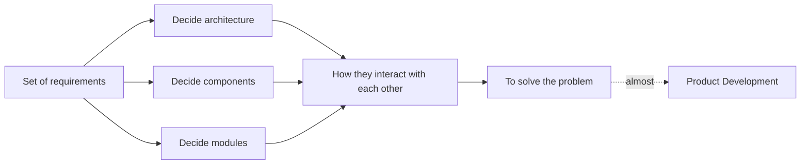

### Why is it so popular?

- Every single "tech" product is a "system" that has been "designed".
- Companies are building products and need you all to design them.

### Why is understanding system design important?

- This is what people do at work.
- Everything is practical.
- You can see it from day 1 of joining a company.
- Once you grow in your career, you will spend 80% of your time doing this.

System design is hence relevant for literally everyone!

### Side effects of system design

- It will make everything else uninteresting.
- You solve real problems, not something made up.
- You learn to break down a problem statement.
- It re-wires your brain to think in a structured way, considering all possible cases to deliver a great user experience!

### What will we do when we design a system?

- Break down the problem statement into solvable sub-problems.
- Decide on the key components and their responsibilities.
- Decide on the boundaries of each component.
- Touch upon the key challenges in scaling it.
- Make our architecture fault tolerant and available.

## How to Approach System Design

System design is extremely practical, and there is a structured way to tackle the situations. Take baby steps, no matter what!

### Understand the problem statement

Without having a thorough understanding of the problem at hand, we would easily digress.

### Break it down into components (essential)

- **Note:** do not create components for the sake of it.
- **Note:** to start with, create only the components that you know are a must.

**eg:** Design Facebook. When the statement is too big, break it into components/features: Auth, Notification, Feed, Gamification.

The user talks to a gateway (GW), which fans out to the Auth, Notification and Feed components.

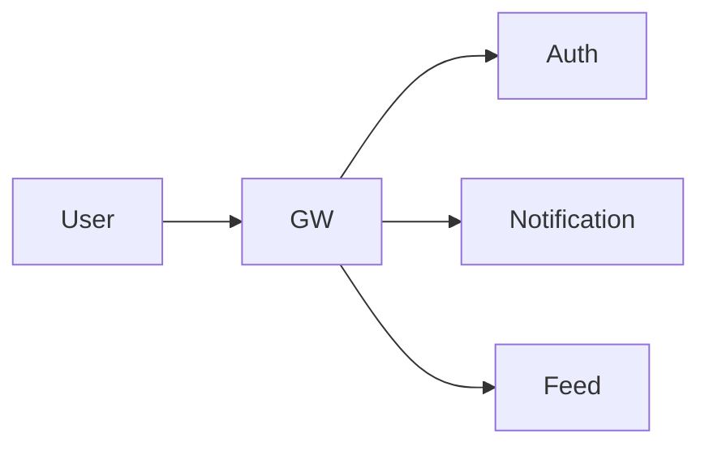

### Dissect each component (if required)

**eg:** Feed might have a generator, an aggregator and a webserver.

Inside the Feed component, the user talks to the Webserver in both directions; the Webserver reads from the Database; the Generator writes into the Database; and the Aggregator also writes into the Database.

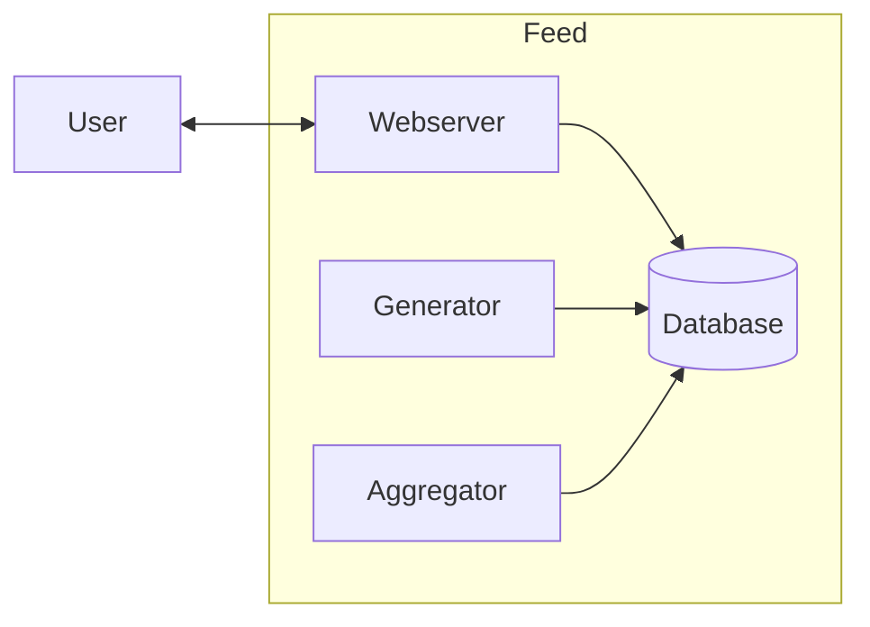

### For each sub-component look into

1. Database and Caching
2. Scaling and Fault Tolerance
3. Async processing (Delegation)
4. Communication

Repeat this for each sub-component, one by one.

### Add more sub-components if needed

- Understand the scope.
- Decide how other components will talk to this new one.
- Decide on the 4 factors above for this new component.
- Repeat.

Zooming into the Feed Generator: the Merger pulls from the Post service, the Recommendation service and the Follow service (dependencies on other services) and writes into the Feed Database. The user talks to the Webserver in both directions, and the Webserver reads from and writes to the Feed Database.

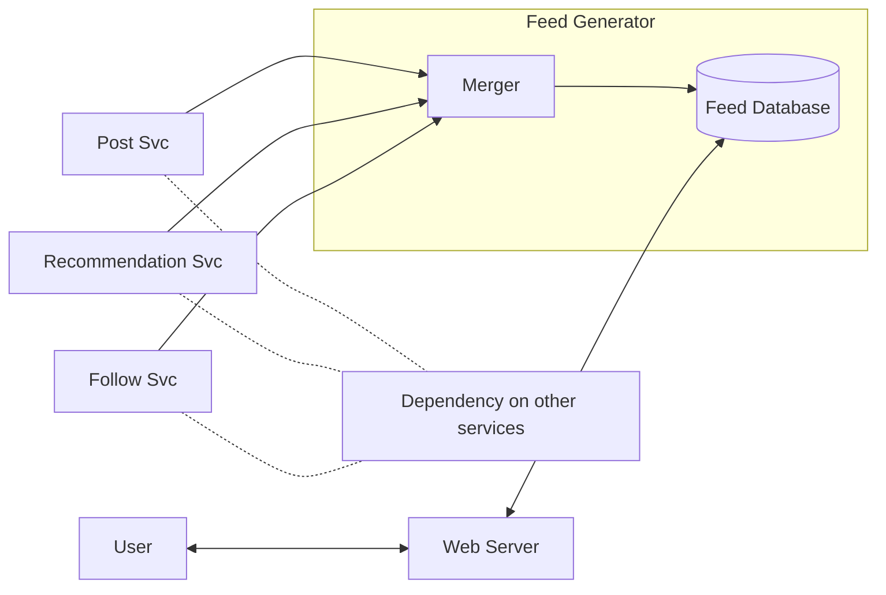

## Knowing You Have Built a Good System

How do you know that you have built a good system? Every system is "infinitely" buildable, and hence knowing when to stop the evolution is important. Here are some pointers that will help you.

### 1. You broke your system into components

Taking the Feed example: the user talks to the Webserver in both directions, the Webserver reads from the Database, and the Generator and Aggregator write into the Database.


### 2. Every component has a clear (exclusive) set of responsibilities

- **Feed Webserver** serves the feed over HTTP.
- **Feed Generator** pulls data from multiple services (posts, friends, recommendations) and puts them in the DB as candidate feed items.
- **Feed Aggregator** combines the candidate items fetched by the generator, filters out redundant ones, ranks them and creates a final consumable feed.

### 3. For each component, you have slight technical details figured out

1. Database and Caching
2. Scaling and Fault Tolerance
3. Async processing (Delegation)
4. Communication

### 4. Each component (in isolation) is

- **Scalable:** horizontally scalable (mostly the data).
- **Fault tolerant:** there is a plan for recovery to a stable state in case of a failure.
- **Available:** the component functions even when some other component "fails".

This is precisely how we would tackle every single system: structured and detailed.


---

# Part 2: Databases

## Relational Databases

Databases are the most critical component of any system. They make or break a system.

In a relational database, data is stored and represented in rows and columns.

### History of relational databases

Everything "revolutionary" starts with financial applications (computers, the internet, blockchain). Computers first did "accounting", which means ledgers, which means rows and columns. Databases were developed to support accounting, hence the key properties were:

1. Data consistency
2. Data durability
3. Data integrity
4. Constraints
5. Everything in one place

Because of these reasons, relational databases provide "Transactions"!

### ACID

- **A** - Atomicity
- **C** - Consistency
- **I** - Isolation
- **D** - Durability

#### Atomicity

All statements within a transaction take effect, or none of them do.

**eg:** publish a post and increase the total posts count in one transaction:

```sql
START TRANSACTION;
INSERT INTO posts VALUES (....);
UPDATE stats SET total_posts = total_posts + 1 WHERE user_id = 100;
COMMIT;
```

#### Consistency

Data will never go incorrect, no matter what. This is enforced through constraints, cascades and triggers.

**eg:** foreign key checks do not allow you to delete a parent row if a child exists (this behaviour can be tuned).

You have the necessary tools to ensure that your data never goes inconsistent, e.g. `total_posts` = total entries in the posts table for the user!

#### Durability

When a transaction commits, the changes outlive an outage.

#### Isolation

When multiple transactions are executing in parallel, the isolation level determines how much of the changes of one transaction are visible to the other.

The sketch shows two transactions, Txn 1 and Txn 2, running side by side; a line in the middle of Txn 1 is linked to a line in Txn 2 with the question: should changes done at this line in Txn 1 be visible to Txn 2 before Txn 1 commits?

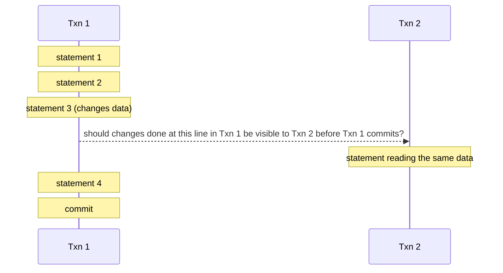

### Remember

You pick relational databases for relations and ACID.

### Exercise

1. Set up a SQL database (MySQL or PostgreSQL).
2. Create a schema for a social network: users, posts, profile, photos, following, etc. Define the relationships.
3. Insert data into users and profile in one transaction.

## Database Isolation Levels

Relational databases provide ACID guarantees. The I in ACID is "Isolation", and isolation levels help us tune it.

Isolation levels dictate how much one transaction knows about the other. We look at each one of them and understand it with examples.

The sketch is a timeline of two transactions running concurrently on two CPUs: T1 runs on CPU1 while T2 runs on CPU2, and their execution windows overlap in time.

```
time ------------------------------------>
T1   [==========]                 (CPU1)
T2          [==========]          (CPU2)
T1   [========]                   (CPU1)
```

### Repeatable Reads

Consistent reads within the same transaction: even if another transaction committed, the first transaction would not see the changes (if the value was already read).

### Read Committed

Reads within the same transaction always read the fresh (latest committed) value.

**Con:** multiple reads within the same transaction are inconsistent.

### Read Uncommitted

Reads even uncommitted values from other transactions: the "dirty read".

### Serializable

Every read is a locking read (the exact behaviour depends on the storage engine), and while one transaction reads, the others will have to wait.

**Note:** storage engines can alter the implementation of isolation levels, so read the documentation before you alter them.

## Database Scaling Techniques

Databases are the most important component of any system out there. They make or break any system. Hence, it is critical to understand how to scale them.

**Note:** these techniques are applicable to most databases out there, relational and non-relational. Read your DB documentation.

### Vertical Scaling

- Add more CPU, RAM and disk to the database.
- Requires downtime during the reboot.
- Gives you the ability to handle "scale", i.e. more load.
- Vertical scaling has a physical hardware limitation.

The sketch shows a small database node being replaced by a bigger one.

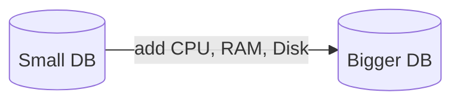

### Horizontal Scaling: Read Replicas

- Used when read : write = 90 : 10.
- You move reads to another database so that the "primary" is free to do writes.
- API servers should know which DB to connect to in order to get things done.

The API server writes to the Primary and reads from the Replica; changes flow from Primary to Replica through SYNC/ASYNC replication.

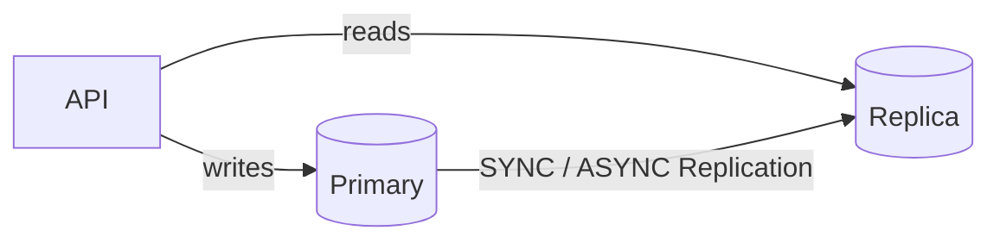

### Replication

Changes on one database (the Primary) need to be sent to the Replica to maintain consistency. There are two modes of replication.

#### 1. Synchronous replication

- Strong consistency
- Zero replication lag
- Slower writes

The write (W) from the user goes to the API, then to the Primary, and the Primary forwards it to the Replica; the acknowledgement travels back along the same path only after the Replica has acknowledged.

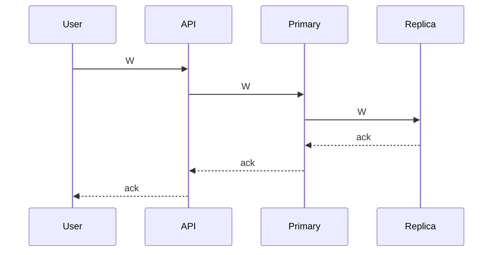

#### 2. Asynchronous replication

- Eventual consistency
- Some replication lag
- Faster writes

The write (W) goes from the user to the API to the Primary, which acknowledges immediately; the Primary and Replica then sync in the background.

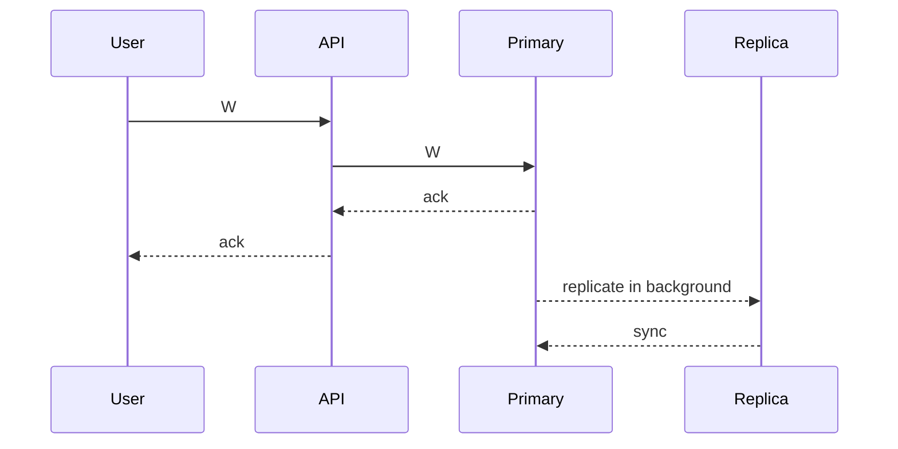

### Horizontal Scaling: Sharding

Because one node cannot handle the data/load, we split it into multiple exclusive subsets. Writes on a particular row/document will go to one particular shard. This way, we scale our overall database load.

- **Note:** shards are independent; there is no replication between them.
- The API server needs to know whom to connect to, to get things done.
- **Note:** some databases have a proxy that takes care of routing.
- Each shard can have its own replica (if needed).

The API server connects to each of Shard 1, Shard 2 and Shard 3 directly.

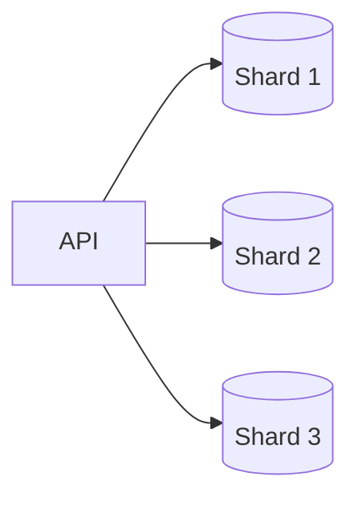

### Exercise

1. Configure one MySQL as a replica of another.
2. Put some data in and see the replication happening.
3. Write a small API service that has two connection objects: one to the primary and one to the replica.
4. Depending on the request, make the call to either the primary or the replica.
5. Implement sharding by spinning up two DBs: one handling keys (a to m), the second handling keys (n to z).
6. Write an API service that routes a request to one of them depending on the key.

## Sharding and Partitioning

- **Sharding:** a method of distributing data across multiple machines.
- **Partitioning:** splitting a subset of data within the same instance.

### How is a database scaled?

A database server is just a database process (mysqld, mongod) running on an EC2 machine, and we represent it as a single database cylinder.

The sketch shows a virtual server (EC2 machine) exposing port 3306, which is forwarded to the MySQL process running inside it.

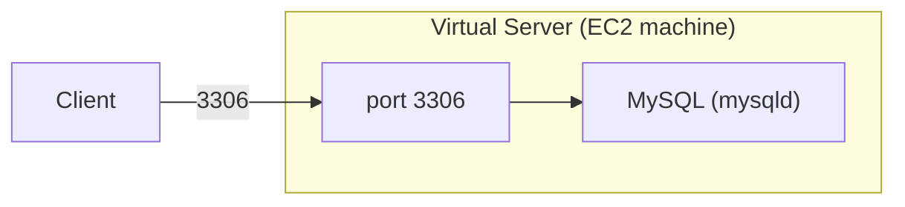

You put your database in production, serving real traffic: users talk to a fleet of API servers, which talk to one database handling 100 WPS (writes per second).

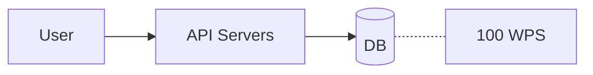

You are getting more users, so many that your DB is unable to manage. You scale up your DB, giving it more CPU, RAM and disk. The bigger database now handles 200 WPS.

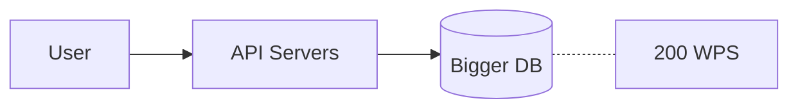

The next step: a bulkier server + a read replica.

Your product went viral and your bulky database is unable to handle the load, so you scale up again. The even bigger database now handles 1000 WPS.

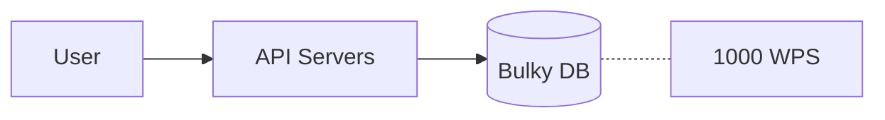

But after a certain stage you know you would not be able to scale "up" your DB, because **vertical scaling has a limit**. So, you will have to resort to horizontal scaling.

Say one DB server was handling 1000 WPS and we cannot scale up beyond that, but we are getting 1500 WPS. We scale horizontally and split the data: the API servers now talk to two databases, each holding 50% of the data and serving 750 WPS.

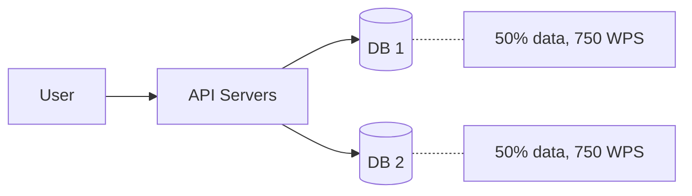

By adding one more database server, we reduced the load to 750 WPS on each node and thus handled a higher throughput.

Each database server is thus a **shard**, and we say that the data is **partitioned**. Overall, a database is sharded while the data is partitioned (split across). This is an oversimplification; most people use the terms interchangeably.

### Partitions vs shards

You partitioned the 100 GB of total data into 5 mutually exclusive partitions: A (30 GB), B (10 GB), C (30 GB), D (20 GB) and E (10 GB).

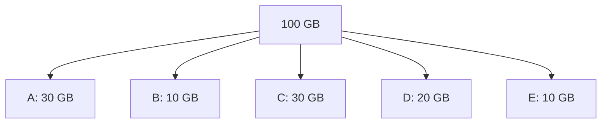

Each of these partitions can either live on one database server, or a couple of them can share one server. This depends on the number of shards you have.

In the sketch, the 5 partitions of our 100 GB dataset are distributed across 2 shards: partitions A (30 GB) and C (30 GB) go to Shard 1, while partitions B (10 GB), D (20 GB) and E (10 GB) go to Shard 2.

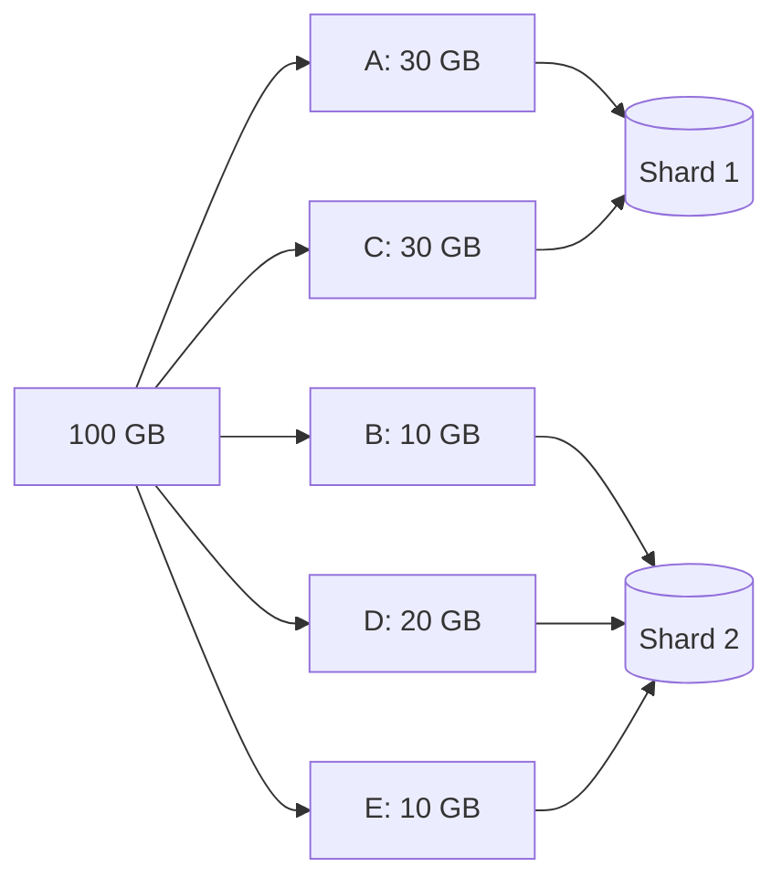

### How to partition the data?

There are two categories of partitioning:

1. Horizontal partitioning
2. Vertical partitioning

The sketch shows one box splitting into two boxes, representing a dataset being split into two partitions.

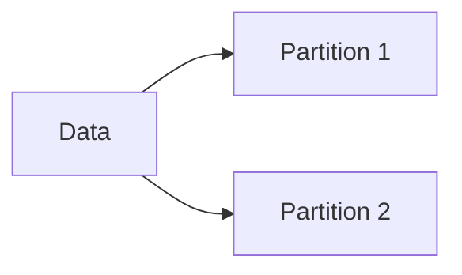

When we "split" the 100 GB data, we could have used either of the ways, but deciding which one to pick depends on load, use case and access pattern.

### Sharding and partitioning combinations

The matrix below shows the four combinations of sharding and partitioning. Without either, there is one database holding one whole table. With partitioning alone, one database holds the table split into two partitions. With sharding alone, the same table is copied to two databases (this is the read replica setup). With both, two databases each hold a different partition of the table.

| | Partitioning: No | Partitioning: Yes |
|---|---|---|
| **Sharding: No** | One DB holding the whole table | One DB holding two partitions of the table |
| **Sharding: Yes** | Two DBs, each holding a copy of the same table (Read Replica) | Two DBs, each holding a different partition of the table |

### Advantages of sharding

- Handle large reads and writes
- Increase overall storage capacity
- Higher availability

### Disadvantages of sharding

- Operationally complex
- Cross-shard queries are expensive

## Non-Relational Databases

"Non-relational" is a very broad generalization of databases that are not relational (i.e. not MySQL, PostgreSQL, etc.). But this does not mean all non-relational databases are similar.

### What makes non-relational databases interesting?

Most non-relational databases shard out of the box, which gives horizontal scalability.

We talk about the 3 most important types of NoSQL databases.

### Document DBs (MongoDB, Elasticsearch)

- Mostly JSON based.
- Support complex queries, so they are almost like relational (SQL) databases.
- Partial updates to documents are possible.
- Closest to a relational database.
- Use cases: in-app notification service, catalog service.

Example of a partial update: given a document like

```json
{
  "user_id": "...",
  "total_posts": 270
}
```

we can do `total_posts += 1` without re-writing the entire document.

### Key-Value Stores (Redis, DynamoDB, Aerospike)

- Extremely simple databases.
- Limited functionality: `GET(k)`, `PUT(k, v)`, `DEL(k)`.
- Meant for key-based access patterns.
- Do not support complex queries (aggregations).
- Can be heavily sharded and partitioned.
- Use cases: profile data, order data, auth data, messages, etc. (key-based access covers most of the use cases).

**Note:** You can use relational databases and document DBs as KV stores too.

### Graph Databases (Neo4j, Neptune, Dgraph)

What if our graph data structure had a database? A graph database stores data that is represented as nodes, edges, and relations.

The sketch on the page shows a small graph: a handful of circular nodes joined by edges (one central node connected to four neighbours, one of which links on to a further node).

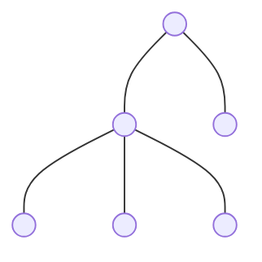

**eg:** relationships are stored as labelled edges between nodes, such as `A --FOLLOWS--> B` and `Alice --BOUGHT--> iPad`.

```mermaid
flowchart LR
    A["A"] -->|"FOLLOWS"| B["B"]
    U["Alice"] -->|"BOUGHT"| I["iPad"]
```

- Great for running complex graph algorithms.
- Powerful for modelling social networks, recommendations, and fraud detection.

### Exercise

On your local machine, spin up MongoDB, Redis and Neo4j and play around with them.

## Picking the Right Database

It is not a fight, so there is no need to pick a side. A database is designed to solve a **particular problem** really well.

The sketch shows a box containing several overlapping circles: each kind of database picks a segment of the problem space, with a slight overlap between neighbours.

```mermaid
flowchart LR
    subgraph S["Problem space"]
        D1(("Relational")) --- D2(("Document"))
        D2 --- D3(("Key-Value"))
        D3 --- D4(("Graph"))
    end
```

**Common misconception:** picking a non-relational DB because relational databases do not scale.

### Why non-relational DBs scale

- There are no relations and constraints.
- Data is modelled to be sharded, i.e. split across multiple nodes.

If we relax the above two points on a relational DB, we can scale it too!

- Do not use foreign key checks.
- Do not use cross-shard transactions.
- Do manual sharding.

The diagram shows a user talking to an API server, which routes to one of two database shards.

```mermaid
flowchart LR
    U["User"] --> API["API server"]
    API --> DB1[("DB shard 1")]
    API --> DB2[("DB shard 2")]
```

### Does this mean no DB is different?

No! Every single database has some peculiar properties and guarantees, and if you need those, you pick that DB.

### How does this help in designing a system?

While designing any system, do not jump to a particular DB right away.

1. Understand **what** data you are storing.
2. Understand **how much** data you will be storing.
3. Understand how you will be **accessing** the data.
4. What kind of **queries** you will be firing.
5. Any **special feature** you expect, eg: expiration.

### How to pick the right DB? (Not exhaustive, but you'll get the idea)

**If data can fit on a single node:**

- You need strong consistency and data correctness is critical → go for a relational database.
- You need complex queries, aggregations → go for a relational database.
- Your access is KV based but you need it to be really fast → go for Redis.
- You need advanced data structures and algorithms → go for Redis.

**If data cannot fit on one node:**

- You have expertise in SQL and can do manual sharding → drop constraints and go for a relational DB.
- You have simple KV based access → go for a KV store like DynamoDB, MongoDB, etc.
- You require sophisticated graph algorithms → go for a graph DB like Neo4j.
- You have nothing specific, but want to future-proof → go for a document DB like MongoDB.


---

# Part 3: Caching

## Understanding Caching

Caches are anything that helps you avoid an **expensive** network I/O, disk I/O, or computation. The goal is performance improvement.

Examples of expensive operations:

1. API call to get profile information.
2. Reading a specific line from a file.
3. Doing multiple table joins.

Store frequently accessed data in a temporary storage location.

The diagram shows a user talking to a set of API servers. The API servers talk to the database, but they also talk to a cache, and the cache is checked first.

```mermaid
flowchart LR
    U["User"] <--> API["API servers"]
    API <--> DB[("Database")]
    API <--> C[("Cache")]
```

- Fetching from the DB is expensive (eg: expensive DB query, expensive disk I/O).
- Hence, we "cache" the information in some other place, so that we do not have to go to the main database.
- The cache is checked first.

Caches are faster and expensive, hence we do not cache all the data, just a subset of it which is most likely to be accessed.

Caches that we typically use are Redis and Memcached.

**Note:** Caches are not restricted to RAM-based storage. Any storage that is "nearer" and helps you avoid something expensive is a cache for you!

In their simplest form, caches are just glorified hash tables.

### Some examples

1. **Google News:** the most recent news articles are more likely to be accessed, hence they are served from cache.
2. **Auth tokens:** authentication tokens are cached to avoid load on the database (tokens are checked on every request).
3. **Live stream:** the last 10 minutes of a live stream are cached on the CDN, as they will be accessed the most.

### Exercise

1. Set up Redis locally.
2. Put and get some data.
3. Measure the time taken.
4. Compare it with a database.

## Populating and Scaling Caches

### Populating the cache

The cache sits between the API server and the database. The diagram shows a user talking to a set of API servers, which talk to both the database and the cache.

```mermaid
flowchart LR
    U["User"] <--> API["API servers"]
    API <--> DB[("Database")]
    API <--> C[("Cache")]
```

There are two ways to populate the cache.

**Note:** Whenever we set something in the cache, we set an expiry.

#### Lazy population (most popular)

On a read, first go to the cache:

- If the data exists, return the data.
- Else (this is the lazy population part):
  - go to the database / do the heavy operation,
  - persist the result in the cache,
  - return the data.

**Example: caching blogs.** Fetching a blog from the DB is expensive (multiple joins). Hence, when someone accesses it, we fetch it from the DB and cache it on Redis. Subsequent requests are served from the cache.

#### Eager population

1. **Writes go to both the database and the cache in the same request call.**

   **Example: live cricket score.** Thousands of people are watching the cricket score and you will be serving it from the cache. So, why not update the cache and the DB at once and save the cache miss?

   The diagram shows the commentator (who updates the score) sending the update to a service, which writes to both MySQL and Redis.

   ```mermaid
   flowchart LR
       C["Commentator (updates the score)"] --> S["Score service"]
       S --> M[("MySQL")]
       S --> R[("Redis")]
   ```

2. **Proactively push data to the cache because you anticipate the need.**

   **Example: when a celebrity tweets / posts something.** When an account with 100,000 followers posts something, proactively push it to the cache. We will anyway need it, and we save a cache miss.

   The diagram shows the celebrity (creating a post) sending the post to a service, which writes to both MySQL and Redis.

   ```mermaid
   flowchart LR
       C["Celebrity (creates a post)"] --> S["Post service"]
       S --> M[("MySQL")]
       S --> R[("Redis")]
   ```

### Scaling the cache

A cache is just like a database, hence the scaling techniques for a cache like Redis are similar to those for a regular database.

#### Vertical scaling

Make your cache bigger to handle more data / load. (The sketch shows a small cache cylinder growing into a large one.)

#### Horizontal scaling: replicas (scaling reads)

The same data is replicated across multiple nodes so that reads can scale. The diagram shows the API talking to a primary node and a replica node.

```mermaid
flowchart LR
    API["API"] --> P[("Primary")]
    API --> R[("Replica")]
```

#### Horizontal scaling: sharding (scaling writes)

Data is partitioned across multiple shards so that writes can scale. The diagram shows the API talking to three separate shards.

```mermaid
flowchart LR
    API["API"] --> S1[("Shard 1")]
    API --> S2[("Shard 2")]
    API --> S3[("Shard 3")]
```

- Each shard can have a replica.
- Shards are mutually exclusive.

## Caching at Different Levels

The most common cache we saw was Redis, but that is not the only type of cache out there, nor the only place that can be used as a cache.

Literally every piece / component in your infrastructure can cache something for you. But should you? It depends on the guarantees (stale data and invalidation). Also, too much caching is bad!

Let's take a look at different places where we can cache.

### Client-side caching

Storing frequently accessed data on the client side, eg: browser, mobile devices, etc.

The diagram shows a user (client) talking to an API server, which talks to the database; the cache lives on the client, marked by a small box next to the user.

```mermaid
flowchart LR
    U["User / client (with local cache)"] <--> API["API server"]
    API <--> DB[("Database")]
```

- Cache near-constant data (eg: images, JS files, user information, etc.).
- It should be okay to serve cached (stale) info.
- Invalidation by time (expiry).

Massive performance boost, as we need not make any request to the backend.

### Content Delivery Networks (CDN)

CDNs are used for caching: live streaming, serving images, videos, audio, bundles, etc.

CDNs are a set of servers distributed across the world. A request from a user goes to the nearest CDN server, and hence the user gets a very quick response. US folks getting images from US servers is faster than fetching them from India.

The sketch shows a globe with a user connected to two CDN servers located in different parts of the world.

**Note:** CDN does lazy cache population.

The diagram shows the user talking to the CDN, and the CDN talking to the API (the origin server).

```mermaid
flowchart LR
    U["User"] <--> CDN["CDN"]
    CDN <--> API["API (origin server)"]
```

Flow:

- The user's request comes to the CDN (the closest server).
- The CDN server checks if it has the data.
- If yes, return the data.
- Else, the CDN makes the same request to the origin, gets the response, caches the response, and returns the data.

The diagram shows a user in India whose request goes to the Mumbai CDN server (the closest one); other CDN servers exist in the US, Europe and Sydney, and the CDN nodes forward to the origin when needed.

```mermaid
flowchart LR
    U["User (India)"] <--> M["CDN: Mumbai (closest)"]
    M -->|"on cache miss"| O["Origin (API)"]
    US["CDN: US"] -->|"on cache miss"| O
    EU["CDN: Europe"] -->|"on cache miss"| O
    SY["CDN: Sydney"] -->|"on cache miss"| O
```

Like any other cache, when you put data on the CDN you set an expiry on it (post which the CDN deletes the data).

### Remote cache (Redis)

A remote cache is the centralized cache that we most commonly use (Redis). It is expensive and stores data in main memory. Multiple API servers use it to store frequently accessed data.

The diagram shows a user talking to the API, which talks to the DB and to the shared cache.

```mermaid
flowchart LR
    U["User"] <--> API["API"]
    API <--> DB[("DB")]
    API <--> C[("Cache")]
```

- Every key stored should have an expiration (otherwise: memory leak).
- The size of the cache is relatively very small as compared to a database.

### Database caching

Instead of computing the total posts by a user every time, we store `total_posts` as a column and update it once in a while. This saves an expensive DB computation.

The expensive query being avoided:

```sql
SELECT COUNT(*) FROM posts WHERE user_id = 123;
```

The `users` table:

| id  | name  | ... | total_posts |
|-----|-------|-----|-------------|
| 123 | Alice |     | 77          |

Every time a post is published, we also update the `users` table and do `total_posts = total_posts + 1`.

### Other places

**Note:** There are other places, like the load balancer, where we can cache.

**Note:** We can cache some data at every single component in the system, but should we do it? Not necessarily. It is very use-case specific and subject to the tolerance level for staleness of the served data.

Just because you can, does not mean you should.

### Exercise

1. Create an account on Akamai / Cloudflare.
2. Configure a simple CDN and understand how it is used.
3. Cache a simple image on the CDN and access it from the CDN using the CDN URL.


---

# Part 4: Asynchronous Processing and Messaging

## Message Queues

### Asynchronous processing

When a user sends a request and you immediately handle it, that is **synchronous**. (The sketch shows a user sending a request arrow to a server and getting a response arrow straight back.)

1. Loading the Instagram feed is synchronous.
2. Login on a website is synchronous.
3. Payments are synchronous.

Most interactions on the web are synchronous. But there are some things that should not be synchronous.

**eg: spinning up a virtual machine.** The sketch shows a user talking to an API server, which talks to a large host box in which a small VM is being created.

```mermaid
flowchart LR
    U["User"] <--> API["API server"]
    subgraph H["Host"]
        VM["VM being created"]
    end
    API -->|"spin up"| VM
```

Spinning up a VM takes minutes, and the user will not wait on the same page for the response. Instead, he/she would love to move around and keep checking the status once in a while. This is **asynchronous**.

The diagram shows the asynchronous flow: (1) the client sends a request to the API, (2) the API puts a task on the broker, (3) the API responds to the client. Workers pick tasks from the broker and update the database, which the API also reads.

```mermaid
flowchart LR
    C["Client"] -->|"1. request"| API["API"]
    API -->|"3. response"| C
    API -->|"2. Task"| B["Broker"]
    B --> W1["Worker"]
    B --> W2["Worker"]
    B --> W3["Worker"]
    W3 -->|"update DB"| DB[("Database")]
    API --- DB
```

### Message queues

Brokers help two services / applications communicate through messages. We use message brokers when we want to do something **asynchronously**:

1. Long-running tasks.
2. Trigger dependent tasks across machines.

**Example: video processing.** Once the video is uploaded, we need to convert it to 360p, 480p, 720p.

The diagram shows three Video Upload Service instances uploading to S3 and pushing messages into a queue (SQS / RabbitMQ). Three Video Processing Service instances consume from the queue and read the video from S3.

```mermaid
flowchart LR
    S3["S3"]
    VU1["Video Upload Service"] --> S3
    VU1 --> Q["SQS / RabbitMQ"]
    VU2["Video Upload Service"] --> Q
    VU3["Video Upload Service"] --> Q
    Q --> VP1["Video Processing Service"]
    Q --> VP2["Video Processing Service"]
    Q --> VP3["Video Processing Service"]
    VP1 --> S3
```

Message queues are also called message brokers.

### Features of message brokers

1. **Brokers help us connect different sub-systems.** (The sketch shows two services joined through a queue.)

   ```mermaid
   flowchart LR
       A["Service A"] --> Q["Queue"] --> B["Service B"]
   ```

2. **Brokers act as a buffer for the messages**, i.e. consumers can consume at their own pace. There is no synchronous load on the connected systems.

   **eg: notification system.** Three Orders Service instances push messages into a queue, and a single Email Sender consumes them.

   ```mermaid
   flowchart LR
       O1["Orders Service"] --> Q["Queue"]
       O2["Orders Service"] --> Q
       O3["Orders Service"] --> Q
       Q --> E["Email Sender"]
   ```

3. **Brokers can retain messages for 'n' days** (depends on the broker you use).

4. **Brokers can re-queue the message if it is not deleted** (depends on the broker you use).

   **eg:** a consumer read the message but, before it could delete it, it crashed. (The sketch shows a queue delivering a message to a consumer that is crossed out.)

   ```mermaid
   flowchart LR
       Q["Queue"] -->|"message"| C["Consumer (crashed)"]
   ```

### Typical flow while using a message queue

**Example: auto-subtitle (auto-captioning).**

The diagram shows a user talking to the video service, which uploads to S3, writes to its DB, and pushes a `video_upload` message to a queue. Three captioner instances consume from the queue, download the video from S3, and write captions back to the DB.

```mermaid
flowchart LR
    U["User"] <--> V["Video service"]
    V --> S3["S3"]
    V <--> DB[("DB")]
    V -->|"video_upload"| Q["Queue"]
    Q --> C1["Captioner"]
    Q --> C2["Captioner"]
    Q --> C3["Captioner"]
    C1 --> S3
    C3 -->|"update captions"| DB
```

1. The user uploads a video to S3 through the video service.
2. The video service puts a message (after the upload completes) on the broker.
3. And returns a response to the user. The user sees "upload complete".
4. The message is asynchronously read by the captioner service.
5. The captioner downloads the video.
6. The captioner generates captions and updates them in the DB.
7. The user now sees the caption button enabled.

### Exercise

1. Set up RabbitMQ locally.
2. Write some code to push and read messages.
3. Go through the documentation to understand its features.

## Message Streams and Kafka

### Message Streams

Message streams are similar to message queues, with a few differences. To understand, let's take an example.

Say we are building Medium.com, and upon every blog published, we:

- need to index it in a search engine (Elasticsearch)
- need to do `count++` for the user's total blogs

#### Approach 1: One message broker, with the logic in the consumer

The user hits the API server, which writes to the main database and publishes a message to a RabbitMQ broker. A pool of consumers reads from the broker; each consumer both indexes the blog into Elasticsearch and does `count++` on the main database.

```mermaid
flowchart LR
    U["User"] --> API["API"]
    API <--> MQ["RabbitMQ"]
    API --- DB["Main Database"]
    MQ --> C1["Consumer"]
    MQ --> C2["Consumer"]
    MQ --> C3["Consumer"]
    C1 -->|"index"| ES["Elasticsearch"]
    C2 -->|"index"| ES
    C3 -->|"index"| ES
    C1 -->|"count++"| DB
    C2 -->|"count++"| DB
    C3 -->|"count++"| DB
```

Consumers are doing two things: `count++` and index.

**Issue:** what if the write to one succeeded but the other one failed? `count++` succeeded but the blog is not there in search, or it is there in search but the count does not match.

#### Approach 2: Two brokers and two sets of consumers

The API server writes to two RabbitMQ brokers, and each broker has its own set of consumers: the Search consumers index into Elasticsearch, and the Counter consumers update the count in the main database.

```mermaid
flowchart LR
    U["User"] --> API["API"]
    API <--> MQ1["RabbitMQ 1"]
    API --> MQ2["RabbitMQ 2"]
    API --- DB["Main Database"]
    MQ1 --> S["Search consumers"]
    S -->|"index"| ES["Elasticsearch"]
    MQ2 --> C["Counter consumers"]
    C -->|"count++"| DB
```

This still does not solve the problem! When the API server writes to two RabbitMQ brokers and one of them fails, we end up in the same spot.

Hence, we want "write to one" and "read by many" semantics. This is where message streams come into the picture, e.g. Kafka, Kinesis.

#### Message Streams

Message streams are similar to message brokers with one change: multiple types of consumers read the same message.

#### Approach 3: Using streams and multiple types of consumers

The API server pushes one message into Kafka. The Search service and the Counter service both read the same message and do their work: Search indexes into Elasticsearch, Counter updates the main database.

```mermaid
flowchart LR
    U["User"] --> API["API"]
    API <--> K["Kafka"]
    API --- DB["Main Database"]
    K --> S["Search consumers"]
    S -->|"index"| ES["Elasticsearch"]
    K --> C["Counter consumers"]
    C -->|"count++"| DB
```

### Message Queues vs Message Streams

In a message queue (SQS, RabbitMQ), a message in the queue is delivered to exactly one of the consumers in the pool. In a message stream (Kafka, Kinesis), the messages are retained in the stream and each type of consumer (Search, Counter) reads every message.

```mermaid
flowchart LR
    subgraph MQ["Message Queues: SQS, RabbitMQ"]
        Q["Queue: one message"] --> QC1["Consumer"]
        Q --> QC2["Consumer"]
        Q --> QC3["Consumer"]
    end
    subgraph MS["Message Streams: Kafka, Kinesis"]
        ST["Stream: many messages retained"] --> SS["Search consumers"]
        ST --> SC["Counter consumers"]
    end
```

### Kafka Essentials

A producer publishes a message ("on publish") into the stream, and it flows through to the consumers on the other end.

- Kafka is a message stream that holds the messages.
- Internally, Kafka has topics.
- Every topic has `n` partitions.
- A message is sent to a topic, and depending on the configured hash key it is put into a partition.
- Within a partition, messages are ordered.
  - There is no ordering guarantee across partitions.

```mermaid
flowchart LR
    P["Producer: on publish"] --> T["Topic"]
    T --> P1["Partition 1: ordered messages"]
    T --> P2["Partition 2: ordered messages"]
    T --> P3["Partition n: ordered messages"]
```

#### Limitation of Kafka

Max number of active consumers (within one consumer group) = number of partitions.

A topic with 3 partitions can feed at most 3 consumers in a consumer group (search consumer 1, 2 and 3). Any additional consumers (a 4th and 5th) sit idle: no messages would be sent to them.

```mermaid
flowchart LR
    T["Topic: partitions = 3"] --> C1["search consumer 1"]
    T --> C2["search consumer 2"]
    T --> C3["search consumer 3"]
    C4["search consumer 4: no messages would be sent"]
    C5["search consumer 5: no messages would be sent"]
```

### Exercise

1. Set up Kafka locally.
2. Write some code to push and read messages.
3. Go through the documentation to understand its features.

## Realtime Pub/Sub

Both message brokers and message streams require consumers to "pull" the messages out.

- **Advantage:** consumers can pull at their own pace; consumers do not get overwhelmed.
- **Disadvantage:** consumption lag when there is high ingestion.

What if we want low latency and zero lag? Use realtime pub/sub. Realtime pub/sub makes things reactive instead of relying on continuous polling.

Instead of consumers pulling the message, the message is pushed to them. E.g. Redis Pub/Sub.

A publisher sends a message into the channel, and the channel pushes that message out to every subscribed consumer.

```mermaid
flowchart LR
    P["Publisher"] --> CH["Channel: message"]
    CH -->|"push"| S1["Subscriber"]
    CH -->|"push"| S2["Subscriber"]
    CH -->|"push"| S3["Subscriber"]
```

This way we get really fast delivery time, but it can overwhelm the consumers.

- What if consumers receive messages faster than they could process?

**Practical use case:** message broadcast, configuration push. All servers receive updates without polling for data.

A configuration change is published once into the channel, and every server subscribed to it receives the update immediately.

```mermaid
flowchart TD
    CH["Channel: config update"] --> A["Server"]
    CH --> B["Server"]
    CH --> C["Server"]
    CH --> D["Server"]
```

### Exercise

1. Set up Redis locally.
2. Go through Redis Pub/Sub documentation.
3. Test realtime broadcast.
4. Test if it persists the message (check if a new subscriber gets old messages).


---

# Part 5: Resilience and Scale

## Load Balancers

One of the most important components in a distributed system that makes it easy to scale the load horizontally.

- The load balancer is the only point of contact.

Clients send their requests to the load balancer, which sits in front of the pool of servers and forwards each request to one of them.

```mermaid
flowchart LR
    U1["User"] --> LB["LB"]
    U2["User"] --> LB
    LB --> S1["Server"]
    LB --> S2["Server"]
    LB --> S3["Server"]
```

Every load balancer has either:

1. a static IP, or
2. a static DNS name,

allowing clients (users / servers) to talk to it.

The load balancer hides the number of servers that are "behind" it, allowing us to add as many servers as possible without the client knowing about it. This gives horizontal scalability.

### Request Response Flow

1. The client already has the IP / domain of the load balancer. E.g. `auth.example.com`.
2. The client makes an API call and it comes to the load balancer. E.g. `GET auth.example.com/login`.
3. The load balancer picks one server and makes the same request to it.
4. The load balancer gets the response from the server.
5. The load balancer responds back to the client.

The job of the load balancer is to "balance" the load. How well it does so depends on how it picks the server to forward the request to, and this is configurable.

### Load Balancing Algorithms

Each diagram below shows the load balancer on the left, three servers on the right, and the request numbers (1, 2, 3, ...) that each server ends up handling.

#### Round Robin

Distribute the load iteratively. Suited to a uniform infrastructure.

```mermaid
flowchart LR
    LB["Load Balancer"] --> A["Server: requests 1, 4"]
    LB --> B["Server: requests 2, 5"]
    LB --> C["Server: requests 3, 6"]
```

#### Weighted Round Robin

Distribute the load iteratively but as per weights. Suited to a non-uniform infrastructure (the middle, bigger server has a higher weight and receives twice as many requests).

```mermaid
flowchart LR
    LB["Load Balancer"] --> A["Server: requests 1, 5"]
    LB --> B["Bigger Server, higher weight: requests 2, 3, 6, 7"]
    LB --> C["Server: requests 4, 8"]
```

#### Least Connections

Pick the server having the least connections from the load balancer. Useful when response times have a big variance, e.g. analytics.

```mermaid
flowchart LR
    LB["Load Balancer"] --> A["Server: requests 1, 5, 7"]
    LB --> B["Server: requests 2, 4, 8, 9"]
    LB --> C["Server: requests 3, 6, 10"]
```

#### Hash Based Routing

The hash of some attribute (IP, user id, URL) determines which server to pick. It is random enough.

```mermaid
flowchart LR
    LB["Load Balancer"] --> A["Server: requests 1, 3, 5"]
    LB --> B["Server: requests 4"]
    LB --> C["Server: requests 2, 6"]
```

### Key Advantages of Load Balancers

**Scalability:** with more servers behind the load balancer, we can now handle more requests.

With two servers of 100 RPM each behind the load balancer we can handle 200 RPM; adding a third 100 RPM server lets us handle 300 RPM.

```mermaid
flowchart LR
    subgraph Two["We can handle 200 RPM"]
        U1["User"] --> LB1["LB"]
        U2["User"] --> LB1
        LB1 --> A1["Server: 100 RPM"]
        LB1 --> A2["Server: 100 RPM"]
    end
    subgraph Three["We can handle 300 RPM"]
        U3["User"] --> LB2["LB"]
        U4["User"] --> LB2
        LB2 --> B1["Server: 100 RPM"]
        LB2 --> B2["Server: 100 RPM"]
        LB2 --> B3["Server: 100 RPM"]
    end
```

**Availability:** even if one of the servers crashes, it does not take down our entire system. The load balancer will forward requests to the other healthy servers, improving the availability.

With S2 down, the load balancer will forward any new request to S1 and S3.

```mermaid
flowchart LR
    U1["User"] --> LB["LB"]
    U2["User"] --> LB
    LB --> S1["S1"]
    LB -.-> S2["S2: down"]
    LB --> S3["S3"]
```

### Exercise

Go through the AWS Load Balancer documentation.

## Circuit Breakers

Circuit breakers prevent **cascading failures**!

Say you are building a social network that serves a feed for a user.

1. The user's request comes to the Feed service.
2. The Feed service pulls some info from Recommendation and some from Trending.
3. Recommendation and Trending both rely on the Profile service
   - to get the profile details of the user who made the post.
4. Recommendation and Trending depend on the Post service
   - to get details of the post.

The user talks to the Feed service, which fans out to the Recommendation and Trending services. Both of those call the Profile service (backed by the Profile DB) and the Post service (backed by the Posts DB). The Profile and Post services also talk to each other.

```mermaid
flowchart LR
    U["User"] <--> Feed["Feed"]
    Feed --> Rec["Recommendation"]
    Feed --> Tr["Trending"]
    Rec <--> Profile["Profile"]
    Tr <--> Post["Post"]
    Profile <--> Post
    Profile <--> PDB["Profile DB"]
    Post <--> PoDB["Posts DB"]
```

There are lots of other services that depend on the Profile service. If the Profile service's DB is overwhelmed, it slows down, and transitively all services dependent on it are affected: "timeouts" (higher response times).

This leads to:

1. complete outage, or
2. unresponsiveness,

both of which mean a poor user experience.

The same dependency graph applies: an overwhelmed Profile DB slows the Profile service, which slows Recommendation and Trending, which slows the Feed, which the user sees as an outage or unresponsiveness.

```mermaid
flowchart LR
    U["User"] <--> Feed["Feed"]
    Feed --> Rec["Recommendation"]
    Feed --> Tr["Trending"]
    Rec <--> Profile["Profile"]
    Tr <--> Post["Post"]
    Profile <--> Post
    Profile <--> PDB["Profile DB: overwhelmed"]
    Post <--> PoDB["Posts DB"]
```

**Idea:** what if we make a call to a service only if it is healthy?

This is a circuit breaker: we break the circuit down when we see the failure cascade!

Circuit breakers prevent the entire product from collapsing by preventing cascading failures.

### How is it implemented?

- A common database holds the settings for each breaker.
- Services, before making calls to others, check the config.
  - Cache the config to avoid checking the DB.

A shared Circuit Breaker DB is connected to every service (Feed, Recommendation, Trending, Post, and via Post to Profile). Each service consults it before calling a downstream service.

```mermaid
flowchart LR
    U["User"] <--> Feed["Feed"]
    Feed --> Rec["Recommendation"]
    Feed --> Tr["Trending"]
    Rec <--> Profile["Profile"]
    Tr <--> Post["Post"]
    Profile <--> Post
    Profile <--> PDB["Profile DB: overwhelmed"]
    Post <--> PoDB["Posts DB"]
    CB["Circuit Breaker DB"] --- Feed
    CB --- Rec
    CB --- Tr
    CB --- Post
    CB --- Profile
```

In case of the outage, the circuit is tripped and the DB is updated. Services will periodically check and stop sending requests to the affected services.

### Exercise

- Implement a simple circuit breaker (DB). See if you can use Redis Pub/Sub here.
- Write a simple service that checks this setting every time before calling. E.g.:
  - the Post service serves posts
  - the Profile service serves profiles
  - the Post service calls Profile for info
  - if the circuit is tripped, do not make the call to Profile

## Data Redundancy and Recovery

API servers are "stateless" but databases are "stateful".

- API servers going down is fine, because a new one will be spun up almost instantly. An API server gets a request and it does not matter which one handles it.
- Databases going down is catastrophic; it is almost always an outage! Worst case: a disk crash leading to loss of data!

A good system always takes care of such catastrophic situations.

- The only way to protect ourselves against loss of data is to create multiple copies of it. This is data redundancy.

Redundancy can be implemented at the row / document level, table level or DB level. Redundant data can be stored in a different table, a different DB or a different region.

### Backup and Restore

- Daily backup of data (incremental).
- Weekly complete backup.
- Storing one copy across regions, for disaster recovery.
- When something goes wrong, just restore the last backup.
- Almost always the easiest thing to do.

### Continuous Redundancy

Set up a replica of the database, and writes go to both DBs (sync / async):

1. The API server writes to both databases (sync).
2. The API server writes to one, and it is copied to the other asynchronously (async).

The API server writes synchronously to the main database and to the replica; alternatively, the main database asynchronously copies its writes over to the replica.

```mermaid
flowchart TD
    API["API"] -->|"sync"| Main["main"]
    API -->|"sync"| Replica["replica"]
    Main -->|"async"| Replica
```

- If the main database goes down, the replica can take its place (almost instantly).

**Note:** this replica may just be a stand-by and not serve any production traffic.

### Exercise

1. Set up replication between two MySQL servers.
2. See how you can back up a MySQL DB.
3. See how you can restore the database.

## Leader Election for Auto-Recovery

Say we have a bunch of servers serving HTTP requests.

```mermaid
flowchart LR
    S1["Server"]
    S2["Server"]
    S3["Server"]
```

When one of them goes down, we have to spin up a new one. Doing this is the responsibility of another module, say an orchestrator.

The orchestrator keeps an eye on the servers behind the load balancer. When one goes down, the orchestrator spins up a new one and adds it.

```mermaid
flowchart LR
    U["User"] --> LB["LB"]
    LB --> S1["Server"]
    LB --> S2["Server"]
    LB --> S3["Server"]
    O["Orchestrator"] -.->|"monitors"| S1
    O -.->|"monitors"| S2
    O -.->|"monitors"| S3
```

- No human intervention.
- Minimal outage time!

But what if the orchestrator is down? Who monitors it?

- We need an orchestrator for the orchestrator.
- Who monitors that?
- Another orchestrator??

This goes out of hand quickly!

Hence, we need an automated way to recover the system: when one orchestrator is down, somehow another orchestrator comes back up and takes its responsibilities.

### Leader Follower Setup

We run the orchestrator in leader-follower mode: multiple nodes running the orchestrator code, one leader while the others are workers / followers.

The leader keeps an eye on the workers. If a worker dies, the leader spins up a new one.

Workers ping the servers and check if they are healthy.

Several orchestrator workers monitor the servers behind the load balancer, while the orchestrator leader monitors the workers.

```mermaid
flowchart LR
    U["User"] --> LB["LB"]
    LB --> S1["Server"]
    LB --> S2["Server"]
    LB --> S3["Server"]
    W["Orch. Worker"] -.->|"monitors"| S1
    W -.->|"monitors"| S2
    W -.->|"monitors"| S3
    L["Orch. Leader"] -.->|"monitors"| W
```

- If an orchestrator worker finds a backend server is unhealthy, it spins up a new one.
- If the orchestrator leader finds that an orchestrator worker is unhealthy, it spins up a new one.
- If the orchestrator workers find the orchestrator leader is dead, they trigger a leader election and the system is auto-recovered.

How the workers will choose a leader depends on the leader election algorithm.

**Note:** this is a generic concept and we can apply it to any system that needs an ability to auto-recover.

### Exercise

Simulate leader failure and run a leader election: workers = threads (no need for multiple machines).


---

# Part 6: Communication, Storage and Core Algorithms

## Client-Server Model and Communication Protocols

### Client-Server Model

The client-server model is the most common way for two machines to talk to each other. A client (C) demands something, and a server (S) does the job.

- eg: give me my profile info
- eg: delete the post I made
- eg: spin up one server

The diagram shows a client box connected by a line to a server box; the client "demands" and the server "does the job".

```mermaid
flowchart LR
    C["C (client) - demands"] --- S["S (server) - does the job"]
```

The communication happens over the common network connecting the two. There are two protocols to exchange data: TCP and UDP. We use TCP almost 99.99% of the time.

### Some important properties of TCP

1. A TCP connection requires a 3-way handshake for setup.
2. A TCP connection requires a 2-way handshake for teardown.
3. A TCP connection does not break immediately after data is exchanged.
   - It breaks because of a network interruption.
   - It breaks because the server/client initiated it.

Hence the connection remains open... almost "forever".

The handshake sketches show three arrows (client to server, server to client, client to server) for setup and two arrows (client to server, server to client) for teardown.

```mermaid
sequenceDiagram
    participant C as Client
    participant S as Server
    Note over C,S: 3-way handshake for setup
    C->>S: 1
    S->>C: 2
    C->>S: 3
    Note over C,S: 2-way handshake for teardown
    C->>S: 1
    S->>C: 2
```

### Protocol over TCP

TCP does not dictate what data can be sent over it. A common format agreed upon by the client and server is called a protocol, e.g. HTTP.

HTTP is just a format that the client and server understand.

- You can define your own format, and make
  1. your client send data in it
  2. your server parse and process it

The sketch shows a client box connected to a server box, with the client sending a custom-format message `"GET_K\n"`.

```mermaid
flowchart LR
    C["C (client)"] -->|"GET_K + newline"| S["S (server)"]
```

### Properties of HTTP 1.1

There are many versions of HTTP: HTTP 1.1 / HTTP 2 / HTTP 3. HTTP 1.1 is the most commonly used one.

1. For the client and server to talk over HTTP 1.1, they need to establish a TCP connection.
2. The connection is typically terminated once the response is sent to the client.
3. Almost a new connection for every request/response.
   - This is a little expensive.
4. Hence people pass the `Connection: Keep-Alive` header, which tells the client and server to not close the connection.
   - It depends on whether the server follows it or not.

### WebSocket

WebSockets are meant to do bi-directional communication.

**Key feature:** the server can proactively send data to the client, without the client asking for it.

Because there is no need for setting up TCP every single time, we get really low latency in communication.

The sketch compares two client-server pairs. With WebSockets, a single long-lived connection carries a continuous stream of messages in both directions (a dense stack of lines between the two boxes). With HTTP 1.1, each request/response is a separate exchange, with connection setup and teardown around each one (lines grouped into separate request/response pairs).

```mermaid
flowchart LR
    subgraph WS["WebSockets"]
        C1["Client"] <-->|"one persistent connection, continuous bi-directional messages"| S1["Server"]
    end
    subgraph H11["HTTP 1.1"]
        C2["Client"] -->|"request 1, then connection closed"| S2["Server"]
        C2 -->|"request 2, then connection closed"| S2
        C2 -->|"request 3, then connection closed"| S2
    end
```

Anywhere you need "realtime", "low latency" communication for your end user over the internet, think about WebSockets.

- eg: chat, realtime likes on a live stream, stock market ticks

### Exercise

- Build a chat application using Socket.IO.

## Blob Storage and S3

### Storing files on the server

Earlier, when people uploaded any files, they uploaded them to the "server" and the files were stored on the hard disk attached to it. Getting a file was simple: make an API call, the handler reads the file and returns it.

The sketch shows a user sending a request to a single server, which has a disk attached to it.

```mermaid
flowchart LR
    U["User"] --> S["Server"]
    S --> D["Disk attached to server"]
```

- This is precisely how `/static` folders / routes worked.

When the user uploads the file (e.g. `a.txt`):

- Accept it on HTTP POST.
- Create the absolute path using the folder mapped to `/static`: `/home/user/www/static/a.txt`.
- Store the file at that location.

When the user requests `/static/a.txt`:

- Get the path from the URL.
- Create the absolute path: `/home/user/www/static/a.txt`.
- Read the file and return it.

This is how the early days of the internet worked. It worked well for quite some time, but it won't work with multiple servers, because each server will have its own disk.

The sketch shows a user sending requests to a load balancer, which forwards them to two servers. Each server has its own attached disk: the first holds `a.txt`, the second holds `b.txt`, so a file uploaded to one server is not visible from the other.

```mermaid
flowchart LR
    U["User"] --> LB["Load Balancer"]
    LB --> S1["Server 1"]
    LB --> S2["Server 2"]
    S1 --> D1["Disk: a.txt"]
    S2 --> D2["Disk: b.txt"]
```

### Infinitely scalable network-attached storage

Hence, we need an infinitely scalable network-attached storage / file system. This is S3 / Blob Storage.

Any "file" that needs to be accessible by any server is stored at a place accessible by all. Our API servers are now stateless.

The sketch shows two users sending requests to a load balancer, which distributes them across three API servers. All three servers read from and write to a shared S3 cloud that holds `a.txt` and `b.txt`.

```mermaid
flowchart LR
    U1["User 1"] --> LB["Load Balancer"]
    U2["User 2"] --> LB
    LB --> A1["API Server 1"]
    LB --> A2["API Server 2"]
    LB --> A3["API Server 3"]
    A1 --> S3["S3 (a.txt, b.txt)"]
    A2 --> S3
    A3 --> S3
```

### S3 concepts

On S3 you have:

- **Buckets:** a namespace, eg: `insta-images`, `my-bucket` (any unique name).
- **Keys:** the path of the file within the bucket.

```
s3://insta-images/user123/72896.png
     ^bucket^     ^-------key------^
```

You can seamlessly:

- create the file,
- replace the file,
- delete the file,
- read the entire file or a segment of it.

It is not a full-fledged file system.

### Advantages

- Cheap, durable storage.
- Can store literally any file: images, video, audio, text, DB backups, DB CSV exports, anything.
- Scalable and available.
- Integration with a lot of AWS and Big Data services.

### Disadvantages

- Reads on S3 are slow. So if you want quick reads, you should not use S3.
  - SSDs and HDDs attached to instances are better.
- Not a full-fledged file system.

### When to use S3

You should use S3 when you want to store a "blob" that is centrally accessible.

- Database backups
- Static website hosting
- Big Data storage
- Logs archival
- Infrequently accessed data dumping ground

### Exercise

1. Go through the S3 documentation and explore the API.
2. Read about ACLs on S3.
3. If possible, play around with its API.

## Bloom Filters

Bloom Filters are approximate data structures (also called probabilistic data structures) that say with 100% certainty that an element does not belong to a set.

### Motivating example

For example, Instagram wants to recommend reels, but it does not want to recommend something you saw already.

**Naive way:** keep track of everything that a user saw in a set.

```
u1 -> < p1, p4, p7, p1024, p1056 >
^user   ^-- posts he/she saw --^
```

People watch 100s of reels every single day. Over time, the set of all posts watched by a user will be huge!

So what? To check the existence of a key in the set, we have to load the entire set in memory and then check. This is super expensive and time consuming.

So, can we do better?

**Key insight:** once something is "watched", you cannot take it back.

- Once a post/reel is watched by you, we do not take it out of the set!

This means storing the actual data is not worth it. This is the concept over which Bloom Filters are set up.

### How Bloom Filters work

A filter is approximately a bit array (eg: we take an 8-bit array).

Words I want to put in:

- apple -> `f(apple) % 8` -> 2
- ball -> `f(ball) % 8` -> 6
- cat -> `f(cat) % 8` -> 2

The diagram shows an 8-bit array with indices 0 to 7. Bits 2 and 6 are set to 1 (all others are 0). Arrows point from apple and cat to index 2, and from ball to index 6.

```
index:  0   1   2   3   4   5   6   7
bit:  | 0 | 0 | 1 | 0 | 0 | 0 | 1 | 0 |
                ^               ^
           apple, cat          ball
```

Now checking for words:

- dog -> `f(dog) % 8` -> 5; `filter[5] = 0` -> dog is not present!
- elephant -> `f(elephant) % 8` -> 6; `filter[6] = 1` -> elephant may be present.

Thus we see: when the Bloom Filter says No, we can be sure. But when it says Yes, we still need to check.

### Space efficiency

Bloom Filters take significantly less space to hold the information (because they do not store keys) and are very efficient in checking existence (just an array lookup).

### False positivity rate

As the number of keys we put in the Bloom Filter increases, the false positivity rate increases.

- False positive: says the key is present but in reality it is not.

Hence, when the number of keys increases:

1. We have to re-create the Bloom Filter with a larger size and populate the keys again.
2. Estimate the max keys and provision a large one to start with.

### Practical Bloom Filter

We do not have to re-implement a Bloom Filter. There are libraries in every single language. Redis has it as one of its core features; nowadays, mostly people go for this.

### Practical application

Use it whenever:

- you insert but do not remove data
- you need a No with 100% certainty
- having false positives is okay

Examples:

- eg: Medium recommendation
- eg: feed generation
- eg: web crawler
- eg: Tinder feed

### Exercise

1. Set up Redis locally.
2. Read Redis's documentation on Bloom Filter.
3. Write small code to play around with it (understand how to use it).
4. Try to get one false positive result.

## Consistent Hashing

Consistent hashing is one of the most amazing and popular algorithms out there, and the only problem it solves is **data ownership**. We first understand consistent hashing and then look into a practical implementation.

### Hash-based ownership

Say we have a load balancer, and when a request comes in, it uses the hash of the access token to decide which backend server to forward it to.

The diagram shows users U1 and U2 sending requests to a load balancer, which forwards each request to one of three backend servers (B. server 0, B. server 1, B. server 2) using `fn(r.id) % 3`, where `r.id` is the access token in the request.

```mermaid
flowchart LR
    U1["U1"] --> LB["Load Balancer<br/>fn(r.id) % 3<br/>(r.id = access token in the request)"]
    U2["U2"] --> LB
    LB --> S0["B. server 0"]
    LB --> S1["B. server 1"]
    LB --> S2["B. server 2"]
```

SHA-256 or SHA-128 are popular choices.

```
SHA256(u1) = x
server = x % 3 = i
```

**Note:** the hashing logic is NOT a "service", but just simple code running in the load balancer's code. It is more of a function.

If one of the servers is taken down, then the routing function changes. Now the requests will be evenly distributed between the remaining two servers. So, no hiccups!

The diagram shows the same setup with B. server 1 crossed out; the load balancer now routes using `fn(r.id) % 2` (the `% 3` is struck through and replaced by `% 2`).

```mermaid
flowchart LR
    U1["U1"] --> LB["Load Balancer<br/>fn(r.id) % 2 (was % 3)<br/>(r.id = access token in the request)"]
    U2["U2"] --> LB
    LB --> S0["B. server 0"]
    LB -.-> S1["B. server 1 (taken down)"]
    LB --> S2["B. server 2"]
```

### Load balancers are stateless

Because the API servers are stateless, which means every server is equally capable of handling requests, it does not matter if a request that was handled by server 1 now starts going to server 0.

This is precisely why we see "hash-based routing" as one of the most common ways of routing for stateless backends, eg: Load Balancer + API servers.

### Hash-based "routing" (ownership) for distributed storage

Instead of stateless API requests, say we are having a stateful distributed storage:

1. Nodes store the data.
2. A proxy forwards the request to a node.
3. The end user / client talks to the proxy.

Picking which node "owns" the data depends on hash-based ownership.

The diagram shows two users talking to a proxy, which routes each key with `fn(k) % 3` to one of three storage nodes: node 0 holds K2 and K6, node 1 holds K3 and K5, node 2 holds K1 and K4.

```mermaid
flowchart LR
    U1["User"] --> P["Proxy<br/>fn(k) % 3"]
    U2["User"] --> P
    P --> N0["node 0<br/>K2, K6"]
    P --> N1["node 1<br/>K3, K5"]
    P --> N2["node 2<br/>K1, K4"]
```

Say we want to store 6 keys: K1, K2, K3, K4, K5 and K6.

| Key | `fn(k) % 3` | Owner |
|-----|-------------|-------|
| K1 | 2 | node 2 |
| K2 | 0 | node 0 |
| K3 | 1 | node 1 |
| K4 | 2 | node 2 |
| K5 | 1 | node 1 |
| K6 | 0 | node 0 |

This is okay to do when the workload is stateless, like an API load balancer.

**Challenge:** if a storage node is removed or added, the proxy cannot just forward the request to any arbitrary node because it won't have the data.

### Repartitioning

When the number of nodes changes, the proxy will change the routing function and it would now become `fn(k) % 2`. Now, all the keys would need to be re-evaluated and moved to the correct node. This involves a lot of data transfer.

Before (3 nodes, `fn(k) % 3`):

| Key | `fn(k) % 3` |
|-----|-------------|
| K1 | 2 |
| K2 | 0 |
| K3 | 1 |
| K4 | 2 |
| K5 | 1 |
| K6 | 0 |

After (2 nodes, `fn(k) % 2`):

| Key | `fn(k) % 2` |
|-----|-------------|
| K1 | 0 |
| K2 | 1 |
| K3 | 1 |
| K4 | 0 |
| K5 | 1 |
| K6 | 0 |

The diagram shows the proxy now routing with `fn(k) % 2` to two nodes: node 0 holds K1, K4, K6 and node 1 holds K2, K3, K5.

```mermaid
flowchart LR
    P["Proxy<br/>fn(k) % 2"] --> N0["node 0<br/>K1, K4, K6"]
    P --> N1["node 1<br/>K2, K3, K5"]
```

Can we minimize the data movement? This is where consistent hashing comes in.

**What consistent hashing is:** an algorithm that helps in determining data ownership (who owns this data).

**What consistent hashing is not:**

- It will not do the data transfer for us.
- It is not a "service" in itself.

### Simple visualization

We use a hash function (e.g. SHA-128) with a range of `[0, 2^128)`. Given that hash functions are cyclic, we can visualize the range as a ring of integers. Every node occupies one slot in the ring; the slot is calculated by passing the node's IP to the hash function.

For simplicity, the ring here uses the range `[0, 15]`. The diagram shows a ring with node 0 at slot 3 (top right), node 2 at slot 8 (bottom), and node 1 at slot 12 (left).

```
        slot 0
          .
  node 1  .      node 0
 (slot 12)       (slot 3)
      .             .
      .             .
          node 2
         (slot 8)
```

| Slot | Occupant |
|------|----------|
| 3 | node 0 |
| 8 | node 2 |
| 12 | node 1 |

The ring can be modelled as a simple array and be part of the proxy.

### How ownership is determined

The diagram shows two users talking to a proxy, which forwards to node 0, node 1 or node 2 based on the ring. On the ring, key K1 hashes to slot 0 (top) and key K2 hashes to slot 10 (bottom left).

```mermaid
flowchart LR
    U1["User"] --> P["Proxy (holds the ring)"]
    U2["User"] --> P
    P --> N0["node 0 (slot 3)"]
    P --> N1["node 1 (slot 12)"]
    P --> N2["node 2 (slot 8)"]
```

A key is owned by the first node to its right (clockwise) on the ring.

| Slot | Occupant | Owner |
|------|----------|-------|
| 0 | key K1 | node 0 (slot 3) |
| 3 | node 0 | |
| 8 | node 2 | |
| 10 | key K2 | node 1 (slot 12) |
| 12 | node 1 | |

- K1 -> hash -> 0 -> node to the right -> node 0
- K2 -> hash -> 10 -> node to the right -> node 1

The consistent hashing ring will only tell you the node that "should" own the key.

### Scaling up

When we add a new node to the "ring", say node 3 hashes to slot 1. The keys that hashed between slot 12 and slot 1 will now be "owned" by node 3 instead of node 0. Other keys continue to remain at their respective nodes. This means minimal data movement.

The diagram shows the ring with node 3 added at slot 1, between K1 (slot 0) and node 0 (slot 3); K1 is now owned by node 3, and K2 (slot 10) stays with node 1 (slot 12).

| Slot | Occupant | Owner |
|------|----------|-------|
| 0 | key K1 | node 3 (slot 1), previously node 0 |
| 1 | node 3 (new) | |
| 3 | node 0 | |
| 8 | node 2 | |
| 10 | key K2 | node 1 (slot 12), unchanged |
| 12 | node 1 | |

Operationally, you just have to:

1. Snapshot node 0.
2. Create node 3.
3. Delete unwanted keys.

### Scaling down

Say we scale down and remove node 0. All the keys that were owned by node 0 will now be owned by node 2 (next in the ring). This means minimal data transfer.

The diagram shows the ring with node 0 (slot 3) crossed out; K1 (slot 0) is now owned by node 2 (slot 8), and K2 (slot 10) stays with node 1 (slot 12).

| Slot | Occupant | Owner |
|------|----------|-------|
| 0 | key K1 | node 2 (slot 8), previously node 0 |
| 3 | node 0 (removed) | |
| 8 | node 2 | |
| 10 | key K2 | node 1 (slot 12), unchanged |
| 12 | node 1 | |

Operationally:

1. Copy everything from node 0 to node 2.
2. Remove node 0 from the ring.
3. Delete node 0.

### Exercise

1. Understand consistent hashing.
2. Read a detailed write-up on consistent hashing.
3. Implement it in your favourite programming language. The implementation just contains 2 arrays + binary search.

## Introduction to Big Data Processing

When one machine is not enough to process the data, we divide and conquer. This essentially is Big Data Processing!

Companies use this to process massive amounts of data and extract insights out of it, train ML models, move data across databases, and much more.

- When too much data needs to be processed quickly, we use Big Data tools.
- All this fancy processing happens on commodity hardware.

### Counting word frequency

Given a 1 TB text dataset, find the frequency of each word.

#### Approach 1: Simple

1. Load the data on one machine (disk).
2. Read it character by character.
3. When a space is encountered, update an in-memory hash table: `word_freq[word] += 1` (do `count++`).

This is a simple approach that runs in O(n) time approximately. But because only one machine is doing it, it will take a long time. So, can we parallelize it? Yes... add threads....

#### Approach 2: Threads

You can easily parallelize the code. Each thread can handle a chunk of the file/dataset and can do `word_freq[word] += 1`.

The sketch shows a single file split into horizontal chunks, with each chunk handled by a different thread.

```mermaid
flowchart TD
    F["File / dataset"] --> C1["chunk 1 - thread 1"]
    F --> C2["chunk 2 - thread 2"]
    F --> C3["chunk 3 - thread 3"]
    F --> C4["chunk 4 - thread 4"]
```

But, what if the dataset is not 1 TB but 100 TB? (Big data, or smaller hardware.)

- Something that does not fit on a single machine, or
- even if it did, it is slow to compute.
  - Threads are bounded by CPU cores.
  - Limited computational capabilities of the underlying hardware.

Instead of one machine, can we distribute the workload across multiple (often smaller) machines, and leverage parallelism?

#### Approach 3: Distributed Computing

More computers, more CPU, more processing.

**Idea:**

- Split the file into "partitions".
- Distribute the partitions across all servers.
- Let each server compute word frequency independently.
- Send the word frequencies to one server (coordinator).
- Merge the word frequencies.
- Return the result.

The diagram shows a user submitting a job to a coordinator machine, which fans the work out to three worker machines (each holding a partition of the data).

```mermaid
flowchart LR
    U["User"] -->|"submit job"| C["Coordinator"]
    C --> W1["Worker (partition 1)"]
    C --> W2["Worker (partition 2)"]
    C --> W3["Worker (partition 3)"]
```

1. The user submits the job to the "coordinator".
2. The coordinator distributes the job across multiple machines.
3. The machines compute and send the result to the coordinator.
4. The coordinator merges and returns.

**Challenges:**

1. What about failures?
2. What about completion?
3. What about recovery?
4. What about scaling and distribution?

Although we can always do it on our own, if there are tools to manage this for us... adopt them.

### Big Data tools manage these complexities for us

We just write the business logic. The tools handle:

- distributing across machines
- knowing which machines are doing what
- retrying in case of failures
- reprocessing in case of crashes or corruption
- cleaning up the resources once the job is complete

### Spark and Flink

Large-scale data processing on commodity hardware. They have connectors to a lot of databases and infra components.

**eg:** combine the users, orders, payments and logistics DBs and put the result in AWS Redshift (a data warehouse).

The diagram shows four databases (users, orders, payments, logistics) feeding into a Spark cluster, whose output is written to Redshift, labelled as the data warehouse.

```mermaid
flowchart LR
    U["users DB"] --> SP["Spark"]
    O["orders DB"] --> SP
    P["payments DB"] --> SP
    L["logistics DB"] --> SP
    SP --> R["Redshift (data warehouse)"]
```

**eg:** when any activity is happening, events are streamed to Kafka. In realtime, enrich the events and put them in an analytics DB to track in realtime. This is too slow if one machine does it.

The diagram shows users hitting an API server, which publishes events to Kafka. A Spark cluster consumes from Kafka, enriches each event by looking up the Profile DB and the Payments DB, and writes the enriched events into Elasticsearch, which a user queries through a dashboard with charts.

```mermaid
flowchart LR
    U1["User"] --> API["API server"]
    U2["User"] --> API
    API --> K["Kafka"]
    K --> SP["Spark<br/>(too slow if one machine does it)"]
    PDB["Profile DB"] --> SP
    PAY["Payments DB"] <--> SP
    SP --> ES["Elasticsearch"]
    ES --> D["Dashboard"]
    A["Analyst"] --> D
```

There is a plethora of tools available, each solving a niche problem, but the overall concept remains the same. It is easy to get overwhelmed by the ecosystem... but the fundamentals carry over.

### Exercise

1. Set up Spark locally.
2. Take some sample datasets.
   - Recommended: sales data (lots of stats and analytics).
3. Write Spark jobs to process the data.
   - Refer to any beginner tutorial series and get started.
4. Write a Spark job that:
   - reads from Kafka (each event has a user id),
   - for each event goes to the users DB to get the details,
   - enriches the event and dumps the data on disk as a JSON file.

   eg: Kafka event `BLOG_PUBLISHED` (topic), payload `<user_id, blog_id>`. User detail in the users DB: `{ name, email, bio }`.

   Output:

   ```json
   {
     "user_id": ...,
     "blog_id": ...,
     "user": {
       "name": ...,
       "email": ...,
       "bio": ...
     }
   }
   ```


---

# Part 7: Design Case Studies

## Designing E-commerce Product Listing

**Motive:** Understand how a system is built, taking a structured approach to building one. Understand the core infra components and how they fit together.

### Problem statement

For a small shop (100 items), design a system through which the shop owner can:

1. Add a new product
2. Update / delete an existing product
3. List all the products on the website
4. Customers should be able to quickly access the catalog

*Payment is out of scope for this problem statement.*

### Storage

- Not huge data, only 100 rows: `100 x 1 KB ≈ 100 KB` of data, which fits on a single node.
- There seems to be a structure, so we can go ahead with a SQL DB.
- A `products` table holds the entire catalog.

### Serving the data

- A simple REST-based HTTP web server is fine.
- We will need many of them (to handle a large number of requests), hence we put a load balancer in front.
- The load balancer will have a DNS name like `api.mystore.com`.

The sketch shows a load balancer in front of three API servers.

```mermaid
flowchart LR
    LB["Load Balancer (api.mystore.com)"] --> S1["API server 1"]
    LB --> S2["API server 2"]
    LB --> S3["API server 3"]
```

### Architecture until now

- Storing the data ✓
- Serving the data ✓

Users talk to a load balancer, which fans out to the API servers (mostly backend API servers), all of which talk to the database.

```mermaid
flowchart LR
    U1["User"] <--> LB["LB"]
    U2["User"] <--> LB
    LB <--> A1["API server"]
    LB <--> A2["API server"]
    LB <--> A3["API server"]
    A1 <--> DB[("Database")]
    A2 <--> DB
    A3 <--> DB
```

*Instead of drawing the LB and multiple servers every time, we simply draw the above diagram as a single stacked box, and we name our service the Catalog Backend Service.*

```mermaid
flowchart LR
    U["User"] <--> CBS["Catalog Backend Service"]
    CBS <--> CDB[("Catalog Database")]
```

The end user will not directly interact with the backend; it needs a frontend.

```mermaid
flowchart LR
    U["User"] <--> CFS["Catalog Frontend Service"]
    CFS <--> CBS["Catalog Backend Service"]
    CBS <--> CDB[("Catalog Database")]
```

### Shop owner's admin interface

The shop owner needs an admin console to manage the catalog. We can keep the Admin UI as a separate frontend service which interacts with the same backend service to do admin things.

The diagram shows the user hitting the Frontend, which talks to the Backend, which talks to the Catalog DB; the shop owner uses an Admin UI that also talks to the same Backend. This satisfies "list product on website" ✓.

```mermaid
flowchart LR
    U["User"] <--> FE["Frontend"]
    FE <--> BE["Backend"]
    BE <--> CDB[("Catalog DB")]
    BE <--> ADM["Admin UI"]
    ADM <--> SO["Shop owner"]
```

*In the real world, early-stage startups would do all this in one service.*

### Understanding the load on each component

Looking at the same diagram (User → Frontend → Backend → Catalog DB, with Shop owner → Admin UI → Backend), ask:

- Load on frontend?
- Load on backend?
- Load on Catalog DB?
- Load on Admin UI?

### Scaling the DB

When a lot of load comes in, the DB will be under heavy load. Given the use case is to list the pages, the load is certainly read load, hence we add a read replica.

The diagram shows the Backend doing READ and WRITE against Catalog DB (Primary), the primary replicating to Catalog DB (Replica), and the Backend sending READs to the replica. This satisfies "access catalog quickly" ✓.

```mermaid
flowchart LR
    U["User"] <--> FE["Frontend"]
    FE <--> BE["Backend"]
    BE <-->|"READ / WRITE"| M[("Catalog DB (Primary)")]
    M -->|"replication"| R[("Catalog DB (Replica)")]
    BE -->|"READ"| R
    BE <--> ADM["Admin UI"]
    ADM <--> SO["Shop owner"]
```

### Exercise

1. Design the DB schema for this system.
2. Write a simple backend API service exposing the APIs.
3. Set up DB replication.
4. Move read APIs to read from the replica.
5. Add a cache.
6. Update the catalog and invalidate the cache.

## Designing a Rate Limiter

**Motive:** Understanding that more boxes ≠ a better system. Understanding trade-offs and making scaling decisions.

### Problem statement

Systems break down under tremendous load, and we need to ensure that doesn't happen.

Design a rate limiter that:

- limits the number of requests in a given period
- allows developers to configure the threshold at a granular level
- does not add a massive additional overhead

### Rate limiter

- First line of defence.
- Any incoming request is first consulted against the rate limiter.
- If we are under the limits, go through.
- Otherwise, reject with an error (429).

### Where does it fit?

Two placements are sketched: either a proxy consults the rate limiter before forwarding to the service, or the service (behind an LB) consults the rate limiter itself.

```mermaid
flowchart LR
    U1["User"] <--> P["Proxy"]
    P <--> RL1["Rate Limiter"]
    P <--> S1["Service"]
```

```mermaid
flowchart LR
    U2["User"] <--> LB["LB"]
    LB <--> S2["Service"]
    S2 <--> RL2["Rate Limiter"]
```

*With the proxy placement, a rejected request does not even hit the service.*

### Dissecting the rate limiter

The rate limiter needs to track the number of requests in a given period. Hence we need a database to hold the count, but which one?

1. For every incoming request, we would update the DB.
2. For every incoming request, we would read from the DB (aggregate).
3. We need the ability to "clock" the time.

Say we rate limit per user:

1. We store the number of requests in the current period: `user_id → count`.
2. Once the period is over, we reset the counter.

Resetting the counter ≈ expiring the key.

- KV store + expiration → Redis
- Redis also gives us fast in-memory writes + periodic persistence.

### Checking and updating (pick one)

1. We expose a service (HTTP endpoint) that talks to the rate limiter database.
2. We let the services directly talk to the rate limiter DB.
   - Saves one network hop.
   - But exposes critical internal details.

### Rate limiter as a service

We can make the rate limiter have its own load balancer and a bunch of API servers.

*But this adds substantial network hops.* Nothing wrong in this, just be aware of the trade-off.

The diagram shows the user hitting a proxy/LB, which forwards to the Service; both the proxy and the Service call into the Rate Limiter, which is itself an LB of the rate limiter fronting backend servers of the rate limiter, all backed by Redis.

```mermaid
flowchart LR
    U["User"] <--> PX["Proxy / LB"]
    PX <--> SVC["Service"]
    PX --> RLLB
    SVC --> RLLB
    subgraph RL["Rate Limiter"]
        RLLB["LB of Rate Limiter"] --> B1["Backend server of R.L."]
        RLLB --> B2["Backend server of R.L."]
        RLLB --> B3["Backend server of R.L."]
        B1 --> RD[("Redis")]
        B2 --> RD
        B3 --> RD
    end
```

### Rate limiter as a library

To reduce the overhead of checking the rate limiter, we let the proxy/service directly manipulate the rate limiter database (saving 2 hops). The rate limiter is added as a library holding all the business logic, embedded in the proxy and in the service.

```mermaid
flowchart LR
    U["User"] <--> PX["Proxy (rate limiter library embedded)"]
    PX <--> SVC["Service (rate limiter library embedded)"]
    subgraph RL["Rate Limiter"]
        RD[("Redis")]
    end
    PX --> RD
    SVC --> RD
```

### Scaling the rate limiter

Given the services are directly talking to the rate limiter database, scaling the rate limiter = scaling the database.

1. Should we scale vertically? Yes.
2. Should we add read replicas? No! Traffic is not read heavy.
3. Should we shard the database? Yes.

Any function in the backend service:

- will extract `user_id` from the token
- check the rate limiter DB
- if good, then proceed
- otherwise, block

**Note:** The access is key based:

- `user_id → count` (4 + 4 bytes)
- `ip → count` (16 + 4 bytes)
- `token → count` (16 + 4 bytes)

Hence we can easily shard the database to handle more load.

Back-of-the-envelope: `20 B x 100 M = 2000 MB ≈ 2 GB`. Compute is the concern, not data.

The diagram shows the proxy and the Service, each embedding the rate limiter library (configured with shards s1, s2, s3), talking directly to a sharded Redis inside the Rate Limiter boundary.

```mermaid
flowchart LR
    U["User"] <--> PX["Proxy (library: s1, s2, s3)"]
    PX <--> SVC["Service (library: s1, s2, s3)"]
    subgraph RL["Rate Limiter"]
        R1[("Redis shard s1")]
        R2[("Redis shard s2")]
        R3[("Redis shard s3")]
    end
    PX --> R1
    PX --> R2
    SVC --> R1
    SVC --> R2
    SVC --> R3
```

### Admin console

It is better to have a small admin console (frontend / backend) that is used by the developers to reset counters and debug when things go wrong.

The service will also provide observability on the infra and the rate limiting DB, like number of keys, number of requests blocked, CPU/memory load, etc. It is a very low throughput service.

```mermaid
flowchart LR
    DEV["Developer"] <--> ADM["Admin"]
    U["User"] <--> PX["Proxy (library)"]
    PX <--> SVC["Service (library)"]
    subgraph RL["Rate Limiter"]
        ADM <--> RD[("Redis (sharded)")]
    end
    PX --> RD
    SVC --> RD
```

### Exercise

Read and implement (understand and then implement): leaky bucket, fixed window, and sliding window algorithms using Redis.

## Designing a Notification Service

**Motive:** Designing an extensible system and reading unsaid requirements.

### Problem statement

Design a notification service that sends notifications to users across channels. The system needs to be horizontally scalable and should support a very high fan-out.

Instead of directly jumping to sending "millions" of notifications, let's start simple.

### Notification template

We need a UI and a simple backend to create notification templates that will be configured by some internal team.

The number of notification templates will not be huge and will fit on a single machine. Hence, we start with a relational DB.

The Product Manager talks to the Notification Control Service, which stores all templates in the Notification Meta Database. An example template:

```
Hello {{ user.name }},
Order from XYZ and get {{ discount }} off !!
```

```mermaid
flowchart LR
    PM["Product Manager"] <--> NCS["Notification Control Service"]
    NCS <--> META[("Notification Meta Database (stores all templates)")]
```

When any team/product wants to send a notification:

1. Create a template using the Notification Control Service.
2. Specify the variables.
3. Note the ID of the defined template.

### Notification channels

A user can be notified via multiple channels:

1. Email
2. Android push notification
3. Apple push notification
4. SMS

For each of these channels there are providers that expose APIs. We invoke them programmatically to send the notification at the very instant. Some examples: SES, Mailgun, OneSignal, Twilio, Msg91, etc.

So, the servers that will send/trigger the actual notification will have to configure their SDKs / libraries.

**Note:** The API calls are expensive network calls with high latencies. One machine will not be able to make millions of concurrent network calls.

### Simple notification flow (one user)

1. PM creates the notification template.
2. PM triggers the notification; the control service creates the notification body and notifies the user instantly.

The diagram shows the PM talking to the Control service, which reads the Meta DB and directly pushes to the users' devices (phones, laptop).

```mermaid
flowchart LR
    PM["PM"] <--> CTRL["Control"]
    CTRL <--> META[("Meta DB")]
    CTRL -->|"creates notification body"| D1["User device 1"]
    CTRL --> D2["User device 2"]
    CTRL --> D3["User device 3"]
```

*What if the PM wants to trigger thousands of notifications at the same time?*

1. Triggering one notification for every user is a pain for the PM.
2. The control service becomes the bottleneck (the network call takes time), plus what about a provider outage?

This is a classic place for making things asynchronous.

### Asynchronous

Sending notifications to thousands of users synchronously through the control service is a bad idea!

The Control service receives `notify(u1, n1)`, looks up the Meta DB, and pushes a message into a message queue (SQS). The message contains `<u1, body, channel>`. A pool of workers consumes the queue and makes the provider calls to deliver to the users' devices. Keep the workers dumb.

```mermaid
flowchart LR
    PM["PM: notify(u1, n1)"] --> CTRL["Control"]
    CTRL <--> META[("Meta DB")]
    CTRL -->|"message: u1, body, channel"| MQ["Message Queue (SQS)"]
    MQ --> W1["Worker"]
    MQ --> W2["Worker"]
    MQ --> W3["Worker"]
    W1 --> UD["User devices"]
    W2 --> UD
    W3 --> UD
```

This architecture solves retries and does not overwhelm the Notification Control service.

### Bulk notification

The above architecture works well when we have moderate traffic and notifications are triggered one on one. A typical use case: "Notify everyone".

User experience: the PM submits a job to notify everyone, and we need to take care of everything else.

**Approach 1: Control server iterates**

The PM calls `notify(n1, e)` (notification n1 to everyone), and the Control service iterates through all users, pushing one message per user into the queue for the workers.

- Iterating through a million rows takes time.
- Plus it eats up the control service, whose responsibility is to accept "notification requests".

**Approach 2: Control server delegates iteration**

The Control service receives `notify(n1, e)`. For a single notification it pushes directly to SQS1. For a bulk notification (with a filter) it pushes a job to SQS2, consumed by an Iterator (cohort) service. The Iterator reads the Meta DB, iterates through the users (from a User DB replica), filters them out on the criteria, and pushes individual notifications to SQS1, from where the workers deliver them.

- SQS1: Notification Emitter.
- SQS2: User iterator, and anything that requires some processing.

```mermaid
flowchart LR
    PM["PM: notify(n1, e)"] --> CTRL["Control"]
    CTRL <--> META[("Meta DB")]
    CTRL -->|"single"| SQS1["SQS1: Notification Emitter"]
    CTRL -->|"bulk (filter)"| SQS2["SQS2: User iterator"]
    SQS2 --> IT["Iterator (cohort)"]
    IT --> META
    IT <--> UDB[("User DB (replica)")]
    IT -->|"one message per user"| SQS1
    SQS1 --> W1["Worker"]
    SQS1 --> W2["Worker"]
    SQS1 --> W3["Worker"]
    W1 --> UD["User devices"]
    W2 --> UD
    W3 --> UD
```

### Important notifications

Some notifications are more important than others, e.g. Appointment Reminder >>> Marketing push.

In our current architecture, one marketing campaign will keep the executors busy and all other notifications will starve in the queue.

To solve this: instead of having one Notification Emitter queue, have multiple, priority-wise (P1, P2, P3), each having its own set of workers.

The Control service receives `(n1, u1, p1)` and routes to the P1, P2 or P3 queue; the Iterator (fed by SQS2) also pushes into the priority queue matching the campaign. Each priority queue has its own worker pool.

```mermaid
flowchart LR
    PM["PM: (n1, u1, p1)"] --> CTRL["Control"]
    CTRL <--> META[("Meta DB")]
    CTRL -->|"bulk"| SQS2["SQS2"]
    SQS2 --> IT["Iterator"]
    IT --> META
    CTRL --> Q1["P1 queue"]
    CTRL --> Q2["P2 queue"]
    CTRL --> Q3["P3 queue"]
    IT --> Q1
    IT --> Q2
    IT --> Q3
    Q1 --> W1["P1 workers"]
    Q2 --> W2["P2 workers"]
    Q3 --> W3["P3 workers"]
    W1 --> UD["User devices"]
    W2 --> UD
    W3 --> UD
```

- ✓ Horizontal scalability: add more queues, add more workers.
- ✓ Load isolation and avoiding starvation.
- ✗ Duplicate notifications.

### Duplicate notifications

It is really irritating to receive marketing notifications, and it is the worst if we receive multiple of the same campaign.

To ensure we do not accidentally send multiple notifications from the same campaign, we keep track in a database (a KV store is fine): keep track of `<u1, mc1>`, i.e. user and marketing campaign.

- `100 M x (4 B + 4 B) = 800 MB`; 5 campaigns ≈ 4 GB.
- Delete or archive the old data to keep the system performant.

Both the Iterator and the P1/P2/P3 workers consult and update the Notification Tracker Database before emitting/sending.

```mermaid
flowchart LR
    PM["PM: (u, n1, p1)"] --> CTRL["Control"]
    CTRL <--> META[("Meta DB")]
    CTRL -->|"bulk"| SQS2["SQS2"]
    SQS2 --> IT["Iterator"]
    IT --> META
    IT <--> NT[("Notification Tracker Database: u1, mc1")]
    CTRL --> Q1["P1 queue"]
    CTRL --> Q2["P2 queue"]
    CTRL --> Q3["P3 queue"]
    IT --> Q1
    IT --> Q2
    IT --> Q3
    Q1 --> W1["P1 workers"]
    Q2 --> W2["P2 workers"]
    Q3 --> W3["P3 workers"]
    W1 <--> NT
    W1 --> UD["User devices"]
    W2 --> UD
    W3 --> UD
```

**Notification Tracker DB** requirements:

- Lightweight and shard-able.
- In-memory with periodic persistence.
- Bloom filter support is a plus: space efficient, e.g. `mc1: BF<...>` (one Bloom filter per marketing campaign holding the users already notified).

Redis satisfies all the 3 requirements.

## Designing a Realtime Abuse Masker

**Motive:** Not everything is a service.

### Problem statement

Say one video live stream is powered by one server. All participants that are part of that live stream (max 100) are connected to the same server. In this live stream, people can send text messages (broadcast). We want to ensure abuses are masked, e.g. `s***` / `f***`.

The sketch shows six participants connected to a single server box.

```mermaid
flowchart LR
    P1["Participant"] --- SRV["Live stream server"]
    P2["Participant"] --- SRV
    P3["Participant"] --- SRV
    SRV --- P4["Participant"]
    SRV --- P5["Participant"]
    SRV --- P6["Participant"]
```

### Understanding the architecture

- The live stream of the creator is captured over RTMP.
- Participants are connected to the server over WebSocket.
- A participant can send a message to all.

```mermaid
flowchart LR
    P1["Participant"] ---|"WS"| SRV["Live stream server"]
    P2["Participant"] ---|"WS"| SRV
    P3["Participant"] ---|"WS"| SRV
    SRV ---|"WS"| P4["Participant"]
    SRV ---|"WS"| P5["Participant"]
    SRV ---|"WS"| P6["Participant"]
    CR["Creator"] ---|"RTMP"| SRV
```

**How Socket.IO works:** Socket.IO has the notion of rooms. A simple Socket.IO process is running on the server. We create a "room" for this live stream, participants join the room, and when a message is sent to the room, Socket.IO sends it to all.

### Abuse dictionary

Assume that we have a list of words (abuses) stored in a text file on blob storage like S3 (at a path). Hence, when the live stream server starts up, it:

- downloads the abuse file
- loads it in memory (how, and in which data structure?)

### Masking the abuse

Given all the messages of one live stream will go through the same server, we have to find some logic that efficiently detects and masks.

**Approach 1: Tokenize and lookup**

1. Load all abuses in a dictionary (hash table / set).
2. Tokenize the incoming text message.
3. For each word, check if it is in the abuse dict.
4. If yes: mask and update the token.
5. If no: copy the token.

This is a simple approach but not efficient:

1. Tokenizing (text to list of tokens) requires extra space.
2. String lookup is expensive.

**Approach 2: Trie**

We can build a trie out of the abuses and in just an `O(n)` traversal mask the abuses.

- For each character in the text we iterate through the trie.
- Every time we get `' '`, `','`, ... etc. we reset our trie iteration (to the top).
- If the abuse is found and the next char is EOS or a non-alphabet, we mask and write to the new string. Else the word is copied as is.

Example text: `mondays are shit.`

The trie sketch shows a root with children, one path spelling `S → H → I → T$`, where `$` is the end marker.

```mermaid
flowchart TD
    ROOT(( )) --> S(("S"))
    ROOT --> O2(( ))
    S --> O3(( ))
    S --> H(("H"))
    H --> I(("I"))
    I --> T(("T$ (end marker)"))
```

The final string is then sent / broadcast to every participant.

### How does this fit into the system?

We typically think of databases and the like to hold and query, but that is very slow for this, plus *no database exposes a trie*. So, what do we do?

### A really poor way to design this system

Have an "abuse masker" service that exposes an HTTP endpoint accepting the text and returning a masked version of it. The web service will have the trie loaded in memory, and the live stream server calls it for every message.

```mermaid
flowchart LR
    P1["Participant"] ---|"WS"| SRV["Live stream server"]
    P2["Participant"] ---|"WS"| SRV
    P3["Participant"] ---|"WS"| SRV
    SRV ---|"WS"| P4["Participant"]
    SRV ---|"WS"| P5["Participant"]
    CR["Creator"] --- SRV
    SRV -->|"HTTP: text"| AM["Abuse Masker service (trie in memory)"]
```

**Note:** Not everything needs to be a "service". Think realistically.

Disadvantages:

- Making a network call for every text will be massively slow:
  - setting up a TCP connection every time (3-way handshake)
  - terminating once we get the response (2-way teardown)
- Even for a persistent connection we incur network I/O.

Hence, creating a service to clean the text is a bad idea.

### The right way: trie inside the live stream server

The live stream server itself loads the abuse list from S3 at startup and holds the trie in memory. Messages from participants are masked in-process and broadcast over WebSocket.

```mermaid
flowchart LR
    P1["Participant"] ---|"WS"| SRV["Live stream server (trie in memory)"]
    P2["Participant"] <-->|"WS"| SRV
    P3["Participant"] ---|"WS"| SRV
    SRV ---|"WS"| P4["Participant"]
    SRV ---|"WS"| P5["Participant"]
    CR["Creator"] --- SRV
    SRV <-->|"download abuse list"| S3["S3: abuse list"]
```

### Configuring the abuse list

We need a way to update the list of abuses (by an internal team):

- we need a UI where the abuses are listed
- we should be able to update the abuses and push them to S3

We create an Abuse Admin Service to take care of this. The Product Manager uses the Abuse Admin service, which reads and writes the abuse list in S3; the live stream servers download the list from S3.

```mermaid
flowchart LR
    P1["Participant"] ---|"WS"| SRV["Live stream server (trie in memory)"]
    P2["Participant"] <-->|"WS"| SRV
    P3["Participant"] ---|"WS"| SRV
    SRV ---|"WS"| P4["Participant"]
    SRV ---|"WS"| P5["Participant"]
    CR["Creator"] --- SRV
    SRV <-->|"download abuse list"| S3["S3: abuse list"]
    S3 <--> AA["Abuse Admin"]
    AA <--> PM["Product Manager"]
```

**Exercise:** Build this!

## Designing Tinder Feed

**Motive:** Playing with location and keeping things efficient.

### Problem statement

Design the feed for Tinder and the feature to swipe left or right. For a great user experience, a user should not be shown a profile that he/she already swiped.

### Feed criteria and preference

- **Proximity** -> the nearer the better
- **Common interest** -> shared interests

### Capturing proximity

The user's device (app) continuously emits `(lat, long)` to our backend. We store this information in a database that:

1. supports geo-spatial queries <- needed for generating the feed
2. can be horizontally scaled through sharding <- to handle the huge incoming load

The sketch shows users (each with a phone) emitting their location every 30 seconds to a fleet of Location Tracker servers, which write into Redis (`user -> loc`), sharded on location (location-based sharding). Each entry is a 32-bit user id mapped to a 64-bit `(lat, long)` pair.

```mermaid
flowchart LR
    U1["User (phone)"] -->|"emits location every 30 seconds"| LT["Location Tracker (fleet)"]
    U2["User (phone)"] --> LT
    U3["User (phone)"] --> LT
    LT --> R1["Redis shard 1"]
    LT --> R2["Redis shard 2"]
    LT --> R3["Redis shard 3"]
    R2 -.- N["user -> loc, location-based sharding"]
    N -.- E["u (32 bit) -> (lat, long) (64 bit)"]
```

Storage estimate: `12 B x 50M users = 600 MB`.

The amount of data is not the concern, but the query load to store and get is. Hence we are sharding.

### Capturing common interest

Common interest is derived from profile information. Two ways to capture it:

1. Ask the user to provide those details.
2. Capture the details with social login (Google / Facebook / Twitter) <- authorizing for profile / interest / connection scraping.

The diagram shows the user talking to the Auth API, which writes to the Auth DB (a relational database, MySQL / PostgreSQL) and to the Profile DB (Mongo / DynamoDB / KV store, since there is no standard structure across all social platforms). The Auth API also publishes to a broker (SQS / Kafka); Enrichers consume from the broker, pull data from Facebook, Google and Twitter, and write the enriched data into the Profile DB.

```mermaid
flowchart LR
    U["User"] <--> AUTH["Auth API"]
    AUTH --> AUTHDB[("Auth DB - Relational Database, MySQL / PostgreSQL")]
    AUTH --> PROFDB[("Profile DB - Mongo / DynamoDB / KV store, no standard structure across all social platforms")]
    AUTH --> BR["Broker SQS / Kafka"]
    BR --> ENR["Enrichers"]
    ENR <--> FB["Facebook"]
    ENR <--> GO["Google"]
    ENR <--> TW["Twitter"]
    ENR --> PROFDB
```

Now that we have the interest information and the current location, we can generate the feed for users.

**Behaviour:** Generate the feed when the user is about to exhaust the current one.

- Frontend (app) will make an API call to trigger population of the feed <- better, since users swipe fast
- Maintain a feed counter in the backend and check every time the user swipes <- slow UX

### Feed database

The feed database is user x user, so it can potentially explode (n x n) and will require decent storage. For each user, the DB holds feed items. Fetching a feed item means fetching profile information that the user has not seen before.

**Approach 1**

Store: `<user_id, candidate_user_id, created_at>`

- `user_id` is the hash key -> we can partition by this
- `created_at` is the range key -> ordered by this

But whenever we are returning, we have to fetch the profile info in real time and send it to the user (additional network call).

**Approach 2**

Store: `<user_id, candidate_profile, created_at>`

- `user_id` is the hash key -> we can partition by this
- `created_at` is the range key -> ordered by this

We require significant storage + there is a risk of serving stale data, but we avoid making a call to the profile service at runtime (say MongoDB).

In either case, you should never store the feed of a user as a "list":

- it will bloat up the document size on MongoDB
- expensive serialization and deserialization
- iteration is difficult

### Feed generator

1. Should be async, because it is time consuming.
2. Should be triggered by the frontend.

The diagram shows the user's app talking to a fleet of Feed API servers. Swipes are written by the Feed API to the Feed Database (DynamoDB), and the Feed API reads the feed from it. The Feed API pushes a generation request onto a Message Queue; a fleet of Generators consumes from the queue, reads the Location Database (Redis) and the Profile Database (MongoDB), and writes the generated feed items into the Feed Database.

```mermaid
flowchart LR
    U["User (app)"] <--> FAPI["Feed API (fleet)"]
    FAPI -->|"swipe"| FEEDDB[("Feed Database - DynamoDB")]
    FEEDDB --> FAPI
    FAPI --> MQ["Message Queue"]
    MQ <--> GEN["Generator (fleet)"]
    GEN --> FEEDDB
    GEN --> LOC[("Location Database - Redis")]
    GEN --> PROF[("Profile Database - MongoDB")]
```

### Storing swipes

People swipe left or right to indicate interest.

- We do not need a separate DB to hold this info; we leverage the Feed Database and just add `is_interested` in each item.

**Note:** You do not have to create a new DB for everything.

When A swipes B:

- mark `is_interested` in the feed item `<A, B>`
- check `<B, A>` in the feed DB
- if the entry does not exist or `is_interested = False`: do nothing
- else: create a match (in the match DB)

### Ensuring no repetition

- When A registers a "swipe" for B, A should never see B again in the feed.
- While generating the feed, we have to check for past swipes and add only if new.

We need a definite "no"; an approximate "yes" is fine -> a classic case of a Bloom Filter. We use Redis + periodic persist to store the swipe information. The Bloom filter is consulted before adding any item to the feed.

The final diagram extends the previous one: the Feed API also writes each swipe into Redis (Bloom Filter, one filter per user, e.g. `u1 -> [bit array]`), the Generator consults the Bloom Filter before adding an item to the feed, and the Feed API writes matches into the Match database.

```mermaid
flowchart LR
    U["User (app)"] <--> FAPI["Feed API (fleet)"]
    FAPI -->|"swipe"| FEEDDB[("Feed Database - DynamoDB")]
    FEEDDB --> FAPI
    FAPI -->|"swipe"| BF[("Redis (Bloom Filter) - u1 -> bit array")]
    FAPI --> MQ["Message Queue"]
    MQ <--> GEN["Generator (fleet)"]
    GEN --> FEEDDB
    GEN <-->|"check past swipe"| BF
    GEN --> LOC[("Location Database - Redis")]
    GEN --> PROF[("Profile Database - MongoDB")]
    FAPI --> MATCH[("Match")]
```

Match record: `<user_a, user_b, match_id>`

- This `match_id` will be used by the messaging service, and all messages are for a "match".

**Exercise:** explore Redis Bloom Filter; explore Redis geo queries.

## Designing Twitter Trends

**Motive:** To understand how "many" components are needed to build at scale.

### Problem statement

Twitter Trends is a page/screen where people find what's happening: breaking news, entertainment, social movements.

The sketch shows the Trends screen: at the top an image representing the top trend, then a ranked list of trends. Each trend has a hashtag representing the event plus one article about the trend (a news article).

```
+----------------------------------+
|  [ image representing the       |  <- image representing the top trend
|    top trend ]                   |
+----------------------------------+
| 1. #sun                          |  <- Trend #1
|    Article Top - 720 tweets      |
| 2. #EPLWin                       |  <- Trend #2
|    Top article                   |
+----------------------------------+
```

- The hashtag represents the event.
- Each trend shows one article about the trend (a news article).

### Input to the system

In order to build Twitter Trends, we need all the recent tweets (almost realtime). Hence, we push tweets (as soon as they are published) into a persistent, high-throughput message stream - Kafka.

- **persistent** -> durability
- **high-throughput** -> volume is high (350,000 tweets per minute)

The sketch shows a user posting `tweet(t)` to the API server fleet, which writes to the Tweets DB (something like Cassandra, sharded by `user_id`) and also pushes the tweet into Kafka. This Kafka stream becomes the input to our Trends Service.

```mermaid
flowchart LR
    U["User"] -->|"tweet(t)"| API["API Server (fleet)"]
    API <--> TDB[("Tweets DB - something like Cassandra, sharded by user_id")]
    API --> K["Kafka"]
    K -.-|"becomes the input to our Trends Service"| TS["Trends Service"]
```

### News clustering

Group similar news stories into clusters. There are various clustering algorithms that can be applied, like k-means + TF-IDF.

Clusters are mapped to a pre-defined hierarchy (taxonomy). The sketch shows a tree: Sports at the root, with Cricket as a child, and BGT and WPL as children of Cricket (a dotted line separates the leaf level).

```mermaid
flowchart TD
    S["Sports"] --> X["..."]
    S --> C["Cricket"]
    C --> BGT["BGT"]
    C --> WPL["WPL"]
```

We have to prepare the data for clustering. The pipeline: tweets come from Kafka; a "Filter and Extract URLs" stage extracts URLs from news tweets (allowed known domains only) and pushes them to a second Kafka; a URL Fetcher consumes them, fetches the pages and stores the data in a KV database (`url -> tweets`, `url -> metadata`).

```mermaid
flowchart LR
    K1["Kafka (tweets)"] --> F["Filter and Extract URLs from news (allowed known domains)"]
    F --> K2["Kafka"]
    K2 --> UF["URL Fetcher"]
    UF --> KV[("KV Database - url -> tweets, url -> metadata")]
```

#### Process of clustering

The clustering algorithm uses the crawled data and builds feature vectors to cluster the articles (supervised or semi-supervised), and stores them in Elasticsearch mapped to our taxonomy.

The clusters we got are ranked as per recency and size (the sketch shows circles of varying sizes).

Each cluster then picks (used while rendering):

1. Top articles (media house, popularity)
2. Reference image (image from the top article)
3. Keywords (common keywords from the articles)

### News Clustering Service

The clusters, along with metadata (top articles, keywords, top images), are stored in a database and are used to serve the trends page through the News Clustering Service.

The sketch shows the user talking to the News Clustering Service fleet, which reads the Cluster Metadata (`c1 -> metadata`) from Elasticsearch.

```mermaid
flowchart LR
    U["User"] <--> NCS["News Clustering Service (fleet)"]
    NCS <--> ES[("Elasticsearch - Cluster Metadata, c1 -> metadata")]
```

For any "trend", the News Clustering Service is contacted to fetch the metadata and top articles to render.

Given a "query", find the matching clusters (used by the trends, search, and discover features of the application).

### Find what's trending

Trending entities (not just hashtags) are computed for a domain, location, and topic.

eg: we see WPL, IND vs AUS trending, and not just hashtags.

In order to find what's trending, we have to:

1. prepare the data
2. extract domain and entity, and aggregate
3. score and rank

If we consider every tweet to find what's trending, then it becomes easy to game the system. Hence, it is important to filter out "spam":

- replies
- low quality tweets
- tweets with sensitive content
- multiple tweets by the same person

The pipeline: Kafka 1 (all tweets) -> Filter -> Kafka 2 (clean data) -> DE Tag (domain/entity tagging) -> aggregation into the Candidate Entities KV store (per time window), holding `<Entity, Counter>` for a given time range. A Scorer and Ranker reads from and writes back to the Candidate Entities store.

Using Named Entity Recognition and WordNet, we tag entities to every "clean" tweet.

```mermaid
flowchart LR
    K1["Kafka 1 (all tweets)"] --> FIL["Filter"]
    FIL --> K2["Kafka 2 (clean data)"]
    K2 --> DE["DE Tag"]
    DE -->|"aggregation"| CE[("Candidate Entities KV (time window) - Entity, Counter for a given time range")]
    CE <--> SR["Scorer and Ranker"]
```

The Scorer and Ranker scores the entities as per "popularity", frequency and widespread-ness, and updates them back in the DB.

Thus, the candidate database now holds, in a given time range, the entities that are popular along with their scores.

### Serving the trending

The sketch shows: a Scanner periodically reads the top picked Candidate Entities and passes them to an Enricher. The Enricher does domain expansion via the News Clustering Service (which is backed by Elasticsearch Cluster Metadata) and attaches top articles and hashtags for the entities, then writes into the Trends Database. The end user hits the Trends API, which reads from the Trends Database.

```mermaid
flowchart LR
    CE[("Candidate Entities")] -->|"periodically"| SC["Scanner (top picked)"]
    SC --> EN["Enricher - top articles, hashtag for entities"]
    EN <-->|"Domain Expansion"| NCS["News Clustering Service"]
    NCS <--> ES[("Elasticsearch - Cluster Metadata")]
    EN --> TDB[("Trends Database")]
    TDB <--> TAPI["Trends API"]
    TAPI <--> EU["End user"]
```

Trends Database record: `<time window, location, trends>`

Each trend contains:

- entity
- domain
- metadata -> top tweet, top articles, statistics

Instead of looking at one huge diagram, it is better to look at one small subsystem at a time and explore it in depth.

**Exercise**

- Create a complete diagram of this system.
- Explore clustering algorithms.
- Pick a text/news clustering problem on Kaggle and solve it.

## Designing URL Shorteners

**Motive:** Understand partitioning, sharding, and out-of-the-box solutions.

### Problem statement

Design a URL shortener that generates pseudo-random, human readable short URLs. Upon visiting, a short URL takes you to the original website.

- Why? Easy to share in SMS.
- ~100M URLs per month.
- No support for custom aliases (out of scope).

### How to shorten a URL?

**Approach 1: Hash the URL**

SHA-256 hashes are 256 bits = 32 B long. Even a truncated 16-character code, e.g. `url.sml/abcdefghijklmnop`, is long.

- 16+ character short URLs are not short.
- Two URLs can have the same hash.
- But different users can shorten the same URL.

**Approach 2: Integer ID as short code**

If the URL stored in the DB is at ID `1729`, the short URL is `url.sml/1729`.

- Very short, but predictable.
- Someone can easily scrape all shortened URLs.

**Approach 3: Custom encoding**

Given we cannot expose the integer directly, what if we encode (convert) it to a string?

Total unique characters in a short URL = (a-z) + (A-Z) + (0-9) = 26 + 26 + 10 = 52 + 10 = 62 ~ 2^6.

We define a map that maps each 6-bit value to a character:

```
000000 -> a
000001 -> b
000010 -> c
000011 -> d
...
```

**Our encoding scheme:** Say a user is storing some URL, and when we stored it in the DB, the ID that was assigned (auto-increment id / self assigned) was `79`. So `79 -> url`, but what is sent to the user is `url.sml/bp`:

- 79 is converted to binary -> `1001111`
- Left pad the value until its length becomes a multiple of 6 -> `000001 001111`
- `000001 -> b`, `001111 -> p`
- short URL => `url.sml/bp`

But this is still predictable, so what can we do? We define a random map of assignment (that only we know). This makes our small URL very difficult to guess.

```
000000 -> q
000001 -> d
000010 -> e
000011 -> A
...
```

But if one fires 50 back-to-back requests, one would know the pattern and reverse engineer our custom encoding. So, instead of picking sequential IDs, we pick random ones? This will form the crux of our approach! Up until now, we do have `ID -> human readable code (short)`.

### Storage

We store the mapping between the short URL and the actual URL in a database.

Schema: `urls`

| short_code | url | ... some other metadata |
|---|---|---|
| bpqAz9 | https://..... | |
| azAm6 | https://...... | |

**Note:** Short codes are not derived from the URL.

Given our access pattern is just KV based, we can store these in any KV store that is partitioned by `short_code`. We can pick any KV store or even a relational DB to hold this, and shard it.

Amount of data per month = 100M x (8 + 120) bytes (code + url) = 128 x 100M = 12.8 GB.

Storage is not the concern; we shard to handle load.

### What happens when someone visits `url.sml/bp`?

When someone visits the URL:

- the request comes to our API server
- we get the actual URL from the shard (`select * from urls where short_code = ?`)
- we return a 301 redirect with this URL -> this would ensure the user is redirected to the original URL

But before returning the 301 status code, we emit an event to register the analytics.

The diagram shows the user calling the API fleet with `store(u)` / `visit(u)`. The API reads and writes the sharded `urls.db`. On each visit the API publishes the short code + all request headers (agent, location, OS, etc.) to Kafka; Consumers read from Kafka and write recent per-short-URL stats into the Statistics DB (MongoDB, Elasticsearch: any DB good with aggregation works, the data is unstructured), which the end user views as charts.

```mermaid
flowchart LR
    U["User"] <-->|"store(u), visit(u)"| API["API (fleet)"]
    API <--> URLS[("urls.db (sharded)")]
    API -->|"short code + all request headers: agent, location, OS, etc."| K["Kafka"]
    K --> C["Consumers"]
    C --> STATS[("Statistics DB - recent per short URL stats, MongoDB / Elasticsearch, any DB good with aggregation, unstructured")]
    STATS <--> V["Charts for end user"]
```

### Caching

Newly published URLs are more likely to see hits. We cache the short URLs that are "new" or hit "popular". This is a good use case to fit a cache in the architecture to:

- reduce load on the DB
- improve latency

### Visualization for end user

We leverage the aggregation feature of the stats DB to render fancy visualizations for end users.

The diagram adds a Redis Cache in front of the API, and a Visualization for the customer that reads from the (sharded) Stats DB.

```mermaid
flowchart LR
    U["User"] <-->|"store(u), visit(u)"| API["API (fleet)"]
    API <--> RC[("Redis Cache")]
    API <--> URLS[("URLs DB (sharded)")]
    API -->|"request headers"| K["Kafka"]
    K --> C["Consumers"]
    C --> STATS[("Stats DB (sharded by user who created the URL)")]
    STATS <--> V["Visualization for customer"]
```

**Note:** The stats DB is sharded by the user who created the URL. Aggregations are mostly per user, and we leverage Grafana to render them.

### How is the short code / URL generated?

- If we go one by one, it is easy to predict the next one.
- Generating a random integer is prone to collision -> hence we have to do it uniquely pseudo-random.
- Only one machine should not be handling this -> too much load on one machine.

Load: 100M / 30 = 3M per day = 125K per hour = 2K per minute (average); peak will be way worse.

We leverage partitioning, sharding and transactions to achieve this!

We set up a few database servers having a job to issue one random (non-repeating) integer (unique) atomically.

- **random** -> making it difficult to guess and reverse engineer the logic
- **atomically** -> no matter how many requests hit the database at once, there will be no collisions

### Ticket servers

One DB handles this. On a smaller scale (0 to 1000), say we partition it into 4 ranges. `current` is the value that will be returned if read from the partition.

| start | end | current |
|---|---|---|
| 0 | 250 | 0 |
| 250 | 500 | 250 |
| 500 | 750 | 500 |
| 750 | 1000 | 750 |

#### Getting a random integer

The sketch shows the user calling the API fleet, which talks to the Ticket Server (a DB holding the `ranges` table).

```mermaid
flowchart LR
    U["User"] --> API["API (fleet)"]
    API --> TS[("Ticket Server - ranges table")]
```

1. User wants a short URL.
2. API server picks a ticket server -> the server knows the available range ids (configuration or fixed).
3. API server selects one range at random.
4. API server, in a transaction:
   - selects the `current` of the range
   - increments `current` by 1 if `end != current`

```sql
TXN
SELECT * FROM ranges WHERE id = ?
UPDATE ranges SET current = current + 1 WHERE id = ?
COMMIT
```

If a range is exhausted, the server removes the range (id) from its in-memory store (table).

Example `ranges` table after a few requests (the sequence of issued ids was `{500, 0, 750, 501, 250}`):

| id | start | end | current |
|---|---|---|---|
| 1 | 0 | 250 | 0 -> 1 |
| 2 | 250 | 500 | 250 -> 251 |
| 3 | 500 | 750 | 500 -> 501 -> 502 |
| 4 | 750 | 1000 | 750 -> 751 |

Because we are picking one random range, we see a pseudo-random order. Within a range the order is sequential.

Now once we have the "random id", we encode it and store the mapping of short URL and original URL in the `urls` DB.

### Sizing the ranges

We take the max ids we would support, say 4 billion (2^32). At 100M per month consumption, it would take 40 months ~ 3 years to exhaust the range.

If we want to support more, we increase the int to 64 bits, giving us a range till 2^64 = 1.84 x 10^19, and it would take:

2^64 / (100 x 10^6) = 1.84 x 10^11 months ~ 0.1533 x 10^11 years = 15.33 x 10^9 years = 15 billion years.

A 64-bit number ~ 66 bits ~ 11 characters (encoded).

But if we want to restrict the short code length, just reduce the bits. Also, instead of starting from 0, let's start from 100,000 to have short codes of length at least 3.

Say we want short code min length = 3, max length = 8:

- min len = 3 = 3 chars = 3 x 6 = 18 bits = 2^18 ~ 100,000 with pad zero (min)
- max len = 8 = 8 chars = 8 x 6 = 48 bits = 2^48 ~ 5.62 x 10^14 (max value)

Say we want each range to exhaust in 1 year, so it generates 100M x 12 = 1200M URLs = 1.2 x 10^9 integers.

Total ranges = 5.62 x 10^14 / 1.2 x 10^9 ~ 4.5 x 10^5 ~ 500,000 ranges (each range 1.2 x 10^9 ints).

Now we have ~500K ranges:

```
100K  to 1200M
1200M to 2400M
2400M to 3600M
...
```

To start with, we create these entries in the DB, and upon getting a request, pick one range at random and get one int out of it.

If one DB becomes a bottleneck, we spin up a new DB and move some ranges there. Now the API server will pick one ticket server at random.

The final diagram adds the Ticket Servers (multiple DBs) that the API fleet talks to, alongside the Redis Cache, sharded URLs DB, Kafka, Consumers, sharded Stats DB and the customer Visualization.

```mermaid
flowchart LR
    U["User"] <-->|"store(u), visit(u)"| API["API (fleet)"]
    API <--> RC[("Redis Cache")]
    API <--> TS[("Ticket Servers (multiple DBs)")]
    API <--> URLS[("URLs DB (sharded)")]
    API -->|"request headers"| K["Kafka"]
    K --> C["Consumers"]
    C --> STATS[("Stats DB (sharded)")]
    STATS <--> V["Visualization for customer"]
```

We can play with the range length to make short URLs look random: 3 chars first, once about to exhaust then 4, then 5, and so on.

**Exercise**

- Implement the encoding scheme discussed above.
- Explore the analytics we can capture, and how, during a short URL hit.
- Explore how exactly we share analytics data.
- Implement a ticket server for the short range (0, 1000).

## Designing PasteBin

**Motive:** not storing derivables, cost-effective design.

PasteBin (like GitHub Gist) is an online platform that allows you to:

- store any text file (content)
- share it with anyone, publicly (public to anyone) or secretly (anyone with the link)
- set an expiration for auto deletion
- the URL generated for a paste is unique
- the file stored can be long, but not huge (10 MB max)
- the one who created the paste can edit it as well

### Where should we store the file?

We have two options: a database or a blob store like S3. To decide which one, let's crunch some numbers.

- Max size per file = 10 MB
- Say # writes = 10M per month
- Total storage required = 10M x 10 MB = 10,000,000 x 10,000,000 B = 100 TB (per month)
- Typical write to read ratio = 1:50
- Total data read = 5 PB (per month) (bandwidth requirement)

Since the data is huge and the per-file size is long enough, there is no rationale to store this in a database.

### Storage

We store the files on S3 and the metadata in a relational DB.

Schema for the `store` table (column sizes in bytes):

| uid | name | createdAt | visibility | owner_id |
|-----|------|-----------|------------|----------|
| (36) uuid | (120) | (4) | (4) PUBLIC / SECRET | (4) |

Metadata size: 10M x (36 + 120 + 12) = 10M x 168 = 1680 MB = 1.6 GB (per month). Handle-able by a simple relational database.

Note: we could also go with a KV store like DynamoDB.

### API and Compute

For uploading and accessing the files we need API servers. One will not be enough, hence we add many behind a load balancer.

The diagram shows a user hitting a load balancer, which fans out to three API servers; each API server talks to S3 (files) and to the database (metadata).

```mermaid
flowchart LR
    U["User"] --> LB["Load Balancer"]
    LB --> A1["API server 1"]
    LB --> A2["API server 2"]
    LB --> A3["API server 3"]
    A1 --> S3["S3"]
    A2 --> S3
    A3 --> S3
    A1 --> DB[("Meta DB")]
    A2 --> DB
    A3 --> DB
```

Note: we did not store the S3 path in the relational DB (meta DB).

On S3, we configure our bucket: `gist-paste`.

When user `1729` uploads the file with uid `71293564`:

1. The file is sent by the user to the API server on HTTP POST.
2. The API server gets the file.
3. The API server generates a random UUID.
4. The API server uploads the file to S3 at `s3://gist-paste/1729/71293564`.
5. The API server makes an entry in the meta DB.
6. The API server returns the response.

The resulting meta DB row:

| uid | name | createdAt | visibility | owner_id |
|-----|------|-----------|------------|----------|
| 71293564 | abc.txt | — | PUBLIC | 1729 |

Name is just the display file name on the UI.

**Note:** avoid storing something in the database that can be derived.

Write flow diagram: the user sends the file to the API servers, which upload the file to S3 and write the metadata entry to the meta DB.

```mermaid
flowchart LR
    U["User"] --> API["API servers"]
    API -->|"upload file"| S3["S3"]
    API -->|"metadata entry"| DB[("Meta DB")]
```

### URL of the file

The URL through which we would access the file would be `https://gist.github.com/71293564`.

The read request flow is straightforward: the user hits the API, the API looks up the entry in the meta DB, and the S3 path is created from the entry to fetch the file from S3.

```mermaid
flowchart LR
    U["User"] --> API["API servers"]
    API -->|"lookup entry"| DB[("Meta DB")]
    API -->|"fetch file, S3 path created from entry"| S3["S3"]
```

### Cache

There might be some files that are frequently accessed, so should we cache them to improve user-perceived latency?

We are for sure tempted to do so, but is it worth it? "Frequently" -> how much?

- 10 MB is huge for a cache
- caches store in RAM
- pretty expensive

If the frequency is not "huge", it does not make sense to cache the file. As a one-word answer: No!! I would rather prefer to serve 10 requests from S3 than add an expensive cache and maintain it.

But be open to understanding user behaviour and access patterns. The sketch shows a long-tail access distribution: a small number of files get a very high number of accesses, and the count drops off steeply into a long flat tail of rarely accessed files.

```
accesses
  |\
  | \_
  |   \__
  |      \______
  |             \_____________________
  +----------------------------------- files (ranked by popularity)
```

### Expiration

The owner of the file can set an expiration on a file, post which it becomes inaccessible and eventually deleted.

- We add an `expiration` column.
- When the file is accessed, we first check the expiration time.
  - If beyond: return 404
  - Else: fetch and return
- Run a simple cleanup job that cleans up expired files from the meta DB and S3. Maybe it runs once a day.

Diagram: the user talks to the API servers, which use S3 and the meta DB; a cleanup job separately deletes expired entries from the meta DB and the corresponding files from S3.

```mermaid
flowchart LR
    U["User"] --> API["API servers"]
    API --> S3["S3"]
    API --> DB[("Meta DB")]
    CJ["Cleanup Job"] -->|"delete expired entries"| DB
    CJ -->|"delete expired files"| S3
```

### Fault Tolerance

Take a periodic backup of the meta DB and store it on S3. This would help us with disaster recovery and recovering from data loss.

### Analytics

Whenever a file is accessed, the API server captures the request metadata and stores it in Elasticsearch for end-user analytics.

- Elasticsearch is sharded out of the box
- good for recent analytics, aggregation and visualization

Given analytics data is huge and we may not query it beyond 6 months, we archive it to save space.

Final architecture diagram: the user hits the API servers, which read/write files on S3 and metadata in the meta DB; the cleanup job deletes expired data from the meta DB and S3. The API servers also write access events to Elasticsearch directly, and push events into Kafka, from which consumers write into Elasticsearch. An archiver reads old data from Elasticsearch and stores it on S3. Internal users (employees) view the analytics through Kibana visualizations on top of Elasticsearch.

```mermaid
flowchart LR
    U["User"] --> API["API servers"]
    API --> S3["S3 (files)"]
    API --> DB[("Meta DB")]
    CJ["Cleanup Job"] -->|"delete expired"| DB
    CJ -->|"delete expired"| S3
    API -->|"request metadata"| ES[("Elasticsearch")]
    API --> K["Kafka"]
    K --> C["Consumers"]
    C --> ES
    ES --> AR["Archiver"]
    AR -->|"archive old data"| S3A["S3 (archive)"]
    ES --> KB["Visualization: Kibana"]
    IU["Internal Users / Employees"] --> KB
```

### Exercise

- Capture request data (IP, region, user agent, etc.) and dump it in Elasticsearch.
- Build visualization on top of it with Kibana.
- Write a small cleanup job that periodically batch deletes the data from the relational DB. Compare the approaches.

## Designing Fraud Detection

**Motive:** designing systems using big data technologies.

Financial transactions are risky and prone to fraud. Banks have to deploy a fraud detection system that can:

1. detect fraud in realtime
2. block the transaction
3. inform a customer support executive (to take consent)

The diagram shows a user sending a transaction (TXN) to the bank system, which detects fraud; the transaction is processed for the receiving user, and the system informs the initiating user.

```mermaid
flowchart LR
    U1["User"] -->|"TXN"| B["Bank system, detects fraud"]
    B -->|"txn processed"| U2["Receiving user"]
    B -->|"informs"| U1
```

When a user initiates the transaction, the bank makes an entry, but before proceeding further it checks for a potential fraud.

- If not a fraud: allow the transaction
- Otherwise:
  - hold the transaction
  - involve the executive
  - call the customer and confirm
  - if the customer says yes: allow the transaction
  - otherwise: abort

### Storage

We need an ability to register a transaction.

| source_acc | target_acc | status | ... |
|------------|------------|--------|-----|
| | | INITIATED / BLOCKED / FRAUD / ALLOWED / DONE / FAILED | IP, region, location, target bank, etc. |

Given the schema is simple enough, the choice of DB is not that complex. We start with relational. The data is also "shardable".

Note: we can drop foreign key constraints here!

### Bank API (Txn API)

Note: the Bank API is a set of servers behind a load balancer.

Diagram: multiple users send requests to the Bank API servers, which write to the database.

```mermaid
flowchart LR
    U1["User"] --> API["Bank API"]
    U2["User"] --> API
    API --> DB[("Database")]
```

Transaction handler (HTTP request):

1. get source and target entry
2. extract details like IP, location, user agent from the HTTP request
3. send these details (synchronously) to fraud detection

### Fraud Detection Service

Fraud Detection is a simple HTTP-based service that:

1. gets transaction and request details (over HTTP)
2. returns if it is fraudulent or not

Diagram: users hit the Bank API, which writes to the database and synchronously calls the Fraud Detection service.

```mermaid
flowchart LR
    U1["User"] --> API["Bank API"]
    U2["User"] --> API
    API --> DB[("Database")]
    API <-->|"HTTP"| FD["Fraud Detection"]
```

**Note:** the fraud detection service should respond within 200 ms.

### Fraud Detection Algorithm (Decision Trees / Random Forest)

The Fraud Detection Service uses multiple parameters to judge if the current transaction is fraud or not.

We generate a lot of decision trees (random forests) from the training data and train the model. Every transaction is classified into either Fraudulent or Non-Fraudulent.

The sketch shows three decision trees, each built on a different combination of features; a new transaction is classified across all trees and the majority is considered.

| tree 1 | tree 2 | tree 3 |
|--------|--------|--------|
| (loc + time) | (loc + bank) | (time + user + bank) |

```mermaid
flowchart TD
    T["New txn"] --> T1["tree 1: loc + time"]
    T --> T2["tree 2: loc + bank"]
    T --> T3["tree 3: time + user + bank"]
    T1 --> M["Majority vote: Fraudulent or Non-Fraudulent"]
    T2 --> M
    T3 --> M
```

### Preparing the Data for Training

Who knows which transactions were fraud? Customer support and the complaint portal. We need to fetch transactions that had some fraud dispute.

Diagram: the CS executive uses the CS portal, which writes to the CS database.

```mermaid
flowchart RL
    E["CS executive"] --> P["CS portal"]
    P --> DB[("CS database")]
```

We write a job that periodically processes the data from the CS database, extracts the fraud transactions, communication summary, and details shared on the ticket, and puts them in a blob storage like S3.

We use big data processing tools like Spark to move data to S3.

```mermaid
flowchart RL
    E["CS executive"] --> P["CS portal"]
    P --> DB[("CS database")]
    DB --> SP["Spark"]
    SP --> S3["S3"]
```

The amount of data moved from the DB to S3 is huge and hence we need distributed computing. One machine reading from S3 and transforming and writing to S3 will slow down the system.

To train our model we need data, the details about the transaction:

- who sent to whom
- from which IP, location, region, currency, etc.

All this is present in the transaction DB. Similar to how we used Spark to move data from the CS DB to S3, we will move data from the transaction DB too.

Diagram: Spark reads from both the transaction DB and the CS database (fed by the CS portal and CS executive) and writes to S3. Spark + MLlib reads the training data from S3 and writes the trained model back to S3.

```mermaid
flowchart LR
    E["CS executive"] --> P["CS portal"]
    P --> CDB[("CS database")]
    CDB --> SP["Spark"]
    TDB[("Transaction DB")] --> SP
    SP --> S3["S3"]
    S3 -->|"training data"| ML["Spark + MLlib"]
    ML -->|"Model"| S3
```

Now that all the data we want to train the model on is in S3, we use any distributed ML processing libraries to build the model, e.g. using Spark + MLlib to train our "Decision Tree" and put the model back in S3. The model is just a file holding the serialized version of the decision tree.

### Fraud Detection Using the Model

The fraud detection service is a simple HTTP service that:

1. loads the model from S3
2. creates an in-memory structure to classify the transactions
3. exposes an API to do this synchronously

The end-user facing transaction API invokes Fraud Detection to understand if it is fraudulent or not.

- If not, then the transaction proceeds.
- If yes, customer service is involved and a notification is sent to the user.

Final architecture diagram: the user calls the Txn API, which writes to the transaction DB and synchronously calls Fraud Detection. Fraud Detection loads the model from S3. If fraud is detected, Fraud Detection raises it to the CS portal and triggers the Notification service, which notifies the user. Offline, Spark moves data from the transaction DB and CS database into S3, and Spark + MLlib trains the model from S3 and writes it back to S3.

```mermaid
flowchart LR
    U["User"] --> TX["Txn API"]
    TX --> TDB[("Transaction DB")]
    TX <-->|"is fraud?"| FD["Fraud Detection"]
    S3["S3"] -->|"Model"| FD
    FD -->|"fraud, involve CS"| P["CS portal"]
    FD --> N["Notification service"]
    N -->|"notify"| U
    E["CS executive"] --> P
    P --> CDB[("CS database")]
    CDB --> SP["Spark"]
    TDB --> SP
    SP --> S3
    S3 -->|"training data"| ML["Spark + MLlib"]
    ML -->|"Model"| S3
```

### Exercise

- Write a small Spark job that extracts data from a DB and puts it on local disk in multiple JSON files.
- Understand and write a random forest classifier.
- Explore MLlib + Spark to plug in a random forest.

## Designing a Recommendation Engine

**Motive:** understand ML systems, plug and play, and graph DBs in ML systems.

Recommendation engines are the heart and soul of consumer platforms, e.g. YouTube, Amazon, Spotify. Remember how many times you just clicked on a recommended video/song, or purchased a book recommended by Amazon.

Depending on what the platform is, the "feature" changes, but the overall architecture remains similar.

Let's take a concrete example. Say we are designing a recommendation engine for Amazon: recommend products that people **would** buy.

### Naive approach

Recommend the most popular items. Simple, quick and dirty.

- The most popular items are the same for all.
- There is no personalization.
- It would recommend an item you already bought, or one that is out of budget or irrelevant.
  - eg: you already purchased an iPhone, but Amazon is still showing it. Hence the need for personalization.
  - eg: you have never made a purchase > 10,000 Rs, but Amazon is recommending a 150,000 Rs laptop.

The naive approach screams the need for personalization.

### ML Approach 1: Content Filtering (Exploitation)

Show me products similar to the ones I shopped. This can be extended to "videos", "songs", "searches".

Works well for some niche use cases. Give people more of what they consume, eg:

- recommending similar books
- recommending similar songs
- recommending similar videos
- recommending similar "creators"

**How to implement?**

Cluster the "content" (title, description, type, tags) such that similar ones fall closer. When a user sees/watches/reads/consumes one, we pick a few more from this cluster and add them to the recommendation section.

When a user transacts or is on a product page, we hit the recommendation service and fetch the recommendation.

The pipeline: the Product DB and the Orders Database are each read, filtered and ingested by workers into S3. A clustering job (k-means, Spark + MLlib) reads from S3 and writes the model back to S3. The Recommendation Service loads the model and serves the user.

```mermaid
flowchart LR
    PDB[("Product DB")] --> ING1["Read, filter and ingest"]
    ING1 --> S3[("S3")]
    ODB[("Orders Database")] --> ING2["Read, filter and ingest"]
    ING2 --> S3
    S3 -->|"read data"| CL["Clustering, k-means (Spark + MLlib)"]
    CL -->|"write model"| S3
    S3 -->|"model"| RS["Recommendation Service"]
    U(("User")) --> RS
```

**Cosine similarity:** convert products into vectors in an 'n' dimensional space, where 'n' = features like tokens, price, category, etc.

The sketch shows three vectors A, B and C from the origin: A and B are close together (small angle θ1 between them), while C points far away (large angle θ2 from A). Product A and B are more similar than A and C.

```
   ^  C
   | /
   |/      B
   |     /  A
   |   / /
   | θ2 θ1
   +------------->
```

We know cos(0) = 1 and cos(90) = 0, hence similarity = cos(θ). Two products are similar if θ → 0, i.e. cos(θ) → 1 (approaches 1).

We can also use other distances (Euclidean) to quantify similarity. The sketch shows a 2D scatter of points forming three separate clusters, each circled.

### ML Approach 2: Collaborative Filtering (Exploration)

Collaborative filtering clusters users and recommends things that other similar users bought.

eg:

- A `<bought>` iPhone
- A `<similar to>` B
- B `<could buy>` iPhone → recommendation

The sketch is a small graph: node A has a "bought" edge to node iPhone, node B has a "similar" edge to A, and a dotted "missing edge" from B to iPhone is the recommendation.

```mermaid
flowchart LR
    A(("A")) -->|"bought"| IP(("iPhone"))
    B(("B")) -->|"similar"| A
    B -.->|"missing edge"| IP
```

**Core idea:** of all the missing edges, which one has the maximum probability of occurring?

Instead of recommending similar items, collaborative filtering opts for exploration. This approach helps to spice up recommendations: they don't know they want it yet, "what's new".

- suggest new books
- suggest new shows
- suggest new articles
- suggest new products

**How to implement?**

1. Cluster the users (on product purchase history, location, etc.).
2. Replicate purchase history into another storage.
3. Train and predict.

The pipeline: the Users DB, Browsing History and Orders Database are read, filtered and ingested (Spark) into S3. A user clustering job (k-means, Spark + MLlib) reads from S3 and writes back to S3. The user clusters are then loaded into a Graph DB, and the Orders Database is also replicated into the same Graph DB.

```mermaid
flowchart LR
    UDB[("Users DB")] --> ING1["Spark: read, filter and ingest"]
    ING1 --> S3[("S3")]
    BH[("Browsing History")] --> ING3["Spark: read, filter and ingest"]
    ING3 --> S3
    ODB[("Orders Database")] --> ING2["Spark: read, filter and ingest"]
    ING2 --> S3
    S3 --> CL["User clustering, k-means (Spark + MLlib)"]
    CL --> S3
    S3 -->|"user clusters"| GDB[("User clusters, Graph DB")]
    ODB --> REP["Replicated"]
    REP --> GDB
```

We create cohorts of users depending on various features (sketched as a set of overlapping circles of different sizes). The Graph DB gives quick querying for a user's cluster, and holds a similarity score between users on the edges.

**Querying candidate users**

1. Pick a few users from the cluster at random.
2. Pick the top n similar users to a particular user.
3. If the cluster is small enough, pick all.

**Querying candidate items**

For each candidate user, find items that they purchased but our user A didn't. This is a simple query for a graph database.

**Predicting**

For each candidate item, predict how much the user would "find it interesting" (rate the product) as a factor of how similar they are. If u and v are very similar, they will give a similar rating. Now arrange the predictions in descending order and get the top n.

### Serving recommendations

The Recommendation Database is a simple KV store that holds `{ user_id -> [product 1, product 2, ...] }`.

A simple scoring and ranking job runs on top of the Graph DB, generating recommendations for each user (as mentioned above). This is async recommendation generation.

```mermaid
flowchart LR
    GDB[("Graph DB")] --> GEN["Recommendation Generator"]
    GEN --> RDB[("Recommendation Database")]
    U(("User")) --> API["API"]
    API --> RDB
```

### Serving recommendations and triggering proactively

We want recommendations to be re-generated when they "exhaust". This can be a simple event from the frontend, pushed to Kafka, consumed by the Recommendation Generator.

```mermaid
flowchart LR
    U(("User + app")) --> API["API"]
    API --> K["Kafka"]
    K --> GEN["Recommendation Generator"]
```

### Similar systems

- Movie recommendation, article recommendation, ...
- Recommendation in feed (Twitter, Instagram, TikTok)

### Exercise (draw the complete system once)

1. Understand clustering.
2. Understand collaborative filtering.
3. Solve one clustering question on Kaggle.
4. Solve one collaborative filtering question on Kaggle.
5. Set up Neo4j and populate it with random data to fire a query like: "give me items that are not bought by me but are bought by all of my friends".

## Designing a Web Crawler

**Motive:** tracking, capacity estimation, extensibility, sheer scale, working backwards.

Starting with the seed URLs, crawl all the links that come our way. Process the text and create an inverted index: `word -> list of documents`. Ensure efficiency, scale and no duplication of work.

- Relevance is out of scope.
- HTTP pages only.

### Crawling basics

"Spiders" are used to crawl websites. A spider starts with a seed URL, downloads the pages, extracts the links within them, and iterates in breadth-first-search order. eg: Scrapy; we can also quickly code our own.

The sketch shows a tree of pages fanning out level by level from the seed URLs on the left: each page links to a few pages in the next level, which link to further pages, and so on.

```mermaid
flowchart LR
    S1(("seed")) --> L1a(("page"))
    S1 --> L1b(("page"))
    S2(("seed")) --> L1c(("page"))
    L1a --> L2a(("page"))
    L1b --> L2a
    L1b --> L2b(("page"))
    L1c --> L2b
    L2a --> L3a(("page"))
    L2a --> L3b(("page"))
    L2b --> L3c(("page"))
```

Instead of starting from the top, let's work backwards.

### Storage of the reverse index

For each word we need to store the list of documents (URLs) containing it, e.g.

```
apple:  [doc1, doc10, doc13, doc42, ...]
banana: [......]
```

Huge number of words, huge list of documents: this screams a massive scale of data. Access is key based (given a word, give me the list of docs), so a KV database like DynamoDB (sharded across multiple nodes) fits.

### Estimating the size of the reverse index

Assume:

- every webpage is assigned a 32 byte identifier
- there are 1,000,000,000 webpages
- there are 1,000,000 unique words
- on average each word is present in 1% of pages

```
Size of inverted index = 1,000,000 x (8 + 10,000,000 x 32)      (8 = avg word length)
                       = 8 MB + 32 x 10,000,000,000,000 B
                       = 8 MB + 32 x 10 TB
                       = 320 TB
```

**Possible optimizations:** compression, champion list. With a champion list, instead of storing all pages where word 'w' is present, we only store the 'popular' or 'significant' ones.

### Search engine using the reverse index

The search engine will use this reverse index to provide relevant results. How the search engine determines relevance (TF-IDF) is out of scope for this system.

```mermaid
flowchart LR
    U(("User")) --> SE["Search Engine"]
    SE --> RI[("Reverse Index")]
```

### Extracting words from webpages

Assume we have webpages stored "somewhere". We have to continuously read them, parse them, strip off style/script, tokenize, and update the inverted index.

Given the amount of data to be processed is HUGE, one machine will not be able to do this: distributed computing.

But where would we store the web pages? Given web pages are just blob files (not actively queried), we store them on S3 (blob store).

But how do we know which ones are new? In S3 the folders will be arranged/partitioned by time:

```
s3://the-internet/2023/01
                      /02
                      /03/15/1200/<batch of webpages>1.zip
                                  <batch of webpages>2.zip
                                  ...
                             /1205
                             /1210
                             ...
```

This makes it easy to read the folders that interest us and also keep track of them.

```mermaid
flowchart LR
    S3[("S3")] --> SP["Spark: read, strip, tokenize, update"]
    SP --> RI[("Reverse Index, sharded KV store")]
```

### How webpages get into S3

Crawlers crawl the pages, but can they directly put them on S3? Doing a lot of micro-writes (one per page) on S3 is slow and time consuming, hence we batch.

Crawlers hence write the crawled page on local disk, and a small daemon packs them up, zips them and uploads to S3.

The sketch shows the Internet on the left feeding three crawler machines, each with a local HDD; each HDD is uploaded to S3 on the right.

```mermaid
flowchart LR
    NET(("Internet")) --> C1["Crawler 1"]
    NET --> C2["Crawler 2"]
    NET --> C3["Crawler 3"]
    C1 --> H1["HDD"]
    C2 --> H2["HDD"]
    C3 --> H3["HDD"]
    H1 -->|"daemon zips and uploads"| S3(("S3"))
    H2 -->|"daemon zips and uploads"| S3
    H3 -->|"daemon zips and uploads"| S3
```

- Crawler crawls and stores data on local disk.
- Daemon packs and uploads to S3 (at a specific location, partitioned by time).
- Deletes the file from HDD.

### How does the crawler crawl efficiently?

Yes, we know the crawler starts with the seed URLs and all, but given there are distributed servers, they should have a DB: the URL DB.

All servers running crawlers co-ordinate through a common DB. The URL DB is responsible for assigning a unique id to each URL, and is responsible for holding stats about recent crawling.

The amount of data is huge, hence we need it to be sharded, and KV based access is fine. DynamoDB with domain as the hash key seems fine (shard key: domain).

**Schema**

- `uid` → id of webpage
- `url` → url of webpage
- `last_crawled_at`
- `recent_crawls: [-, -, -, -, -]`

Periodically the crawling stats are archived to a blob storage to keep the database optimal.

```mermaid
flowchart LR
    CR["Crawlers"] <--> UDB[("URLs DB, sharded by domain")]
    CR --> S3(("S3"))
    UDB --> AR["Archiving"]
    AR --> S3
```

What if we stumble upon the same URL multiple times in a short time window, say 1 week? Should we crawl them again?

### Per-domain configuration

We need a per-domain cool down period for crawling. Whenever the crawler stumbles upon a link (URL), it

1. extracts the domain,
2. loads the domain configuration,
3. checks the last crawled at,
4. decides to crawl or not.

No need to have another DB; we can store this info in the URL DB as a separate collection: per-domain config, status, reputation, rank, meta details like name, icon, etc.

### Performance optimization

We can leverage a Bloom Filter to check for pages 'not recently crawled', and this would help us save a ton of DB calls. We save recently crawled pages in the Bloom Filter and it is periodically reconstructed. It holds recently crawled page ids and may be stored on Redis.

```mermaid
flowchart LR
    CR["Crawlers"] <--> UDB[("URLs DB")]
    CR --> S3(("S3"))
    CR <--> BF["Bloom Filter (holds recently crawled page ids, may be stored on Redis)"]
```

### Priority crawling

There are some websites (e.g. news) that are frequently crawled and should be indexed faster. Handling these requires us to have a parallel setup of crawlers segregated by priority.

```mermaid
flowchart LR
    P0["Crawlers P0"] --> S3(("S3"))
    P1["Crawlers P1"] --> S3
```

### Periodic crawling

Crawling is not a one-time activity; the pages/websites need to be frequently crawled for 1. newer pages and 2. updated information.

1. Define a generic crawl frequency.
2. Let users request re-indexing through sitemap submission.

We need a "job" that finds domains eligible for a re-index, and a way for explicit re-index.

The sketch: a scheduler reads the URLs DB and submits re-index requests to a queue; users also submit re-index requests via a service into the same queue; crawlers consume from the queue, talk to the URLs DB and Bloom Filter, and write to S3.

```mermaid
flowchart LR
    SCH["Scheduler"] -->|"reads"| UDB[("URLs DB")]
    SCH -->|"submits"| Q["Re-index request queue"]
    U(("User")) --> SVC["Re-index service"]
    SVC --> Q
    Q --> CR["Crawlers"]
    CR <--> UDB
    CR <--> BF["Bloom Filter"]
    CR --> S3(("S3"))
```

### Storage improvement

The entire internet is filled with duplicate content (~28%), so we can reduce our storage (not processing) by the same fraction by not storing duplicate data.

- **Approach 1:** match web pages (super expensive, huge pages).
- **Approach 2:** match hash. `p -> f -> h` (constant for a content). Two pages with the same content will have the same hash, and hashes are very small (256/512 bits). Risk of collision, but mostly insignificant.

### How do crawlers guarantee no job overlap?

In order to guarantee uniform work distribution we can make a set of servers responsible for a set of domains. This looks like a problem of "data ownership": consistent hashing. Certainly not the only way though. Fault tolerance!

The sketch is a consistent hashing ring with crawler 1, 2, 3 and 4 placed around it. Domain A hashes to a point on the ring and is owned by crawler 1, Domain B is owned by crawler 1 as well, and Domain C is owned by crawler 2.

```
            Domain A ─┐
                      v
   crawler 2 ─────────●────────── crawler 1  <── Domain A, Domain B
        ^            /  \
        |           /    \
   Domain C ───────●      ●
                    \    /
                     \  /
   crawler 4 ─────────●────────── crawler 3
```

### Exercise

- Write a small scraper/crawler using Scrapy.
- Ingest data in Elasticsearch.
- Query the data and play around with it.
- Try to not process the same webpage twice within '5' mins.
- Implement consistent hashing.
- Run 5 instances of the crawler and ensure they do not overlap.
